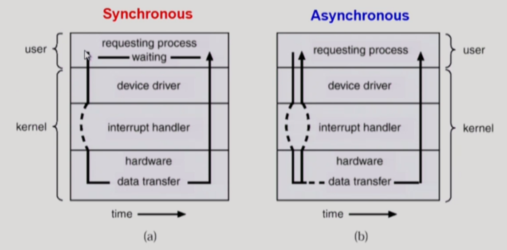
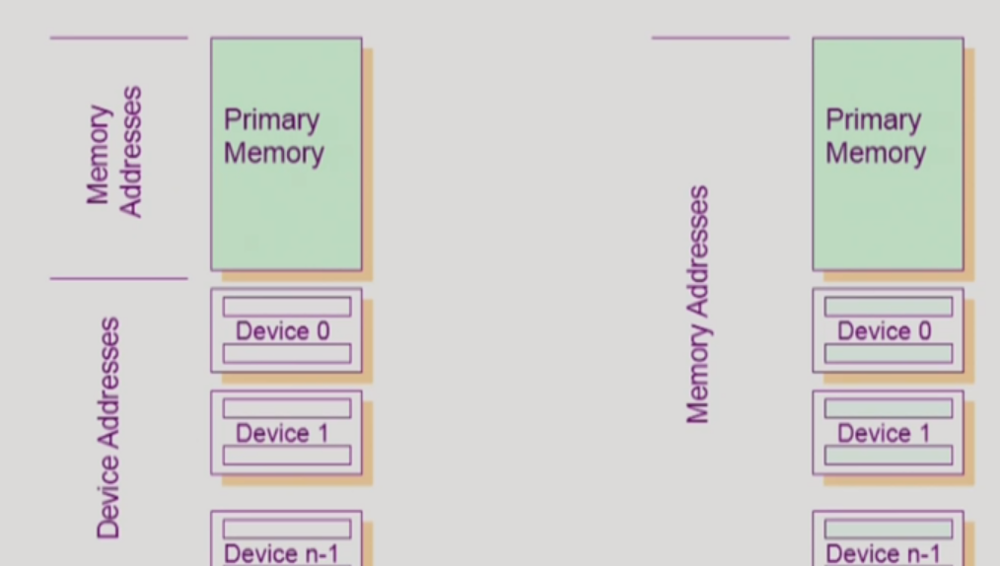
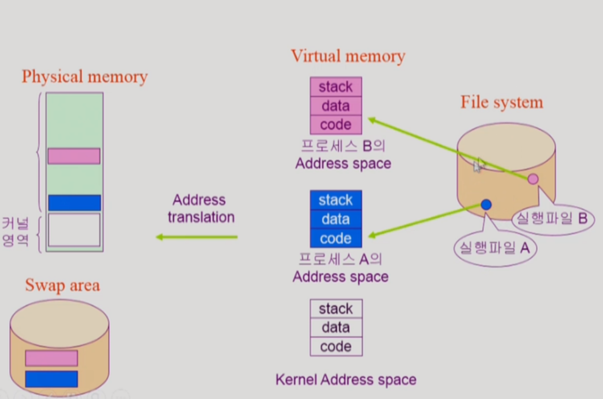
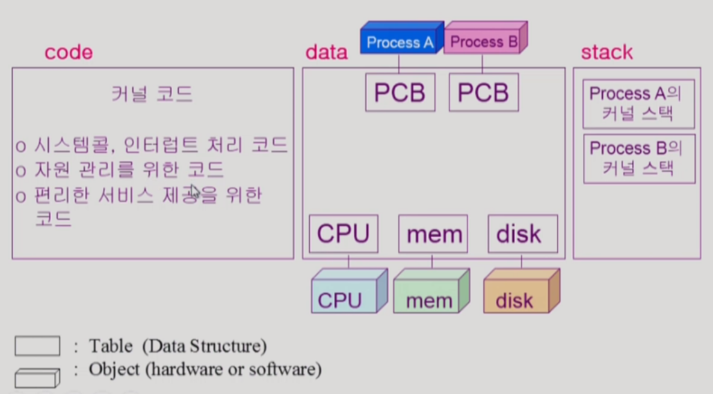
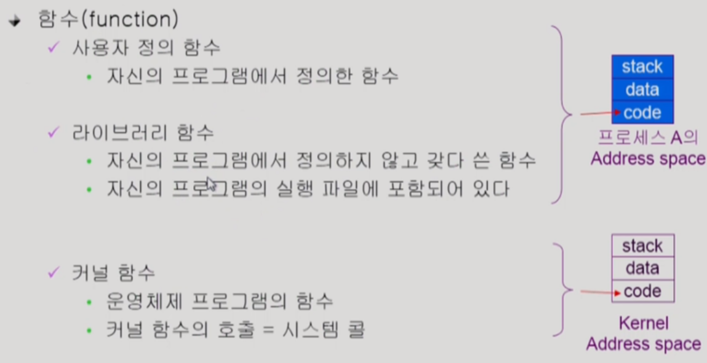
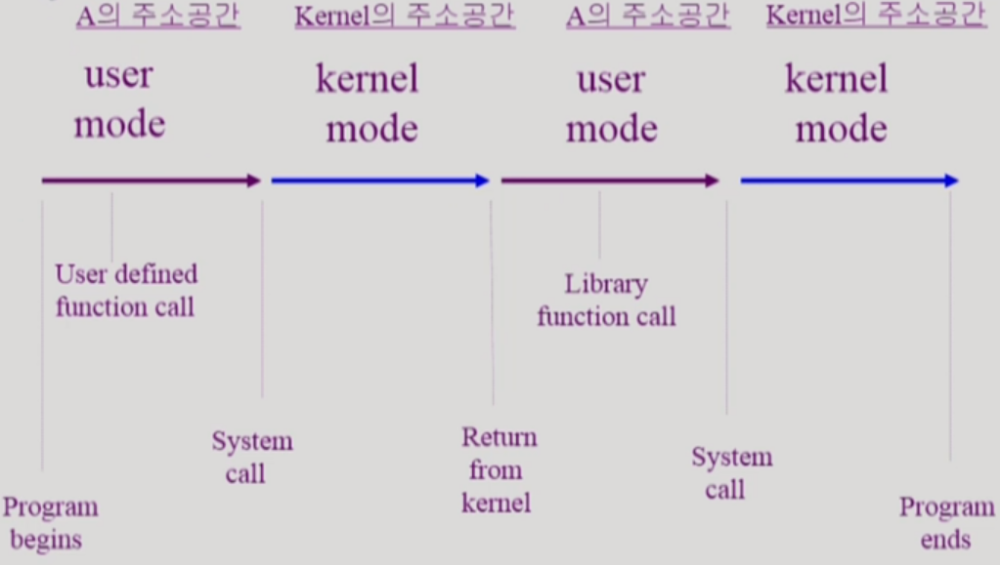

## 동기식 입출력과 비동기식 입출력

### 1. 동기식 입출력 (synchronous I/O)

* I/O 요청 후 입출력 작업이 완료된 후에야 CPU 제어권이 사용자 프로그램에게 넘어가는 것을 의미한다. 

* 구현 방법 1
  * I/O가 끝날 때까지 CPU를 낭비시킨다.
  * 매 시점 하나의 I/O만 일어날 수 있다. (I/O 장치도 낭비)

* 구현 방법 2
  * I/O 요청 후 I/O가 완료될 때까지 해당 프로그램에게서 CPU를 빼앗는다.
  * I/O 처리를 기다리는 줄에 해당 프로그램을 줄 세운다.
    * ex) A 프로그램 I/O 작업을 줄 세우고 B 프로그램에 CPU를 할당했는데 B도 I/O를 요청하면, B 프로그램 I/O 작업도 줄 세우고 C 프로그램에 CPU를 할당한다. (∴ CPU도 I/O도 끊김 없이 자신의 작업을 계속하게 된다.)
  * 다른 프로그램에게 CPU를 준다.

###  2. 비동기식 입출력 (asynchronous I/O)

* I/O가 시작된 후 입출력 작업이 끝나기를 기다리지 않고 CPU 제어권이 I/O를 요청한 해당 사용자 프로그램으로 다시, 즉시 넘어가는 것을 의미한다.

* 동기식 / 비동기식 입출력의 흐름

  

​    

## DMA (Direct Memory Access)

* 빠른 입출력 장치(ex. 1바이트 혹은 2바이트의 키보드 타이핑이 지속적으로 있을 때)를 메모리에 가까운 속도로 처리하기 위해 사용한다.
* CPU의 중재 없이 device contorller가 device의 buffer storage 내용을 block(page) 단위로 메모리에 직접 전송한다.
* 바이트 단위가 아닌 block(혹은 page) 단위로 인터럽트를 발생시킨다.
* 다시 말해, DMA에 의해 device가 메모리에 직접 내용을 카피해두고, block 단위로 모아서 CPU에 한 번 인터럽트를 걸어 I/O 작업이 끝났음을 알린다.

​    

## 일반 I/O와 Memory Mapped I/O에서의 입출력 Instruction 차이

* 일반 I/O (좌) & Memory Mapped I/O (우)

  

* CPU에서 실행할 수 있는 Instruction에는 메모리에 접근하는 것과 I/O device에 접근하는 것이 있다.
  * 일반 I/O : Memory addresses + Device addresses
  * Memory Mapped I/O : I/O device에도 메모리 주소를 매겨 Memory에 접근하는 Instruction을 사용해 I/O할 수 있다.

​    

## 저장장치 계층 구조

* CPU가 접근 가능한 저장장치를 Primary(Executable) Storage, 접근 가능하지 않은 장치를 Secondary Storage라고 한다. Primary Storage에는 Registers, Cache Memory, Main Memory 등이 있고 Secondary Storage에는 Magnetic Disk, Optical Disk, Magnetic Tape 등이 있다.

* 캐싱(Caching) : 보다 빠른 저장장치로 당장 필요한 정보를 읽어 들여서 사용하는 것을 말한다. 보다 느린 저장 장치에서 모든 것을 다 읽어 들이진 못하지만, 한 번 읽어 놓으면 다시 사용하기 편리하기 때문에, 캐싱의 주 목적은 보통 재사용성에 둔다. 또한, 빠른 저장장치는 저장 공간에 한계가 있으므로 기존에 있던 것 중 어떤 것을 제외시킬지는 캐싱의 이슈 중 하나이다.

​    

## 프로그램의 실행 (메모리 load) 

* 프로그램 실행 과정

  
  * 프로그램은 File system(ex. 하드디스크)에 '**실행파일**'의 형태로 존재한다. 실행파일을 실행하면 '**프로세스**'가 되어 **물리적 메모리(****Physical memory)**에 올라간다.
  * 실행파일은 실행되면 곧바로 물리적 메모리로 가지 않고 **가상 메모리(Virtual memory)**라는 중간 단계를 거친다. 어떤 프로그램이 실행되면 0번지부터 시작되는 그 프로그램만의 독자적인 **메모리 주소 공간(Address space)**가 형성되는데, 각 주소 공간은 ① CPU에서 실행할 기계어가 담기는 **code**, ② 변수 혹은 전역변수 등 프로그램이 사용하는 자료구조가 담긴 **data**, ③ 함수 호출 및 return할 때 어떤 data를 쌓았다가 꺼내가는 용도인 **stack** 영역이 존재한다. 모든 프로그램은 각자의 주소 공간을 물리적 메모리에 올려 스스로를 실행시킨다.
  * 컴퓨터 부팅 시 **커널(운영체제)은 물리적 메모리에 올라가 항상 상주**하는 반면, **사용자 프로그램들은 실행 시 주소 공간이 생겼다가 종료 시 사라지는 과정**을 가진다. 또한, 프로그램은 실행될 때 해당 주소 공간의 모든 것이 아닌 **가장 필요한 부분(ex. A 함수 실행 중이면 그에 필요한 코드)만 물리적 메모리에 올린다**. (∵ 메모리 낭비를 피하기 위해서) 또한, 해당 부분이 필요 없게 되면 물리적 메모리에서 제외하지만, 프로그램이 종료 전까지 보관이 필요한 경우라면 물리적 메모리 제외와 동시에 하드 디스크의 Swap area로 보낸다.
  * 각 프로그램들이 가지는 주소 공간은 물리적, 연속적으로 할당된 것이 아닌 머릿속에만 존재하는 개념이라 총칭해 가상 메모리라고 부른다. 실제로 가상 메모리의 주소 공간은 연속적으로 할당되지 않고 어떤 부분은 물리적 메모리에 어떤 부분은 Swap area에 나뉘어 존재한다. 
  * 따라서, **가상 메모리**는 **각 프로그램마다 독자적으로 가지고 있는 메모리 주소 공간**을 의미한다. 하지만 경우에 따라, 메인 메모리의 연장 공간으로 하드 디스크를 사용하는 기법(swapping)을 의미하기도 한다.

  > File system의 하드디스크 내용은 컴퓨터를 꺼도 유지되지만, Swap area의 하드디스크 내용은 메모리의 연장 공간이어서 컴퓨터를 끄면 프로세스 종료와 더불어 메모리 내용이 사라지고 Swap area의 내용도 의미가 없어진다.

  > 가상 메모리의 주소(ex. 1000번지)를 물리적 메모리의 주소(ex. 3000번지)로 변환해주는 과정을 address translation이라고 하는데, 이 과정은 특정 하드웨어의 지원을 받아 이루어진다.

​    

## 커널 주소 공간의 내용

* 물리적 메모리의 커널 영역

  

* PCB (Process Code Block) : 메모리에 올라온 프로그램을 관리하기 위한 자료구조 (ex. CPU를 얼마나 썼는지, 다음은 어떤 프로그램에게 얼마나 메모리를 줘야 하는지 등을 결정하는데 이용)

* stack : 커널 함수 호출 및 return을 위해 존재하며, 어떤 프로그램이 어떤 함수를 이용하는지 알기 위해 각 프로그램마다 커널 스택을 따로 둔다.

​    

## 사용자 프로그램이 사용하는 함수

* 모든 프로그램은 어떤 언어를 사용해서 만들었든 함수로 짜여 있다. low-level, 심지어 컴파일해서 기계어 단위의 instruction으로 가더라도 함수 구조에 대한 내용을 확인할 수 있다.

* 사용자 프로그램이 사용하는 함수의 종류

  

* 컴파일하여 나의 프로그램의 실행 파일을 만들면, 실행 파일에는 사용자 정의 함수든 라이브러리 함수든 모두 코드에 포함되어 있다. 반면, 커널 함수는 내 실행 파일에 커널 함수 코드(정의)가 포함되어 있지 않고 시스템 콜을 통한 호출에 의해 접근해서 사용한다.

​    

## 프로그램의 실행 (A라는 프로그램의 관점에서)

* 프로그램의 실행 과정

  
* 위와 같이 프로그램은 시작부터 종료까지 user mode와 kernel mode를 반복한다.

​    

## Reference

[운영체제, 이화여대 반효경 교수님](http://www.kocw.net/home/search/kemView.do?kemId=1046323)