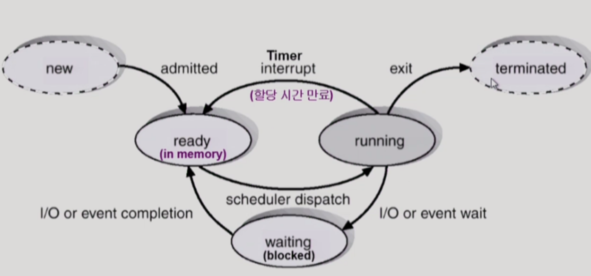
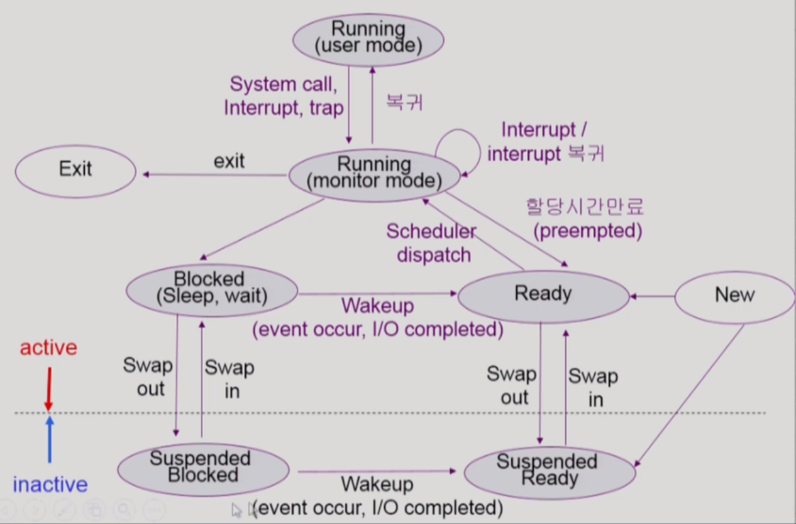
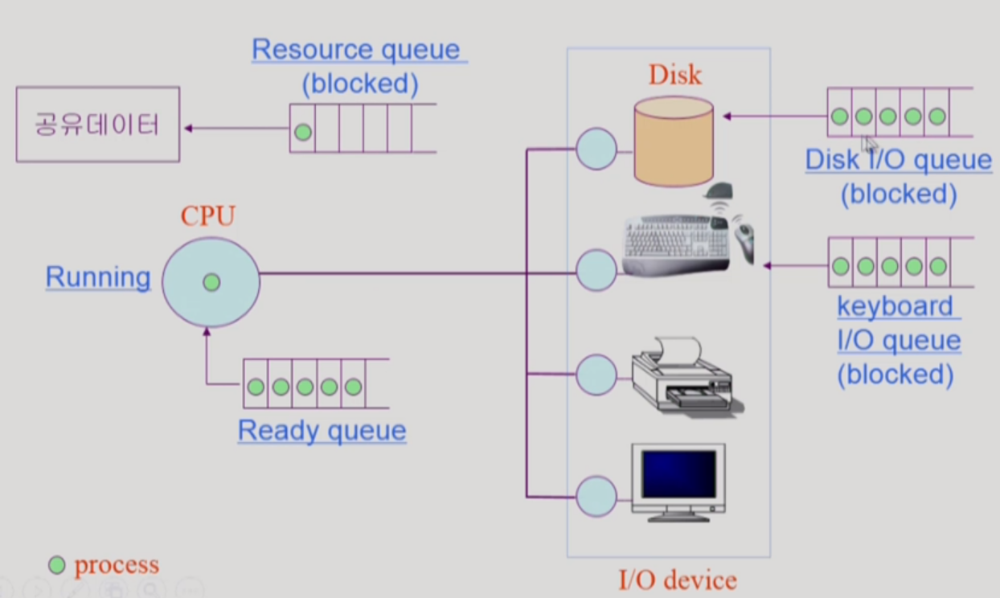
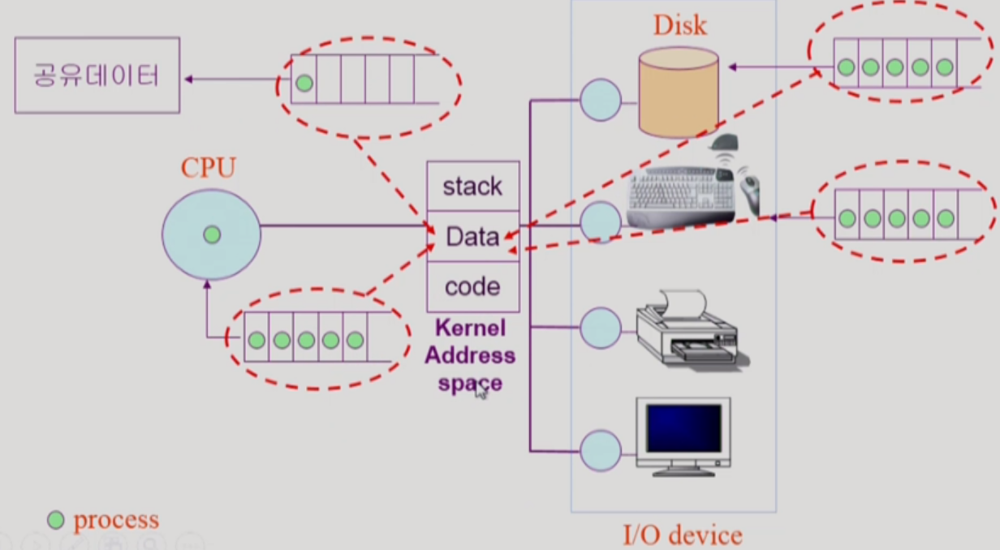
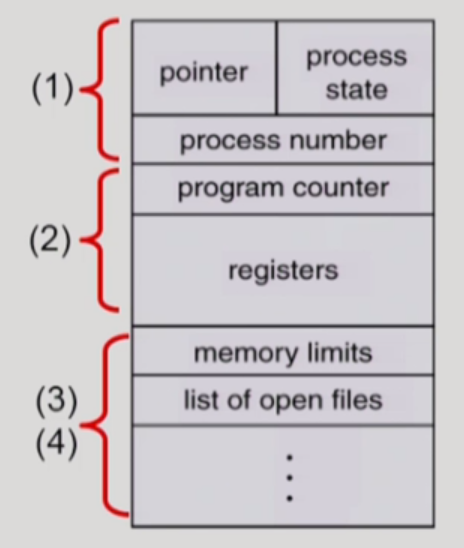
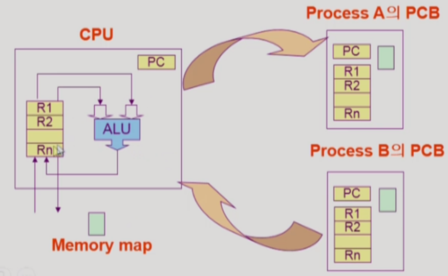
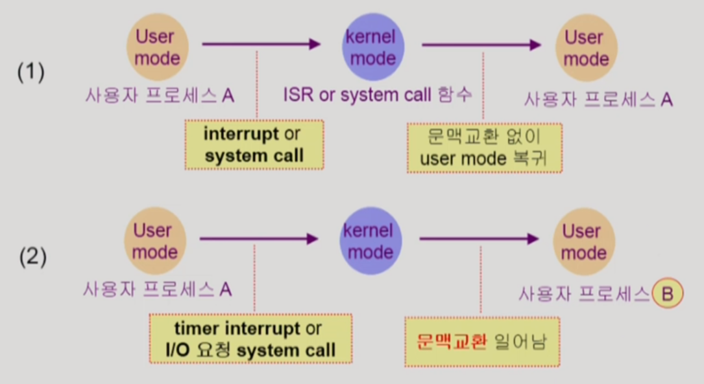

## 프로세스(Process)의 개념

### 1. 프로세스

* 실행중인 프로그램을 의미한다.

###  2. 프로세스의 문맥(Context)

* 프로세스의 현재 진행 상태를 알려주는 것
  * time sharing, multitasking 등의 실현은 각 프로세스의 문맥을 정확히 기록해두어야 가능하다!

* 하드웨어 문맥 : CPU의 수행 상태를 나타냄
  * ex) Program Counter, 각종 register → **CPU 관점**에서 파악!

* 프로세스의 주소 공간 : 어떤 자료구조가 어떤 값을 가지고 있는지, 어떤 함수가 호출되고 return되는지 등을 파악함
  * ex) code, data, stack → **메모리 관점**에서 파악!

* 프로세스 관련 커널 자료 구조
  * ex) PCB(Process Control Block), Kernel stack(프로세스마다 다른 커널 스택을 가지기에 개별로 상태 파악 가능) → **운영체제 관점**에서 파악! (운영체제가 프로세스를 어떻게 평가하는지)

​     

## 프로세스의 상태 (Process State)

* **Running** : CPU를 잡고 Instruction을 수행 중인 상태

* **Ready** : 메모리에 올리는 것 등 다른 조건을 모두 만족하고 CPU를 기다리는 상태

* **Blocked** **(wait, sleep)** : CPU를 주어도 당장 Instruction을 수행할 수 없는 상태
  * ex) 프로세스 자신이 요청한 event(ex. I/O)가 즉시 만족되지 않아 기다리는 상태, 프로세스 주소 공간 중 필요한 부분이 메모리에 아직 올라와 있지 않을 때 등

* 현대 컴퓨터에 **중기 스케줄러의 등장**으로 추가된 상태
  * **Suspended (stopped)** : 외부적 이유로 프로세스의 수행이 정지된 상태. 프로세스는 통째로 디스크에 swap out된다. 
    * ex) 메모리에 너무 많은 프로그램이 올라와 있을 때 (by 중기 스케줄러), 사용자가 프로그램을 일시 정지시킨 경우 

> Blocked : 자신이 요청한 event가 만족되면 Ready

> Suspended : 외부에서 resume해 주어야 Active

* 있을 수도 없을 수도 있는 상태
  * New : 프로세스가 생성 중인 상태
  * Terminated : 수행(Execution)이 끝난 상태

* 프로세스의 상태도

  

* 프로세스 상태도 - suspended 상태 추가

  
  * 위의 프로세스 상태도는 운영체제의 입장에서 프로세스 상태를 명시한 것이다. 따라서, monitor mode에서도 운영체제가 running하고 있다고 말하지 않고, **사용자 프로세스가 Running 상태에 있다**고 말한다. 또한, interrupt 혹은 system call을 진행 중일 때, **사용자 프로세스는 (커널모드 혹은 유저모드에서) Running 상태에 있다**고 간주한다.
  * Suspended 상태의 경우, 외부적인 이유로 메모리에서 벗어나 있는 상태로서 **inactive**하다고 말하고, Blocked에서 벗어났느냐 Ready에서 벗어났느냐에 따라 **Suspended Blocked**, **Suspended Ready**로 나뉜다. 또한, Suspended Blocked 상태에서 이전에 요청한 I/O 작업이나 event가 마무리되면 **Suspended Blocked이 Suspended Ready로 바뀌기도 한다**.

* 프로세스 진행과 queue

  

* 커널 주소 공간의 자료구조 Queue

  
  * 위 상태도에서 나오는 하드웨어 및 CPU의 Queue들은 머릿 속에서는 모두 흩어져 있는 것으로 분류되지만, 사실은 모두 커널 주소 공간 중 Data 영역에서 queue 자료구조를 만들어 관리하는 것이다.

​    

## PCB (Process Control Block)

* 운영체제가 각 프로세스를 관리하기 위해 프로세스당 유지하는 정보

* PCB의 구조

  

​    

### PCB의 구성 요소 (구조체로 유지)

* OS가 관리상 사용하는 정보
  * ex) Process state, Process ID, scheduling information & priority

* CPU 수행 관련 하드웨어 값 (프로세스 문맥 정보)
  * ex) Program Counter, registers

* 메모리 관련 (프로세스 문맥 정보)
  * ex) code, data, stack의 위치 정보

* 파일 관련 (프로세스 문맥 정보)
  * ex) open file descriptors

​    

## 문맥 교환 (Context Switch)

* CPU를 한 프로세스에서 다른 프로세스로 넘겨주는 과정

* 문맥 교환 흐름

  
  * 위 그림의 프로세스 A가 프로세스 B에게 CPU를 넘겨줄 때, 운영체제는 정확히 그 시점부터 프로세스 A가 다시 시작할 수 있게 프로세스 A의 PCB에 레지스터들의 저장된 값, Program Counter 값, 메모리 위치 정보 등을 저장한다. 새롭게 CPU를 얻게 되는 프로세스 역시 운영체제가 해당 프로그램의 PCB에서 상태를 읽어와 저장된 시점부터 다시 작업을 수행한다.

* 문맥 교환이 일어나는 경우와 아닌 경우

  
  * System call이나 Interrupt 발생 시 항상 문맥 교환이 일어나진 않는다. 보통은 위 그림의 (1)의 경우처럼 원래 작업 중이던 프로세스에게 다시 CPU 제어권을 넘겨 timer가 정한 시간에 도달할 때까지 작업을 수행하게 한다. 그러나 timer가 정한 시간이 다 되거나 I/O 요청으로 인해 프로세스가 blocked 상태가 되는 (2)의 경우에는 문맥 교환이 발생한다.

    > 물론 (1)의 경우에도 커널 code를 실행하기 위해 CPU 수행 정보 등 약간의 context를 PCB에 저장해야 되지만 문맥 교환만큼 부담이 크지 않다.

  * ex) Cache memory flush(캐시 메모리를 비우는 것)는 overhead가 큰데, 문맥 교환 시에는 이러한 캐시 메모리를 비워야 하는 반면, 단순한 커널모드와 유저모드 사이의 변환에서는 캐시 메모리를 비울 필요까지는 없다.

​    

## 프로세스를 스케줄링하기 위한 큐 (Queue)

* Job queue : 현재 시스템 내에 있는 모든 프로세스의 집합 (Ready queue와 Device queue의 프로세스를 포함)

* Ready queue : 현재 메모리에 있으면서 CPU를 잡아 실행되기를 기다리는 프로세스의 집합 (혹은 줄)

* Device queue : I/O device의 처리를 기다리는 프로세스의 집합 (혹은 줄)

​    

## 스케줄러

### Long-term scheduler (장기 스케줄러 or job scheduler)

* 시작 프로세스 중 어떤 것에게 **memory**를 주고 **ready queue**로 보낼지 결정한다.

* degree of Multiprogramming(메모리에 올라가 있는 프로세스의 수)을 제어
  * 메모리에 올라가 있는 프로그램 수가 너무 많아도 너무 적어도 안좋다.

* **그러나 현대의 대부분 컴퓨터의 time sharing system에서는 사용하지 않는다.** (무조건 메모리에 프로세스를 올린다. = ready)

### Short-term scheduler (단기 스케줄러 or CPU scheduler)

* 어떤 프로세스에게 **CPU**를 주고 **running** 상태로 만들지 결정한다. 
* 빠른 속도 (millisecond 단위)

### Medium-term scheduler (중기 스케줄러 or Swapper)

* 메모리 여유 공간을 마련하기 위해 메모리에 있는 프로세스를 통째로 디스크로 쫒아낸다.
* Long-term scheduler를 대신해 현대 컴퓨터의 degree of Multiprogramming을 제어 (프로그램은 실행 시 무조건 메모리에 올라가므로 **어떤 것을 쫒아낼지가 이슈**가 된다.)

