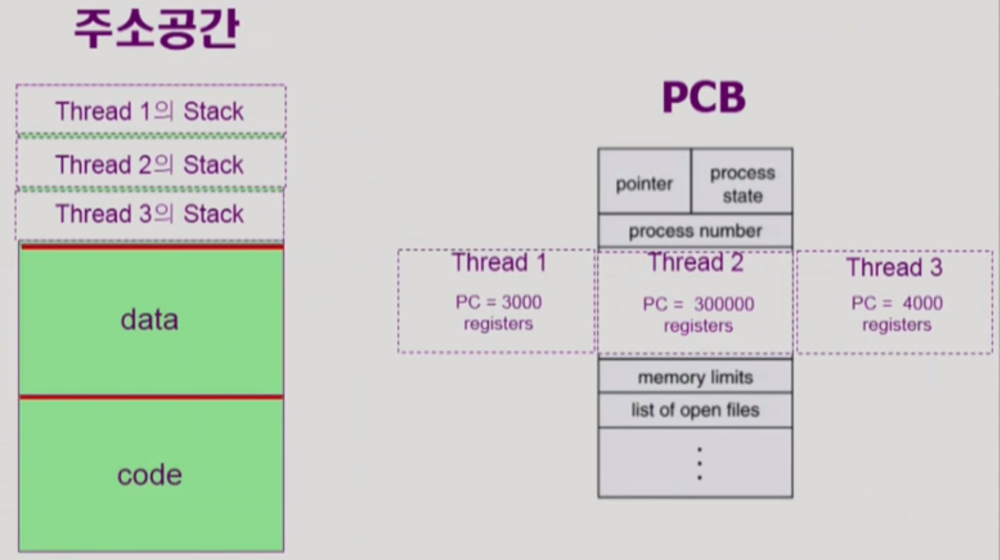

## Thread (= lightweight process) (↔ heavyweight process, 전통적인 개념의 프로세스)

**하나의 프로세스 내부에 CPU 수행 단위를 여러 개 두는 것**을 말한다. 각각의 스레드는 CPU 수행과 관련된 정보만 제외하고 프로세스의 모든 것을 공유한다.

동일한 일을 수행하는 프로세스를 여러 개 띄워 놓고 싶다면, 하나의 주소 공간에 여러 개의 스레드를 사용하는 것이 효율적이다. 따라서, Program Counter를 여러 개 두고 register의 값들을 별도로 기억해두어 각각의 스레드가 스스로에게 필요한 code를 실행하게끔 한다. 함수 호출 및 return과 관련해서 stack도 스레드마다 따로 둔다.

* 스레드의 구성

  

### 1. Thread의 구성

* program counter

* register set

* stack space

### 2. Thread가 동료 thread와 공유하는 부분 (=task)

* code section

* data section

* OS resources

### 3. Thread의 장점

* Responsiveness(=빠른 응답성)
  * 다중 스레드 태스크 구조에서는 하나의 서버 스레드가 blocked(waiting) 상태인 동안에도 동일한 태스크 내의 다른 스레드가 실행(running)되어 빠른 처리가 가능하다.
  * ex) 웹페이지를 읽어오는 작업(I/O)이 오래걸리면 웹브라우저는 아무것도 못하는 blocked 상태가 된다. 반면에, 여러 개의 스레드로 웹브라우저를 만들면, 그림을 불러오는 작업이 오래 걸리더라도 다른 빠른 작업들을 먼저 화면에 보여줄 수 있다. (일종의 비동기식 입출력)

* Resource Sharing
  * 메모리 자원을 효율적으로 사용할 수 있다. (자원 절약)

* Economy
  * Thread를 Creating & CPU switching(문맥교환)하는 것은 process의 그것보다 훨씬 overhead가 작다.
  * 동일한 일을 수행하는 다중 스레드가 협력하여 높은 처리율(throughput)과 성능 향상을 얻을 수 있다.

* Utilization of MP Architectures (CPU가 여러 개 달린 컴퓨터(Multi-Processor)에서만 해당)
  * 병렬성을 높일 수 있다.
  * ex) 행렬 곱셈 작업을 각 스레드가 다른 CPU에서 서로 다른 행과 열을 병렬로 계산 가능

### 4. Thread 구현 방법

* Kernel Threads
  * **Kernel**에 의해 지원된다. **스레드가 여러 개 있다는 사실을 운영체제가 알고** 있어서 하나의 스레드가 다른 스레드에게 CPU를 넘기는 작업도 운영체제가 CPU 스케줄링하듯 진행한다.

* User Threads
  * **Library**에 의해 지원된다. 프로세스 안에 **여러 개의 스레드가 있다는 사실을 운영체제가 모르고** 유저 프로그램 스스로 여러 개의 스레드를 관리한다. 따라서, 구현 상의 제약이 더 있을 수 있다.

* 몇몇의 real-time threads