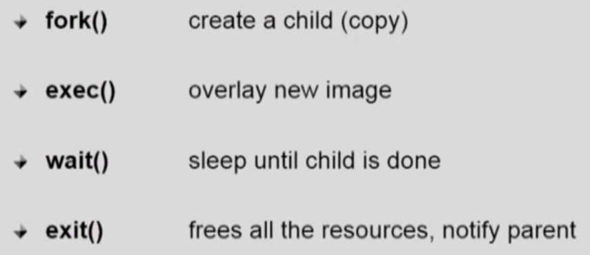
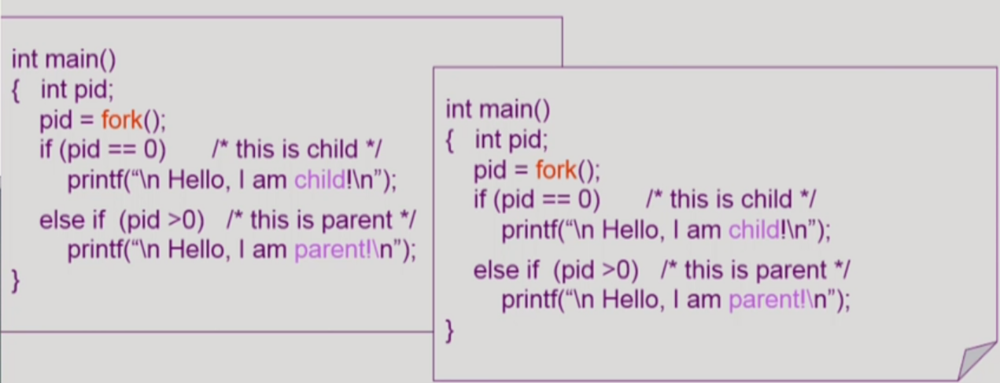
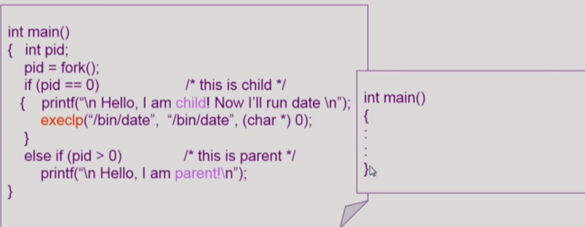
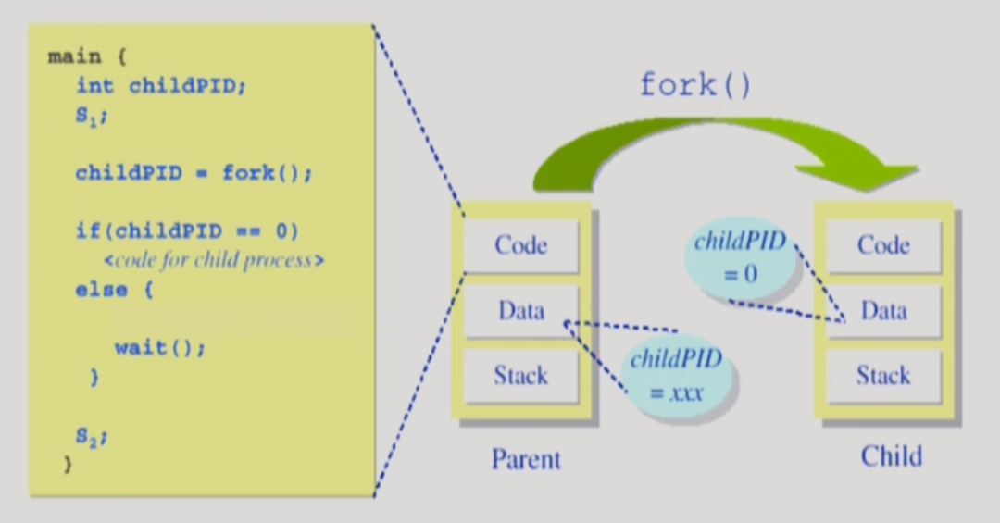
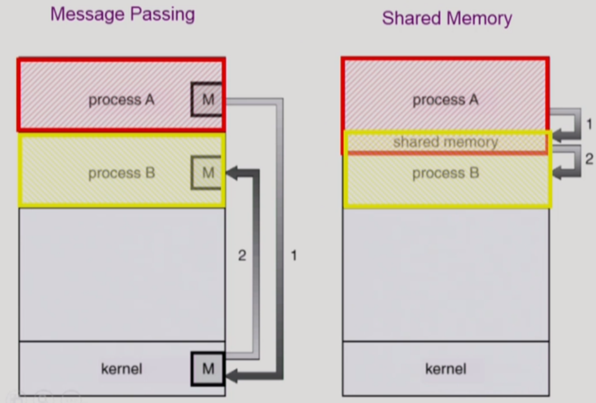

## 프로세스의 생성, 실행 및 종료에 관한 시스템 콜

* 프로세스 관리 시스템 콜 정리

​    

### 1. fork() 시스템콜

위 그림의 두 코드는 부모 프로세스(좌), 자녀 프로세스(우)이다. 처음 부모 프로세스가 코드를 수행하다가 fork 시스템 콜을 만나면, 부모 프로세스를 똑같이 복사해 자녀 프로세스를 만들고 이후 명령을 계속 실행한다. 자녀 프로세스는 부모 프로세스의 Program Counter를 그대로 복제했기 때문에, 부모 프로세스와 마찬가지로 fork의 바로 밑 코드부터 실행한다.

또한, 부모 프로세스는 fork의 return 값으로 양수, 자녀 프로세스는 0을 pid에 취해 서로를 구분한다.    

### 2. exec() 시스템콜

fork로 복사한 프로세스를 다른 프로그램으로 다시 덮어쓰기 위해 exec 시스템콜을 사용한다. 위와 같은 경우는 execlp 함수를 만나면, exec 시스템 콜이 발생해 복사한 자녀 프로세스에 새로 date 파일을 덮어써 실행하게 된다. 따라서, date가 실행되면 위 그림에 보이는 원래의 자녀 프로세스의 코드로는 다시 돌아갈 수 없다.

### 3. wait() 시스템콜

부모 프로세스가 wait 시스템 콜을 걸면, 부모 프로세스는 자식 프로세스가 종료될 때까지 blocked 상태가 된다. 자식 프로세스가 종료되면 부모 프로세스는 위 그림 처럼 wait 뒤에 있는 S2 코드를 계속 실행한다. (자식이 종료될 때까지 부모가 기다리는 모델에 해당)

ex) 쉘 프롬프트의 커서가 깜빡이는 상태에서 프로그램을 실행 시 자식 프로세스 형태로 실행되고, 쉘 프롬프트 프로그램은 부모 프로세스로서 자식 프로세스가 종료될 때까지 기다렸다가(blocked 상태) 다시 실행된다.

### 4. exit() 시스템콜

* 자발적 종료
  * 마지막 statement 수행 후 exit() 시스템 콜을 통해 이루어진다. 프로그램에 명시적으로 적어주지 않아도 main 함수가 리턴되는 위치로 컴파일러가 넣어준다.

* 비자발적 종료
  * 부모 프로세스가 자식 프로세스를 강제 종료 시킬 때

    ex) 자식 프로세스가 한계치를 넘어서는 자원을 요청할 때, 자식에게 할당된 태스크가 더 이상 필요하지 않을 때

  * 부모가 종료될 때 (프로세스는 항상 자식이 먼저 종료되고 부모가 종료됨)

  * 키보드로 kill, break 등을 칠 때

​    

## 프로세스 간 협력

* 독립적 프로세스
  프로세스는 각자의 주소 공간을 가지고 수행되므로 **원칙적으로 하나의 프로세스는 다른 프로세스의 수행에 영향을 미치지 못한다.**

* 협력 프로세스
  어떤 경우에는 프로세스 협력 메커니즘을 통해 하나의 프로세스가 다른 프로세스의 수행에 영향을 미치며 서로 정보를 교환하는 것이 효율적일 수 있다.

* 프로세스 간 협력 메커니즘 (IPC: Interprocess Communication)

  

* massage passing : 커널을 통해 메시지를 전달한다. (프로세스들끼리 직접은 불가능하다.)
  * Message system : 프로세스 사이에 공유 변수를 일체 사용하지 않고 통신하는 시스템
  * Direct Communication : 통신하려는 프로세스의 이름을 명시적으로 표시
  * Indirect Communication : mailbox(혹은 port)를 통해 메시지를 간접 전달 (프로세스 이름을 명시하지 않으므로 다른 프로세스가 열어볼 수 도 있음)

* shared memory : (원칙적으로는 안되지만) 서로 다른 프로세스 간에도 일부 주소 공간을 공유하게 하는 메커니즘

​    

> Thread는 하나의 프로세스이므로 프로세스 간 협력으로 보기에는 어렵다!