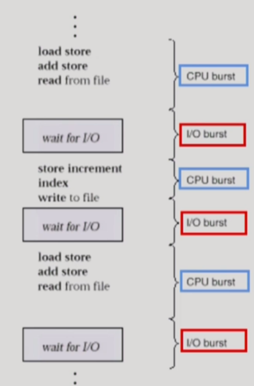
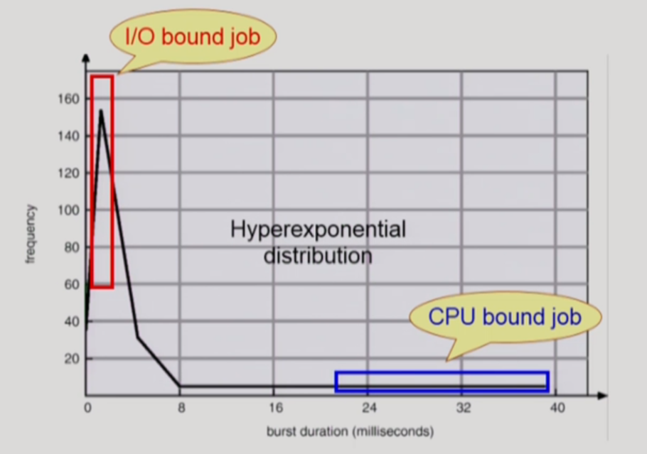
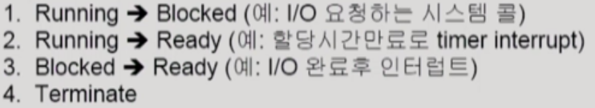
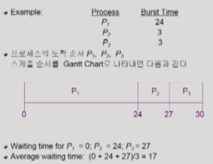
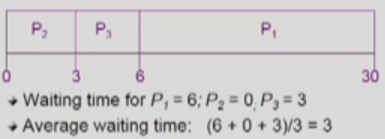
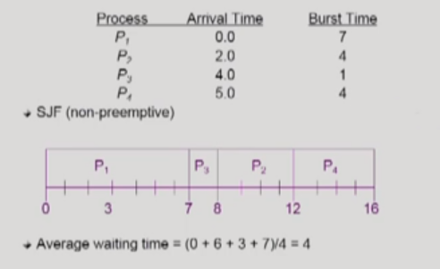
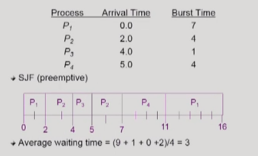
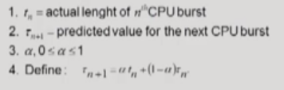
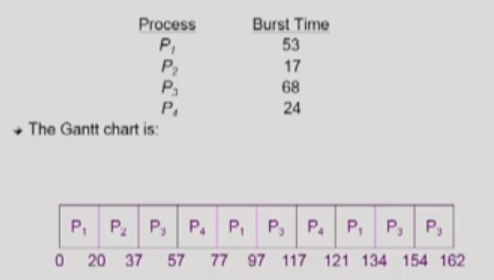

## CPU Burst & I/O Burst

어떤 프로그램이 실행된다는 것은 CPU Burst와 I/O Burst가 번갈아 가며 일어나는 것을 의미한다. 프로그램의 종류에 따라 두 Burst의 빈번함이 다를 수 있는데, ① 사용자 관여가 많은 (키보드 입력, 모니터 출력 등이 잦은) 프로그램(interactive job)은 CPU Burst 시간이 짧아지면서 두 Burst가 번갈아 빈번히 나타나고, ② 과학 계산용 프로그램 같은 연산 시간이 긴 프로그램은 CPU Burst 시간이 길어지면서 I/O 비중이 크게 줄어든다.

위 그래프는 CPU Burst 시간과 그 빈도에 따라 프로그램들을 분류한 것인데, CPU Burst 시간이 짧을수록 프로그램의 CPU Burst 빈도가 잦음을 알 수 있다. 이 같이 **CPU를 잡고 계산하는 것보다 I/O에 더 많은 시간을 사용하는 프로그램들을 I/O bound job**이라고 하며, 반대로 **계산 위주로 구성된 프로세스는 CPU bound job**이라고 부른다.

여러 종류의 job(=process)이 섞여 있기 때문에, 그들을 적절한 CPU Scheduling이 필요하다.

→ CPU bound job이 CPU를 너무 오래 사용하면 효율성이 떨어지므로, **I/O bound job(=Interactive한 job)에게 우선적으로 CPU를 주도록 지향하는 것이 CPU Scheduling의 주요한 목표**이다.

​    

## CPU Scheduler & Dispatcher

### 1. CPU Scheduler

운영체제의 여러 코드 중 CPU schedule 기능을 담당하는 **코드**를 지칭하는 용어다.

Ready 상태의 프로세스 중 어떤 프로세스에게 CPU를 줄 지 결정한다.

### 2. Dispatcher

역시 운영체제의 여러 코드 중 특정 **코드**를 지칭하는 용어다.

CPU 제어권을 CPU scheduler에 의해 선택된 프로세스에게 넘긴다. 이 과정을 문맥 교환(Context Switch)이라고 한다.

> CPU Scheduling이 필요한 경우
>
> 
>
> * 1, 4의 스케줄링은 **nonpreemptive**(=자진 반납, **비선점형**), 나머지 모든 스케줄링은 **preemptive**(=강제로 뺏음, **선점형**, 대부분의 현대적인 CPU 스케줄링에서 사용)
> * 3의 경우 일반적으로 원래 CPU를 점유하던 프로세스에게 timer가 끝날 때까지 CPU를 다시 쓰게 하지만, 만약 우선순위가 가장 높은 프로세스의 I/O가 완료된 것이었다면 해당 프로세스에게 CPU를 바로 넘기게 된다.

​    

## Scheduling Criteria (CPU 스케줄링 성능 척도)

### 1. 시스템 입장에서의 성능 척도

: CPU 하나로 최대한 일을 많이 시키자!

* CPU utilization (이용률) : 전체 시간 중 CPU가 놀지 않고 일한 시간의 비율

* Throughput (처리량) : 주어진 시간 동안 완료한 작업(process)의 수

### 2. 프로그램 입장에서의 성능 척도

: 내가 CPU를 빨리 얻어서 내가 빨리 끝나는 게 중요! 

* Turnaround Time (소요시간, 반환시간) : CPU를 사용하기 위한 대기시간을 포함해 CPU를 사용완료하고 빠져나갈 때까지 걸린 총 시간 (다른 프로세스와 번갈아 CPU를 사용하게 되어도 그 모든 시간을 합하여 계산한다.)

  > 프로세스가 CPU를 쓰러 대기열에 들어와서 CPU를 사용하고 I/O하러 나갈 때까지의 시간
  >
  > ex) 중국집 손님이 코스요리를 시켰을 때, 중국집에 들어와서 요리를 기다리고 먹고를 반복하다가 다 먹고 나갈 때까지의 모든 시간 

* Waiting Time (대기시간) : Ready queue에서 대기하며 걸린 순수한 시간

  > CPU Burst와 I/O Burst가 번갈아 반복된다면, 그동안 생긴 여러 번의 대기 시간을 모두 합하여 계산하는 것이 아래의 Response Time과의 차이점이다.
  >
  > ex) 손님이 코스요리 음식을 기다린 모든 시간

* Response Time (응답시간) : Ready queue에 들어와서 처음 CPU를 얻기까지 걸린 시간 (∝ time sharing)

  > ex) 첫 번째 음식이 나올 때까지 기다린 시간

​    

## CPU Scheduling Algorithm

### 1. FCFS (First-Come First-Served) - nonpreemptive (비선점형)

먼저 들어온 프로세스를 먼저 처리한다. 먼저 들어온 프로세스가 CPU bound job일 경우 처리 시간이 길어지므로, 효율적인 스케줄링은 아니다.

* ex 1) 0초 대에서 프로세스들이 간발의 차이로 P1, P2, P3 순으로 들어왔을 때

* ex 2) 0초 대에서 프로세스들이 간발의 차이로 P2, P3, P1 순으로 들어왔을 때

FCFS는 ex 1과 ex 2의 waiting time 같이 들어온 작업의 순서에 따라 결과 차이가 크게 나타나는 비효율성이 있다. 이처럼 작업 시간이 긴 프로세스에 의해 작업 시간이 짧은 프로세스들이 실행되지 못하는 상황을 Convoy effect(호위 효과)라고 한다.    

### 2. SJF (Shortest-Job-First)

CPU Burst가 짧은 프로세스에게 CPU 제어권을 제일 먼저 스케줄한다. 이 때, 각 프로세스의 다음 번 CPU Burst time을 고려하여 스케줄링에 활용한다.

* Nonpreemptive SJF

  일단 CPU를 잡으면 해당 프로세스의 CPU Burst가 완료될 때까지 CPU를 선점(preemption)당하지 않는다.

  → 프로세스가 CPU를 다 사용하고 나가는 시점에 CPU 스케줄링을 결정

  ex) 

  

* Preemptive SJF (SRTF = Shortest-Remaining-Time-First)

  현재 수행 중인 프로세스의 남은 burst time보다 더 짧은 CPU burst time을 가지는 새로운 프로세스가 도착하면 CPU를 빼앗는다. 주어진 프로세스들에 대하여 **minimum average waiting time을 보장**한다. (어떤 알고리즘도 이 waiting time 보다 빠를 수 없다.)

  → 새로운 프로세스가 들어올 때와 프로세스가 빠져 나갈 때, 두 가지 시점에서 CPU 스케줄링이 이뤄진다.

  ex)

* SJF의 문제점
  * Starvation (기아 현상) : 우선도가 낮은 프로세스(=CPU burst time이 긴 프로세스)는 영원히 실행되지 못할 수 있다.
  * CPU burst time의 추정 : CPU burst time은 추정만 가능하기에 실제 정확한 시간을 알고 SJF를 수행하기는 어렵다.

> CPU burst time 추정은 과거의 CPU 사용 흔적을 바탕으로 exponetial averaging 기법을 사용해 이뤄진다. 이 기법은 과거의 흔적일수록 덜 반영하고 최근 흔적일수록 많이 반영하는 흐름을 가진다.

### 3. Priority Scheduling

높은 우선 순위를 가지는 프로세스에게 CPU를 할당한다. 작은 정수가 high priority를 나타낸다. (SJF도 일종의 Priority Scheduling → priority = predicted next CPU burst time) 

* Nonpreemptive : CPU를 선점한 프로세스에게서 CPU를 빼앗지 않는다.

* Preemptive : 우선도에 따라 CPU를 빼앗긴다. (SJF 설명과 유사)

* Problem : Starvation (기아 현상)!!! 

  → Solution) Aging : 시간이 지남에 따라 우선도가 낮은 프로세스의 우선도를 높인다.

### 4. Round Robin (RR) - Preemptive (선점형), 현대적 CPU Scheduling

각 프로세스는 동일한 크기의 할당 시간(time quantum)을 가지며 이 할당 시간이 지나면 CPU를 선점당하고 ready queue의 제일 뒤로 가서 다시 줄을 선다.

* n개의 프로세스가 ready queue에 있고 할당 시간이 q time unit인 경우 각 프로세스는 최대 q time unit 단위로 CPU 시간의 1/n을 얻는다. (어떤 프로세스도 (n-1)q time unit 이상 기다리지 않는다.)

* RR의 특징
  * Response Time 빨라지는 장점
  * Waiting Time은 CPU burst time이 긴 프로세스일수록 길고 반대의 경우 짧음

* Performance
  * q large → FCFS

  * q small → context switch 오버헤드가 커진다.

ex) Time quantum이 20일 때

→ 일반적으로 SJF보다 average turnaround time이나 waiting time은 길어질 수 있지만 response time은 더 짧다. 또한, CPU 실행 시간이 동일한 프로세스들일 경우 RR이 비효율적일 수 있지만, 일반적으로는 CPU 실행 시간이 다르기 때문에 대부분에서 효율적이다.