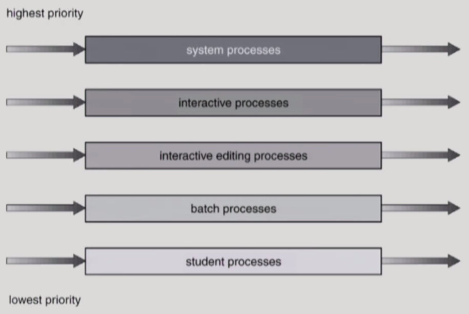
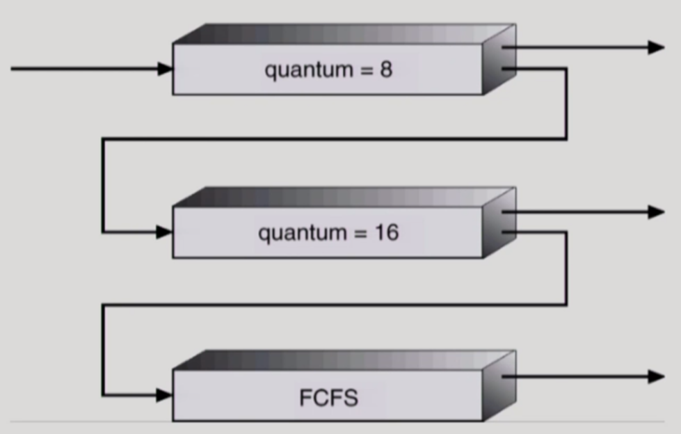

## Multi-level queue

* 우선도가 다른 ready queue

Ready queue를 **foreground(interactive)**와 **background(batch - no human interaction)**으로 분리한다. 그리고 foreground에는 **RR**, background에는 **FCFS** 등으로 각 큐에 독립적인 스케줄링 알고리즘을 설계한다. 또한 어떤 큐에게 CPU를 줄 지 (그 이후에는 큐에 있는 어떤 프로세스에게 CPU를 줄 지)결정하는 작업이 필요한데, 이를 **큐에 대한 스케줄링**으로 해결한다. **Fixed priority scheduling**은 우선도를 최우선으로 하여 우선도가 높은 foreground에게 먼저 scheduling하고 그 다음 background에게 주는 방식이다. 이 방식에서는 starvation이 단점이 될 수 있다. 이에 대한 대안으로 **Time Slice**가 있는데, 이 스케줄링은 각 큐에 CPU time을 적절한 비율로 할당한다. (ex. foreground에 80% background에 20% CPU time 분배)

​    

## Multi-level feedback queue

우선도가 높은 queue여도 상황에 따라 낮은 우선도 queue가 높은 우선도 queue보다 우선될 수 있다. Multi-level queue의 고정된 우선도라는 단점을 극복하기 위한 대안이다. 예를 들어, 들어오는 프로세스를 우선도가 가장 높은 queue에 줄 세우고 RR 방식을 사용하되, 우선도가 낮은 queue일수록 time quantum을 길게 준다. 그래서 time quantum 내에 프로세스가 완료되면 큐에서 내보내고, 완료되지 않았으면 다음으로 우선도가 높은 큐에 해당 프로세스를 줄 세운다. 이렇게 하면 CPU burst가 짧은 프로세스에 우선 순위를 더 많이 주고, CPU burst가 긴 프로세스의 우선도는 더 낮출 수 있다.

​    

## 특수한 상황에서의 CPU Scheduling

### 1. Multiple-Processor Scheduling (간략히 다룸)

* Homogeneous Processor라면

  Queue에 한 줄로 세워서 각 프로세서가 알아서 꺼내가게 할 수 있는가하면 어떤 프로세스는 특정 프로세서에서만 수행되어야 하는 경우가 존재하므로 이를 고려해야 한다.

* Load sharing

  일부 프로세서에 job이 몰리지 않게 하는 적절한 메커니즘이 필요하다. 모든 CPU가 공동 큐를 사용하는 방법 혹은 각각의 CPU마다 별개의 큐를 사용하는 방법이 있다.

* Symmetric Multiprocessing (SMP)

  각 프로세스가 각자 알아서 스케줄링을 결정한다.

* Asymmetric Multiprocessing

  하나의 프로세서가 시스템 데이터의 접근과 공유를 책임지고 나머지 프로세서는 그것에 따른다.

​    

### 2. Real-Time Scheduling

Time sharing과 달리 미리 스케줄링을 계획하고 데드라인이 보장되도록하는 방식

* Hard real-time systems

  정해진 시간안에 반드시 끝내도록 스케줄링하는 것

* Soft real-time computing (많이 쓰임)

  영화 스트리밍과 같이 time sharing 시스템에서 다른 일반적인 프로세스들과 섞여서 실행되지만, 일반 프로세스에 비해 높은 priority를 갖게해 데드라인을 지키도록 지향하는 스케줄링. (조금은 데드라인을 어기는 것이 허용됨)

​    

###  3. Thread Scheduling

* Local Scheduling

  User level thread의 경우 운영체제가 thread의 존재를 모르기 때문에, 사용자 수준의 thread library에 의해 어떤 thread를 스케줄할지 결정한다. (운영체제는 CPU를 프로세스에게 전달만 하고 어떤 스레드에 CPU를 줄지는 해당 프로세스 내부에서 결정한다.)

* Global Scheduling

  Kernel level thread의 경우 운영체제가 thread의 존재를 알고 있기 때문에, 일반적인 프로세스와 마찬가지로 커널의 단기 스케줄러가 어떤 thread를 스케줄할지 결정한다.

​    

## Algorithm Evaluation

### 1. Queueing models

(Server를 CPU로 보자.) 확률분포로 주어지는 arrival rate와 service rate 등을 통해 각종 performance index 값을 계산한다. (**이론적 측면**에서 많이 사용하는 방법) 

### 2. Implementation (구현) & Mesurement (성능 측정)

실제 시스템에 알고리즘을 구현하여 실제 작업에 대해서 성능을 측정 및 비교한다.

ex) 리눅스 커널에 나의 CPU 스케줄링 알고리즘을 구현해보고, 실제 프로그램을 돌려서 원래의 리눅스 환경과 나의 알고리즘이 적용되어 있는 리눅스 커널의 성능을 비교해본다.)

### 3. Simulation (모의 실험)

알고리즘을 모의 프로그램으로 작성 후 trace(실제 프로그램으로부터 추출한 input data)를 입력으로 하여 결과를 비교한다. 