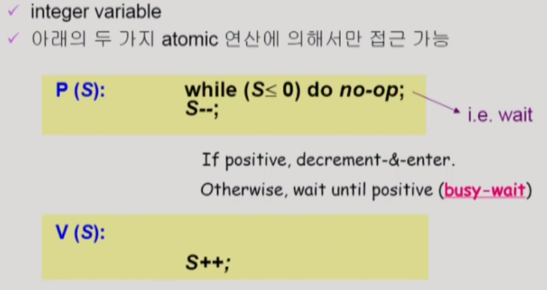

## Process Synchronization 문제

위 그림처럼 S-box(Storage-Box)에 담긴 데이터에 여러 E-box(Execution-Box)가 접근하는 경우, 복수의 E-box(여러 프로세스)들이 동시에 데이터에 접근하는 Race Condition이 발생한다. 이러한 상황에서 데이터의 최종 연산 결과가 마지막에 해당 데이터를 다룬 프로세스에 의해 원치 않는 결과로 이어질 수 있는데, 이처럼 **공유 데이터에 동시 접근이 일어나 데이터의 불일치가 생기는 문제를 Process Synchronization**이라고 한다. 

​    

## OS에서 Race Condition이 발생하는 3가지 경우

###  1. kernel 수행 중 인터럽트 발생 시

Process Synchronization은 인터럽트로 인해 발생하기도 한다. 예를 들어, 어떤 값에 count++와 count--가 수행되면 원래의 값에서 +1을 하고 다시 -1을 연산하는 것이므로 원래의 값으로 돌아올 것이 기대된다. 그런데, count++가 먼저 수행되어 데이터를 읽은 상태에서 인터럽트가 들어와 count--가 데이터를 읽고 연산해 저장하는 상황을 생각해볼 경우, 본래 진행하던 count++ 연산의 결과가 다시 데이터를 덮어 쓰게 되어 원하는 결과를 얻지 못하게 된다.

이러한 문제를 해결하기 위해서, 중요한 변수를 건드리는 kernel 연산은 인터럽트가 들어와도 그 연산이 끝난 후 인터럽트 처리루틴을 실행하는 것이 하나의 방법이 될 수 있다. 

###  2. Process가 system call을 해 kernel mode로 수행 중인데, context switch가 일어나는 경우

Process Synchronization의 또 다른 경우는 context switch로 인해 발생할 수 있다. 만일 프로세스 A가 시스템콜을 하여 커널모드에서 count++ 연산을 수행 중이었는데 CPU 할당 시간이 끝나 프로세스 B에게 CPU가 넘어간 상황을 가정해보자. 프로세스 B에서는 또 다른 count++ 연산을 진행해 커널에 데이터를 저장했고 다시 CPU를 프로세스 A에게 넘겼다. 이 때, 프로세스 A가 본래 진행 중이던 count++ 연산을 마무리해 데이터를 커널에 저장하면, 프로세스 A의 본래 context에서의 연산 결과로만 덮어 쓰게 되어, 프로세스 B의 연산 결과는 사라지게 된다.

이를 해결하기 위해서 어떤 프로세스가 커널 모드에 있다면, CPU 할당 시간이 지나도 CPU를 다른 프로세스에게 preempt 당하지 않도록 하고 커널모드에서 사용자 모드로 돌아가는 순간에 다른 프로세스가 preempt 하게 만들 수 있다. 물론 이 경우 한 프로세스에게 CPU 할당 시간이 더 많이 돌아갈 수 있지만, time sharing 시스템에서 이 정도 할당 시간은 큰 영향을 미치지 않는다. 

###  3. Multiprocessor에서 shared memory 내의 kernel data

CPU가 여럿 있는 경우에서 나타나는 Process Synchronization은 데이터의 접근하는 주체가 각각 다른 것이기 때문에, 단순히 인터럽트를 막는 차원에서 해결되지 않는다.

이를 해결하기 위해 두 가지 방법이 있다. 첫 번째는 이미 접근한 CPU가 있을 시, 커널 전체에 lock을 걸어두는 방법이다. 한 CPU가 커널에 접근하면 커널 자체에 lock을 걸어 다른 CPU의 접근을 막고 작업이 끝났을 때 lock을 풀면 Process Synchronization을 막을 수 있다. 두 번째는 커널 내부의 어떤 공유 데이터에 접근할 시, 해당 데이터에만 lock을 걸고 해제하는 방식이다. 커널 내부의 한 데이터에 lock이 걸려도 다른 데이터에는 다른 CPU가 접근할 수 있다는 점에서, 전자보다 후자의 방법이 더 효율적이라고 볼 수 있다.

​    

## Critical section (임계 구역) 문제

###  1. Critical section (임계 구역)

복수의 프로세스가 공유 데이터를 동시에 사용하길 원하는 상황에서, 각 프로세스의 코드에는 **critical section(임계 구역)**이라고 불리는 **공유 데이터에 접근하는 코드**가 존재한다. 만일 **하나의 프로세스가 자신의 critical section에 있는 경우, 다른 모든 프로세스는 critical section에 진입하지 않아야 한다.**

위 코드는 임의의 프로세스에 대한 코드를 나타내는데, 이에 대하여 어떤 코드든 공유 데이터에 접근하거나(critical section), 접근하지 않는(remainder section) 부분으로 나뉘어질 것이다. 이 때, critical section 진입 전 entry section에서 lock을 걸어 다른 프로세스의 critical section 진입을 막고, exit section에서 lock을 풀어 다른 프로세스들이 critical section에 진입할 수 있게 하는 작업들이 동반되어야 한다.

###  2. Critical section 문제 해결을 위한 조건

* **Mutual Exclusion (상호 배제)**

  한 프로세스가 critical section을 수행 중이라면, 다른 프로세스는 critical section에 진입해서는 안된다.

* **Progress (진행)**

  critical section에 진입한 프로세스가 없는 상황에서 critical section 진입을 원하는 프로세스가 있다면, 진입을 허가해주어야 한다. (간혹, 동시 진입을 막으려고 짠 코드가 실수로 모두의 진입을 막는 경우가 있으므로 유의한다.)

* **Bounded Waiting (유한 대기)**

  프로세스가 critical section 진입을 요청하면, 그 요청이 허용될 때까지 다른 프로세스들의 critical section 진입 횟수의 제한이 있어야 한다. (다른 프로세스들이 계속 번갈아 critical section에 진입하는 바람에, 새로 진입을 요청한 프로세스가 critical section에 진입하지 못하는 상황이 없어야 한다.)

​    

## Critical section 문제 해결 조건을 만족하는 알고리즘

###  1. Algorithm example 1 (turn을 교대로 넘기기)

위 코드는 P0(프로세스 0)를 위한 코드이다. 그리고 위와 전체적으로 동일하지만 코드의 두 부분이 while (turn != 1), turn = 0로 구성된 P1(프로세스 1)의 코드가 또 하나 존재할 것이다. 또한, 위의 turn 변수는 P0와 P1 중 어떤 프로세스가 critical section에 들어갈 차례인지를 나타낸다.

이 코드의 경우 P0는 자신의 차례가 아닐 때(turn=1), entry section에 해당하는 while 문 안에서 돌아간다. 그 후, P1 쪽의 코드에서 turn = 0가 되어 P0의 차례가 왔을 때 비로소 critical section에 진입한다. Critical section의 코드를 마쳤을 때, P0는 exit section에 진입해 turn = 1을 수행하고 P1에게 차례를 넘기며 나머지 코드를 수행한다. 반대로 P1은 P0의 과정을 P0보다 먼저 겪은 것이고 둘은 서로 번갈아 이 과정을 그대로 반복하며 각자의 작업을 완료해 나간다. 

이 예시 코드는 critical section 해결 조건 중 **Mutual Exclusion을 만족하지만, Progress 조건은 만족하지 못한다.** 만일 P0가 더 빈번히 critical section에 진입하고 싶어하고 P1은 한 번만 critical section에 진입하고 싶어할 때, P1이 최초 critical section 진입 이후에는 더이상 critical section에 진입하지 않아 P0에게 차례를 주지 않는 상황이 발생한다. 이 경우, critical section에 진입해 있는 프로세스가 아무 것도 없음에도 진입 요청이 있는 프로세스에게 차례가 돌아가지 않아 progress 조건을 충족하지 못하게 된다.   

###  2. Algorithm example 2 (flag로 각자의 critical section 진입 의사 밝히기)

두 번째 알고리즘 예시는 프로세스 각자에 flag를 두어 critical section 진입 의사를 각자 나타내게 하는 방법이다. 이 알고리즘도 **Mutual Exclusion을 보장**한다. 그리고 이 방법은 각자의 critical section 진입 의사를 체크할 수 있어 1번 예시 알고리즘처럼 아무도 critical section에 진입해 있지 않은데 critical section에 못 들어가는 상황을 방지할 수 있다. 하지만 반대로 P0가 자신의 코드에서 flag = true를 수행하자마자 P1에서 CPU를 점유해 자신의 flag를 true로 만들면, 서로 양보하다가 둘 모두 critical section에 진입하지 못하는 상황이 발생할 수 있다. 따라서 이 경우도 **Progress 조건을 만족하지 못한다.**

###  3. Peterson's Algorithm

3 번째 알고리즘은 **Peterson's Algorithm**이다. 앞선 두 알고리즘의 예시를 모두 가져와 복합적으로 만든 것인데, 이 알고리즘의 경우 **Mutual Exclusion과 Progress 조건을 모두 만족**시킨다. 프로세스는 flag로 자신의 critical section 진입 의사를 밝히고 turn을 상대방의 차례로 설정하는 방법을 기본으로 해 서로의 critical section 진입을 체크한다. 위 코드처럼 while문 조건으로 flag와 turn을 모두 사용하면, 앞선 두 알고리즘 예시의 문제들을 모두 해결할 수 있어 Progress 조건까지 포함해 모든 critical section 문제 해결 조건을 충족하는 알고리즘을 만들 수 있게 된다.

하지만 이 알고리즘도 문제는 있는데, 바로 **Busy Waiting(=spin lock)**이다. 다른 프로세스의 critical section 수행을 기다리는 동안 while문으로 lock에 걸리는 바람에 자신의 CPU 할당 시간이 돌아와도 그 시간 내내 while문 안에서 헛돌며 **CPU와 메모리를 낭비**하게 된다. 

###  4. Hardware Synchronization

사실 **하드웨어적으로 atomic하게 lock을 걸 수 있다면, 앞의 존재했던 문제들은 자연스럽게 해결**된다. 앞 알고리즘들의 문제들은 결국 데이터의 읽기와 쓰기가 **하나의 instruction 안에서 해결되지 않기 때문에 발생하는 것들**이다. 특히 고급 언어로 쓰여진 한 줄의 코드는 여러 instruction들의 묶음일 수 있는데, 이 코드 속 instruction들을 몇 개 실행하는 중간에 다른 프로세스에 CPU를 빼앗겨 프로세스들간의 읽기와 쓰기의 순서가 섞이게 되면, process들 간의 critical section 문제가 발생하는 것이다. 따라서 하드웨어적으로 읽기와 쓰기를 하나의 instruction 속에서 처리하는 Test_and_set() 함수를 사용하면 critical section 문제를 근본적으로 예방할 수 있다.

Test_and_set(x)은 변수 x에 담긴 데이터를 읽어 들이고 그 값을 1로 재설정한다. 특징은 데이터를 읽고 쓰는 이 과정이 앞서 말했듯 하나의 instruction으로 수행된다는 점이다. 이로 인해 새롭게 수정한 위의 코드는 앞의 알고리즘들의 비해 보다 간결해진다. 만일 P0가 처음 CPU를 점유했다면, while문을 실행할 때 Test_and_set(lock)이 false(0)를 읽어와 while문은 그대로 지나가게 되고 lock의 값은 true(1)로 재설정해 lock이 걸리게 된다. 그리고 lock을 건 상태에서 critical section에 진입하게 된다. 이 상태에서는 CPU가 P1에게 넘어가더라도 P1은 이미 걸려있는 lock으로 인해 while문 안에 갇히게 되므로 critical section 문제를 피할 수 있게 된다. 그리고 P0가 다시 CPU를 얻어 critical section 코드를 완료하면 false(0)값을 할당해 lock을 풀며 나머지 코드를 실행하게 되고, P1은 다음 CPU 점유 시 critical section에 진입할 수 있게 된다.

​    

## Semaphore 자료형 

앞의 방식들은 모두 프로그래머가 직접 코딩해야 하는 번거로움이 있다. **이 과정을 추상화하여 프로그래머의 편리한 코드 작성 환경을 제공하는 방법**으로 **Semaphore 자료형**이 존재한다. Semaphore 자료형은 **정수값**을 가질 수 있는 자료형이고 **P 연산**과 **V 연산**이라는 두 가지 atomic한 Operation이 존재한다. Semaphore의 정수값은 자원의 수(공유 데이터의 수)를 의미한다. P 연산은 이러한 공유 데이터를 획득하는 연산이고 반대로 V 연산은 다 사용한 공유 데이터를 반납하는 연산으로 볼 수 있다. 구체적으로 P 연산은 자원이 0개일 때는 while문을 돌며 기다리다가, 1개 이상의 자원이 생기면 자원을 가져가 변수값을 감소시키는 모습을 보이고, V 연산은 쓰던 자원을 반납하여 변수값을 증가시키는 모습을 띈다. 이러한 이유로 P 연산의 경우는 while문에 갇혀 Busy-Waiting이 발생할 수 있다.

Critical section 문제를 해결하기 위해 사용한 lock을 걸고 푸는 개념도 Semaphore 자료형을 사용하면 쉽게 접근할 수 있다. Lock의 경우 변수 값이 1인 Semaphore를 생각할 수 있으며, P 연산이 lock을 거는 과정, V 연산이 lock을 푸는 과정에 해당한다. 위 그림은 Semaphore 자료형을 critical section 문제에 적용한 pseudo 코드이다. Lock 변수를 Mutual Exclusion을 나타내는 mutex 변수로 사용하고 P 연산과 V 연산을 사용해 lock을 걸고 풀면, 간결하게 critical section 문제를 다룰 수 있다.

​    

## Busy Waiting 문제를 해결하는 Block & Wakeup 방식 (=sleep lock)

Semaphore를 이용하여 위와 같이 Busy Waiting 문제를 해결할 수 있다. 이를 **Block & Wakeup** 방식이라고 하는데, 먼저 semaphore에는 프로세스들의 block과 wakeup 상태를 확인하기 위해 사용하는 변수 value와 프로세스들을 기다리게할 wait queue에 해당하는 L을 정의한다. 그리고 프로세스가 자원을 획득할 수 없는 경우, PCB를 block 상태로 만들고 wait queue에 대기시킨다. 이 때, 다른 프로세스의 자원이 반납되면 wait queue에 block 상태로 있는 프로세스를 wakeup 상태로 만들고 해당 프로세스에게 자원을 내어준다.

구체적으로 살펴보면, **Block & Wakeup 방식에서 semaphore의 value 값**은 자원의 수라기 보다 **wait queue에 block 상태로 존재하는 프로세스가 있는지 없는지 확인하는 역할**을 한다. 그리고 P 연산은 프로세스가 자원을 획득하는 연산이다. 일단 semaphore의 변수 value의 값을 감소시키는데, 만일 value 값이 음수가 될 경우, 획득을 요청한 프로세스를 semaphore의 wait queue에 넣고 block 상태로 만든다. V 연산의 경우, semaphore의 value 값을 증가시킴으로써 프로세스의 자원을 반납한다. 만일 값이 증가한 이후에 변수 value의 값이 양수라면 wait queue에서 대기하는 프로세스가 없다는 의미이므로 연산이 마무리된다. 하지만 value 값이 0 이하일 경우, wait queue에 block 상태로 존재하는 다른 프로세스가 있다는 의미이므로, 가장 순서가 먼저인 프로세스를 wakeup 상태로 만드는 작업까지 수행한다.

​    

> Busy Wait 방식 VS Block & Wakeup 방식
>
> **일반적으로 Block & Wakeup 방식이 더 좋다.** 그러나 Critical Section의 길이를 기준으로 생각해보면, 다른 양상을 띌 수 있다. Block 상태와 wakeup 상태 사이를 왔다갔다하는 overhead도 크기 때문에, Critical section의 길이가 짧으면 Busy Wait 방식을 채택하는 것이 나을 수도 있다. 반면에, critical section의 길이가 길면 CPU와 메모리의 무의미한 낭비를 막기 위해 Block & Wakeup 방식을 채택하는 것이 효율적이다.

​    

## Semaphore의 두 가지 타입

###  1. Binary semaphore (=mutex)

 자원이 하나라서 0 또는 1값만 가질 수 있는 semaphore다. 주로 lock을 걸어 mutual exclusion을 구현할 때 사용한다.

###  2. Counting semaphore

 주로 자원이 여러 개 있어서 이를 세기 위해 사용되며, 임의의 정수 값을 가지는 semaphore이다. 

​    

## Deadlock과 Starvation

###  1. Deadlock

**둘 이상의 프로세스가 서로 상대방에 의해서만 충족될 수 있는 event를 무한히 기다리는 현상**을 말한다. 예를 들어, 1로 초기화된 두 가지 semaphore S(하드디스크 1에 관한 semaphore)와 Q(하드디스크 2에 관한 semaphore)가 있다고 해보자. (lock & unlock 기능) 이 때, 하드디스크 1에 있는 내용을 읽어와서 하드디스크 2에 이를 쓰는 작업을 수행하려고 한다. 이 작업을 수행하려면, 하나의 프로세스가 홀로 S와 Q 모두를 획득해야만 한다. 그런데 만일 P0(프로세스 0)이 S를 획득한 상태에서 P1(프로세스 1)에게 CPU를 넘겨 준다면, P1은 남아 있는 Q를 획득한다. 이렇게 되면, CPU가 P0에게 다시 넘어가도 P0는 Q를 획득할 수 없어, 진행해야 할 작업을 하지 못하고 Deadlock 상태에 빠지게 된다. 반대로 P1 입장에서도 S를 얻지 못해 작업을 수행하지 못하는 상황에 처한다.

이 경우, **자원을 획득하는 순서를 똑같이 맞춰주면 간단히 deadlock 문제가 해결**된다. P0나 P1이나 S부터 획득하고 그 다음 Q를 획득하게 한다면, 한 프로세스가 P를 획득한 상태에서는 다른 프로세스가 P를 획득하지 못해 Q에 대해 획득하려는 시도까지 이어지지 않게 된다. 

###  2. Starvation

**특정 프로세스들만 자원을 공유함으로 인해, 다른 프로세스들은 자원을 영원히 획득하지 못하는 상황**을 의미한다. 