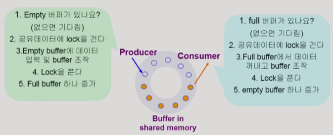
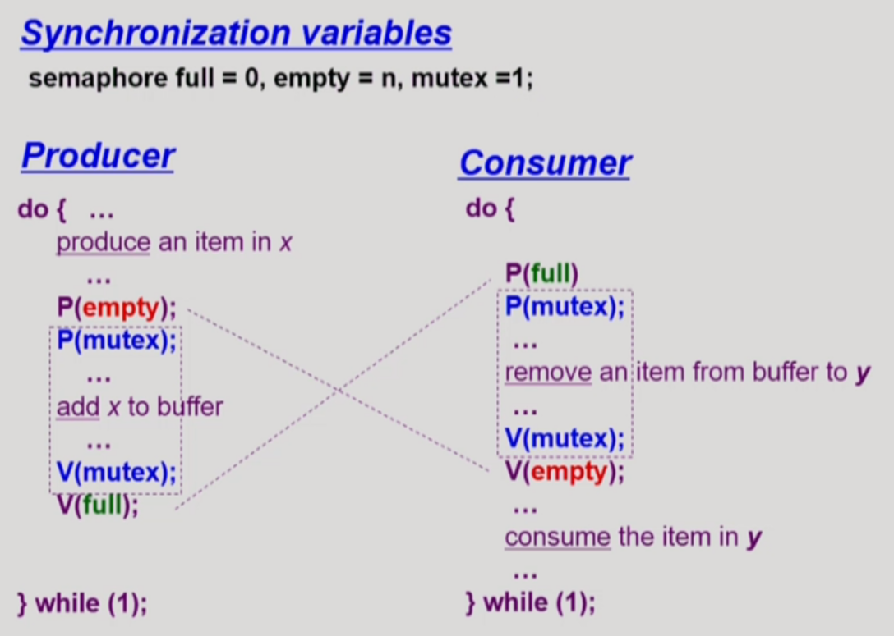
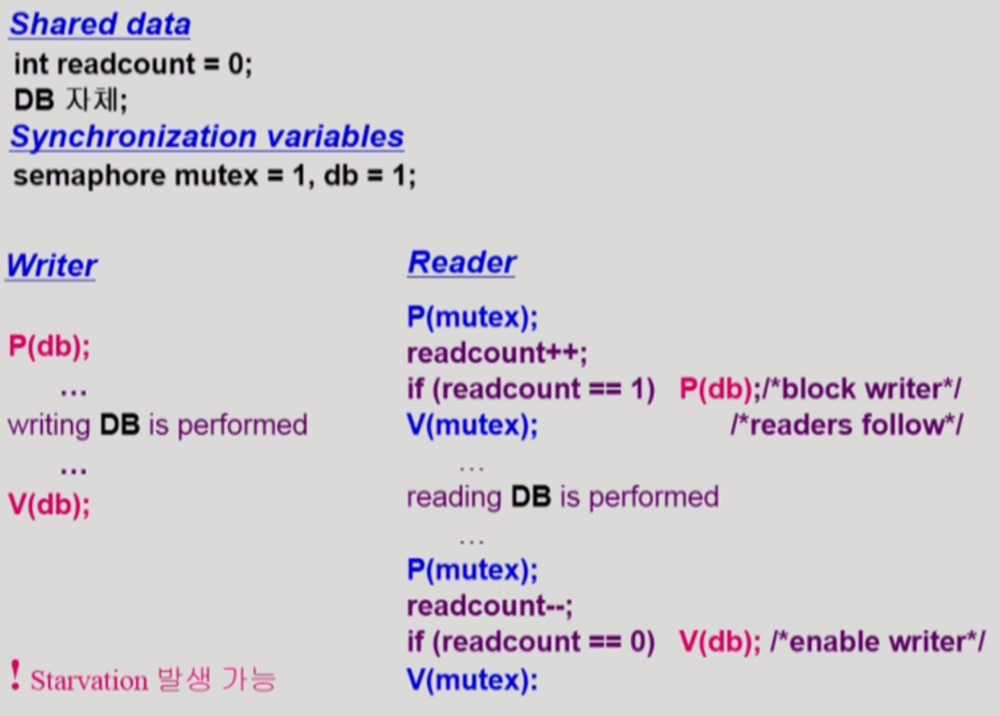
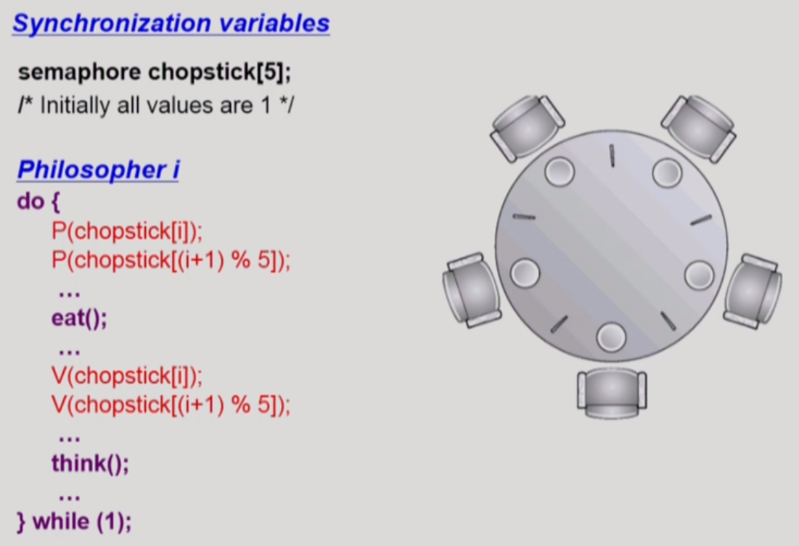
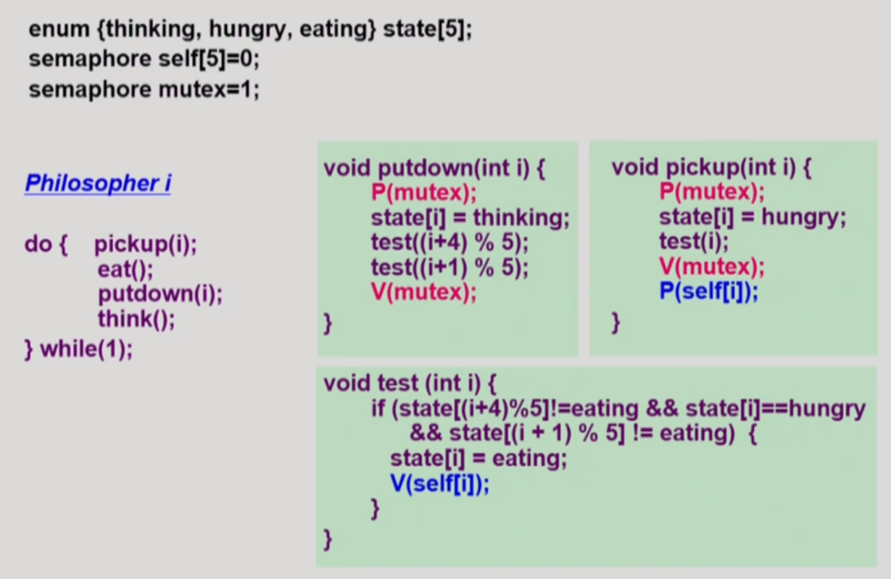
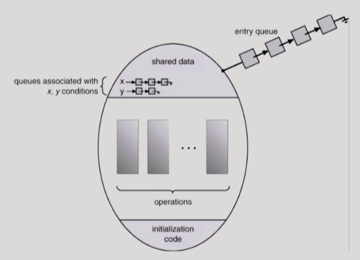
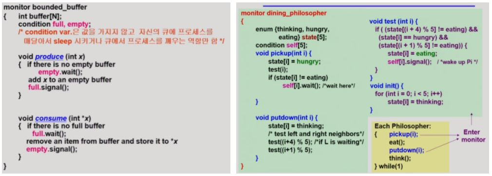

## 3가지의 고전적인 Synchronization 문제

### 1. Bounded-Buffer Problem (Producer-Consumer Problem)

* Bounded-Buffer Problem이란?

유한한 크기(그림은 circular 형태)를 가진 버퍼(임시로 데이터를 저장하는 공간)의 환경에서 발생하는 문제들을 의미한다. 이 문제는 생산자-소비자 문제(Producer-Consumer Problem)라고도 불리며, 이러한 상황을 가정 할 때는 여러 개의 생산자 프로세스와 여러 개의 소비자 프로세스가 존재한다. 생산자 프로세스들은 데이터를 생성해 빈 공유 버퍼에 삽입한다. 위 그림에서는 주황색으로 칠해져 있는 동그라미가 생산자 프로세스가 데이터를 저장해 둔 공유 버퍼이고, 색이 없는 동그라미가 비어 있는 버퍼이다. 그리고 소비자 프로세스들은 데이터가 존재하는 버퍼에 접근해 데이터를 빼내고 조작한다.

이러한 상황에서 두 가지 문제가 발생할 수 있다. 첫째로, 하나의 버퍼에 둘 이상의 프로세스가 접근했을 때 발생하는 문제이다. 이는 생산자와 소비자 각각의 측면에서 살펴볼 수 있는데, 생산자 측면에서는 하나의 비어있는 버퍼에 두 가지 이상의 생산자 프로세스가 접근해 조작을 시도하면 synchronization 문제가 발생한다. 소비자 측면에서도 데이터가 존재하는 버퍼에 둘 이상의 소비자 프로세스가 접근하면 마찬가지로 synchronization 문제가 발생한다. 이 문제들을 해결하기 위해서는 앞에서 살펴봤듯이 하나의 프로세스가 버퍼를 조작할 때 lock을 걸고, 작업을 완료할 때 lock을 푸는 과정이 필요하다. 

둘째로, 전체 버퍼의 유한함으로 인해 발생하는 문제가 있다. 먼저, 생산자 측면에서는 생산자 프로세스들만 계속 접근해 공유 버퍼가 가득 차는 경우가 생길 수 있다. 데이터가 버퍼에 가득 찬 상황에서는 다른 생산자 프로세스가 접근해도 데이터를 생성할 수 없어 데이터가 소비되길 기다려야만 하는 상황이 발생한다. 이런 상황에서는 소비자 프로세스가 와야지만 다음 생산자 프로세스의 작업 수행이 가능해진다. 이 때, 생산자 프로세스 입장에서는 빈 버퍼 공간이 자원이며, 전체 버퍼가 가득찬 상황은 자원을 획득할 수 없는 상황으로 간주된다. 반면에 소비자 측면에서는 소비자 프로세스들만 득세하여 전체 버퍼가 비어 있는 상황이 발생할 수 있다. 이 경우 획득할 수 있는 데이터가 없어 소비자 프로세스들은 다른 생산자 프로세스가 올 때까지 끝없이 기다려야 한다. 이 경우, 소비자 프로세스 입장에서 데이터가 있는 버퍼가 자원이며, 전체 버퍼가 비어있는 상황은 자원을 획득할 수 없는 상황으로 볼 수 있다.

* 필요한 Semaphore
  * 공유 데이터의 Mutual Exclusion을 위한 Binary semaphore
  * 버퍼의 Resource Count를 위한 Counting semaphore

Bounded-Buffer Problem을 Semaphore를 이용해 수도 코드로 나타내면 위와 같다. 먼저 Semaphore 변수로 lock을 나타내는 mutex와 내용이 들어있는 버퍼의 개수를 나타내는 full, 빈 버퍼의 개수를 나타내는 empty 총 3가지를 가진다. 그리고 이 변수들을 사용한 P, V 연산을 수행해 생산자 프로세스와 소비자 프로세스의 자원을 획득 및 반납하는 과정을 위와 같이 나타낸다.

### 2. Readers and Writers Problem

Reader and Writers Problem은 데이터를 읽는 것에 대한 고민을 반영한다. 여기서는 주로 DB에서 이러한 문제가 발생하기 때문에 공유데이터를 DB라고 특정지어 얘기한다. 기본적으로 synchronization 문제를 예방하기 위해 한 프로세스가 공유 데이터에 접근 중일 때 lock을 걸고 다른 프로세스가 공유 데이터에 접근하는 것을 막아야 한다. 하지만 Reader and Writers 문제에서는 어떤 한 프로세스가 DB에 write하는 경우를 제외하고는 언제든 다른 여러 프로세스들의 read 접근을 막아야할 이유가 없다. 즉, 한 프로세스가 DB에 write하는 경우에만 모든 접근을 막고, 그 이외의 상황에서는 모든 프로세스들의 read 접근을 허용하는 것을 지향한다.

Reader and Writers Problem은 위와 같은 수도 코드로 구현한다. 공유 데이터로 DB 자체와 접근 중인 reader 프로세스의 수를 세는 readcount를 두고, semaphore 변수로 readcount로의 접근에 대해 lock 걸기 위한 mutex, DB로의 접근에 lock을 걸기 위한 db를 둔다.

Writer 입장에서는 단순히 db 변수로 lock을 걸어 DB 공유 데이터에 접근해 쓰기 작업을 수행하고, 작업이 끝나면 lock을 풀고 나오면 된다. 반면에 Reader 입장에서는 조금 더 복잡해지는데, Reader 프로세스는 DB에 접근하기 전에 먼저 readcount 데이터를 조작하여 자신의 출석을 알린다. 변수 readcount도 공유 데이터이므로 synchronization 문제를 예방하기 위해 mutex 변수로 lock을 걸고 데이터를 조작한다. 이 때, 만일 자신이 첫 번째로 read를 진행하는 프로세스라면(readcount의 값이 1이라면), DB에 lock을 걸고 read를 진행한다. 그리고 mutex lock을 풀고 DB에 대한 읽기를 진행한다. DB에 걸린 lock의 경우 writer 프로세스만 차단하는 것이어서, 이 사이에 CPU가 다른 프로세스들에게 넘어가면서 여러 프로세스들이 DB에 대한 읽기를 진행할 수 있다. Reader 프로세스는 DB 읽기를 마무리하면 다시 mutex로 lock을 걸고 readcount 변수의 값을 감소시켜 자신이 바깥으로 나감을 기록한다. 그리고 mutex lock을 다시 풀고 작업을 마무리한다. 이 때, 가장 마지막에 나가는 Reader 프로세스는(readcount의 값을 0으로 만든 프로세스는) mutex lock을 풀기 전 DB에 대한 lock도 풀어 writer의 접근을 허용시킨 후 작업을 마무리해야 한다.

이러한 구현에서 한 가지 유의할 점은 계속 Reader 프로세스가 들어오면 Writer 프로세스에게는 DB에 접근할 기회가 돌아오지 않는 Starvation 문제가 발생할 수 있다는 것이다.

### 3. Dining-Philosophers Problem

Dining-Philosophers Problem 역시 synchronization 문제를 표현한다. 이 문제에서 테이블에는 철학자 다섯이 앉아 있고, 철학자는 생각하는 행동과 먹는 행동 두 가지만을 실행한다. 철학자들의 사이사이에는 한 개의 젓가락이 놓여 있으며, 철학자가 음식을 먹으려면 자신의 양쪽에 있는 젓가락을 함께 들어야만 한다.

이러한 문제는 위와 같은 수도 코드로 나타낼 수 있다. Semaphore 배열 chopstick은 5개의 젓가락에 대한 사용 여부를 0과 1값으로 표현한다. 그리고 chopstick[i]는 자신의 왼쪽 젓가락, chopstick[i + 1]은 자신의 오른쪽 젓가락을 나타낸다. 만일 자신의 오른쪽이나 왼쪽에 있는 철학자가 음식을 먹고 있다면, 그 차례가 끝나고 자신이 양쪽 젓가락을 모두 확보할 수 있을 때에서야 비로소 음식을 먹을 수 있다.

그런데 위와 같은 코드는 데드락(Deadlock)이라는 치명적인 결함이 생길 수 있다. 예를 들어, 모든 철학자가 배가 고파 왼쪽의 젓가락을 동시에 집는 경우, 아무도 음식을 먹을 수 없는 상황이 발생하는 것이다.

이러한 상황을 해결하기 위해서 3가지 해결책이 존재하는데, 먼저 4명의 철학자만이 테이블에 앉게 하면 적어도 데드락 문제는 분명히 피할 수 있다. 둘째로 젓가락을 모두 집을 수 있을 때에만 젓가락을 집을 수 있게 허용하는 방법이 있다. 이렇게 하면 젓가락 한 쪽만 집는 상황이 예방되어 데드락을 피할 수 있다. 끝으로 홀수 번째 철학자는 오른쪽 젓가락을, 짝수 번째 철학자는 왼쪽 젓가락을 먼저 집도록 하는 비대칭 전략 역시 데드락을 피하는 좋은 방법이 된다.

위 수도 코드는 Dining-Philosophers Problem의 데드락 문제에 대한 두 번째 해결책을 구현한 것이므로 참고하자.

​    

## Monitor

Semaphore는 프로그래머의 코딩 환경에 편의를 제공하지만, 한 번의 실수가 모든 시스템에 치명적인 영향을 주고 그 버그를 잡아내기가 쉽지 않다는 단점을 가진다. 이러한 단점을 보완하기 위해 Monitor가 존재한다. Monitor는 동시 수행중인 프로세스 사이에서 abstract data type의 안전한 공유를 보장하기 위한 high-level synchronization construct이다. 즉, 어떤 공유 데이터를 저장하고 있다면, 미리 정의된 특정 프로시져를 통해서만 이 공유 데이터에 접근하게 하는 것이 Monitor의 주요 기능이다. Semaphore는 공유 데이터에 접근하는 경우 항상 lock을 걸고 풀어야 하는 번거로움이 있는데, Monitor는 정해진 프로시저를 통해 공유 데이터에 접근하면 굳이 lock을 걸지 않아도 알아서 synchronization 문제를 예방해준다는 장점이 있다.

Monitor에는 어떤 조건에 따라 프로세스의 상태를 통제하는 condition variable(위 그림의 x, y)과 프로세스를 condition variable에 줄세우고 잠들게 하는 wait() 연산, condition variable에 잠자고 있는 프로세스를 깨우는 signal() 연산이 존재한다. 예를 들어, x.wait()은 프로세스를 x라는 condition variable에 줄세우고 잠들게하는 작업을 수행하고, x.signal()은 x에 잠들어 있는 프로세스 하나를 깨워주는 작업을 한다. 즉, wait() 연산이 적용된 프로세스는 다른 프로세스가 signal() 연산을 사용하기 전까지 suspend 상태가 된다. 반면에, signal() 연산은 suspend된 프로세스 하나를 다시 동작하게 하는 일을 한다.

Monitor 버전의 코드는 프로그래머 입장에서 Semaphore 코드에 비해 훨씬 직관적으로 이해된다. 그리고 Semaphore를 이용한 코드와 언제든 서로 변환시키기 용이하다. 위의 수도 코드들은 각각 Bounded-Buffer Problem, Dining-Philosophers Problem을 Monitor를 이용한 코드로 변환한 것인데, 공유 데이터에 접근할 때 lock을 걸고 푸는 과정이 없어 이전 semaphore를 사용해 만든 코드보다 더 직관적이고 용이하게 코드가 구성됨을 알 수 있다.