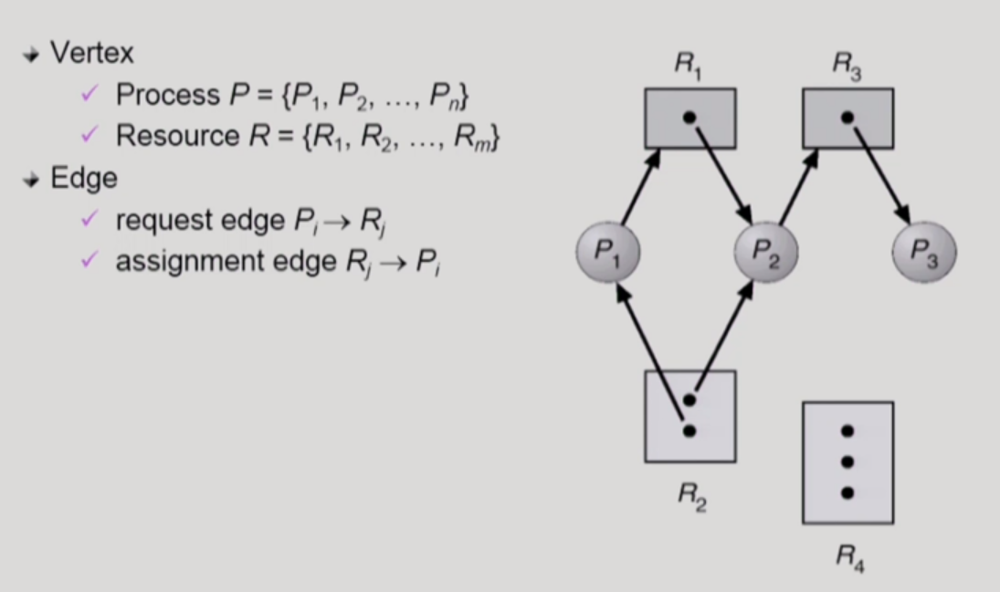
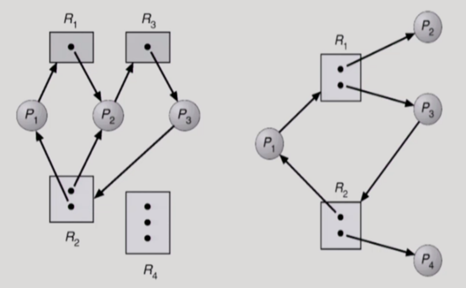
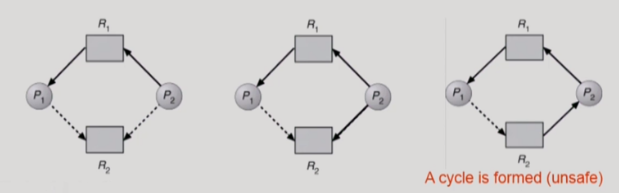
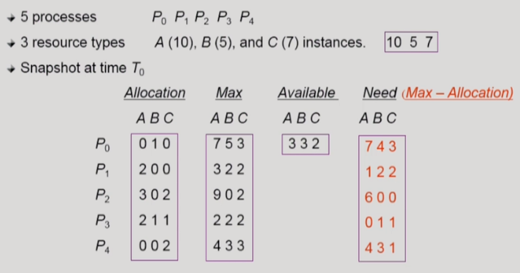
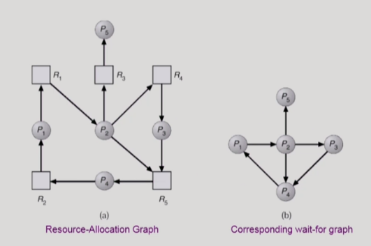
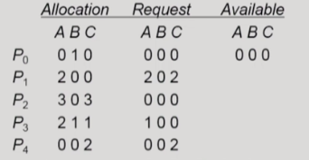

## Deadlock

### 1. Deadlock이란?

 일련의 프로세스들이 서로가 가진 자원을 기다리며 block된 상태를 말한다. 여기서 자원이란 하드웨어와 소프트웨어 등을 모두 포함하는 개념이며, 이러한 자원을 사용하는 절차로는 Request, Allocate, Use, Release가 있다.

### 2. Deadlock이 발생하는 4가지 조건

Deadlock이 발생하려면 아래의 4가지 조건을 모두 만족해야 한다. 

* Mutual Exclusion : 매 순간 하나의 프로세스만이 자원을 사용한다.

* No Preemption : 프로세스는 자원을 강제로 빼앗기지 않고 스스로 내어 놓는다.

* Hold and wait : 자원을 가진 프로세스가 다른 자원을 기다릴 때, 보유 자원을 놓지 않고 계속 가지고 있는다.

* Circular wait : 자원을 기다리는 프로세스간에 사이클이 형성된다.

​    

## Resource-Allocation Graph (자원할당그래프)

Deadlock의 발생 여부를 판단하기 위해 Resource-Allocation Graph(자원할당그래프)를 사용한다. 위 그래프는 자원할당그래프의 예시이고 동그라미는 프로세스, 네모는 자원을 나타낸다. 네모 안의 검은 점은 자원의 instance, 즉 자원의 개수를 표현한다.

만일 자원할당그래프에 cycle이 없다면, deadlock에 걸리지 않았다고 볼 수 있다. 그러나 자원할당그래프에 cycle이 있을 경우에는 두 가지 경우로 나뉘는데, 먼저 자원의 instance가 하나인 경우 deadlock이 발생했다고 이야기할 수 있는 반면, 자원의 instance가 여러개 있으면 deadlock이 발생할 가능성은 존재하지만 직접 확인해봐야 실제 발생 여부를 파악할 수 있다. 위의 예시 그래프의 경우, 그래프에 cycle이 없기 때문에 deadlock에 걸리지 않았다.

위의 왼쪽 그래프와 오른쪽 그래프는 cycle이 존재해도 instance가 여럿 있는 자원이 있기 때문에 deadlock을 단정지을 수는 없다. 왼쪽 그래프의 경우, 직접 화살표를 따져보면 서로 자원을 양보하지 못하는 상황이어서 deadlock이 발생했음을 확인할 수 있다. 반면, 오른쪽 그래프는 P2와 P4가 자원을 반납하면 얼마든지 cycle이 소멸할 수 있기 때문에 deadlock 상황이 아니라고 판단된다.

​    

## Deadlock의 처리 방법

### 1. Deadlock Prevention (강한 방법)

자원 할당 시 Deadlock의 4가지 필요조건 중 어느 하나가 만족되지 않도록 하는 방법이다. Mutual Exclusion은 지키지 않을 시 아얘 Deadlock 문제에 대한 의미가 없을 뿐더러 지금까지의 논의도 무의미해지므로, 나머지 3가지 조건에 대해 Deadlock Prevention을 진행하는 것이 옳다.

먼저 Hold and Wait를 만족하지 않게 하는 2가지 방법이 있다. 하나는 아얘 처음 프로세스가 시작할 때 필요한 모든 자원을 할당받게 하는 것이다. 이를 통한다면 deadlock을 방지할 수 있지만, 아직 필요한 순서가 아닌 자원까지 보유하게 되어 비효율적인 문제가 있을 수 있다. 또 다른 방법은 자원이 필요한 프로세스가 자원을 기다려야 하는 상황에 처해 있다면, 보유한 자원을 모두 내려놓고 기다리게 하는 것이다. 이렇게 하면 deadlock을 예방하면서 앞 방법보다 조금 더 효율적으로 동작할 수 있다.

다음은 No Preemption을 만족하지 않게 해서 deadlock을 예방하는 방법이다. 이는 자원을 필요로 하는 어떤 프로세스가 이미 자원을 보유하고 있는 프로세스로부터 자원을 빼앗아 올 수 있게 허용하는 것을 의미한다. 이러한 방법은 CPU, Memory같이 state를 쉽게 save하고 restore할 수 있는 자원에 적용하는 것이 효과적이다. 자원을 빼앗겼을 때 진행 상태가 쉽게 엉키고 흩으러지는 자원에는 사용이 곤란하다.

마지막으로 Circular Wait을 만족시키지 않는 것도 deadlock을 예방하는데 효과적이다. 이는 모든 자원에 할당 순서를 매기는 것으로 구현된다. 모든 자원마다 할당 순서를 정하여 정해진 순서에 따라 자원을 할당받으면 프로세스끼리 꼬일 일이 없어진다. 

Deadlock Prevention은 deadlock을 원천 차단할 수 있는 장점이 있지만, 자원의 utilization(이용률)이나 throughput(성능)이 낮아지고 starvation 문제를 가져올 수 있다는 단점이 있다.

### 2. Deadlock Avoidance (강한 방법)

Deadlock Avoidance는 자원 요청에 대한 부가적 정보를 사용해 deadlock의 가능성이 없는 경우에만 자원을 할당한다. 즉, 프로세스가 시작될 때 해당 프로세스가 미래의 쓸 자원의 총량을 미리 예측하고, 만일 deadlock 가능성이 보인다면 자원의 instance가 여러개 있어도 해당 프로세스에게 자원을 내어주지 않는다. 

Deadlock Avoidance 방법은 만일 자원의 instance가 한 개일 경우, Resource-Allocation Graph(자원할당그래프)를 사용하여 deadlock을 피한다. 위 그림은 자원의 instance가 하나일 경우인데, 점선은 프로세스가 화살표가 가리키는 방향의 자원을 미래에 획득할 가능성을 표시한다. 여기서 P2 프로세스는 R2 자원을 미래에 획득할 가능성이 있기 때문에, 가운데 그림처럼 P2가 R2 자원을 요청할 수 있지만, deadlock의 가능성이 있기 때문에 실제로 자원을 내어주지는 않는다.

만일 자원의 instance가 여러 개일 경우라면, 위 그림처럼 Banker's Algorithm을 사용한다. 위 그림에서는 프로세스가 미래의 사용할 자원의 총량을 미리 예측하여 Max라는 테이블로 표시했다. Allocation은 현재 프로세스들이 자원을 확보하고 있는 상태를 나타내고, Need는 Max에서 Allocation을 뺀 값들을 기록한 것으로서 앞으로 프로세스가 얼마만큼의 자원을 더 요청할 것인지 계산한다. 그리고 남아있는 자원을 표시한 Available과 미리 계산한 각 프로세스들의 Need를 비교해 각 프로세스들의 deadlock 가능성을 예측하고, deadlock 가능성이 없는 프로세스에게 자원을 할당한다. 예를 들어, P1의 경우 Available 내에서 미래의 자원(Need)을 공급할 수 있기 때문에 deadlock 가능성이 적은 것으로 판단하여 자원 획득을 허용해준다. 반면, P0는 Available 허용 범위를 벗어나는 자원 수(Need)들을 앞으로 요청할 예정이므로 deadlock 가능성이 높다고 판단하여 자원을 내어주지 않는다. 그리고 만일, 다른 프로세스의 작업이 끝나서 자원이 반납되어 가용 자원의 수가 늘었다면, 자원의 수가 허락되는 선에서 이전에 자원을 받지 못했던 프로세스에게 자원을 내어준다.

### 3. Deadlock Detection and recovery (약한 방법)

이 방법은 Deadlock 발생을 허용하되 그에 대한 detection 루틴을 두어 deadlock을 발견하면 recover한다.

먼저 deadlock을 detection하는 방법은 Deadlock Avoidance에서 썼던 방법과 유사하게 진행한다. 먼저, 자원의 instance가 하나인 경우, Wait-for 그래프를 사용한다. 위의 오른쪽 그래프는 Wait-for 그래프라고 하는데, 왼쪽의 자원할당그래프에서 자원을 표시하는 네모만 제거하고 단순화한 모형이다. 이 Wait-for 그래프를 보고 프로세스 간 cycle을 발견한다면, deadlock 상황이 발생한 것으로 판단한다.

또한, 자원의 instance가 여러 개인 경우에도 앞선 Deadlock Avoidance와 비슷하게 처리한다. 위와 같은 상황은 가용 가능한 자원이 없어 deadlock에 처한 것처럼 보이지만, Allocation에서 P0가 Request하는 자원이 따로 없기 때문에, 할당된 자원이 반납될 것으로 예상된다. 이를 고려하여 차근차근 프로세스들의 Request들을 처리해나가면 deadlock 상황이 아닌 것으로 판단된다.

Deadlock detection으로 deadlock이 감지되었다면, Recovery 작업이 이어져야 한다. 여기에는 두 가지 방법이 있는데, 먼저 Process termination이 있다. Deadlock과 연루된 프로세스를 한 번에 모두 죽이는 방법이나, deadlock이 풀릴 때까지 한 개씩 프로세스를 죽이는 방법이 존재한다.

두 번째 방법인 Resource Preemption은 deadlock과 연루된 프로세스의 자원을 뺏는 방법이다. 비용을 최소화할 자원을 선택하여 해당 프로세스의 자원을 뺏음으로써 deadlock을 해제한다. 이 때, 비용만 생각하여 자원을 뺏다가 계속 하나의 프로세스만 희생되는 starvation 문제가 발생할 수 있어서, 프로세스들이 균형있게 자원을 배분받을 수 있도록 고려할 필요가 있다. 

### 4. Deadlock Ignorance (약한 방법)

이 방법은 단순하게 시스템이 deadlock을 책임지지 않는다. UNIX를 포함해 대부분의 운영체제가 택하는 방법으로서, deadlock 자체가 매우 드물게 발생하고 이것을 대비하는 것에 대한 overhead가 더 클 수도 있기 때문에 deadlock에 대한 조치를 사용자에게 맡긴다. 만일 deadlock이 발생할 경우, 사용자는 시스템의 비정상적 동작을 느끼게 되고 직접 프로세스를 종료시키는 등의 방법을 수행함으로써 이를 해결한다.