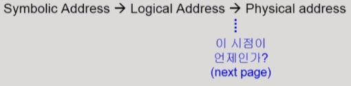
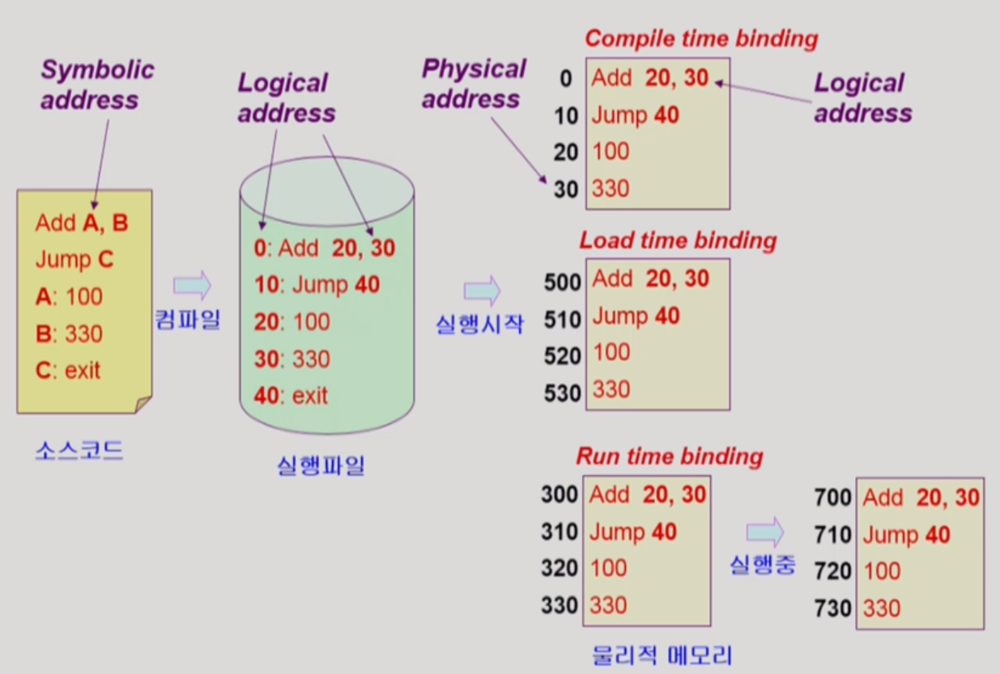
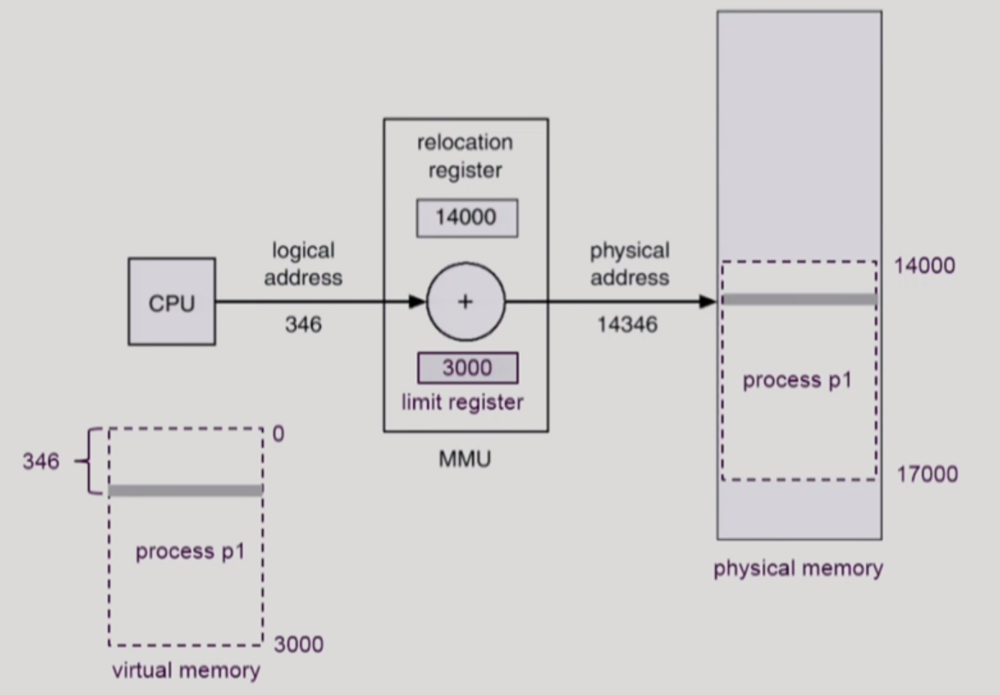
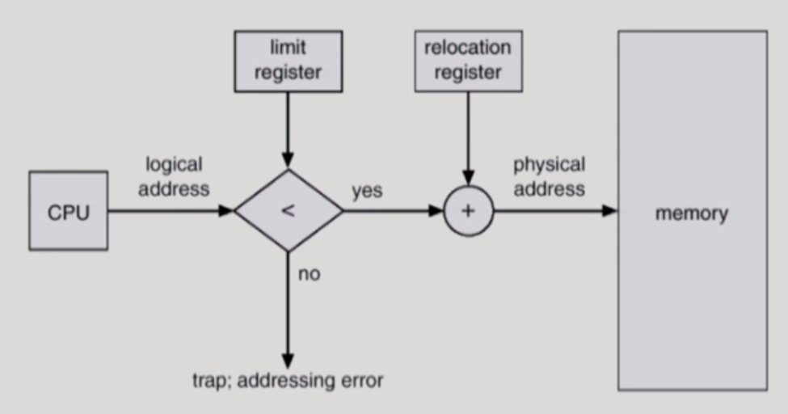
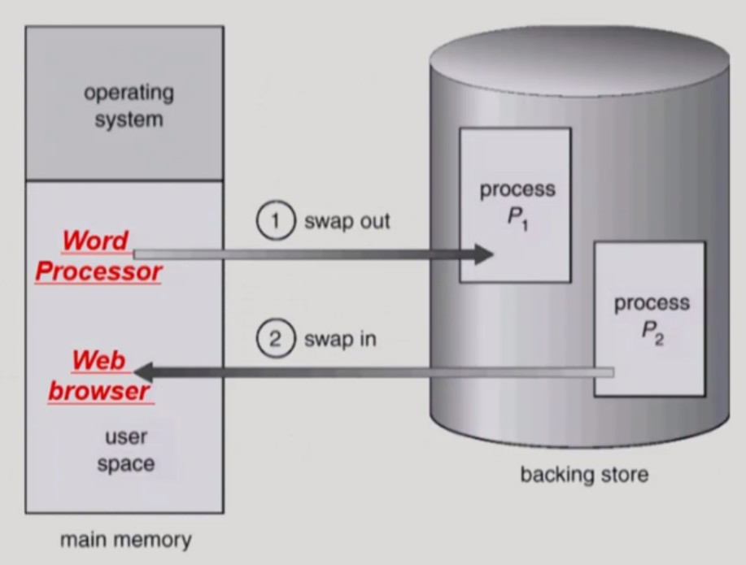

## Symbolic Address VS Logical Address VS Physical Address

### 1. Symbolic Address

* 프로그래머 입장에서 메모리를 다룰 때, 숫자가 아닌 변수명, 함수명 등으로 메모리를 조작하는 상징적 주소

* Symbolic Address가 compile되면 숫자로 된 Logical Address가 됨

### 2. Logical Address (=Virtual Address)

* 프로세스마다 독립적으로 가지는 주소 공간

* 각 프로세스마다 0번지부터 시작

* CPU가 보는 주소

### 3. Physical Address

* 실제 메모리에 올라가는 위치

* 프로그램이 실행될 때, Logical Address를 Physical Address로 주소 변환 (주소 바인딩)

​    

## 주소 바인딩 (Address Binding)

어떤 프로그램이 실행되기 위해서는 물리적 주소에 올라가야 하는데, **물리적인 주소 어디로 올라갈지 결정하는 것**을 의미한다. 현대 컴퓨터는 어떤 프로그램을 실행할 시 프로그램 내 instruction들을 산발적으로 여러 메모리 상 위치에 나눠 실행하지만, 여기서는 하나의 프로그램을 통째로 메모리 상 균일한 위치에 올린다고 가정하고 진행한다. 

### 1. 주소 바인딩이 실현되는 3가지 시점

* Compile time binding
  * **Physical Address가 컴파일 시에 정해져**서 Logical Address와 Physical Address와 같음
  * 이 때, 컴파일러가 생성한 코드를 절대 코드(absolute code)라고 지칭
  * 메모리가 많이 비어있을 때도 특정 위치부터 주소를 바인딩하기 때문에 비효율적
  * 시작 위치 변경시 재컴파일해야 함
  * 과거에 쓰이던 방식

* Load time binding
  * **프로그램이 실행되는 타이밍**에 Loader가 Physical Address를 부여함
  * 정해진 위치가 아닌 비어 있는 메모리 위치에 주소를 바인딩
  * 이 때, 컴파일러가 생성한 코드는 재배치가능 코드(relocatable code)라고 지칭

* Execution time binding (=Run time binding)
  * Physical Address를 부여하는 타이밍과 방식은 Load time binding과 동일
  * **프로그램 실행 중에도 프로세스의 메모리 상 위치가 바뀔 수 있다는 점**이 특징
  * CPU가 주소를 참조할 때마다 binding을 점검
  * 이를 위해서 하드웨어적인 지원이 필요 (ex. MMU)

​    

> 주소 바인딩이 되더라도 Logical Address는 코드상에 남아 있으므로, CPU는 Physical Address가 아닌 이 Logical Address를 참조하고 요청해 연산을 수행한다.

​    

### 2. MMU (Memory-Management Unit)

* Logical Address를 Physical Address로 mapping해 주는 **Hardware device**

* Execution time binding을 지원

* 2개의 register를 이용해 주소 변환 지원 (relocation register, limit register)

* **Relocation register(=base register)**: 접근할 수 있는 물리적 메모리 주소의 최소값

* **Limit register**: 논리적 주소의 범위

* user program은 logical address만 다루며, 실제 physical address는 볼 수 없고 알 필요도 없음

* MMU scheme

  사용자 프로세스가 CPU에서 수행되며 생성해내는 모든 주소값에 대해 base register 값을 더한다. 아래에 예시를 살펴보자.

  

  위 그림은 process p1이 실행되어 있는 상황에서 CPU가 p1의 한 instruction을 요청하는 과정을 담고 있다. 먼저 왼쪽 하단의 p1 그림은 p1의 논리적 주소를 보여준다. p1은 0~3000번지까지의 논리적 주소를 가진다. 이 때, limit register는 p1의 가장 끝 주소인 3000을 기억한다. 또한, 현재 CPU는 0~3000까지의 논리적 주소 중 346번지에 있는 instruction을 요청한 상황이다.

  물리적 주소 입장에서 보면, p1은 실행될 때 14000~17000번지까지의 주소를 부여 받았다. 논리적 주소의 범위인 3000만큼을 물리적 주소도 동일하게 받았다. 이 때, relocation register는 p1의 물리적 주소 시작위치인 14000을 기억한다. 그렇다면 CPU가 요청한 instruction의 물리적 메모리 상 위치는 어떻게 될까? CPU가 요청한 논리적 주소 346번지 instruction은 relocation register에 저장된 물리적 위치 시작 주소 14000에 346을 그대로 더한 14346번지 물리적 주소에 존재한다. 즉, 논리적 주소는 상대적으로 표현한 것이기 때문에 실제 위치에서 상대적으로 계산하면 원하는 instruction의 물리적 주소를 알 수 있다.

  한편, limit register는 어떤 프로그램이 악의적으로 프로세스의 메모리 범위를 벗어나는 주소를 요청하는 경우를 막기 위해 존재한다. 예를 들어, 위 그림에서 CPU가 요청한 논리적 주소가 4000이라고 하면 p1의 물리적 주소 범위인 14000~17000을 벗어나 18000의 주소를 요청한 것이기 때문에 limit register가 이를 막는다.

  

  MMU의 지원을 받아 주소 변환을 하는 과정을 일반화하면 위와 같이 도식화할 수 있다. CPU가 어떤 instruction의 logical address를 요청하면 그 주소가 limit register에 저장된 값을 넘지 않는지(논리 주소가 프로그램의 크기를 넘어가지 않는지) 확인한다. 만약에 값을 넘어가면, trap이 걸려 운영체제가 해당 프로그램의 CPU 제어권을 앗아가고 범위를 벗어난 악의적인 시도에 대해 프로그램을 종료시키는 등의 제제를 가한다. 값이 벗어나지 않는다면, 요청한 logical address 값에 relocation register에 저장된 값을 더해 physical address로 주소 변환을 하고, 해당 주소에 존재하는 내용을 CPU에게 전달한다.

​    

## Dynamic Loading

프로세스 전체를 메모리에 미리 다 올리는 것이 아니라 해당 루틴이 불려질 때 메모리에 load하는 것을 말한다. 프로그램의 코드는 모든 코드가 항상 일정하게 쓰이는 것이 아니라 오류 처리 루틴같은 상대적으로 덜 쓰이는 부분이 존재한다. Dynamic Loading은 이렇게 가끔씩 사용되는 많은 양의 코드를 다루는 경우에서 메모리의 효율성을 크게 증대시킨다. 다만, 이 개념은 운영체제가 제공하는 라이브러리로 **프로그래머가 직접 구현하는 것을 의미**하며, 운영체제가 스스로 메모리에 올리고 쫒아내는 것을 관리하는 paging system과는 다른 개념임을 유의해야 한다.

​    

> **Overlays**
>
> 메모리에 프로세스의 부분 중 실제 필요한 정보만을 올리는 것을 말한다. Dynamic Loading과 그 의미가 거의 동일하나 초창기 컴퓨터 시스템에서 사용되던 말이다. 작은 공간의 메모리에 큰 프로그램을 실행시키기 위해 프로그래머가 직접 수작업으로 프로그램을 분할해 메모리에 올리던 방법으로, 운영체제의 지원없이 구현했기 때문에 프로그래밍이 매우 복잡했다.

​    

## Swapping

* Swapping

  **프로세스를 일시적으로 메모리에서 backing store로 쫒아내는 것**을 의미한다. 메모리에서 쫒았다가 다시 올리는 작업이므로, 프로세스가 특정 위치에 반드시 복귀해야 하는 Compile time binding, Load time binding보다는 빈 메모리 영역 아무곳에나 프로세스를 올릴 수 있는 Execution time binding에서 더 적합하다. Swap time은 대부분 transfer time(swap되는 양에 비례하는 시간)에 해당한다.

* Backing store (=swap area) 

  **하드 디스크의 일부분**으로, 많은 사용자의 프로세스 이미지를 담을 만큼 충분히 빠르고 큰 저장 공간을 말한다.

* Swap in / Swap out

  프로세스가 메모리에서 쫒겨나 backing store로 내려가는 것을 Swap out이라고 하고, backing store에서 다시 메모리로 올라가는 것을 Swap in이라고 한다. 일반적으로 중기 스케줄러가 메모리에 올라와 있는 프로세스들의 CPU priority를 고려하여 swap out시킬 프로세스를 선정한다. 

​    

## Dynamic Linking

**Linking을 실행 시간(execute time)까지 미루는 기법**이다. 본래의 Linking(=Static Linking)은 실행 파일을 만들 때, 라이브러리 실행 코드가 실행 파일 코드에 포함되어 실행 파일의 크기가 커진다. 즉, 같은 라이브러리를 쓰는 프로세스라고 하더라도 각각의 프로세스 주소 공간에 라이브러리 코드가 매 번 들어 있는 실행파일이 생성된다.

반면에, Dynamic Linking은 만들어진 실행 파일 속에 라이브러리 루틴의 위치를 찾기 위한 포인터(stub라고 하는 작은 코드)만 넣어 두고 라이브러리 코드 전체는 포함시키지 않는다. 그리고 실행 파일에서 해당 라이브러리를 호출할 시, 포인터로 라이브러리 파일의 위치를 찾아 해당 라이브러리 코드를 메모리에 올리고 실행한다. 만일, 다른 프로세스가 라이브러리를 호출해 이미 메모리에 올라와 있는 경우, 실행만 한다. 본래의 Linking에 비해 메모리 공간을 덜 잡아먹고 실행 파일의 크기가 줄어든다는 점에서 효율적이다.