## Allocation of Physical Memory

메모리는 일반적으로 Interrupt vector와 함께 낮은 주소 영역을 사용하는 **OS 상주 영역**과 높은 주소 영역을 사용하는 **사용자 프로세스 영역** 둘로 나뉜다.

​    

## 사용자 프로세스 영역의 할당 방법

### 1. Contiguous allocation (연속 할당)

각각의 프로세스가 메모리의 연속적인 공간에 적재되도록 하는 것이다. 연속 할당 방식은 두 가지가 존재한다.

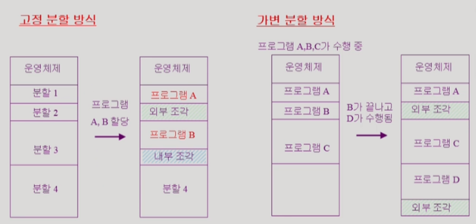

* 고정 분할 방식

  **프로그램이 들어갈 사용자 메모리 영역을 미리 파티션(partition)으로 나눠놓는 것**을 말한다. 이 경우, 동시에 메모리에 load되는 프로그램의 수가 제한되고 최대 수행 가능 프로그램 크기도 제한된다. 위 그림을 예시로 보면 메모리 영역은 이미 고정되어 나뉘어져 있고 프로그램 A와 B는 각각 자신의 크기에 맞는 파티션을 찾아 그 위에서 실행된다. 이 과정에서 프로그램을 담을만큼 충분한 용량을 가지지 못해 남겨진 메모리 영역을 의미하는 **외부 조각**과 파티션에서 프로그램이 실행되고 남은 메모리 영역을 의미하는 **내부 조각**이 발생한다.

* 가변 분할 방식

  **사용자 메모리 영역을 미리 나눠놓지 않는 방법**을 말한다. 가변 분할 방식은 프로그램의 크기를 고려해 프로그램들을 차곡차곡 메모리 영역에 할당한다. 이 때, 앞서 실행된 프로그램이 종료되거나 새로운 프로그램이 실행됨에 따라 남겨져버는 메모리 영역, 즉 **외부조각**이 발생할 수 있다. 이 **가용 메모리 공간**을 **Hole**이라고 하는데, 운영체제는 할당 공간과 흩어져 있는 가용 공간(hole)을 잘 고려해서 프로그램의 실행을 매끄럽게 도와야 한다. 한편, 가변 분할 방식에서는 미리 정해진 파티션이 없기 때문에 내부 조각은 발생하지 않는다.

* Dynamic Storage Allocation Problem

  **가변 분할 방식에서 size n인 요청을 만족하는 가장 적절한 hole을 찾는 문제**를 말한다. First-fit과 Best-fit이 Worst-fit보다 속도와 공간 이용률 측면에서 더 효과적인 것으로 알려져 있다.

  * First-fit

    Size가 n이상인 것 중에 최초로 찾아지는 hole에 할당하는 방법이다.

  * Best-fit

    Size가 n이상인 가장 작은 hole을 찾아서 할당하는 방법이다. 많은 수의 아주 작은 hole들이 생성되며, hole들의 리스트가 크기순으로 정렬되지 않은 경우 모든 hole의 리스트를 탐색해야 한다.

  * Worst-fit

    가장 큰 hole에 할당하는 방법이다. 이 역시 hole들의 리스트가 크기순으로 정렬되어 있지 않으면, 모든 리스트를 탐색해야 하고, Best-fit과는 달리 상대적으로 아주 큰 hole들이 생성된다.

* Compaction 

  사용 중인 메모리 영역을 한 군데로 몰고 hole들을 다른 한 곳으로 몰아 큰 block을 만듦으로써 외부조각 문제를 해결하는 방법이다. 다만, Run time binding이 지원되어야 수행 가능하고, 최소한의 메모리 이동을 고려하는 복잡한 문제를 해결해야 하기 때문에 비용이 매우 많이 든다는 단점이 있다.

### 2. Noncontiguous allocation

하나의 프로세스가 메모리의 여러 영역에 분산되어 올라갈 수 있는 방법을 말한다. 

* Paging 기법

  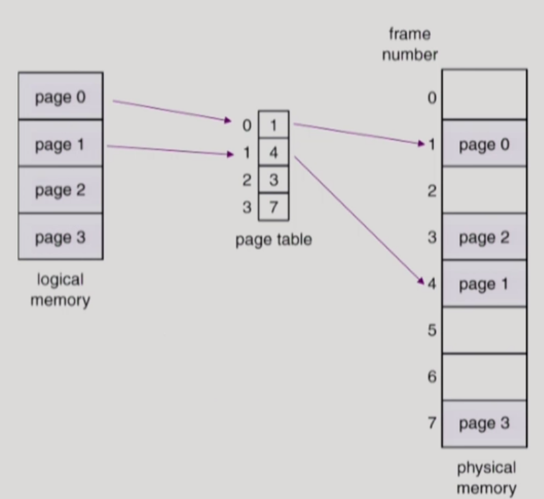

  **프로세스의 virtual memory를 동일한 사이즈의 page로 나누는 방법**이다. 따라서 virtual memory의 내용이 page 단위로 비연속적으로 저장되며, 일부는 backing storage에, 일부는 physical memory에 저장된다. 

  Paging 기법을 사용하기 위해서 physical memory를 동일한 크기의 **frame**으로, logical memory를 동일한 크기의 **page**로(frame과 같은 크기) 나눠야 한다. 그리고 기존과 달리 **page table**을 사용해서 logical address를 physical address로 주소 변환한다. 이 기법을 사용하면 가장 마지막 페이지로 인해 발생하는 내부 조각은 존재할 수 있지만, 마지막 page를 제외한 모든 page와 frame의 크기가 동일하기 때문에 외부 조각은 발생하지 않는다.

  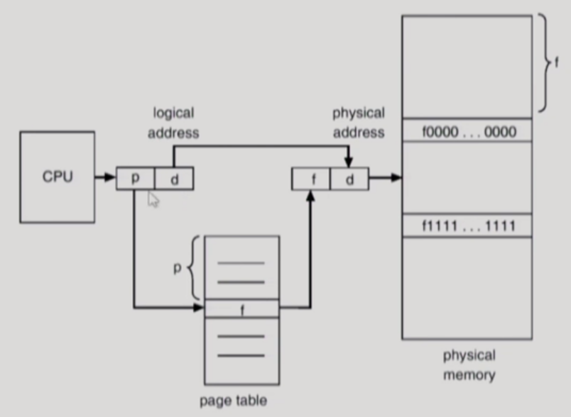

  위 그림으로 조금 더 자세히 살펴보자. CPU가 어떤 논리적 주소를 주면, 논리적 주소의 앞 부분 p는 페이지 번호가 되고, 뒷 부분 d는 페이지 번호의 주소에서 얼마나 떨어져 있는지 알려주는 offset이 된다. 따라서, p를 page table의 entry(=index)로 사용하면, 페이지 번호에 해당하는 frame 번호 f를 구할 수 있고 논리적 주소를 물리적 주소로 변환할 수 있게 된다.

  그렇다면 위의 page table의 구현은 어떻게 이루어질까? 앞서 살펴본 기존의 연속 할당 방식에서는 MMU를 이용한 2개의 레지스터(base register, limit register)만으로 주소변환을 충분히 할 수 있었다. 하지만 불연속 할당 방식을 사용하는 paging 기법에서는 page table을 따로 두고 기존과 다르게 처리한다.

  일단, Paging 기법에서 프로세스는 주로 4KB의 크기의 수많은 페이지로 나뉘어진다. 그래서 상당히 많은 entry 정보를 저장해야 하는 page table은 그 용량을 감당하기 위해 physical memory에 상주하게 된다. 즉, CPU의 논리적 주소를 주소 변환하기 위해서는 총 2번(page table 접근 한 번, 실제 data/instruction 접근 한 번) physical memory에 접근하게 된다. 

  Page table 운용에 사용되는 Register의 경우에는 page table을 가리키는 **Page-table base register(PTBR)**과 테이블 크기를 보관하는 **Page-table length register(PTLR)**이라는 2개의 register를 사용한다. 또한, **속도를 높이기 위한 하드웨어 측면의 방책**으로 **associative register**나 **translation look-aside buffer(TLB)**라는 고속 lookup hardware cache를 사용한다.

  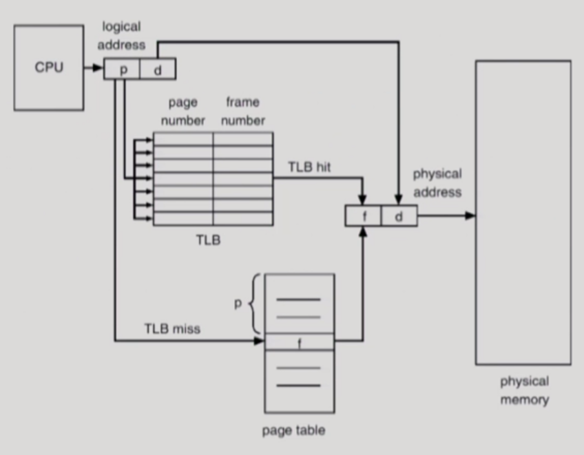

  TLB에 대하여 그림으로 살펴보자. 위 그림처럼 paging 기법에서 주소 변환을 수행하려면 두 번의 메모리 접근을 해야 하기 때문에, TLB라는 하드웨어의 지원을 통해 속도를 더 빠르게 가져갈 필요가 있다. TLB는 실제 캐쉬 메모리와는 다르지만 **주소 변환만을 위한 일종의 캐쉬 메모리 역할**을 하는데, page table에서 자주 쓰이는 일부 entry들을 TLB에 저장해두고 메모리보다 조금 윗단에서 entry를 빠르게 가져다 쓸 수 있게 해주는 역할을 한다. 즉, CPU가 주는 논리적 주소를 주소 변환할 때 먼저 TLB를 살펴보고, 만약에 TLB에 해당 entry가 있다면 한 번의 메모리 접근을, TLB에 entry가 없다면 원래대로 두 번의 메모리 접근을 한다.

  유의할 점은 page table의 경우 page number를 index로 바로 frame number를 알 수 있는 반면, TLB는 page number와 frame number가 쌍으로 이루어져 있어서 frame number를 알고 싶다면 전체 TLB의 원소를 모두 다 검색해봐야 검색 유무를 판단할 수 있다는 것이다. 따라서, 이 검색을 원활히 진행시키기 위해 associative register들로 parallel search가 가능하도록 해 단번에 frame number를 알 수 있도록 만든다.

  또한, page table은 각 프로세스마다 다르게 존재하므로, 이에 대응하기 위해 context switch가 일어날 때마다 TLB는 flush되어야 한다.

  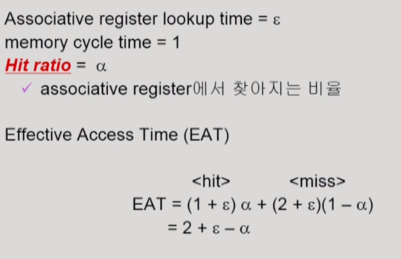

  앞서 살펴본 것을 토대로 메모리 접근 시간을 파악해보면 위와 같다. 결론적으로 1보다 작은 값 입실론과 1에 아주 가까운 알파 값으로 인해 EAT(Effective Access Time)는 2보다 작아지게 되어, **적어도 메모리에 두 번 접근하는 것보다 나은 방법**이 된다는 것이 증명된다.

​    

* Two-Level Page Table (2단계 페이지 테이블)

  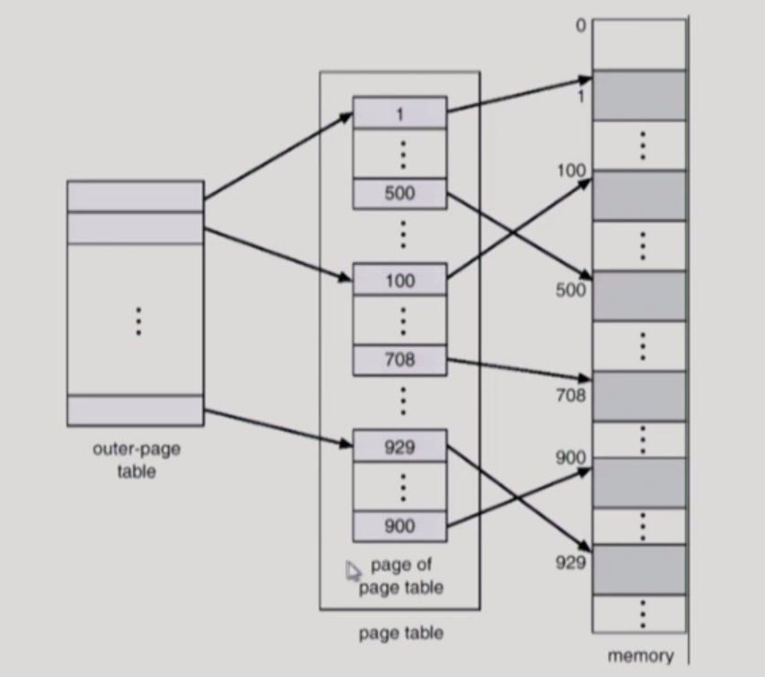

  Two-Level Page Table은 위와 같이 **바깥 page table과 안쪽 page table 두 개를 활용하는 방법**이다. 본래의 Page Table에서는 공간적 낭비가 발생하기 때문에, 이를 막고자 나타난 것이 Two-Level Page Table이다. 현대 컴퓨터는 address space가 매우 큰 프로그램도 잘 지원할 수 있는데, 용량이 큰 프로세스라고 할지라도 대부분의 프로그램은 자신의 주소 공간의 매우 일부분만 사용한다. 이 경우, 기존의 page table은 배열이기 때문에 논리적 주소의 일부분만 사용되어 빈공간이 생기더라도 전체의 주소 공간을 저장할 수 있게끔 생성된다. 즉, 이 과정에서 생기는 빈공간들이 공간적 비효율성을 야기한다.

  사실 바깥 page table과 안쪽 page table 두 가지를 사용하니까 시간적으로나 공간적으로나 더 낭비가 클 것 같지만 실제로는 충분한 이점이 있다. 앞서 말햇듯이 프로세스의 주소 공간 중 거의 쓰이지 않는 부분이 훨씬 많기 때문에, 바깥 page table에서 해당 부분들을 Null로 처리해버리면 Null로 처리된 곳에는 안쪽 page table이 생성되지 않아 **공간적인 낭비가 감소하는 효과**가 있다.

  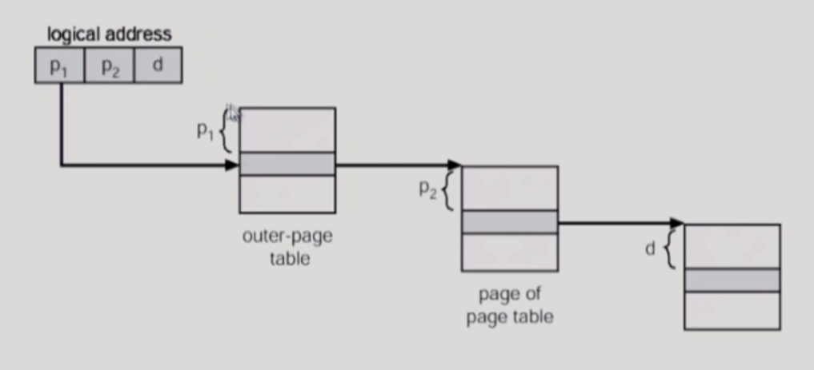

  Two-Level Page Table은 위와 같이 바깥 page table 속의 entry마다 안쪽 page table을 둬서 이 page table들을 두 번 거친 후에 물리적 메모리 주소에 도달하게 한다. 이 때, 안쪽 page table 각각의 크기는 4KB로 본래의 page의 크기와 동일하게 된다.

  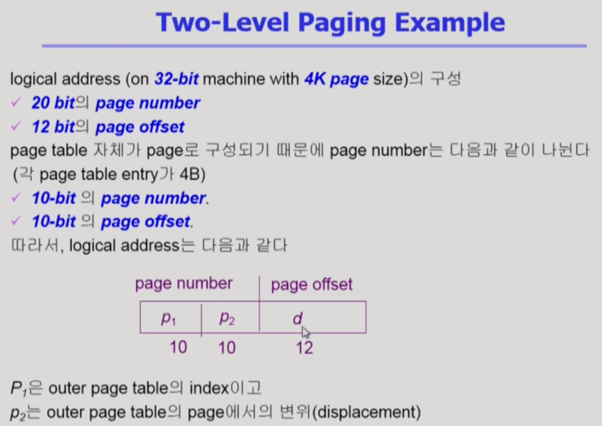

  Two-Level Page Table의 주소 공간에 대한 bit 수 분배는 위의 예시와 같으니 참고하도록 하자.

​    

* Multi-Level Paging

  프로세스의 주소 공간이 더 커지면, 다단계 페이지 테이블이 효율적이다. 페이지 테이블이 더 많아져 메모리 접근 횟수 역시 더 많아질 수 있지만, 공간 낭비를 더욱 줄일 수 있다. 또한, TLB를 사용하면 메모리 접근 횟수 및 총 소요 시간도 크게 줄일 수 있다.

  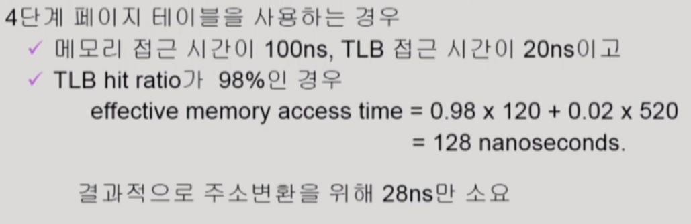

  예를 들어, 4단계 페이지 테이블을 이용하는 경우만 해도 위와 같이 메모리 접근 시간이 크게 소요되지 않음을 알 수 있다.

​    

* Paging 기법에 관한 몇 가지 Issue

  * 페이지 테이블의 Valid / Invalid bit 

    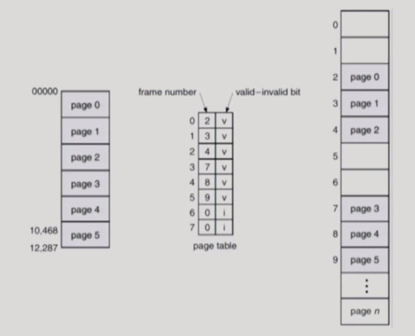

    페이지 테이블에는 **해당 페이지가 실제로 사용되느냐 안되느냐를 표현**하는 valid-invaild bit이 존재한다. Valid는 해당 주소의 frame에 프로세스를 구성하는 유효한 내용이 있어 접근을 허용함을 뜻하고, invalid는 해당 주소의 frame에 유효한 내용이 없어 접근을 허용하지 않음을 뜻한다. Invalid에서 해당 주소 frame에 유효한 내용이 없다는 것은 프로세스가 해당 주소 부분을 사용하지 않는 경우 혹은 해당 페이지가 메모리에 올라와 있지 않고 swap area에 있는 경우를 말한다.

    만일 프로세스의 주소 공간에서 거의 쓰이지 않는 영역에 해당하는 페이지라면 invalid임을 표시해 구분하는 것이 유용하다. Frame number를 0으로 두는 것만으로는 그것이 0번 frame을 의미하는 것인지 메모리에 올라와 있지 않다는 것을 말하는지 분별할 수 없기 때문이다.

  * 페이지 테이블의 Protection bit

    페이지 테이블에는 또 하나의 bit이 존재한다. Protection bit이라고 불리는 이 bit은 **해당 page의 연산(read/write/read-only)에 대한 권한을 부여**한다. 프로세스에는 code, stack, data 영역이 있는데, code 부분에 해당하는 page의 경우 내용이 바뀌면 안되기 때문에 read only 연산만 가능하게 설정하고 다른 영역은 read, write 모두 가능하게 설정한다.

  * Inverted Page Table 

    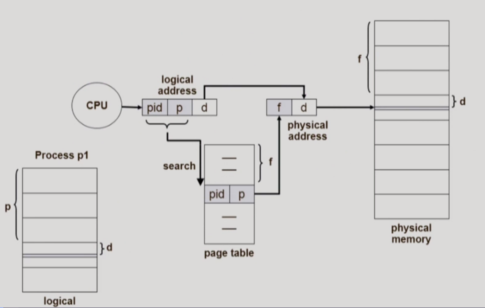

    기존 page table의 큰 공간 낭비 문제를 해결하기 위한 또 하나의 방법이다. 기존 page table이 page number에 따라 page table entry를 만드는 것과 달리, inverted page table은 **frame number에 따라 page table entry를 만든다.** 그렇기에 page table도 프로세스마다 존재하는 것이 아니라 시스템에 단 하나 존재한다. 그리고 이를 보완하기 위해 page table 각각의 entry에 프로세스 ID를 추가로 넣어줘 어떤 프로세스의 page인지 구분할 수 있도록 한다. 

    Inverted 방식의 page table은 한 개만 존재함으로써 공간 낭비를 극적으로 줄일 수 있다. 다만, 주소 변환을 하기 위한 시간적 overhead는 커지기 때문에, associative register를 활용해 병렬적으로 page table 검색을 하게끔하는 방식을 보완해 사용한다.

  * Shared Page

    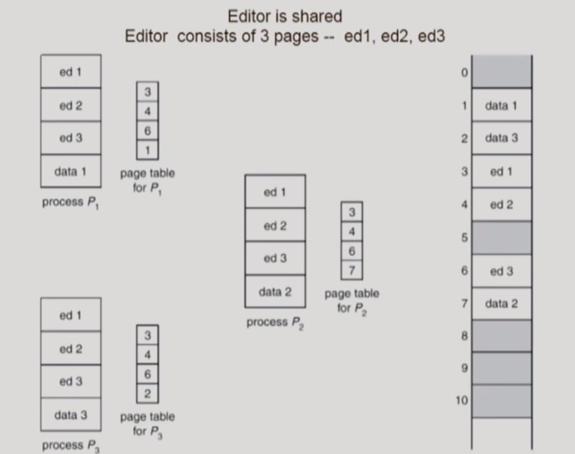

    Shared page는 shared code가 page로 나뉠 때 사용되는 용어이다. Shared Code(=Re-entrant Code =Pure code)는 **프로세스마다 동일한 프로그램을 실행함으로 인해 같은 코드가 쓰이는 경우에 read-only 상태로 공유하고 메모리에 올리는 하나의 코드**를 말한다. 예를 들어, Text editor나 compiler, window systems 같은 프로그램들은 굳이 코드를 여러번 중복할 필요가 없기 때문에, shared code로 공유한다. 이러한 shared code는 모든 프로세스의 논리적 주소 공간에서 동일한 위치에 있어야 하며, 각 프로세스의 독립적인 private code와 data는 프로세스의 논리적 주소 공간 어디에 위치해도 상관없다.

​    

* Segmentation 기법

  이제 또 다른 대표적인 불연속 할당 방식으로 Segmentation 기법을 알아보자. Segmentation은 **프로그램을 의미 단위로 구성된 여러개의 segment로 나누어 할당하는 방식**이다. Segment는 크게는 프로그램 전체, 작게는 함수 하나하나로 정의 될 수 있는데, 일반적으로 code, data, stack 영역이 하나씩 segment로 분류된다.

  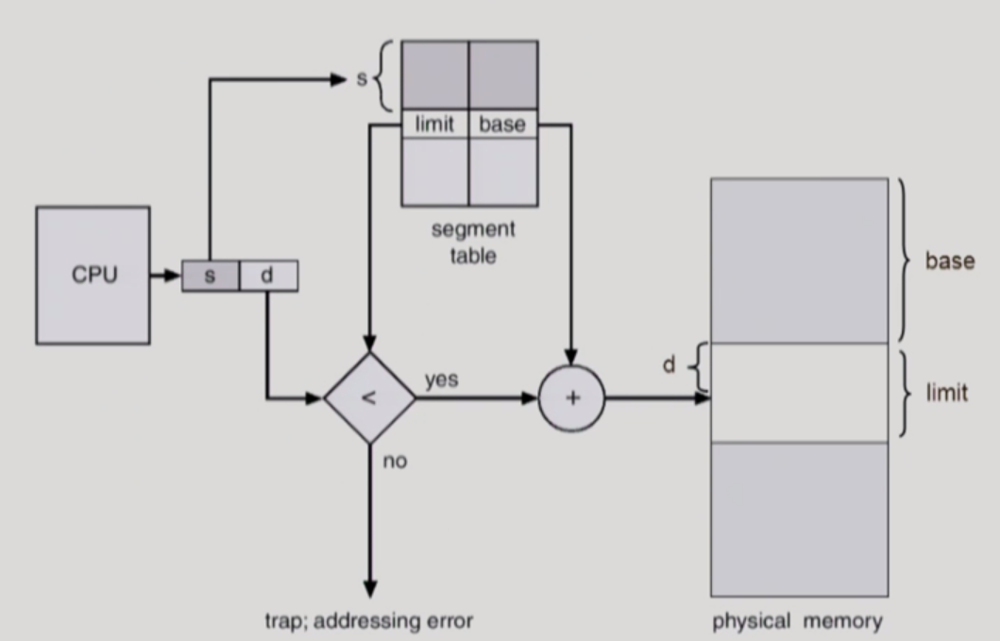

  **Segmentation에서 논리적 주소는 segment-number와 offset으로 구성**된다. 또한 Paging 기법과 비슷하지만 다르게 사용되는 **segment table**이 존재하며, 테이블 내 각각의 entry에는 **segment의 물리적 주소 시작점을 담는 base**와 **segment의 길이를 담는 limit**이 존재한다. 또한, 물리적 메모리에서 segment table의 위치를 담는 Segment-table base register(STBR)와 프로그램이 사용하는 segment의 수를 기록하는 Segment-table length register(STLR)가 존재한다.

  위의 그림에서 CPU가 논리적 주소를 주게 되면, segment table에서 논리적 주소의 segment 번호 s에 해당하는 entry를 찾게 된다. 그리고 entry에서의 base 값과 논리적 주소의 offset d를 이용해 물리적 주소에 접근한다. 또한, 물리적 메모리에 접근하기 전에 해당 entry에서 limit 값을 확인하여, 논리적 주소의 offset 값이 프로그램의 주소 범위를 벗어나지 않았는지 파악한다. Paging 기법과 달리 각각의 Segement는 길이가 다르기 때문에, entry에 존재하는 limit 값을 통해 segment의 길이를 결정짓는 것이 중요하고, 이를 활용해 프로그램의 범위를 벗어나는 악의적인 접근에 대해 trap을 건다.

  Segmentation은 segment 각각의 길이가 동일하지 않으므로 **외부조각이 발생하는 문제**가 있다. 하지만, **read/write/execution 등의 권한을 부여하는 protection 작업이나 각각의 프로세스가 동일한 코드를 공유하는 sharing 작업에서는 의미 단위를 강조하는 Segmentation이 매우 효과적**이라는 장점도 있다.

  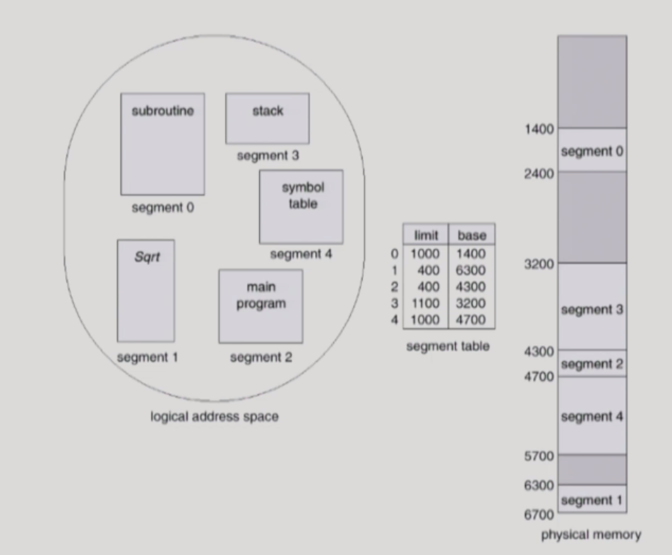

  위 그림은 Segmentation의 한 예시인데, paging 기법의 크기가 4KB인 수많은 page 개수에 비하면 segment의 개수는 현저히 적음을 알 수 있다. 프로그램이 의미 단위로 큼직큼직하게 쪼개지기 때문에 위 예시에서는 segment의 개수가 5개밖에 되지 않는다. 대신 segment의 용량은 4KB로 크기가 고정되어 있는 page에 비하면 매우 커질 수 있다.

  또한, segment의 개수가 적어짐에 따라 segment table의 entry 개수도 적어지므로, page table과 달리 table로 인한 공간 낭비가 현저하게 감소한다.

​    

* Paged Segmentation (=Segmentation with Paging)

  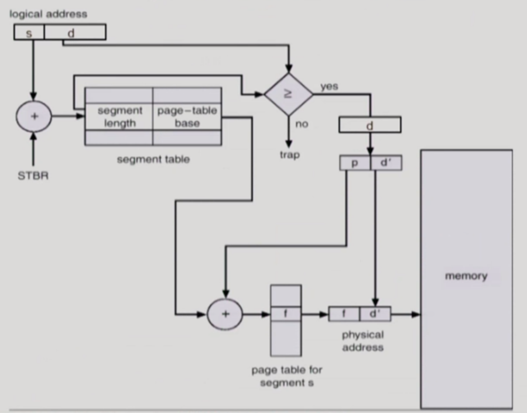

  Paged Segmentation은 **Paging 기법과 Segmentation 기법을 혼합하여 Segmentation된 각각의 segment에 paging을 적용하는 방법**이다. 이렇게 혼합 방식을 사용하면 Segmentation에서 발생하는 외부 조각 문제를 해결하고 protection과 sharing은 본래의 의미 단위대로 처리할 수 있어 유용하다. 실제로도 순수한 Segmentation만을 사용하는 컴퓨터는 없으며 Segmentation을 사용한다면 이렇게 Paging과 혼합적으로 운용한다.

  Paged Segmentation의 과정을 살펴보자. 위 그림에서 CPU가 논리적 주소를 주면 segment 번호 s를 사용해 segment table의 해당 entry에 접근한다. 그리고 offset d가 해당 entry의 limit 값을 넘어가지 않는다면, d에 존재하는 페이지 번호 p를 사용해 해당 segment에 mapping된 page table의 entry에 접근한다.(offset d가 limit 값을 넘어간다면, trap을 건다.) 그 후, entry에 해당하는 프레임 번호 f와 d에 존재하는 offset d'을 더해 물리적 주소로 변환을 완료한다.

​    

## Memory Management 챕터에 관하여

메모리 관리 챕터는 물리적 메모리에 관하여 다뤘다. 이 메모리 접근 과정에서 **운영체제의 역할은 없었고, 오직 하드웨어의 역할만 있었음**을 유의하자.