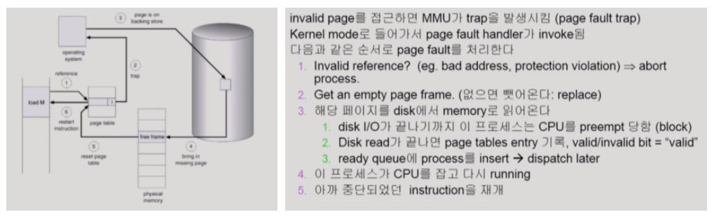
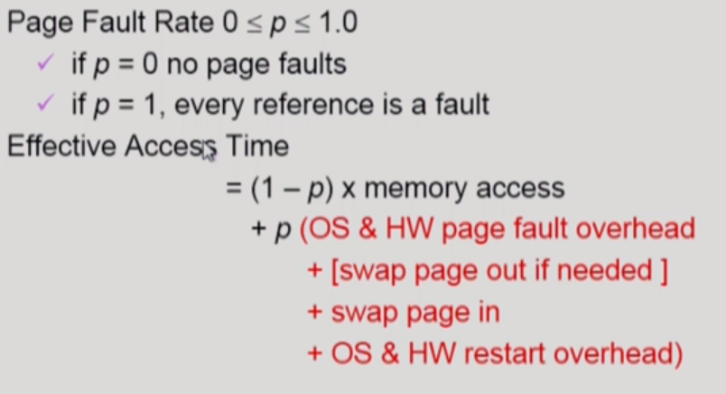
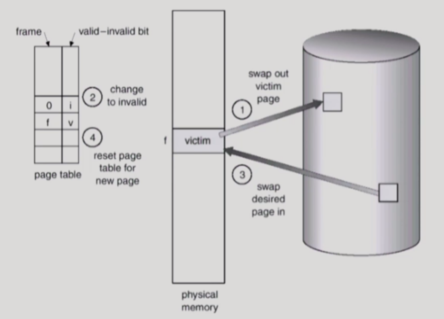
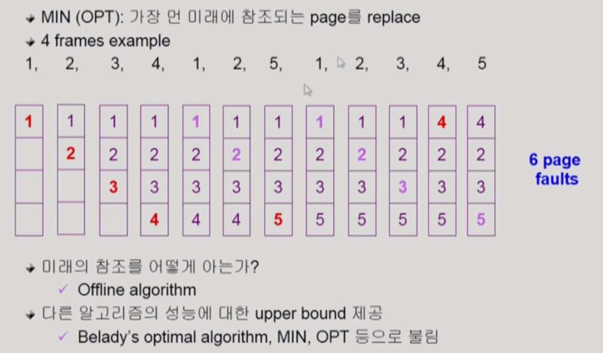
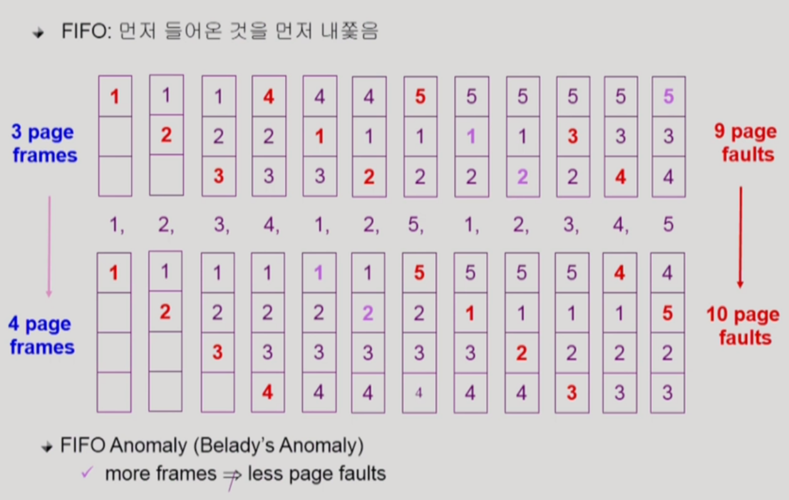
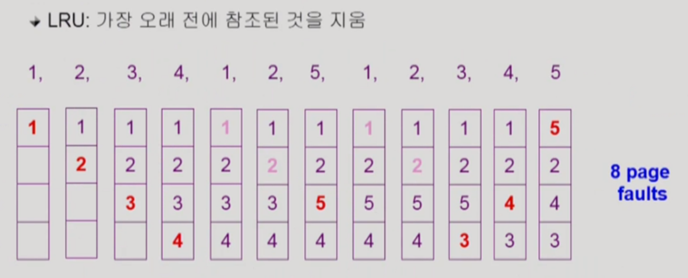
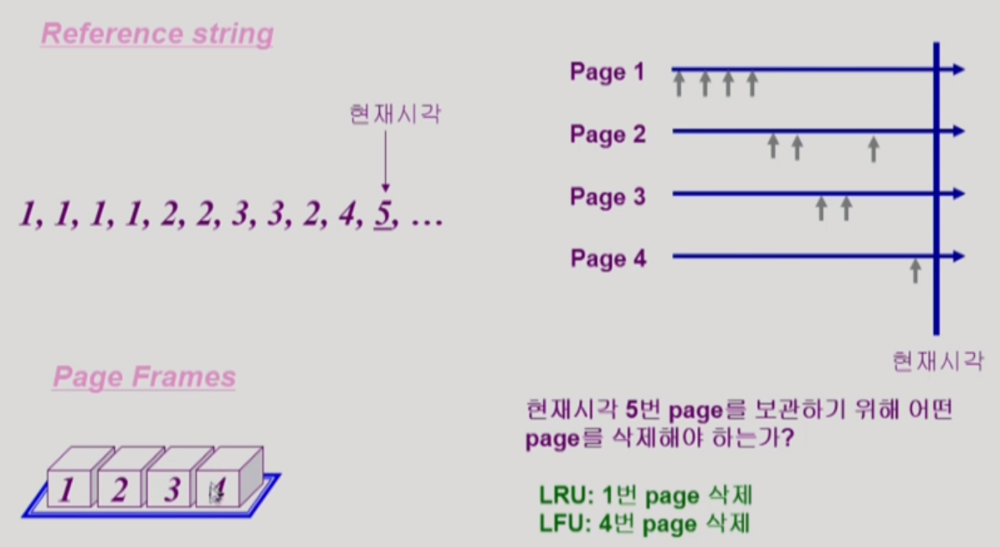
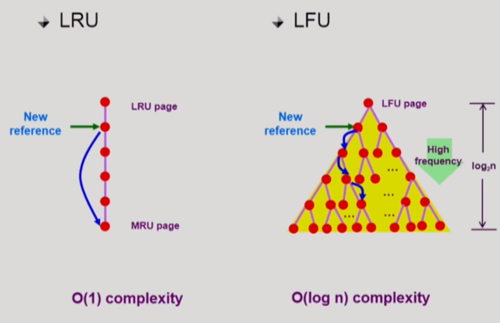

> 이번 챕터부터는 메모리 관리 기법 중 paging 기법을 사용하는 것을 가정한다. 실제로도 대부분의 시스템은 paging 기법을 채택하고 있다.

​    

## Demand Paging

실제로 특정 page에 대한 요청이 있을 때 해당 page를 메모리에 올리는 것을 말한다. 프로그램에는 안정적인 실행을 위해 방어적으로 넣은 자주 쓰이지 않는 코드 영역들이 매우 많이 존재한다. 그렇기에 실제로 쓰이는 코드들만 메모리에 올리면, I/O 양과 메모리 사용량을 크게 감소시킬 수 있고 더 많은 사용자들이 멀티 프로세싱할 수 있는 환경이 만들어진다.

Demand Paging에서 페이지 테이블의 entry에 존재하는 valid/invalid bit의 역할을 살펴보자. Invalid는 주소 영역에서 사용되지 않는 부분이나 페이지가 물리적 메모리에 올라와 있지 않은 상황을 의미한다. 처음에는 모든 page entry가 invalid로 초기화되어 있다. 그리고 주소 변환시 해당 페이지가 invalid로 세팅되어 있다면, page fault를 일으킴과 동시에 trap을 걸어 운영체제에게 CPU를 넘기고 page fault가 난 페이지를 메모리에 올리게끔 한다. Page fault에 대한 처리 루틴은 운영체제에 정의되어 있으며, 구체적으로는 위 그림과 같은 과정을 거친다.

Backing storage에서 메모리에 페이지를 올리는 디스크 I/O는 시간이 오래걸리기 때문에, page fault가 얼마나 나느냐에 따라 메모리 접근 시간에 차이가 날 수 있다. 위의 Effective Access Time에서 p는 보통 굉장히 작아서 대부분의 경우 page fault가 나지 않는다. 하지만, 적은 확률로 page fault가 나는 상황에서는 위의 붉은 글씨의 요인들처럼 큰 시간적 오버헤드가 발생함을 유의한다.

​    

## Page replacement

메모리에 여유 공간이 필요할 때, 운영체제가 어떤 frame을 빼앗아서 page를 쫒아낼지 결정하는 것을 Page replacement라고 한다. 이것을 구현하는 알고리즘을 Replacement Algorithm이라고 하는데, page fault rate을 최소화하는 방향으로 page를 쫒아내도록 알고리즘을 잘 설정해야 한다.

### Optimal Algorithm (실제로 쓰이진 않음)

Optimal Algorithm은 가장 먼 미래에 참조되는 page를 replace하는 방식으로 Page fault를 최소화하는 알고리즘이다. 위 예시처럼, 미래의 page 참조를 전부 안다고 가정하고 진행하기 때문에 실제로 시스템에서 쓰이진 않지만, 가장 최고의 성능을 나타내는 지표로서 다른 알고리즘들의 성능에 대한 upper bound를 제공한다. 

### FIFO Algorithm (실제로 쓰임)

간단하게 먼저 올라온 page를 먼저 쫒아내는 방식이다. 특이한 점은 frame 수를 늘리면 성능이 좋아져야 할 것 같지만, FIFO 알고리즘에서는 오히려 성능이 떨어지는 현상이 발생하는데, 이를 FIFO Anomaly 혹은 Belady's Anomaly라고 부른다. 

### LRU (Least Recently Used) Algorithm (실제로 쓰임)

LRU(Least Recently Used) 알고리즘은 참조의 측면에서 가장 오래 전에 참조된 page를 쫒아내는 방법이다. 얼핏보면 FIFO와 비슷하지만, FIFO보다 효율적으로 동작하여 더 많이 쓰이는 알고리즘이다. 

### LFU (Least Frequently Used) Algorithm (실제로 쓰임)

LFU(Least Frequently Used) 알고리즘은 참조 횟수가 가장 적은 page를 쫒아내는 방법이다. 동일한 참조 횟수를 기록 중인 page가 여럿 있을 때는 일반적으로 큰 의미를 두지 않고 알고리즘이 임의로 쫒아낸다. 다만, 그 중에서도 가장 오래 전에 참조된 page를 쫒아내도록 알고리즘을 설계하는 것이 성능 향상에 이로울 수 있다.

​    

> LRU VS LFU

LRU는 참조 시점의 최근성을 반영한다. 반면에 LFU는 장기적인 측면에서 page의 인기도를 더 정확히 반영하는 장점이 있다. 다만, LFU는 LRU보다 구현이 복잡하다.

LRU의 경우는 시간에 따라 일렬로 줄 세우고 가장 최근에 참조했던 페이지를 내쫒으면 된다. 따라서, Linked List 자료구조로 구현하여, 페이지를 내쫒는 작업을 O(1) 시간 복잡도로 수행하게끔 한다. 반면에, LFU는 페이지의 참조 빈도가 계속 바뀌기 때문에, heap 자료구조를 사용하여 지속적으로 정렬하는 방법을 사용한다. 이 경우 페이지를 내쫒는 작업은 O(log n)의 시간 복잡도로 수행된다.