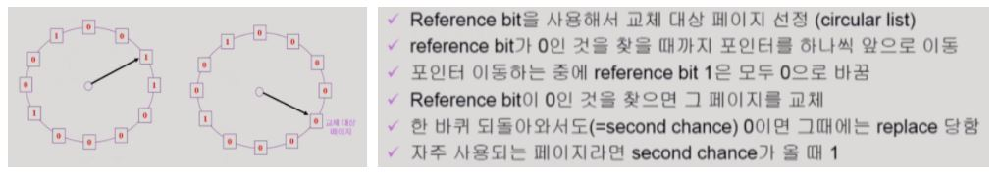
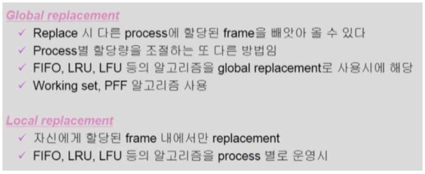
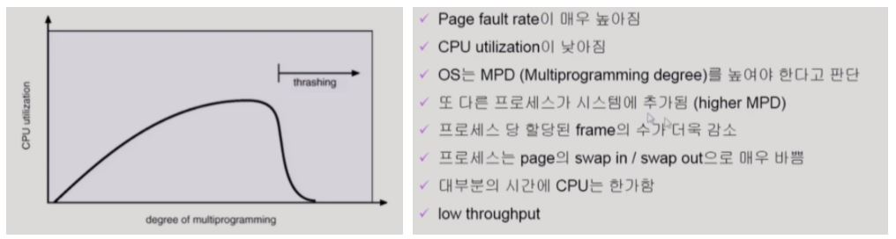
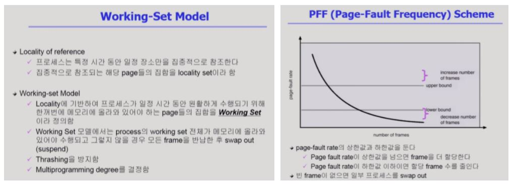

## Page replacement - 다양한 캐싱 환경

### 캐싱 기법

한정된 빠른 공간(=캐쉬)에 요청된 데이터를 저장해 두었다가 후속 요청시 캐쉬로부터 직접 서비스하는 방식이다. 즉, 한 번 썼던 데이터는 빠른 접근이 가능한 캐쉬 메모리에 저장해두었다가 가까운 시기에 해당 데이터에 대한 접근이 요청되면 빠르게 제공해준다. Paging system과 더불어 cache memory, buffer caching, Web caching 등 다양한 분야에서 사용되는 방식이다. 

### 캐싱 기법의 운영상 시간 제약

다만, 이러한 캐싱 기법은 운영상 시간 제약이 존재한다. 교체 알고리즘이 삭제할 항목을 결정하는 일에 지나치게 많은 시간을 소요하지 않아야 한다. 예를 들어, Buffer caching이나 Web caching의 경우 시간 복잡도가 O(1) ~ O(logN) 정도까지 허용한다.

반면, Paging system에서는 기존의 LRU, LFU 등의 삭제 항목 결정 알고리즘이 실제로 사용되기는 어렵다. Paging system의 경우 page fault가 생길 때만 OS가 관여하기 때문에, 페이지가 이미 메모리에 존재하는 상황에서의 참조 시각 정보는 OS가 알 수 없다. 즉, 특정 상황의 참조 시각과 참조 빈도 등을 알 수 없으므로, 앞에서 살펴봤던 LRU, LFU 등의 알고리즘은 실제 시스템에서는 사용되기 어렵다.  

### Clock Algorithm (=Second Chance Algorithm)

캐싱 제약을 극복하기 위해, paging system에서는 일반적으로 Clock Algorithm이 쓰인다. 이 알고리즘에서는 각각의 page table entry에 최근에 참조함을 나타내는 reference bit을 둔다. 그리고 이미 메모리에 올라와 있는 페이지에 대해 참조가 일어날 경우, 하드웨어가 reference bit을 1로 바꿔 최근에 참조함을 기록한다. 그리고 메모리에 새로운 page를 올려할 상황이라 OS가 내쫒을 page를 결정할 때에는 위와 같은 과정으로 reference bit을 참고해 오래된 page를 내쫒는다. 

또한, 조금 더 개선된 성능을 위해 modified bit을 둬서 page에 write가 일어났는지 여부를 기록한다. 만일, modified bit이 1인 page가 있다면 해당 페이지는 메모리에 올라와서 최근에 내용이 변경된 것이기 때문에, backing storage로 쫒아낼 때 변경된 내용을 반영하고 쫒아내야 한다.

​    

## Page Frame의 Allocation

지금까지는 페이지가 어떤 프로세스에 속하느냐를 구체적으로 고려하지 않고 작업을 수행했다. 하지만, 각 프로세스마다 얼마만큼의 page frame을 할당한 것인가는 중요한 문제이다. 메모리 참조 명령어 수행시 명령어, 데이터 등 여러 페이지를 동시에 참조하게 되는데, 이 명령어 수행을 위해 최소한 할당되어야 하는 frame 수가 있기 때문이다. 예를 들어, 반복문을 구성하는 page가 3개라고 한다면, 3개가 한번에 할당되는 것이 좋다. 2개가 할당된다면, 매 loop마다 page fault가 일어나 원활한 수행에 방해가 된다.

### 3가지 Allocation 방법 (∝ Local repacement)

* Equal Allocation: 모든 프로세스에 똑같은 갯수 할당

* Proportional Allocation: 프로세스 크기에 비례하여 할당

* Priority Allocation: 프로세스의 priority에 따라 다르게 할당

​    

> Global replacement VS Local replacement
>
> 
>
> Global replacement는 따로 프로세스마다 할당되어야할 frame 개수를 정해놓지 않더라도 알고리즘을 수행하다보면 알아서 필요한 프로세스에 page가 더 많이 할당되는 것을 말한다. 반면에, Local replacement는 프로세스마다 할당할 page 개수를 정해둔 것을 말한다.

​    

### Thrashing

프로세스의 원활한 수행에 필요한 최소한의 page frame 수를 할당받지 못한 경우 발생한다. 위 그래프와 같이, 메모리에 동시에 올라온 프로세스 개수가 많아질수록, 특정 순간에 CPU 이용률이 급감해버리는 thrashing 현상이 발생한다. 보통 위와 같은 과정을 거쳐 thrashing으로 이어진다. 이를 해결하기 위해 두 가지 알고리즘을 소개한다.

### Working-Set Algorithm VS PFF (Page-Fault Frequency) Scheme (∝ Global repacement)

