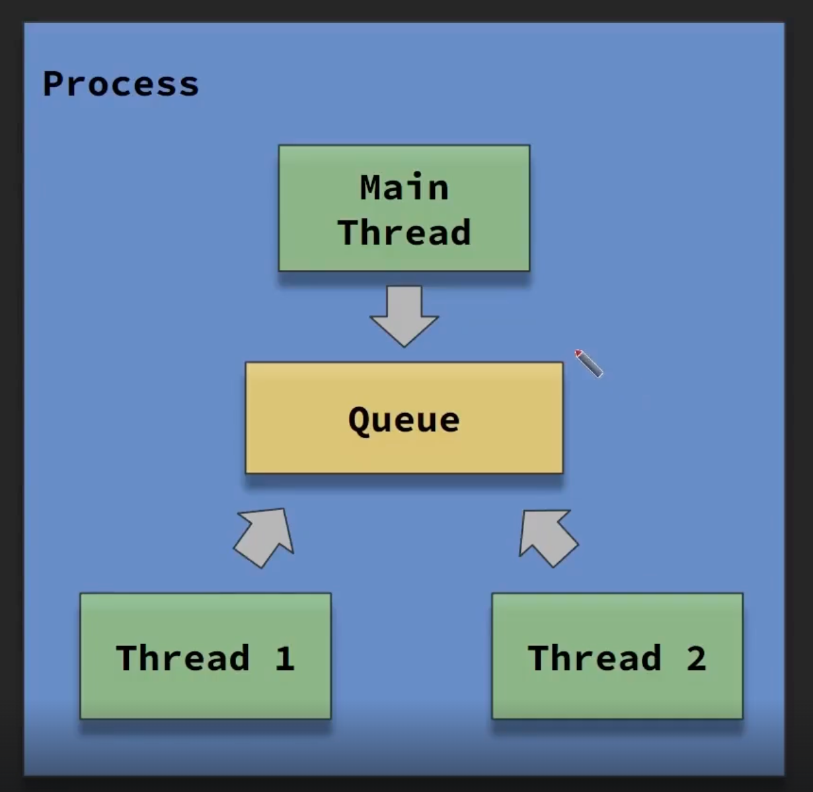
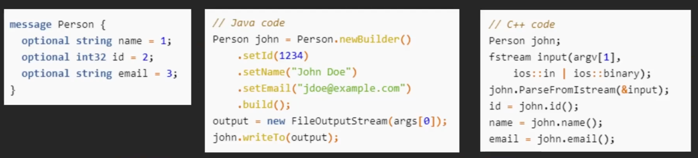

## Thread
- Thread란?
	- 흐르는 시냇물 위에 띄워놓은 돛단배
	- 스레드 스타트 이후 계속 원하는 작업들이 진행될 것이고 내 손을 떠나도 계속 돌아감
	- 
- Entrypoint (진입점)
	- `public static void Main(String[] args) {}`
	- Process가 맨 처음 실행하는 함수
	- Main Thread에서 실행
	- 위 함수가 종료되면 Process도 종료
	- 
- 쓰레드 사용하기
	- `var thread = new Thread(Func);`
		- 스레드 생성
	- `thread.Start();`
		- Thread 생성자에 넣어준 함수를 별도의 스레드에서 실행
	- `thread.Join();`
		- 스레드가 종료될 때까지 대기함 (Blocking)
- Blocking & Non-Blocking
	- Blocking
		- 함수를 실행하고 모든 코드가 완료된 후 리턴되면 Blocking
	- Non-Blocking
		- 실행한 함수의 코드가 완료되지 않고 리턴되면 Non-Blocking
- Non-Blocking 함수의 실행과 완료를 아는 방법
	- Polling
		- 주기적으로 확인하기
		- 어떤 스레드에서 isFinish에 true 값을 넣으면 스레드 실행의 완료를 파악
			```C#
			while(true) {
				if (isFinish == true) {
					Break;
				}
				sleep(1000);  //CPU 100%되지 않게
			}
			```
		- e.g. HTTP 통신
	- Event
		- Event가 발생했을 때 내가 원하는 함수를 호출해줌
		- `setTimeout(callback, 1000); //1초 후 callback 함수 실행`
		- 콜백 지옥 유의 (요즘은 `async` & `await` 사용)
- `async` & `await` 장점은 무엇인가요?
	- 멀티스레드 프로그래밍(비동기 실행)을 하지만 Blocking 방식으로 진행해서 편함
	- 콜백지옥 피할 수 있음 
		```C#
		public async function Task<string> GetString() {
			...
		}
		string result = await GetString();
		Console.Write(result);
		```
	- getString() 함수는 다른 스레드에서 실행되지만 Blocking 방식으로 호출
	- = 비동기로 실행하지만 Blocking 방식


## Process & Thread
- 생성 과정
	- **하나의 실행 파일**을 실행시키면 **하나의 Process** 생성 (.exe, .dll or whatever)
	- 해당 Process 안에는 **Main Thread**가 자동으로 생성됨
- Multi Thread란?
	- **한 process 안에 Main Thread 외에 다른 Thread**가 있으면 Multi Thread!
	- 다만, Thread 간에 아무런 메모리 공유가 없다면 애매함
- Process와 Thread의 차이?
	1. **Thread끼리는 메모리를 공유**
		- 문제
			
			- 모든 Thread가 하나의 queue를 공유하면 큐가 망가질 것
		- **배타제어** (**해결책**)
			- Concurrent Class (Councurrent Prefix가 붙은 Class)
				- 처음부터 망가뜨릴 수 없는 오브젝트 만들기
				- 해당 클래스의 구현 방법에 따라 성능저하 발생 가능
			- Thread Safe 일반 Class
				- 일반 클래스도 Read는 Thread Safe한 경우가 있음
					- Thread Safe: 여러 Thread가 Read해도 괜찮음
				- 이 경우 Write는 한 Thread에서만, Read는 여러 Thread에서 진행하면 유용
			- Lock
				- 특정 코드 구간을 반드시 한 Thread만 실행하도록 막음 (크리티컬 섹션)
				- Lock을 건 코드 구간의 실행시간이 길수록 성능저하가 발생
					- 최악의 경우 Single Thread가 차라리 나음
					- One Process, One Thread Architecture가 나온 이유
						- Redis도 처음에 이 아키텍처를 따름에도 매우 빨라서 인기 얻음
			- Lock Free
				- Lock을 사용하지 않고 배타제어를 하는데 목적을 둠
				- 관련 키워드: interlocked.increment(), Atomic Operation, Lock-Free 알고리즘, Non-Blocking 알고리즘, CAS(compare and set)
	2. **Process끼리는 메모리 공유 X**
		- 문제
			- Process끼리는 메모리 공유가 안되기 때문에, **통신**이 필요 (HTTP, TCP...)
				- MSA를 지향하는 현대 사회에서는 Process간 통신 필수
				- **MSA = Multi Process**
			- Multi Process 필요성
				- 서버 머신 한 대 성능에는 한계, Scale Out 필수!
				- 서버 Architecture 구상하는 입장에서는 **Process 하나가 작은 기능을 담는 것**이 훨씬 유리 (One Process, One Thread가 설득력 얻는 부분)
		- **Multi Process 간 통신 방법** (**해결책**)
			- Google Protobuf, Apache Avro (**Good**)
				
				- **프로세스 간의 통신 지원**
					- 프로토콜
					- 통신 코드
					- 다른 언어 프로세스 간 패킷 전달
				- IDL 파일에 모델을 정의 해두면 Java, C++, JS, C# 등 **여러 언어에서 사용 가능**
			- JSON (Bad)
				- 필드 추가시 상대방에게 알려주기 어려움
				- 오타로 인한 디버깅 Cost
			- 데이터를 어딘가에 올려놓고 필요한 서버가 알아서 가져가게 하는 방법
				- Redis Pub/Sub
					- 특정 key에 데이터를 넣고 Pub/Sub
				- AWS SQS
					- Queue에 넣고 데이터가 추가됐을 때, 특정 Topic으로 Event 받기
					- 빠르게 통신할 필요가 없는 경우 이용
						- 웹서비스는 느리다는 느낌은 안듦
						- TCP 실시간 통신 서비스는 느리다 느낄 수 있음
	