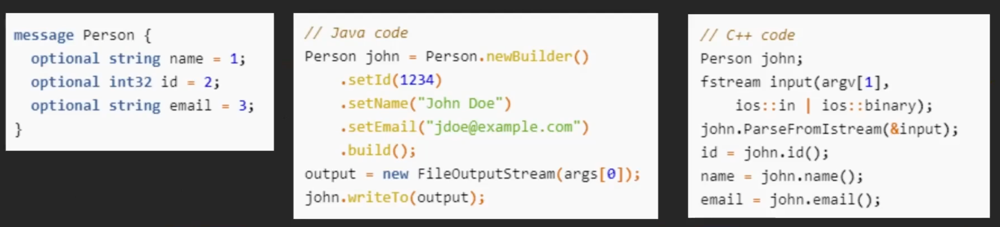
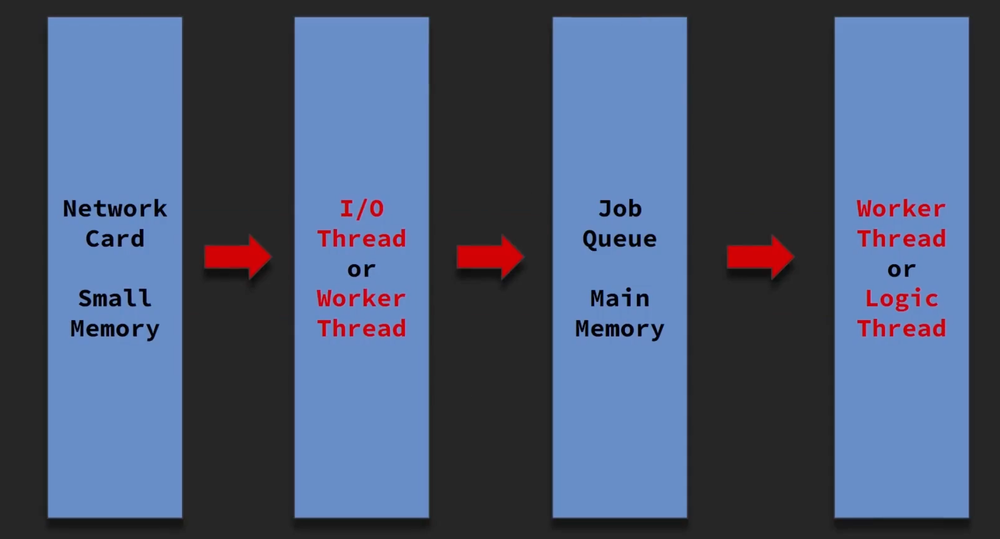

## Process & Thread 차이
- **Thread**는 서로 **메모리 공유 O**
	- 문제
		- 모든 Thread가 하나의 자료구조(e.g. queue)를 공유하면 자료구조가 망가질 것
	- **해결책**: **배타제어** (=동기화) 
		- **Concurrent Class** (동시성 컬렉션)
		- **Lock**
			- **특정 코드 구간**을 **반드시 한 Thread만 실행**하도록 막음 (크리티컬 섹션)
			- **Lock을 건 코드 구간**의 **실행시간이 길수록 성능저하**가 발생
				- 최악의 경우 Single Thread가 차라리 나음
				- **One Process, One Thread Architecture**가 나온 이유
					- Redis도 처음에 이 아키텍처를 따름에도 매우 빨라서 인기 얻음
		- **Lock Free**
			- Lock을 사용하지 않고 배타제어
			- 관련 키워드: interlocked.increment(), Atomic Operation, Lock-Free 알고리즘, Non-Blocking 알고리즘, CAS(compare and set)
		- Thread Safe하게 일반 Class 사용하기
			- **Write**는 **한 Thread**에서만, **Read**는 **여러 Thread**에서 진행하면 유용
- **Process**는 **서로 메모리 공유 X**
	- 문제
		- Process끼리는 메모리 공유가 안되기 때문에, **통신**이 필요 (HTTP, TCP...)
			- **MSA**를 지향하는 현대 사회에서는 **Process간 통신 필수**
			- **MSA = Multi Process**
		- Multi Process 필요성
			- 서버 머신 한 대 성능에는 한계, **Scale Out 필수**!
			- 서버 Architecture 구상하는 입장에서는 **Process 하나가 작은 기능을 담는 것**이 훨씬 유리 (One Process, One Thread가 설득력 얻는 부분)
		- **언어가 다른 Process끼리**는 서로 패킷 주고 받는게 **스트레스**
	- **해결책**: **Multi Process 간 통신 방법** 
		- **서버 간 통신 방법**
			- Google Protobuf, Apache Avro (**Good**)
				
				- IDL 파일에 모델을 정의해두면 Java, C++, JS, C# 등 **여러 언어에서 사용 가능**
			- JSON (Bad)
				- 필드 추가시 상대방에게 알려주기 어려움
				- 오타로 인한 디버깅 Cost
		- **데이터를 어딘가에 올려놓고 필요한 서버가 알아서 가져가게 하는 방법**
			- Redis Pub/Sub
				- 특정 key에 데이터를 넣고 Pub/Sub
			- Queue 이용하기 (AWS SQS)
				- Queue에 넣고 데이터가 추가됐을 때, 특정 Topic으로 Event 받기
				- 제 3 스토리지를 이용하는 것이므로 **상대적으로 느림**
				- **빠르게 통신할 필요가 없는 경우 이용**
					- 웹서비스는 느리다는 느낌은 안듦
					- TCP 실시간 통신 서비스는 느리다 느낄 수 있음
## Thread
- Thread란?
	- 흐르는 시냇물 위에 띄워놓은 돛단배
	- **스레드 스타트 이후** 계속 원하는 작업들이 진행될 것이고 **내 손을 떠나도 계속 돌아감**
- Entrypoint (진입점)
	- `public static void Main(String[] args) {}`
	- Process가 맨 처음 실행하는 함수, 함수가 종료되면 Process도 종료
	- **Main Thread**에서 실행
- 쓰레드 사용하기
	- `var thread = new Thread(Func);`
		- 스레드 생성
	- `thread.Start();`
		- Thread 생성자에 넣어준 함수를 별도의 스레드에서 실행
	- `thread.Join();`
		- 스레드가 종료될 때까지 대기함 (Blocking)
- **Blocking & Non-Blocking**
	- **Blocking**
		- 함수를 실행하고 모든 코드가 **완료된 후 리턴**
	- **Non-Blocking**
		- 실행한 함수의 코드가 **완료되지 않고 리턴**
		- Non-Blocking 함수의 **실행과 완료를 아는 방법**
			- **Polling**
				- **주기적으로 확인하기**
				- 어떤 스레드에서 `isFinish`에 `true` 값을 넣으면 스레드 실행의 완료를 파악
					```C#
					while(true) {
						if (isFinish == true) {
							Break;
						}
						sleep(1000);  //CPU 100%되지 않게
					}
					```
				- e.g. HTTP 통신
			- **Event**
				- **Event가 발생**했을 때 내가 원하는 함수를 **호출**해줌
				- `setTimeout(callback, 1000); //1초 후 callback 함수 실행`
				- 콜백 지옥 유의 (요즘은 `async` & `await` 사용)
- `async` & `await` 장점은 무엇인가요?
	- **멀티스레드 프로그래밍**(비동기 실행)을 하지만 **Blocking 방식으로 진행해서 편함**
	- **콜백지옥 피할 수 있음 **
		```C#
		public async function Task<string> GetString() {
			...
		}
		string result = await GetString();
		Console.Write(result);
		```
	- `getString()` 함수는 **다른 스레드에서 실행**되지만 **Blocking 방식으로 호출**
	- = **비동기로 실행**하지만 **Blocking 방식**

## Server Thread Model

- 웹 서버, TCP 서버 등 **서버 구현에 일반적으로 사용**되는 **스레드 모델**
- **생산자 소비자 문제**와 일치
	- 생산자: **I/O 스레드** (혹은 Worker 스레드라 부르기도 함)
		- **네트워크 카드**가 요청 데이터를 읽으면, **I/O 스레드**에서 해당 데이터를 **Job Queue로 넘김**
		- 네트워크 카드 메모리가 매우 작으므로, 패킷이 가득차지 않게 **작업만 빠르게 넘김**
		- **웹 서버**나 **프레임워크**가 생산을 처리해 줌
	- Buffer: **Job Queue**
		- Job Queue는 메인 메모리에 위치
		- e.g. 웹이라면 request들이 담김
	- 소비자: **Worker Thread** (혹은 Logic 스레드라 부르기도 함)
		- **Worker Thread**가 **Job Queue에 작업들**을 **읽어서 처리**
		- **무거운 작업**들 실행 (DB 접속, Redis 통신)
		- 무거운 작업이라 오래 걸리지만, **최대한 빨리 실행되도록 해야 함**
			- 빨리 동작하지 않으면 Job Queue에 데이터가 차서 서비스 응답이 느려짐
		- 일반적으로 **개발자가 짠 로직**은 **Worker 스레드에서 돌아가는 코드**를 짠 것

>IOCP, EPoll
>
>OS에서 제공하는 비동기 I/O 작업을 하기 위한 기술이다. 
>즉, I/O 요청을 하면 비동기로 처리해주고 결과도 비동기로 받게 된다. Windows에는 IOCP, Linux에는 Epoll이라는 기능이 이에 해당한다.

## Guarded Suspension 패턴
- **할 일이 없는 Thread는 대기열**에 넣고 **할 일이 생기면 대기열에서 빼서 실행**해주는 패턴
- 작업이 있으면 깨우고 **없으면 쉼**
## Balking 패턴
- 내가 해야될 작업이 있는지 **주기적으로 확인** (반복문)
- 작업이 있으면 하고 **없으면 무시** (`RUNNABLE`)
- **스레드가 계속 동작**하므로 작업이 없을 때 해야할 동작을 지정할 수도 있음
## Read-Write Lock 패턴
- **Read 락**과 **Write 락**을 **따로 두는 락 메커니즘**
	- 한 스레드가 **Write**할 때는 **다른 스레드가 Read 및 Write 모두 불가능**
	- 한 스레드가 **Read**할 때는 **다른 스레드도 Read 가능**
- **Read 스레드가 많고** Write 스레드가 좀 적다면, **Read 성능 효율이 향상**
	- Read 할 때는 Write를 하는지 안하는지만 판단
	- **Read**를 **더 편하고 자유롭게** 할 수 있음
- 만일, 사용한다면 각 언어에 구현된 클래스 찾아 사용할 것
## Thread-Per-Message 패턴
- **하나의 작업** 당 **하나의 Thread**가 실행하도록 위임
- **스레드 개수가 너무 많아지면** 컨텍스트 스위칭 오버헤드가 높아져 **성능 저하**
## Future 패턴
- **Main 스레드**가 다른 스레드에 작업을 위임하고 **본인 스스로도 다른 작업을 할 수 있게 하는 패턴**
## Thread-Specific Storage 패턴
- **스레드 마다 별도의 저장 공간**을 가지게 하는 패턴
- = **스레드 로컬**: 각 스레드 별로 사용할 수 있는 변수