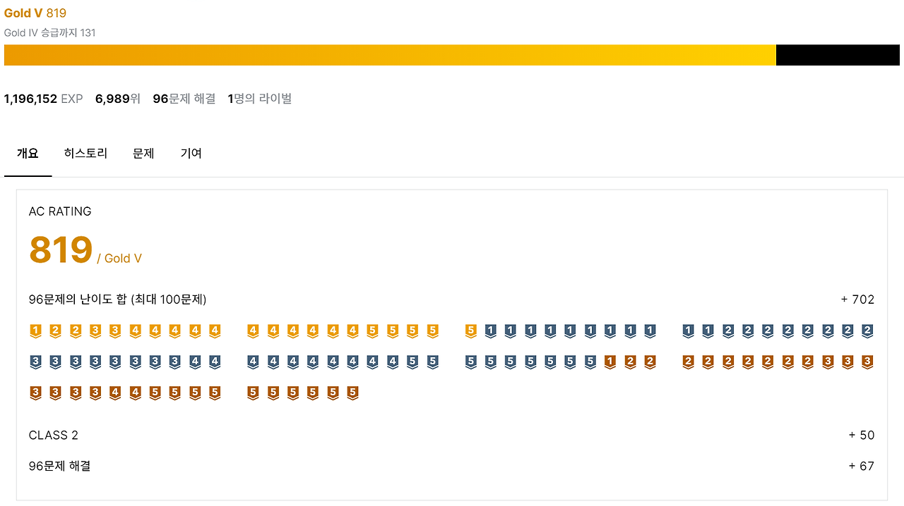
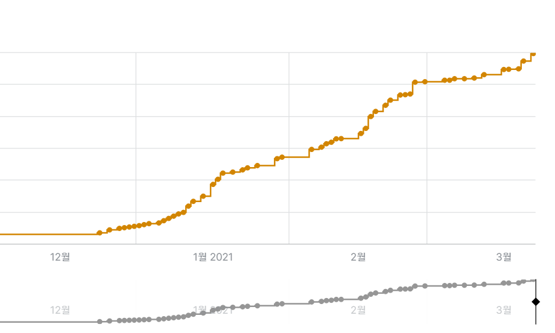

 아름아름 1일 1문제 알고리즘 문제 풀이를 계속 하다보니 solved.ac에서 골드 티어에 도착해 있었다. (물론 못 푼날도 당연 존재한다...ㅋㅋㅋ) 알고리즘 괴수분들은 정말 많으시니까. 대단한 기록일리는 만무하지만, 그래도 예전 알고리즘 문제 유형도 몰랐던 갓난아기 시기에 비하면 정말 장족의 발전을 했다고 느낀다. 꾸역꾸역 어떻게든 잘해왔구나.

 경험치 기록을 보니 본격적으로 백준을 풀기 시작한 12월 말즈음부터 대략 3개월 정도 걸렸나보다. 

 그동안 유형별 문제 풀이에 집중해서 그리디부터 DFS/BFS, DP, 최단경로 등 다양한 문제 유형에 대해 한 번 이상씩은 문제 풀이를 진행했다. 하지만 중간중간 기초가 될 수 있는 작은 유형들을 놓친 부분도 있어서, 이에 대해서 보강을 해야할 것 같다. 또한, 다른 유형 문제에 집중하다보면 이전에 공부했던 유형의 코드들은 가물가물해짐을 느낀다. 이제 슬슬 앞 부분에 대한 기억을 상기시키면서, 유형을 모른 상태로 문제 푸는 연습도 많이 해야겠다. 

 보통 백준기준으로 실버 3 ~ 골드 1까지의 문제를 막힘없이 풀 수 있는 정도가 되면, 기업 코테를 충분히 합격할 수 있다고 한다. 아직 멀었지만 예전보다는 저 멀리에 있던 것이 드디어 살짝 눈에 보이는 느낌이 들어 참 감사하다. 코테에 대한 글들을 살펴보면 아직 내가 미처 신경쓰지 못한 부분들도 참 많은 것 같은데, 잘 보완해서 궤도에 오르면 좋겠다.