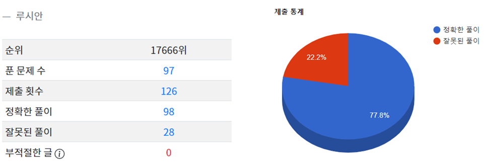
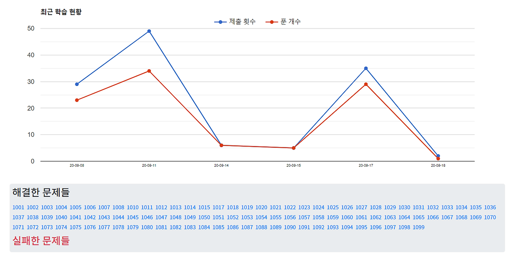

코드업 기초 100제를 드디어 마무리했습니다. 저는 저에게 익숙한 파이썬으로 진행했는데, 금방 끝날 줄 알았던 문제풀이가 모두 완료되기까지 꽤 오랜 시간이 걸렸어요. 문제들이 기초 문법 다지기와 같은 것이 많았는데, 번거로우면서도 미처 몰랐던 작은 부분까지 차곡차곡 다져갈 수 있어서 좋은 경험이었단 생각이 듭니다.

 요즈음 나동빈 님의 '이것이 취업을 위한 코딩 테스트다' 책을 유튜브와 병행하며 공부하고 있는데, 책에서 권하는 코딩 테스트 준비 로드맵의 첫 번째가 바로 'CodeUp 기초 100제' 풀기였습니다. 1단계를 마무리했으니 이제 조금 더 편한 마음으로 알고리즘 이론과 높은 난이도 문제 풀이에 집중할 수 있겠습니다.

 기초 100제에 있는 문제는 전부 풀었는데, 3문제 정도는 원래 빠져있었나 봐요. repl.it에서 코드를 실행하며 문제를 풀었지만, 기초여도 미처 생각지 못한 테스트 케이스들 혹은 낯설은 문제들에 의해 잘못된 풀이를 제출할 때가 있었습니다. (기초일수록 더욱 respect하기!!) 또 뒷부분 마지막에 몰려 있는 2차원 배열 문제들은 꽤 오래 생각해야 풀리는 문제들이 많았어요. 가장 시간이 오래 걸리는 부분이었지만 가장 재밌었던 기초 100제의 꽃이라고 느꼈습니다 :)

 최근 학습 그래프를 보니 문제 풀이에 오래 걸린 이유를 알겠네요... 물론 다른 프로그래밍 공부도 했기 때문에 변명은 있지만, 변명은 변명일 뿐! 더욱더 꾸준히 알고리즘 공부를 병행해야겠습니다 :)