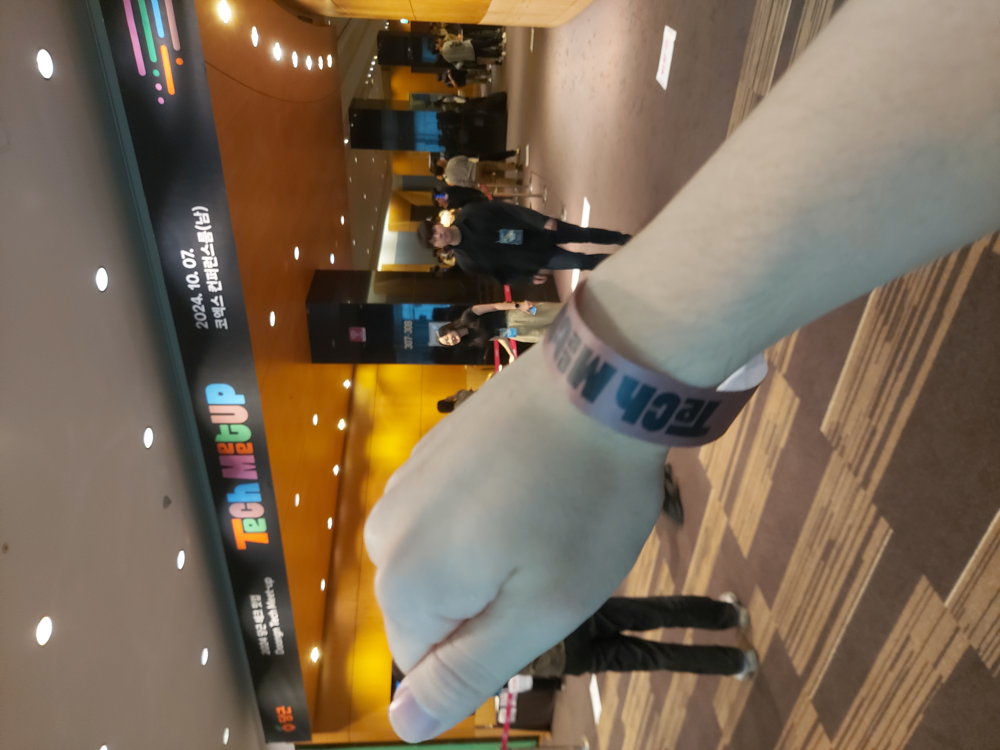
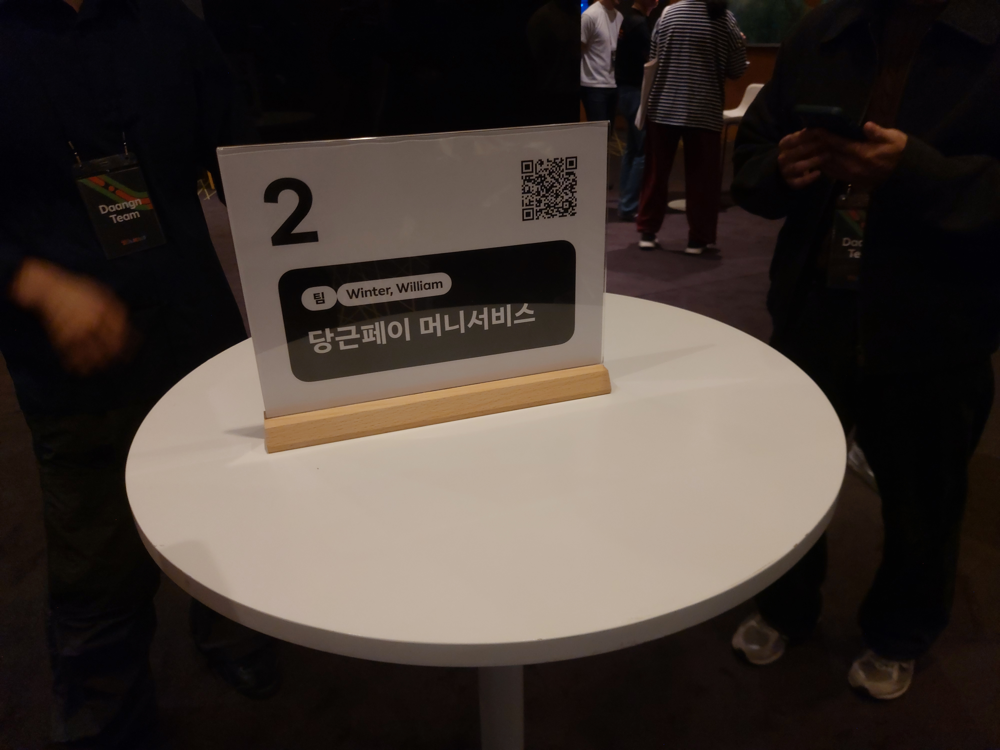
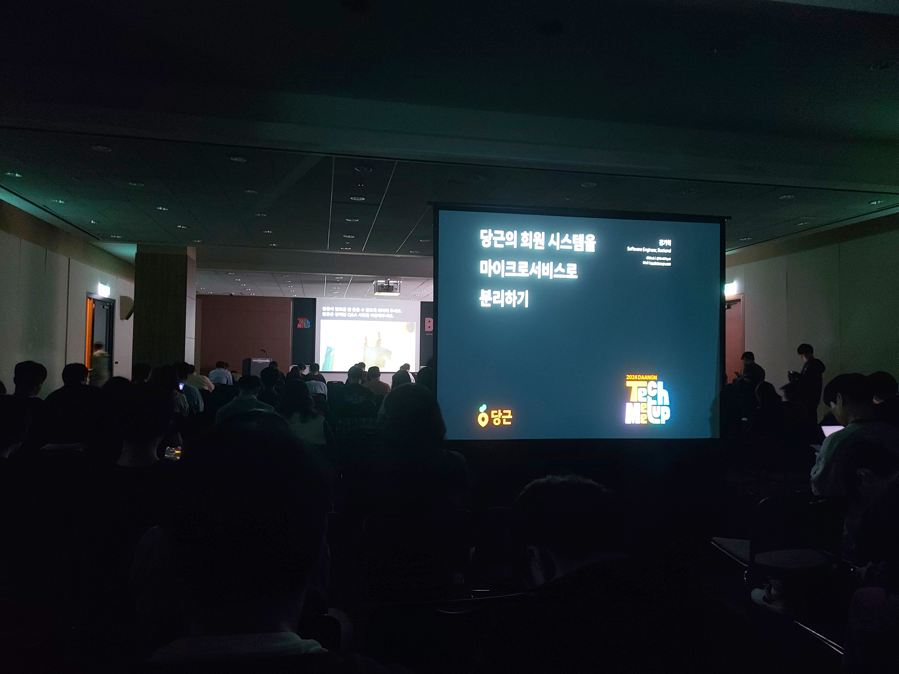
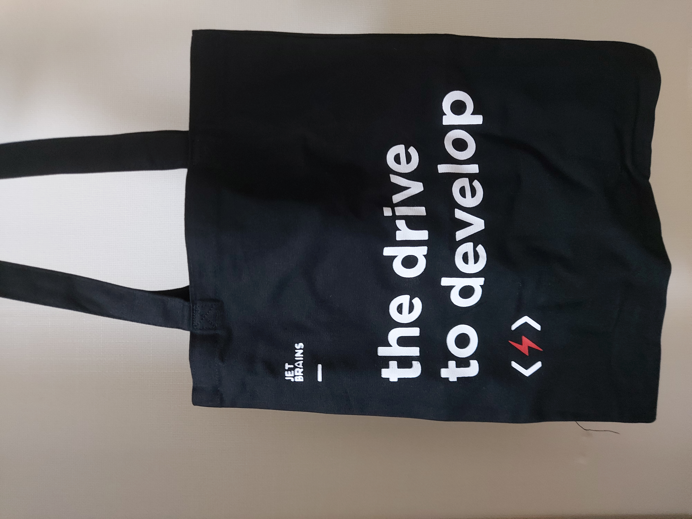
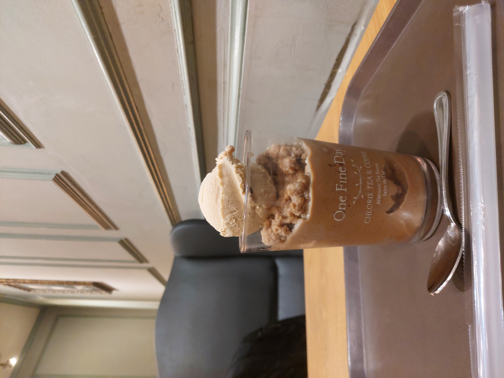

## 2024 당근 테크 밋업 후기
올 해 운은 2024 당근 테크 밋업 당첨에 몰아서 다 쓴 모양이다. 

당첨이 정말 어렵다고들 하는데 운 좋게도 생애 첫 밋업의 기회를 얻었다. 덕분에 기다리는 순간부터 오늘까지 설레고 유쾌한 시간의 연속이었다.
나이스한 당근 엔지니어 분들과의 만남, 만족스러운 럭키 드로우 등 흥미로운 일들에 대한 경험담을 살짝 남긴다.

Frontend, Server, Data/ML, Platform 4가지로 파트가 나누어져 있었는데, 나는 서버 파트로 참여했다.
코엑스 컨퍼런스룸 3층으로 가니 예쁜 서체와 함께 행사장이 꾸며져 있었다. 입구부터 당근의 느낌(?)이 물씬 풍기는게 맘에 들었다. 
입장할 때는 스태프분들이 팔에 당당한 밋업 참가자의 징표를 휘감아주었다. 뿌듯한 한 컷이다.
여담이지만, 행사장의 당근 관계자 분들은 다들 매우 친절하고 단합력이 좋았다.

서버 파트 강연 진행은 308호 공간에서 진행했는데, 도착하자마자 자리 잡고 강연을 듣는 형태였다.

다만, 이번 당근 밋업의 조금 특별한 점으로 당근 엔지니어가 주도하는 **네트워킹 모임**이 있었다. 
규모는 4~8명으로 모임마다 다양하다. 밋업 몇 주 전부터 선착순으로 약 70개 넘는 주제로 네트워킹 참여 모집을 했는데, 실제로 행사 당일에 관련 주제를 가지고 서로의 경험과 대화를 나누는 네트워킹을 진행했다. (덕분에 당근 어플 모임 기능과 익숙해졌다.)

나는 주문 서비스에서 일한 경험이 있어, 당근페이 머니서비스 팀 네트워킹에 참여했다.
주문 서비스는 안정성과 데이터 정합성이 매우 중요한데, 당근페이 같은 큰 규모에서는 어떻게 관리하고 있는지 궁금했다.
모임을 주도하는 머니서비스팀 엔지니어 윈터, 윌리엄은 매우 나이스한 분들이었다. 당근페이에서 일했던 경험들을 자연스럽게 나누며 어떻게 생각하는지 참여자들과 서로 묻고 답했다. 함께 모인 다양한 개발자 및 기획자 분들도 유익한 질문들을 많이 던져주시더라. 

이런 형태의 네트워킹이 처음이라 긴장을 많이 했는데, 화기애애한 분위기 속에서 머니서비스 팀이 극복했던 이슈와 앞으로의 목표를 진솔하게 들을 수 있었다. 
잠시지만 좋은 분들과의 만남에 감사함을 가졌다.

첫 밋업이어서 이후에는 강연에 집중했다. 아직은 이해가 잘 되지 않는 내용도 많았지만 이런 이런 키워드들이 있구나를 알게된 것도 도움이 되었다. 

"빠르게 변하는 도메인에서 살아남는 코드"라는 주제도 재밌었다. 당근 운영개발팀은 루비 레거시의 압박 속에서 확장성과 설정 가능성을 목표로 최대한 OCP를 지키는 리팩터링을 했는데, 과정 속에서 메타 프로그래밍으로 접근한 점이 흥미로웠다. 리플렉션 같은 느낌으로 런타임에 코드 자체를 동적으로 변경하며 기능을 확장했는데, '현업에서 이렇게 적용할 수도 있겠구나' 고민해보며 생각을 확장할 수 있었다.

마지막 세션인 "당근의 회원 시스템을 마이크로서비스로 분리하기"에서는 당근 Identity Service 팀이 회원 서비스를 안전하게 분리하기 위해 진행한 디테일한 테스트와 도구들을 소개했다. 안정성을 위해 굉장히 디테일한 부분까지 신경쓰는 점이 인상 깊었고, 덕분에 대규모 서비스에서는 얼마나 신중하고 단계적으로 접근해야하는지 느끼는 시간이었다.
큰 규모에서는 생각하는 각도가 더욱 중요하겠구나 싶다.

기쁘게도 젯브레인 에코백이 내게 왔다. 

강연 중간중간마다도 이벤트가 있었는데, 마지막에는 설문조사에 참여한 모든 참여자에게 럭키 드로우 찬스가 주어졌다. 품목으로는 젯브레인 배지, 키캡, 스티커, 에코백 등의 경품이 있었다. 키캡이 매우 인기 있었지만, 개인적으로 개발자스러운 패션 굿즈로서 에코백이 가장 갖고 싶었다.

신기하게도 단번에 뽑았는데, 돌아봐도 당첨 운이 참 좋은 밋업 기간이었다.

밋업과 연관은 없지만 마지막엔 코엑스 내 클로리스 티 룸에 들려 밀크티 프로즌을 마셨다.
예전부터 좋아하는 곳인데 밀크티 음료 조합이 독특하고 맛이 참 좋다. 코엑스에 갈 일이 있다면 강력 추천한다.

2024 당근 밋업은 생애 첫 밋업이어서 더욱 기억에 남는다. 약 1000명에 가까운 IT 업계 종사자들이 한데 모이는 모습이 신기하면서 기분 좋은 자극이 되었다. 
또한, 당근 엔지니어 분들의 기술에 대한 열정, 동료들과의 화목함을 보며 당근의 분위기가 참 좋다고 느꼈다. 

앞으로 어떤 곳에서 일할지 모르지만, 당근 같은 건강한 분위기에서 또 다시 개발하길 다짐한다.