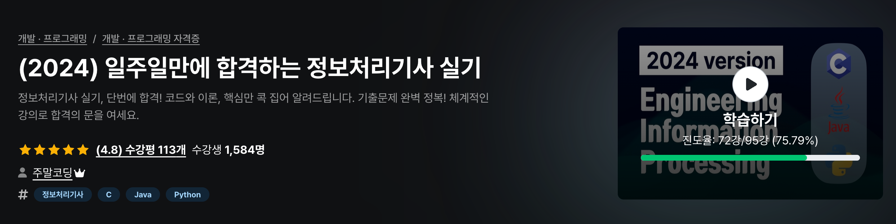

## 주말 코딩님 덕분에 정말 "효율적"으로 실기 합격했습니다!

가채점 점수 **92점**, 발표일에 합격인증까지 올리겠습니다~😀

10월 20일에 있었던 3회차 정보처리기사 실기를 막 마치고 얻은 점수입니다.  
약 1주일 간 **주말코딩님 인프런 강의**와 함께하며 정보처리기사를 준비했구요 (대략 10일)  
가장 큰 목표인 **"최소비용"**, **"효율"** 중시로 시험을 준비했던 과정을 공유해보려고 합니다. 
우리 모두 바쁘자나요~
고득점 목표는 정말 전혀 없었는데 주말코딩님과 **핵심**만 집중하다보니 덤으로 얻었다고 생각해요

### 1. 학습 목표
저한테 가장 중요했던 것은 **"최소비용 및 시간으로 안정적인 합격하기"** 였어요.  
시중 책들이나 강의가 불필요하게 깊게 파고 비싸서 시간과 비용이 아깝다고 느꼈어요  
(몇 백페이지 어떻게 다보나요... 필기도 CBT로 기출만 풀고 넘어왔습니다)
자격증 공부는 실질적인 개발 공부와 다른 측면이 있으니 자격증 준비는 정말 최소한의 비용으로 해야겠다고 마음 먹었습니다.  
부가적으로 C언어 메모리 관련 지식과 CS 큰그림 정리만 얻자는 마음으로 준비했어요

그런 점에서 주말코딩 님 강의는 저의 목표와 매우 적합했습니다!  
주말코딩 님도 수강생들에게 **핵심만 집중적으로 공략해서 빠르게 합격**하길 원하셨거든요. 
모두 다른 할 일들이 많으니까요!!  
  
(주말코딩 정처기 인프런 강의: [https://u.inf.run/3Bu7c2O)](https://u.inf.run/3Bu7c2O)

### 2. 강사님 성향 & 실제 체감한 시험 경향
강사님 기본 전제는 100점 중 60점 넘으면 통과이므로

- **전체 5~60% 비중인 코딩 영역은 최대한 다 맞추자 (1개정도의 킬러문제는 그냥 틀리자)**
- **이론 영역은 찍기도 가능하니 1~2개만 맞추자**
    
를 강조하십니다.  
납득이 되고 매우 합리적인 전략이에요.  
      
이론 영역에 대해 조금 더 생각해볼 부분은 강사님께서 조금 보수적으로 잡고 말씀하신 부분이 있고, **실제 공부하다보면 이론은 1~2개보다 충분히 더 맞출 수 있습니다.**  
강사님이 중요한 부분만 정리한 총 1~2시간 정도 강의와 20페이지 정도되는 이론 요약집 제공해주세요. 항상 빈출되는 5~10가지 유형만 확실히 정리하고 가도 안정적으로 점수 추가 가능하다고 느꼈어요.  
이외 나머지는 대차게 틀리면 됩니다! 다 맞출 필요가 없으니까요 🤣  
사람이니까 코딩영역 실수해서 조금 더 틀려도 합격권 넉넉할거라고 느껴요.  
  
코딩 영역은 주말 코딩님 이전 명성도 있고 실제로 강의를 워낙 잘해주셔서 정말 킬러 문항 1개만 틀리고 다 맞을 수 있습니다! 비전공자지만 독학한 베이스가 있긴해서 운좋게 킬러 문제도 건졌어요
  
실제로 시험을 봐보니 **최근 시험 경향이 코딩 난이도를 높이고 이론은 너무 어렵게 안내는 느낌**이 들었습니다.  
이론이 최근 기출 포함해 항상 나오는 문제 주제로 5~10개 풀 정해놓고 돌려서 나오는 경향이라 그 부분만 확실해도 얘기했던 기존 목표인 이론 1~2개 맞추기보다 더 맞출 수 있을 것 같습니다.  
  
결과적으로 **코딩 문제는 다 맞추고, 이론에서 8점 깎였어요** (한 문제 틀리고, 한 문제 부분점수)  
**"코딩만은 확실히"를 지향하는 주말 코딩님의 방식은 매우 타당했습니다**

### 3. 공부 방법
당시 10일 정도 남았었고 2~3일 보통 숨고르기 시간으로 날리잖아요~ 하하하  
그래서 저는 공부 전략을 다음과 같이 잡았습니다.  
**[강의 중요 부분 수강 + 강사님 이론 요약집 외우기 + 이론만 잽싸게 기출 보기]**  
  

**[강의 중요 부분 수강]**

강의는시간 관계상 부가적인 부분만 제끼고 최대한 들었습니다. (75프로 수강했네요)  
비전공자지만 개발경험은 있어서 앞에 언어 공통 문법 부분이랑 뒤에 고난도 코드영역의 정렬만 제꼈습니다. (정렬 문제는 개념몰라도 주요 강의 내용만으로 코드 풀 수 있어요)  
  
**코딩 기출문제 풀이 강의**는 무조건 하루 한개씩 들었고  
다만 시간 관계상 강사님 C, Java, Python 변형문제 강의는 못들었어요 (기출 강의 중간중간에도 변형 문제는 소개해주셔서 다행히 괜찮았던 것 같아요)  
**고난도 코드영역에 SQL 기출문제**는 꼭 챙겨봤습니다.  
이렇게만 공부해도 코딩 + DB 영역 50점은 먹고 가요 (주말코딩 님 그는 정말...)  
  
시험 3~4일전 강사님 **이론 강의**를 살살 듣기 시작했는데요 운영체제 페이지 교체 부분부터 정리했어요  
기출보니 요즘 자주 나오더라구요! 요 영역이 조금 빡세보여도 강의듣고 하면 풀만해서 5점 가져가는 것 같아요

그리고 결국 시험 기간 이틀 전에서야 빡세게 이론 강의 완강하고 그 후 이론 요약집만 달렸어요 (머릿 속 이상적 계획과의 괴리...)

**[강사님 이론 요약집 외우기]**

이론은 강사님 강조해주시는 영역 몇가지 있어요

**주요 포인트**  
결합도/응집도, 테스트 스텁 및 드라이버, 테스트 종류와 방식 (블랙/화이트), 라우팅 프로토콜(RIP, OSPF...), 데이터베이스 이론(로킹, 상호배제 조건 등)...

**시간 날 때 나머지**  
보안용어와 암호화 기법, OSI 7계층  

**주요 포인트**만 확실히 하고 간다 생각했고 (결합도/응집도, 테스트 종류 방식 진짜 맨날 나와요)  
추가로 **디자인 패턴**만 설명보고 용어 쓸 수 있게 준비했습니다. (+위에서 강의로 봤던 **페이지 교체** 부분도요!)

시간 날 때 나머지 부분도 요약집 내에서만 준비했어요  
OSI 7계층에 용어들만 키워드 위주 암기 미리했고 (계층 이름, ARP, RARP, ICMP, IGMP 정도),  
보안용어 암호화 기법은 시험가기 전 30분정도만 봤습니다. (운에 맞기고 틀려요 그냥~)  
그래도 필기 때 한번 봤던 내용들이라 익숙함은 있더라구요  

**[이론만 잽싸게 기출 보기]**  
코딩 영역은 강의 기출 풀이로 거의 충분해서  
이론 공부 병행하면서 이론 기출만 23년~24년도 빠르게 확인해봤습니다.

강의나 요약집에서 이미 봤던 기출도 있고 해서 이쯤이면 금방 빠르게 볼 수 있어요.  
뉴비티 사이트가 필기 공부할 때 썼던 CBT 처럼 잘되어 있어서 공부하는 동안 잘 활용했어요.  
(뉴비티, [https://newbt.kr/%EC%8B%9C%ED%97%98/%EC%A0%95%EB%B3%B4%EC%B2%98%EB%A6%AC%EA%B8%B0%EC%82%AC+%EC%8B%A4%EA%B8%B0)](https://newbt.kr/%EC%8B%9C%ED%97%98/%EC%A0%95%EB%B3%B4%EC%B2%98%EB%A6%AC%EA%B8%B0%EC%82%AC+%EC%8B%A4%EA%B8%B0))

### 4. 마무리
처음에는 실기 준비 어떻게 공부할지 고민했습니다. 아는 지인은 시중에 수제X 책 사서 했다더라구요.
제 성향에는 비효율적인 방법이었어요 컴팩트한 시간을 매우 중요시하는데 핵심을 벗어나 너무 폭넓게 공부해야 하니까요.

유튜브 검색을 통해 어쩌다 주말 코딩 님을 알게 되었는데, 강사님의 **효율적인 학습 지향점**을 듣고 바로 납득하고 강의 수강을 정했습니다.  
플랫폼도 **개발 컨텐츠에 친화적인 인프런**이니까 수강기간 걱정없이 들을 수 있는 점이 신뢰와 안정감을 줬구요.

덕분에 처음 목표인 안정적 합격도 이뤘지만 보다 과하게 93점을 받았는데, 주말 코딩님 지향점의 장점 덕분이라 생각합니다.

언제나 느끼지만 **핵심**이 중요하다고 생각해요.

제 시험 준비 기록이 정보처리기사 준비하시는 다른 분들의 시간 절약 및 정신적 건강에 조금이나마 도움이 되었으면 좋겠습니다. (기록에는 시간을 아끼지 않았거든요 하핳)

준비하시는 모든 분들 파이팅하시고 쾌속 합격하시길 바랍니다!

### Reference
[[인프런 주말코딩] 일주일만에 합격하는 정보처리기사 실기](https://u.inf.run/3Bu7c2O)  
[[뉴비티] 실기 기출 풀이 플랫폼](https://newbt.kr/%EC%8B%9C%ED%97%98/%EC%A0%95%EB%B3%B4%EC%B2%98%EB%A6%AC%EA%B8%B0%EC%82%AC+%EC%8B%A4%EA%B8%B0)