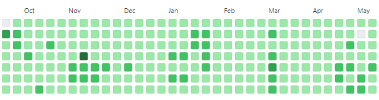
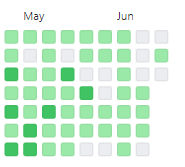

자기개발에 강렬한 욕망을 가진 개발자들이라면 '어떻게 하면 좋은 학습 습관을 가질 수 있을까'를 항상 고민할 것 같습니다. 그리고 이 영역에서 기초 체력을 기르기 위해 자주 언급되는 대표적인 홈트레이닝(?)으로서 1일 1커밋이 떠오릅니다.

사실 정말 많은 선배, 또래 개발자들이 1일 1커밋을 지키며 성실한 모습을 보여주셔서, 1일 1커밋의 장점과 단점은 많이 알려져 있습니다. (특히, 이동욱 개발자님 정말 존경합니다!) 부자가 되려면 부자의 습관을 따라하라는 말이 있죠? 좋은 개발자들의 성실한 모습을 닮고 싶어서, 마음 속 작은 다짐으로 (신입 입사를 위한 생존 문제라고!!!) 시작한 1일 1커밋 후기를 남깁니다 :)

사실 쓰고 싶었던 포스팅이 많이 밀려서 1일 1커밋 후기도 조금 늦었습니다.

실제 1일 1커밋을 지켰던 기간은 2020년 9월 21일부터 2021년 5월 2일까지입니다. 7개월하고 반이 조금 안되는 기간동안 '이건 꼭 지킬거야'라는 마음으로 잔디를 심었습니다. 연속 잔디심기의 마무리는 수업 후 밤 늦게 돌아오다 미리 작성해둔 공부 내용 커밋을 깜빡한 웃픈 헤프닝이었습니다. (ㅋㅋㅋㅋ) 

사실 1일 1커밋의 장단점은 명확한 것 같습니다. 언제나 질 좋은 잔디를 심을 수는 없습니다. 밝은 초록색도 아쉬울 잔디가 종종 심어지게 됩니다. 그럼에도 조금이라도 알찬 잔디를 심어보고자 매일 다짐하고 실천하게 됩니다. 학습을 제대로 수행하지 못한 날에는 알고리즘 문제라도 하나 더 풀어서 정리했습니다. 놀랐던 점은 알고리즘 문제 같이 하나는 굉장히 작은 것들도 하루하루 잊지않고 쌓아나가면 어느새 목표했던 분량까지 성취하게 된다는 부분입니다. 덕분에 '꾸준히'의 힘과 중요성을 체감했습니다.

또한, 1일 1커밋이 끝난 후에도 능동적인 커밋 습관을 얻는 계기가 됩니다. 커밋하는 것이 일상이 되니 이전보다 빈도는 조금 줄어도 학습한 것을 잊지않고 기록하려고 합니다.

최근 잔디는 과거에 비해 더 자유분방(?)해졌습니다. 커밋에 대한 강박관념을 지우고 이전보다 조금 더 자유롭게 학습을 기록하는데 중점을 두고 있습니다. 잔디가 비었다고 공부를 안하는 것은 아니니까요!

사실 처음에는 성실함을 어필하자는 마음으로 시작했는데, 결과적으로는 기초체력을 끌어올리는 흥미로운 도전이었습니다. 개인적으로 Phase 1이 끝나고 Phase 2에 돌입했다고 생각합니다. 앞으로의 잔디 심기는 비울 곳은 비우고 채울 곳은 더 진한 잔디들로 채우려고 합니다 :)