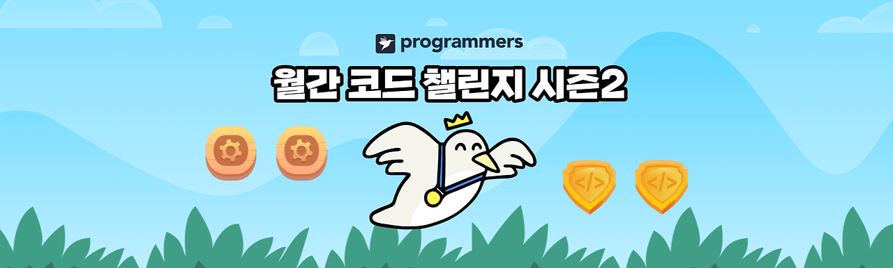
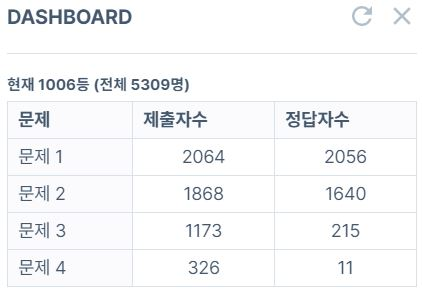

 종종 프로그래머스 문제를 풀다가 월간 코드 챌린지 시즌 1에 출제된 문제를 마주치곤 했다. 그 때는 어떤 대회인지 살짝 궁금하면서도 슥 지나쳤는데, 이번에 월간 코드 챌린지 시즌 2를 진행한다고 하여 흥미 반, 코딩테스트 감 유지 반으로 참여해 봤다.

 이번 월간 코드 챌린지 시즌 2는 4월, 5월 두 번에 걸쳐 진행한다고 하며, 코딩을 좋아하는 20세 이상이면 누구나 참여가 가능하니 가벼운 마음으로 즐길 수 있는 좋은 대회라고 생각한다.

 마지막 문제 풀이 끝나고 대쉬보드를 찍었는데, 그리 유의미한 등수는 아니었다 :) 중간에 개인적인 스케줄도 있었던 터라 온전히 집중하지 못하긴 했다. 첫 번째, 두 번째 문제는 금방 풀었는데, 세 번째 문제를 너무 복잡하게 접근했는지 원하는 대로 알고리즘이 동작하지 않아 테스트 케이스의 일부만 해결됐다. 문제 해결 전략은 확실히 보였는데, 개인적으로 트리의 루트노드와 리프노드를 설정하는 방법에 미숙함을 느껴 아쉬웠다.

 그래도 즐겁게 대회를 즐겼다! 5월 챌린지도 기대된다 :)