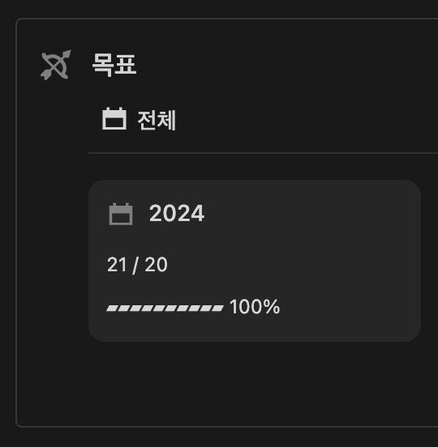
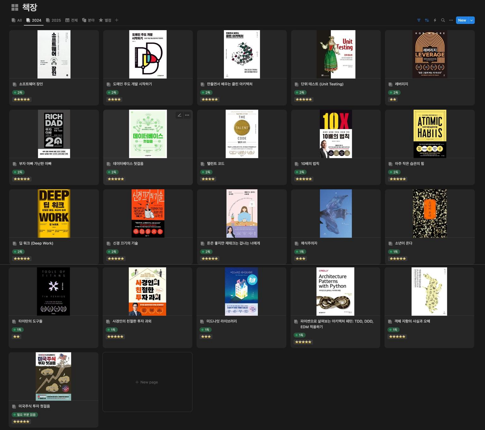
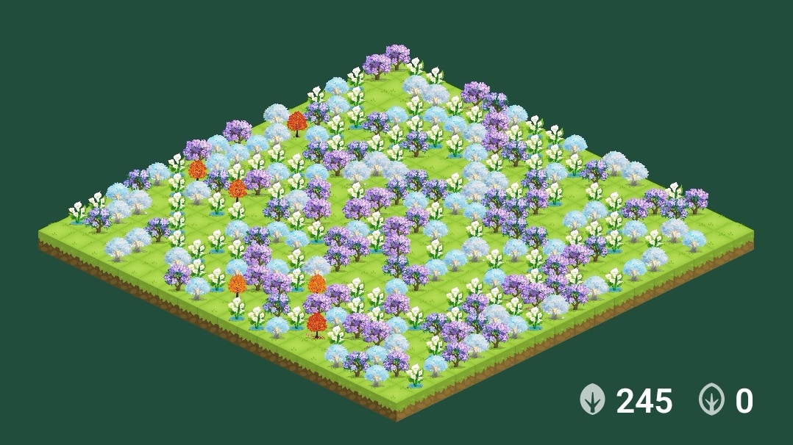
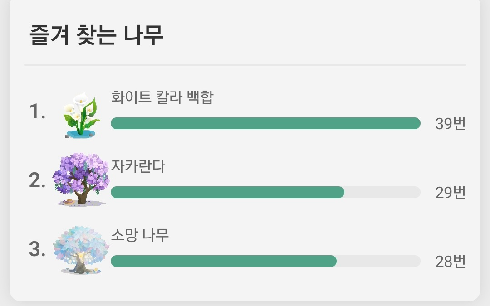
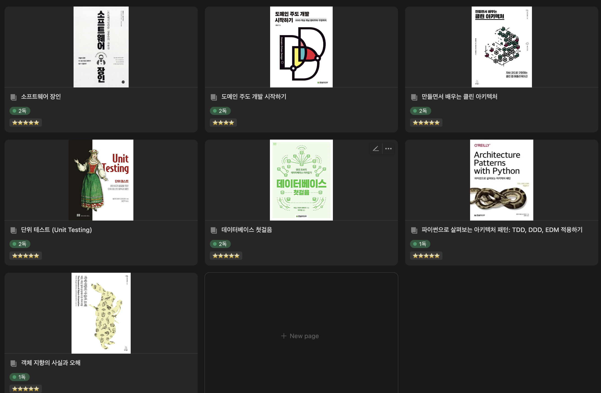
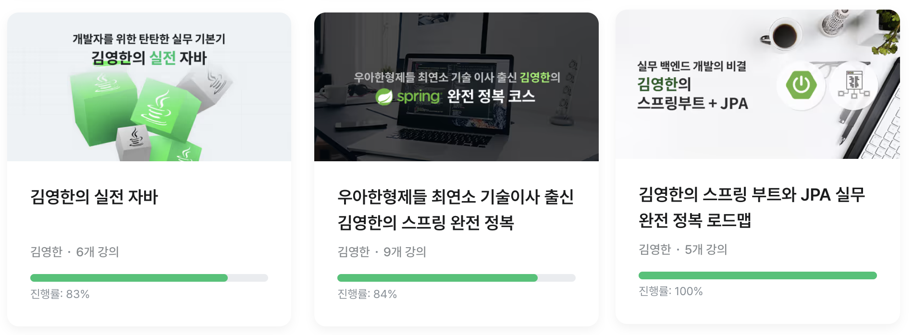
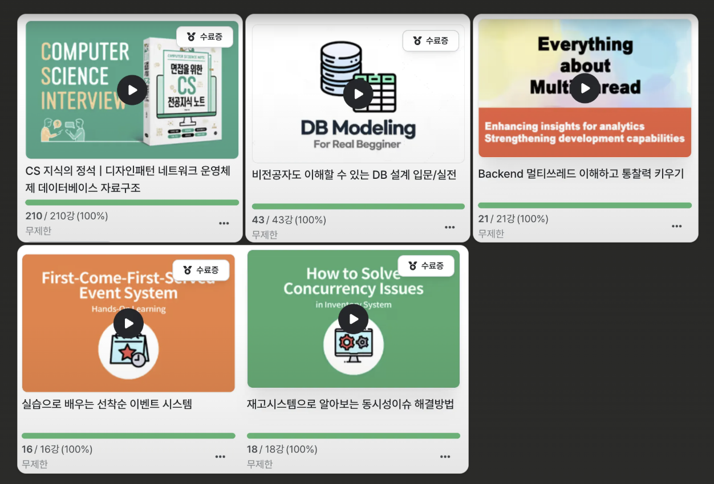

## 머리말: 2024년 1월 20일
1월 20일. JVM 생태계로 옮겨가자고 마음 먹었던 날이다.
2년차 개발자로서 그에 맞는 기본기를 갖추길 강하게 바라서 정했다.

더 알고 싶다. 프로페셔널하게 잘하고 싶다는 열망이 강했다. 선배 개발자들이 쌓아 놓은 길이 풍부하니, 차근차근 밟아 가다보면 많은 것이 채워지리라 생각했다.
이에 더해, 전체적인 삶도 더 건강하게 채워보기로 노력했다.

언제나처럼 한 해가 빠르게 지나갔다. 
지난 시간의 결과들을 되돌아보고 올 해 목표를 새로 설정한다.
정형화된 것보단 내가 쓰기 편한 형태의 1년 회고를 남긴다.

## 생활 습관
2024년을 시작할 때 꼭 지켰으면 했던 몇 가지를 정했다. 어떤 것은 초과 달성했고 어떤 것은 조금 더 잘했으면 하는 아쉬움이 있다.

### 책 21권

24년 목표: 20권
24년 결과: 21권
25년 목표: 30권

1권 초과 달성으로 마무리했다. 아주 많다고 할 수는 없지만 달성한 보람이 크다. 

접근성을 최대한 높여 한 번이라도 책을 더보게끔 유도했다. 독서용으로 구매한 아이패드 미니가 충분한 역할을 했다. 휴대성 덕분에 버스나 지하철안에서 한 번이라도 더 보게 되고, 자기전에도 한 번 더 손을 뻗고 읽게 된다.
먼지 타면 손이 잘안가서 최대한 전자책을 지향했는데 이것도 나한텐 효과적이었던 것 같다. 

그리고 노션으로 서재를 만들어 정리하는 습관을 들였다. 시각적으로 내 서재를 볼 수 있으니 달성감이 생기고 짧게라도 정리하니 기억에 더 남는다.
[내 서재](https://shorthaired-emperor-56b.notion.site/9d263aff1f504b799b04342329c0d688)

상반기에 비해 하반기에 독서 속도가 많이 느려졌던게 아쉬웠다. 특히, 기술 서적 읽을 때는 아무래도 시간이 걸리면서 상대적으로 텐션이 떨어지는데, 25년에는 더 전략적으로 시간을 분배해봐야겠다.

C-Level 분들의 연평균 독서량이 30권 이상이라는 기사가 있었다. 1달에 2권만 읽어도 24권인데 대단하다고 생각이 든다. 

2025년에는 30권을 목표로 한다. 

물론 단순 물량보다 실질적인 것이 중요하다. 
잘 모르는 영역이 많은데, 25년에는 생활 법률이나 우주 카테고리에 대해서도 좀 더 관심을 가지려 한다. 특히, 투자 쪽은 작년보다 조금 더 깊게 공부할 계획이다.

### 주 3~4회 운동
24년 목표: 체지방률 15%
24년 결과: 체지방률 18.8%
25년 목표: 체지방률 15%

운동을 시작한지 1년 6개월이 지났다.
체지방률 26%에서 시작했고 근육량 2kg 증가, 체지방 5.5kg 감소시켜 체지방률 18%대에 진입했다.
주 3~4회씩 꾸준히 운동했던 점은 뿌듯한데, 목표에 3%가량 못미친 결과는 아쉬움이 남는다.

좋았던 기억은 애정하는 몇 가지 운동들의 최대 기록들이다.
턱걸이 횟수는 10개를 넘어갔다. 최대 16개를 했는데, 한 번도 못했던 옛날을 생각하면 정말 큰 발전이다.
벤치프레스 70kg을 찍은 것도 정말 기뻤다. 1RM이어서 아슬아슬했지만, 큰 성취감을 느꼈다.
기록을 위해 몇가지 최대 기록을 남겨둔다.

| 운동         | 최대 무게(횟수) |
| ---------- | --------- |
| 벤치프레스      | 70kg      |
| 풀업         | 16회       |
| 레그프레스      | 160kg     |
| 스쿼트        | 70kg      |
| 밀리터리 숄더프레스 | 40kg      |

어려웠던 점은 정체기다.
처음 3개월 PT로 배운 후 혼자 운동해나갔다.
1년 정도 철저한 식단과 함께 주 3~5회 운동을 했는데, 벌크업과 살찜 사이(?)의 균형을 찾는게 어려웠다.
지금은 무리한 섭취보다 체지방 조절을 가장 우선하고 있고, 체지방률이 감소하는 걸 보며 보다 건강한 느낌을 받고 있다.

사이사이 어깨 부상도 힘들었다. 잘못된 숄더프레스 및 벤치프레스 자세로 오른쪽 어깨가 반복적으로 문제가 생겼다. 처음엔 원인도 몰라서 관련될 법한 운동 영상, 의학 영상을 모조리 찾아본 기억이 난다. 시행착오 끝에 올바른 운동 자세를 찾으니 부상이 더이상 없더라. 신기한 경험이었는데, 운동은 자세가 정말 중요함을 체감했다.

어느덧 2년차도 넘어가니 여러 생각이 든다. 무리하지 않는 건강하고 꾸준한 운동이 제일인 것 같다.

25년 목표는 한번 더 체지방률 15% 달성이다.
다시 온 정체기를 뚫는게 올 해 목표가 될 것이다.

### 새벽 기상과 공부 패턴
새벽 기상이 일상에 많이 스며 들었다. 최소 7시간 수면 확보를 기준으로 일찍자고 일어났다.
요즘은 5시 50분으로 정착했다. 4시 50분 / 5시 50분 / 6시 30분 등 몇 가지 기상 패턴들이 다양하게 있었는데, 결과적으로 일찍 일어났을 때 조용한 환경으로 인해 집중도와 작업 진척도가 더 늘어나는 효과가 있었다.

모든 날을 완벽히 보내진 못했다. 4달은 새벽기상, 2달은 보다 늦은 기상, 3달은 다시 새벽기상 식의 반복이 있었다. 이런 부분은 크게 스트레스 받지 않으려 한다. 몸이 피곤하다는 신호가 있을 때는 충분히 자는게 건강에 이로운 것 같다.

올 해 기상 패턴도 5시 50분으로 늦춤 없이 그대로 유지해보려 한다.

추가로 습관 추적을 위해 하루 공부량을 측정하는데, 나무 심기가 재미를 준다.

개인적으로 Forest 앱을 좋아하는데, 매일 집중한 시간만큼 자신이 좋아하는 나무를 심을 수 있다.

나도 몰랐던 나무 취향(?)도 알게 됐다. 
습관 추적은 많은 자기계발서에서 추천하는 방법이다. 습관 추적을 지원하는 다양한 앱 중 성숙한 서비스를 제공해서 추천한다.

[포레스트 (Forest)](https://play.google.com/store/apps/details?id=cc.forestapp)

## 개발 공부
사실 한 해 동안 공부했던 모든 것들이 너무 유익했다. FastAPI 생태계에 있을 때는 어려웠던 레퍼런스 천국을 자바 생태계에서 경험했다.
선별한 강의와 책을 보면서 예제 코드를 백문이 불여일타하고 이론은 옵시디언을 활용해 학습기록용 블로그에 정리하고 있다.
회독법으로 접근하고 있다. 결국 4~5회독은 해야 장기 기억으로 완전히 남을 것이다.

지금까지 봤던 강의와 책은 최소 2회독한 상태이고, 새로운 것들을 계속 공부하면서 회독도 지속적으로 병행할 계획이다.

한 해 공부했던 책, 강의, 자격증 기록을 남겨본다.

### 기술 서적

24년에 읽은 기술 서적들이다. 사실 읽고 싶은 책이 더 많았는데 시간이 참 빠르게 지나간다.
기술 서적은 확실히 읽는 속도가 오래 걸린다. 두께가 있는 책들은 3~4주는 잡아야 2회독하는 패턴을 겪었다.
물론 충분히 필요한 절대적 시간량들이라 생각한다.

다만, 오래걸려서 텐션이 떨어지는 구간들을 좀 더 리듬감 있게 가져가도록 신경쓰려고 한다.

올 해는 아래 책들은 반드시 읽기로 계획했고 다른 책들은 상황에 맞게 필요를 조정하려 한다.
"Real MySQL" / "개발자를 위한 레디스" / "아파치 카프카 애플리케이션 프로그래밍 with 자바"

### 강의

영한님 강의는 최대한 다 듣고 싶었는데 2개 강의가 아직 남았다 (실전 자바 고급 2편, 스프링 부트 핵심 원리)

솔직히 정말 좋았다. 실무를 한 번 겪고 왔기 때문에 그동안 풀리지 않았던 고민들과 가려웠던 부분들이 많이 해소됐다. 교육 비용은 아끼지 말자.
해야할 것들이 많으니 우선순위를 잘 지정해서 남은 강의도 올 해 적절한 시점에 마무리해야겠다.

돌아보면 한 해 동안 인프런 이용을 참 많이했다.
큰돌님 CS는 분량이 정말 어마어마했는데, 그만큼 CS 대비를 풍부하게 할 수 있어 좋았다. 아직 내재화해야할게 많아서 핵심을 다시 한 번 추려서 회독해야겠다.

동시성 강의들도 좋았다. 멀티스레드 디자인패턴이나 레디스 분산 락 등 이론과 더불어 다양한 동시성 제어 전략을 알 수 있어 폭을 넓힐 수 있었다. 
DB 설계 강의도 테이블 설계 전략을 머릿속에 일관성 있게 정립할 수 있어 도움이 많이 됐다.

### 자격증
24년에는 SQLD와 정보처리기사 2개를 합격했다.
시간이 길어지는만큼 기본적인 것들은 이럴 때 최소한의 시간으로 그냥 가져가자고 목표했다.

정보처리기사는 실기 90점으로 나름 고득점 합격했던게 소소한 즐거움이었다. 점수는 의미가 없지만 잠깐의 기쁨은 동기부여에 도움이 된다.

올 해는 AWS Associate 솔루션 아키텍트를 치를 계획이다. 하다보면 또 보이는 것이 있을거라 생각해 자격증 관련해서도 유도리 있게 한 해 목표를 수정해야겠다.

## 맺음말
생산성에 대한 생각을 많이 한다. 방대한 세상을 어떻게 체계적으로 정리하며 살아갈까에 대한 고민이다. 한 해 동안 개발에 관해서도 삶에 관해서도 건강해지기 위해 노력했다. 그리고 향상된 부분을 가시화하기 위해 신경썼다. 
지난 1년을 거치며 보다 건강한 상태가 됐다는 점에 칭찬한다. 새로운 동기부여가 되는 지점이다.

2024년은 혼자의 시간이지만 프로페셔널함을 생각하며 보냈다. 엔지니어로서는 직업 윤리로서 기술적 탁월함을 추구했고 한 개인으로서는 삶의 전반적인 토대를 다시 다졌다.

2025년 회고 때는 과정을 발판 삼아 가치 있는 결과물을 남기고 기록하길 기도한다.