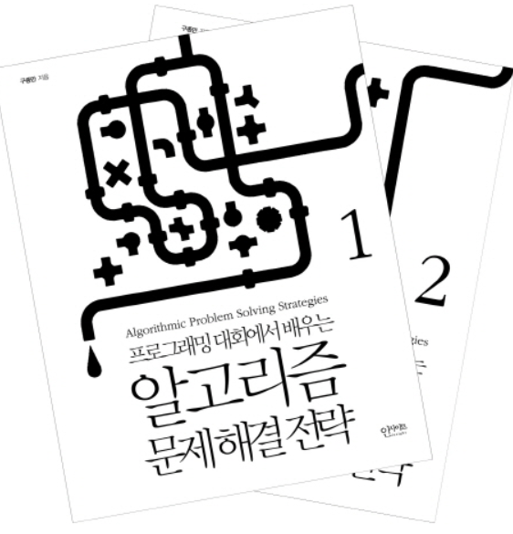
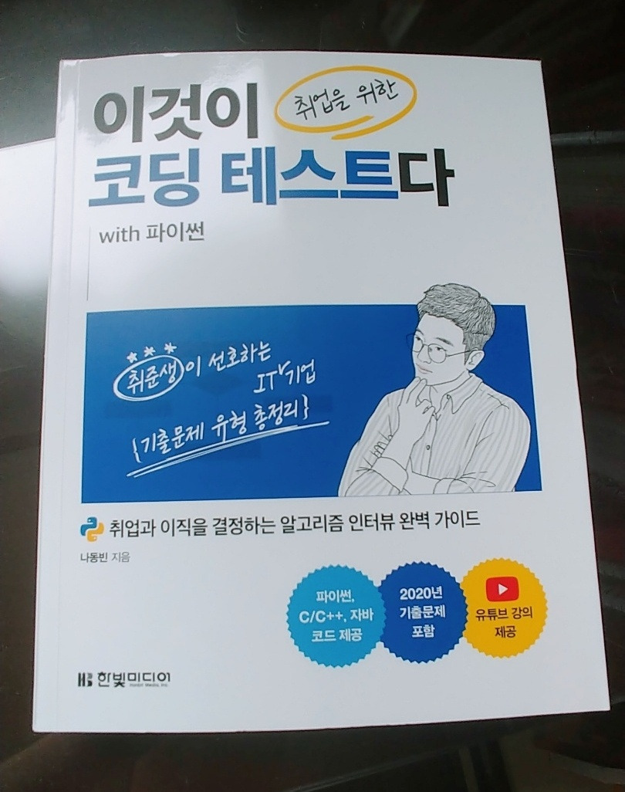

## "코딩 테스트를 떨어졌다!"

 최근에 가장 많이 맞닥뜨린 상황이다. 인턴, 정규직 지원은 아니지만 간절히 원하던 교육 프로그램에 지원할 때마다 항상 2차 코테를 넘어서지 못하고 있다... 비전공자의 입장이다 보니 코테에 대한 제대로 된 지식 없이 약간의 문제 풀이 연습으로 도전한 게 화근인 듯싶다. 처음에는 1차 코테를 통과하길래 솔직히 "오? 되나?" 싶었다. 그러나 다른 분들 후기를 보고 나니 코테는 시간 복잡도나 알맞은 자료구조 선택 같이 깊게 생각하고 코드에 녹여야 할 요소가 많았다. 

 사실, 교육 프로그램 입과를 목표로 했기 때문에 코테 준비사항에서도 큰 요구가 없는 것 같았다. '자료구조'나 '알고리즘'이 중요한 과목임을 알지만 '들어가서 공부하자' 싶었다. 특히, 비전공자니까 혼자 공부하는 것보단 어딘가에 소속돼서 교육 받아야 한다는 생각이 강했다. (함께하는 동료들도 만나야 시너지가 있으니까!) 하지만, 막상 코테를 접하니 교육 프로그램 입과 문제에서도 (모든 문제가 그렇지는 않았지만) '자료구조', '알고리즘'에 대한 이해가 필요했다. 그렇게 입과에 떨어지고 점점 시간이 지나가다 보니, 내실이 부족해져 감을 느꼈다. 이전 동아리 동료들과 프로젝트를 하며 항상 재밌게 공부했던 프로그래밍인데, 시간이 지날수록 발전이 없구나... 서글퍼졌다. 

 그래서 내린 결론은 '나에게 집중하자!'이다. 지금은 공백에 대한 걱정이나 교육 프로그램에 의지하지말고 스스로 부족한 것에 집중하기로 결정했다. 특히나 나이에 관대한 곳이 IT니까 조급하지 말고 길게 보자고 다독였다. 그렇게 차근차근하다 보면 좋은 기회가 오지 않을까? :)

 자료구조와 알고리즘에 한해서 현재 나의 상태를 보면, 전공도 부전공도 아니지만 컴퓨터공학과 수업을 통해 C언어로 자료구조 공부를 한 적이 있다. (친절하고 열정적이신 교수님 덕에 높은 집중력으로 A+를 받았었다.) 하지만, 지금 바로 구현할 수 있냐고 묻는다면 그렇지 않다. (특히, 그래프 단원 쪽에서 다익스트라나 벨만포드를 보고 경악했던 기억이 난다.) 그래도 과제를 하며 스택, 큐, 힙, 우선순위 큐 같은 여러 지식들에 익숙해졌으니까, 이제는 책을 보고 문제를 풀며 온전히 내 것으로 만들어 보고자 한다.

 어떤 책으로 공부할까? 이전에 SW 마에스트로를 하던 동생에게 알고리즘 책으로 유명한 종만북을 추천받은 적이 있는데, 찾아보니 무지 어려워 보였다. C++을 배워본 적이 없으니까 나의 미천한 C 실력으로는 아직 무리라고 판단했다.

'종만북'으로 유명한 구종만 님의 알고리즘 문제해결전략

 그러던 중, 유튜브에서 자주 영상을 챙겨봤었던 '안경잡이 개발자' 나동빈 님이 최근에 내신 저서 '이것이 취업을 위한 코딩 테스트다'를 발견했다. 책을 살 때는 항상 신중히 구매하는 편인데, 이 책은 알찬 콘텐츠 구성과 나동빈 님께 느끼는 신뢰가 있어서인지 큰 고민 없이 바로 구매했다. (이렇게 저항감 없이 구매하는 건 참 오랜만이다...)

 나에게는 자료구조, 알고리즘뿐만 아니라 코딩 테스트의 일반적인 지식도 필요했는데, 이 책은 자료구조, 알고리즘에 대한 내용과 더불어 초보자 알고리즘 독학 로드맵, 최근 기업 코테의 동향까지 하나로 모아져 있었다. 또한, 파이썬이 익숙한 편이라 문제 풀이의 주 언어로 파이썬을 사용했다는 점도 매력적이었다. 거기에 유튜브 인강까지 매주 토, 일 진행한다고 하니 망설일 이유가 없었다.

 이제 1강 들었는데 강의 길이가 꽤나 길었다. 그래도 꾸준히 공부한 내용을 기록하며 마지막에는 책에 대한 리뷰까지 행복하게 남기고 싶다. 알고리즘 푸는 것이 꽤나 즐겁다고 느끼는 요즈음이다. 부족한 부분 투성이지만 하나하나 나의 장점으로 만들어 가야겠다.