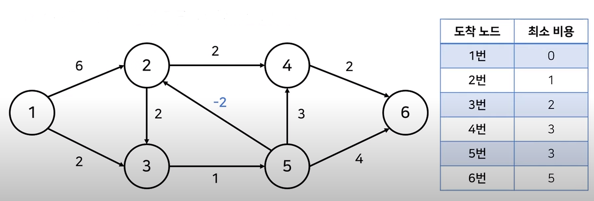
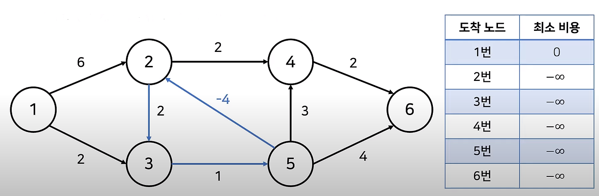
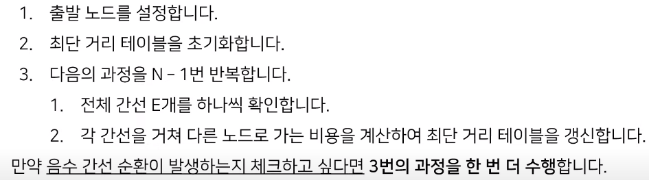

## 벨만 포드 알고리즘 (Bellman-Ford Algorithm)

###  1. 벨만 포드 알고리즘 개요

  벨만 포드 알고리즘(Bellman-Ford Algorithm)은 다익스트라 알고리즘과 거의 유사하다. 다만, 다익스트라 알고리즘과 달리 **벨만 포드 알고리즘은 음의 값을 가지는 간선을 포함하여 알고리즘을 수행할 수 있다는 점이 큰 차이점이다.**



  위와 같이 5번 노드에서 2번 노드로 가는 간선의 비용이 -2인 그래프가 있다. 이 경우, 음의 간선이 존재하지만 얼마든지 오른쪽 테이블처럼 최소 비용을 계산해낼 수 있다.



  그러나 **음의 간선의 순환이 포함되어 있는 경우 최소 비용을 계산하는데 어려움**이 생길 수 있다. 위 그래프는 음의 간선 비용이 -4인데 이 값이 상당히 작기 때문에 '3번 노드 -> 5번 노드 -> 2번 노드' 순으로 순환을 계속하는 것이 최소 비용을 구하는 과정이 되어버리고, 결국 비용을 마이너스 무한대로 무한히 줄이게 되는 상황을 확인할 수 있다. 이러한 상황을 타개하기 위해서는 벨만포드 알고리즘을 적용해야 한다.

  일반적으로 최단 경로 문제는 다음과 같은 상황이 존재한다. 

1. 모든 간선이 양수인 경우
2. 음수 간선이 포함된 경우
	- 음수 간선의 순환이 있는 경우
	- 음수 간선의 순환이 없는 경우

  벨만 포드 알고리즘의 경우 **음의 간선이 포함된 상황에서도 사용**할 수 있고, **음수 간선의 순환을 감지**할 수 있는 덕분에 음의 간선이 포함된 상황에서 최단 경로를 구할 때는 벨만 포드 알고리즘을 사용한다. 다만, 벨만 포드 알고리즘의 **시간 복잡도는 O(VE)** 로 **다익스트라 알고리즘보다 느리기 때문에**, 음의 간선이 포함되지 않은 상황이라면 다익스트라 알고리즘을 적용하는 것이 바람직하다.

###  2. 벨만 포드 알고리즘의 동작 과정

  벨만 포드 알고리즘의 동작 과정은 다음과 같다.



  전체적인 로직은 다익스트라 알고리즘과 유사하다. 여기서 두 가지 주목해볼 점이 있는데 먼저, **음수 간선의 순환을 체크하는 부분**이다. 벨만 포드 알고리즘은 **마지막에 3번 과정을 한 번 더 수행**하므로써 음수 간선의 순환이 존재하는지 여부를 확인한다. 만일, 이 과정에서 **테이블이 또 갱신된다면, 음수 간선의 순환이 존재한다고 판단**한다.

  또한,  3번의 과정을 N - 1번만큼 수행하는 부분에서 벨만 포드 알고리즘은 전체 간선을 모두 확인하는 반면, 다익스트라 알고리즘은 확인한 노드에 붙어 있는 간선만 체크한다는 점은 다르다. 여기서 알 수 있는 것은 **벨만 포드 알고리즘이 다익스트라 알고리즘의 최적의 해(Optimal Solution)를 항상 포함**한다는 것이다. 즉, 다익스트라는 간선의 비용이 양수인 상황에서만 적용 가능하지만, 벨만 포드 알고리즘은 다익스트라 알고리즘의 최적의 해를 보장하므로 시간은 오래걸리더라도 모든 상황에 적용 가능하다.

  벨만 포드의 파이썬 구현 코드는 다음과 같다.

```python
import sys
input = sys.stdin.readline
INF = int(1e9)  # 무한을 의미하는 값으로 10억 설정


def bf(start):
    # 시작 노드에 대해서 초기화
    dist[start] = 0
    # 전체 n번의 라운드(round)를 반복
    for i in range(n):
        # 매 반복마다 "모든 간선"을 확인
        for j in range(m):
            cur = edges[j][0]
            next_node = edges[j][1]
            cost = edges[j][2]
            # 현재 간선을 거쳐서 다른 노드로 이동하는 거리가 더 짧은 경우
            if dist[cur] != INF and dist[next_node] > dist[cur] + cost:
                dist[next_node] = dist[cur] + cost
                # n번째 라운드에서도 값이 갱신된다면 음수 순환이 존재
                if i == n - 1:
                    return True
    return False


# 노드의 개수, 간선의 개수를 입력받기
n, m = map(int, input().split())
# 모든 간선에 대한 정보를 담는 리스트 만들기
edges = []
# 최단 거리 테이블을 모두 무한으로 초기화
dist = [INF] * (n + 1)

# 모든 간선 정보를 입력받기
for _ in range(m):
    a, b, c = map(int, input().split())
    edges.append((a, b, c))

# 벨만 포드 알고리즘을 수행
negative_cycle = bf(1)

if negative_cycle:
    print(-1)
else:
    # 1번 노드를 제외한 다른 모든 노드로 가기 위한 최단 거리 출력
    for i in range(2, n + 1):
        # 도달할 수 없는 경우, -1을 출력
        if dist[i] == INF:
            print(-1)
        # 도달할 수 있는 경우, 최단 거리 출력
        else:
            print(dist[i])
```

***

_본 포스팅은 '안경잡이 개발자' 나동빈 님의 저서_
_'이것이 코딩테스트다'와 그 유튜브 강의를 공부하고 정리한 내용을 담고 있습니다._