## 최단 경로 알고리즘 (Shortest Path Algorithm)

 최단 경로 알고리즘(Shortest Path Algorithm)이란 **가장 짧은 경로를 찾는 알고리즘**을 말한다. 최단 경로를 찾는 것은 여러가지 상황이 존재할 수 있는데, 대표적으로 (1) 한 지점에서 다른 한 지점까지의 최단 경로를 찾는 상황 (2) 한 지점에서 다른 모든 지점까지의 최단 경로를 찾는 상황 (3) 모든 지점에서 다른 모든 지점까지의 최단 경로를 찾는 상황을 생각해 볼 수 있다.

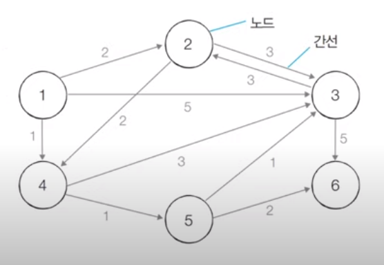

 최단 경로 알고리즘은 일반적으로 그래프 자료구조를 기반으로 해 진행된다. 각 지점은 노드(Node)로 나타내고, 지점 사이를 연결하는 도로는 간선(Edge)으로 표현한다. 예를 들어, 노드는 도시, 마을, 국가 등으로, 간선은 도로, 통로 등으로 표현할 수 있다. 

## 다익스트라 알고리즘 (Dijkstra Algorithm) 

###  1. 다익스트라 알고리즘 개요

  다익스트라 알고리즘(Dijkstra Algorithm)은 대표적인 최단 경로 알고리즘 중 하나이다. 에츠허르 다익스트라(Edsger Wybe Dijkstra)가 고안한 알고리즘이어서 알고리즘 명에 창시자 이름을 그대로 사용했다.

  다익스트라 알고리즘은 **특정한 노드에서 출발해 다른 모든 노드로 가는 최단 경로**를 계산한다. 이 때, 알고리즘에 사용되는 그래프는 **음의 간선이 없어야** 올바른 결과를 얻을 수 있다. 이러한 특징은 다익스트라 알고리즘이 인공위성 같은 실제 GPS 소프트웨어에서 기본 알고리즘으로 채택되는 이유 중 하나이다. 보통 현실 세계의 도로는 음의 간선으로 표현되지 않기 때문에, 다익스트라는 실제 세계에서 실용적으로 사용되기에 적합한 알고리즘이다.

  또한, 이 알고리즘은 **매 상황에서 가장 비용이 적은 노드를 선택**하는 과정을 반복한다는 점에서 **그리디 알고리즘**으로 분류될 수 있다. 다만, 어떤 지점에서 다른 지점을 경유하여 특정 지점으로 가는 최단 경로는 경유한 지점을 중심으로 하는 또 다른 최단 경로들로 분할할 수 있다는 점에서, 최단 경로 알고리즘은 다이나믹 프로그래밍을 기반으로 한다고도 말할 수 있다.

  다익스트라 알고리즘의 동작 과정은 다음과 같다.

   1. 출발 노드를 설정한다.

   2. 최단 거리 테이블을 초기화한다. (자기자신으로 향하는 비용은 0, 다른 모든 노드로 향하는 비용은 무한(inf)로 설정)

   3. 방문하지 않은 노드 중에서 최단 거리가 가장 짧은 노드를 선택한다.

   4. 해당 노드를 거쳐 다른 노드로 가는 비용을 계산하여 최단 거리 테이블을 갱신한다.

   5. 3번과 4번 과정을 반복한다.

  특히, 3번을 통해 **매 순간 변하지 않는 최단 경로를 정할 수 있다는 점은 다익스트라 알고리즘이 그리디 알고리즘으로 잘 동작하게 되는 근거**가 된다. 그런데, 다익스트라 최단 경로 알고리즘을 동작시키면 각 노드에 대한 최단 경로가 아닌 단순한 **최단 거리를 결과로 얻게 된다.** 이름은 최단 경로 알고리즘이지만 최단 거리를 넘어서 진정한 최단 경로까지 출력하기 위해서는 별도의 로직을 추가할 필요가 있다. 다만, 코딩테스트 수준에서는 모든 노드에 대한 최단 거리 테이블만 구해도 충분히 문제를 해결할 수 있으므로, 이 글에서는 최단 거리를 구하는 것에 대해서만 살펴보기로 한다.

###  2. 다익스트라 알고리즘 동작 과정

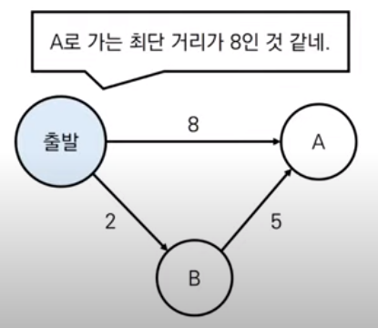

  다익스트라 알고리즘에서 최단 거리 테이블은 각 노드에 대해서 현재까지의 최단 거리 정보를 가지고 있다. 그리고 알고리즘 수행 과정에서 이미 기록된 최단 거리 정보보다 더 짧은 경로를 찾게 되면, 찾은 경로의 거리를 최단 거리 테이블에 갱신한다. 위 그림을 살펴보면, 현재까지 A로 가는 최단 거리가 8로 기록되어 있지만, 다음 탐색에서 B를 경유해 A로 가는 경로가 더 짧음을 확인했다면 해당 경로의 거리인 7을 최단 거리 테이블에 갱신해준다.

  (1) 간단한 구현

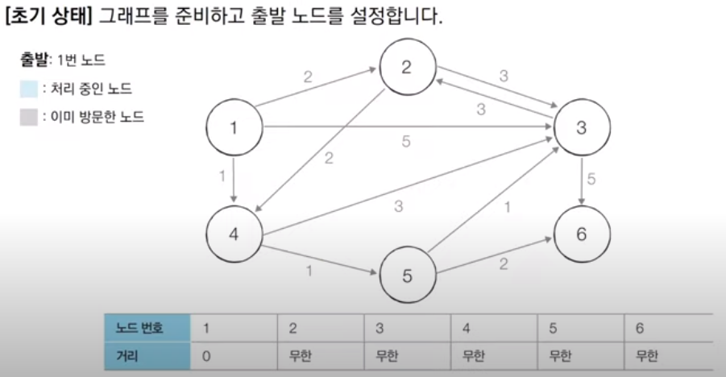

   위 그림과 같이 간선에 방향성이 있는 그래프를 사용해 다익스트라 알고리즘의 더 구체적인 수행 과정을 살펴보자. 먼저, 출발 노드는 임의로 1번 노드로 설정하고 최단 거리 테이블을 초기화한다. 최단 거리 테이블에서 1번은 자기자신으로 향하므로 값을 0으로 설정하고 나머지 모든 노드는 무한 값을 설정해 진행한다.

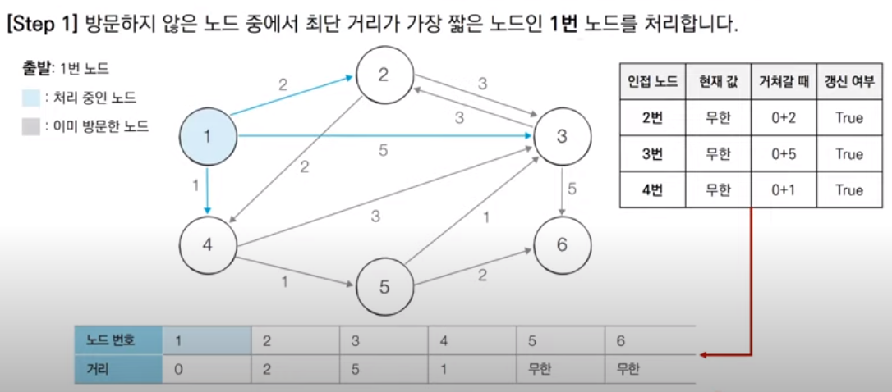

   다음으로, 방문하지 않은 노드 중에서 최단 거리가 가장 짧은 노드를 선택한다. 여기서는 1번 노드의 최단거리가 가장 짧으므로 1번 노드를 선택하여 방문한다. 그리고 해당 노드를 거쳐 다른 노드로 가는 비용을 계산해 최단 거리 테이블에 갱신한다. 이 경우, 1번 노드에 인접한 노드는 2, 3, 4번 노드이고 각각에 대하여 비용을 계산한 값은 0+2, 0+5, 0+1가 되는데, 이는 모두 각 노드의 현재 값인 무한대보다 작으므로 최단 거리 테이블 속 해당 노드들에 이 값들을 기록한다.

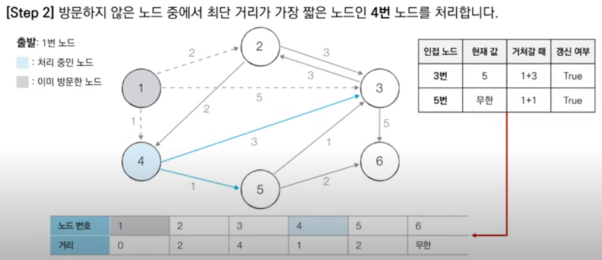

   그리고 다시 앞 과정을 반복한다. 이번엔 아직 방문하지 않은 노드들 중 가장 최단 거리가 짧은 노드가 4번 노드이므로 이 노드를 선택해 방문한다. 4번 노드에 인접한 노드를 확인해보면 3, 5번 노드가 있다. 3번 노드의 경우 새로 찾은 경로의 비용이 1+3이고 이는 현재 값 5보다 작으므로 최단 거리 테이블의 3번 노드 정보를 갱신한다. 5번 노드의 경우도 새로 찾은 경로의 비용이 1+1이고 이는 현재 값 무한대보다 작으므로 테이블의 정보를 갱신한다.

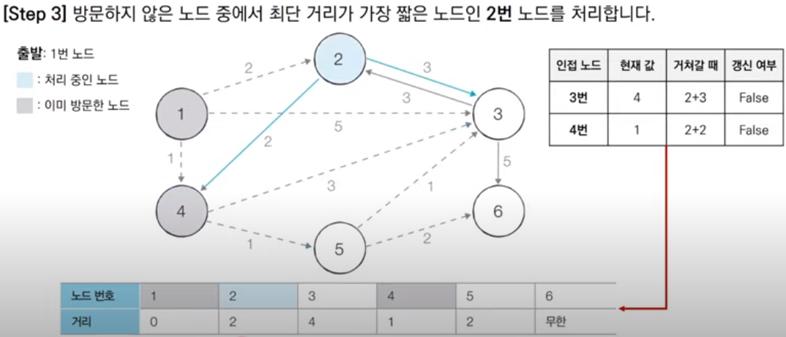

   이번엔 방문하지 않은 노드들 중 최단 거리가 가장 짧은 노드로 2, 5번 노드 두 개가 있다. 일반적으로 숫자가 더 작은 노드를 먼저 처리하는 경향이 있어 여기선 2번 노드를 먼저 처리하기로 한다. 방문한 2번 노드에는 3, 4번 노드가 인접해 있다. 3번 노드의 경우 새로 찾은 경로의 비용이 2+3인데 현재 값이 4이므로 테이블을 갱신하지 않고 넘어간다. 4번 노드 역시 새로운 경로의 비용이 2+2인데 현재 값이 1이므로 테이블을 갱신하지 않는다. 그런데 사실 **4번 노드는 이미 방문한 노드이기 때문에 비용의 대소 비교없이 갱신을 무시하고 넘어가는 방법을 사용할 수 있다.** **이미 방문한 노드는 그 노드까지 가는 최단 경로가 확실히 정해진 것이어서 변동의 여지가 없기 때문이다.**

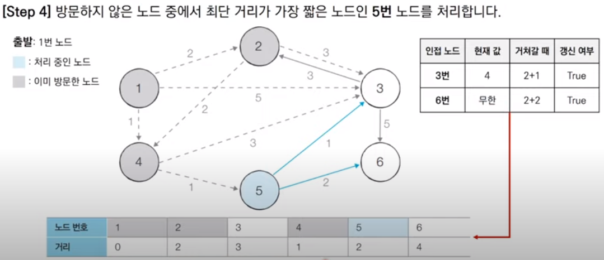

   다음 단계에서는 방문하지 않은 노드 중 5번 노드의 최단 거리가 가장 짧으므로 5번 노드를 방문한다. 5번 노드에 인접한 노드로는 3, 6번 노드가 있는데, 3번노드의 경우 새로 찾은 경로의 비용 2+1이 현재 값 4보다 작으므로 테이블을 갱신하고 6번의 경우도 새로 찾은 경로의 비용이 2+2여서 현재 값 무한대보다 작으므로 테이블을 갱신한다.

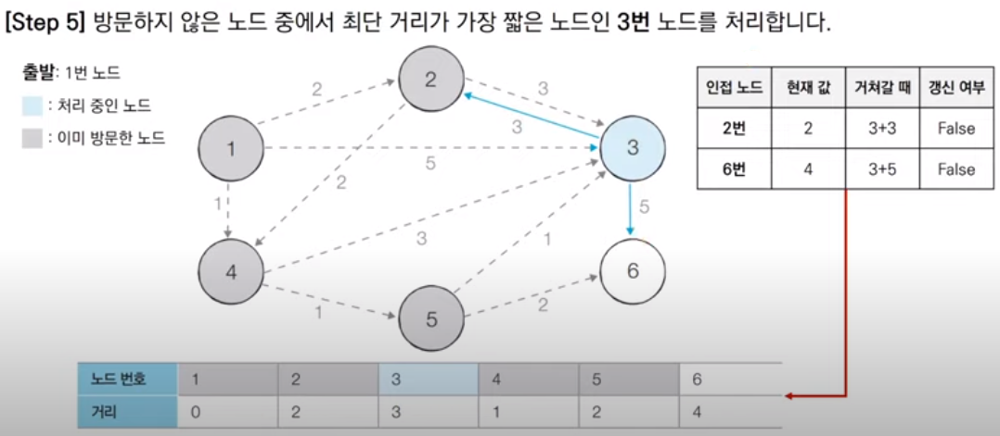

   이번엔 방문하지 않은 노드 중 최단 거리가 가장 짧은 3번 노드를 방문해 처리한다. 3번 노드의 인접 노드로는 2, 6번 노드가 있다. 2번 노드는 새로 찾은 경로의 비용이 3+3이어서 현재 값 2보다 크고, 이미 방문한 노드여서 최단거리가 확정되어 있으므로 테이블을 갱신할 필요가 없다. 6번 노드도 새로 찾은 경로의 비용 3+5가 현재 값 4보다 크므로 역시 테이블을 갱신하지 않는다.

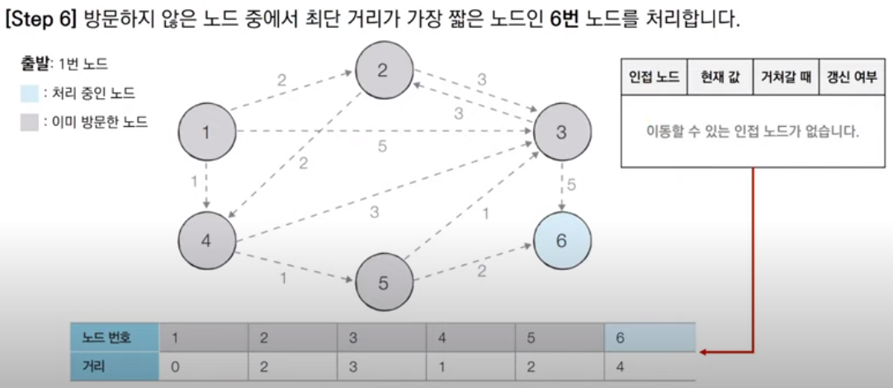

   마지막으로, 방문하지 않은 마지막 6번 노드에 대해 처리한다. 사실, 다익스트라 알고리즘에서는 **마지막 남은 하나의 노드에 대해서 처리할 필요가 없다**. **이미 다른 모든 노드들에 대해 최단 거리가 확정**되어서 기존 과정을 수행할 필요성이 사라지기 때문이다. 심지어 위 그래프의 6번 노드는 인접한 노드도 없어서 알고리즘 과정을 수행하지 않는다. 따라서, 별도의 과정 수행 없이 알고리즘이 종료된다.

   다익스트라 알고리즘의 간단한 코드 구현은 아래와 같다.

```python
# input
# 6 11
# 1
# 1 2 2
# 1 3 5
# 1 4 1
# 2 3 3
# 2 4 2
# 3 2 3
# 3 6 5
# 4 3 3
# 4 5 1
# 5 3 1
# 5 6 2

# output
# 0
# 2
# 3
# 1
# 2
# 4

import sys

input = sys.stdin.readline
INF = int(1e9)  # 무한을 의미하는 값으로 10억을 설정

# 노드의 개수, 간선의 개수를 입력 받기
n, m = map(int, input().split())
# 시작 노드 번호 입력 받기
start = int(input())
# 각 노드에 인접한 노드 정보를 담는 리스트 만들기
graph = [[] for _ in range(n + 1)]
# 방문 여부를 체크하는 리스트 만들기
visited = [False] * (n + 1)
# 최단 거리 테이블 값을 무한으로 초기화
distance = [INF] * (n + 1)

# 모든 간선 정보를 입력 받기
for _ in range(m):
    a, b, c = map(int, input().split())
    graph[a].append((b, c))  # a번 노드에서 b번 노드로 가는 비용이 c


# 방문하지 않은 노드 중에서, 가장 최단 거리가 짧은 노드의 번호를 반환
def get_smallest_node():
    min_value = INF
    index = 0
    for i in range(1, n + 1):
        if distance[i] < min_value and not visited[i]:
            min_value = distance[i]
            index = i
    return index


def dijkstra(start):
    # 시작 노드에 대해 초기화
    distance[start] = 0
    visited[start] = True
    for j in graph[start]:
        distance[j[0]] = j[1]
    # 시작 노드를 제외한 n - 1개의 노드에 대해 반복
    for i in range(n - 1):
        # 현재 최단 거리가 가장 짧은 노드를 방문
        now = get_smallest_node()
        visited[now] = True
        # 현재 노드와 인접한 다른 노드들 확인
        for j in graph[now]:
            cost = distance[now] + j[1]
            # 현재 노드를 경유해 다른 노드로 이동하는 거리가 더 짧은 경우
            if cost < distance[j[0]]:
                distance[j[0]] = cost


# 다익스트라 알고리즘 수행
dijkstra(start)

# 모든 노드에 대해 최단 거리 출력
for i in range(1, n + 1):
    # 도달할 수 없는 경우 무한(INFINITY)으로 출력
    if distance[i] == INF:
        print("INFINITY")
    # 도달할 수 있는 경우 거리를 출력
    else:
        print(distance[i])
```

   위와 같은 간단한 다익스트라 알고리즘 구현은 시간 복잡도가 O(V²)이다. 최단 거리가 가장 짧은 노드를 찾는 선형 탐색을 O(V)번 해야하고, 찾은 노드에 인접한 노드를 매번 확인해야 하기 때문이다. 따라서, 전체 노드 개수가 5000개 이하인 문제에 대해서는 큰 문제 없지만, 10000개를 넘어가는 문제에 대해서는 보다 개선된 다익스트라 알고리즘을 사용해야 한다.

  (2) 개선된 다익스트라 알고리즘

   다익스트라 알고리즘을 개선하기 위해서는 **우선순위 큐**를 사용해야 한다. 우선순위 큐는 우선도가 높은 데이터를 먼저 처리하도록 설계된 자료구조이며 이를 구현하기 위해 보통 **힙 자료구조**를 사용한다. 힙을 사용하면 **데이터의 삽입, 삭제에 logN의 시간 복잡도가 소요**되며, 데이터를 우선도에 따라 **NlogN 시간 복잡도로 정렬**할 수 있다.

   다익스트라 알고리즘을 개선하기 위해서 '단계마다 방문하지 않은 노드 중 최단 거리가 가장 짧은 노드를 선택'하는 과정에 힙 자료구조를 사용한다. 그리고 최단 거리가 가장 짧은 노드를 선택해야하므로 **최소 힙**을 사용해야 한다.

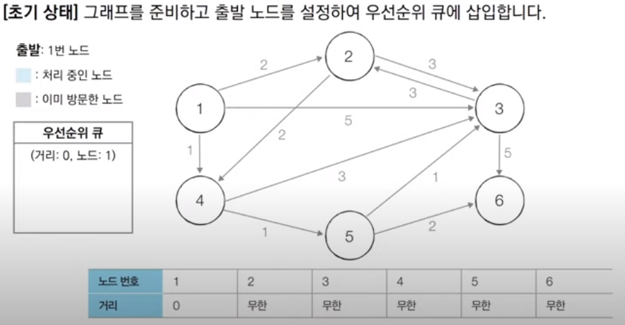

   우선순위 큐로 구현한 다익스트라 알고리즘의 자세한 동작 과정을 살펴보자. 처음엔 원래의 다익스트라 알고리즘 구현과 동일하다. 이번에도 1번 노드를 출발 노드로 설정했으므로 1번 노드까지의 현재 최단 거리 값을 0으로 설정하고, 1번 노드에 대한 정보를 튜플 형태로 우선순위 큐에 넣는다. 이 때, **튜플의 첫 번째 원소를 거리로 설정**하면 이 거리를 기준으로 거리가 더 작은 노드가 먼저 나올 수 있도록 큐가 구성된다.

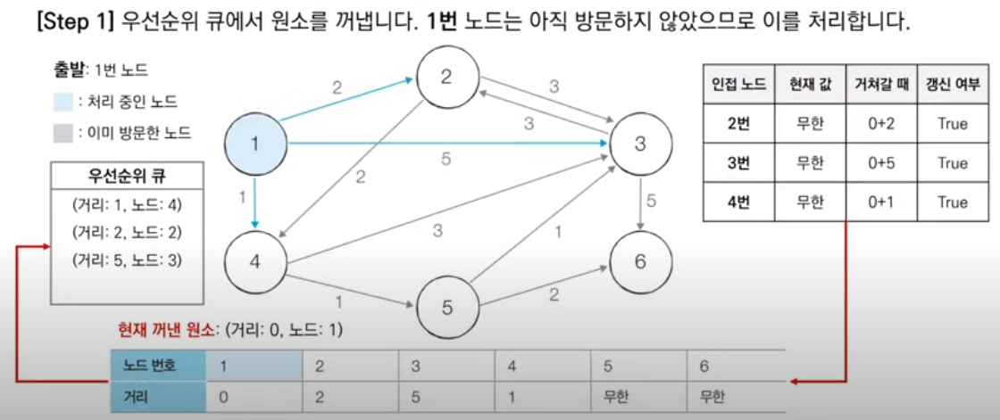

   이후 매 단계마다 우선순위 큐에 담긴 원소를 꺼내서 해당 노드에 대한 방문 여부를 확인하고 처리하는 과정을 반복한다. 이번 단계에서 큐로부터 꺼낸 원소는 아직 방문하지 않은 1번 노드이므로, 1번 노드를 방문 처리하고 인접한 노드에 대한 최단 거리 값을 갱신한다. 1번 노드와 인접한 노드는 2, 3, 4번 노드가 존재하고 각각 0+2, 0+5, 0+1의 최단 경로 값을 가지므로, 현재 테이블의 무한 값을 갱신하고 갱신한 노드를 우선순위 큐에 삽입한다. **여기서 큐에 삽입하는 노드는 최단 거리 값이 갱신된 노드만 해당된다는 점을 유의하자.**

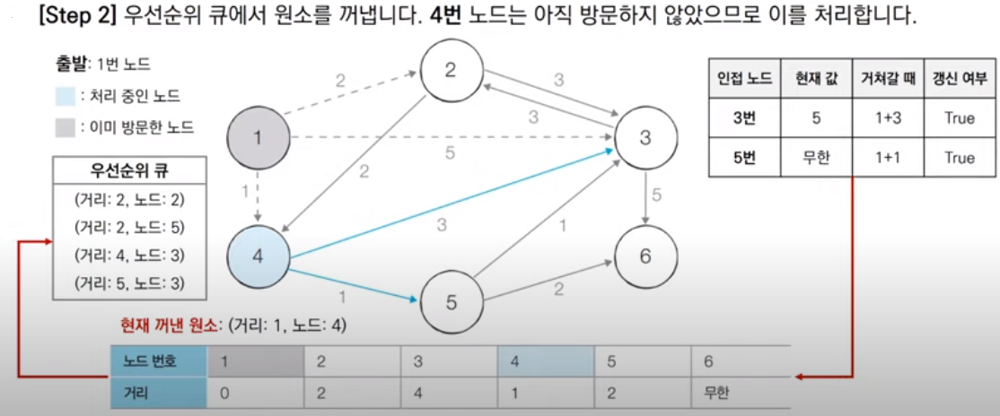

   다음으로 우선순위 큐에서 다시 원소를 꺼내 방문 여부를 파악한다. 큐에서 꺼낸 4번 노드는 아직 방문하지 않은 노드이므로 방문처리한다. 그리고 인접한 3, 5번 노드의 최단 경로 값을 계산해 현재 값과 비교하고 테이블을 갱신한다. 3번 노드는 최단 경로 값이 1+3으로 현재 값 5보다 작고 5번 노드도 1+1로 현재 값 무한대보다 작으므로 두 노드 다 값을 갱신한다. 그 후 갱신한 두 노드를 우선순위 큐에 넣는다. 이 때, 우선순위 큐 속 노드들은 거리를 기준으로 오름차순 정렬되어 알고리즘 수행에 적합하게 재정렬됨을 확인할 수 있다.

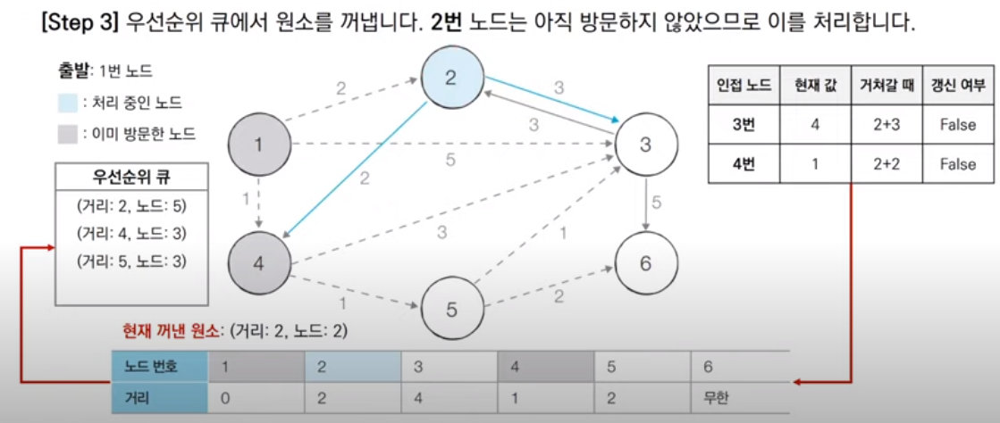

   이 다음도 위에서 살펴본 바와 마찬가지이다. 우선순위 큐에서 꺼낸 2번 노드를 방문처리하고 인접한 노드의 최단 거리 값을 계산한다. 이 경우는 계산된 최단 거리 값이 현재 값보다 크므로 따로 테이블을 갱신하지 않는다. 또한, 값이 갱신되지 않았기 때문에 우선순위 큐에도 노드들을 삽입하지 않는다.

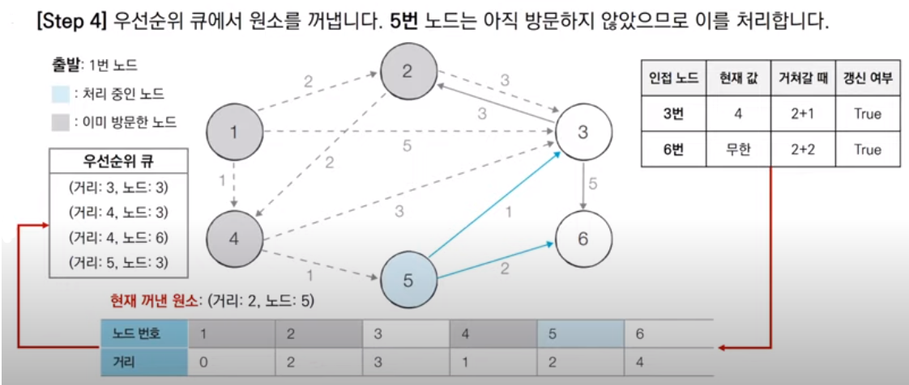

  다음으로 우선순위 큐에서 꺼낸 원소는 5번 노드이고 이를 방문하여 이와 인접한 노드들에 대해 최단 거리를 갱신한다. 이번에는 3, 6번 노드 모두 최단 거리가 갱신되고 우선순위 큐에 삽입된다.

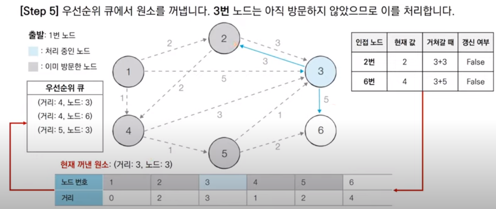

   이번에도 앞과 마찬가지로 우선순위 큐에서 원소를 꺼내고 3번 노드를 방문한다. 3번 노드의 인접 노드는 현재 값이 더 작기 때문에 따로 갱신되지 않고 우선순위 큐에 삽입되지 않는다.

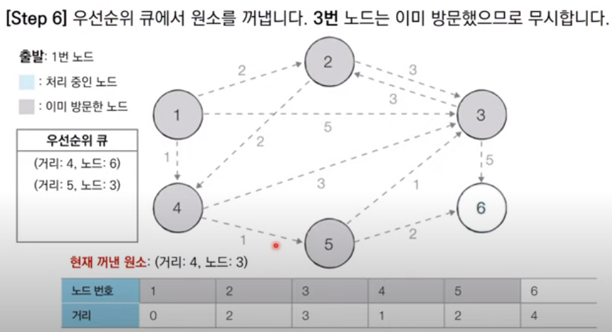

  다음 우선순위 큐에서 꺼낸 노드는 3번 노드이다. 3번 노드는 이미 방문한 적이 있으므로 처리하지 않고 넘어간다. 이 때, 따로 방문 여부를 체크할 리스트 테이블을 만들지 않고, **단순히 큐에서 꺼낸 노드의 거리 값과 최단 거리 테이블의 거리 값을 대소 비교해 큐에서 꺼낸 노드의 거리가 크면 무시하고 넘어가는 방법**을 사용할 수 있다.

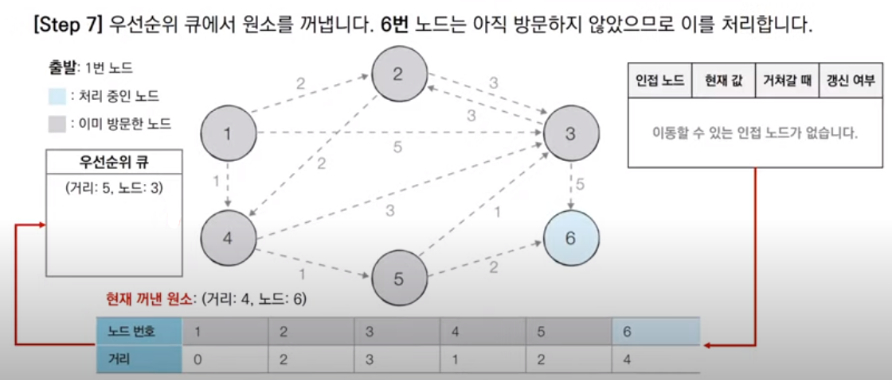

   같은 방식으로 우선순위 큐에서 원소를 꺼내 확인한다. 나온 원소는 6번 노드이고 아직 방문하지 않았으므로 방문처리한다. 6번 노드는 인접한 노드가 없기 때문에 따로 갱신처리하지 않는다.

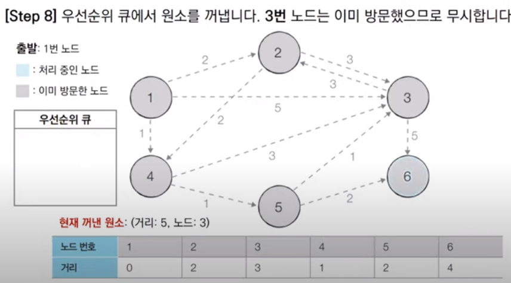

   마지막으로 우선순위 큐에 남은 하나의 원소를 꺼낸다. 꺼낸 원소는 3번 노드이고 이미 방문한 적이 있기 때문에 다른 처리없이 넘어가며 알고리즘을 종료한다. 이 과정은 다른 시각에서 보면 기존의 테이블에 기록된 최단 거리 3보다 새로 꺼낸 최단 거리 5가 더 크기 때문에 넘어간다고 생각할 수도 있다. 

   개선된 다익스트라 알고리즘의 소스코드는 다음과 같다.

```python
# input
# 6 11
# 1
# 1 2 2
# 1 3 5
# 1 4 1
# 2 3 3
# 2 4 2
# 3 2 3
# 3 6 5
# 4 3 3
# 4 5 1
# 5 3 1
# 5 6 2

# output
# 0
# 2
# 3
# 1
# 2
# 4

import heapq
import sys

input = sys.stdin.readline
INF = int(1e9)  # 무한을 의미하는 값으로 10억을 설정

# 노드의 개수, 간선의 개수를 입력 받기
n, m = map(int, input().split())
# 시작 노드 번호 입력 받기
start = int(input())
# 각 노드에 인접한 노드 정보를 담는 리스트 만들기
graph = [[] for _ in range(n + 1)]
# 최단 거리 테이블 값을 무한으로 초기화
distance = [INF] * (n + 1)

# 모든 간선 정보를 입력 받기
for _ in range(m):
    a, b, c = map(int, input().split())
    graph[a].append((b, c))  # a번 노드에서 b번 노드로 가는 비용이 c


def dijkstra(start):
    q = []
    # 시작 노드로 가는 최단 경로는 0으로 설정하고 큐에 삽입
    heapq.heappush(q, (0, start))
    distance[start] = 0
    while q:  # 큐가 빌 때까지
        # 가장 최단 거리가 짧은 노드에 대한 정보 꺼내기
        dist, now = heapq.heappop(q)
        # 현재 노드가 이미 처리된 적이 있는 노드라면 무시
        if distance[now] < dist:
            continue
        # 현재 노드와 인접한 노드들을 확인
        for i in graph[now]:
            cost = dist + i[1]
            # 현재 노드를 경유해 다른 노드로 가는 거리가 더 짧은 경우
            if cost < distance[i[0]]:
                distance[i[0]] = cost
                heapq.heappush(q, (cost, i[0]))


# 다익스트라 알고리즘 수행
dijkstra(start)

# 모든 노드에 대해 최단 거리 출력
for i in range(1, n + 1):
    # 도달할 수 없는 경우 무한(INFINITY)으로 출력
    if distance[i] == INF:
        print("INFINITY")
    # 도달할 수 있는 경우 거리를 출력
    else:
        print(distance[i])
```

   위 알고리즘의 **시간 복잡도는 O(ElogV)** 로 앞의 간단히 구현된 다익스트라 알고리즘보다 훨씬 빠르다. 이러한 시간 복잡도는 직관적으로 와닿지 않을 수 있다. 하지만 잘 생각해보면 이를 이해할 수 있는데, 이미 방문한 노드의 경우 처리하지 않기 때문에 우선순위 큐에서 하나씩 노드를 꺼내 검사하는 반복문은 V이상의 횟수로 반복되지 않는다. 그리고 V번 반복하면서 실제 인접한 노드를 확인하는 작업은 간선의 개수 E만큼 수행된다. 따라서, 개선된 다익스트라 알고리즘은 이 E개의 원소를 우선순위 큐에 넣고 모두 빼내는 작업으로 단순화할 수 있고, 이는 시간 복잡도 O(ElogE)로 표현할 수 있다. 다만, 모든 노드가 다 연결되었다고 했을 때의 간선의 개수는 약 V²개이며 이는 E보다 항상 크다. 이를 log를 씌워서 생각해보면 V²은 log(V²) = 2log(V) = log(V), E는 log(E)가 되고 대소관계는 여전히 유지되어 log(V)는 log(E)보다 항상 크다. 따라서, O(ElogE)는 간단히 O(ElogV)로 표현할 수 있게 된다.

***

_본 포스팅은 '안경잡이 개발자' 나동빈 님의 저서_
_'이것이 코딩테스트다'와 그 유튜브 강의를 공부하고 정리한 내용을 담고 있습니다._