## 서로소 집합 (Disjoint Sets)

  서로소 집합이란 **공통 원소가 없는 두 집합**을 의미한다. 예를 들어, {1, 2}, {3, 4}는 서로소 관계이지만, {1, 2}, {2, 3}은 2라는 공통된 원소가 존재하므로 서로소 관계가 아니다. 

## 서로소 집합 자료구조 (Union Find 자료구조)

 서로소 집합 자료구조(Union Find 자료구조)는 **서로소 부분 집합들로 나누어진 원소들의 데이터를 처리하기 위한 자료구조**이다. 서로소 집합 자료구조에는 두 가지 연산이 존재하는데, 두 개의 원소가 포함된 집합을 하나의 집합으로 합치는 **합집합(Union) 연산**과 특정한 원소가 속한 집합이 어떤 집합인지 알려주는 **찾기(Find) 연산**이 그것이다.

## 서로소 집합 자료구조의 동작 과정

###  1. 기본 동작 과정 (합치기 연산이 여러 개 주어졌을 경우)

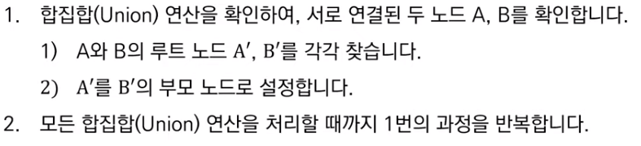

  합치기 연산이 여러 개 주어졌을 경우, 위와 같은 동작 과정을 거쳐 작업을 수행한다. 이를 구체적으로 살펴보자.

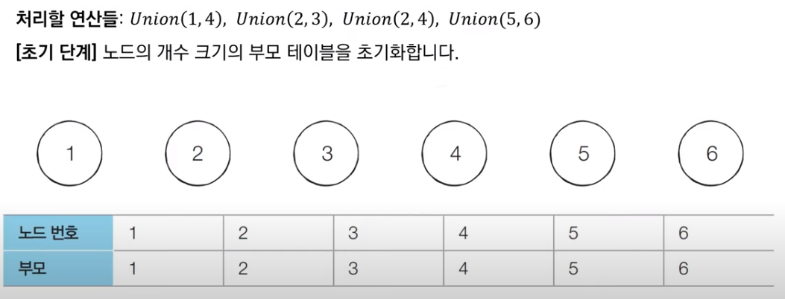

  위와 같이 4개의 Union 연산이 주어졌을 상황을 가정해보자. 먼저 노드 개수만큼의 크기를 가지는 부모 노드를 표현하는 테이블을 생성하고, 테이블 내 각 노드의 부모노드를 자기자신으로 초기화한다.

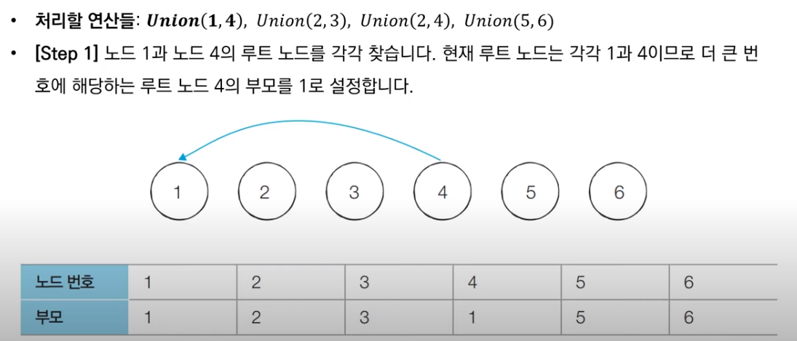

  테이블 생성 및 초기화가 끝나면, 첫 번째로 Union(1, 4) 연산을 처리한다. 이를 처리하기 위해 Union 연산의 인자 값으로 주어진 노드 1과 노드 4의 루트 노드를 찾는다. 여기서는 각자 자기자신이 루트 노드에 해당하므로, 1과 4 중 더 큰 번호에 해당하는 노드 4의 부모노드를 1번 노드로 설정한다. 일반적으로, 큰 번호 노드를 작은 번호 노드의 자식 노드로 설정하는 것이 관행이 있어서 이 규칙을 따라 예시를 진행하겠다.

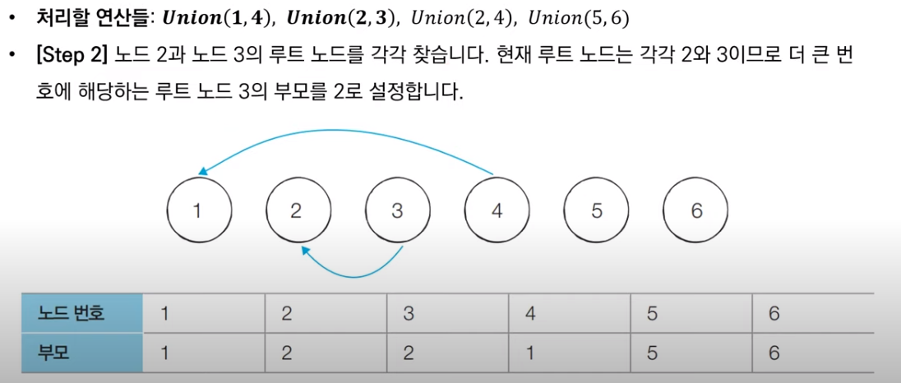

  Union(1, 4) 연산이 끝나면, Union(2, 3) 연산을 진행한다. 노드 2와 노드 3에 대하여 루트 노드를 찾는데, 이번에도 자기자신이 루트 노드이고 3이 더 큰 번호 노드이므로 3번 노드의 부모 노드를 2번 노드로 설정한다.

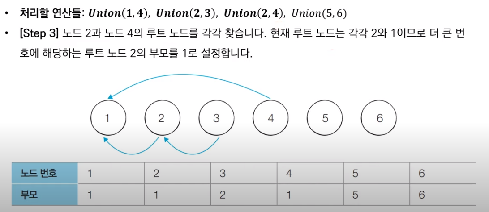

  다음으로 Union(2, 4) 연산을 위와 같은 방식으로 또 진행한다. 2번 노드의 루트 노드는 자기 자신이고, 4번 노드의 루트 노드는 1번 노드이다. 2번 노드가 1번 노드보다 큰 번호이므로, 1번 노드를 2번 노드의 부모 노드로 설정한다.

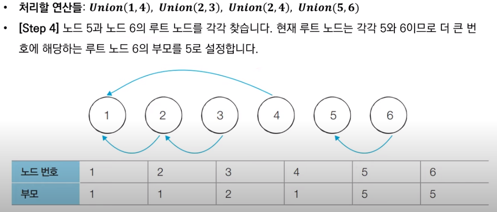

  마지막으로 Union(5, 6) 연산을 똑같은 방법으로 수행한다. 각각의 노드의 루트 노드는 자기자신이고 6번 노드가 더 큰 번호이므로, 5번 노드는 6번 노드의 부모 노드로 설정된다.

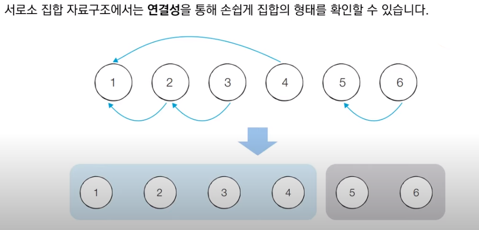

  이와 같은 서로소 집합 자료구조는 각 집합들간의 연결성을 통해 총 몇 개의 집합이 존재하는지를 손쉽게 확인할 수 있다는 장점이 있다. 위의 1, 2, 3, 4번 노드들은 하나의 루트 노드를 가지며 트리 구조 형태를 띈다. 이런 경우 1, 2, 3, 4번 노드들은 원소가 4개인 하나의 집합으로 파악할 수 있다. 또한 5, 6번 노드도 원소가 2개인 또 다른 집합으로서 존재한다. 결론적으로, 위 그래프에서는 총 2개의 집합(1, 2, 3, 4번 노드 집합과 5, 6번 노드 집합)이 존재하고, 그 2개의 집합은 서로소 관계를 가진다.

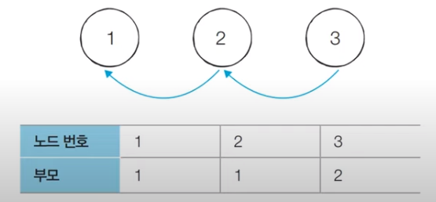

  다만, 기본적인 형태의 서로소 집합 자료구조에서는 루트 노드에 즉시 접근할 수 없다는 단점도 동시에 가지고 있다. 루트 노드를 찾기 위해서는 부모 테이블에서 해당 노드의 부모 노드를 계속 확인하며 거슬러 올라가야만 한다.

  위의 과정을 파이썬 코드로 구현하면 다음과 같다.

```python
# input
# 6 4
# 1 4
# 2 3
# 2 4
# 5 6


# 특정 원소가 속한 집합을 찾기 (Find 연산)
def find_parent(parent, x):
    # 루트 노드를 찾을 때까지 재귀 호출
    if parent[x] != x:
        return find_parent(parent, parent[x])
    return x


# 두 원소가 속한 집합을 합치기 (Union 연산)
def union_parent(parent, a, b):
    a = find_parent(parent, a)
    b = find_parent(parent, b)
    if a < b:
        parent[b] = a
    else:
        parent[a] = b


# 노드의 개수와 간선(Union 연산)의 개수 입력 받기
v, e = map(int, input().split())
parent = [0] * (v + 1)  # 부모 테이블 초기화하기

# 부모 테이블에서, 부모를 자기 자신으로 초기화
for i in range(1, v + 1):
    parent[i] = i

# Union 연산을 각각 수행
for i in range(e):
    a, b = map(int, input().split())
    union_parent(parent, a, b)

# 각 원소가 속한 집합 출력하기
print('각 원소가 속한 집합: ', end='')
for i in range(1, v + 1):
    print(find_parent(parent, i), end=' ')

print()

# 부모 테이블 내용 출력하기
print('부모 테이블: ', end='')
for i in range(1, v + 1):
    print(parent[i], end=' ')
```

###  2. 기본 구현 방법의 개선

  위의 기본적인 Union Find 구현 방법은 수행 시간 면에서 문제점이 있다. 합집합(Union) 연산이 편향되게 이루어지는 경우 찾기(Find) 함수가 비효율적으로 동작한다는 점이다.

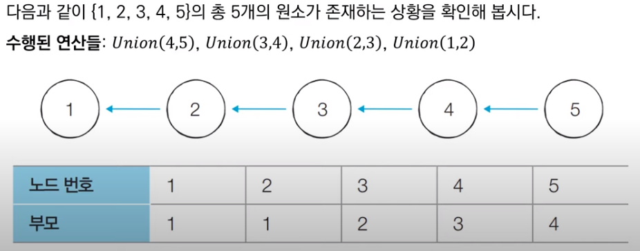

  위는 최악의 경우를 가정한 예시다. 위와 같이 Union 연산이 편향적으로 수행되면, 5번 노드에 대해서 찾기(Find) 함수를 수행할 시 **모든 노드를 다 확인하여 1번 노드를 루트 노드로 반환하는 비효율적인 동작**을 보인다. 이 때, 시간 복잡도는 O(V)다.

  따라서 Find 함수를 개선하기 위해 **경로 압축(Path Compression)** 기법을 사용한다. 다음은 경로 압축 기법을 구현한 파이썬 코드인데, 이는 기본적인 Find 함수에 약간의 변형만으로 구현된다.

```python
# 특정 원소가 속한 집합을 찾기
def find_parent(parent, x):
    # 루트 노드가 아니라면, 루트 노드를 찾을 때까지 재귀적으로 호출
    if parent[x] != x:
        parent[x] = find_parent(parent, parent[x])
    return parent[x]
```

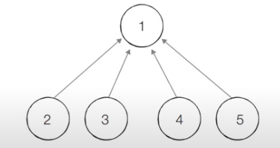

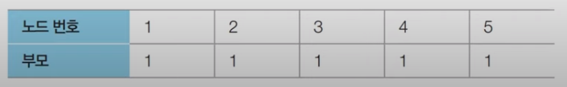

  경로 압축 기법을 적용하면, 각 노드에 대하여 Find 함수를 호출한 이후에 해당 노드의 루트 노드가 바로 부모 노드가 된다. 위의 파이썬 코드를 사용하면 같은 예시에 대하여 위 그래프와 같이 모드 노드들이 자신의 루트 노드를 부모 노드로 가지는 결과를 보여준다. 시간 복잡도도 개선되는 모습을 보인다.

## 서로소 집합을 활용한 사이클 판별

 서로소 집합은 **무방향 그래프에서 사이클을 판별할 때 사용 가능**하다. (방향이 있는 그래프에서는 DFS를 사용한다.) 서로소 집합을 사용한 사이클 판별 알고리즘의 과정은 다음과 같다.

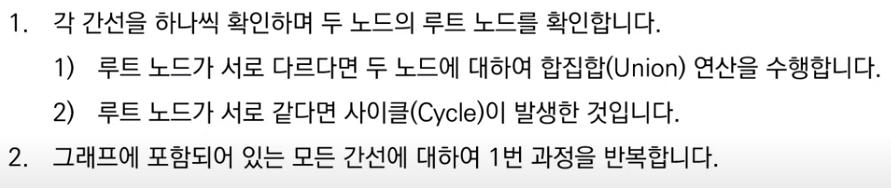

 이를 더 구체적으로 살펴보자.

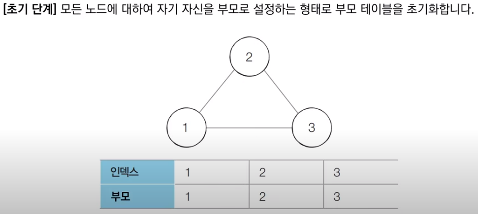

 처음에는 기존 서로소 집합 자료구조 구현과 같은 초기화 과정을 거친다. 각 노드에 대하여 부모 노드를 자기자신으로 설정한다.

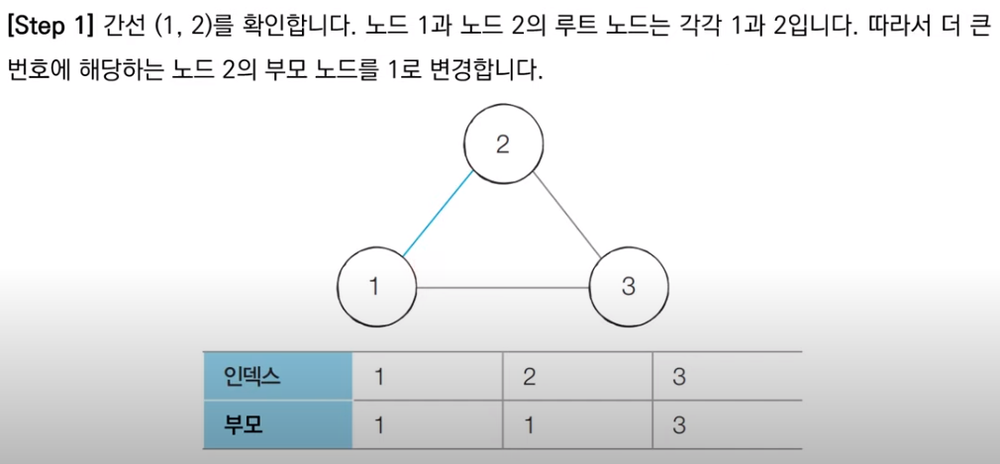

 그 다음, 1번 노드와 2번 노드를 연결하는 간선을 확인하여, 어떤 노드가 부모노드가 될 지 판단한다. 1번과 2번 노드의 부모 노드는 각자 자기자신이므로, 더 큰 번호에 해당하는 2번 노드의 부모 노드를 1번 노드로 설정한다.

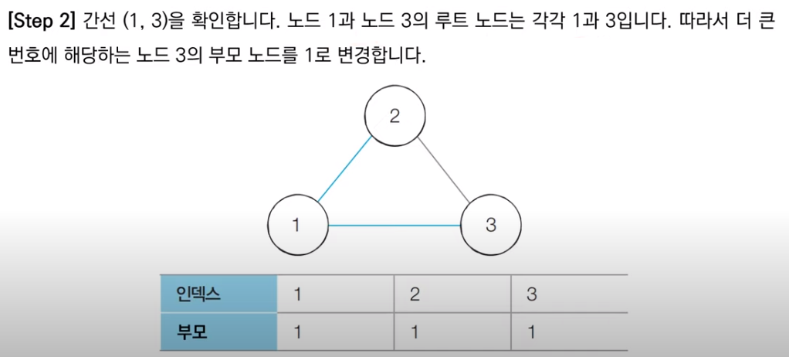

 다음은 1번 노드와 3번 노드를 잇는 간선을 확인한다. 1번 노드와 3번 노드도 각각의 부모 노드가 자기 자신이므로, 더 큰 번호에 해당하는 3번 노드의 부모 노드를 1번 노드로 설정한다.

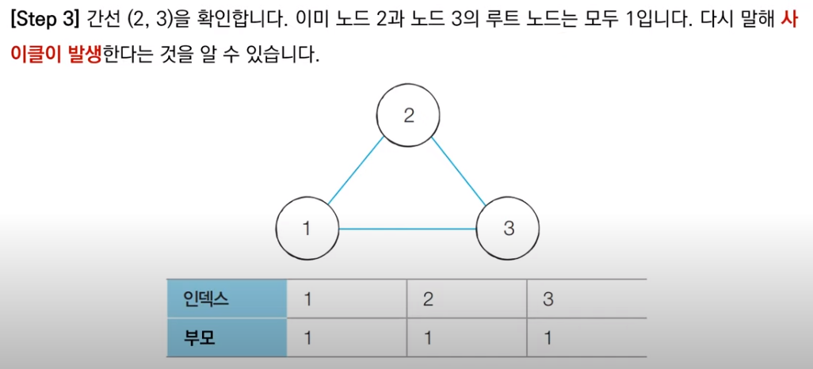

 끝으로 2번 노드와 3번 노드 사이의 간선을 확인한다. 2번 노드와 3번 노드 각각의 루트 노드는 1번 노드이므로, 이미 같은 집합에 속해 있음을 알고 사이클이 발생함을 파악할 수 있다.

 서로소 집합을 사용한 사이클 판별 알고리즘의 파이썬 구현은 다음 코드와 같다.

```python
# input
# 3 3
# 1 2
# 1 3
# 2 3

# 특정 원소가 속한 집합을 찾기 (Find 연산)
def find_parent(parent, x):
    # 루트 노드를 찾을 때까지 재귀 호출
    if parent[x] != x:
        parent[x] = find_parent(parent, parent[x])
    return parent[x]


# 두 원소가 속한 집합을 합치기 (Union 연산)
def union_parent(parent, a, b):
    a = find_parent(parent, a)
    b = find_parent(parent, b)
    if a < b:
        parent[b] = a
    else:
        parent[a] = b


# 노드의 개수와 간선(Union 연산)의 개수 입력 받기
v, e = map(int, input().split())
parent = [0] * (v + 1)  # 부모 테이블 초기화하기

# 부모 테이블에서, 부모를 자기 자신으로 초기화
for i in range(1, v + 1):
    parent[i] = i

cycle = False  # 사이클 발생 여부

for i in range(e):
    a, b = map(int, input().split())
    # 사이클이 발생한 경우 종료
    if find_parent(parent, a) == find_parent(parent, b):
        cycle = True
        break
    # 사이클이 발생하지 않았다면 합집합(Union) 연산 수행
    else:
        union_parent(parent, a, b)

if cycle:
    print("사이클이 발생했습니다.")
else:
    print("사이클이 발생하지 않았습니다.")
```

***

_본 포스팅은 '안경잡이 개발자' 나동빈 님의 저서_
_'이것이 코딩테스트다'와 그 유튜브 강의를 공부하고 정리한 내용을 담고 있습니다._