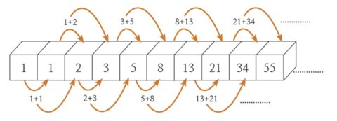
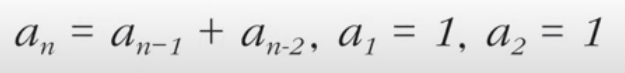
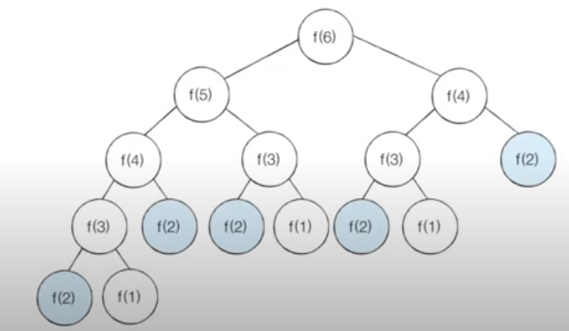
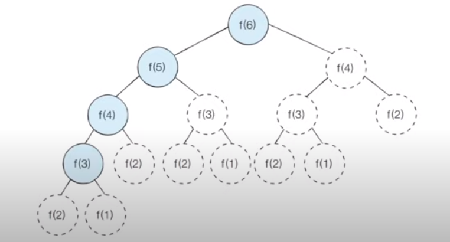

## 다이나믹 프로그래밍 (Dynamic Programming)

 현대에서 컴퓨터를 사용해도 해결하기 어려운 문제는 최적의 해를 구하는데 매우 많은 시간을 요하거나 메모리 공간을 매우 많이 요구하는 문제들이다. 그런데 어떠한 문제는 메모리 공간을 조금 더 사용하면 연산 속도를 비약적으로 상승시킬 수 있는 방법이 있다. **메모리를 적절히 사용하여 수행 시간 효율을 비약적으로 상승시키는 방법**을 **다이나믹 프로그래밍**(**Dynamic Programming**)이라고 하며 **동적 계획법**이라고도 부른다.

 다이나믹 프로그래밍은 1. 큰 문제를 작게 나누고, 2. 같은 문제라면 한 번 씩만 풀어 문제를 효율적으로 해결하는 알고리즘이다. 즉, 다이나믹 프로그래밍은 다음의 두 조건을 갖췄을 때만 사용가능하다.

  1. **최적 부분 구조** (Optimal Substructure): 큰 문제를 작은 문제로 나눌 수 있다.

  2. **중복되는 부분 문제** (Overlapping Subproblem): 작은 문제에서 구한 정답은 그것을 포함하는 큰 문제에서도 동일하다.



 다이나믹 프로그래밍으로 해결할 수 있는 대표적인 문제로 피보나치 수열이 있다. 피보나치 수열은 현재의 항을 이전 두 개 항의 합으로 설정해 끊임없이 이어지는 수열을 말한다. 



 피보나치 수열은 위와 같이 점화식 형태로 만들어 간결하게 표현할 수 있다. 점화식이란 인접한 항들 사이의 관계식을 말한다. 따라서, 위 식은 n번째 피보나치 수는 (n - 1)번째 피보나치 수와 (n - 2)번째 피보나치 수를 합한 것이고 단, 1번째 피보나치 수와 2번째 피보나치 수는 1임을 의미한다.

 이러한 피보나치 수열은 단순히 재귀함수만으로도 표현할 수 있다.

```python
def fibonacci(n):
    if n == 1 or n == 2:
        return 1
    return fibonacci(n - 1) + fibonacci(n - 2)


print(fibonacci(4))
```

 하지만 재귀함수로만 구현한 경우, 시간복잡도가 O(2ⁿ)이 되어 n이 커질수록 수행 시간이 기하급수적으로 증가하기 때문에 심각한 문제가 발생한다. 



 이는 중복되는 부분 문제로 살펴볼 수 있는데, f(6)을 호출하는 예시에서는 f(2)가 총 5번 중복으로 계산되는 것을 알 수 있다. 이렇게 중복되는 부분을 또 다시 계산하는 비효율성을 다이나믹 프로그래밍으로 극복할 수 있다.

 다이나믹 프로그래밍은 크게 재귀 함수를 이용하는 **탑다운(Top-Down) 방식**과 반복문을 이용하는 **바텀업(Bottom-Up) 방식**으로 나뉜다. 먼저, **메모이제이션(Memoization) 기법(탑다운 방식)**을 사용해 피보나치 수열을 해결해보자.

```python
# 한 번 계산된 결과를 메모이제이션(Memoization)하기 위한 리스트 초기화
d = [0] * 100


# 피보나치 함수를 재귀함수로 구현 (탑다운 다이나믹 프로그래밍)
def fibonacci(n):
    # 종료조건(1 혹은 2일 때 1을 반환)
    if n == 1 or n == 2:
        return 1
    # 이미 계산한적 있는 문제라면 그대로 반환
    if d[n]:
        return d[n]
    # 아직 계산하지 않은 문제라면 점화식에 따라서 피보나치 결과 반환
    d[n] = fibonacci(n - 1) + fibonacci(n - 2)
    return d[n]


print(fibonacci(99))
```

 메모이제이션이란 한 번 구한 결과를 메모리 공간에 기록해두고 같은 식을 다시 호출하면 기록한 결과를 그대로 사용하는 기법을 말한다. 캐싱(Caching)이라고도 부르는 이 방법은 특히 탑다운 방식을 이야기할 때 한정해서 쓰인다. (바텀업에서는 사용하지 않는 용어다.) 메모이제이션은 위의 코드처럼 한 번 구한 정보를 리스트에 저장하고 재귀적으로 다이나믹 프로그래밍을 수행하다가 같은 정보가 필요할 때, 구한 정답을 그대로 리스트에서 가져오도록 구현한다. 실제로 위 코드를 실행해보면 단순히 재귀로 구하는 것보다 훨씬 빠르게 답을 도출하는 것을 확인할 수 있다.

 다음으로 다이나믹 프로그래밍의 전형적인 형태인 바텀업 방식으로 피보나치 수열을 구현해보자.

```python
# 앞서 계산된 결과를 저장하기 위한 DP 테이블 초기화
d = [0] * 100

# 첫 번째 피보나치 수와 두 번째 피보나치 수는 1
d[1] = 1
d[2] = 1
n = 99

# 피보나치 함수를 반복문으로 구현 (바텀업 다이나믹 프로그래밍)
for i in range(3, n + 1):
    d[i] = d[i - 1] + d[i - 2]

print(d[n])
```

 일반적으로 **바텀업 방식은 탑다운 방식보다 성능이 좋아 다이나믹 프로그래밍의 전형적인 방법**으로 알려져 있다. 바텀업 방식에서 사용되는 결과 저장용 리스트를 **DP 테이블**이라고 부르며, 이 DP 테이블을 이용해 반복적으로 피보나치 수열을 구현한다.



 다이나믹 프로그래밍으로 f(6)을 호출하면 실질적으로 실행하는 것은 f(3), f(4), f(5), f(6)뿐이고 나머지는 기록한 정보를 가져오는 형태여서 큰 수행 속도 향상과 함께 **O(N)의 시간 복잡도**를 얻을 수 있다.

***

_본 포스팅은 '안경잡이 개발자' 나동빈 님의 저서_
_'이것이 코딩테스트다'와 그 유튜브 강의를 공부하고 정리한 내용을 담고 있습니다._