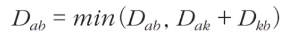
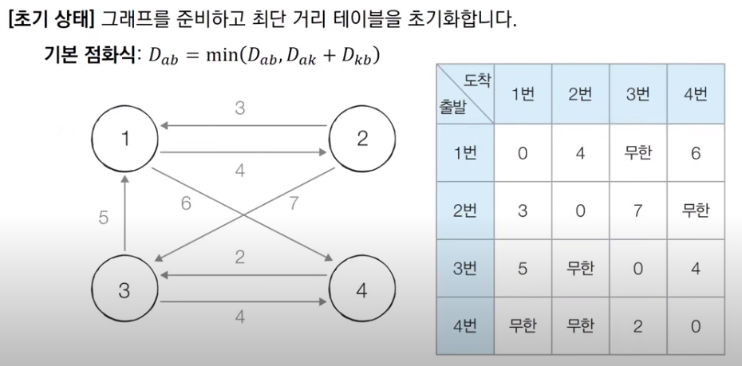
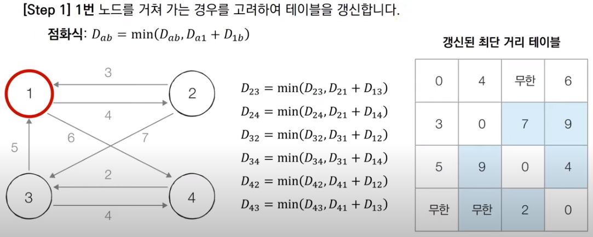
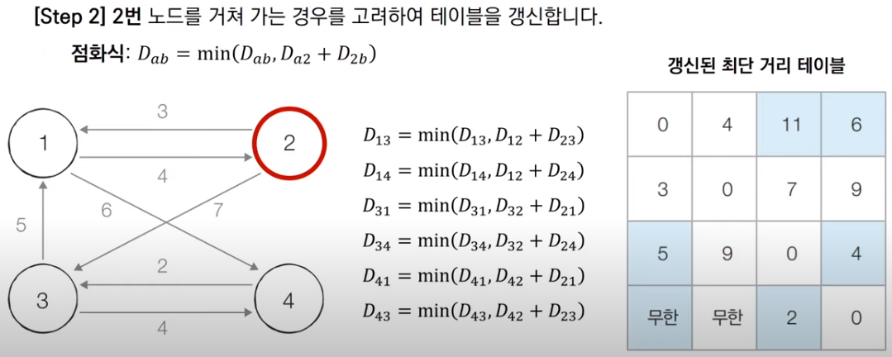
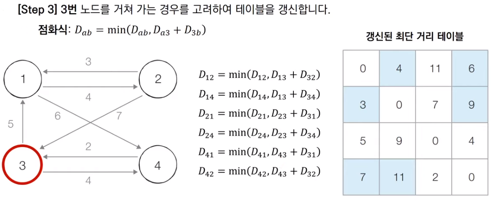
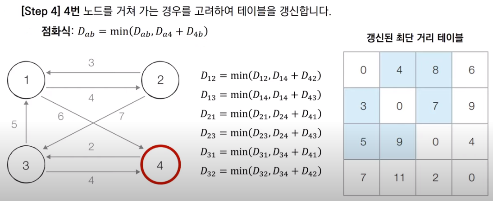

## 플로이드 워셜 알고리즘 (Floyd-Warshall Algorithm)

###  1. 플로이드 워셜 알고리즘 개요

  **플로이드 워셜 알고리즘**(**Floyd-Warshall Algorithm**)은 최단 경로를 구하는 또 하나의 대표적 알고리즘이다. 다만, 다익스트라 알고리즘이 '한 지점에서 다른 특정 지점까지의 최단 경로를 구하는 경우'에 사용한다면, 플로이드 워셜 알고리즘은 **'모든 지점에서 다른 모든 지점까지의 최단 경로를 모두 구하는 경우'에 사용**한다. 

  플로이드 워셜은 다익스트라처럼 단계별로 거쳐가는 노드를 기준으로 알고리즘을 수행하지만 **매 단계마다 방문하지 않은 노드 중에 최단 거리를 갖는 노드를 찾는 과정이 없다.** 그리고 2차원 테이블에 모든 노드의 최단 거리 정보를 저장하며, 이를 **점화식을 통해 갱신**한다는 점에서 다이나믹 프로그래밍 유형에 속한다. **구현하는 것은 다익스트라 알고리즘에 비해 쉽지만, 시간복잡도가 O(N³)이므로 노드와 간선의 개수가 적은 상황에서만 사용할 수 있다.**



  플로이드 워셜 알고리즘의 점화식은 위와 같다. 각 단계마다 특정한 노드 k를 거쳐가는 경우를 확인하여, a에서 b로 가는 최단 거리보다 a에서 k를 거쳐 b로 가는 거리가 더 짧은지 검사한다. 그리고 둘 중 짧은 거리를 최단 거리로 갱신한다.

###  2. 플로이드 워셜 알고리즘 동작 과정



  처음엔 각 노드마다 인접한 노드들과의 거리를 확인하여 최단 거리 테이블에 기록한다. 이 때, 최단 거리 테이블의 행은 출발 노드를, 열을 도착 노드를 의미한다.



  그 이후 이중 반복문을 이용하여 모든 노드들에 대하여 1번 노드를 거쳐가는(k=1) 경우를 고려해 점화식을 수행한다. 1번 노드를 거쳐가는 케이스이므로 출발, 도착 노드가 1번 노드인 행, 열과 자기 자신으로 향하는 오른쪽 아래 방향 대각선 값들은 이번 단계 알고리즘 수행의 영향을 받지 않는다. k = 1인 단계에서 알고리즘을 수행하면 총 6가지 값이 갱신 대상이 되고 실제로 변경되는 값은 D24, D32이다.



  k=2인 단계에서도 k=1인 단계와 마찬가지로 총 6개의 갱신 대상이 존재한다. 이번 단계에서는 실제로 D13만 변경된다.



  k = 3 단계도 위 과정과 동일하며, D41, D42의 값이 실제로 변경된다.



  끝으로 k = 4인 단계도 마찬가지의 과정을 수행하며, D13만 실제로 값이 변경하는 것을 끝으로 알고리즘이 종료된다.

  이러한 알고리즘 수행은 삼중 반복문(k, 행, 열)을 통해 구현이 가능하다.

```python
# input
# 4
# 7
# 1 2 4
# 1 4 6
# 2 1 3
# 2 3 7
# 3 1 5
# 3 4 4
# 4 3 2

# output
# 0 4 8 6
# 3 0 7 9
# 5 9 0 4
# 7 11 2 0

INF = int(1e9)  # 무한을 의미하는 값으로 10억 설정

# 노드 및 간선의 개수 입력 받기
n = int(input())
m = int(input())
# 2차원 리스트(인접 행렬 방식)를 생성하고 무한으로 초기화
graph = [[INF] * (n + 1) for _ in range(n + 1)]

# 자기 자신으로 가는 비용은 0으로 초기화
for i in range(1, n + 1):
    for j in range(1, n + 1):
        if i == j:
            graph[i][j] = 0

# 각 간선에 대한 정보를 입력 받아 테이블을 초기화
for _ in range(m):
    # A에서 B로 가는 비용은 C라고 설정
    a, b, c = map(int, input().split())
    graph[a][b] = c

# 점화식에 따라 플로이드 워셜 알고리즘을 수행
for k in range(1, n + 1):
    for i in range(1, n + 1):
        for j in range(1, n + 1):
            graph[i][j] = min(graph[i][j], graph[i][k] + graph[k][j])

# 수행된 결과를 출력
for i in range(1, n + 1):
    for j in range(1, n + 1):
        # 도달할 수 없는 경우, 무한(INFINITY)으로 출력
        if graph[i][j] == INF:
            print("INFINITY", end=' ')
        # 도달할 수 있는 경우, 거리를 출력
        else:
            print(graph[i][j], end=' ')
    print()
```

  이렇게 구현한 플로이드 워셜 알고리즘은 거쳐가는 노드 k와 테이블 전체를 완전 탐색하는 연산을 고려하여 **O(N³)의 시간 복잡도**를 가진다. 따라서, **보통 최대 500개 이하의 노드**라면 플로이드 워셜 알고리즘 수행이 가능하다고 판단할 수 있다. 500개라 하더라도 500 X 500 X 500은 1억을 넘어가므로 유의할 필요가 있다.

***

_본 포스팅은 '안경잡이 개발자' 나동빈 님의 저서_
_'이것이 코딩테스트다'와 그 유튜브 강의를 공부하고 정리한 내용을 담고 있습니다._