## 신장 트리(Spanning Tree)란?

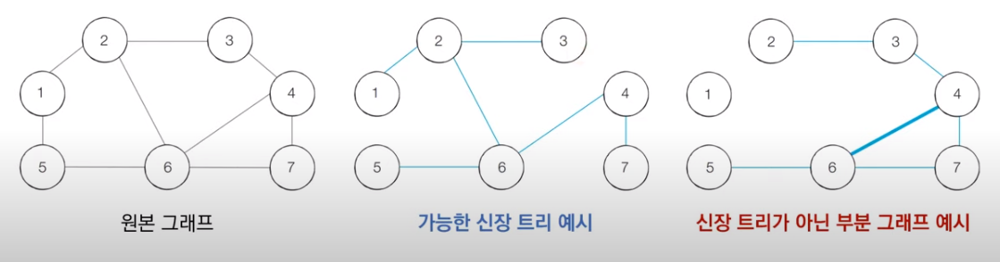

 신장 트리(Spanning Tree)란 **원본 그래프의 모든 노드를 포함하면서 사이클이 존재하지 않는 부분 그래프**를 뜻한다. 위의 가운데 그림처럼 간선들이 모든 노드를 잇고 있지만, 사이클은 생기지 않는 부분 그래프가 신장 트리의 예시가 된다. 반면, 오른쪽 그림처럼 모든 노드를 잇지도 않고 사이클마저 생기는 것은 신장 트리에 해당되지 않는다. 이 개념을 트리라고 부르는 이유는 **모든 노드가 포함되어 서로 연결되면서 사이클이 존재하지 않는다는 조건이 트리의 조건에 해당**하기 때문이다. 이러한 트리의 특성으로 인해, **신장 트리가 가지는 총 간선의 개수**는 **노드의 개수 - 1**이 된다.

## 최소 신장 트리(MST, Minimum Spanning Tree)

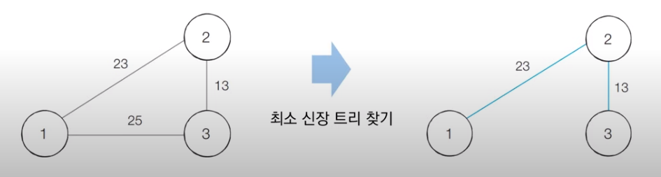

 최소 신장 트리(MST, Minimum Spanning Tree)란 **최소한의 비용으로 구성되는 신장 트리**를 의미한다. 최소 신장 트리의 개념은 여러 문제 상황에서 유용할 수 있는데, 만일 N개의 도시가 있고 두 도시 사이에 도로를 놓아 전체 도시가 서로 연결될 수 있게 하는 경우 최소 신장 트리가 사용된다. 위 그림을 예시로 보면, 3개의 도시가 있는 상황에서 모든 도시를 최소 비용으로 연결하는 방법은 오른쪽 그림과 같다.

## 크루스칼 알고리즘 (Kruskal Algorithm)

 크루스칼 알고리즘(Kruskal Algorithm)은 대표적인 최소 신장 트리 알고리즘들 중 하나이다. 그리디 알고리즘으로 분류되며 동작 과정은 다음과 같다.

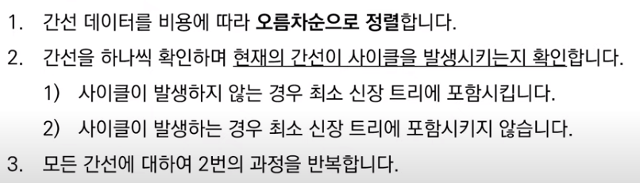

 요약하자면, **모든 간선을 최소 비용 순으로 하나씩 확인하여 사이클을 생성하지 않는 간선들만 최소 신장 트리에 포함시키는 것**이다. 구체적인 예시로 더 살펴보자.

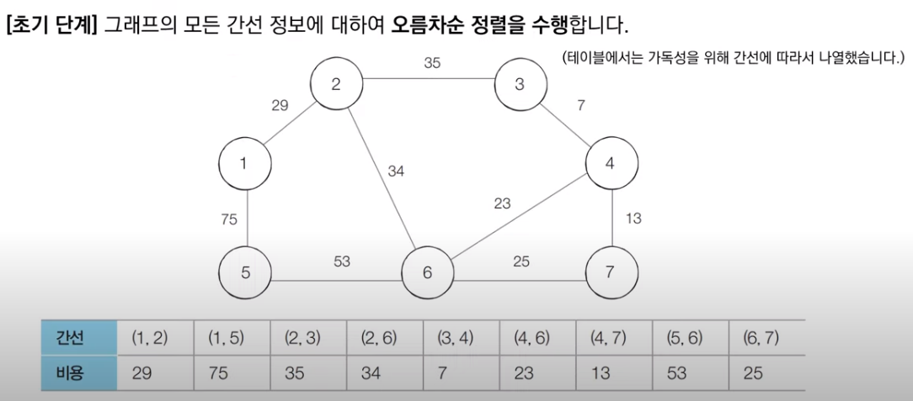

 위와 같이 원본 그래프가 주어졌을 때, 먼저 간선을 오름차순으로 정렬하고 작업을 수행한다. 위 그림의 테이블은 가독성을 위주로 간선 정보가 나열되어 있기 때문에 혼돈하지 않도록 하자.

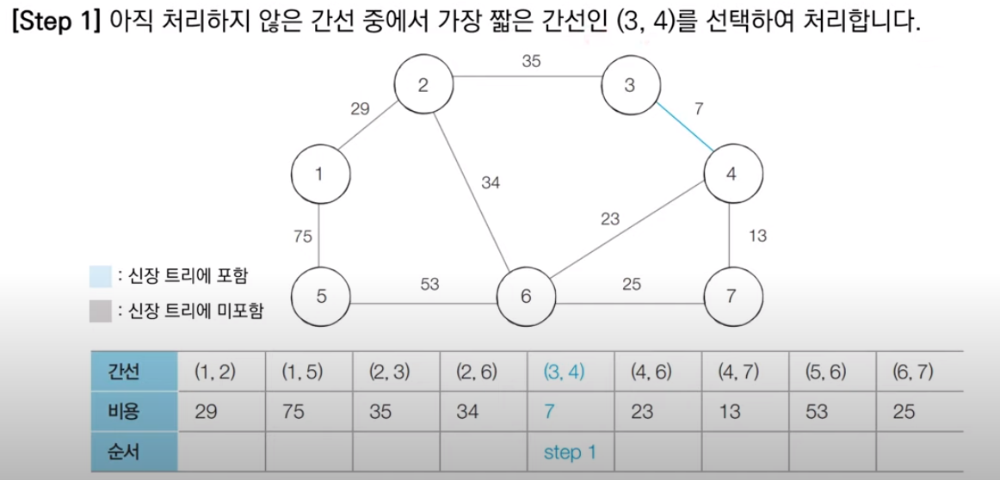

 처음으로 가장 최소인 비용을 가지는 3, 4번 노드를 잇는 간선을 확인한다. 두 노드는 다른 집합에 속해 있어 사이클 생성이 불가능하므로 Union 함수를 호출해 같은 집합으로 만들어 최소 신장 트리에 포함한다.

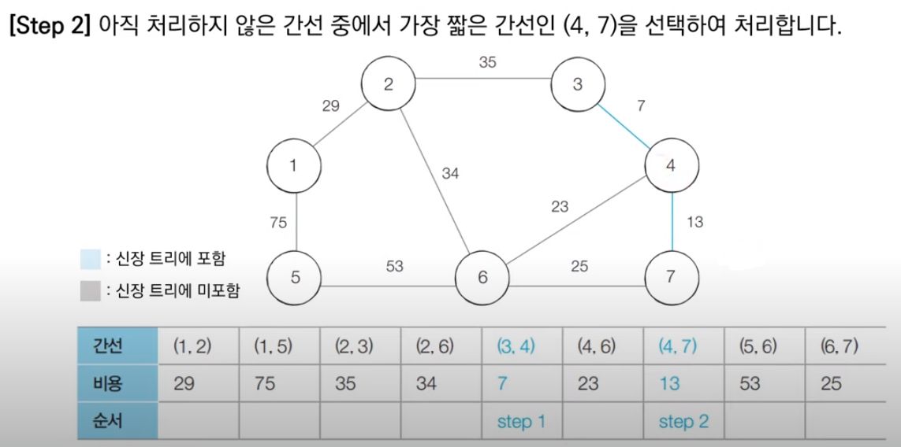

 다음으로 다음 최소 비용에 해당하는 4, 7번 노드를 잇는 간선을 확인한다. 두 노드 역시 다른 집합에 속해 사이클을 생성하지 않으므로, Union 함수로 최소 신장 트리에 포함한다.

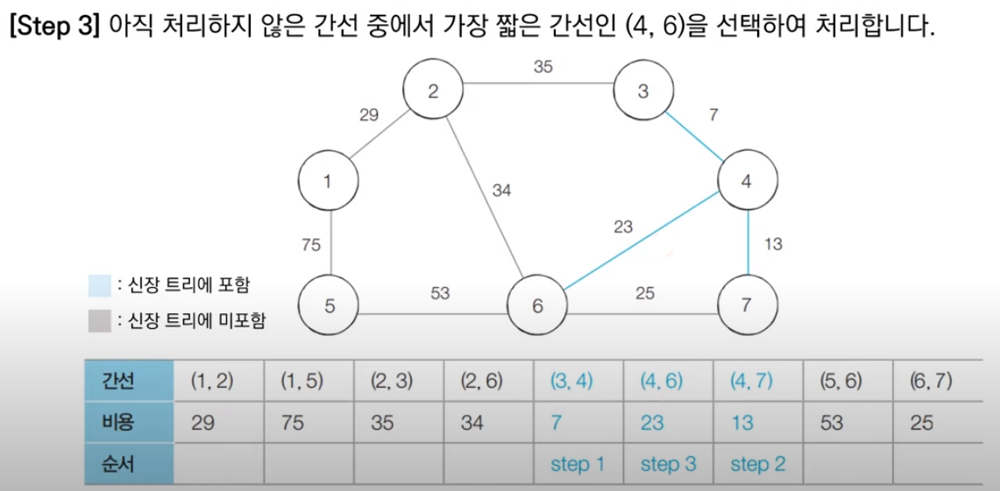

 다음 최소 비용에 해당하는 4, 6번 노드를 잇는 간선도 두 노드가 다른 집합에 속해 있으므로 Union 함수를 호출해 최소 신장 트리에 포함시킨다.

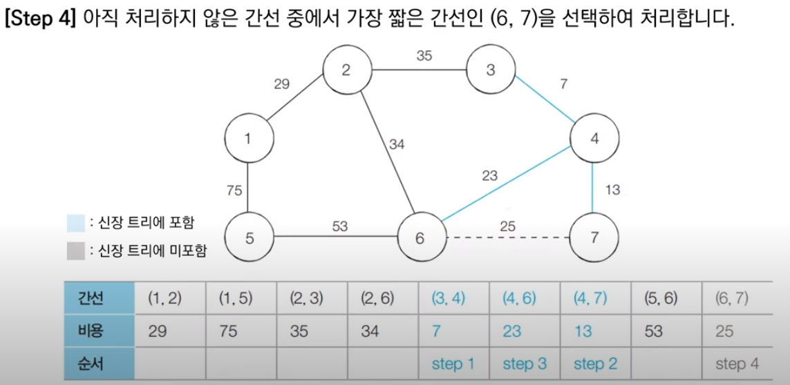

 다음 최소 비용에 해당하는 6, 7번 노드를 잇는 간선을 확인한다. 6번과 7번 노드의 경우 같은 집합에 속해 있기 때문에, 사이클을 발생시킨다. 따라서, 최소 신장 트리에 해당 간선을 포함시키지 않고 무시한다.

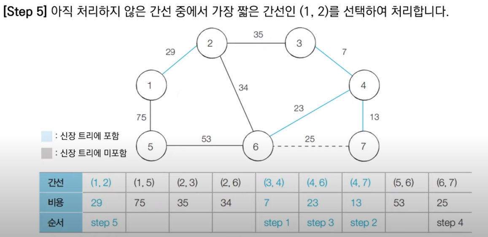

 다음 최소 비용인 1번과 2번 노드를 잇는 간선을 확인한다. 두 노드는 다른 집합에 속하므로 Union 함수를 호출하여 같은 집합으로 합쳐 최소 신장 트리에 포함한다.


 다음 최소 비용에 해당하는 2번 6번 노드를 연결하는 간선도 서로 다른 집합에 속하므로 최소 신장트리에 포함시킨다.

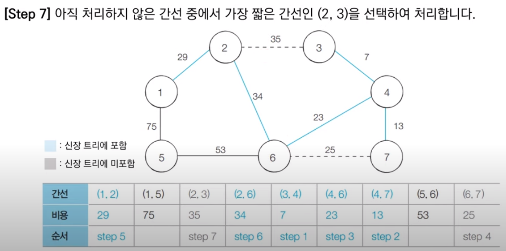

 다음 최소 비용에 해당하는 2번 노드와 3번 노드를 연결하는 간선은 두 노드가 같은 집합에 속하므로 무시한다.


 다음 최소 비용에 해당하는 5번과 6번 노드를 잇는 간선은 두 노드가 서로 다른 집합에 속하므로, Union 함수를 호출하여 최소 신장트리에 포함시킨다.

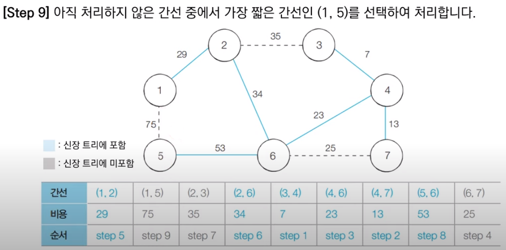

 마지막으로 1번과 5번 노드를 잇는 간선은 두 노드가 서로 같은 집합에 속해 있으므로 무시하도록 한다.

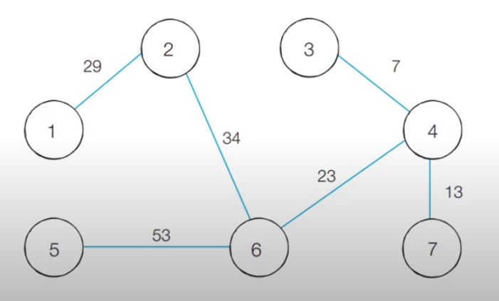

 연산을 모두 수행하면 최종적으로 위와 같은 최소 신장 트리가 나온다. 이 최소 신장 트리의 모든 간선의 비용을 합하면, 해당 값이 최종 비용이 된다.

 위의 과정을 파이썬 코드로 구현하면 다음과 같다.

```python
# input
# 7 9
# 1 2 29
# 1 5 75
# 2 3 35
# 2 6 34
# 3 4 7
# 4 6 23
# 4 7 13
# 5 6 53
# 6 7 25


# 특정 원소가 속한 집합을 찾기 (Find 연산)
def find_parent(parent, x):
    # 루트 노드를 찾을 때까지 재귀 호출
    if parent[x] != x:
        parent[x] = find_parent(parent, parent[x])
    return parent[x]


# 두 원소가 속한 집합을 합치기 (Union 연산)
def union_parent(parent, a, b):
    a = find_parent(parent, a)
    b = find_parent(parent, b)
    if a < b:
        parent[b] = a
    else:
        parent[a] = b


# 노드의 개수와 간선(Union 연산)의 개수 입력 받기
v, e = map(int, input().split())
parent = [0] * (v + 1)  # 부모 테이블 초기화하기

# 모든 간선을 담을 리스트와 최종 비용을 담을 변수
edges = []
result = 0

# 부모 테이블에서, 부모를 자기 자신으로 초기화
for i in range(1, v + 1):
    parent[i] = i

# 모든 간선에 대한 정보를 입력 받기
for _ in range(e):
    a, b, cost = map(int, input().split())
    # 비용순으로 정렬하기 위해서 튜플의 첫 번째 원소를 비용으로 설정
    edges.append((cost, a, b))

# 간선을 비용순으로 정렬
edges.sort()

# 간선을 하나씩 확인하며
for edge in edges:
    cost, a, b = edge
    # 사이클이 발생하지 않는 경우에만 집합에 포함
    if find_parent(parent, a) != find_parent(parent, b):
        union_parent(parent, a, b)
        result += cost

print(result)
```

 크루스칼 알고리즘의 시간 복잡도는 **Elog(E)**이다. 이와 같은 시간복잡도를 가지는 이유는 크루스칼 알고리즘에서 가장 시간이 오래 걸리는 부분이 정렬을 수행하는 작업이며, E개의 간선을 정렬하기 때문이다. 내부에서 이뤄지는 서로소 집합 알고리즘의 시간 복잡도는 정렬 알고리즘의 시간 복잡도보다 작기 때문에 무시한다.

***

_본 포스팅은 '안경잡이 개발자' 나동빈 님의 저서_
_'이것이 코딩테스트다'와 그 유튜브 강의를 공부하고 정리한 내용을 담고 있습니다._