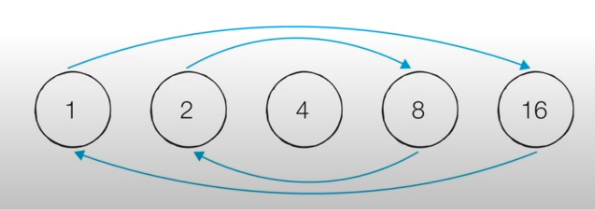
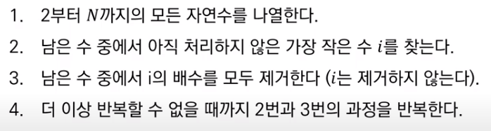
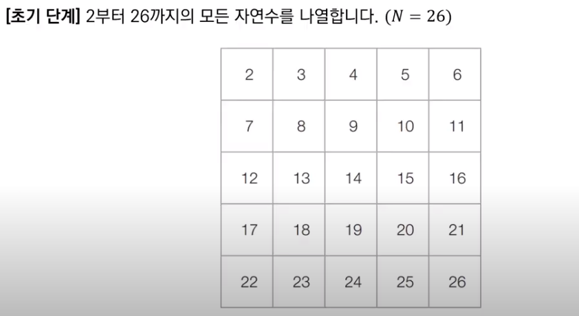
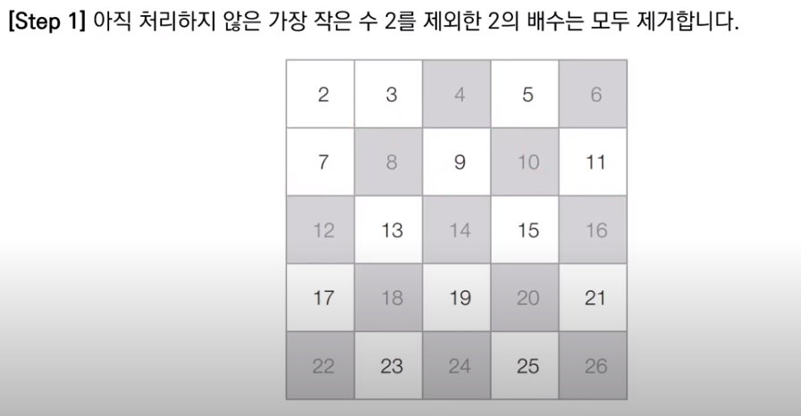
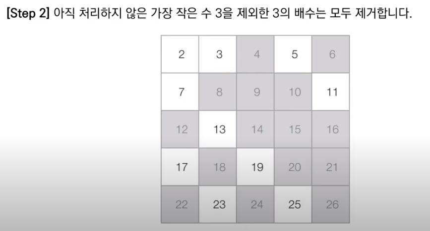
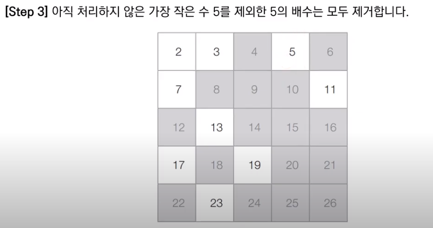
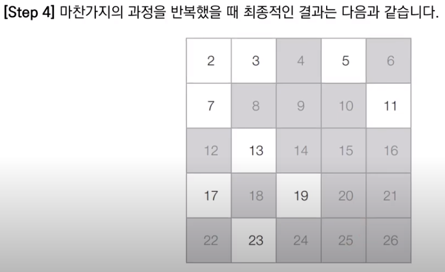

## 소수 (Prime Number) 판별 알고리즘

 소수란 1보다 큰 자연수 중 1과 자기자신을 제외한 자연수로는 나누어떨어지지 않는 자연수를 말한다. 코딩 테스트에서는 어떠한 자연수가 소수인지 아닌지 판별해야 하는 문제가 자주 출제되므로 알고리즘을 기억해두면 좋다.

 다음은 기본적인 소수 판별 알고리즘을 파이썬으로 구현한 것이다.

```python
# 소수 판별 함수 정의 (2이상의 자연수에 대하여)
def is_prime_number(x):
    # 2부터 (x - 1)까지의 모든 수를 확인하며
    for i in range(2, x):
        # x가 해당 수로 나누어떨어진다면
        if x % i == 0:
            return False  # 소수가 아님
    return True  # 소수임


print(is_prime_number(4))
print(is_prime_number(7))
```

 기본적인 소수 판별 알고리즘의 시간 복잡도는 O(N)이다. 2부터 N - 1까지의 모든 자연수에 대하여 차례차례로 연산을 수행하기 때문이다. 다만, 자연수의 범위가 10억과 같이 커진다면 연산 수행에 문제가 생기므로 시간복잡도를 개선할 필요성이 있다.

## 개선된 소수 판별 알고리즘



 약수의 성질에서 시간 복잡도 개선의 단서를 찾을 수 있다. 어떤 한 수에 대한 **모든 약수는 가운데 약수를 기준으로 곱셈 연산에 대해 대칭**을 이룬다. 예를 들어, 16의 약수 1, 2, 4, 8, 16에서 2 X 8 = 16이고 8 X 2 = 16이다. 즉, 특정한 수에 대한 모든 약수를 찾을 때 가운데 약수(제곱근)까지만 확인하면 충분하다. 

 다음 코드는 이를 활용하여 소수 판별 알고리즘을 개선한 형태이다.

```python
# 소수 판별 함수 (2이상의 자연수에 대하여)
def is_prime_number(x):
    # 2부터 x의 제곱근까지의 모든 수를 확인하며
    for i in range(2, int(x ** 0.5) + 1):
        # x가 해당 수로 나누어 떨어진다면
        if x % i == 0:
            return False  # 소수가 아님
    return True  # 소수임


print(is_prime_number(4))
print(is_prime_number(7))
```

 이 경우 특정 수의 제곱근까지만 확인하는 과정이므로, 시간 복잡도는 **O(√N)**이 된다.(루트 N)

## 에라토스테네스의 체 알고리즘

 지금까지 특정 수에 대하여 소수를 판별하는 과정을 살펴보았다. 더 나아가 만일 특정한 수의 범위가 주어지고 그 범위안의 존재하는 모든 소수를 찾아야 한다면 어떻게 해야할까? 이 상황에서는 다수의 자연수에 대하여 소수 여부를 판별하는 대표적 알고리즘인 에라토스테네스의 체를 사용할 수 있다. 에라토스테네스의 체 알고리즘의 동작 과정은 다음과 같다.



  2번 단계에서는 남은 수 중에서 아직 처리하지 않은 가장 작은 소수 i(남은 수가 결국 소수)를 찾고, 3번 단계에서 i를 제외한 그 i의 배수를 모두 제거하는 과정을 반복한다.

 다음은 N=26인 상황일 때의 동작과정이다.











 에라토스테네스의 체 역시 약수의 성질을 적용할 수 있다. 예를 들어, 위 경우는 26의 대략적인 제곱근인 5까지만 확인하면 된다. 6부터는 배수가 5를 넘어갈 수 없고, 이미 앞에서 소수 2, 3, 5의 배수를 제거했기 때문이다. 따라서, √N까지의 자연수만 확인해도 동일한 결과를 얻을 수 있다.

 다음은 에라토스테네스의 체 알고리즘을 파이썬 코드로 구현한 것이다.

```python
n = 1000  # 2부터 1000까지의 모든 수에 대하여 소수 판별
# 처음엔 모든 수를 소수(True)인 것으로 초기화(0, 1은 제외)
array = [True for i in range(n + 1)]

# 에라토스테네스의 체 알고리즘 수행
# 2부터 n의 제곱근까지의 모든 수를 확인하며
for i in range(2, int(n ** 0.5) + 1):
    if array[i] == True:
        # i를 제외한 i의 모든 배수를 지우기
        j = 2
        while i * j <= n:
            array[i * j] = False
            j += 1

# 모든 소수 출력
for i in range(2, n + 1):
    if array[i]:
        print(i, end=' ')
```

 이러한 에라토스테네스의 체 알고리즘의 시간 복잡도는 **O(NloglogN)** 으로 선형시간에 가까울 정도로 매우 빠르므로, 다수의 소수를 찾는 문제에서 효율적이다. 다만, 각 자연수에 대한 소수 여부를 저장해야 하기 때문에 메모리가 많이 필요하다는 단점이 있다. 예를 들어, N이 10억인 경우 문제 해결이 어렵다.

***

_본 포스팅은 '안경잡이 개발자' 나동빈 님의 저서_
_'이것이 코딩테스트다'와 그 유튜브 강의를 공부하고 정리한 내용을 담고 있습니다._