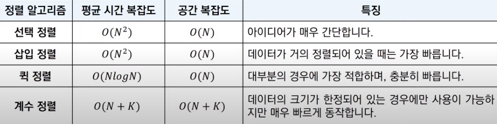

## 정렬(Sorting)이란?

 데이터를 특정한 기준에 따라서 순서대로 나열하는 것을 의미한다.

## 선택 정렬 (Selection Sort)

 데이터가 무작위로 여러 개 있을 때, 가장 작은 데이터를 선택해 앞으로 보내는 과정을 반복하는 정렬이다. 가장 작은 데이터를 선택해 맨 앞에 있는 데이터와 바꾸고, 다음으로 작은 데이터를 골라 앞에서 두 번째 데이터와 바꾸는 과정을 끝까지 반복해 데이터를 정렬한다.

 선택 정렬을 파이썬으로 구현하면 다음과 같다.

```python
# 배열의 원소를 오름차순으로 정렬
array = [7, 5, 9, 0, 3, 1, 6, 2, 4, 8]

for i in range(len(array)):
    min_index = i  # 가장 작은 원소의 인덱스
    for j in range(i+1, len(array)):
        if array[min_index] > array[j]:
            min_index = j
    array[i], array[min_index] = array[min_index], array[i]

print(array)
```

 선택 정렬은 다른 더 빠른 정렬 알고리즘들에 비해 비효율적인 면이 있다. 선택 정렬의 시간 복잡도는 이중 for문을 수행한다는 점에서 직관적으로 O(N²)임을 알 수 있다. 

## 삽입 정렬 (Insertion Sort)

 삽입 정렬은 특정 데이터를 적절한 위치에 삽입하여 정렬하는 알고리즘이다. 이는 특정 데이터의 앞까지 데이터들은 정렬되어 있다고 가정하고, 정렬된 데이터들 사이에서 적절한 위치를 골라 해당 데이터를 삽입하는 방식으로 진행된다.

 삽입 정렬을 파이썬으로 구현하면 다음과 같다.

```python
array = [7, 5, 9, 0, 3, 1, 6, 2, 4, 8]

for i in range(1, len(array)):
    for j in range(i, 0, -1):
        if array[j] < array[j - 1]:  # 한 칸씩 왼쪽으로 이동
            array[j], array[j - 1] = array[j - 1], array[j]
        else:  # 자신보다 작은 데이터를 만나면 그 위치에서 멈춤
            break

print(array)
```

 삽입 정렬은 선택 정렬에 비해 실행 시간의 측면에서 더 효율적인 알고리즘으로 알려져 있고, 특히 데이터가 거의 정렬되어 있을 때 매우 빠르게 동작하는 특징이 있다.

 삽입 정렬의 시간 복잡도는 이중 for문이 사용된 점을 보고 O(N²)임을 알 수 있지만 최선의 경우 O(N)을 가진다. 데이터가 거의 정렬되어 있는 상황이라면, 퀵정렬 알고리즘보다도 빠르게 동작한다.

## 퀵 정렬 (Quick Sort)

 퀵정렬은 일반적으로 가장 많이 사용되는 알고리즘이자 대부분의 프로그래밍 언어 정렬 라이브러리의 근간이 되는 알고리즘이다. 기준 데이터(Pivot, 피벗)를 설정하고 그 기준보다 큰 데이터와 작은 데이터의 위치를 교환한 후, 리스트를 반으로 나누는 방식(분할)을 반복해 정렬을 진행한다. 

 파이썬으로 이를 구현하면 다음과 같다. 여기서 피벗을 정하는 방식은 리스트의 첫 번째 데이터를 피벗으로 정하는 호어 분할(Hoare Partition)을 바탕으로 한다.

```python
array = [5, 7, 9, 0, 3, 1, 6, 2, 4, 8]


def quick_sort(array, start, end):
    if start >= end:  # 원소가 1개면 종료
        return
    pivot = start
    left = start + 1
    right = end
    # 엇갈릴 때까지 반복
    while left <= right:
        # 피벗보다 큰 데이터를 찾을 때까지 반복
        while left <= end and array[left] <= array[pivot]:
            left += 1
        # 피벗보다 작은 데이터를 찾을 때까지 반복
        while right > start and array[right] >= array[pivot]:
            right -= 1
        if left > right:  # 엇갈렸다면 작은 데이터와 피벗을 교체
            array[right], array[pivot] = array[pivot], array[right]
        else:  # 엇갈리지 않았다면 작은 데이터와 큰 데이터를 교체
            array[left], array[right] = array[right], array[left]
    # 분할 이후 왼쪽 부분과 오른쪽 부분에서 각각 정렬 수행
    quick_sort(array, start, right - 1)
    quick_sort(array, right + 1, end)


quick_sort(array, 0, len(array) - 1)
print(array)
```

 퀵정렬의 평균 시간 복잡도는 O(NlogN)이다. 데이터를 절반씩 분할하며 진행한다고 가정하면, 기하급수적으로 분할 횟수가 감소함을 알 수 있다. 퀵정렬은 데이터가 무작위로 입력되는 경우 빠르게 동작할 가능성이 높지만, 이미 데이터가 정렬되어 있는 경우에는 최악의 경우 O(N²)의 시간 복잡도를 가지며 느리게 동작한다. 하지만, 대부분의 정렬 라이브러리는 피벗값 설정 로직을 추가해 최악의 경우에도 O(NlogN)의 시간 복잡도를 보장하므로 크게 신경쓰지 않아도 된다.

## 계수 정렬 (Count Sort)

 계수 정렬 알고리즘은 특정 조건(모든 데이터가 0을 포함한 양의 정수로 표현될 수 있어야 함)에 부합해야 한다는 제약이 있지만, 조건이 갖춰지면 매우 빠르게 동작하는 정렬 알고리즘이다. 데이터의 모든 범위를 담을 수 있는 크기의 리스트를 선언해, 데이터를 직접 세어 리스트에 기록한 후 정렬한다. 그러므로 가장 큰 데이터와 가장 작은 데이터의 차이가 작을 때(1,000,000을 넘지 않을 때) 효과적으로 사용할 수 있다.

```python
# 모든 원소 값은 0보다 크거나 같음
array = [7, 5, 9, 0, 3, 1, 6, 2, 9, 1, 4, 8, 0, 5, 2]
# 모든 원소 값이 0으로 초기화 된 모든 범위를 포함하는 리스트 생성
count = [0] * (max(array) + 1)

for i in range(len(array)):
    count[array[i]] += 1  # 각 데이터에 해당하는 인덱스의 값 증가

# 리스트의 정보를 확인하여 그 값만큼 출력 반복
for i in range(len(count)):
    for j in range(count[i]):
        print(i, end=' ')
```

 모든 데이터가 양의 정수(0을 포함한)로 표현될 수 있다면, 데이터의 개수가 N, 데이터 중 최댓값이 K일 때, 최악의 경우에도 O(N + K)의 시간 복잡도를 보장한다. 공간 복잡도 역시 O(N + K)이다. 또한, 데이터의 크기가 한정되어 있고 많이 중복되어 있을수록 유리하다.

## 정렬 알고리즘 비교



***

_본 포스팅은 '안경잡이 개발자' 나동빈 님의 저서_
_'이것이 코딩테스트다'와 그 유튜브 강의를 공부하고 정리한 내용을 담고 있습니다._