## 투 포인터 (Two Pointers) 알고리즘

 투 포인터(Two Pointers) 알고리즘은 **리스트에 순차적으로 접근해야 하는 경우에, 두 개의 점의 위치를 기록하면서 처리**하는 방식을 말한다. 시작점과 끝점을 사용해 순차적으로 접근할 데이터의 범위를 표현할 수 있다.

 투 포인터를 활용하면 유용한 다음 문제를 살펴보자.

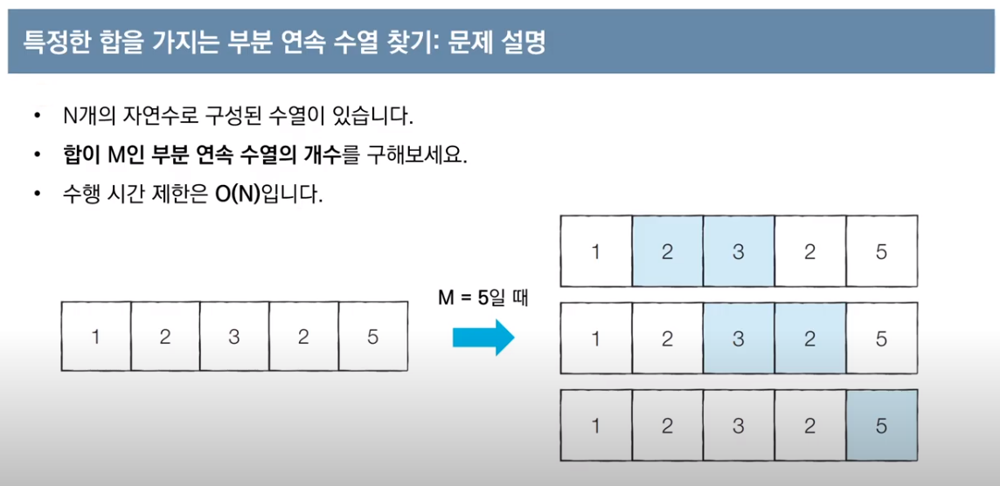

 위 문제는 전체 수열이 주어지면, 그 수열의 부분 수열 중 특정한 합을 가지는 연속하는 부분 수열을 찾는 문제이다. 이 문제를 해결하는 가장 심플한 방법은 완전탐색으로 각 인덱스마다 해당 인덱스로 시작하는 부분 연속 수열을 모두 찾아보는 방법이다. 다만, 이 완전탐색은 시간 복잡도가 O(N²)이 걸리므로 비효율적이다.

 이 때, 투 포인터 알고리즘을 활용하면 선형 시간 복잡도 O(N)으로 이 문제를 처리할 수 있다. 알고리즘의 과정은 다음과 같다.

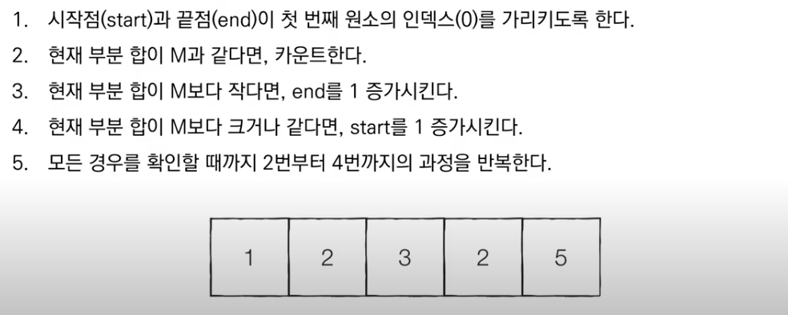

 진행 과정을 구체적으로 살펴보자.

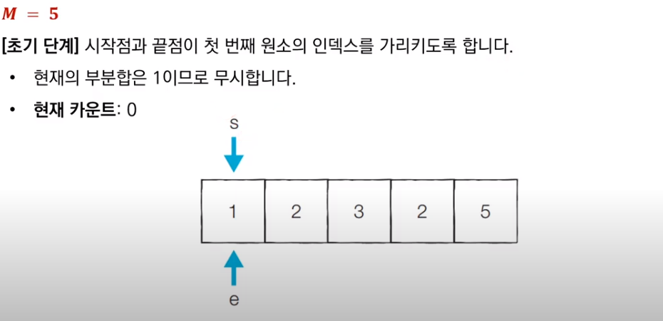

 가장 먼저 시작점과 끝점이 첫 번째 원소의 인덱스를 가리키도록 초기화한다. 또한, 문제에서 원하는 부분합 M은 5이다. 현재 부분합은 1이고 M보다 작으므로 무시한다.

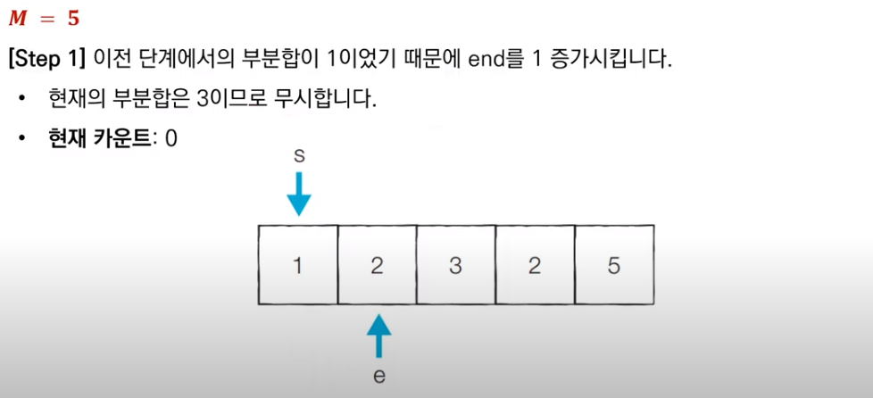

 이전 부분합이 M보다 작았기 때문에, end를 1 증가시키고 새로운 부분합을 구한다. 구해진 부분합은 3이므로 무시한다.

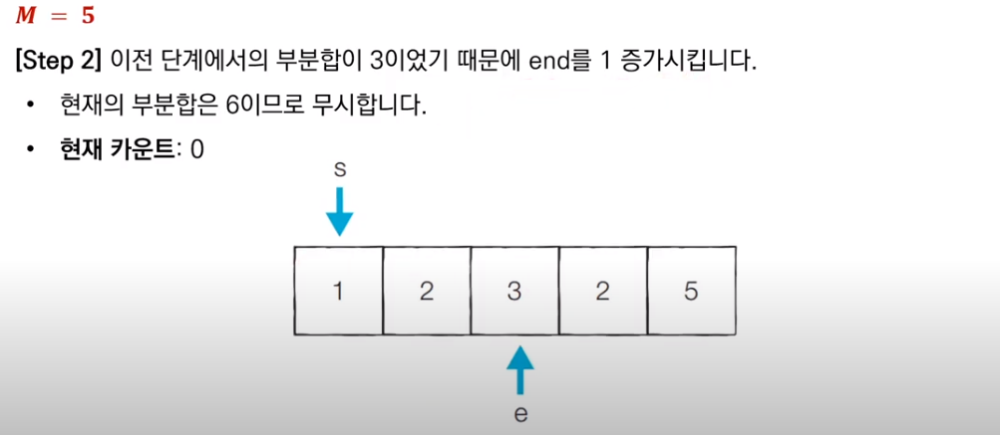

 이전 부분합이 역시 M보다 작았으므로, end를 1 증가시키고 새로운 부분합을 구한다. 현재 부분합은 6이므로 무시한다.

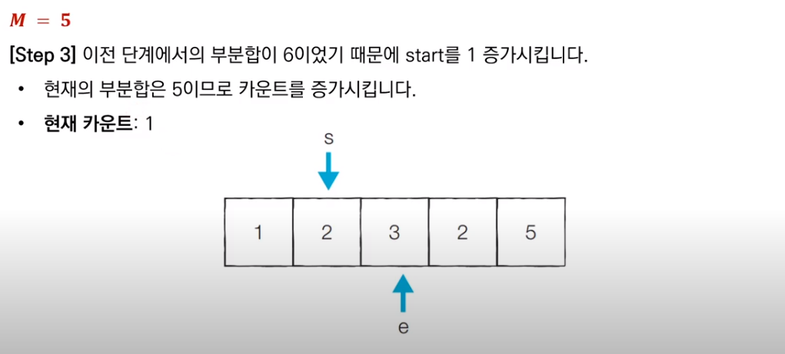

 이전 부분합이 M보다 컸으므로, start를 1 증가시키고 새로운 부분합을 구한다. 현재 부분합은 5이므로 카운트를 센다.

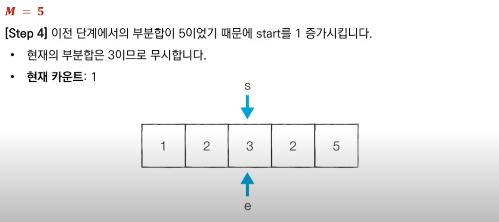

 이전 부분합이 M과 같았으므로, start를 1 증가시키고 새로운 부분합을 구한다. 현재 부분합은 3이므로 무시한다.

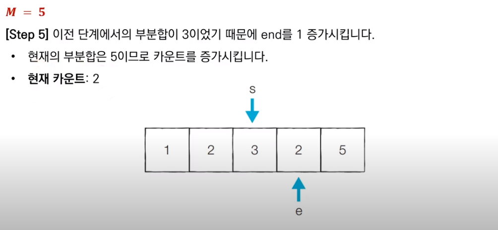

 이전 부분합이 M보다 작았으므로, end를 1 증가시키고 새로운 부분합을 구한다. 현재 부분합은 5이므로 카운트를 센다.

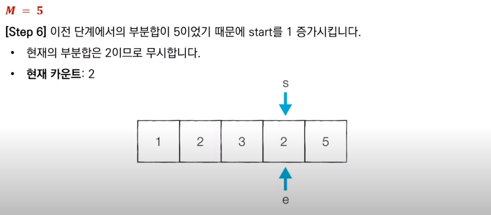

 이전 부분합이 M과 같았으므로, start를 1 증가시키고 새로운 부분합을 구한다. 현재 부분합은 2이므로 무시한다.

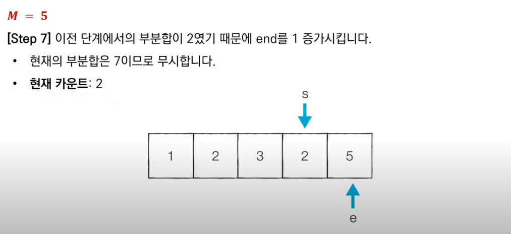

 이전 부분합이 M보다 작았으므로, end를 1 증가시키고 새로운 부분합을 구한다. 현재 부분합은 7이므로 무시한다.

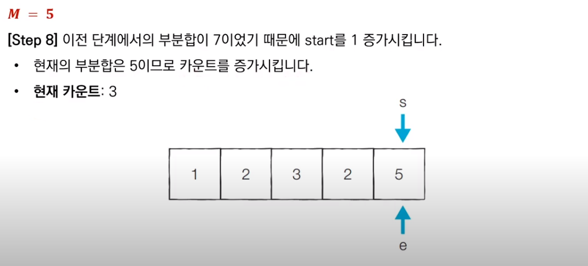

 이전 부분합이 M보다 컸으므로, start를 1 증가시키고 새로운 부분합을 구한다. 현재 부분합은 5이므로 카운트를 센다. 그리고 알고리즘은 마무리된다.

 이러한 투 포인터 알고리즘을 파이썬으로 구현한 코드는 다음과 같다.

```python
n = 5  # 데이터의 개수 N
m = 5  # 찾고자 하는 부분합 M
data = [1, 2, 3, 2, 5]  # 전체 수열

count = 0
interval_sum = 0
end = 0

# start를 차례대로 증가시키며 반복
for start in range(n):
    # end를 가능한 만큼 이동시키기
    while interval_sum < m and end < n:
        interval_sum += data[end]
        end += 1
    # 부분합이 m일 때 카운트 증가
    if interval_sum == m:
        count += 1
    interval_sum -= data[start]

print(count)
```

***

_본 포스팅은 '안경잡이 개발자' 나동빈 님의 저서_
_'이것이 코딩테스트다'와 그 유튜브 강의를 공부하고 정리한 내용을 담고 있습니다._