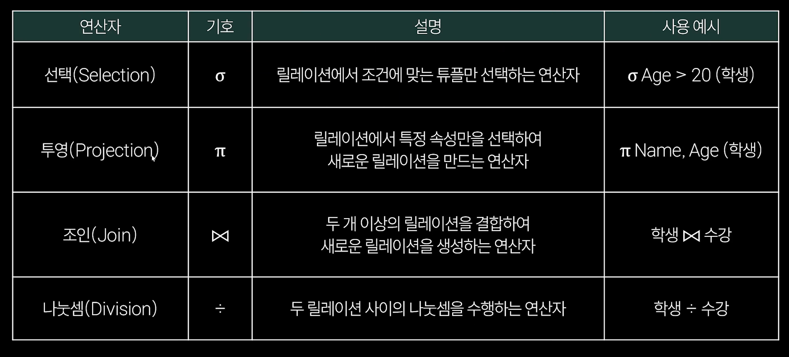

## 이론 준비 체크리스트
- 필수 - 모르면 시험 들어가면 안됨
	1. 테스트 종류와 방식 (블랙/화이트)
	2. 라우팅 프로토콜
	3. 데이터베이스 이론 중 약술형 나올만한 것 (로킹, 상호배제 조건 등)
	4. 결합도/응집도
	5. 테스트 스텁, 드라이버
- 나머지
	- 보안용어와 암호화 기법, OSI 7계층

## 운영체제
- **메모리 관리**
	- **배치 전략**: 프로세스를 통으로 메모리에 넣음
		- 최초 적합(First-fit): 가장 앞부분부터 탐색하다가 처음 만난 곳에 넣음
		- 최적 적합(Best-fit): 최대한 낭비 없이 넣음 (남는 공간이 가장 적은 공간에 할당)
		- 최악 적합(Worst-fit): 제일 낭비되는 곳에 넣음 (가장 큰 공간에 할당)
	- **가상 메모리 관리** (**페이징 기법**): 프로세스를 페이지로 나누어 가상 메모리로 올리고 교체
		- 페이징 교체 알고리즘
			- OPT(Optimal): 향후에 가장 안쓰는 것을 빼기(미래를 알고있다 가정)
			- FIFO(First-in First-out): 가장 먼저 온 것을 먼저 빼기
			- LRU(Least Recently Used): 사용한지 가장 오래된 것 빼기
			- LFU(Least Frequently Used): 참조 횟수가 가장 적은 페이지 교체 (참조횟수 같을 때는 가장 오래된것 빼는걸 기본으로 하자)
			- MFU(Most Frequently Used): 참조 횟수가 가장 많은 페이지 교체 (참조횟수 같을 때는 가장 오래된것 빼는걸 기본으로 하자)
			- NUR(Not Used Recently): 최근에 사용되지 않은 페이지 교체
- **CPU 스케줄링 알고리즘**: 여러 프로세스를 CPU가 수행할 수 있게 연산 시간을 분배하는 것
	- **선점형**: 프로세스가 CPU 사용 중일 때, 더 높은 우선순위의 프로세스가 CPU 연산 빼앗아갈 수 있음
		- 라운드로빈(Round-Robin): 모든 프로세스에 공평하게 시간 할당, 할당시간 실행 후 가장 뒤로 세움
		- SRT(Shortest Remaining Time First): 남은 시간이 가장 적은 프로세스를 우선 순위로 연산, 실행 중에 남은 시간이 더 적은 프로세스가 들어오면 그 프로세스를 먼저 해결
	- **비선점형**: 한 프로세스가 CPU를 차지하면, 끝날 때까지 다른 프로세스가 점유 불가
		- FCFS(First come, First Served): 먼저 온 프로세스 순으로 처리 (선착순)
		- SJF(Shortest Job First): 실행 시간이 가장 짧은 프로세스를 먼저 처리
		- 우선순위(Priority): 프로세스가 가지고 있는 우선순위 별로 먼저 처리
- 운영체제 목적
	- 처리능력(Throughput) 향상
	- 반환시간 단축
	- 사용 가능도 향상
	- 신뢰도 향상
- 페이지 VS 프레임
	- 페이지: 프로세스를 자른 것
	- 프레임: 물리 메모리를 자른 것
- 페이지 폴트(page fault): 프로그램이 참조하려는 페이지가 현재 메모리에 없는 상황
- 스레싱(Thrashing): 프로세스  처리 시간보다 페이지 교체 시간이 더 많아지는 현상 
	- e.g. 프로세스 처리시간 1초, 페이지 교체 시간 2초
- 프로세스 상태 종류: 생성, 준비, 실행, 대기, 완료, 끝
- 교착상태: 여러 개의 프로세스가 특정 자원 할당을 계속 대기하면서 서로 소비 못하는 상황
	- 조건: 상호배제, 점유와 대기, 비선점, 환형대기
	- 해결방법: 예방, 회피, 발견, 복구
- 뮤텍스: 하나의 프로세스가 공유자원에 접근하는 동안, 다른 프로세스가 해당 자원에 접근 못하게 막는 도구 (락을 걸어줌)
- 세마포어: 운영체제에서 여러 프로세스가 공유 자원을 사용할 때 문제를 해결하는 동기화 도구 (보통 정수값으로 관리)

## 데이터 입출력 구현
- 데이터 모델링 순서
	- 데이터베이스 계획 -> 요구사항 분석  
	- -> **개념적** 데이터 모델링: 개체타입, 속성 등 명시해서 현실 세계 반영
	- -> **논리적** 데이터 모델링: 개념적 구조를 정규화하고 규칙과 관계 완성 (엔터티, 속성, 관계 구조적 정의)
	- -> **물리적** 데이터 모델링: 레코드 양식 순서, 경로 인덱싱, 클러스터링, 해싱
- 이상(Anomaly): DB 조작 시 비정상적으로 동작하는 현상 (삽입 이상, 갱신 이상, 삭제 이상)
- **정규화**
	- 제1 정규형 (1NF): 모든 속성이 원자값
	- 제2 정규형 (2NF): 복합키일 때, 부분 함수 종속성 없어야 함
	- 제3 정규형 (3NF): 이행 함수 종속성 없어야 함
	- 보이스-코드 정규형 (BCNF): 모든 결정자가 후보키 되도록 해, 모든 함수적 종속성이 후보키에 의해 결정
	- 제4 정규형 (4NF): 다치 종속성 없어야 함 (다치종속: 1개 속성에 여러 속성이 매핑)
	- 제5 정규형 (5NF): 조인 종속성이 없어야 함 (조인종속: 여러 테이블 조합했을 때, 현재 결과 구성 가능)
- 샤딩: 대규모 데이터베이스 시스템에서 여러 개 독립적인 부분으로 분할하여 성능을 향상시키는 기술
- 인덱스: 추가적인 저장 공간을 활용해, 테이블의 검색 속도를 향상시키기 위한 자료구조
- 시스템 카탈로그: 데이터베이스에 저장되어 있는 데이터 개체들에 대한 정보가 수록되어 있는 시스템
- 분산 데이터베이스의 목표: 위치 투명성, 중복 투명성, 병행 투명성, 장애 투명성
- 데이터베이스 회복기법: 즉시갱신, 지연갱신, 검사시점, 그림자 페이징, 미디어 회복기법

## 서버 프로그램/인터페이스 구현
- 서버의 종류: 웹 서버, 웹 애플리케이션 서버, 데이터베이스 서버, 파일 서버
	- 웹 서버: 정적 컨텐츠 처리, HTTP 요청 및 응답 처리
	- 웹 애플리케이션 서버(WAS): 동적 컨텐츠, DB 연결 처리
- **응집도와 결합도** (매우 중요)
	- 응집도 (강할수록 좋음) - 모듈 내부 코드들 간
		- **기순교절시논우** (강한순서대로)
	- 결합도 (강할수록 안좋음) - 모듈 간
		- **내공외제스자** (강한순서대로)
- 공통 모듈 구현 절차
	- DTO/VO -> SQL -> DAO -> Service -> Controller -> View
- 매우 큰 소프트웨어의 분석
	- FAN-IN: 특정 모듈이 호출하는 모듈 (내가 부르는 것, 기준 모듈의 하위 모듈)
	- FAN-OUT: 특정 모듈을 호출하는 모듈 (나를 부르는 것, 기준 모듈의 상위 모듈)
- 미들웨어: 서로 다른 소프트웨어 사이를 연결하는 중간다리 소프트웨어 
	- e.g. JDBC, RabbitMQ, Apache Tomcat
- 인터페이스 설계: 데이터 주고 받을 때 노드 구성 방법
	- EAI(Enterprise Application Integration) - 큰 규모 회사
		- Point-to-Point
		- Hub-and-Spoke
		- Message Bus
		- Hybrid
	- ESB(Enterprise Service Bus)
		- 서비스 지향 아키텍처(SOA)를 지원하는 기업 애플리케이션 통합을 위한 아키텍처 패턴
		- EAI 보완

## 화면설계/애플리케이션 테스트
- UI 유형: CLI, GUI, NUI(Natural, 말이나 행동), OUI (Organic, 모든 사물)
- UI 설계원칙: 직관성, 유효성, 학습성, 유연성
- UML 다이어그램 종류
	- 구조적 다이어그램 (대표: 클래스 다이어그램, 객체 다이어그램)
	- 행위적 다이어그램 (대표: 유스케이스 다이어그램, 순차 다이어그램, 상태 다이어그램)
- 애플리케이션 테스트
	- 정적 테스트
	- **동적 테스트** (중요)
		- **화이트 박스 테스트**: 코드를 오픈한 상태에서 논리적인 모든 경로 테스트
			- 기초 경로 검사(Base Path Test): 모든 독립적인 실행 경로를 테스트하는 방법
			- 제어 구조 검사: 조건 검사, 루프 검사, 데이터 흐름 검사
		- **블랙 박스 테스트**: 사용자 요구사항 명세서 보면서 동작 원리는 모르고 기능 작동해보며 테스트
			- 동등 분할 검사 (Equivalence Partitioning)
				- 입력 데이터를 유사한 특성을 가진 그룹으로 나누고, 각 그룹에서 대표값 선택해 테스트
			- 경계값 분석 (Boundary Value Analysis)
				- 입력 값의 경계 영역을 집중적으로 테스트
			- 결정 테이블 테스트 (Decision Table Testing)
				- 도표, 테이블을 만들어 입력에 따라 상태 변화 체크
			- 상태 전이 테스트 (State Transition Testing)
				- 입력에 따라 상태가 어떻게 변하는지 테스트
			- 유스 케이스 테스트 (Use Case Testing)
				- 사용자의 특정 행위 (유스 케이스) 따른 시스템 동작 테스트
			- 오류 추정 (Error Guessing)
				- 테스터의 경험과 직관을 바탕으로 오류 추정 및 테스트
- 테스트 평가 지표
	- 구문 커버리지: 프로그램의 모든 구문이 한 번씩 실행될 수 있게 테스트 데이터 선정
	- 결정 커버리지: 전체 결정문(조건문)을 테스트 하는 방법
	- 조건 커버리지: 조건문 내에 참, 거짓을 적어도 한 번씩 결과가 나오도록 수행
	- 조건/결정 커버리지: 전체 조건식과 개별 조건식이 참/거짓 한 번씩 나오게 (모든 결과 테스트)
	- 변경조건/결정 커버리지: 각 개별 조건식이 독립적으로 영향주도록 테스트
	- 다중조건/결정 커버리지: 모든 개별 조건식 모든 조합 다 커버리지
- 애플리케이션 테스트 기본원리
	- 파레토 법칙: 애플리케이션의 20% 코드에서 전체 80% 결함이 발견됨
	- 살충제 패러독스: 동일한 테스트 케이스 반복은 더이상 다른 결함 발견 못함
	- 오류-부재의 궤변: 오류와 결함이 없더라도 요구사항을 만족하지 않으면 소프트웨어 품질은 낮은 것
	- 완벽한 테스트 불가능: 테스트는 결함을 완전히 없애는 것이 아니라, 결함을 발견하는데 의의가 있음
- 테스트 하네스: 테스트 환경의 일부분으로 테스트를 지원하기 위해 생성된 코드나 데이터
	- **테스트 드라이버**
		- 테스트 대상 모듈을 호출하는 더미 프로그램 (상향식 테스트 시, 임시로 만든 상위 모듈)
	- **테스트 스텁**
		- 테스트 대상 모듈이 호출하는 프로그램 (하향식 테스트 시, 임시로 만든 하위 모듈)

## 관계대수
- 관계대수는 수학적 이론이고 이것을 구현해낸 것이 현재 컴퓨터과학의 데이터베이스 (RDBMS, SQL)
- 주로 나올 SQL
	- SELECT, UPDATE, DELETE, INSERT INTO
	- CREATE, ALTER, DROP
	- CREATE INDEX, DROP INDEX
- 관계 대수 기호
	
	- 프로젝션은 중복값을 제거하고 릴레이션 만듦
	- 합집합도 중복값 제거하고 릴레이션 만듦
		- 합집합: SQL의 UNION
		- 교집합: SQL의 INTERSECT
- 제약조건 키워드
	- PRIMARY KEY, FOREIGN KEY(+REFERENCES)
	- UNIQUE, NOT NULL, DEFAULT, CHECK, AUTOINCREMENT
	- ON DELETE CASCADE, ON UPDATE CASCADE
- DCL
	- GRANT 권한 ON 테이블 TO 유저
	- REVOKE 권한 ON 테이블 FROM 유저
- 조인
	- 세타조인
		- 조인에 참여하는 두 릴레이션의 속성 값을 비교하고, 조건을 만족하는 튜플만 반환
		- 조건의 종류: =, ≠, ≤, ≥, ＜, ＞
	- 동등조인
		- 세타조인에서 = (는) 연산자를 사용한 조인 
		- 가장 일반적으로 통용되는 "조인연산"
	- 자연조인
		- 동등 조인에서 조인에 참여한 속성이 두 번 나오지 않도록, 두 번째 속성을 제거한 결과를 반환
		- 즉, 중복된 속성을 제거
	- 세미조인
		- 자연조인을 한 후에, 두 릴레이션 중에 한쪽 릴레이션의 결과만 반환
		- 왼쪽과 오른쪽 중에 제거할 속성 쪽을 열어두는 형식으로 기호 작성

## 프로그래밍 코드 영역 외울 것
- 아스키 코드
	- A - 65
	- a- 97
	- 문자 “0” - 48
- 완전수 (1~100 사이)
	- 6, 28
- 문자열 상수풀
	- 리터럴을 사용했을 때는 상수풀에 넣고 재사용 (같은 리터럴은 같은 참조객체를 쓴다)
	- new String()은 참조값이 다른 아얘 새로운 객체 생성, 힙 영역에 저장
- Integer 캐싱 (Double 같은 자료형은 캐싱이 없음)
	- 자바는 -128~127 범위안에 정수는 캐싱해 재사용 (참조값 동일) e.g. Integer num = 100
	- 만일, int와 Integer를 == 비교하면, 언박싱으로 인해 true 나옴
	- new Integer(100)은 역시 참조값이 아얘 다른 새로운 객체 생성, 힙 영역 저장
	- (Boolean 등등…도 new 하면 참조값 아얘 다른 새로운 객체)
- 비트 연산자 종류
	- `&`(and), `|`(or), `^`(xor), `~`(not)
- 비트연산 XOR 
	- XOR은 비트가 서로 다르면 1, 같으면 0
	- 같은 XOR 연산을 3번하면 두 변수 값이 SWAP됨
	- e.g. a = a ^ b; b = a ^ b; a = a ^ b
- 비트연산 ~
	- 양수에 not을 취하는 경우 결과값: -(해당 양수 + 1)

***
## Reference
[(2024) 일주일만에 합격하는 정보처리기사 실기](https://www.inflearn.com/course/%EC%9D%BC%EC%A3%BC%EC%9D%BC%EB%A7%8C%EC%97%90-%ED%95%A9%EA%B2%A9%ED%95%98%EB%8A%94-%EC%A0%95%EB%B3%B4%EC%B2%98%EB%A6%AC%EA%B8%B0%EC%82%AC-%EC%8B%A4%EA%B8%B0)