# 기본 이론

## 서버 운영
- 서버
	- 하드웨어에서 실행 중인 소프트웨어 (문맥에 따라 하드웨어 지칭할 수도 있음)
	- 어떤 소프트웨어가 실행 중인지에 따라 다양한 서버로 분류
		- e.g. 파일 서버 (파일 업로드/다운로드), DB 서버, 웹서버, 웹애플리케이션서버
	- 엔터프라이즈 환경에서는 아주 많은 양의 서버를 운영해야 함
	- 서버 운영 방법
		- 베어메탈(Baremetal)- 비효율적
			- 서버를 하나 구입하고 OS 설치 후 여러 개의 소프트웨어 실행
			- 단점
				- 하나의 소프트웨어에 문제가 생기면 다른 소프트웨어에게 영향을 미침 (에러, 사용량 급증)
		- 하이퍼바이저(Hypervisor) - 전통적 가상화 기술
		- 컨테이너(Container) - 최신 가상화 기술
- **큰 서버**를 **효율적으로 나눠서 사용**하기 위해 **가상화 기술**이 필요

## 가상화 기술
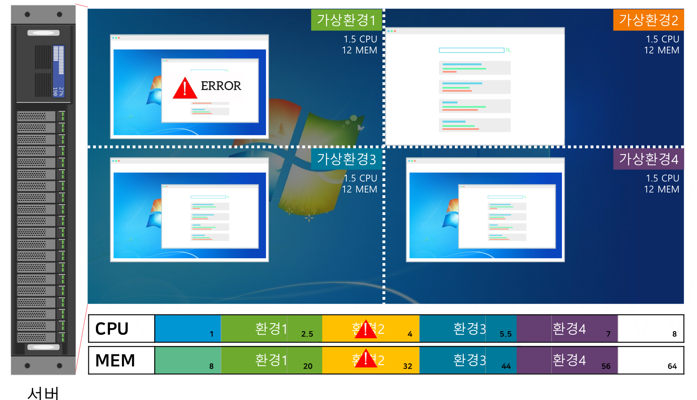
- **물리적 컴퓨팅 환경 내부**에서 **논리적 컴퓨팅 환경**을 만들 수 있는 기술
- 실제로 존재하는 컴퓨터가 아니지만, **마치 존재하는 것처럼** 만듦
	- e.g. 하나의 OS안에서 4개의 추가 OS 만듦
		- 8 Core/64 GB RAM -> OS(1 Core/8GB RAM) + 프로그램(1 Core/8GB RAM) X 4
- 장점
	- 마치 여러 대의 컴퓨터를 사용하는 것처럼, **안전하게 소프트웨어 운영 가능**
		- 가상 컴퓨터에는 사용자가 직접 리소스를 분배할 수 있음 (리소스 최대값 지정)
		- OS가 많아져 총 리소스 사용량은 증가하겠지만, 논리적으로 격리되어 한 프로그램의 문제가 다른 프로그램에 영향을 미치지 않음
	- **물리적 컴퓨터 한 대**만 사용할 수 있어 **경제적**
		- 기업 입장에서는 낮은 사양 컴퓨터 여러대보다 높은 사양의 컴퓨터 한 대가 효율적

## 하이퍼바이저 가상화 (전통적 가상화 기술)
- **가상 환경 운영 프로그램**을 **설치**해 관리하는 방식 
	- e.g. VMWare, VirtualBox, Red Hat의 하이퍼바이저 제품
- 과정
	- **호스트 OS**(물리, 기본 OS)에 하이퍼바이저를 설치
	- 격리된 환경으로 **게스트 OS**(논리, **가상머신**) 실행하고 프로세스 운영
- 게스트 OS 커널의 **시스템 콜**을 호스트 OS 커널에게 전달할 때 **중간에서 번역**
	- 시스템 콜: 커널에 하드웨어 자원을 요청하기 위한 표준
	- 서버가 한 대라서 게스트 OS가 물리적 자원을 쓰려면 호스트 OS를 거쳐야만 함
	- 각 OS 커널의 언어가 다르므로 번역 필요
- **핵심** 특징
	- 각각의 **게스트 OS**가 **독립적인 커널**을 가질 수 있음
- 장점
	- 커널을 독립적으로 가지고 있어 보안면에서는 더 나을 수도 있음
- 단점: 무겁고 느림
	- 하나의 게스트 OS가 차지하는 오버헤드가 큼
	- 독립적인 커널로 인해 부팅 시간이 매우 느림

## **컨테이너 가상화**
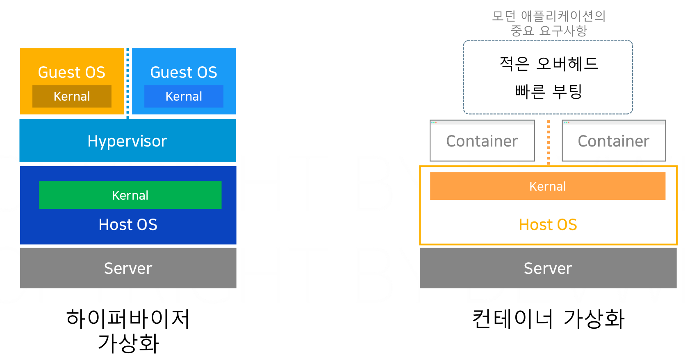
- **커널의 자체 기능**(**LXC**)을 활용한 가상화 방식
	- e.g. Docker
- **LXC**(Linux Containers)
	- **리눅스 커널**이 제공하는 **자체 격리 기술**
	- **커널 자체 기능**만 사용해 **격리된 공간(컨테이너) 생성** 가능
		- 네임스페이스: 리소스를 나누는 기준 역할
			- e.g. 프로세스, HDD, Network, 사용자, 호스트네임...
		- Cgroups: 리소스의 사용량을 배분하는 기술
			- e.g. 프로세스가 사용하는 메모리, CPU, HDD, Network, BandWidth 
- 컨테이너
	- **LXC 기술**을 사용해 만들어진 **격리된 공간**
	- 컨테이너를 생성하면 **완전히 격리된 CPU, Disk, Network, Memory 공간**을 차지
		- 내부에서 프로세스를 띄우면 완전히 격리된 공간에서 띄우는 것
	- **여러 개의 컨테이너**를 실행시키면 각각의 컨테이너는 **격리된 공간에서 안전하게 운영**됨
- **핵심** 특징
	- 모든 컨테이너는 **HostOS의 커널을 공유해 사용**
- 장점: **가볍고 빠르다**!!!
	- **오버헤드가 적어** 빠름
		- 하이퍼바이저와 달리 번역을 거치는 중간 단계가 없어 빠름
	- **부팅이 매우 빠름**
		- 자체적인 커널 없이 호스트 OS의 커널을 공유하므로 커널 실행 시간 자체가 없음
	- -> **모던 애플리케이션 요구사항에 적합**
		- 빠르게 변화하는 사용자 니즈에 맞춰 **변경 사항을 빠르게 적용 가능**
		- e.g. 가벼운 웹서버 올리기
			- 하이퍼바이저: 60초
			- 컨테이너: 3초
- 단점: 호스트 OS의 커널을 공유하므로, **호스트 OS와 다른 종류의 OS는 실행할 수 없음**
- 유의: **어떤 컨테이너 플랫폼** 사용할지 **어떤 컨테이너 런타임**을 사용할지 **선택 가능**

## 도커 (오픈소스, 2013~)
- 커널의 **컨테이너 가상화 기술**을 쉽게 사용하기 위한 소프트웨어 (컨테이너 플랫폼)
	- 하이퍼바이저와 달리 **실제 격리 수행 주체**는 **커널 자체**
- 목적: 컨테이너 내에서 **소프트웨어**(**서버**)를 **빠르고 가볍게 운영**하기 위해 사용
- 가장 점유율이 높은 **컨테이너 플랫폼**
	- 컨테이너 플랫폼 예시 - Docker, Podman, Containerd...
- 컨테이너 플랫폼 **구조**
	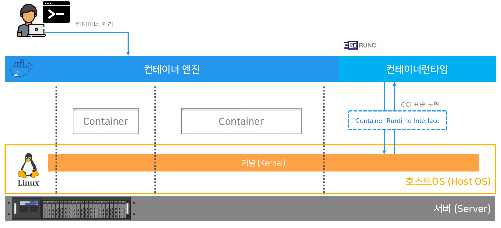
	- **컨테이너 엔진**
		- 사용자의 요청을 받아 **컨테이너를 관리**해주는 역할
		- 도커 아키텍처 (**클라이언트-서버 모델**)
			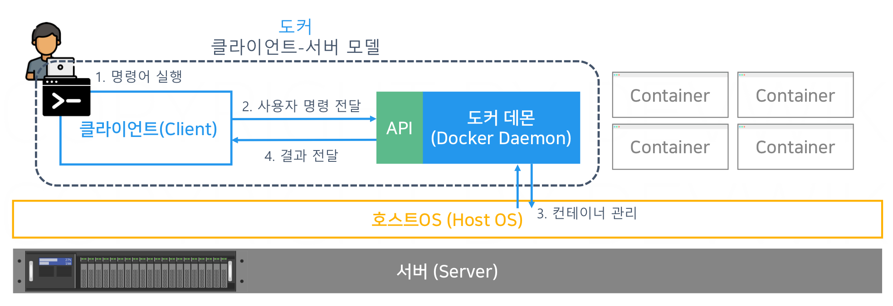
			- **Docker CLI** - 클라이언트
				- 사용자가 입력한 명령어를 **서버 API 양식에 맞게 변환**해 대신 **전달**
				- 덕분에 사용자는 **도커 데몬의 API와 쉽게 통신 가능**
			- **Docker Daemon** (=**dockerd**) - 서버
				- **호스트 OS**에서 **지속적으로 실행**되면서 클라이언트 **요청에 따라 컨테이너 관리**
				- 클라이언트를 위한 **API** 제공
				- **컨테이너 런타임**을 통해서 **컨테이너를 조작**하고 결과를 CLI에게 전달
	- **컨테이너 런타임**
		- **직접 커널과 통신**하면서 **실제로 격리된 공간을 만드는** 역할
		- 인터페이스: CRI(Container Runtime Interface) - OCI가 규정한 표준
		- 구현: **`RUNC`** (도커 지원 기본 컨테이너 런타임)

## 이미지와 컨테이너
- 서버에서 **소프트웨어 실행을위해 필요한 것들**
	- 하드웨어
	- OS
	- 프로그램 실행 위한 구성 요소 (패키지, 라이브러리, 런타임 언어)
	- 소프트웨어 (실행 시킬 프로그램)
- 이미지 = **실제 압축 파일** + **메타 데이터**
	- **컨테이너 실행** 시 실제 압축 파일과 메타 데이터가 격리된 공간에 **복사**되어 **프로세스로 실행**
- **이미지** (Image)
	- **특정 시점의 파일시스템**(디렉터리)을 저장한 **압축 파일**
	- 이미지 = **OS** + **구성 요소** + **소프트웨어** => **실행 준비가 완료된 상태 자체**를 압축해 공유
		- Windows 백업 기능, 가상 머신의 스냅샷과 비슷
	- 백업이나 스냅샷보다 **압축 사이즈가 매우 작아** 인터넷을 통한 **저장과 공유가 수월함**
		- 이미지는 다른 사람이 만든 것을 사용하거나 직접 만들 수 있음
	- **이미지** : **컨테이너** = **프로그램** : **프로세스** (1개의 이미지로 여러 컨테이너 실행 가능)
		- 이미지는 파일 시스템 (압축 파일 형태로 호스트 머신 특정 경로에 위치)
		- 컨테이너는 **실행 상태의 이미지**
- 이미지 **메타데이터** (Metadata)
	- **이미지에 대한 정보**를 기술하는 데이터
		- 이미지 이름, 사이즈
		- **Env**: **소프트웨어**가 **실행** 시 참조할 환경설정 정보 (키-값 쌍)
			- 소프트웨어 버전, 실행을 위해 필요한 파일 경로 등이 있음 (바뀌면 동작도 달라짐)
				- e.g. `VERSION=1.23.2,PATH=/usr/..`
		- **Cmd**: **컨테이너 실행** 시 프로세스 실행 명령어 지정 (**리눅스 명령어**)
			- e.g. `nginx -g daemon off;`
	- **컨테이너 실행** 시 다른 값으로 **덮어쓰기**도 가능 (e.g. CMD 명령어 변경 등)
		- 같은 이미지도 전혀 다른 역할을 수행하는 컨테이너로 만들 수 있음
		- 보통 **이미지**를 **디버깅**할 때 주로 사용
- **컨테이너 라이프사이클**
	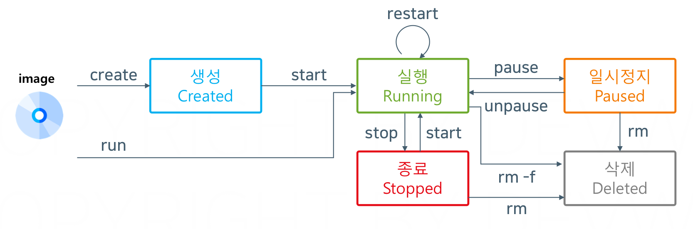
	- **생성 단계** (Created) - `docker create`
		- 컨테이너를 실행하기 위한 **격리된 공간**이 만들어지는 상태
		- 네트워크, 스토리지, 환경 변수 등 모든 리소스를 격리
	- **실행 단계** (Running) - `docker start`
		- 컨테이너의 메타 데이터 **CMD** 값을 사용해 **컨테이너를 실행**
		- 실제 **프로세스**가 실행되어 **CPU**와 **메모리** 사용
	- 일시정지 단계 (Paused) - `docker pause`, `docker unpause`
		- 컨테이너에서 실행 중인 **모든 프로세스**가 **일시 중지**된 상태
		- 현재 상태를 모두 **메모리**에 저장 (CPU X, 메모리 O)
			- 저장된 상태에서부터 재시작
	- **정지 단계** (Stopped = Exited) - `docker stop`, `docker start`
		- 컨테이너에서 실행 중인 **프로세스**를 **완전히 중단**
		- CPU와 메모리 사용 모두 중단 (재시작시 프로세스를 처음부터 다시 실행)
	- **삭제 단계** (Deleted) - `docker rm`, `docker rm -f`
		- 컨테이너가 **삭제**된 상태 (**격리된 공간 삭제**)
	- 참고
		- **컨테이너의 상태**는 대부분 컨테이너 내에서 실행되는 **프로세스 상태**와 **일치**
			- 프로세스를 잘 설계하고 다루는 것 => 컨테이너를 잘 사용하는 것
		- `docker run` = `docker create` + `docker start`
		- `docker restart`: 프로세스를 재시작
			- 실행 중 프로세스에 **종료**나 **재시작** 신호를 보내면 **10초 뒤 반응**

## 이미지 레지스트리
- **도커 이미지**를 저장하기 위한 **저장소**
	- e.g. **Docker Hub** (대표적)
- 개인 및 팀이 필요한 이미지를 서로 **공유**하고 **다운로드** (GitHub과 유사)
	- GitHub이 소스 코드만 보관 <-> Docker Hub는 이미지 보관 (소스 코드 + 실행 환경)
	- **이미지명**만 서로 알면 **실행 환경이 일치하는 애플리케이션 공유 가능**
		- **새 서버 구성 시간 및 서버 운영 비용 크게 감소**
- 공통 제공 기능
	- 이미지 공유, 이미지 검색, 이미지 버전 관리, 보안, 파이프라인 (DevOps 배포)
- **이미지 저장 공간 종류**
	- 호스트 머신의 **로컬 스토리지** (특정 디렉터리)
	- **온라인 저장소**
		- **퍼블릭 레지스트리** (e.g. Docker Hub)
		- **프라이빗 레지스트리**
			- 보안 상 사내망, 내부망에서만 사용 가능한 레지스트리
			- 방법
				- **설치형 레지스트리**
					- 로컬 서버에 직접 설치
					- e.g. Harbor, Docker 프라이빗 레지스트리
				- **퍼블릭 클라우드 서비스**
					- 시간 당 사용 요금 지불
					- e.g. Amazon ECR, Azure Container Registry (ACR)
	- => `docker run` 실행 시
		- 이미지가 로컬 스토리지에 있으면 바로 실행
		- 없으면 온라인 레지스트리에서 로컬 스토리지로 이미지를 다운 후 실행
- 이미지 네이밍 규칙
	- 이미지 네이밍: `레지스트리주소/프로젝트명/이미지명:이미지태그`
		- **레지스트리주소** (기본값: 도커에서는 **Docker Hub 주소** **`docker.io`**)
			- **어떤 레지스트리**에서 이미지를 다운로드/업로드할 지 지정
		- **프로젝트명** (기본값: **`library`**) 
			- 이미지를 보관하는 **폴더** 같은 개념 (Docker Hub에서는 **사용자의 계정명**)
			- `library`: 도커사가 직접 검증한 **오피셜 이미지**를 관리하는 프로젝트
		- **이미지명**: 다운로드 받을 **이미지의 이름**
		- **이미지태그** (기본값: 최신 버전을 의미하는 **`latest`**)
			- 이미지의 **버전** (숫자, 영문 모두 사용 가능)
			- `stable`: 안정적 버전
			- `alpine`, `perl`...: 베이스 이미지로 사용했던 OS 버전
			- `slim`: 프로그램 실행에 정말 필요한 것들만 남겨놓음
				- 이미지 전송 시간은 크게 단축하나 디버깅이나 사용이 불편할 수 있음
	- e.g. 
		- `devwiki.com/myProject/myNginx:2.1.0-alpine`
		- `nginx` -> `docker.io/library/nginx:latest` (오피셜 이미지)
	- 참고: 이미지 : 이미지 명 = 실제파일 : 참조 링크

## 이미지 빌드
- 이미지 레이어
	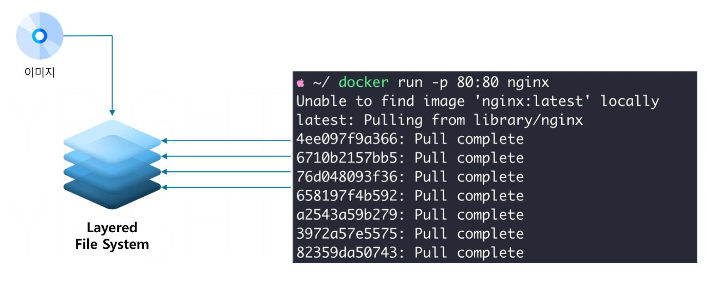
	- **이미지**는 **레이어드 파일 시스템**으로 구성됨
		- **레이어가 모여 하나의 이미지 구성**
		- e.g. 이미지 다운 시, pull이 여러차례 걸쳐 일어남
			- 한 줄이 하나의 레이어
	- **레이어**(Layer)
		- **이전 레이어에서 변경된 내용**을 저장 (소스코드 커밋, 푸시와 유사)
		- 특징
			- 레이어는 **순차적으로 쌓임**
			- 여러 이미지 간 **공유** 가능 (**재사용**)
			- **Copy-on-Write 전략** 사용
				- 다음 레이어에서 이전 레이어의 특정 파일을 수정할 때, 해당 파일의 **복사본**을 만들어 **변경 사항을 적용**
					- e.g. 컨테이너 레이어는 파일수정 시 이전 레이어의 파일을 복사해와 수정
				- 원래 레이어는 수정되지 않고 그대로 유지됨
			- **불변 레이어** (Immutable Layer): 레이어는 **한 번 생성되면 변경되지 않음**
				- 이미지의 일관성을 유지
				- 동일한 이미지를 사용하는 컨테이너는 동일한 파일 시스템 상태 사용을 보장
			- **캐싱**
				- 레이어를 캐시해두고 **이미 빌드된 레이어를 재사용**할 수 있음
				- **이미지 빌드 시간**이 크게 **향상** (같은 레이어 사용하는 여러 이미지에서 효율적)
		- 장점
			- **중복 데이터를 최소화**해 **효율적인 저장소 사용** 가능
				- **재사용**에 유리한 구조 (각 레이어가 서로 영향 X)
				- => 이미지 저장 및 전송 시 **스토리지**와 **네트워크 사용량 절약**
			- 빌드 속도 상승
		- e.g. 
			- 레이어 1: OS 파일 시스템
			- 레이어 2: Nginx 설치 파일 (추가 파일만 저장)
			- 레이어 3: Nginx 설정 파일 (추가 파일만 저장)
			- 레이어 4: index.html 파일 수정
	- 레이어 구분
		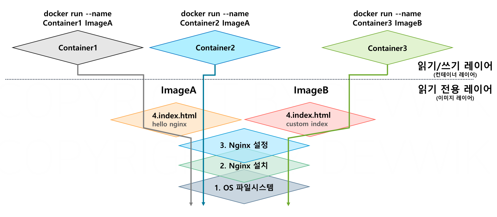
		- 이미지 레이어 : 컨테이너 레이어 = 건축 도면 : 실제 건물
		- **이미지 레이어**
			- 읽기 전용 레이어
			- 컨테이너 실행을 위한 **세이브 포인트** 역할
			- **각각의 레이어**는 고유한 **해시값**을 가짐
		- **컨테이너 레이어**
			- 모든 컨테이너가 가지는 자신만의 **읽기/쓰기 레이어**
				- **컨테이너 실행** 시, 이미지 레이어 위에 **새로 추가**
			- 컨테이너 실행 후 **프로세스가 변경하는 내용을 기록**
			- 장점: 같은 이미지로 여러 컨테이너를 만들어도 **하나의 이미지 레이어를 공유**
				- => **컨테이너 생성 속도 향상** 및 **공간 절약**
- 이미지를 만드는 방법
	- 이미지 커밋
		- **실행 중인 컨테이너의 상태**를 **그대로 이미지로 저장**
		- 새로운 이미지 = 기존 이미지 레이어 + 컨테이너 레이어
		- 단점
			- **휴먼 에러 가능성이 높음**
				- 이미지를 만들 때마다 컨테이너를 실행해 직접 커밋 명령을 수행해야 함
			- 레이어 쌓을 때마다 **컨테이너 실행 및 커밋 반복이 번거로움**
	- **이미지 빌드** (주로 사용)
		- **IaC 방식**을 활용해 이미지를 저장 (`Dockerfile`)
		- 원하는 이미지 상태를 **소스 코드**로 작성하면 **컨테이너 생성 및 커밋 작업**을 **도커가 대신 수행**
		- 과정 (`docker build`) -> 커밋 과정을 자동 반복
			- 임시 컨테이너 생성
			- 변경 사항 적용 후 커밋 (새로운 레이어 생성)
			- 임시 컨테이너 삭제
- **빌드 컨텍스트** (Build Context)
	- **도커 데몬이 이미지를 빌드할 때 전달되는 폴더**
		- 도커 데몬은 **빌드 컨텍스트에 있는 파일만** 카피 명령으로 **복사할 수 있음**
	- 폴더 내에 **도커 파일**과 **빌드에 사용되는 파일들**이 담겨야 함 
		- 빌드 컨텍스트가 너무 크면 전송 시간이 길어지거나 문제 발생
			- C 드라이브 전체 사용 등은 절대 안되고, **따로 폴더로 관리**할 것!
		- **`.dockerignore`** : 빌드 컨텍스트로 전달될 파일 관리
- **멀티 스테이지 빌드** (Multi-Stage Build)
	- **빌드 스테이지**와 **실행 스테이지** 2개로 나누어 빌드하는 방식
	- 장점: 애플리케이션 **실행용 이미지**의 **크기가 크게 감소**
	- 문제
		- 빌드 과정에서 사용하는 파일들은 용량을 많이 차지 (e.g. 메이븐 빌드 도구)
		- 실행용 이미지의 사이즈가 커지면 이미지 전송 및 다운로드 시간이 더 걸림
	- 해결책: **빌드**에 사용하는 이미지와 **실행**에 사용하는 **이미지 나누기**
		- e.g. 
			- 빌드 이미지: 메이븐 도구, 소스코드
			- 실행 이미지: 자바 런타임 및 빌드된 jar 파일
	- 참고: 두 개의 `FROM` -> 도커가 **두 개의 컨테이너를 동시 실행** (메이븐 컨테이너, JDK 컨테이너)

>IaC(Infrastructure as Code)
>
>**인프라를 코드를 통해서 관리**하는 것을 말한다. 
>사람이 화면이나 CLI를 통해 관리하는 기존 방식은 인수인계도 어렵고 휴먼 에러를 일으킬 확률이 높다.
>반면에, IaC는 **사람이 코드로 인프라 상세 작업을 기재**한다. 그러면 **프로그램이 코드를 읽어 대신 인프라 관리를 수행**하므로, **더 빠르고 안전하다.**
>또한, 이러한 코드 명세서를 GitHub에 올리면 **인프라 상태도 소스코드처럼 버전 관리**를 할 수 있다.

>애플리케이션 빌드
>
>애플리케이션 빌드는 필요한 라이브러리들을 설치하고 **소스코드를 실행 가능한 프로그램으로 만드는 것**을 말한다. (소스코드 -> 애플리케이션)
>**빌드의 결과물**은 **애플리케이션 프로그램**(Program) 혹은 **아티팩트**(Artifact)라고 부른다.
>예를 들어, 자바로 개발한 소프트웨어는 소스 코드를 실행 가능한 아티팩트로 빌드할 수 있다. (소스코드 + OS, Java Runtime, 빌드 도구(mvn), 라이브러리 -> `jar` 혹은 `war` 파일)
>
>개발한 소스 코드를 이미지로 빌드하는 과정에는 일반적으로 이러한 **애플리케이션 빌드 과정을 직접 포함시켜야 한다.**

## 도커 명령어
- 기본 양식: `docker (Management Command) Command`
	- Management Command는 생략 가능 (생략이 가능하면 생략을 권장)
- **정보**
	- `docker version` : Client, Server의 버전 및 상태 확인
	- `docker info` : 플러그인, 호스트 OS의 시스템 상세 정보 확인
	- `docker --help` : 메뉴얼 확인
		- e.g.
			- `docker --help`
			- `docker container --help`
			- `docker container run --help`
	- `docker ps` : 실행 중인 컨테이너 리스트 조회
		- `-a` : 종료된 컨테이너 포함 모든 컨테이너 조회
	- `docker logs (컨테이너 명)` : 실행 중인 컨테이너의 로그 조회
		- `-f` : 실시간 로그 조회
- **이미지 레지스트리**
	- `docker pull 이미지명` : 로컬 스토리지로 이미지 다운로드 (이미지 네이밍 규칙 준수)
	- `docker tag 기존이미지명 추가할이미지명` : 로컬 스토리지에 이미지명 추가
		- **실제 파일은 하나** (즉, 하나에 이미지에 여러 개의 이름 추가 가능)
		- 같은 파일이어도 이름에 따라 어디에 업로드 될 지가 달라짐
		- e.g. `docker tag devwikirepo/simple-web:1.0 veluga29/my-simple-web:0.1`
	- `docker push 이미지명` : 이미지 레지스트리에 이미지 업로드
	- `docker login` : 로컬 스토리지 특정 공간에 이미지 레지스트리 **인증 정보** 생성 
		- 생성 디렉터리: `~/.docker/config.json`
	- `docker logout` : 이미지 레지스트리 인증 정보 삭제
- Management Command - **`container`**
	- `docker run (실행 옵션) 이미지명 (실행명령)` : 컨테이너 실행
		- `-d` : 백그라운드 실행 (데몬 프로그램 실행에 적합)
		- `--name {컨테이너명}` : 컨테이너의 이름 지정
		- `-it` : 커맨드 창을 통해 실행할 컨테이너와 직접 상호작용
			- shell 명령 `bin/bash` 추가 필요
		- `--network 네트워크명` : 원하는 네트워크 지정
		- `-p HostOS의포트:컨테이너의포트` : 포트포워딩 옵션
		- `-v 도커의볼륨명:컨테이너의내부경로` : 볼륨 마운트
			- e.g. 
				- `-v volume1:/var/lib/postgresql/data`
				- `-v volume1:/etc/postgresql -v volume2:/var/lib/postgresql/data`
		- `-v 사용자지정HostOS디렉토리:컨테이너의내부경로` : 볼륨 바인드 마운트 (디버깅용)
			- e.g. `-v volume1:/var/lib/postgresql/data`
		- e.g.
			- `docker run 이미지명 (실행명령)` : 컨테이너 실행 시 메타데이터의 cmd 덮어쓰기
			- `docker run --env KEY=VALUE 이미지명` : 컨테이너 실행 시 메타데이터의 env 덮어쓰기
			- `docker run -it --name 컨테이너명 이미지명 bin/bash` : 컨테이너 실행과 동시에 터미널 접속 (shell) - **이미지 내부 파일 시스템 확인 혹은 디버깅 용도**
			- `docker run -it --network second-bridge --name ubuntuC devwikirepo/pingbuntu bin/bash` : 원하는 네트워크 지정해 컨테이너 실행
			- `docker run -d --name my-postgres -e POSTGRES_PASSWORD=password -v mydata:/var/lib/postgresql/data postgres:13` : 볼륨 지정해 DB 실행
	- `docker rm 컨테이너명/ID` : 컨테이너 삭제
		- `-f` : **실행 중**인 컨테이너 삭제 (단순 `rm`은 실행 중인 컨테이너 삭제 불가)
		- e.g.
			- `docker rm -f multi1 multi2 multi3` : 여러 컨테이너 한번에 삭제
	- `docker cp 원본위치 복사위치` : 컨테이너와 호스트 머신 간 파일 복사
		- `docker cp 컨테이너명:원본위치 복사위치` : 컨테이너 -> 호스트머신으로 파일 복사
		- `docker cp 원본위치 컨테이너명:복사위치` : 호스트머신 -> 컨테이너로 파일 복사
	- `docer container inspect 컨테이너명` : 컨테이너의 메타 데이터 조회
		- 결과 예시
			```json
			[{
				{
				...
				"NetworkSettings": {
					...
					"Networks": {
							"bridge": { //브릿지 네트워크명
								...
								"Gateway": "172.17.0.1", //도커브릿지 가상 IP
			                    "IPAddress": "172.17.0.2", //컨테이너 가상 IP
			                    ...
							}
						}
					}
				}
			}]
			```
- Management Command - **`image`**
	- `docker image ls (이미지명)` : 다운로드된 이미지 조회
	- `docker image inspect 이미지명` : 이미지의 메타 데이터 조회
	- `docker image rm 이미지명` : 로컬 스토리지의 이미지 삭제
	- `docker image history 이미지명` : 이미지의 레이어 이력 조회
- 도커 커밋
	- `docker commit -m 커밋명 실행중인컨테이너명 생성할이미지명` : 실행 중인 컨테이너를 이미지로 생성
- 도커 빌드
	- `docker build -t 이미지명 Dockerfile경로` : 도커파일을 통해 이미지 빌드
		- `Dockfile경로` = 빌드 컨텍스트 지정
		- **도커 파일이 있는 경로로 가서 실행**하자! (`Dockerfile경로`=`.`)
	- 옵션
		- `-t 이미지명` : 결과 이미지의 이름 지정
		- `-f 도커파일명`
			- 도커파일명이 Dockerfile이 아닌 경우 별도 지정
			- **케이스 별**로 **다른 도커파일**이 필요한 경우
- Management Command - **`network`**
	- `docker network ls` : 네트워크 리스트 조회
	- `docker network inspect 네트워크명` :  네트워크 상세 정보 조회
	- `docker network create 네트워크명` : 네트워크 생성
		- e.g. `docker network create --driver bridge --subnet 10.0.0.0/24 --gateway 10.0.0.1 second-bridge`
	- `docker network rm 네트워크명` : 네트워크 삭제
- Management Command - **`volume`**
	- `docker volume ls` : 볼륨 리스트 조회
	- `docker volume inspect 볼륨명` : 볼륨 상세 정보 조회
		- e.g.
			```json
			[
			    {
			        "CreatedAt": "2025-02-05T04:38:44Z",
			        "Driver": "local", //local = 실제 데이터가 호스트 OS에 저장됨
			        "Labels": {},
			        //경로는 리눅스에서 관찰 가능, MacOS 등은 관찰 불가
			        //도커가 가상 머신 형태로 실행되기 때문
			        "Mountpoint": "/var/lib/docker/volumes/mydata/_data",
			        "Name": "mydata",
			        "Options": {},
			        "Scope": "local"
			    }
			]
			```
	- `docker volume create 볼륨명` : 볼륨 생성
	- `docker volume rm 볼륨명` : 볼륨 삭제

## Dockerfile 지시어
- 기본 양식: `지시어 지시어의옵션`
- 유의사항
	- 일반적으로 파일 시스템 변 경이 있는 명령어는 레이어 추가 O
	- 메타데이터에만 영향 주는 명령어는 레이어 추가 X
- 기본 지시어
	- `FROM 이미지명` : 베이스 이미지를 지정 (**필수**)
	- `COPY 빌드컨텍스트내파일경로 복사할레이어경로` : 파일을 레이어에 복사 (**새로운 레이어 추가**)
		- `--from` : 파일을 가져올 다른 스테이지 지정 (멀티 스테이지 빌드)
			- 즉, 빌드 컨텍스트가 아니라 다른 스테이지 이미지에서 파일을 가져옴
			- e.g. `--from=build`
- 시스템 관련 지시어
	- `WORKDIR 디렉터리명` : 작업 디렉터리를 지정 (**새로운 레이어 추가**, `cd`)
		- 다음에 나오는 지시어들은 지정된 디렉터리 기준으로 수행됨
		- 가능한 **초반**에 `FROM` 다음 **바로 작성**하는 것이 좋음
	- `USER 유저명` : 명령을 실행할 사용자 변경 (**새로운 레이어 추가**, `su`)
		- **기본**은 **루트 사용자**로 실행
		- 보안을 위해 컨테이너가 필요 이상의 권한을 가지지 않도록 조절
	- `EXPOSE 포트번호` : 컨테이너가 사용할 포트를 명시
		- 보통은 소스 코드안에 애플리케이션이 사용할 포트가 지정되어 있음
		- 따라서, 필수는 아니지만 공유 **문서 기재 용도** 큼 (도커파일만 보고도 포트 확인 가능)
- 환경변수 설정
	- `ARG 변수명 변수값` : 이미지 빌드 시점에만 사용할 환경 변수 설정
		- `docker build --build-arg 변수명=변수값` : 덮어쓰기
	- **`ENV 변수명 변수값`** (권장) : 이미지 빌드 및 컨테이너 실행 시점까지 계속 유지될 환경 변수 설정
		- `docker run -e 변수명=변수값` : 덮어쓰기
- 프로세스 실행
	- `ENTRYPOINT ["명령어"]` : 자주 쓰이는 고정된 명령어를 지정
		- 의도치 않은 명령어 접근 1차적 방지 (완벽 X)
		- e.g. `ENTRYPOINT ["npm"]`
	- `CMD ["명령어"]` : 컨테이너 실행 시 실행 명령어 지정 (메타 데이터 CMD 필드에 저장됨)
		- e.g. `CMD ["start"]`
	- `RUN 명령어` : 명령어 실행 (**새로운 레이어 추가**)

# 실전

## 클라우드 네이티브 애플리케이션 (Cloud Native Application)
- **클라우드**
	- 다른 회사의 서버를 빌려서 운영
		- **퍼블릭 클라우드**: 누구나 사용할 수 있는 클라우드 서비스 (e.g. Azure, AWS, GCP)
		- **프라이빗 클라우드**: 특정 조직만 사용할 수 있는 클라우드 서비스 (e.g. 조직 내 계열사)
			- 보안과 비용이 보다 효율적
	- 특징
		- 요청 즉시 서버를 생성 (**Provisioning**)
			- 스토리지 저장소에 **가상화 기술**을 활용
			- 사용자가 서버를 구매할 때마다 스펙에 맞는 VM을 만들어 제공
		- **사용 시간만 비용 지불** (직접 서버를 운영음 비용이 매우 큼)
	- **현대 애플리케이션의 다양한 문제를 해결**
		- 확장성 (Scalability) : 트래픽 증가에 유연하고 빠르게 대처
		- 복원력 (Resilience) :  장애 발생 시 빠르게 복구
			- e.g. 서울 데이터 센터에 장애가 났을 때 부산 데이터 센터의 서버로 트래픽 전환 (Disaster Recovery, 복구에 사용하는 서버)
		- 효율적인 운영 비용 처리 : 전문 아키텍트의 적절한 서버 구성과 끊임없는 최적화 필요
	- -> 클라우드는 시작점이고 **애플리케이션이 클라우드에 적합하지 않으면 큰 의미 없을 수 있음**
- **클라우드 네이티브 애플리케이션**
	- **클라우드 환경을 더 잘 활용할 수 있는 애플리케이션 구조**
	- 필요 사항
		- **MSA**: 트래픽 증가에 빠르게 대처하기 위해선 애플리케이션이 MSA 구조로 개발되어야 함
		- **컨테이너**: 컨테이너를 활용해 실행 환경에 종속되지 않는 동작을 보장해야 함
		- **무상태** (Stateless): 상태를 가지지 않는 애플리케이션 서버는 어디에나 즉시 배포 가능
		- **DevOps** 및 **CI/CD**: 배포가 자동화되어야 하고 릴리즈가 빠르게 수행되어야 함
- 모놀리식과 MSA
	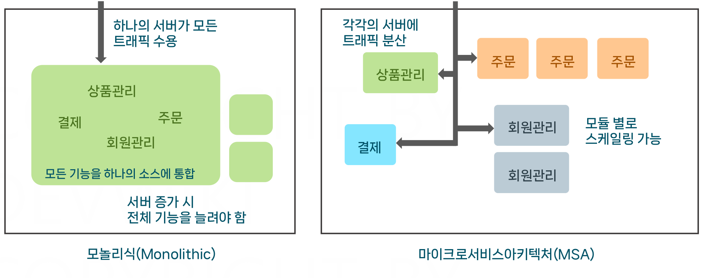
	- 잘 활용하면 **클라우드 네이티브 애플리케이션으로서의 장점**이 커서 **MSA로 많이 전환하는 추세**
	- 모놀리식
		- 모든 기능을 하나의 애플리케이션에 구성
		- 수직 확장(Scale-Up) 주로 사용
		- 장점
			- 초반 개발 속도가 빠르다가 코드 베이스가 커질수록 느려짐
			- 복잡성이 낮음
		- 단점
			- **트래픽 대처 능력 감소**
				- 하나의 **애플리케이션 크기가 큼**
					- **애플리케이션 실행 시간이 오래 걸림**
					- 개발에 들어가는 **빌드 시간 및 배포 시간도 오래 걸림**
			- 서버 확장 시 **비효율적인 리소스 사용**
				- 실제 트래픽은 주문 기능에서만 나는데 상품관리, 회원관리도 함께 확장됨
	- **MSA**
		- **도메인이나 기능별**로 모듈을 **분리**해 서버 배포
		- 수평 확장(Scale-Out) 주로 사용
		- 장점
			- 각각의 모듈의 크기가 감소해 **서버 스케일 아웃 시간 빠름**
			- 스케일 아웃 시 **효율적인 리소스** 사용
				- 트래픽이 늘어난 모듈만 서버 스케일 아웃 가능
			- **모듈별**로 **완전히 독립**됨
				- 각각 **다른 언어**로 개발 가능
				- 기능 **장애 발생**해도 **다른 모듈에 영향 방지** 가능
		- 단점
			- 초기 구성이 복잡하고 오래 걸림
			- 복잡성이 높음

## 네트워크 기본
- 전세계가 **물리적 케이블**을 통해 **전기 신호**로 정보를 주고 받음 (먼 해외는 해저 케이블 사용)
- **IP**
	- 전 세계 **인터넷상**에서 **유일한 주소** (동적 IP는 시간에 따라 변하지만 여전히 유일)
	- **회선 당 하나 배정**하므로 **한 회선**(**공인 IP**)을 **사설 IP로 나눠** 여러 기기가 동시에 IP 사용 가능
		- 공인 IP: 집주소, 전세계에서 유일
		- 사설 IP: 방번호, 소속된 네트워크 장비(공유기) 내에서 유일
			- 사설 IP 주소 대역 (아래 범위 해당하는 주소는 모두 사설 IP)
				- 10.0.0.0 — 10.255.255.255 (Class A)
				- 172.16.0.0 - 172.31.255.255 (Class B)
				- 192.168.0.0 — 192.168.255.255 (Class C)
		- **공유기**: 공인 IP를 사설 IP로 분리하는 장치
			- e.g. IP Time
			- WAN 포트: 공인 IP를 받는 인터넷 선을 꽂는 부분
			- LAN 포트: 각각의 기기를 연결해서 사설 IP를 분배하는 곳
		- 기업 네트워크 (아래보다 더 복잡)
			- 공인망: 공인 IP 끼리 사용하는 네트워크 통신망
			- 사설망: 라우터를 사용해 만들어진 내부 네트워크 통신망 (사설 IP 사용, 실제 서버에게 할당)
			- 라우터: 공유기와 비슷한 역할
- **네트워크 인터페이스**
	- **인터넷**에 연결하기 위해 **컴퓨터에 장착하는 부품** 중 하나
	- 네트워크 인터페이스마다 **IP를 할당** (사설 IP)
	- **하나의 기기**에는 **한 개 이상의 네트워크 인터페이스 장착 가능**
		- e.g. 노트북 (유선 인터페이스, 무선 인터페이스)
- **포트**
	- 서버에 있는 프로세스들 중 **어떤 프로세스에 데이터를 전달할지 지정**
	- IP 뒤에 `:` 붙여 지정 (e.g. `192.168.0.5:8080`)
	- 물리적 존재 X, **서버 안에서 정의**해 사용
	- 네트워크를 사용하는 프로그램은 실행될 때 자신이 사용할 포트를 지정
		- Well-Known 포트: 사전에 약속되어 있는 포트
		- e.g. 웹서버 통신(80, 443), SSH(22), FTP(21)
- 네트워크 통신
	- 아웃바운드 : 자신의 서버에서 출발하는 통신
	- 인바운드 : 외부 서버에서 자신의 서버로 오는 통신
- **NAT** (Network Address Translation) - **아웃바운드 통신**에 사용
	- **매핑 테이블** 활용해 **공인 IP와 사설 IP를 매핑**해주는 기술
		- 공인 IP의 랜덤한 포트를 여러 개 지정해두고 각각의 포트에 사설 IP 정보 매칭
	- 사설망을 구성하는 **라우터**가 항상 가지는 기능 (**자동 설정**)
	- 동적으로 정보를 관리하므로 외부에서 서버로 접근할 때는 혼란이 생김 (인바운드 통신)
	- NAT 테이블 예시
		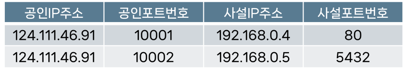
		- 아웃바운드 통신 발생 시 해당 사설 IP 주소 및 포트와 공인 IP 주소 및 포트를 저장
			- 공인포트번호는 랜덤 지정
		- 외부 서버는 공인 IP 주소 `124.111.46.91:10001`을 출발지로 알고 응답을 보냄
		- 라우터는 돌아온 정보를 NAT 테이블에서 `192.168.0.4:80`으로 응답을 보냄
- **포트 포워딩** (Port Forwarding) - **인바운드 통신**에 사용
	- **외부에서 사설망으로 접근**할 때 사용하는 **NAT 테이블 같은 매핑 정보 관리 기술**
		- 외부에서 공인 IP에 접근하면 포트 포워딩 룰에 맞는 사설 IP로 변환해 트래픽 전달
	- **사용자가 직접 지정**
	- 포트포워딩 예시
		
		- 외부 서버에서 공인 IP 주소 `124.111.46.91:80`으로 요청 보냄
		- 포트 포워딩 룰에 따라 요청은 사설 IP `192.168.0.4:80`으로 보내짐
- DNS (Domain Name System)
	- 도메인 주소와 공인 IP를 매핑해주는 기술 (도메인명 <-> IP 주소)
	- 일반적인 엔터프라이즈 환경에서는 사내망에서 별도로 DNS 서버를 운영하기도 함
		- 사내 서버들끼리 도메인으로 통신할 수 있도록 정보 제공
		- DNS 서버 주소도 내부 DNS 서버의 IP로 지정
	- DNS 예시
		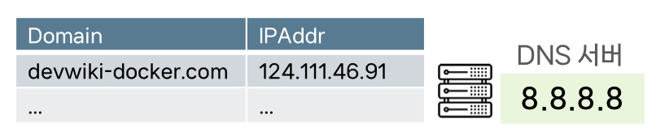
		- `devwiki-docker.com`으로 요청을 보냄 
		- IP 주소가 8.8.8.8인 DNS 서버에 질문을 던져 도메인 주소에 해당하는 IP 주소 받음
		- 요청은 `124.111.46.91`로 전달됨

## 도커 가상 네트워크
- 가상 네트워크: **한 대의 서버** 내에서 **논리적으로 여러 네트워크를 구성**하는 기술
	- 물리적 네트워크 망에는 네트워크 인터페이스로 공인 IP 혹은 사설 IP가 할당된 PC(서버)가 존재
	- 해당 **서버 내에 가상 네트워크 구성**
	- SDN(Software Defined Network)라고도 함
- **도커**는 **가상 네트워크 기술**을 활용해 **컨테이너 네트워크**를 구성
	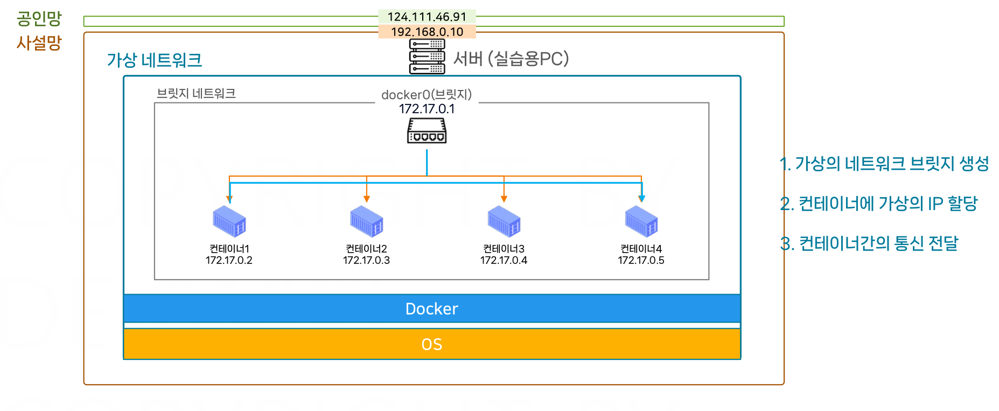
	- e.g. 외부와 컨테이너의 통신, 컨테이너와 컨테이너의 통신
	- 가상 네트워크 생성 과정
		- **도커 설치 및 실행** 시 다음 2가지 생성
			- **브릿지**(`docker0`): **가상 공유기**
				- **가상의 IP 주소를 할당** 받음 (일반적으로 `172.17.0.1`)
				- 가상의 IP 주소: 서버 내 논리적으로 정의된 IP (실제 존재 X)
			- **브릿지 네트워크**: 가상 네트워크
		- **컨테이너 실행** 시
			- **브릿지 네트워크의 IP 주소 범위 내**에서 **가상의 IP 주소 할당**
				- e.g. `172.17.0.2`, `172.17.0.3`, `172.17.0.4`, `172.17.0.5`
				- 마치 공유기를 통해 사설 IP 할당되는 것과 비슷
		- 같은 브릿지에서 생성된 컨테이너는 **브릿지를 통해 서로 통신** 가능
			- 도커는 여러개의 브릿지 네트워크 구성도 가능
- 네트워크 신호 전달 과정
	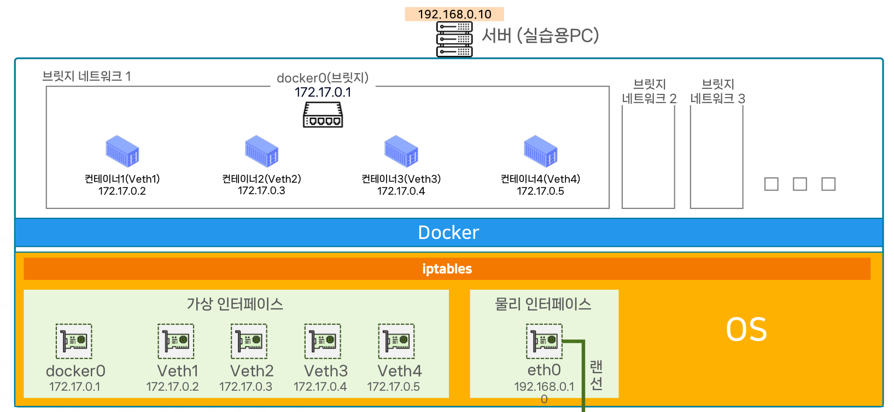
	- 서버(PC)는 **물리 네트워크 인터페이스**에 **인터넷 선을 연결**해 공인 IP 혹은 사설 IP를 할당받음
	- 해당 서버 내 도커 설치 후 실행 시
		- 도커는 **호스트 OS**에 **가상 인터페이스 1개 생성** (`docker0`)
	- 컨테이너 실행 시
		- **호스트 OS**에 **각각 컨테이너**에 해당하는 **가상 인터페이스**들 생성 (`Veth고유번호`)
	- 전달: 물리 인터페이스 -> 호스트 OS -> 컨테이너 가상 인터페이스 -> 컨테이너
	- 가상 인터페이스 간 통신은 **`iptables`를 활용**해 규칙을 정의하고 **소프트웨어적으로 패킷 전달**
		- `iptables`
			- Linux OS의 패킷 필터링 시스템
			- **내부 네트워크 트래픽 제어** 및 **라우팅 규칙** 정의
			- **특정 IP 주소**로 네트워크를 보냈을 때 **어떤 인터페이스로 전달할지**에 대한 규칙 설정
				- e.g. 규칙: `172.17.0.3`으로 향하는 요청은 `Veth2` 인터페이스로 전달하자
		- 물리 네트워크 였다면, 네트워크 장치들이 알아서 해줌
	- 참고: 호스트 OS -> 물리적 인터페이스 1개 : 가상 인터페이스 여러개 = 하드웨어 : 소프트웨어
- 가상 네트워크와 **외부 통신** (**포트포워딩**)
	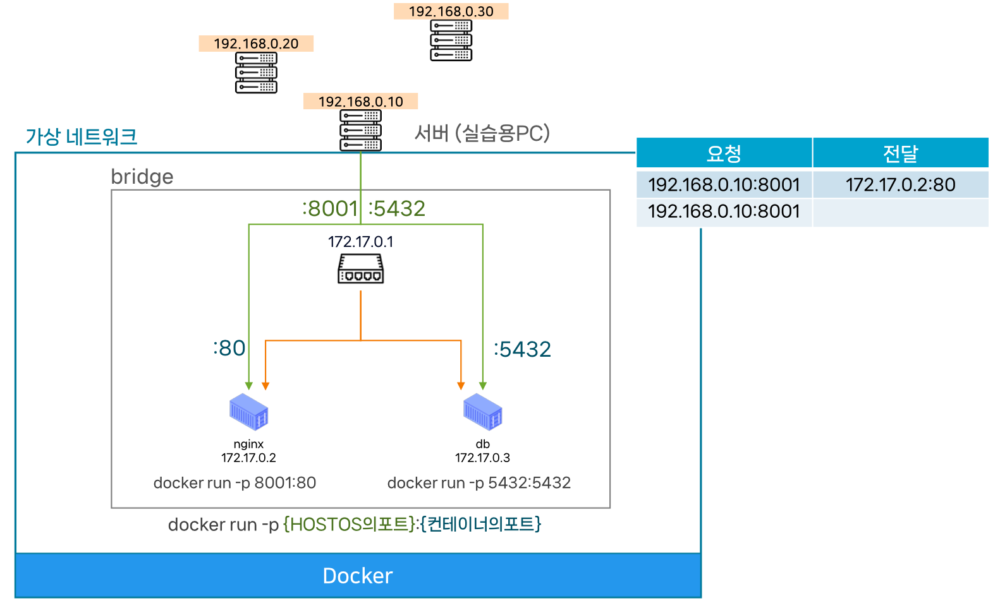
	- 아웃바운드 통신은 가상 네트워크가 알아서 NAT 사용
	- 인바운드 통신은 요청이 **원하는 컨테이너의 포트로 전달되도록 직접 포트포워딩 옵션 지정**
		- HOST OS의 포트는 아무거나 지정해도 상관 X
		- 이미 등록된 포트는 **중복 불가**
	- 의도적으로 **포트포워딩을 하지 않으면**, **컨테이너 간 통신만 허용**
		- e.g. DB 서버는 포트포워딩 없이 컨테이너 간 통신만 허용하여 외부 통신을 막음
- 도커 DNS
	- 직접 생성한 브릿지 내 **컨테이너가 사용**할 수 있는 **기본 DNS 서버** 제공 (기본 브릿지 제외)
	- **컨테이너 이름**이 **도메인**으로 자동 저장됨
		- e.g. `containerA - 10.0.02`, `containerB - 10.0.03`
	- **컨테이너 간의 통신**에 중요! -> 컨테이너 IP는 컨테이너 재시작 시 계속 바뀔 수 있어 불편
	- **외부 DNS 서버와 연동**되어 있어, 컨테이너 **외부 도메인으로도 접근 가능** (e.g. 구글)
- 도커 네트워크 드라이버
	- **브릿지 네트워크** (Bridge)
		- **도커 브릿지**를 활용해 **컨테이너 간 통신** 지원
		- **NAT 및 포트포워딩** 기술을 활용해 **외부 통신** 지원
	- 호스트 네트워크 (Host)
		- 호스트 네트워크를 공유해 **모든 컨테이너**가 **호스트 머신과 동일한 IP** 사용하도록 지원
		- 호스트 네트워크와 포트 중복 불가능
	- 오버레이 네트워크 (Overlay)
		- **호스트 머신이 다수**일 때 **하나의 네트워크처럼 사용**하도록 지원 (Kubernetes에서 사용)
	- Macvlan 네트워크
		- 컨테이너에 **MAC 주소**를 할당해, 물리 네트워크 인터페이스에 직접 연결

## 스토리지와 볼륨
- 컨테이너의 중요한 속성: **Stateless** (무상태)
	- **컨테이너**는 **상태가 없음**
		- 컨테이너 실행 후 모든 변경 사항은 컨테이너 레이어에만 존재
	- **불변성**: **모든 상태**는 **이미지**에 기록되고 이미지는 한 번 지정된 후 변경되지 않음
		- 컨테이너 상태 변경(e.g. 소프트웨어 버전 변경)이 필요하면 새 버전의 이미지 제작 후 배포
	- 장점
		- **여러 컨테이너**를 **다른 여러 환경**에서 **빠르게 배포 가능**
		- **트래픽**이나 **장애**에도 컨테이너를 쉽게 생성해 **빠르게 대처**
	- 제약
		- 상태가 없으므로 **데이터는 무조건 외부에 저장**해야 함
			- 데이터 영구 저장을 위해서는 **DB 서버 사용이 필수**
			- **사용자 세션 정보**나 **캐시** 같은 정보는 **캐시 서버나 쿠키를 통해 관리**
				- e.g. 사용자 로그인 정보, 장바구니 상품 리스트
		- **동일한 요청**은 **항상 동일한 결과**를 제공해야 함
			- 같은 이미지로 생성한 모든 서버에서 같은 응답을 제공해야 함
		- 컨테이너 실행 시점에 **설정**을 **외부에서 주입**할 수 있어야 함
			- **환경 변수**나 **구성 파일**을 통해 **다양한 환경**에서 **컨테이너 이미지를 활용** 가능
- 도커 볼륨 (Docker Volume)
	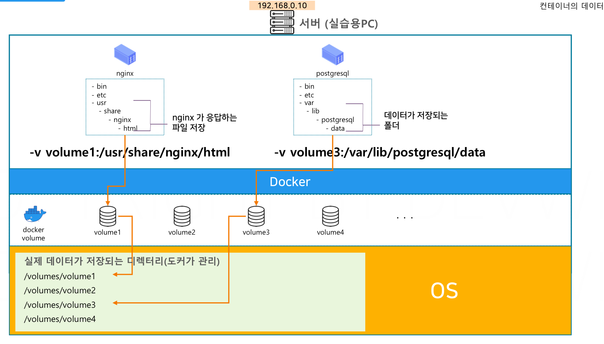
	- **데이터를 보관**하기 위해 도커가 관리하는 **외부 공유 저장소**
		- 호스트 OS의 서버 특정 공간에 저장 (e.g. `/volumes/volume1`)
		- **볼륨 저장 경로**에 사용자가 **직접 접근하기는 어려움**
			- 경로는 **리눅스**에서는 관찰 가능, MacOS 등은 관찰 불가
			- 도커가 가상머신 형태로 실행되어 경로를 자동 관리하고 가상머신 안에 저장하기 때문
	- **컨테이너가 삭제되도 볼륨은 남아있음**
	- **볼륨 마운트**
		- 컨테이너들은 **컨테이너의 특정 경로**를 **도커 볼륨**에 **마운트**해서 사용
		- 즉, 컨테이너의 특정 폴더는 공유용 폴더
		- e.g. PostgreSQL
			- PostgreSQL은 **`/var/lib/postgresql/data`** 경로에 실제 DB 데이터 저장
			- 해당 경로를 **도커 볼륨에 마운트**
			- 해당 경로에 저장하는 파일들은 컨테이너 레이어가 아니라 외부 볼륨에 저장
			- 여러 컨테이너는 1개의 볼륨을 공유해 **동일한 데이터를 제공**할 수 있음
			- 컨테이너가 삭제되거나 새 컨테이너가 생성되어도 **데이터 영속성 보장**
	- 볼륨과 컨테이너의 관계
		- **여러 컨테이너**에 **하나의 볼륨** 마운트 가능
		- **하나의 컨테이너**에 **여러 개의 볼륨** 마운트 가능
	- 바인드 마운트 (Bind Mount)
		- 도커가 자동 관리에서 벗어나 Host OS에서 데이터를 직접 관찰 가능 (볼륨 X)
		- 방법: `-v` 옵션에서 볼륨 이름 대신 사용자 지정 경로를 전달
		- **디버깅**에 유용
	- 볼륨은 **마운트한 컨테이너가 없을 때**만 **삭제 가능**

>컨테이너의 무상태와 서버 관리 방법론
>
>- Pet 방식 (전통적 서버 방법론)
>	- 서버 한 대 한 대를 소중히 직접 관리하는 방식
>	- 서버 에러 및 종료를 서비스 장애로 간주
>	- 서버가 상태를 가져서 교체가 어려움
>	- e.g. Monolithic, OnPremise
>- Cattle 방식
>	- **컨테이너**를 활용한 서버 방법론 (**서버는 소모품**)
>	- 서버 에러 및 종료가 충분히 일어난다고 가정
>		- 문제 서버 삭제 후 **빠르게 새 서버를 생성해 대체**하는 방식으로 해결
>	- **서버의 상태를 최대한 제거**해 **빠르게 교체 가능**하도록 함
>	- e.g. MSA, WEBAPP

>마운트
>
>컴퓨터의 특정 디렉토리를 외부 저장소와 연결하는 것을 말한다.
>NFS(Network File System)는 PC의 특정 폴더 혹은 드라이브 단위를 NFS에 마운트 시킬 수 있고, 여러 컴퓨터가 접근할 수 있습니다.

## Reference
[개발자를 위한 쉬운 도커](https://www.inflearn.com/course/%EA%B0%9C%EB%B0%9C%EC%9E%90%EB%A5%BC-%EC%9C%84%ED%95%9C-%EC%89%AC%EC%9A%B4-%EB%8F%84%EC%BB%A4)