## 레이어 관리
- **이미지의 크기를 줄이**면 **네트워크 비용을 감소**시키고 **빌드 속도를 향상**시킬 수 있음
- **`RUN` 지시어 관리** (**불필요한 레이어를 줄이기**)
	- 레이어 쌓는 지시어 하나 당 레이어가 추가됨
	- **`&&`를 활용**해 **최대한 레이어 하나로 처리하자** -> 불필요한 레이어 감소
	- e.g. RUN을 5번 사용하면 레이어가 5개 쌓이는데 비해, **레이어를 1개만 쌓이게** 할 수 있음
		```Dockerfile
		RUN apt-get update && \
			apt-get install -y curl && \
			apt-get install -y xz-utils && \
			apt-get install -y git && \
			apt-get clean
		```
- **애플리케이션의 크기**를 **작게 관리**하기
	- 불필요한 기능 줄이기
	- 큰 모듈을 여러 모듈로 분리하기
- 가능한 **작은 크기의 베이스 이미지** 사용하기
	- 가능한 **alpine OS** 사용 (e.g. 우분투 이미지 70MB, 알파인 이미지 8MB)
		```Dockerfile
		FROM alpine:latest
		RUN apk update && \
			apk add --no-cache curl && \ 
			apk add --no-cache xz && \ apk add --no-cache git
		```
	- 극단적으로 줄이고 싶다면 **스크래치 이미지** 활용 (`FROM scratch`)
		- 스크래치 이미지
			- 모든 이미지의 뿌리가 되는 이미지
			- 이미지 빌드를 위한 최소한의 파일만 포함
		- 스크래치 이미지 위에서 필요한 것만 패키징 -> 보안 향상, 이미지 크기 감소
		- e.g. 
			```Dockerfile
			# 빌드 스테이지
			FROM golang:alpine AS builder
			WORKDIR /app
			COPY main.go .
			RUN CGO_ENABLED=0 GOOS=linux go build -a -installsuffix cgo -o helloworld main.go
			
			# 운영 스테이지
			FROM scratch
			COPY --from=builder /app/helloworld .
			EXPOSE 8080
			ENTRYPOINT ["./helloworld"]
			```
			- 빌드한 GO 언어 프로그램은 아무것도 없는 스크래치 이미지에서도 실행 가능
			- -> 정적 바이너리 파일 (리눅스용 바이너리 파일)
			- **GO 언어는 이미지 크기를 작게 구성하는데 매우 좋은 방법!**
			- **MSA**에서 **하나의 컨테이너 크기를 줄이는 것이 중요한 미션** -> GO 언어의 장점
- **`.dockerignore`** 로 이미지에 **불필요한 파일이 섞이지 않게 관리**하기
	- **빌드 컨텍스트로 이동**할 파일을 관리
	- e.g. `COPY . .` 명령어 등으로 디렉터리 전체 복사할 경우 유용

## 캐싱을 활용한 빌드
- 도커는 Dockerfile 각 지시어 단계의 **결과 레이어마다 캐시 처리**
- 다음 빌드에서 **동일한 지시어 및 처리 내용**을 사용하면, **캐시된 레이어 그대로 사용** (새 레이어 생성 X)
	- e.g. 동일한 지시어인데 처리 내용이 다른 경우
		- 동일한 지시어 `COPY . .` -> 빌드 컨텍스트의 소스코드 변경 O -> 새로 레이어 생성
- **레이어 변경**이 있다면 **해당 레이어**와 **그 이후의 모든 레이어**는 **새로 레이어 생성** (캐시 사용 X)
	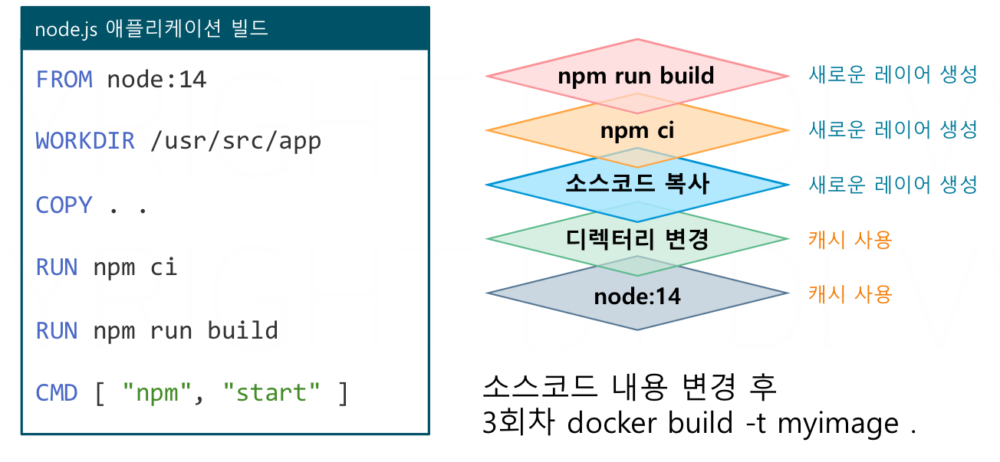
- 전략: **변경되지 않는 레이어들을 아래에 배치**해 캐시 빈도 높이자 (e.g. **라이브러리 설치 레이어**)
		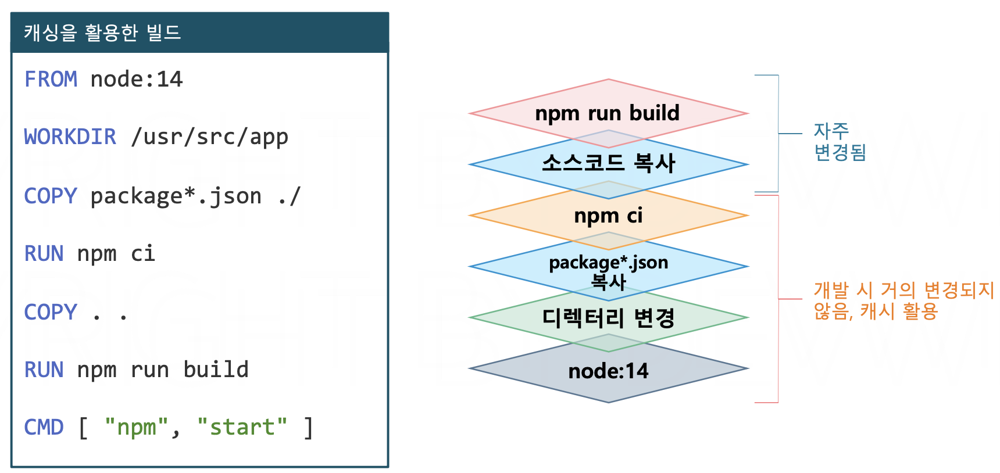

## 3-Tier 아키텍처 구성
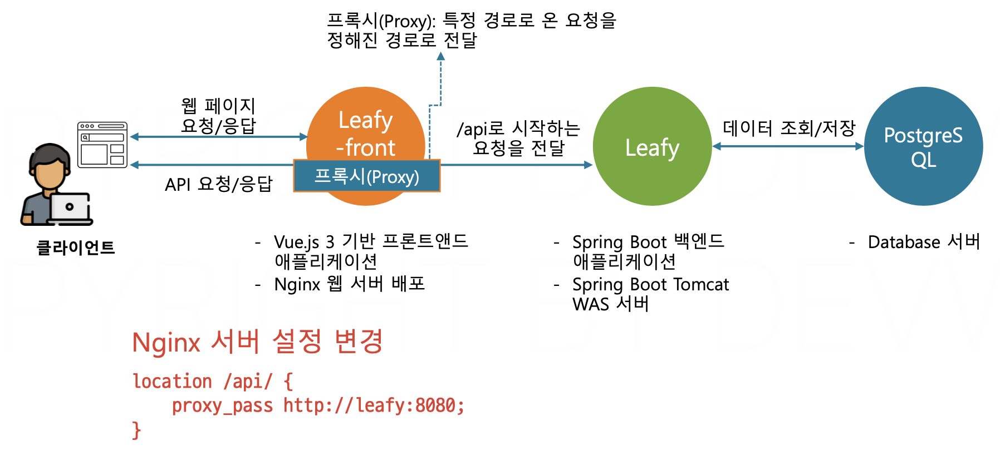
- 문제: 백엔드 API는 프론트만 접근하고 클라이언트에 노출되면 안됨
- 해결책: Nginx **프록시** 기술을 활용해 **보안**이 뛰어난 **3-Tier 아키텍처** 구성 가능
	- 즉, **클라이언트는 웹서버만 접근 가능하고 백엔드 애플리케이션 접근은 불가능**
	- Nginx 프록시는 **특정 경로로 온 요청**을 **지정한 서버로 전달** (by Nginx 서버 설정)
	- 보안 향상, 부하 관리, API 응답 캐시 등 가능
	- e.g. `/api/` 경로로 온 요청을 애플리케이션 서버로 전달하도록 Nginx 서버 설정한 경우
		- `http://localhost/index.html` -> 웹서버의 **정적 파일**을 응답
		- `http://localhost/api/~` -> 애플리케이션으로 요청 전달 (**데이터 접근**)

## DB 이중화
- DB 서버의 **고가용성**을 위해 적용
- 방법
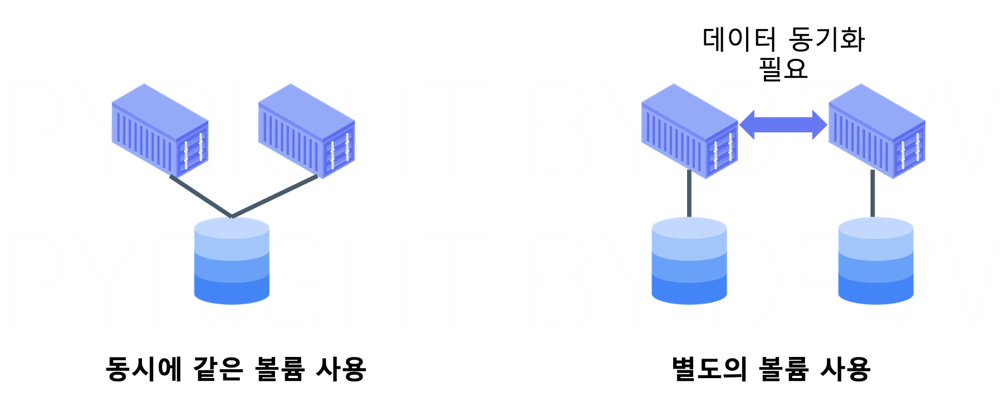
	- **동시에 같은 볼륨 사용하기**
		- **구성이 간단**하지만 불륨의 문제가 생기면 대처하기 어려움
		- **볼륨 성능에 부하**가 발생할 수 있음
	- **컨테이너마다 별도의 볼륨 사용하기**
		- **데이터 동기화 처리**를 별도로 해야 함
		- 동기화 방법 (DB 서버가 제공)
			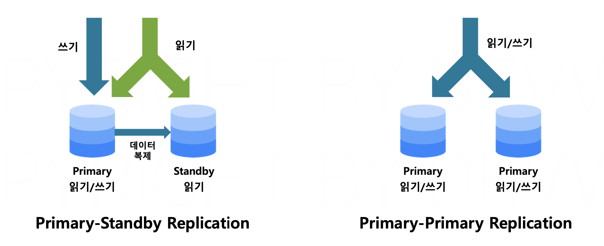
			- Primary-Standby Replication
				- **하나의 Primary 서버**에 여러 Standby 서버를 연결
				- **Primary 서버**는 읽기/**쓰기**, Standby 서버는 읽기만 가능
				- **쓰기**가 실행되면 데이터는 **즉시 Standby 서버로 복제됨**
			- Primary-Primary Replication
				- **모든 DB 서버는 Primary 서버**
				- 모든 서버가 **읽기/쓰기 가능**
				- 여러 서버에서 쓰기가 일어나므로, **동기화 구성 작업이 조금 더 복잡**

## 컨테이너 애플리케이션 리소스 최적화
- 도커는 가상화 기술이므로 **컨테이너마다 사용 가능 리소스를 제한 가능**
- 적정 리소스량은 **운영 경험**과 **테스트**를 통해 결정
- 사용량 초과 시
	- CPU limit 초과 -> CPU 스로틀링 발생 -> **애플리케이션의 성능 저하** 발생
		- CPU 스로틀링: 시스템이 애플리케이션의 CPU 사용을 제한
	- Memory limit 초과 -> OOM(Out of Memory) Killer 프로세스 실행 -> **컨테이너 강제 종료**
- 자바 가상 머신 (JVM) 튜닝
	- JVM의 메모리 중 **힙 메모리**는 **애플리케이션 사용량 증감**에 가장 큰 영향을 받음
		- 보통 전체 **서버 메모리의 50~80%로 설정** (자바 실행시 설정)
		- e.g. `java -jar -Xmx=4G app.jar` (힙 메모리 최대값을 4G로 지정)
	- **자바 힙 메모리 자동 설정**
		```Dockerfile
		# JVM 튜닝을 위한 환경변수 추가
		ENV JAVA_OPTS="-XX:+UnlockExperimentalVMOptions -XX:+UseCGroupMemoryLimitForHeap"
		```
		- **컨테이너 메모리 변경**에 맞게 애플리케이션 실행 시 **자바 최대 힙 메모리를 자동 조정**
		- 자바 기능
			- **자바 10버전 이상**은 **기본 활성화**
				- 애플리케이션 시작 시 `-Xmx` 옵션을 지정하면 자동조정은 없음
			- 자바 10버전 미만일 경우 도커파일에 해당 옵션 지정

## 컨테이너 내 IDE 개발환경 구성하기
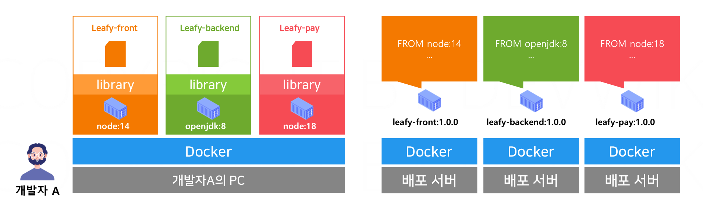
- 컨테이너 내부에 IDE 개발환경을 구성하는 것의 장점
	- **로컬 PC**에 라이브러리나 런타임 설치 없이 **깔끔하게 유지** 가능
		- 개발자 한 명이 여러 프로젝트에 참여할 때, **개발 PC를 도커만 설치된 상태로 깔끔하게 관리**
	- **개발자들의 개발 환경**을 **일관적으로 유지**하고 **표준화** 가능
		- 같은 프로젝트를 개발하는 팀원끼리 **설정 차이로 발생하는 문제를 예방**
- VSCode
	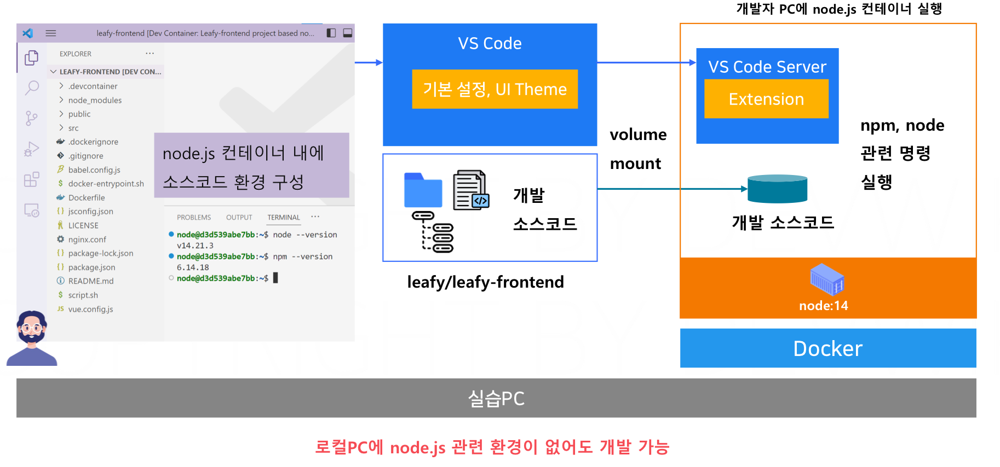
	- **컨테이너 내부**에서 **VSCode를 실행**해 사용 가능
	- 개발용 컨테이너 내 소스코드는 볼륨을 사용해 **Host OS의 실제 소스코드를 마운트**
	- 방법
		- 익스텐션 설치하기
			- Docker (MicroSoft)
			- Dev Containers (MicroSoft)
		- `.devcontainer` 디렉터리 생성
			- `devcontainer.json` : VSCode가 새로운 개발환경을 만들 때 사용하는 파일
				- `name` : 개발 환경의 이름
				- `dockerFile` : 개발 환경 구성에 필요한 도커 파일 이름
				- `forwardPorts` : `docker run` 의 `-p` 옵션과 동일
				- `customizations` : 개발 환경 내 VSCode 실행 시 적용할 extension, 세팅 정보 등을 설정
				- `postCreateCommand` : 컨테이너 생성 후 실행할 커맨드 입력 (도커파일 `CMD`)
				- `remoteUser` : 컨테이너 안에서 사용할 기본 사용자 지정
			- `Dockerfile` : 개발을 수행할 컨테이너 정의
		- 명령어 팔레트에서 `Dev Containers: Open Folder in Container` 실행
- IntelliJ (유료 버전만 가능)
	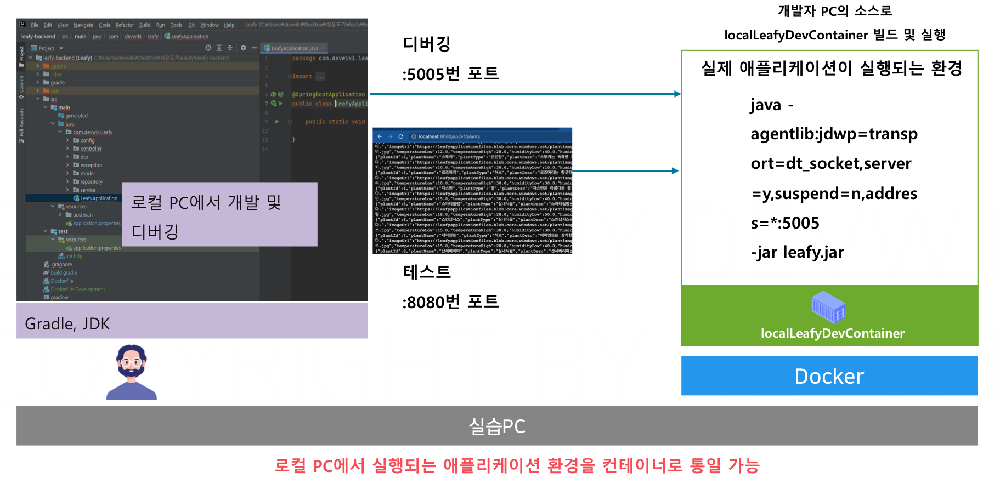
	- VSCode와 달리 **로컬 PC에서 IntelliJ를 실행** (애플리케이션 실행 및 디버깅에만 컨테이너 활용)
		- 소스코드와 도커파일을 사용해 자바 실행 이미지를 빌드하고 실행
	- JDK 버전 별 사용이 편리하기 때문에, 완전한 컨테이너 환경 내 개발이 아니어도 보완이 됨
		- **로컬 PC가 완전히 클린하진 않지만**, **개발자들의 개발 환경 일관성 유지**가 가능
	- **`Run/Debug Configuration`** 을 생성해서 컨테이너 내 개발환경 구성
		- 실행 버튼
			- **자동으로 `docker build`로 이미지를 빌드하고 `docker run`으로 컨테이너를 실행**
		- 디버그 모드
			- JDK는 기본적으로 디버깅 기능을 제공하나
			- 컨테이너에서 실행중인 애플리케이션을 디버깅하려면 **원격 디버깅 기능** 사용해야 함
	- 방법
		- `IntelliJ IDEA` - `Settings` - `Plugins` -> 검색으로 `Docker` 확장 설치
		- 상단 `Edit configurations` - `Run/Debug Configurations` 진입
		- 실행 환경 추가
			- `Add New Configurations` -> `Dockerfile` 선택해 설정 생성
			- IntelliJ와 연동할 도커 데몬 선택 : `Server` 옆 `...` -> `Name` 및 `Docker for Mac` 지정
			- `Dockerfile` : 이미지 빌드에 사용할 도커 파일 경로 지정 (기본값으로 두기)
			- `Image tag` : 빌드될 이미지의 태그 지정 (e.g. `dev`)
			- `Container name` : 빌드된 이미지를 사용해 실행할 컨테이너의 이름 지정
			- `Add Run Options`로 옵션 추가 가능
				- e.g. `Port Binding` = `-p` -> `8080:8080`
				- e.g. `Environment variables` = `-e` -> `DB_URL=postgres`
				- e.g. `Run Options` -> `--network leafy-network`
		- Debug 환경 추가 (기본 5005번 포트로 자바가 원격 디버깅)
			- `Add New Configurations` -> `Remote JVM Debug` 선택해 설정 생성
			- `Name` 지정 (e.g. `LocalDevContainerDebug`)
			- `Before Launch` - `+` - `Run Another Configuration` - 앞서 만든 컨테이너 실행 환경 지정
			- 앞서 만든 컨테이너 실행 환경에 `Add Run Options` 추가
				- 포트 포워딩 `5005:5005` 추가
				- `Command` - `-agentlib:jdwp=transport=dt_socket,server=y,suspend=n,address=*:5005 -jar leafy.jar` 추가 (자바 애플리케이션을 디버깅 용으로 시작하는 옵션)

## DevOps & CI/CD & Github Actions
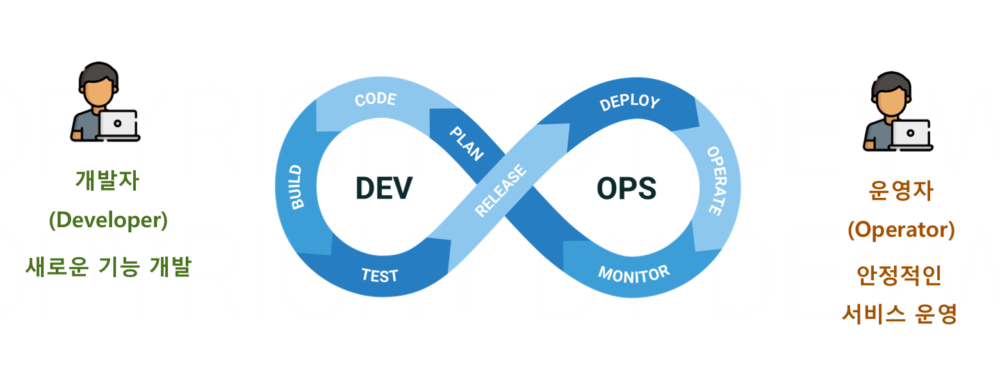
- DevOps의 목표는 개발 환경과 운영 환경의 차이를 줄여 서비스의 퀄리티를 높이고자 함
	- 컨테이너, CI/CD, 자동화, MSA, IaC 등이 DevOps가 지향하는 기술
- **CI/CD 파이프라인**
	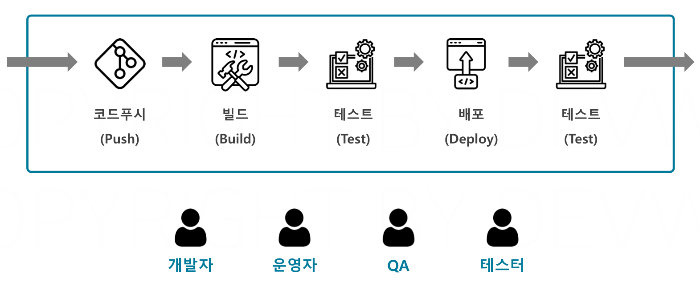
	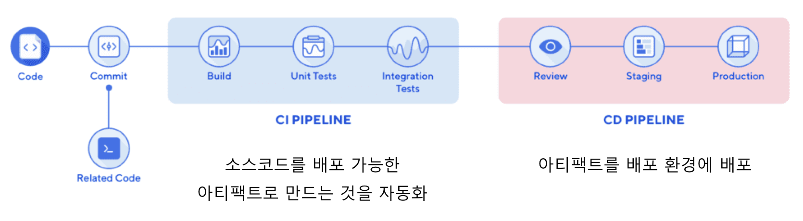
	- 소스코드에서 배포 환경 관리까지의 **모든 프로세스**를 **자동화**하는 것 (소스코드가 물처럼 흘러감)
	- **파이프라인이 없을 경우**의 단점
		- 사람이 직접 빌드 및 배포 수행하여 **휴먼 에러** 및 **표준화의 어려움**이 발생
			- 자동화 이전에는 각각의 단계를 개발자, 운영자, QA, 테스터가 따로 진행했음
		- **배포 시간이 매우 길어지고 복잡**
	- CI(Continuous Integration): 지속적 통합, 배포가능한 **아티팩트(Jar/Image)를 빌드**하는 단계
		- e.g. 컨테이너 환경이라면 이미지를 빌드하고 푸시하는 단계의 자동화
	- CD(Continuous Deployment) : 지속적 배포, 실제 환경에 **아티팩트를 배포**하는 단계
- **GitHub Actions**
	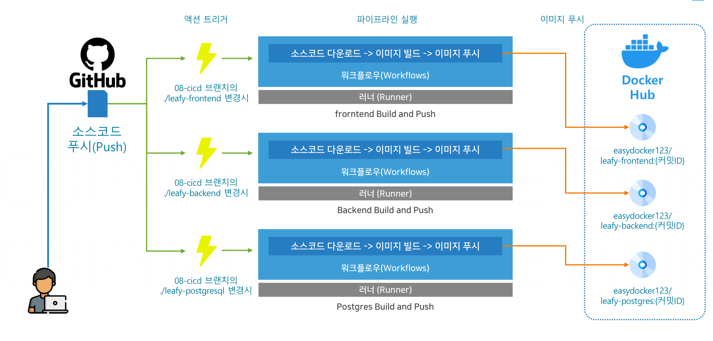
	- **파이프라인을 구성하고 자동화**할 수 있는 GitHub 제공 기술
	- 빌드용 서버를 빌려주므로 **별도의 서버 없이 쉽게 파이프라인을 실행**할 수 있음
	- 방법
		- GitHub에 소스코드를 푸시하면 GitHub Actions에서 CI/CD 자동 실행
		- **`.github/workflows`의 yml 파일**을 GitHub이 **자동으로 인식**해서 파이프라인 **실행**
	- 용어
		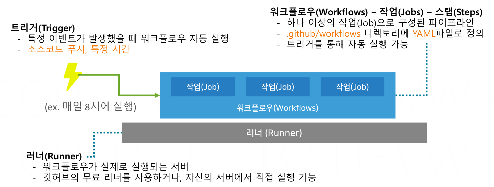
		- **러너**(Runner) : 파이프라인(워크플로우)이 실제로 **실행되는 서버**
		- **워크플로우**(Workflow)
			- 서버에서 실행되는 파이프라인의 **실제 작업들**
			- 워크플로우 = 파이프라인 = `.github/workflows` 내 파일 1개
			- 관계
				- 하나의 워크플로우는 여러 개의 **작업**(**Jobs**)으로 이루어짐
				- 하나의 작업은 여러 개의 **스탭**(**Steps**=**Action**)으로 이루어짐
				- **트리거**를 통해 **워크플로우 자동 실행** 가능
		- **트리거**(Trigger) : 조건을 설정해 충족하면 **워크플로우를 자동 실행**
			- e.g. 소스코드 푸시, 특정 시간(매일 8시)...
	- 기본 문법 (YAML 형식)
		- 기본 템플릿
			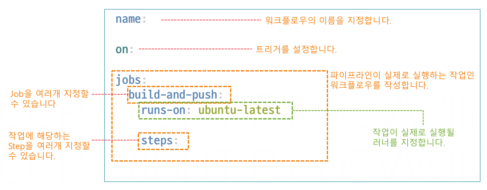
			- `runs-on` : Runner 지정
				- 특별한 경우가 아니면 `ubuntu-latest` 지정
				- 작업마다 러너를 다르게 지정 가능
		- 트리거 문법
			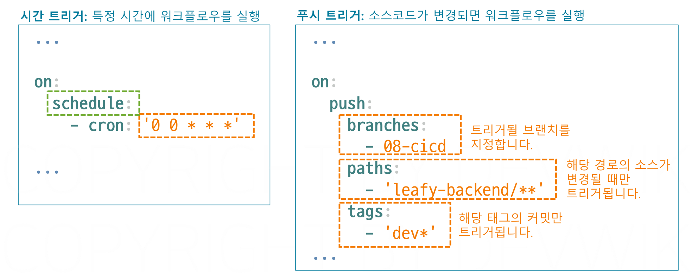
		- 스텝 문법
			- 러너에 소스코드를 다운하기 (소스코드가 필요한 작업의 경우 사용)
				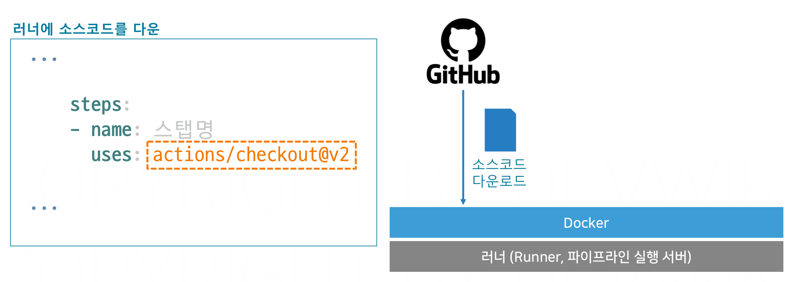
			- 도커 buildx 활성화 (도커 제공 스탭)
				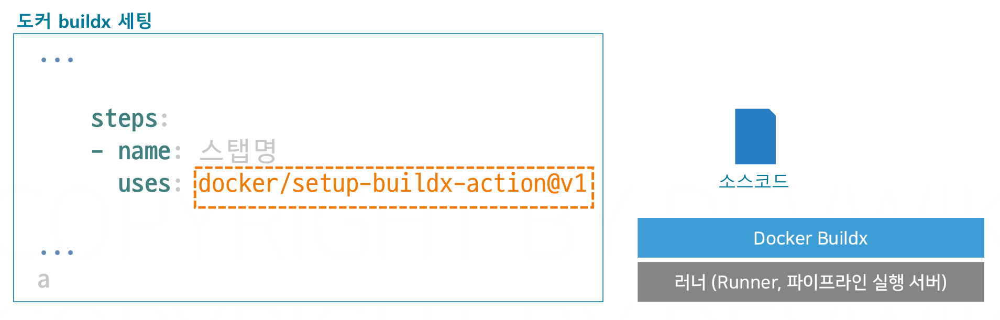
				- 기본 러너에는 도커는 설치되어 있지만, buildx 기능은 비활성화되어 있음
				- buildx를 활성화하면 멀티플랫폼 빌드, 캐싱 등의 기능 제공
			- 도커 로그인 정보 생성 스탭
				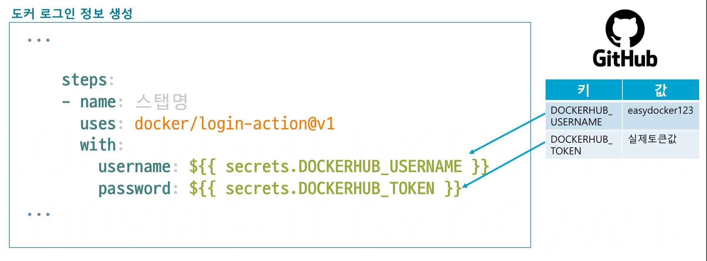
				- 러너에 도커 허브에 접속할 수 있는 로그인 정보 파일 생성
				- 깃허브 시크릿에 키와 값 형태로 저장해 적용
					- `Github`의 프로필의 `Settings` - `Developer Settings` - `Personal access tokens` - `Tokens (classic)` - `Generate new token (classic)` - `scope` (`repo`, `workflow` 선택) - `Generate token`
					- Repo의 `Settings` - `Secrets and variables` - `Actions` - `New Repository Secret`에 키-밸류 쌍 지정
						- `DockerHub`의 `Account Settings` - `Personal access tokens` - `New Access Token` - `permission` 선택 (Read, Write, Delete 혹은 적합한 것) - `Generate Token` - 토큰을 복사해 도커 허브에 로그인하기 위한 토큰으로 사용
			- 도커 빌드 푸시 액션스 (소스코드를 사용해 이미지를 빌드하고 레지스트리에 푸시)
				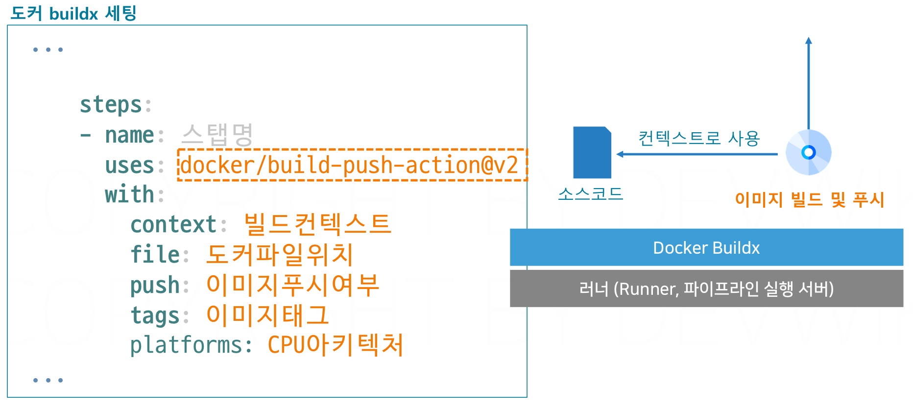
				- 이미지는 CPU 아키텍처가 다르면 실행 불가능
				- buildx를 통해 멀티플랫폼 빌드를 활성화하면, MacOS 이미지도 리눅스에서 사용 가능

***
## Reference
[개발자를 위한 쉬운 도커](https://www.inflearn.com/course/%EA%B0%9C%EB%B0%9C%EC%9E%90%EB%A5%BC-%EC%9C%84%ED%95%9C-%EC%89%AC%EC%9A%B4-%EB%8F%84%EC%BB%A4)