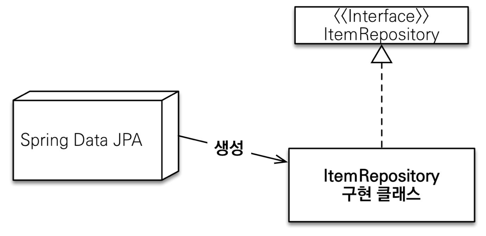

## 스프링 데이터와 스프링 데이터 JPA
- 스프링 데이터 프로젝트
	- **기본 데이터 저장소의 특수성을 유지**하면서 **익숙하고 일관된 Spring 기반 데이터 액세스** 제공을 목표
	- 스프링 데이터 몽고, 스프링 데이터 레디스, 스프링 데이터 JPA 등이 포함
- 패키지 구조
	- `spring-data-commons` 패키지: Spring-Data 프로젝트(몽고, 레디스, JPA) **모두가 공유**
		- e.g. 
			- `Repository`(마커 인터페이스)
			- `CrudRepository`, `PagingAndSortingRepository`
	- `spring-data-jpa` 패키지: **JPA**를 위한 스프링 데이터 저장소 지원
		- e.g. `JpaRepository` 인터페이스, `SimpleJpaRepository` 클래스
- 장점: **유사한 인터페이스로 편하게 개발 가능**
	- DB 변경은 큰 작업이라 거의 일어나지 않으므로, 구현체 교체의 편리함은 장점이 아님

## 공통 인터페이스
- 기본 사용법
	- 임의의 설정 클래스에 `@EnableJpaRepositories` 적용 - **스프링 부트 사용시 생략 가능**
		```java
		@Configuration
		@EnableJpaRepositories(basePackages = "jpabook.jpashop.repository")
		public class AppConfig {}
		```
		- 만약 적용하고자 하는 패키지가 다르다면, `@EnableJpaRepositories`를 적용하자
	- **`JpaRepository`(혹은 부모 인터페이스)를 상속한 인터페이스 만들기**
		- **`@Repository`도 생략 가능** - **스프링 데이터 JPA**가 자동처리 (기본 구현체에 이미 적용)
- 기본 원리
	
	- 애플리케이션 로딩 시 **클래스 스캔** 진행
	- `JpaRepository`~`Repository`를 **상속한 인터페이스를 모두 찾음**
		- `org.springframework.data.repository.Repository`를 상속한 인터페이스를 찾음
	- **스프링 데이터 JPA가 구현 클래스 생성** (프록시 구현체)
	- 이후 필요한 곳에 주입
- **`JpaRepository`** 인터페이스
	- 대부분의 공통 CRUD 제공 
	- 제네릭은 `<엔티티 타입, 식별자 타입(PK)>` 설정
	- 주요 메서드 (상속한 인터페이스 포함)
		- `save(S)` : **새로운 엔티티는 저장**하고 **이미 있는 엔티티는 병합**
		- `delete(T)` : 엔티티 하나를 삭제 (내부에서 `EntityManager.remove()` 호출)
		- `findById(ID)` : 엔티티 하나를 조회 (내부에서 `EntityManager.find()` 호출)
		- `getOne(ID)` : 엔티티를 프록시로 조회 (내부에서 `EntityManager.getReference()` 호출)
		- `findAll(...)` : 모든 엔티티를 조회
			- 정렬 및 페이징 조건을 파라미터로 제공 (`Sort`, `Pageable`)
		- `existsById(ID)`
- **`SimpleJpaRepository`** (기본 구현체)
	```java
	@Repository
	@Transactional(readOnly = true)
	public class SimpleJpaRepository<T, ID> ...{
	    
	    @Transactional
	    public <S extends T> S save(S entity) {
	        if (entityInformation.isNew(entity)) {
	            em.persist(entity);
	            return entity;
	        } else {
	            return em.merge(entity);
			}
		}
		...
	}
	```
	- **`@Repository` 적용**됨
		- 컴포넌트 스캔 처리
		- JPA 예외를 스프링이 추상화한 예외로 변환 
	- **`@Transactional` 적용**됨
		- JPA의 모든 변경은 트랜잭션 안에서 동작
		- **트랜잭션**이 **이미 리포지토리 계층에 걸려있음**
			- 서비스 계층에서 트랜잭션을 시작하지 않으면 **리포지토리**에서 **트랜잭션 시작**
			- **서비스 계층**에서 트랜잭션을 시작하면 리포지토리는 해당 **트랜잭션을 전파** 받아 씀
		- => 스프링 Data JPA의 변경이 가능했던 이유
	- `@Transactional(readOnly = true)`
		- 데이터 **단순 조회 트랜잭션**에서 **플러시를 생략**해 **약간의 성능 향상**
		- 즉, 트랜잭션 종료 시 플러시 작업 제외 (**변경 감지 X**, **DB에 SQL 전달 X**)
	- **`save` 메서드 최적화** 필요 상황 (**중요**)
		- 괜찮은 상황: `@GenerateValue`면 `save()` 호출 시점에 식별자가 없어 `persist()` 호출
		- **문제 상황**: 식별자를 `@Id`만 사용해 **직접 할당**하는 경우
			- 식별자 값이 있는 상태로 `save()`를 호출해, **`merge()`가 호출됨**
		- 새로운 엔터티가 아닐 경우 `merge()`를 진행하는데, **`merge()`는 비효율적이므로 지양해야함**
			- `merge()`: DB에 이미 있는 엔터티라면, SELECT를 실행
			- 새로운 엔터티를 판단하는 기본 전략
				- 식별자가 객체일 때 `null` 로 판단
				- 식별자가 자바 기본타입일 때 `0` 으로 판단
		- **해결책**: `Persistable` 인터페이스를 구현
			```java
			public interface Persistable<ID> {
			    ID getId();
			    boolean isNew();
			}
			```
			- **등록시간(`@CreatedDate`)을 조합해 사용**하면, 새로운 엔티티 여부 편리하게 확인 가능
				```java
				@Entity
				@EntityListeners(AuditingEntityListener.class)
				@NoArgsConstructor(access = AccessLevel.PROTECTED)
				public class Item implements Persistable<String> {
				    
				    @Id
				    private String id;
				    
				    @CreatedDate
				    private LocalDateTime createdDate;
				    
				    public Item(String id) {
				         this.id = id;
					}
				
				    @Override
				    public String getId() {
					     return id;
					}
					
					@Override
				    public boolean isNew() {
				        return createdDate == null;
				    }
				}
				```
				- `@CreatedDate`에 값이 없으면 새로운 엔티티로 판단
## 쿼리 메서드
- 전략
	- **2개 정도 파라미터까지만 메서드 이름으로 쿼리 생성해 해결하자**
	- 더 길어지면 **`@Query`로 JPQL 직접 정의**해 풀자
- 스프링 데이터 JPA의 쿼리 메서드 탐색 전략
	1. `도메인 클래스 + .(점) + 메서드 이름`으로 Named Query를 찾음
		- `JpaRepository` 상속 시 제네릭으로 설정한 도메인 클래스
		- 인터페이스에 정의한 메서드 이름
	2. 없으면 메서드 이름으로 쿼리 생성
- 3가지 방법
	- **메서드 이름으로 쿼리 생성** (기본)
		- 규칙
			- `...`은 식별하기 위한 내용(설명)이므로 무엇이 들어가도 상관 없음
				- e.g. `findHelloBy` 처럼 `...`에 식별하기 위한 내용(설명)이 들어가도 됨
			- `By` 뒤에 원하는 속성과 조건을 입력하면 `where` 절로 간주
			- SQL에 들어갈 파라미터는 메서드의 파라미터로 받음 
		- 기본 제공 기능
			- 조회: `find...By`, `read...By`, `query...By`, `get...By`
			- COUNT: `count...By` 반환타입 `long`
			- EXISTS: `exists...By` 반환타입 `boolean`
			- 삭제: `delete...By`, `remove...By` 반환타입 `long` 
			- DISTINCT: `findDistinct`, `findMemberDistinctBy`
			- LIMIT: `findFirst3`, `findFirst`, `findTop`, `findTop3`
		- 장점
			- **엔터티 필드명을 변경**하면 메서드 이름도 변경해야 하는데, **컴파일 오류를 통해 인지 가능**
	- 메서드 이름으로 JPA NamedQuery 호출 (거의 사용 X)
		- 사용법
			- 엔터티에 정의된 JPA `@NamedQuery`의 `name`으로 메서드 이름 설정
		- 장점: 타입 안정성이 높음 (미리 정의된 정적 쿼리를 파싱을 통해 체크)
		- 단점: 엔터티에 쿼리가 있는 것도 좋지 않고, `@Query`가 훨씬 강력함
	- **`@Query` 적용** (**자주 사용**)
		- 인터페이스 메서드에 **JPQL 쿼리 직접 정의** 가능
		- 사용법
			- 하나의 값 조회
				```java
				@Query("select m.username from Member m")
				List<String> findUsernameList();
				```
			- DTO 직접 조회
				```java
				@Query("select new study.datajpa.dto.MemberDto(m.id, m.username, t.name) " +
				         "from Member m join m.team t")
				List<MemberDto> findMemberDto();
				```
			- 파라미터 바인딩
				```java
				@Query("select m from Member m where m.username = :name")
				Member findMembers(@Param("name") String username);
				```
				- **이름 기반 바인딩**을 하자 (위치 기반 바인딩 지양)
				- e.g. **`:name`** <-> **`@Param("name") `**
			- 컬렉션 파라미터 바인딩
				```java
				@Query("select m from Member m where m.username in :names")
				List<Member> findByNames(@Param("names") List<String> names);
				```
				- `Collection` 타입으로 in절 지원
		- 장점
			- **타입 안정성**이 높음
				- **정적 쿼리**라서 틀리면 애플리케이션 시작 시점에 **컴파일 에러**
				- 이름없는 Named 쿼리라 할 수 있다!
- 반환 타입
	- 스프링 데이터 JPA는 **반환 타입에 따라 `getSingleResult()` 혹은 `getResultList()` 등을 호출**
		```java
		List<Member> findByUsername(String name); //컬렉션 
		Member findByUsername(String name); //단건
		Optional<Member> findByUsername(String name); //단건 Optional
		```
		- **단건 조회** 결과가 있을지 없을지 모르겠다면 **Optional** 사용하자!!
	- 조회 결과가 많거나 없으면?
		- 컬렉션
			- 결과 없음: 빈 컬렉션 반환 
		- 단건 조회
			- 결과없음: `null` 반환
				- JPA는 `NoResultException` 발생, 스프링 데이터 JPA는 try~catch로 감싼 것
			- 결과가 2건 이상: `javax.persistence.NonUniqueResultException` 예외 발생
				- 결국엔 스프링 예외 `IncorrectResultSizeDataAccessException`로 변환됨
	- 참고: **단건 조회 결과 Best Practice**
		- 자바 8 **이전**: **단건 조회의 결과가 없는 경우**, 예외가 나은지 null이 나은지는 논란
			- => 결론: 실무에서는 **null**이 낫다!
		- **자바 8 이후**
			- => DB에서 조회했는데 데이터가 있을지 없을지 모르면 **그냥 Optional을 써라!!!**
- **페이징과 정렬**
	- 파라미터
		- `Sort` : 정렬 기능
		- `Pageable` : 페이징 기능 (내부에 `Sort` 포함)
	- 반환 타입
		- `Page` : 페이징 (+ 추가 **count 쿼리** 결과 포함)
			- **실무**에서 **최적화**가 가능하다면 최대한 **카운트 쿼리를 분리**해 사용 (e.g. 조인 줄이기)
			- 참고: **Count 쿼리는 매우 무거움**
				```java
				@Query(value = "select m from Member m",
				        countQuery = "select count(m.username) from Member m")
				Page<Member> findMemberAllCountBy(Pageable pageable);
				```
		- `Slice` : 페이징 - **다음 페이지만 확인 가능** (내부적으로 limit + 1 조회), **무한 스크롤** 용도
		- `List`: 페이징 - 조회 데이터만 반환
	- 예제 1 - 반환 타입 사용법
		```java
		//count 쿼리 O
		Page<Member> findByUsername(String name, Pageable pageable);
		
		//count 쿼리 X
		Slice<Member> findByUsername(String name, Pageable pageable); 
		
		//count 쿼리 X
		List<Member> findByUsername(String name, Pageable pageable);
		
		List<Member> findByUsername(String name, Sort sort);
		```
	- 예제 2 - `Pageable`, `Sort` 파라미터 사용법
		```java
		PageRequest pageRequest = PageRequest.of(0, 3, Sort.by(Sort.Direction.DESC, "username"));
		Page<Member> page = memberRepository.findByAge(10, pageRequest);
		```
		- `Pageable`의 **구현체 `PageRequest` 객체를 생성해 전달**
		- `PageRequest` 생성자 파라미터
			- 첫 번째: 현재 페이지 (**0부터 시작**)
			- 두 번째: 조회할 데이터 수
			- 추가: 정렬 정보 (`Sort`)
	- 예제 3 - **페이지를 유지**하면서 **엔터티를 DTO로 변환**하기
		```java
		Page<Member> page = memberRepository.findByAge(10, pageRequest);
		Page<MemberDto> dtoPage = page.map(m -> new MemberDto());
		```
	- 주요 메서드
		- `Page` (`Slice`를 상속 받았으므로, `Slice`의 메서드도 사용 가능)
			- `getTotalPages();`: 전체 페이지 수
			- `getTotalElements();`: 전체 데이터 수
			- `map(Function<? super T, ? extends U> converter);`: 변환기
		- `Slice`
			- `getNumber()`: 현재 페이지
			- `getSize()`: 페이지 크기
			- `getNumberOfElements()`: 현재 페이지에 나올 데이터 수
			- `getContent()`: 조회된 데이터
			- `hasContent()`: 조회된 데이터 존재 여부
			- `getSort()`: 정렬 정보
			- `isFirst()`: 현재 페이지가 첫 페이지 인지 여부
			- `isLast()`: 현재 페이지가 마지막 페이지 인지 여부
			- `hasNext()`: 다음 페이지 여부
			- `hasPrevious()`: 이전 페이지 여부
			- `getPageable()`: 페이지 요청 정보
			- `nextPageable()`: 다음 페이지 객체
			- `previousPageable()`: 이전 페이지 객체
			- `map(Function<? super T, ? extends U> converter)`: 변환기
- **벌크성 수정, 삭제 쿼리** (**`@Modifying`**)
	- JPA의 **`executeUpdate()`** 를 대신 실행 (**벌크성 수정 및 삭제**)
		- `@Modifying`이 있으면 `executeUpdate()`를 실행
		- 없으면, `getSingleResult()` 혹은 `getResultList()` 등을 실행
	- **`@Modifying(clearAutomaically = true)`** - 기본값은 `false`
		- 벌크성 쿼리 실행 후, **영속성 컨텍스트 자동 초기화**
		- 벌크 연산 이후에는 조회 상황을 대비해, **영속성 컨텍스트 초기화 권장**
	- 예제
		```java
		@Modifying
		@Query("update Member m set m.age = m.age + 1 where m.age >= :age")
		int bulkAgePlus(@Param("age") int age);
		```
		- 이 경우, `@Modifying`이 없다면 다음 예외 발생
		- `org.hibernate.hql.internal.QueryExecutionRequestException: Not supported for DML operations`
- 엔터티 그래프 (Entity Graph)
	- **페치 조인**의 **간편 버전**
	- 예제
		```java
		//공통 메서드 오버라이드
		@Override
		@EntityGraph(attributePaths = {"team"}) List<Member> findAll();
		
		//JPQL + 엔티티 그래프 
		@EntityGraph(attributePaths = {"team"}) @Query("select m from Member m") List<Member> findMemberEntityGraph();
		
		//메서드 이름으로 쿼리에서 특히 편리하다. 
		@EntityGraph(attributePaths = {"team"})
		List<Member> findByUsername(String username)
		```
	- NamedEntityGraph (거의 안씀)
		- 엔터티에 엔터티 그래프를 미리 등록해두고 불러와 쓰는 방법
			```java
			@NamedEntityGraph(name = "Member.all", attributeNodes =
			@NamedAttributeNode("team"))
			@Entity
			public class Member {}
			
			@EntityGraph("Member.all")
			@Query("select m from Member m")
			List<Member> findMemberEntityGraph();
			```
	- 전략
		- **간단한 쿼리**는 **`@EntityGraph`로 처리**
		- **복잡한 쿼리**는 **JPQL로 페치조인** 처리
			- e.g. `@Query("select m from Member m left join fetch m.team")`
- JPA Hint
	- **JPA 쿼리 힌트** (SQL 힌트가 아니라 **JPA 구현체**에게 제공하는 힌트)
	- 쿼리 힌트는 `readOnly` 정도 말고는 잘 안씀
		- 사실, `readOnly`도 잘 안씀
		- 정말 트래픽이 많을 때 쓸 해결책이 아니다
		- **성능 테스트**를 해서 **정말 중요하고 트래픽 많은 API 몇 개에만 적용 고려**
	- 예제 1 - ReadOnly
		```java
		@QueryHints(value = @QueryHint(name = "org.hibernate.readOnly", value = "true"))
		Member findReadOnlyByUsername(String username);
		```
		- `readOnly` - 하이버네이트 종속 기능 (JPA X)
			- 변경이 없다고 생각하고 1차캐시에 스냅샷을 만들지 않도록 최적화 (-> 변경감지 없음)
			- 조회용이라면 스냅샷이 필요없음
				- 변경 감지는 메모리를 더 사용해 비용이 큼 (원본 객체 + 복제본 스냅샷 객체)
	- 예제 2 - Count 쿼리 힌트 추가
		```java
		@QueryHints(value = { @QueryHint(name = "org.hibernate.readOnly",
		                                  value = "true")},
		             forCounting = true)
		Page<Member> findByUsername(String name, Pageable pageable);
		```
		- `forCounting` (기본값: `true`)
			- `Page` 반환 시, 페이징을 위한 카운트 쿼리에도 동일한 쿼리 힌트를 적용할지 여부 선택
- Lock
	- 예제 - 비관적 락 (Pessimistic Lock = `select ... for update`)
		```java
		@Lock(LockModeType.PESSIMISTIC_WRITE)
		List<Member> findByUsername(String name);
		```
	- **실시간 트래픽이 많은 서비스**는 가급적 **락을 거는 것을 지양**하자
		- **Optimistic Lock**으로 해결하거나 **락을 안걸고 다른 방법으로 해결**하는 쪽을 권장
		- **Pessimistic Lock**은 실시간 트래픽보다 **정확도가 중요한 서비스**에서 좋은 방법
			- e.g. 돈을 맞춰야 하는 서비스

## 사용자 정의 리포지토리 (매우 중요)
- 인터페이스에 **메서드를 직접 구현하고 싶을 때** 사용
	- 인터페이스 구현체 직접 구현 시 문제
		- 스프링 데이터 JPA는 인터페이스만 정의 후 구현체가 자동 생성
		- 직접 구현체 생성하기에는 **오버라이드해야 할 메서드가 너무 많음**
	- 사용자 정의 리포지토리 사용 이유
		- **스프링 JDBC Template 사용**, MyBatis 사용
		- JPA 직접 사용(`EntityManager`), 데이터베이스 커넥션 직접 사용 등등...
		- **Querydsl 사용**
- 사용자 정의 리포지토리를 사용하지 않고 **쿼리용 리포지토리를 따로 나누는 것도 좋은 전략!** (CQRS)
- 사용 방법
	- 규칙
		- 방법 1: 리포지토리 인터페이스 명 + `Impl`
		- 방법 2: **사용자 정의 인터페이스 명** + `Impl` (**권장**, 스프링 데이터 2.X~)
		- => 스프링 데이터 JPA가 **인식**해서 **스프링 빈으로 등록**
	- **사용자 정의 인터페이스** 작성
		```java
		public interface MemberRepositoryCustom {
		    List<Member> findMemberCustom();
		}
		```
	- 사용자 정의 인터페이스 **구현 클래스** 작성
		- 방법 1: `MemberRepository` + `Impl`
			```java
			@RequiredArgsConstructor
			public class MemberRepositoryImpl implements MemberRepositoryCustom {
			    
			    private final EntityManager em;
			    
			    @Override
			    public List<Member> findMemberCustom() {
			        return em.createQuery("select m from Member m")
			                .getResultList();
				}
			}
			```
		- 방법 2: `MemberRepositoryCustom` + `Impl` (**권장**)
			```java
			@RequiredArgsConstructor
			public class MemberRepositoryCustomImpl implements MemberRepositoryCustom {
			    
			    private final EntityManager em;
			    
			    @Override
			    public List<Member> findMemberCustom() {
			        return em.createQuery("select m from Member m")
			                .getResultList();
				} 
			}
			```
	- 사용자 정의 인터페이스 **상속**
		```java
		public interface MemberRepository
		        extends JpaRepository<Member, Long>, MemberRepositoryCustom {
		}
		```

## Auditing (실무 자주 사용)
- 실무 케이스
	- 실무에서 **등록일, 수정일**은 DB **모든 테이블**에 깔고 감
	- **관리자**가 있다면 **로그인한 ID를 기준**으로 **등록자, 수정자**도 필요한 테이블에 둠
- 순수 JPA 구현
	```java
	@MappedSuperclass
	@Getter
	public class JpaBaseEntity {
	    
	    @Column(updatable = false)
	    private LocalDateTime createdDate;
	    private LocalDateTime updatedDate;
	
		@PrePersist
	    public void prePersist() {
	        LocalDateTime now = LocalDateTime.now();
	        createdDate = now;
	        updatedDate = now;
		}
		
	    @PreUpdate
	    public void preUpdate() {
	        updatedDate = LocalDateTime.now();
	    }
	
	}

	public class Member extends JpaBaseEntity {}
	```
	- JPA 주요 이벤트 어노테이션
		- `@PrePersist`, `@PostPersist `
		- `@PreUpdate`, `@PostUpdate`
- **스프링 데이터 JPA**
	- 설정
		- **`@EnableJpaAuditing`** -> **스프링 부트 설정 클래스**에 적용해야 함
		- **`@EntityListeners(AuditingEntityListener.class)`** -> **엔터티**에 적용
	- **`AuditorAware`** 스프링 빈 등록 (**등록자, 수정자 처리**)
		```java
		@EnableJpaAuditing
		@SpringBootApplication
		public class DataJpaApplication {
		
			public static void main(String[] args) {
				SpringApplication.run(DataJpaApplication.class, args);
			}
			
			@Bean
			public AuditorAware<String> auditorProvider() {
				return () -> Optional.of(UUID.randomUUID().toString());
			}
		
		}
		```
		- 실무에서는 **세션 정보**나, 스프링 시큐리티 **로그인 정보**에서 **ID**를 받음
	- **엔터티 적용**
		```java
		@EntityListeners(AuditingEntityListener.class)  
		@MappedSuperclass
		@Getter
		public class BaseTimeEntity {
		    
		    @CreatedDate
		    @Column(updatable = false)
		    private LocalDateTime createdDate;
		    
		    @LastModifiedDate
		    private LocalDateTime lastModifiedDate;
		
		}
		
		@EntityListeners(AuditingEntityListener.class)  
		@MappedSuperclass
		@Getter
		public class BaseEntity extends BaseTimeEntity {
		
			@CreatedBy
		    @Column(updatable = false)
		    private String createdBy;
		    
		    @LastModifiedBy
		    private String lastModifiedBy;
		
		}
		
		public class Member extends BaseEntity {}
		```
		- 적용 애노테이션
			- `@CreatedDate`, `@LastModifiedDate`, `@CreatedBy`, `@LastModifiedBy`
		- **Base 타입을 분리**하고, 원하는 타입을 **선택해서 상속**
			- 실무에서 대부분의 엔티티는 등록시간, 수정시간이 필요
			- 등록자, 수정자는 필요한 곳도 있고 아닌 곳도 있음
		- 저장시점에는 등록일-수정일, 등록자-수정자에 같은 데이터 저장 (**유지보수 관점에서 편리**)
	- 선택사항) `@EntityListeners(AuditingEntityListener.class)` 생략하기
		- 스프링 데이터 JPA가 제공하는 이벤트를 **엔티티 전체에 적용**
		- `META_INF / orm.xml`
			```xml
			<?xml version="1.0" encoding="UTF-8"?>
			<entity-mappings xmlns="http://xmlns.jcp.org/xml/ns/persistence/orm"
			                 xmlns:xsi="http://www.w3.org/2001/XMLSchema-instance"
			                 xsi:schemaLocation="http://xmlns.jcp.org/xml/ns/persistence/orm
			 http://xmlns.jcp.org/xml/ns/persistence/orm_2_2.xsd"
			                 version="2.2">
			    
			    <persistence-unit-metadata>
			        <persistence-unit-defaults>
			            <entity-listeners>
			                <entity-listener class="org.springframework.data.jpa.domain.support.AuditingEntityListener"/>
			            </entity-listeners>
			        </persistence-unit-defaults>
			    </persistence-unit-metadata>
			</entity-mappings>
			```

## Web 확장
- **페이징과 정렬**
	```java
	@GetMapping("/members")
	public Page<Member> list(Pageable pageable) {...}
	```
	- **파라미터**로 **`Pageable`**, **반환 타입**으로 **`Page`** 사용 가능
		- 파라미터로 구현체인 `PageRequest`가 생성되어 전달됨
	- 요청 예시: `/members?page=0&size=3&sort=id,desc&sort=username,desc`
		- page: 현재 페이지, **0부터 시작**
		- size: 한 페이지에 노출할 데이터 건수
		- sort: 정렬 조건 정의 예) 정렬 속성,정렬 속성...(ASC | DESC), 정렬 방향을 변경하고 싶으면 `sort` 파라 미터 추가 ( `asc` 생략 가능)
	- **기본값** 설정하기
		- 글로벌 설정 (스프링 부트)
			- `spring.data.web.pageable.default-page-size=20 # 기본 페이지 사이즈`
			- `spring.data.web.pageable.max-page-size=2000 # 최대 페이지 사이즈`
		- 개별 설정 (`@PageableDefault`)
			- `public String list(@PageableDefault(size = 12, sort = "username", direction = Sort.Direction.DESC) Pageable pageable)`
	- **둘 이상의 페이징 정보**는 **접두사**로 구분 가능
		- `@Qualifier` 에 접두사명 추가 "{접두사명}\_xxx"
		- 예제: `/members?member_page=0&order_page=1`
			- `@Qualifier("member") Pageable memberPageable,`
			- `@Qualifier("order") Pageable orderPageable,`
	- `Page` 내용을 **DTO로 변환하기** (API 스펙에 엔터티 노출하지 않기)
		```java
		public Page<MemberDto> list(Pageable pageable) {
		    return memberRepository.findAll(pageable).map(MemberDto::new);
		}
		```
		- **`Page.map()`** 으로 변환 가능
	- 참고: **`Page`는 변경 없이 0부터 시작하자**
		- Page를 1부터 시작하는 방법 (불편)
			- 방법 1: 직접 클래스를 만들어서 처리
				- `Pageable`, `Page` 파리미터 및 응답 값 사용 X
				- 직접 `PageRequest` 생성해 리포지토리에 전달, 응답값도 직접 작성
			- 방법 2: `spring.data.web.pageable.one-indexed-parameters = true`
				- 한계: content만 잘나오고, 나머지는 원래 0 인덱스대로 나옴
- 도메인 클래스 컨버터 (실무 사용 거의 없음)
	```java
	@GetMapping("/members/{id}")
	public String findMember(@PathVariable("id") Member member) {...}
	```
	- HTTP 파라미터로 넘어온 엔티티의 아이디로 엔티티 객체를 찾아서 바인딩
	- 자동으로 리포지토리 사용해 엔터티 찾음
	- 간단한 쿼리에만 적용 가능 (트랜잭션이 없으므로 변경이 불가, **단순 조회용**)

## 기타 기능들 - 실무 거의 사용 X
- Specifications (명세) -> **QueryDSL 사용하자!**
	- JPA Criteria 활용해 다양한 검색 조건 조합 기능 지원
- Query By Example -> **QueryDSL 사용하자!
	- 실제 도메인 객체를 활용해 동적 쿼리 처리 (Probe, ExampleMatcher)
	- 실무에 사용하기에는 매칭 조건이 너무 단순하고, Left Join이 안됨
- Projections -> **단순할 때만 사용**하고, 조금만 복잡해지면 **QueryDSL 사용하자!
	- 프로젝션 대상이 **root 엔터티면 유용**
	- 인터페이스 기반 Closed Projections
		- **프로퍼티 형식(getter)의 인터페이스**를 제공하면, 구현체는 스프링 데이터 JPA가 제공
			```java
			public interface UsernameOnly {
			    String getUsername();
			}
			```
			```java
			public interface MemberRepository ... {
			    List<UsernameOnly> findProjectionsByUsername(String username);
			}
			```
	- 클래스 기반 Projections
		```java
		public class UsernameOnlyDto {
		    
		    private final String username;
		    
		    public UsernameOnlyDto(String username) {
		        this.username = username;
			}
			
		    public String getUsername() {
		        return username;
			}
			
		}
		```
	- 인터페이스 기반 Open Projections, 동적 Projections, 중첩구조처리...
- 네이티브 쿼리 (**99% 사용 X**)
	- 예제
		```java
		@Query(value = "select * from member where username = ?", nativeQuery = true)
		Member findByNativeQuery(String username);
		```
	- **권장 해결책**
		- 복잡한 통계 쿼리도 **QueryDSL**로 해결
		- 네이티브 쿼리 DTO 조회는 **별도 리포지토리** 파서 **JDBC template** or **MyBatis** 사용 권장
