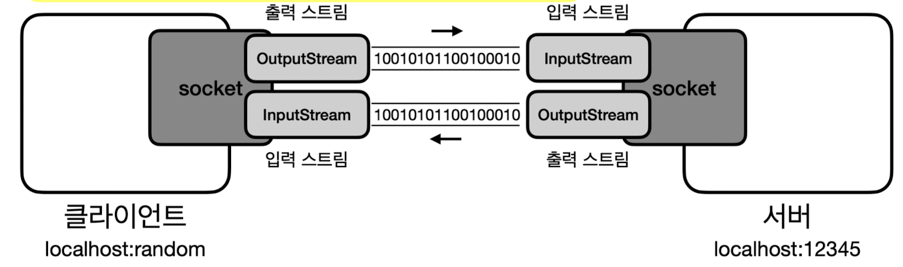
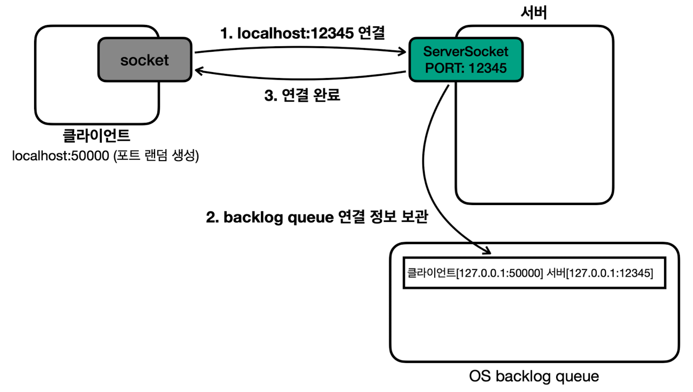
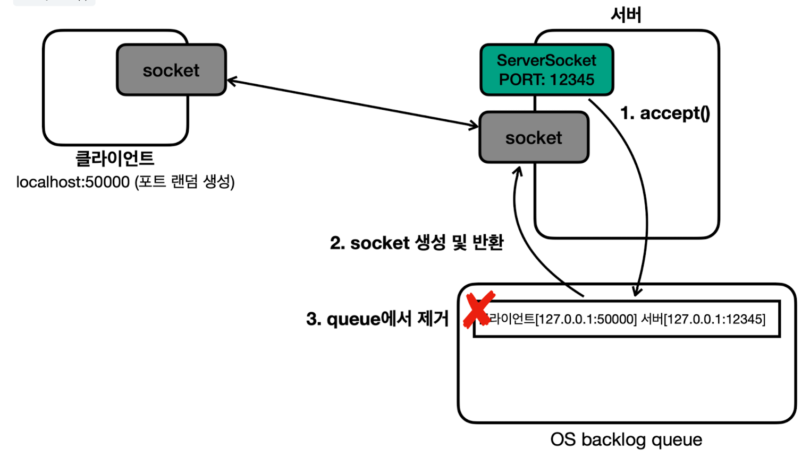
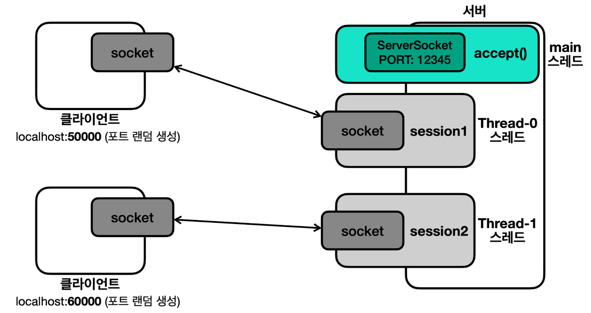
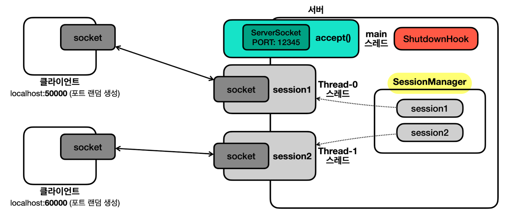
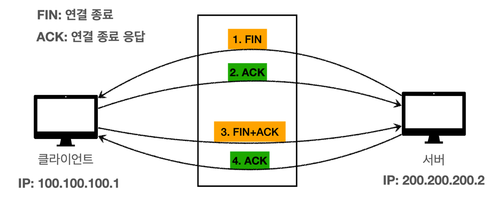
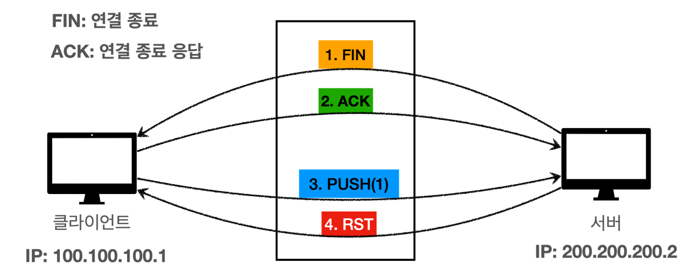

## 컴퓨터 데이터
- 개발하면서 다루는 데이터는 **2가지**
	- **바이너리 데이터** (byte 기반 - e.g. 010101)
	- **텍스트 데이터** (문자 기반 - e.g. "ABC")
- 컴퓨터 메모리
	
	- 컴퓨터 메모리는 **반도체**로 만들어짐 (e.g. RAM)
		- **반도체**: 트랜지스터의 모임 (수 많은 전구들이 모여 있는 것)
		- **트랜지스터**: 아주 작은 전자 스위치 (전구 하나)
			- 전기가 흐르거나 흐르지 않는 **두 가지 상태** 가짐 -> **0 & 1 이진수 표현**
	- **메모리는 단순히 전구를 켜고 끄는 방식으로 작동** -> **컴퓨터는 전구의 상태만 변경 혹은 확인**
		- 컴퓨터는 전구들을 켜고 끄는 방식으로 데이터를 기록하고 읽음
		- 현대 컴퓨터 메모리는 초당 수십억 번의 데이터 접근으로 매우 빠름
- 컴퓨터는 데이터 처리 시 **2진수로 변환해 저장**
	- 10진수 숫자 -> **간단한 공식** -> 2진수
		- e.g. 10진수 100 -> 2진수 `1100100`
	- 문자 -> **문자 집합**(**Character Set**) -> 10진수 -> **간단한 공식** -> 2진수
		- e.g. "A" -> 65 -> `1000001`
- 단위
	- 1비트(bit): **2가지 상태 표현**
	- 1바이트(byte) = 8bit : **256가지** 표현 (**정보를 처리하는 기본 단위**)
		- 음수 표현시 앞의 1비트를 사용 (e.g. 자바의 숫자 타입들)

## 문자 집합 (**Character Set**)
- 사용 전략: 사실상 표준인 **UTF-8을 사용하자**

- 문제: **문자는 2진수로 나타낼 수 없음**
- 해결책: **문자 집합** - 컴퓨터 과학자들이 문자에 숫자를 연결시키는 방법을 고안
	- **문자 인코딩**: 문자 -> **문자 집합**(**Character Set**) -> 10진수 -> **간단한 공식** -> 2진수
	- **문자 디코딩**: 2진수 -> **간단한 공식** -> 10진수 -> **문자 집합**(**Character Set**) -> 문자
- 문자 집합 종류와 역사
	- **ASCII** (American Standard Code for Information Interchange, 1960년도)
		- 각 컴퓨터 회사 간 **호환성 문제 해결**을 위해 개발
		- **7비트**로 128가지 문자 표현
			- 영문 알파벳, 숫자, 키보드 특수문자, 스페이스, 엔터
	- ISO_8859_1 (= `LATIN1` = `ISO-LATIN-1`, 1980년도)
		- **서유럽 문자**를 표현하는 문자 집합 
		- **8비트**(**1byte**)로 256가지 문자 표현
			- ASCII 128가지 + 서유럽 문자, 추가 특수 문자
		- **기존 ASCII와 호환 가능**
	- 한글 문자 집합
		- 특징
			- **한글**을 표현할 수 있는 문자 집합
			- **16비트**(**2byte**)로 65536가지 문자 표현
			- **기존 ASCII와 호환 가능**
				- **ASCII는 1바이트, 한글은 2바이트로 메모리에 저장**
				- 한글은 글자가 많아서 1바이트로 표현 불가
		- EUC-KR (1980년도)
			- **자주 사용하는 한글** 표현
				- ASCII + 자주 사용하는 한글 2350개 + 한국에서 자주 사용하는 기타 글자
		- MS949 (1990년도)
			- 마이크로소프트가 **EUC-KR을 확장**해, **한글 11,172자를 모두 표현**
				- e.g. "쀍", "삡" 등 **모든 초성, 중성, 종성 조합 표현** 가능
			- **EUC-KR과 호환 가능**하고 **윈도우 시스템**에서 계속 사용됨
	- 전세계 문자 집합 (유니코드)
		- 특징
			- **전세계 문자**를 대부분 표현할 수 있는 문자 집합
			- **국제적 호환성**을 위해 개발
				- 특정 언어를 위한 문자 집합이 PC에 설치되지 않으면 글자가 깨짐
				- 한 문서 안에 여러 나라 언어 저장 시에도 문제가 됨
		- UTF-16 (1990년도) - 초반에 인기
			- **16비트**(**2byte**) 기반 
				- 기본 다국어는 2byte로 표현 (영어, 유럽, 한국어, 중국어, 일본어)
				- 그 외는 4byte로 표현 (고대문자, 이모지, 중국어 확장 한자)
			- 큰 단점
				- ASCII 호환 불가
					- 무조건 2바이트로 읽어서 ASCII 영문을 못 읽음 (ASCII 문서가 안열림)
				- 영문의 경우 다른 문자 집합에 비해 2배 메모리 더 사용
					- 웹 문서 80% 이상이 영문 문서라 비효율적
		- **UTF-8** (1990년도)
			- 현대의 **사실상 표준 인코딩** 기술
			- **8비트**(**1byte**) 기반, **가변 길이 인코딩**
				- 1byte: ASCII, 영문, 기본 라틴 문자
				- 2byte: 그리스어, 히브리어 라틴 확장 문자
				- 3byte: 한글, 한자, 일본어
				- 4byte: 이모지, 고대문자등
			- 단점: 일부 언어에서 더 많은 용량 사용
			- 큰 장점
				- **ASCII 호환**
				- **저장 공간 및 네트워크 효율성** (ASCII 문자를 1바이트로 사용)
- **한글이 깨지는** 가장 큰 이유 2가지
	- **EUC-KR**(**MS949**)와 **UTF-8**이 서로 호환되지 않아서
		- **윈도우**에서 저장한 것을 UTF-8로 불러오거나 역인 경우
	- **EUC-KR(MS949) 혹은 UTF-8**로 인코딩한 한글을 **ISO-8891-1**로 디코딩할 때
		- **개발 툴** 같은 곳에서 **ISO-8891-1**로 설정되어 있으면, 한글을 저장 및 읽을 때 깨짐
- 코드 예시
	- `Charset` : 문자 집합 클래스
	- `StandardCharsets` : **자주 사용하는 문자 집합**을 **상수**로 지정해둠
		- e.g. `StandardCharsets.UTF_8`, `StandardCharsets.UTF_16BE`
		- 참고: UTF-16의 경우, `UTF-16BE` 사용하자
			- `UTF-16BE` & `UTF-16LE`는 바이트의 순서 차이
	- `String.getBytes(Charset)` : 지정한 문자 집합으로 문자 인코딩
		- 참고: 자바의 바이트는 첫 비트로 음양을 표현
			- 예를 들어, EUC-KR의 '가'를 2진수로 표현하면 -> (10110000, 10100001)
				- 기본 십진 수 표현 : `[176, 161]`
				- 자바 바이트로 십진수 표현 : `[-80, -95]`
			- 즉, 십진수 표현만 다를 뿐 **실제 메모리에 저장되는 값은 동일**

>문자 인코딩 및 디코딩 시 **문자 집합이 생략**된 경우, **시스템 기본 문자 집합 사용** (보통 UTF-8)

## I/O (Input/Output)


- **데이터를 주고 받는 것**
- 현대 컴퓨터는 대부분 **byte 단위**로 주고 받음 (bit 단위는 너무 작기 때문에)
	- **자바 프로세스**는 **파일, 네트워크(소켓), 콘솔** 등과 **byte 단위**로 **데이터를 주고 받음**

## 스트림(**Stream**)
- **데이터를 주고 받는 방식**(**I/O**)을 **추상화**한 것
	- 파일이든 소켓을 통한 네트워크든 **일관된 방식**으로 데이터를 주고 받을 수 있음
	- 덕분에 기억할 메서드가 단순화
		- **읽기: `read()`, `readAllBytes()`**
		- **쓰기: `write()`**
		- **자원해제: `close()`**
- 분류
	- 입출력
		- 입력 스트림 : **외부 데이터**를 **자바 프로세스 내부**로 가져옴
		- 출력 스트림 : **자바 프로세스 내부 데이터**를 **외부**로 보냄
	- 독립성
		- 기본 스트림
			- **단독 사용 가능**한 스트림
			- File, 메모리, 콘솔등에 직접 접근하는 스트림
			- e.g. `FileInputStream`, `FileOutputStream`, `FileReader`, `FileWriter`, `ByteArrayInputStream`, `ByteArrayOutputStream`
		- 보조 스트림
			- 단독 사용 **불가능**한 스트림 (대상 스트림 필수 필요)
			- 기본 스트림에 **보조 기능**을 제공하는 스트림
			- e.g. `BufferedInputStream`, `BufferedOutputStream`, `PrintStream`, `InputStreamReader`, `OutputStreamWriter`, `DataOutputStream`, `DataInputStream`

## 스트림 유의할 개념
- **스트림의 모든 데이터**는 **`byte` 단위**를 사용
	- 문자 역시 `byte`로 변환이 필요
- 코드에서 **바이트를 표현**할 때 **10진수**로 사용하자
	- 개발자는 코드에서 문자, 문자집합, 10진수까지만 다루면 됨
	- e.g. A를 바이트로 표현하고 싶으면 65로 쓰자 (2진수 `1000001` 사용 X)
	- 참고: `write()`와 `read()`가 `int`를 입력 및 반환하는 이유
		- 자바 `byte`는 부호 있는 8비트(-128~127)라 EOF(End of File) 표현이 어려움
		- `int`를 반환하면 0~255로 표현하고 **`-1`을 EOF로 사용**할 수 있음
- `ByteArrayStream`은 거의 사용되지 않는다!
	- **메모리에 데이터를 저장하고 읽을 때**는 **컬렉션**이나 **배열**을 사용
- **버퍼**(**Buffer**) : **데이터를 모아서 전달**하거나 **모아서 전달 받는 용도**로 사용하는 것
	- e.g. `byte[] buffer = new byte[BUFFER_SIZE];`
	- 버퍼의 크기는 보통 **4KB** or **8KB** 정도 잡는 것이 **효율적** (최근엔 16KB도 가끔 보임)
		- **디스크나 파일 시스템**의 데이터 **기본 읽기 쓰기 단위**가 보통 4KB, 8KB이기 때문
		- 즉, 버퍼 크기가 더 커져도 속도가 계속 향상되지 않음
- **플러시**(`flush()`) : **버퍼가 다 차지 않아도** 버퍼에 남아있는 **데이터를 전달**하는 것
	- 참고: BufferedStream `close()` 호출 시 
		- 내부에서 `flush()`를 먼저 호출한 후 연결된 스트림의 `close()` 호출
- 컴퓨터 간 **데이터 교환 형식**
	- 사용 전략
		- **JSON을 사용하자** (대부분 충분)
		- **성능 최적화가 매우 중요**하다면, **Protobuf**와 **Avro** 등을 고려하자
	- 발전 과정
		- 자바 객체 직렬화(Serialization) - **거의 사용하지 않음**
			- 메모리에 있는 **객체 인스턴스**를 **바이트 스트림**으로 **변환**해 파일에 저장하거나 네트워크로 전송할 수 있도록 하는 기능
			- 역직렬화(Deserialization)을 통해 원래 객체로 복원 가능
			- 직렬화하려는 클래스는 `Serialization` 인터페이스를 구현해야 함
			- 장점: 편의성으로 인해 초기 분산 시스템에서 활용
			- 단점: 장애날 확률 높음
				- 호환성 문제 (버전 관리 어려움, 자바 플랫폼 종속성으로 타언어와 호환 불편)
				- 성능 느림, 상대적으로 큰 용량...
		- XML
			- 장점: 텍스트이므로 플랫폼 간 호환성 해결
			- 단점: 복잡성, 무거움
		- **JSON**
			- 가볍고 간결, 좋은 호환성
			- 2000년대 후반, 웹 API와 RESTful 서비스가 대중화되며 **사실상 표준**이 됨
		- **Protobuf, Avro**
			- 장점: **더 적은 용량, 더 빠른 성능** (**Byte 기반**으로 용량과 성능 최적화됨)
				- XML, JSON은 텍스트 기반이라 용량이 상대적으로 큼
				- 숫자도 텍스트로 표현되어 바이트를 더 잡아 먹음
			- 단점: **호환성이 떨어지고**, byte 기반이라 **사람이 직접 읽기 어려움**

## 스트림 종류
- **Byte Stream** (byte를 다루는 스트림)
	
	- 특징
		- **바이트**로 스트림 입출력 지원
	- **`BufferdInputStream`**, **`BufferedOutputStream`** (보조 스트림)
		- **내부**에서 단순히 **버퍼**(`byte[] buf`) 기능 제공 - **대상 Stream이 필요**
			- `byte[] buf`가 가득차면 대상 스트림의 `write(byte[])` 호출 후 버퍼 비움
			- `byte[] buf`가 비어 있으면 버퍼 크기만큼 대상 스트림의 `read(byte[])` 호출 후 버퍼에서 읽음
		- `close()` 호출 시, 내부에서 플러시하고 연결된 스트림의 `close()`까지 호출됨
		- 장점: **단순한 코드** 유지 가능
		- 단점: 기본 `read()`, `write()`에 직접 버퍼 사용 보단 느림 (동기화 락 때문)
	- **`PrintStream`** (보조 스트림)
		- **`System.out`의 실체**, 데이터 **출력** 기능 제공
		- 추가 기능인 `println()` 제공 (콘솔 출력)
		- **콘솔에 출력하듯** 파일이나 **다른 스트림에 문자, 숫자, boolean 등 출력 가능**
			- e.g. `FileOutputStream`과 조합하면 콘솔에 출력하듯 파일에 출력 가능
	- **`DataInputStream`**, **`DataOutputStream`** (보조 스트림)
		- **자바 데이터 형**을 편리하게 입출력 가능
			- e.g. `String`, `int`, `double`, `boolean`...
		- 데이터 형에 따라 **알맞은 메서드**를 사용
			- e.g. `writeUTF()`, `writeInt()`, `writeDouble()`, `writeBoolean()`...
		- 데이터를 정확하게 읽을 수 있는 이유
			- `String`의 경우 저장 시 **2byte**를 사용해 **문자의 길이도 함께 저장**해 둠
				- 2byte -> 65535 길이까지만 가능
				- e.g. `dos.writeUTF("id1");` 
				  -> `3id1`(2byte(문자 길이) + 3byte(실제 문자 데이터))
				  -> `dis.readUTF()`가 글자 길이를 확인하고 해당 길이만큼 읽음
			- Int는 단순히 4byte를 사용하므로, 4byte로 저장하고 4byte로 읽음
				- e.g. `dos.writeInt(20)` -> `dis.readInt()`
		- e.g. `FileOutputStream` 조합 -> 파일에 자바 데이터 형을 편리하게 저장 가능
		- 주의점: **저장한 순서대로 읽어야 함**
			- `writeUTF()`, `writeInt()`였다면, `readUTF()`, `readInt()` 순으로
			- **각 타입마다 그에 맞는 byte 단위로 저장**되기 때문
			- e.g. 문자는 UTF-8 형식 저장, 자바 `int`는 4byte로 묶어 저장...
	- `ObjectInputStream`, `ObjectOutputStream` (보조 스트림, 거의 사용 X)
		- 자바 객체 직렬화 및 역직렬화를 지원
		- 자바 객체 직렬화는 버그를 많이 일으켜서, 거의 사용하지 않음
- **Character Stream** (문자를 다루는 스트림)
	
	- 특징
		- **문자**로 스트림 입출력 지원
		- **내부**에서 문자 <-> `byte` **인코딩** 및 **디코딩**을 대신 처리
		- 따라서, **문자 집합 전달 필수**
	- `InputStreamReader`, `OutputStreamWriter` (보조 스트림)
		- `InputStreamReader`은 반환타입이 `int` -> **`char`형으로 캐스팅**해 사용
			- EOF인 -1 표현을 위해 `int`로 반환
	- `FileReader`, `FileWriter`
		- 내부에서 스스로 `FileOutputStream`, `FileInputStream`을 생성해 사용
		- 나머지는 `InputStreamReader`, `OutputStreamWriter`과 동일
	- **`BufferedReader`**, `BufferedWriter` (보조 스트림)
		- 버퍼 보조 기능 제공 (`Reader`, `Writer`를 생성자에서 전달)
		- **`BufferedReader`는 한 줄 단위로 문자 읽는 기능**도 추가 제공 (**`readLine()`**)
			- 한 줄 단위로 문자를 읽고 `String` 반환, EOF에 도달하면 `null` 반환
- 코드 예시
	- FileStream 예시 (메모리, 콘솔도 유사하게 사용)
		- 출력
			- 생성: `FileOutputStream fos = new FileOutputStream("temp/hello.dat");`
			- 1바이트 쓰기: `fos.write(65);`
			- 여러 바이트 한 번에 쓰기: `fos.write({65, 66, 67});`
		- 입력
			- 생성: `FileInputStream fis = new FileInputStream("temp/hello.dat");`
			- 1바이트 읽기: `fis.read();`
			- 여러 바이트 한 번에 읽기 (버퍼 읽기)
				- `byte[] buffer = new byte[10];`
				- `int readCount = fis.read(buffer, 0, 10);`
			- 모든 바이트 한 번에 읽기
				- `byte[] readBytes = fis.readAllBytes();`
	- 파일 및 버퍼 사이즈 설정 예시
		- `public static final int FILE_SIZE = 10 * 1024 * 1024; // 10MB`
		- `public static final int BUFFER_SIZE = 8192; // 8KB`
	- Buffered 스트림 사용 예시 (보조 스트림들은 이와 비슷)
		- 출력
			```java
			FileOutputStream fos = new FileOutputStream(FILE_NAME);
			BufferedOutputStream bos = new BufferedOutputStream(fos, BUFFER_SIZE);
			for (int i = 0; i < FILE_SIZE; i++) {
				bos.write(1);
			}
			```
		- 입력
			```java
			FileInputStream fis = new FileInputStream(FILE_NAME);
			BufferedInputStream bis = new BufferedInputStream(fis, BUFFER_SIZE);
			while ((data = bis.read()) != -1) { 
				fileSize++; 
			}
			```
	- `BufferedReader`, `BufferedWriter` 사용 예시
		```java
		// 파일에 쓰기
		FileWriter fw = new FileWriter(FILE_NAME, UTF_8);
		BufferedWriter bw = new BufferedWriter(fw, BUFFER_SIZE);
		bw.write(writeString);
		bw.close();
		
		// 파일에서 읽기
		StringBuilder content = new StringBuilder();
		FileReader fr = new FileReader(FILE_NAME, UTF_8); 
		BufferedReader br = new BufferedReader(fr, BUFFER_SIZE);
		
		String line;
		while ((line = br.readLine()) != null) {
			content.append(line).append("\n");
		}
		br.close();
		```
	- `PrintStream` 사용 예시
		```java
		FileOutputStream fos = new FileOutputStream("temp/print.txt");
		PrintStream printStream = new PrintStream(fos);
		printStream.println("hello java!");
		printStream.println(10);
		printStream.println(true);
		printStream.close();
		```
	- `DataInputStream`, `DataOutputStream` 사용 예시
		```java
		FileOutputStream fos = new FileOutputStream("temp/data.dat");
		DataOutputStream dos = new DataOutputStream(fos);
		
		dos.writeUTF("회원A");
		dos.writeInt(20);
		dos.writeDouble(10.5);
		dos.writeBoolean(true); 
		dos.close();
		
		FileInputStream fis = new FileInputStream("temp/data.dat");
		DataInputStream dis = new DataInputStream(fis);
		System.out.println(dis.readUTF());
		System.out.println(dis.readInt());
		System.out.println(dis.readDouble());
		System.out.println(dis.readBoolean());
		dis.close();
		```

>FileInputStream, FileOutputStream은 디렉토리 지정시 해당 디렉토리를 미리 생성해두자. 그렇지 않으면 `FileNotFoundException`이 발생한다.

## 스트림 입출력 성능 최적화
- **핵심 전략**
	- **적당한 크기 파일**이라면, **한 번에 처리**하자 (**수십 MB 정도**가 안전 범위)
	- **대용량 파일**이라면, **버퍼로 처리**하자
		- 일반적인 상황에서는 **Buffered 스트림**으로 처리
		- **성능이 중요**하다면 **버퍼를 직접 다루자** (`read(byte[])`, `write(byte[])`)
- 버퍼의 이점
	- **버퍼**를 사용 -> OS 시스템 콜 & HDD, SSD 읽기 쓰기 작업 횟수 감소 -> **큰 속도 향상**
		- `write()`, `read()`는 호출할 때마다 OS 시스템 콜을 통해 입출력 명령을 전달
		- **OS 시스템 콜**과 **디스크 읽기/쓰기** -> **무거운 작업**
- 하나씩 입출력 VS 버퍼 입출력 VS 한 번에 전체 입출력
	- 하나씩 입출력
		- e.g. 1Byte씩 10MB 파일(약 1000만번 호출) -> 쓰기: 약 14초 / 읽기: 약 5초
		- 자바 최적화로 인해 실제로는 배치로 나가서 그나마 이정도
	- **버퍼 입출력** -> **대용량 파일 처리**에 유리
		- e.g. 8192Byte(8KB)씩 10MB 파일 -> 쓰기: 약 14ms / 읽기: 5ms
			- 속도 1000배 향상
		- 편리하게 `BuffedStream` 사용도 가능 -> 쓰기: 약 102ms / 읽기: 약 94ms
			- 쓰기 속도 140배, 읽기 속도 50배 향상 
			- -> 버퍼 직접 사용보단 느림 (동기화 락 때문)
	- **한 번에 전체 입출력** -> **작은 파일 처리**에 유리
		- e.g. -> 쓰기: 약 15ms / 읽기: 약 3ms
			- 버퍼 입출력 예제와 성능이 비슷
		- 한 번에 쓴다고 무작정 빨라지지 않음
			- 디스크나 파일 시스템의 데이터 읽기 쓰기 단위가 보통 4KB, 8KB이기 때문
- **부분 읽기** VS **전체 읽기** (둘 다 필요)
	- **부분 읽기**(버퍼 읽기)
		- 메모리 사용량 제어 가능 -> **대용량 파일 처리**에 유리
		- e.g. `read(byte[], offset, lentgh)`
	- **전체 읽기**
		- 한 번의 호출로 모든 데이터를 읽을 수 있어 편리 -> **작은 파일 처리**에 유리
		- 한 번에 많은 메모리 사용으로 `OutOfMemoryError` 발생을 조심해야 함
		- e.g. `readAllBytes()`

## File, Files
- 자바에서 **파일, 디렉토리를 다룰 때** 사용
- 핵심 전략
	- **`Files` + `Path`를 사용하자**
		- **성능도 좋고 사용도 편리**
		- `File` 뿐만아니라 파일 관련 스트림 사용도 **`Files`부터 찾아보고 결정**할 것
- 기본 사용법
	- 예전 방식: `File` (자바 1.0, 레거시에 많음)
		```java
		public class OldFileMain {
		      
		    public static void main(String[] args) throws IOException {
		        File file = new File("temp/example.txt");
		        File directory = new File("temp/exampleDir");
				
				// 1. exists(): 파일이나 디렉토리의 존재 여부를 확인 
				System.out.println("File exists: " + file.exists());
				
				// 2. createNewFile(): 새 파일을 생성
				boolean created = file.createNewFile(); 
				System.out.println("File created: " + created);
				
				// 3. mkdir(): 새 디렉토리를 생성
				boolean dirCreated = directory.mkdir();
				System.out.println("Directory created: " + dirCreated);
				
				// 4. delete(): 파일이나 디렉토리를 삭제
				//boolean deleted = file.delete(); 
				//System.out.println("File deleted: " + deleted);
				
				// 5. isFile(): 파일인지 확인 
				System.out.println("Is file: " + file.isFile());
		
				// 6. isDirectory(): 디렉토리인지 확인
				System.out.println("Is directory: " + directory.isDirectory());
				
				// 7. getName(): 파일이나 디렉토리의 이름을 반환 
				System.out.println("File name: " + file.getName());
				
				// 8. length(): 파일의 크기를 바이트 단위로 반환 
				System.out.println("File size: " + file.length() + " bytes");
				
				// 9. renameTo(File dest): 파일의 이름을 변경하거나 이동 
				File newFile = new File("temp/newExample.txt"); 
				boolean renamed = file.renameTo(newFile); 
				System.out.println("File renamed: " + renamed);
				
				// 10. lastModified(): 마지막으로 수정된 시간을 반환
				long lastModified = newFile.lastModified(); 
				System.out.println("Last modified: " + new Date(lastModified));
			} 
		}
		```
	- 대체 방식: `Files` + `Path` (자바 1.7)
		```java
		public class NewFilesMain {
		    public static void main(String[] args) throws IOException {
		        Path file = Path.of("temp/example.txt");
		        Path directory = Path.of("temp/exampleDir");
		
		        // 1. exists(): 파일이나 디렉토리의 존재 여부 확인
		        System.out.println("File exists: " + Files.exists(file));
		
		        // 2. createFile(): 새 파일 생성
		        try {
		            Files.createFile(file);
		            System.out.println("File created");
		        } catch (FileAlreadyExistsException e) {
		            System.out.println(file + " File already exists");
		        }
		
		        // 3. createDirectory(): 새 디렉토리 생성
		        try {
		            Files.createDirectory(directory);
		            System.out.println("Directory created");
		        } catch (FileAlreadyExistsException e) {
		            System.out.println(directory + " Directory already exists");
		        }
		
		        // 4. delete(): 파일이나 디렉토리 삭제 (주석 해제 시 실행됨)
		        // Files.delete(file);
		        // System.out.println("File deleted");
		
		        // 5. isRegularFile(): 일반 파일인지 확인
		        System.out.println("Is regular file: " + Files.isRegularFile(file));
		
		        // 6. isDirectory(): 디렉토리인지 확인
		        System.out.println("Is directory: " + Files.isDirectory(directory));
		
		        // 7. getFileName(): 파일이나 디렉토리의 이름 반환
		        System.out.println("File name: " + file.getFileName());
		
		        // 8. size(): 파일의 크기를 바이트 단위로 반환
		        System.out.println("File size: " + Files.size(file) + " bytes");
		
		        // 9. move(): 파일 이름 변경 또는 이동
		        Path newFile = Paths.get("temp/newExample.txt"); // Path.of(...)가 더 좋은 방식
		        Files.move(file, newFile, StandardCopyOption.REPLACE_EXISTING);
		        System.out.println("File moved/renamed");
		
		        // 10. getLastModifiedTime(): 마지막 수정 시간 반환
		        System.out.println("Last modified: " + Files.getLastModifiedTime(newFile));
		
		        // 추가: readAttributes(): 파일의 기본 속성 읽기
		        BasicFileAttributes attrs = Files.readAttributes(newFile, BasicFileAttributes.class);
		        System.out.println("===== Attributes =====");
		        System.out.println("Creation time: " + attrs.creationTime());
		        System.out.println("Is directory: " + attrs.isDirectory());
		        System.out.println("Is regular file: " + attrs.isRegularFile());
		        System.out.println("Is symbolic link: " + attrs.isSymbolicLink());
		        System.out.println("Size: " + attrs.size());
		    }
		}
		```
		- 파일이나 디렉토리 경로는 `Path` 활용
		- static 메서드를 활용해 기능 제공
- **경로 표시 방법**
	- 절대 경로(Absolute path)
		- **PC 내 루트 디렉토리부터 시작하는 전체 경로**
		- e.g. 정규 경로와 대비해 둘 다 가능
			- `/Users/yh/study/inflearn/java/java-adv2`
			- `/Users/yh/study/inflearn/java/java-adv2/temp/..`
	- 정규 경로(Canonical path)
		- **절대 경로** + **경로 계산이 완료된 것**
		- e.g. 단 하나만 존재
			- `/Users/yh/study/inflearn/java/java-adv2`
	- 상대 경로(Relative path)
		- **현재 작업 디렉토리를 기준으로 하는 경로**
		- e.g. **경로 앞에 아무것도 없을 때**는 **현재 자바 프로젝트 디렉토리부터 시작**
			- `java/java-adv2`
	- `File`에서 사용하기
		- `File file = new File("temp/..");`
		- 상대 경로: `file.getPath()`
		- 절대 경로: `file.getAbsolutePath()`
		- 정규 경로: `file.getCanonicalPath()`
		- 현재 경로에 있는 모든 파일 및 디렉토리 반환: `file.listFiles()`
	- `Files`에서 사용하기
		- `Path path = Path.of("temp/..");`
		- 상대 경로: `path`
		- 절대 경로: `path.toAbsolutePath()`
		- 정규 경로: `path.toRealPath()`
		- 현재 경로에 있는 모든 파일 및 디렉토리 반환: `Files.list(path)`
- 문자 파일 읽기 (`Files`)
	- `FileReader`, `FileWriter` 스트림 클래스의 기능을 **단순한 코드로 대체** 가능
	- 메서드
		- `Files.writeString()`
			- 파일에 쓰기 
			- e.g. `Files.writeString("temp/hello.txt", "abc", UTF_8);`
		- `Files.readString()`
			- 파일에서 모든 문자 읽기
			- e.g. `Files.readString("temp/hello.txt", UTF_8);`
		- `Files.readAllLines(path)`
			- 파일을 한 번에 다 읽고, 라인 단위로 `List` 에 나누어 저장하고 반환
			- e.g. `Files.readAllLines("temp/hello.txt", UTF_8);`
		- `Files.lines(path)`
			- 파일을 한 줄 단위로 나누어 읽음 (**메모리 사용량 최적화** 가능)
			- e.g.
				- 1000MB 파일이라면, 1MB 한 줄 불러와 처리하고 다음 줄 호출 후 기존 1MB 데이터를 GC
				```java
				try(Stream<String> lineStream = Files.lines(path, UTF_8)){
					lineStream.forEach(line -> System.out.println(line));
				}
				```
- 파일 복사 최적화 (`Files.copy()`)
	```java
	Path source = Path.of("temp/copy.dat");
	Path target = Path.of("temp/copy_new.dat");
	Files.copy(source, target, StandardCopyOption.REPLACE_EXISTING);
	```
	- 자바에 파일 데이터를 불러오지 않고, **운영체제의 파일 복사 기능 사용**해 **가장 빠름**
		- 파일 스트림 사용: 파일(copy.dat) -> 자바(byte) -> 파일(copy_new.dat)
		- `Files.copy()`: 파일(copy.dat) -> 파일(copy_new.dat) - **한 단계 생략**

## 네트워크 프로그래밍 - 소켓 (`Socket`)
- 조각 개념
	- `localhost`
		- 현재 사용 중인 컴퓨터 자체를 가리키는 특별한 호스트 이름
		- **루프백 주소**라 지칭하는 **`127.0.0.1`** 이라는 IP로 매핑됨
		- `127.0.0.1`은 컴퓨터가 **네트워크 패킷**을 네트워크 인터페이스를 통해 외부로 나가지 않고, **자신에게 직접 보낼 수 있도록 함**
	- DNS 탐색 과정
		- **TCP/IP 통신**에서는 **통신 대상 서버**를 찾을 때, 호스트 이름이 아니라 **IP 주소**가 필요
		- **호스트 이름이 주어졌을 경우, IP 주소를 자동으로 찾음**
		- 과정 (`InetAddress`)
			- 자바는 `InetAddress.getByName("호스트명")` 메서드 사용
			- 이 과정에서 **시스템의 호스트 파일**을 먼저 확인
				- `/etc/hosts` (리눅스, mac)
				- `C:\Windows\System32\drivers\etc\hosts` (윈도우,Windows)
			- 호스트 파일에 정의되어 있지 않다면, **DNS 서버에 요청**해서 IP 주소를 얻음
		- 호스트 파일 예시
			```txt
			127.0.0.1 localhost
			255.255.255.255 broadcasthost
			::1 localhost
			```
- `Socket` 클래스
	
	- **클라이언트와 서버의 연결**에 사용하는 클래스 (TCP 연결, 소켓 객체로 서버와 통신)
		- `Socket socket = new Socket("localhost", PORT)`
			- `InetAddress`로 IP 찾기
			- 해당 IP와 포트로 TCP 연결 시도 (성공하면 `Socket` 객체 반환)
	- **클라이언트와 서버 간의 데이터 통신**은 `Socket`이 제공하는 **스트림** 사용
		- `DataInputStream input = new DataInputStream(socket.getInputStream());`
		- `DataOutputStream output = new DataOutputStream(socket.getOutputStream());`
	- 서버는 **서버 소켓**(`ServerSocket`)을 사용해 포트를 열어두어야 함 (TCP 연결)
		- `ServerSocket serverSocket = new ServerSocket(PORT);`
			- **TCP 연결만 지원**하는 특별한 소켓
			- 포트를 지정해 서버 소켓을 생성하면, 클라이언트가 포트를 지정해 접속 가능
		- `Socket socket = serverSocket.accept();`
			- 실제 데이터를 주고 받기 위한 **`Socket` 객체 반환**
				- 클라이언트의 TCP 연결이 있으면 반환
				- 없으면 연결 정보가 도착할 때까지 대기 (**블로킹**)
	- 서버는 소켓(Socket) 객체 없이 **서버 소켓(ServerSocket)만으로도 TCP 연결이 완료됨**
		- 연결 이후에 메시지를 주고 받으려면 `Socket` 객체 필요
		- 참고: 연결 정보가 있는데 `accept()` 호출이 없어 서버에는 `Socket` 객체가 없을 때
			- 클라이언트가 데이터를 보내면 OS TCP 수신 버퍼에서 대기
- 클라이언트와 서버의 연결 과정
	
	
	- 서버가 **12345 포트**로 **서버 소켓**을 열어둠 (클라이언트는 이제 12345 포트로 서버 접속 가능)
	- 클라이언트가 12345 포트에 연결 시도
		- **클라이언트 자신의 포트**는 **보통 생략**하고, 이 경우 **남아있는 포트 중에 랜덤 할당**됨
	- **OS 계층**에서 TCP 3 way handshake 발생하고 **TCP 연결** 완료
	- 서버는 **OS backlog queue**에 **TCP 연결 정보 보관** (자바가 아닌 OS 수준)
		- 연결 정보에는 클라이언트의 IP 및 PORT, 서버의 IP 및 PORT가 모두 있음
	- 서버가 **`serverSocket.accept()`를 호출**하면, backlog queue에서 **TCP 연결 정보 조회**
		- 만약 연결 정보가 없다면, 연결 정보가 생성될 때까지 대기 (블로킹)
	- 해당 정보를 기반으로 **`Socket` 객체 생성**
	- 사용한 TCP 연결 정보는 **backlog queue에서 제거**
- **여러 클라이언트 접속**을 위한 **멀티스레드** (**`Session`**)
	
	- **서버 및 네트워크의 기본 베이스**이자 **거의 다**라고 봐도 무방
	- 핵심: **2개의 블로킹의 작업을 해결**하기 위해 **별도의 스레드**를 사용하자 (**역할의 분리**)
		- `main` 스레드
			- 작업: `accept()` (클라이언트와 서버의 연결을 위해 대기)
			- **새로운 연결이 있을 때마다 `Session` 객체와 별도 스레드 생성 및 실행**하는 역할
		- `Session` 담당 스레드
			- 작업: `readXxx()` (클라이언트의 메시지를 받아 처리하기 위해 대기)
			- **자신의 소켓이 연결된 클라이언트와 메시지를 반복해서 주고 받는** 역할
			- **한 세션**이 **하나의 클라이언트** 담당
	- 과정
		- `main` 스레드는 **서버 소켓을 생성**하고, **서버 소켓의 `accept()`를 반복 호출**
		- 클라이언트가 서버에 접속하면, `accept()`가 `Socket`을 반환
		- `main` 스레드는 이 정보를 기반으로 `Runnable`을 구현한 `Session` 객체를 만들고, **새 스레드에서 `Session` 객체를 실행**
		- **`Session` 객체와 `Thread-0`는 연결된 클라이언트와 메시지를 주고 받음**

## 네트워크 프로그래밍 - 자원 정리 
- 자원 정리 예외 처리 기본
	- 자원 정리 시 `try~catch~finally` 구문의 문제
		- 2가지 핵심 문제
			- `close()` 시점에 실수로 예외를 던지면, 이후 다른 자원을 닫을 수 없는 문제 발생
			- `finally` 블럭 안에서 자원을 닫을 때 예외가 발생하면, 핵심 예외가 `finally` 에서 발생한 부가 예외로 바뀌어 버림 (핵심 예외가 사라짐)
	- 해결책 1: **`try~catch~finally` + `finally` 내 자원 정리 코드 `try~catch`**
		- **2가지 핵심 문제 해결**
			- 자원 정리에서 발생한 예외는 로그만 남기고 넘어감
		- 4가지 부가 문제 잔존
			- `resource` 변수를 선언하면서 동시에 할당할 수 없음( `try` , `finally` 코드 블록과 변수 스코프가 다른 문제)
			- `catch` 이후에 `finally` 호출, 자원 정리가 조금 늦어짐
			- 개발자가 실수로 `close()` 를 호출하지 않을 가능성
			- 개발자의 `close()` 호출순서 실수 (보통 자원을 생성한 순서와 반대로 닫아야 함)
	- 해결책 2: **Try with resources**
		- **2가지 핵심 문제 + 4가지 부가 문제 모두 해결**
			- 리소스 누수 방지: 모든 리소스가 제대로 닫히도록 보장
				- `finally` 블록 누락이나 `finally` 내 자원 해제 코드 누락 문제 예방
			- 코드 간결성 및 가독성 향상 명시적인 `close()` 호출이 필요 없음
			- 스코프 범위 한정: 코드 유지보수 향상
				- 리소스 변수의 스코프가 `try` 블럭으로 한정
			- 조금 더 빠른 자원 해제: `try` 블럭이 끝나면 즉시 `close()` 를 호출
				- 기존에는 `try~catch~finally`에서 catch 이후에 자원을 반납
			- 자원 정리 순서: 먼저 선언한 자원을 나중에 정리
			- 핵심 예외 반환 및 부가 예외 포함:
				- `try-with-resources` 는 핵심 예외를 반환
				- 부가 예외는 핵심 예외안에 `Suppressed` 로 담아서 반환
				- 개발자는 자원 정리 중 발생한 부가 예외를 `e.getSuppressed()` 로 활용
					- `e.addSuppressed(ex)` : 예외 안에 참고할 예외를 담음
- 네트워크 **클라이언트**와 **서버**에서의 **자원 정리**
	- 문제: **클라이언트 프로세스 종료** 시, **OS 단에서 TCP 연결 종료 및 정리 발생**
		- TCP 연결 종료로 인해 서버도 **예외**가 발생하는데, 이 때 자원 정리 없이 종료되면 문제
	- **서버는 프로세스가 계속 살아 실행되어야 하므로, 외부 자원은 즉각 정리되어야 함**
		- 클라이언트는 종료 후 다시 실행해도 되고, 컴퓨터를 자주 재부팅해도 돼서 괜찮음
	- **해결 전략**
		- **자원의 사용과 해제를 함께 묶어 처리**하는 경우 -> **Try with resources**
		- **Try with resources 적용이 어려운 경우** (자원 해제가 여러 곳에서 진행되는 경우)
			- -> **`try~catch~finally` + `finally` 내 자원 정리 코드 `try~catch`**
			- e.g. 세션 자원 정리는 클라이언트 종료 시점, 서버 종료 시점 모두 이뤄져야 함
- **서버의 안정적인 종료 처리** (feat. **셧다운 훅**)
	
	- 서버는 종료할 때 사용하는 세션들도 함께 종료해야 함
	- 필요 작업
		- 모든 세션이 사용하는 자원 닫기 (`Socket`, `InputStream`, `OutputStream`)
		- 서버 소켓(`ServerSocket`) 닫기
	- **셧다운 훅**(**Shutdown Hook**)
		- 자바는 **프로세스 종료 시**, 자원 정리나 로그 기록 같은 **종료 작업을 마무리하는 기능** 제공
			- `shutdown` 스레드가 개발자가 만든 `shutdownHook` 실행
			- e.g. 서버 종료 시, `shutdown` 스레드가 모든 세션의 자원을 닫고 서버 소켓 닫음
		- **정상 종료**는 **셧다운 훅 작동** but, 강제 종료는 셧다운 훅 작동 X
			- 정상 종료
				- 모든 non 데몬 스레드의 실행 완료로 자바 프로세스 정상 종료
				- 사용자가 Ctrl+C를 눌러서 프로그램을 중단
				- `kill` 명령 전달 (`kill -9` 제외)
				- IntelliJ의 stop 버튼
			- 강제 종료
				- 운영체제에서 프로세스를 더 이상 유지할 수 없다고 판단할 때 사용
				- 리눅스/유닉스의 `kill -9` 나 Windows의 `taskkill /F`
	- 서버 적용 과정
		- 세션에 자원 정리 기능 추가
			- 클라이언트 연결 종료 및 서버 종료 2곳에서 사용 예정
			- 예외처리: `try~catch~finally` + `finally` 내 자원 정리 코드 `try~catch`
		- 동시성 처리를 적용한 세션 매니저 개발 (`SessionManager`)
			- 세션 매니저: 생성한 세션을 보관하고 관리하는 객체
			- 동시성 처리 이유: 2곳에서 호출될 수 있음
				- 클라이언트와 연결이 종료됐을 때
				- 서버를 종료할 때
		- `ShutdownHook` 클래스를 Runnable을 구현해 개발
			- 주요 코드
				- `sessionManager.closeAll();`
				- `serverSocket.close();`
		- 자바 종료시 호출되는 셧다운 훅을 등록
			- `ShutdownHook shutdownHook = new ShutdownHook(serverSocket, sessionManager);`
			- `Runtime.getRuntime().addShutdownHook(new Thread(shutdownHook, "shutdown"));`

## 타임아웃(Timeout)
- 핵심: **외부 서버와 통신**하는 경우, **반드시** **연결 타임아웃**과 **소켓 타임아웃**을 지정하자
- 타임아웃
	- 서버에서 응답이 없을 때 **제한 시간**을 설정하는 것 (타임아웃 시간이 지나면 예외 발생)
- 종류
	- **TCP 연결 타임아웃**
		- **네트워크 연결(TCP 연결) 시도 시**, 서버에서 응답이 없을 때 **제한 시간**을 설정
		- 연결이 안되면 **고객에게 빠르게 현재 연결에 문제가 있다고 알려주는 것이 더 나은 방법**
		- 설정 방법
			- 기본 설정: OS 연결 대기 타임아웃 (서비스 관점에서 너무 김)
				- Windows: 약 21초
				- Linux: 약 75초에서 180초 사이
				- 예외: `java.net.ConnectException: Operation timed out`
			- 직접 설정
				- `Socket socket = new Socket();`
					- `Socket` 객체는 생성 시 IP, PORT를 전달하면 생성자에서 TCP 연결
					- **IP, PORT를 빼고 생성**하면, **추가 설정을 한 다음 TCP 연결 시도 가능**
				- **`socket.connect(new InetSocketAddress("192.168.1.250", 45678), 1000);`**
					- **타임아웃 설정** 후 TCP 연결 시도
				- 예외: `java.net.SocketTimeoutException: Connect timed out`
	- **Read 타임아웃** (**소켓 타임아웃**)
		- **연결(TCP 연결)이 잘 된 이후**, 클라이언트 요청에 서버 응답이 없을 때 **제한 시간** 설정
			- 서버에 사용자가 폭주해 느려지는 상황 등
		- 설정 방법
			- `Socket socket = new Socket("localhost", 12345);`
			- **`socket.setSoTimeout(3000);`**
			- 예외: `java.net.SocketTimeoutException: Read timed out`

## TCP 연결 종료
- 핵심: 기본적으로 **정상 종료, 강제 종료 모두 자원 정리하고 닫도록 설계**
	- **`IOException` 발생 시 자원을 정리** (네트워크 예외가 많아서 부모 예외로 한 번에 처리)
		- `-1`, `null`, `EOFException`, `SocketException` 등을 한 번에 처리
- 정상 종료
	
	- TCP 연결 종료 규칙: **서로 FIN 메시지를 보내야 함** (**4-way-handshake**)
		- **`socket.close()`** 호출 시, **FIN 패킷을 상대방에게 전달**
		- **FIN 패킷을 받은 상대**도 **항상 `socket.close()`를 호출해야 함** (지켜야하는 규칙)
	- 흐름
		- **서버**가 클라이언트에게 **FIN 패킷** 보냄 (`socket.close()`)
		- 패킷을 받으면 **클라이언트의 OS**에서 FIN에 대한 **ACK 패킷** 전달 (자동)
		- **클라이언트**도 서버에게 **FIN 패킷** 보냄 (`socket.close()`)
		- 패킷을 받으면 **서버의 OS**에서 FIN에 대한 **ACK 패킷** 전달 (자동)
- 강제 종료
	
	- **TCP 연결 중에 문제**가 발생하면 **`RST` 패킷**이 발생
		- 처음 연결이 거부 당할 때
		- 연결 후 통신 중에 상대가 연결을 끊었을 때
		- 방화벽 같은 곳에서 연결을 강제로 종료할 때
		- ...
	- **RST(Reset) 패킷**
		- **TCP 연결에 문제가 있다**는 뜻
			- 연결 상태를 초기화(리셋)해서 더 이상 현재의 연결을 유지하지 않겠다는 의미
			- "현재의 세션을 강제로 종료하고, 연결을 무효화하라"
		- 이 패킷을 **받은 대상**은 **바로 연결을 해제해야 함**
	- 흐름
		- **서버**가 클라이언트에게 **FIN 패킷** 보냄 (`socket.close()`)
		- 패킷을 받으면 **클라이언트의 OS**에서 FIN에 대한 **ACK 패킷** 전달 (자동)
		- **클라이언트가 종료하지 않고**, `output.write(1)` 를 통해 서버에 메시지를 전달
			- 데이터를 전송하는 **PUSH 패킷을 서버에 전달**
		- **서버**는 기대값인 FIN 패킷이 오지 않아, **RST 패킷 전송** (TCP 연결에 문제가 있다 판단)
		- RST 패킷을 받은 **클라이언트**가 다음 행동을 하면 **예외** 발생
			- 클라이언트가 `read()` 시, `java.net.SocketException: Connection reset` 발생
			- 클라이언트가 `write()` 시, `java.net.SocketException: Broken pipe` 발생

## 주요 네트워크 예외 정리
- RST 패킷 예외
	- `java.net.ConnectException: Connection refused`
		- 클라이언트가 해당 IP의 서버에 **접속**은 했으나 **연결이 거절됨**
			- 서버는 OS 단에서 **RST 패킷**을 보냄
			- 클라이언트는 연결 시도 중 RST 패킷을 받고 해당 예외를 발생시킴
		- 다음 경우들에서 발생
			- **해당 IP의 서버는 켜져 있지만, 포트가 없을 때 주로 발생**
			- 네트워크 방화벽 등에서 무단 연결로 인지하고 연결을 막을 때
	- `java.net.SocketException: Connection reset`
		- RST 패킷을 받은 **클라이언트가 연결을 바로 종료하지 않고 `read()` 시** 발생
	- `java.net.SocketException: Broken pipe`
		- RST 패킷을 받은 **클라이언트가 연결을 바로 종료하지 않고 `write()` 시** 발생
	- `java.net.SocketException: Socket is closed`
		- 자기 자신의 소켓을 닫은 이후에 `read()`, `write()`를 호출할 때 발생
- 연결 타임아웃 예외: **네트워크 연결을 하기 위해** 서버 IP에 연결 패킷을 전달했지만 응답이 없는 경우
	- `java.net.ConnectException: Operation timed out`
		- OS 기본 설정에 의한 예외
	- `java.net.SocketTimeoutException: Connect timed out`
		- 직접 설정 시 발생하는 예외
	- 다음 경우들에서 발생
		- IP를 사용하는 서버가 없어서 응답이 없는 경우
		- 해당 서버가 너무 바쁘거나 문제가 있어서 연결 응답 패킷을 보내지 못하는 경우
- Read 타임아웃 예외
	- `java.net.SocketTimeoutException: Read timed out`
		- **연결이 된 이후**, 클라이언트 요청에 서버 응답이 없는 경우
		- 서버에 사용자가 폭주해 느려지는 상황 등
- `java.net.BindException: Address already in use`
	- 지정한 포트를 다른 프로세스가 이미 사용하고 있을 때 발생
	- 해당 프로세스를 종료하면 해결
- `java.net.UnknownHostException`
	- 호스트를 알 수 없음 (존재하지 않는 IP, 도메인 이름)
	- e.g. `Socket socket = new Socket("999.999.999.999", 80);`
	- e.g. `Socket socket = new Socket("google.gogo", 80);`

## 커맨드 패턴 & Null Object 패턴
```java
public class CommandManagerImpl implements CommandManager {
    
    public static final String DELIMITER = "\\|";
    private final Map<String, Command> commands;
    private final Command defaultCommand = new DefaultCommand();
    
    public CommandManagerV4(SessionManager sessionManager) {
        commands = new HashMap<>();
        commands.put("/join", new JoinCommand(sessionManager));
        commands.put("/message", new MessageCommand(sessionManager));
        commands.put("/change", new ChangeCommand(sessionManager));
        commands.put("/users", new UsersCommand(sessionManager));
        commands.put("/exit", new ExitCommand());
}

@Override
    public void execute(String totalMessage, Session session) throws
IOException {
        String[] args = totalMessage.split(DELIMITER);
        String key = args[0];
        
        // NullObject Pattern
        Command command = commands.getOrDefault(key, defaultCommand);
        command.execute(args, session);
    }
}
```
- **불필요한 조건문이 많다면 유용**한 디자인 패턴
- 적용 전략
	- **기능이 어느정도 있는데** 향후 **확장**까지 고려해야 한다면 **커맨드 패턴을 도입하자**
	- **단순한 if 문 몇 개로 해결**된다면, **도입 X** (굳이 복잡성을 높이지 말자)
- **Command Pattern**
	- 요청을 독립적인 객체로 변환해서 처리하는 방법
	- 장점
		- **분리**: 작업을 호출하는 객체와 작업을 수행하는 객체가 분리되어 있어 명확
		- **확장성**: 기존 코드 변경 없이 새로운 명령 추가 가능
	- 단점
		- 복잡성 증가: 간단한 작업이어도 여러 클래스를 생성해야 함
- **Null Object Pattern**
	- **`null`인 상황을 객체(Object)로 만들어 처리**하는 방법 (**객체의 기본 동작**을 정의)
	- `null` 체크를 없애 **코드의 간결성**을 높임

>캐리지 리턴(`\r`) & 라인 피드(`\n`)
>
>캐리지 리턴은 **옛 타자기의 동작**을 표현한 것이다. (**커서를 맨 앞으로**)
>**윈도우**는 엔터를 표현할 때, **`캐리지 리턴 + 라인 피드`**(`\r\n`) 로 채택했다.
>**맥, 리눅스**는 엔터를 표현할 때, **`라인 피드`**(`\n`) 만으로 표현했다.
>
>HTTP 공식 스펙에서는 다음 라인을 `\r\n`로 표현하나 `\n`만 사용해도 대부분의 웹 브라우저는 문제없이 작동한다.

## HTTP 서버
- **HTTP 서버**와 **서비스 개발을 위한 로직**은 **명확하게 분리** 가능
	- **HTTP 서버**는 **재사용** 가능
	- 개발자는 새로운 HTTP 서비스에 필요한 **서블릿만 구현**
- **WAS** (Web Application Server)
	- **웹(HTTP)를 기반**으로 작동하면서 **프로그램의 코드도 실행**할 수 있는 서버
	- 웹 서버 역할 + 애플리케이션 프로그램 코드 수행
		- 웹 서버 역할 = **복잡한 네트워크, 멀티스레드, HTTP 메시지 파싱 등을 모두 해결**
		- 프로그램 코드 = **서블릿 구현체들**
	- 자바 진영에서는 보통 **서블릿 기능을 포함하는 서버**를 의미
- **서블릿** (Servlet, 1990년대)
	```java
	public interface Servlet {
	      void service(ServletRequest var1, ServletResponse var2) throws ServletException, IOException;
	      
	      ...
	}
	```
	- HTTP 서버에서 실행되는 작은 자바 프로그램 (Server + Applet)
	- **WAS 개발에 대한 자바 진영의 표준**
		- 많은 회사가 WAS를 개발하는데, **각각의 서버 간 호환성이 전혀 없어서 등장**
		- A사 HTTP 서버를 사용하다 느려서 B사로 바꾸려면, 인터페이스가 달라 수정이 많음
	- **HTTP 서버를 만드는 회사들은 모두 서블릿을 기반으로 기능 제공**
		- Apache Tomcat, Jetty, Undertow, IBM WebSphere...
	- 장점
		- 표준화 덕에 개발자는 **`jakarta.servlet.Servlet` 인터페이스만 구현**하면 됨
		- **WAS를 변경**해도 구현했던 **서블릿을 그대로 사용 가능**
- 참고: **URL 인코딩**
	- HTTP 메시지 **시작 라인**과 **헤더의 이름**은 **항상 ASCII를 사용**해야 한다
		- 초기 인터넷 설계 시기에는 ASCII를 사용했음
		- **HTTP 스펙**은 보수적으로 **호환성**을 가장 중요시함 (많은 레거시 시스템과의 호환)
		- URL에 **ASCII로 표현할 수 없는 문자**가 있다면, **퍼센트 인코딩**해 ASCII로 표현
	- 퍼센트(%)인코딩
		- **UTF-8 16진수**로 표현한 각각의 바이트 문자 앞에 **%**(퍼센트)를 붙이는 인코딩
			- e.g. '가' -> **UTF-8 16 진수**로 표현 
			  -> `[EA, B0, 80]` (3byte) -> **퍼센트 삽입**
			  -> %EA%B0%80
		- 서블릿에서 URL 파싱할 때도 적용됨
			- `String encode = URLEncoder.encode("가", UTF_8) //%EA%B0%80`  
			- `String decode = URLDecoder.decode(encode, UTF_8) //가`
		- 데이터 크기로는 비효율적이지만 URL, 헤더 정도는 **호환성**을 위해 감당 가능
			- **큰 용량은 메시지 바디에서 UTF-8로 처리 가능**

## 웹 애플리케이션 서버 제작 과정
- 멀티스레드 적용
	- `main` 스레드는 소켓 연결만 담당
	- 클라이언트와 요청 처리 작업은 `ExecutorService` 스레드 풀에 전달
- `HttpRequest`, `HttpResponse` 객체 적용
	- HTTP 메시지 파싱 및 생성 역할을 담당
	- 퍼센트 인코딩도 처리
- 커맨드 패턴 서블릿
	- if문으로 URL을 처리하고 스태틱 메서드로 서비스 로직을 처리하던 것을 리팩토링
	- `URL : 서블릿 구현체` 쌍으로 `Map<String, HttpServlet> servletMap` 관리
	- **HTTP 서버**와 **서비스 개발을 위한 로직**이 **명확하게 분리**
		- 분리 예시
			- HTTP 서버와 관련된 부분
				- `HttpServer`, `HttpRequestHandler`, `HttpRequest`, `HttpResponse`
				- `HttpServlet`, `HttpServletManager`
				- 공용 서블릿
					- `InternalErrorServlet`, `NotFoundServlet`, `DiscardServlet`
			- 서비스 개발을 위한 로직
				- `HomeServlet`
				- `Site1Servlet`, `Site2Servlet`, `SearchServlet`
		- **HTTP 서버**는 **재사용** 가능
		- 서블릿에는 요청을 처리하는 **서비스 로직만** 구현
			- `Request`, `Response` 객체는 HTTP 메시지 파싱 및 생성 담당하고 서블릿에게 전달
	- 문제점
		- 기능마다 서블릿 클래스가 너무 많아짐
		- 새로 만든 클래스를 URL 경로와 항상 매핑해야 하는 불편함
- **메타 프로그래밍(리플렉션, 애노테이션)을 통한 극대화** - 보일러플레이트 코드 크게 감소
	- 리플렉션 서블릿
		- **서비스 로직**은 **새로운 컨트롤러 클래스들에 메서드 단위로 위치**하도록 리팩토링
			- URL과 메서드 이름을 동일하게 함
		- **리플렉션 서블릿** 하나를 구현해 기본 서블릿으로 사용
			- 요청이 오면 모든 컨트롤러를 순회
			- **요청 URL 경로와 같은 이름의 컨트롤러 메서드**를 리플렉션으로 읽고 **호출**
				- `method.invoke(controller, request, response);`
		- 존재하는 서블릿
			- `ReflectionServlet`, `HomeServlet`, `DiscardServlet`...
		- 장점
			- 하나의 클래스 내에서 메서드로 기능 처리 가능 (관련 기능 별로 클래스 분류)
			- URL 매핑 작업 제거 (URL 경로의 이름과 같은 이름의 메서드를 찾아 호출)
		- 문제점
			- 요청 URL과 메서드 이름을 다르게 할 수 없음
			- 자바 메서드 이름으로 처리가 어려운 URL 존재
				- `/`, `/favicon.ico`, `/add-member`
	- 애노테이션 서블릿
		- 컨트롤러에 URL 정보가 담긴 애노테이션 추가 (e.g. `@Mapping("/")`)
		- 기본 서블릿이 **리플렉션으로 애노테이션을 읽도록** 리팩토링
			- 요청이 오면 모든 컨트롤러를 순회
			- **요청 URL과 애노테이션 속성값이 같은 메서드**를 리플렉션으로 읽고 **호출**
		- 장점
			- 어떤 요청 URL이든 컨트롤러에서 다른 메서드 이름으로 처리 가능
	- -> **스프링 프레임워크는 스프링 MVC를 통해 이 과정을 더욱 최적화해 기능을 제공**
		- 동적 파리미터 바인딩 (`HttpServletRequest`, `HttpServletRequest`...)
		- 요청마다 모든 컨트롤러 조회 -> 처음 서블릿 생성 시점에 `PathMap` 초기화
		- ...
