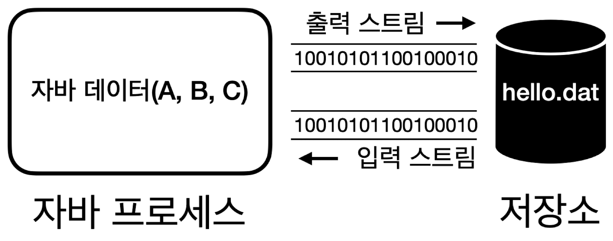
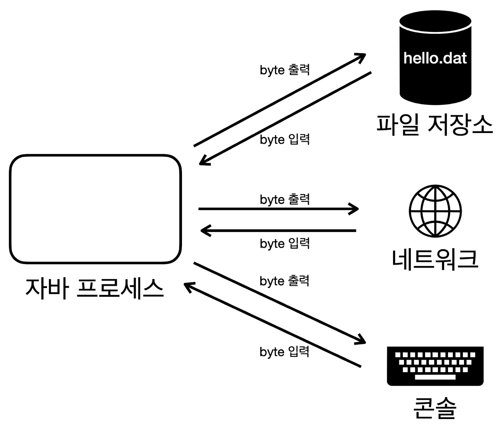
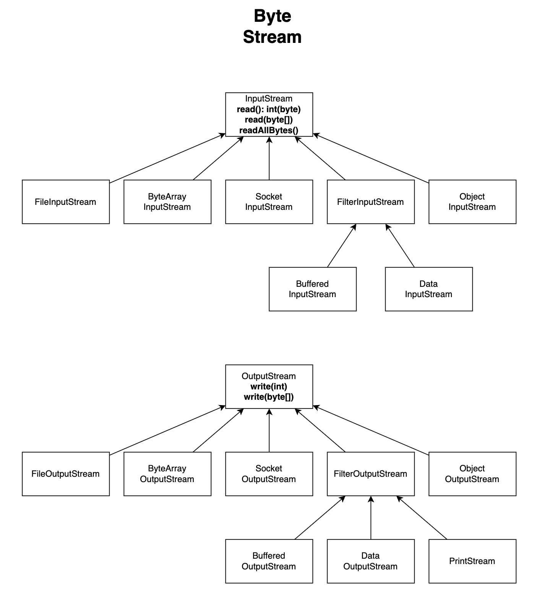
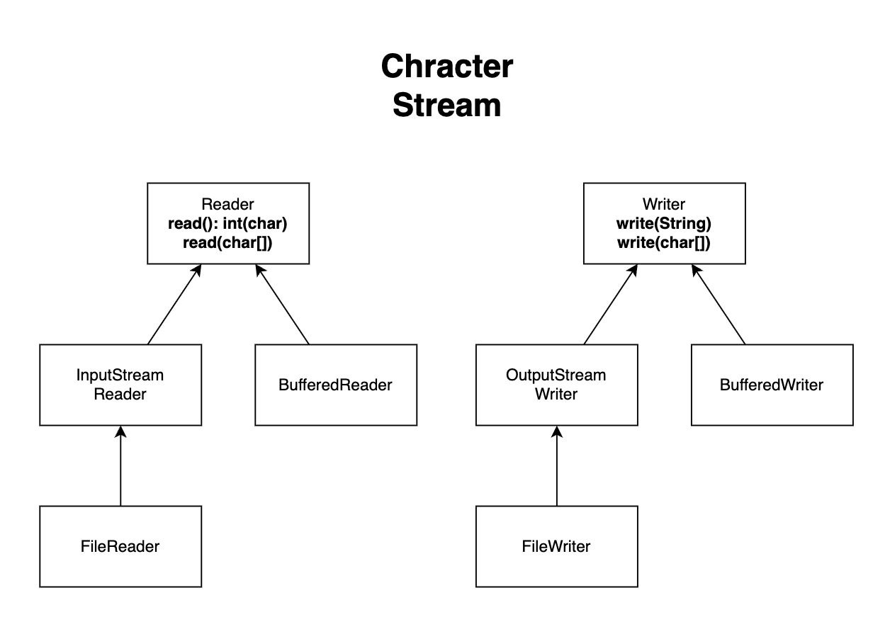

## 컴퓨터 데이터
- 개발하면서 다루는 데이터는 **2가지**
	- **바이너리 데이터** (byte 기반 - e.g. 010101)
	- **텍스트 데이터** (문자 기반 - e.g. "ABC")
- 컴퓨터 메모리
	
	- 컴퓨터 메모리는 **반도체**로 만들어짐 (e.g. RAM)
		- **반도체**: 트랜지스터의 모임 (수 많은 전구들이 모여 있는 것)
		- **트랜지스터**: 아주 작은 전자 스위치 (전구 하나)
			- 전기가 흐르거나 흐르지 않는 **두 가지 상태** 가짐 -> **0 & 1 이진수 표현**
	- **메모리는 단순히 전구를 켜고 끄는 방식으로 작동** -> **컴퓨터는 전구의 상태만 변경 혹은 확인**
		- 컴퓨터는 전구들을 켜고 끄는 방식으로 데이터를 기록하고 읽음
		- 현대 컴퓨터 메모리는 초당 수십억 번의 데이터 접근으로 매우 빠름
- 컴퓨터는 데이터 처리 시 **2진수로 변환해 저장**
	- 10진수 숫자 -> **간단한 공식** -> 2진수
		- e.g. 10진수 100 -> 2진수 `1100100`
	- 문자 -> **문자 집합**(**Character Set**) -> 10진수 -> **간단한 공식** -> 2진수
		- e.g. "A" -> 65 -> `1000001`
- 단위
	- 1비트(bit): **2가지 상태 표현**
	- 1바이트(byte) = 8bit : **256가지** 표현 (**정보를 처리하는 기본 단위**)
		- 음수 표현시 앞의 1비트를 사용 (e.g. 자바의 숫자 타입들)

## 문자 집합 (**Character Set**)
- 사용 전략: 사실상 표준인 **UTF-8을 사용하자**

- 문제: **문자는 2진수로 나타낼 수 없음**
- 해결책: **문자 집합** - 컴퓨터 과학자들이 문자에 숫자를 연결시키는 방법을 고안
	- **문자 인코딩**: 문자 -> **문자 집합**(**Character Set**) -> 10진수 -> **간단한 공식** -> 2진수
	- **문자 디코딩**: 2진수 -> **간단한 공식** -> 10진수 -> **문자 집합**(**Character Set**) -> 문자
- 문자 집합 종류와 역사
	- **ASCII** (American Standard Code for Information Interchange, 1960년도)
		- 각 컴퓨터 회사 간 **호환성 문제 해결**을 위해 개발
		- **7비트**로 128가지 문자 표현
			- 영문 알파벳, 숫자, 키보드 특수문자, 스페이스, 엔터
	- ISO_8859_1 (= `LATIN1` = `ISO-LATIN-1`, 1980년도)
		- **서유럽 문자**를 표현하는 문자 집합 
		- **8비트**(**1byte**)로 256가지 문자 표현
			- ASCII 128가지 + 서유럽 문자, 추가 특수 문자
		- **기존 ASCII와 호환 가능**
	- 한글 문자 집합
		- 특징
			- **한글**을 표현할 수 있는 문자 집합
			- **16비트**(**2byte**)로 65536가지 문자 표현
			- **기존 ASCII와 호환 가능**
				- **ASCII는 1바이트, 한글은 2바이트로 메모리에 저장**
				- 한글은 글자가 많아서 1바이트로 표현 불가
		- EUC-KR (1980년도)
			- **자주 사용하는 한글** 표현
				- ASCII + 자주 사용하는 한글 2350개 + 한국에서 자주 사용하는 기타 글자
		- MS949 (1990년도)
			- 마이크로소프트가 **EUC-KR을 확장**해, **한글 11,172자를 모두 표현**
				- e.g. "쀍", "삡" 등 **모든 초성, 중성, 종성 조합 표현** 가능
			- **EUC-KR과 호환 가능**하고 **윈도우 시스템**에서 계속 사용됨
	- 전세계 문자 집합 (유니코드)
		- 특징
			- **전세계 문자**를 대부분 표현할 수 있는 문자 집합
			- **국제적 호환성**을 위해 개발
				- 특정 언어를 위한 문자 집합이 PC에 설치되지 않으면 글자가 깨짐
				- 한 문서 안에 여러 나라 언어 저장 시에도 문제가 됨
		- UTF-16 (1990년도) - 초반에 인기
			- **16비트**(**2byte**) 기반 
				- 기본 다국어는 2byte로 표현 (영어, 유럽, 한국어, 중국어, 일본어)
				- 그 외는 4byte로 표현 (고대문자, 이모지, 중국어 확장 한자)
			- 큰 단점
				- ASCII 호환 불가
					- 무조건 2바이트로 읽어서 ASCII 영문을 못 읽음 (ASCII 문서가 안열림)
				- 영문의 경우 다른 문자 집합에 비해 2배 메모리 더 사용
					- 웹 문서 80% 이상이 영문 문서라 비효율적
		- **UTF-8** (1990년도)
			- 현대의 **사실상 표준 인코딩** 기술
			- **8비트**(**1byte**) 기반, **가변 길이 인코딩**
				- 1byte: ASCII, 영문, 기본 라틴 문자
				- 2byte: 그리스어, 히브리어 라틴 확장 문자
				- 3byte: 한글, 한자, 일본어
				- 4byte: 이모지, 고대문자등
			- 단점: 일부 언어에서 더 많은 용량 사용
			- 큰 장점
				- **ASCII 호환**
				- **저장 공간 및 네트워크 효율성** (ASCII 문자를 1바이트로 사용)
- **한글이 깨지는** 가장 큰 이유 2가지
	- **EUC-KR**(**MS949**)와 **UTF-8**이 서로 호환되지 않아서
		- **윈도우**에서 저장한 것을 UTF-8로 불러오거나 역인 경우
	- **EUC-KR(MS949) 혹은 UTF-8**로 인코딩한 한글을 **ISO-8891-1**로 디코딩할 때
		- **개발 툴** 같은 곳에서 **ISO-8891-1**로 설정되어 있으면, 한글을 저장 및 읽을 때 깨짐
- 코드 예시
	- `Charset` : 문자 집합 클래스
	- `StandardCharsets` : **자주 사용하는 문자 집합**을 **상수**로 지정해둠
		- e.g. `StandardCharsets.UTF_8`, `StandardCharsets.UTF_16BE`
		- 참고: UTF-16의 경우, `UTF-16BE` 사용하자
			- `UTF-16BE` & `UTF-16LE`는 바이트의 순서 차이
	- `String.getBytes(Charset)` : 지정한 문자 집합으로 문자 인코딩
		- 참고: 자바의 바이트는 첫 비트로 음양을 표현
			- 예를 들어, EUC-KR의 '가'를 2진수로 표현하면 -> (10110000, 10100001)
				- 기본 십진 수 표현 : `[176, 161]`
				- 자바 바이트로 십진수 표현 : `[-80, -95]`
			- 즉, 십진수 표현만 다를 뿐 **실제 메모리에 저장되는 값은 동일**

>문자 인코딩 및 디코딩 시 **문자 집합이 생략**된 경우, **시스템 기본 문자 집합 사용** (보통 UTF-8)

## I/O (Input/Output)


- **데이터를 주고 받는 것**
- 현대 컴퓨터는 대부분 **byte 단위**로 주고 받음 (bit 단위는 너무 작기 때문에)
	- **자바 프로세스**는 **파일, 네트워크(소켓), 콘솔** 등과 **byte 단위**로 **데이터를 주고 받음**

## 스트림(**Stream**)
- **데이터를 주고 받는 방식**(**I/O**)을 **추상화**한 것
	- 파일이든 소켓을 통한 네트워크든 **일관된 방식**으로 데이터를 주고 받을 수 있음
	- 덕분에 기억할 메서드가 단순화
		- **읽기: `read()`, `readAllBytes()`**
		- **쓰기: `write()`**
		- **자원해제: `close()`**
- 분류
	- 입출력
		- 입력 스트림 : **외부 데이터**를 **자바 프로세스 내부**로 가져옴
		- 출력 스트림 : **자바 프로세스 내부 데이터**를 **외부**로 보냄
	- 독립성
		- 기본 스트림
			- **단독 사용 가능**한 스트림
			- File, 메모리, 콘솔등에 직접 접근하는 스트림
			- e.g. `FileInputStream`, `FileOutputStream`, `FileReader`, `FileWriter`, `ByteArrayInputStream`, `ByteArrayOutputStream`
		- 보조 스트림
			- 단독 사용 **불가능**한 스트림 (대상 스트림 필수 필요)
			- 기본 스트림에 **보조 기능**을 제공하는 스트림
			- e.g. `BufferedInputStream`, `BufferedOutputStream`, `PrintStream`, `InputStreamReader`, `OutputStreamWriter`, `DataOutputStream`, `DataInputStream`

## 스트림 유의할 개념
- **스트림의 모든 데이터**는 **`byte` 단위**를 사용
	- 문자 역시 `byte`로 변환이 필요
- 코드에서 **바이트를 표현**할 때 **10진수**로 사용하자
	- 개발자는 코드에서 문자, 문자집합, 10진수까지만 다루면 됨
	- e.g. A를 바이트로 표현하고 싶으면 65로 쓰자 (2진수 `1000001` 사용 X)
	- 참고: `write()`와 `read()`가 `int`를 입력 및 반환하는 이유
		- 자바 `byte`는 부호 있는 8비트(-128~127)라 EOF(End of File) 표현이 어려움
		- `int`를 반환하면 0~255로 표현하고 **`-1`을 EOF로 사용**할 수 있음
- `ByteArrayStream`은 거의 사용되지 않는다!
	- **메모리에 데이터를 저장하고 읽을 때**는 **컬렉션**이나 **배열**을 사용
- **버퍼**(**Buffer**) : **데이터를 모아서 전달**하거나 **모아서 전달 받는 용도**로 사용하는 것
	- e.g. `byte[] buffer = new byte[BUFFER_SIZE];`
	- 버퍼의 크기는 보통 **4KB** or **8KB** 정도 잡는 것이 **효율적** (최근엔 16KB도 가끔 보임)
		- **디스크나 파일 시스템**의 데이터 **기본 읽기 쓰기 단위**가 보통 4KB, 8KB이기 때문
		- 즉, 버퍼 크기가 더 커져도 속도가 계속 향상되지 않음
- **플러시**(`flush()`) : **버퍼가 다 차지 않아도** 버퍼에 남아있는 **데이터를 전달**하는 것
	- 참고: BufferedStream `close()` 호출 시 
		- 내부에서 `flush()`를 먼저 호출한 후 연결된 스트림의 `close()` 호출
- 컴퓨터 간 **데이터 교환 형식**
	- 사용 전략
		- **JSON을 사용하자** (대부분 충분)
		- **성능 최적화가 매우 중요**하다면, **Protobuf**와 **Avro** 등을 고려하자
	- 발전 과정
		- 자바 객체 직렬화(Serialization) - **거의 사용하지 않음**
			- 메모리에 있는 **객체 인스턴스**를 **바이트 스트림**으로 **변환**해 파일에 저장하거나 네트워크로 전송할 수 있도록 하는 기능
			- 역직렬화(Deserialization)을 통해 원래 객체로 복원 가능
			- 직렬화하려는 클래스는 `Serialization` 인터페이스를 구현해야 함
			- 장점: 편의성으로 인해 초기 분산 시스템에서 활용
			- 단점: 장애날 확률 높음
				- 호환성 문제 (버전 관리 어려움, 자바 플랫폼 종속성으로 타언어와 호환 불편)
				- 성능 느림, 상대적으로 큰 용량...
		- XML
			- 장점: 텍스트이므로 플랫폼 간 호환성 해결
			- 단점: 복잡성, 무거움
		- **JSON**
			- 가볍고 간결, 좋은 호환성
			- 2000년대 후반, 웹 API와 RESTful 서비스가 대중화되며 **사실상 표준**이 됨
		- **Protobuf, Avro**
			- 장점: **더 적은 용량, 더 빠른 성능** (**Byte 기반**으로 용량과 성능 최적화됨)
				- XML, JSON은 텍스트 기반이라 용량이 상대적으로 큼
				- 숫자도 텍스트로 표현되어 바이트를 더 잡아 먹음
			- 단점: **호환성이 떨어지고**, byte 기반이라 **사람이 직접 읽기 어려움**

## 스트림 종류
- **Byte Stream** (byte를 다루는 스트림)
	
	- 특징
		- **바이트**로 스트림 입출력 지원
	- **`BufferdInputStream`**, **`BufferedOutputStream`** (보조 스트림)
		- **내부**에서 단순히 **버퍼**(`byte[] buf`) 기능 제공 - **대상 Stream이 필요**
			- `byte[] buf`가 가득차면 대상 스트림의 `write(byte[])` 호출 후 버퍼 비움
			- `byte[] buf`가 비어 있으면 버퍼 크기만큼 대상 스트림의 `read(byte[])` 호출 후 버퍼에서 읽음
		- `close()` 호출 시, 내부에서 플러시하고 연결된 스트림의 `close()`까지 호출됨
		- 장점: **단순한 코드** 유지 가능
		- 단점: 기본 `read()`, `write()`에 직접 버퍼 사용 보단 느림 (동기화 락 때문)
	- **`PrintStream`** (보조 스트림)
		- **`System.out`의 실체**, 데이터 **출력** 기능 제공
		- 추가 기능인 `println()` 제공 (콘솔 출력)
		- **콘솔에 출력하듯** 파일이나 **다른 스트림에 문자, 숫자, boolean 등 출력 가능**
			- e.g. `FileOutputStream`과 조합하면 콘솔에 출력하듯 파일에 출력 가능
	- **`DataInputStream`**, **`DataOutputStream`** (보조 스트림)
		- **자바 데이터 형**을 편리하게 입출력 가능
			- e.g. `String`, `int`, `double`, `boolean`...
		- 데이터 형에 따라 **알맞은 메서드**를 사용
			- e.g. `writeUTF()`, `writeInt()`, `writeDouble()`, `writeBoolean()`...
		- 데이터를 정확하게 읽을 수 있는 이유
			- `String`의 경우 저장 시 **2byte**를 사용해 **문자의 길이도 함께 저장**해 둠
				- 2byte -> 65535 길이까지만 가능
				- e.g. `dos.writeUTF("id1");` 
				  -> `3id1`(2byte(문자 길이) + 3byte(실제 문자 데이터))
				  -> `dis.readUTF()`가 글자 길이를 확인하고 해당 길이만큼 읽음
			- Int는 단순히 4byte를 사용하므로, 4byte로 저장하고 4byte로 읽음
				- e.g. `dos.writeInt(20)` -> `dis.readInt()`
		- e.g. `FileOutputStream` 조합 -> 파일에 자바 데이터 형을 편리하게 저장 가능
		- 주의점: **저장한 순서대로 읽어야 함**
			- `writeUTF()`, `writeInt()`였다면, `readUTF()`, `readInt()` 순으로
			- **각 타입마다 그에 맞는 byte 단위로 저장**되기 때문
			- e.g. 문자는 UTF-8 형식 저장, 자바 `int`는 4byte로 묶어 저장...
	- `ObjectInputStream`, `ObjectOutputStream` (보조 스트림, 거의 사용 X)
		- 자바 객체 직렬화 및 역직렬화를 지원
		- 자바 객체 직렬화는 버그를 많이 일으켜서, 거의 사용하지 않음
- **Character Stream** (문자를 다루는 스트림)
	
	- 특징
		- **문자**로 스트림 입출력 지원
		- **내부**에서 문자 <-> `byte` **인코딩** 및 **디코딩**을 대신 처리
		- 따라서, **문자 집합 전달 필수**
	- `InputStreamReader`, `OutputStreamWriter` (보조 스트림)
		- `InputStreamReader`은 반환타입이 `int` -> **`char`형으로 캐스팅**해 사용
			- EOF인 -1 표현을 위해 `int`로 반환
	- `FileReader`, `FileWriter`
		- 내부에서 스스로 `FileOutputStream`, `FileInputStream`을 생성해 사용
		- 나머지는 `InputStreamReader`, `OutputStreamWriter`과 동일
	- **`BufferedReader`**, `BufferedWriter` (보조 스트림)
		- 버퍼 보조 기능 제공 (`Reader`, `Writer`를 생성자에서 전달)
		- **`BufferedReader`는 한 줄 단위로 문자 읽는 기능**도 추가 제공 (**`readLine()`**)
			- 한 줄 단위로 문자를 읽고 `String` 반환, EOF에 도달하면 `null` 반환
- 코드 예시
	- FileStream 예시 (메모리, 콘솔도 유사하게 사용)
		- 출력
			- 생성: `FileOutputStream fos = new FileOutputStream("temp/hello.dat");`
			- 1바이트 쓰기: `fos.write(65);`
			- 여러 바이트 한 번에 쓰기: `fos.write({65, 66, 67});`
		- 입력
			- 생성: `FileInputStream fis = new FileInputStream("temp/hello.dat");`
			- 1바이트 읽기: `fis.read();`
			- 여러 바이트 한 번에 읽기 (버퍼 읽기)
				- `byte[] buffer = new byte[10];`
				- `int readCount = fis.read(buffer, 0, 10);`
			- 모든 바이트 한 번에 읽기
				- `byte[] readBytes = fis.readAllBytes();`
	- 파일 및 버퍼 사이즈 설정 예시
		- `public static final int FILE_SIZE = 10 * 1024 * 1024; // 10MB`
		- `public static final int BUFFER_SIZE = 8192; // 8KB`
	- Buffered 스트림 사용 예시 (보조 스트림들은 이와 비슷)
		- 출력
			```java
			FileOutputStream fos = new FileOutputStream(FILE_NAME);
			BufferedOutputStream bos = new BufferedOutputStream(fos, BUFFER_SIZE);
			for (int i = 0; i < FILE_SIZE; i++) {
				bos.write(1);
			}
			```
		- 입력
			```java
			FileInputStream fis = new FileInputStream(FILE_NAME);
			BufferedInputStream bis = new BufferedInputStream(fis, BUFFER_SIZE);
			while ((data = bis.read()) != -1) { 
				fileSize++; 
			}
			```
	- `BufferedReader`, `BufferedWriter` 사용 예시
		```java
		// 파일에 쓰기
		FileWriter fw = new FileWriter(FILE_NAME, UTF_8);
		BufferedWriter bw = new BufferedWriter(fw, BUFFER_SIZE);
		bw.write(writeString);
		bw.close();
		
		// 파일에서 읽기
		StringBuilder content = new StringBuilder();
		FileReader fr = new FileReader(FILE_NAME, UTF_8); 
		BufferedReader br = new BufferedReader(fr, BUFFER_SIZE);
		
		String line;
		while ((line = br.readLine()) != null) {
			content.append(line).append("\n");
		}
		br.close();
		```
	- `PrintStream` 사용 예시
		```java
		FileOutputStream fos = new FileOutputStream("temp/print.txt");
		PrintStream printStream = new PrintStream(fos);
		printStream.println("hello java!");
		printStream.println(10);
		printStream.println(true);
		printStream.close();
		```
	- `DataInputStream`, `DataOutputStream` 사용 예시
		```java
		FileOutputStream fos = new FileOutputStream("temp/data.dat");
		DataOutputStream dos = new DataOutputStream(fos);
		
		dos.writeUTF("회원A");
		dos.writeInt(20);
		dos.writeDouble(10.5);
		dos.writeBoolean(true); 
		dos.close();
		
		FileInputStream fis = new FileInputStream("temp/data.dat");
		DataInputStream dis = new DataInputStream(fis);
		System.out.println(dis.readUTF());
		System.out.println(dis.readInt());
		System.out.println(dis.readDouble());
		System.out.println(dis.readBoolean());
		dis.close();
		```

>FileInputStream, FileOutputStream은 디렉토리 지정시 해당 디렉토리를 미리 생성해두자. 그렇지 않으면 `FileNotFoundException`이 발생한다.

## 스트림 입출력 성능 최적화
- **핵심 전략**
	- **적당한 크기 파일**이라면, **한 번에 처리**하자 (**수십 MB 정도**가 안전 범위)
	- **대용량 파일**이라면, **버퍼로 처리**하자
		- 일반적인 상황에서는 **Buffered 스트림**으로 처리
		- **성능이 중요**하다면 **버퍼를 직접 다루자** (`read(byte[])`, `write(byte[])`)
- 버퍼의 이점
	- **버퍼**를 사용 -> OS 시스템 콜 & HDD, SSD 읽기 쓰기 작업 횟수 감소 -> **큰 속도 향상**
		- `write()`, `read()`는 호출할 때마다 OS 시스템 콜을 통해 입출력 명령을 전달
		- **OS 시스템 콜**과 **디스크 읽기/쓰기** -> **무거운 작업**
- 하나씩 입출력 VS 버퍼 입출력 VS 한 번에 전체 입출력
	- 하나씩 입출력
		- e.g. 1Byte씩 10MB 파일(약 1000만번 호출) -> 쓰기: 약 14초 / 읽기: 약 5초
		- 자바 최적화로 인해 실제로는 배치로 나가서 그나마 이정도
	- **버퍼 입출력** -> **대용량 파일 처리**에 유리
		- e.g. 8192Byte(8KB)씩 10MB 파일 -> 쓰기: 약 14ms / 읽기: 5ms
			- 속도 1000배 향상
		- 편리하게 `BuffedStream` 사용도 가능 -> 쓰기: 약 102ms / 읽기: 약 94ms
			- 쓰기 속도 140배, 읽기 속도 50배 향상 
			- -> 버퍼 직접 사용보단 느림 (동기화 락 때문)
	- **한 번에 전체 입출력** -> **작은 파일 처리**에 유리
		- e.g. -> 쓰기: 약 15ms / 읽기: 약 3ms
			- 버퍼 입출력 예제와 성능이 비슷
		- 한 번에 쓴다고 무작정 빨라지지 않음
			- 디스크나 파일 시스템의 데이터 읽기 쓰기 단위가 보통 4KB, 8KB이기 때문
- **부분 읽기** VS **전체 읽기** (둘 다 필요)
	- **부분 읽기**(버퍼 읽기)
		- 메모리 사용량 제어 가능 -> **대용량 파일 처리**에 유리
		- e.g. `read(byte[], offset, lentgh)`
	- **전체 읽기**
		- 한 번의 호출로 모든 데이터를 읽을 수 있어 편리 -> **작은 파일 처리**에 유리
		- 한 번에 많은 메모리 사용으로 `OutOfMemoryError` 발생을 조심해야 함
		- e.g. `readAllBytes()`