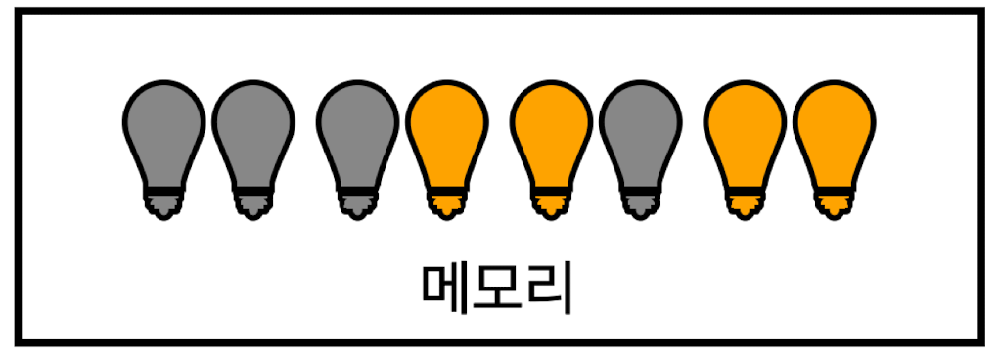
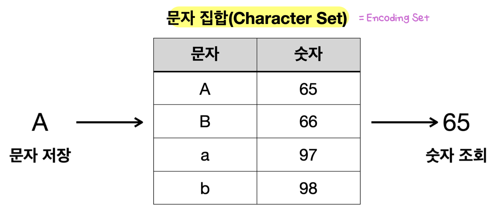

## 컴퓨터 데이터
- 개발하면서 다루는 데이터는 **2가지**
	- **바이너리 데이터** (byte 기반 - e.g. 010101)
	- **텍스트 데이터** (문자 기반 - e.g. "ABC")
- 컴퓨터 메모리
	
	- 컴퓨터 메모리는 **반도체**로 만들어짐 (e.g. RAM)
		- **반도체**: 트랜지스터의 모임 (수 많은 전구들이 모여 있는 것)
		- **트랜지스터**: 아주 작은 전자 스위치 (전구 하나)
			- 전기가 흐르거나 흐르지 않는 **두 가지 상태** 가짐 -> **0 & 1 이진수 표현**
	- **메모리는 단순히 전구를 켜고 끄는 방식으로 작동** -> **컴퓨터는 전구의 상태만 변경 혹은 확인**
		- 컴퓨터는 전구들을 켜고 끄는 방식으로 데이터를 기록하고 읽음
		- 현대 컴퓨터 메모리는 초당 수십억 번의 데이터 접근으로 매우 빠름
- 컴퓨터는 데이터 처리 시 **2진수로 변환해 저장**
	- 10진수 숫자 -> **간단한 공식** -> 2진수
		- e.g. 10진수 100 -> 2진수 `1100100`
	- 문자 -> **문자 집합**(**Character Set**) -> 10진수 -> **간단한 공식** -> 2진수
		- e.g. "A" -> 65 -> `1000001`
- 단위
	- 1비트(bit): **2가지 상태 표현**
	- 1바이트(byte) = 8bit : **256가지** 표현 (**정보를 처리하는 기본 단위**)
		- 음수 표현시 앞의 1비트를 사용 (e.g. 자바의 숫자 타입들)

## 문자 집합 (**Character Set**)
- 사용 전략: 사실상 표준인 **UTF-8을 사용하자**

- 문제: **문자는 2진수로 나타낼 수 없음**
- 해결책: **문자 집합** - 컴퓨터 과학자들이 문자에 숫자를 연결시키는 방법을 고안
	- **문자 인코딩**: 문자 -> **문자 집합**(**Character Set**) -> 10진수 -> **간단한 공식** -> 2진수
	- **문자 디코딩**: 2진수 -> **간단한 공식** -> 10진수 -> **문자 집합**(**Character Set**) -> 문자
- 문자 집합 종류와 역사
	- **ASCII** (American Standard Code for Information Interchange, 1960년도)
		- 각 컴퓨터 회사 간 **호환성 문제 해결**을 위해 개발
		- **7비트**로 128가지 문자 표현
			- 영문 알파벳, 숫자, 키보드 특수문자, 스페이스, 엔터
	- ISO_8859_1 (= `LATIN1` = `ISO-LATIN-1`, 1980년도)
		- **서유럽 문자**를 표현하는 문자 집합 
		- **8비트**(**1byte**)로 256가지 문자 표현
			- ASCII 128가지 + 서유럽 문자, 추가 특수 문자
		- **기존 ASCII와 호환 가능**
	- 한글 문자 집합
		- 특징
			- **한글**을 표현할 수 있는 문자 집합
			- **16비트**(**2byte**)로 65536가지 문자 표현
			- **기존 ASCII와 호환 가능**
				- **ASCII는 1바이트, 한글은 2바이트로 메모리에 저장**
				- 한글은 글자가 많아서 1바이트로 표현 불가
		- EUC-KR (1980년도)
			- **자주 사용하는 한글** 표현
				- ASCII + 자주 사용하는 한글 2350개 + 한국에서 자주 사용하는 기타 글자
		- MS949 (1990년도)
			- 마이크로소프트가 **EUC-KR을 확장**해, **한글 11,172자를 모두 표현**
				- e.g. "쀍", "삡" 등 **모든 초성, 중성, 종성 조합 표현** 가능
			- **EUC-KR과 호환 가능**하고 **윈도우 시스템**에서 계속 사용됨
	- 전세계 문자 집합 (유니코드)
		- 특징
			- **전세계 문자**를 대부분 표현할 수 있는 문자 집합
			- **국제적 호환성**을 위해 개발
				- 특정 언어를 위한 문자 집합이 PC에 설치되지 않으면 글자가 깨짐
				- 한 문서 안에 여러 나라 언어 저장 시에도 문제가 됨
		- UTF-16 (1990년도) - 초반에 인기
			- **16비트**(**2byte**) 기반 
				- 기본 다국어는 2byte로 표현 (영어, 유럽, 한국어, 중국어, 일본어)
				- 그 외는 4byte로 표현 (고대문자, 이모지, 중국어 확장 한자)
			- 큰 단점
				- ASCII 호환 불가
					- 무조건 2바이트로 읽어서 ASCII 영문을 못 읽음 (ASCII 문서가 안열림)
				- 영문의 경우 다른 문자 집합에 비해 2배 메모리 더 사용
					- 웹 문서 80% 이상이 영문 문서라 비효율적
		- **UTF-8** (1990년도)
			- 현대의 **사실상 표준 인코딩** 기술
			- **8비트**(**1byte**) 기반, **가변 길이 인코딩**
				- 1byte: ASCII, 영문, 기본 라틴 문자
				- 2byte: 그리스어, 히브리어 라틴 확장 문자
				- 3byte: 한글, 한자, 일본어
				- 4byte: 이모지, 고대문자등
			- 단점: 일부 언어에서 더 많은 용량 사용
			- 큰 장점
				- **ASCII 호환**
				- **저장 공간 및 네트워크 효율성** (ASCII 문자를 1바이트로 사용)
- **한글이 깨지는** 가장 큰 이유 2가지
	- **EUC-KR**(**MS949**)와 **UTF-8**이 서로 호환되지 않아서
		- **윈도우**에서 저장한 것을 UTF-8로 불러오거나 역인 경우
	- **EUC-KR(MS949) 혹은 UTF-8**로 인코딩한 한글을 **ISO-8891-1**로 디코딩할 때
		- **개발 툴** 같은 곳에서 **ISO-8891-1**로 설정되어 있으면, 한글을 저장 및 읽을 때 깨짐
- 코드 예시
	- `Charset` : 문자 집합 클래스
	- `StandardCharsets` : **자주 사용하는 문자 집합**을 **상수**로 지정해둠
		- e.g. `StandardCharsets.UTF_8`, `StandardCharsets.UTF_16BE`
		- 참고: UTF-16의 경우, `UTF-16BE` 사용하자
			- `UTF-16BE` & `UTF-16LE`는 바이트의 순서 차이
	- `String.getBytes(Charset)` : 지정한 문자 집합으로 문자 인코딩
		- 참고: 자바의 바이트는 첫 비트로 음양을 표현
			- 예를 들어, EUC-KR의 '가'를 2진수로 표현하면 -> (10110000, 10100001)
				- 기본 십진 수 표현 : `[176, 161]`
				- 자바 바이트로 십진수 표현 : `[-80, -95]`
			- 즉, 십진수 표현만 다를 뿐 **실제 메모리에 저장되는 값은 동일**

>문자 인코딩 및 디코딩 시 **문자 집합이 생략**된 경우, **시스템 기본 문자 집합 사용** (보통 UTF-8)
