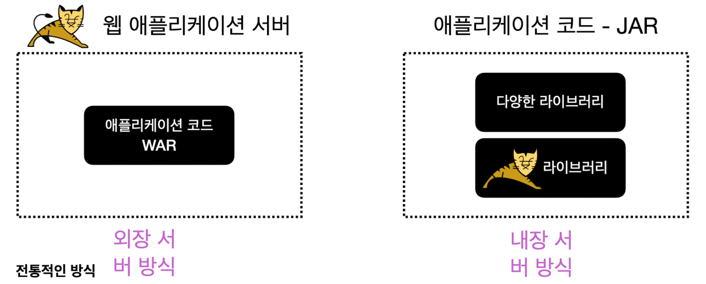
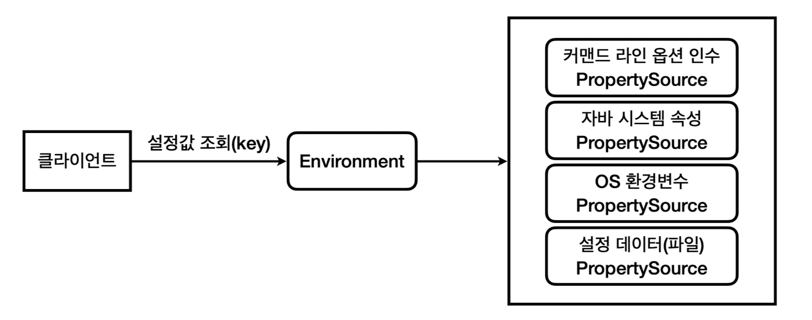

## 스프링 부트의 필요성
- 스프링은 2013년까지 크게 성장해왔지만, 프로젝트 시작 시 필요한 설정이 점점 늘어나 어려워짐
- 스프링 부트 (2014~)
	- **스프링을 편리하게 사용할 수 있도록 지원하는 도구**
	- 스프링 부트가 **프로젝트 시작을 위한 복잡한 설정 과정을 해결** -> 개발 시간 단축
- 핵심 기능
	- **WAS**
		- Tomcat 같은 웹서버를 내장 (별도 웹 서버 설치 필요 X)
	- **라이브러리 관리**
		- 손쉬운 스타터 종속성 제공, 스프링과 외부 라이브러리의 버전 호환을 자동 관리
	- **자동 구성**
		- 프로젝트 시작에 필요한 스프링과 외부 라이브러리의 빈을 자동 등록
	- **외부 설정 공통화**
	- **프로덕션 준비**
		- 모니터링을 위한 메트릭, 상태 확인 기능 제공

## 웹 서버와 서블릿 컨테이너
- JAR & WAR
	- JAR (Java Archive)
		- **여러 클래스와 리소스를 묶어서 만든 압축 파일**
		- **JVM 위에서 직접 실행**되거나 다른 곳에서 사용하는 **라이브러리**로 제공 가능
			- 직접 실행: 직접 자신의 **`main` 메서드**로 실행 가능 (e.g. `java -jar abc.jar`)
				- `MANIFEST.MF` 파일에 실행할 메인 메서드가 있는 클래스를 지정해야 함
			- 라이브러리: 다른 곳에서 **`import`** 될 수 있음
	- WAR (Web Application Archive)
		- WAS에 배포할 때 사용하는 파일
		- **WAS 위에서 실행**됨 (JVM 위에서 WAS가 실행되고 WAS 위에서 WAR가 실행됨)
		- WAS 위에서 실행되기 위해 WAR의 **복잡한 구조**를 지켜야함
			- `WEB-INF`
				- `classes` : 실행 클래스 모음
				- `lib` : 라이브러리 모음
				- `web.xml` : 웹 서버 배치 설정 파일(생략 가능)
			- `index.html` : 정적 리소스
- 자바 웹 애플리케이션 개발 방식
	
	- 외장 서버 방식 (전통적인 방식)
		- WAS 기반 위에 애플리케이션 코드를 빌드한 war 파일을 심어 배포하는 방식
		- 단점
			- WAS를 별도로 설치해야 하고, 버전 변경시에도 재설치해야 함
			- 개발 환경 설정과 배포 과정이 **복잡**
		- 방법
			- 먼저 서버에 WAS(e.g. 톰캣)를 설치
			- 서블릿 스펙에 맞춰 코드를 작성하고 WAR 형식으로 빌드
				- 직접 초기화 방법
					
					- 서블릿 컨테이너 초기화 및 애플리케이션 초기화 코드 작성
						- `ServletContainerInitializer`, `@HandlesTypes`...
					- 스프링 사용 시 애플리케이션 초기화 코드에 관련 코드 작성
						- 스프링 컨테이너 생성 및 빈 등록
						- 디스패처 서블릿 생성 후 스프링 컨테이너와 연결
						- 디스패처 서블릿을 서블릿 컨테이너에 등록
						- ...
					- ...
				- 스프링 MVC 지원 방법 (서블릿 컨테이너 초기화는 자동으로 해줌)
					
					- 애플리케이션 초기화만 작성 (`WebApplicationInitializer` 상속)
						- 스프링 컨테이너 생성 및 디스패처 서블릿 연결 등
			- 빌드한 war 파일을 WAS의 특정 위치에 전달해 배포
	- **내장 서버 방식** (최근 방식)
		- 애플리케이션 코드 안에 **WAS가 라이브러리로서 내장**
		- **스프링 부트가 내장 톰캣을 포함** (`tomcat-embed-core`)
			- 톰캣 생성, 서블릿 컨테이너 초기화 및 애플리케이션 초기화를 모두 자동화
				- e.g. 스프링 컨테이너 생성, 디스패처 서블릿 등록...
					```java
					public class MySpringApplication {
						public static void run(Class<?> configClass, String[] args) {
							System.out.println("MySpringBootApplication.run args=" + List.of(args));
							
							// 톰캣 설정
							Tomcat tomcat = new Tomcat();
							Connector connector = new Connector();
							connector.setPort(8080);
							tomcat.setConnector(connector);
							
							// 스프링 컨테이너 생성
							AnnotationConfigWebApplicationContext appContext = new AnnotationConfigWebApplicationContext();
							appContext.register(configClass);
							
							// 스프링 MVC 디스패처 서블릿 생성 및 스프링 컨테이너 연결
							DispatcherServlet dispatcher = new DispatcherServlet(appContext);
							
							// 디스패처 서블릿 등록
							Context context = tomcat.addContext("", "/");
							tomcat.addServlet("", "dispatcher", dispatcher);
							context.addServletMappingDecoded("/", "dispatcher");
							
							try {
								tomcat.start();
							} catch (Exception e) {
								throw new RuntimeException(e);
							}
						}
					}
					```
		- 방법
			- 개발자는 코드를 작성하고 **JAR로 빌드한 후 원하는 위치에서 실행**
				- 개발자가 `main()` 메서드만 실행하면 WAS는 함께 실행됨
	- 핵심: **내장 서버 방식과 외장 서버 방식과의 차이**
		- 초기화 코드는 거의 똑같음 (서블릿 컨테이너 초기화, 애플리케이션 초기화)
		- 차이는 **시작점**
			- **개발자가 `main()` 메서드를 직접 실행하는가(JAR)**
			- **서블릿 컨테이너가 제공하는 초기화 메서드를 통해 실행하는가(WAR)**
- **Jar** & **FatJar** & **실행 가능 Jar** (feat. 내장 톰캣 라이브러리 포함을 위한 서사)
	- Jar가 요구하는 자바 표준 (Gradle이 자동화)
		- `META-INF/MANIFEST.MF` 파일에 실행할 `main()` 메서드의 클래스 지정
	- Jar 스펙의 한계
		- **Jar 파일은 Jar 파일을 포함할 수 없음** -> 내부 라이브러리 역할의 Jar 파일 포함 불가
	- Fat Jar
		- **라이브러리 Jar의 압축을 풀고 `class`들을 뽑아 새로 만드는 Jar에 포함**하는 방식
		- 용량이 더 큼
		- 장점
			- **하나의 Jar 파일**에 여러 라이브러리를 내장 가능 (내장 톰캣)
		- 단점
			- 어떤 라이브러리가 포함되어 있는지 확인이 어려움 (모두 `class`로 풀려있음)
			- 클래스나 리소스 파일명 중복 시 해결 불가
	- **실행 가능한 Jar** (Executable Jar)
		- **Jar 내부에 Jar를 포함**할 수 있는 특별한 구조의 Jar
		- 스프링 부트가 빌드하면 결과로 나오는 Jar
			- **스프링 부트가 새로 정의** (자바 표준 X)
		- **Fat Jar의 단점을 모두 해결**
		- 내부 구조
			- `META-INF`
				- `MANIFEST.MF` (자바 표준)
			- `org/springframework/boot/loader` (**스프링 부트 로더**: 실행 가능 Jar를 실제 구동 시키는 클래스들이 포함)
				- **`JarLauncher.class`**
					- 스프링 부트 `main()` 실행 클래스
			- `BOOT-INF`
				- `classes` : 우리가 개발한 class 파일과 리소스 파일
				- `lib` : 외부 라이브러리
				- `classpath.idx` : 외부 라이브러리 모음
				- `layers.idx` : 스프링 부트 구조 정보
		- 실행 과정
			- `java -jar xxx.jar` 를 실행
			- `META-INF/MANIFEST.MF` 파일 탐색
				- 스프링 부트는 빌드 시 `JarLauncher`를 넣어주고 `Main-Class`에 지정
			- `Main-Class` 를 읽어서 **`JarLauncher`의 `main()` 메서드를 실행**
			- **`JarLauncher`가 몇몇 기능을 처리**
				- Jar 내부 Jar를 읽는 기능을 처리
					- `BOOT-INF/lib/` 인식
				- 특별한 구조에 맞게 클래스 정보 읽어들임
					- `BOOT-INF/classes/` 인식
			- `JarLauncher`가 `MANIFEST.MF`의 `Start-Class`에 지정된 `main()` 호출
				- **실제 프로젝트의 `main()` 호출**
- **결국 스프링 부트란?**
	- 앞의 프로젝트 시작을 위한 복잡한 설정 과정을 라이브러리로 만든 것
	- 주요 코드
		```java
		@SpringBootApplication
		public class BootApplication {
			public static void main(String[] args) {
		        SpringApplication.run(BootApplication.class, args);
			}
		}
		```
		- **`main()` 메서드**에서 코드 한 줄로 시작
			- `SpringApplication.run(BootApplication.class, args);`
			- **`BootApplication` 클래스**를 **설정 정보로 사용**하겠다는 의미로 **전달**
		- **`SpringApplication.run()`
			- **복잡한 설정 과정** 처리
			- 핵심: **WAS(내장 톰켓) 생성** + **스프링 컨테이너 생성**
				- 톰캣 설정, 스프링 컨테이너 생성, 디스패처 서블릿 생성 및 스프링 컨테이너와 연결, 서블릿 컨테이너에 디스패처 서블릿 등록...
		- **`@SpringBootApplication`**
			- **컴포넌트 스캔 시작점 지정** (내부에 `@ComponentScan` 기능 붙어 있음)
			- `main()` 메서드가 있는 **시작점 클래스**에 추가
				- 기본 대상: 애노테이션이 붙은 클래스의 **현재 패키지부터 그 하위 패키지**

## 스프링 부트가 제공하는 라이브러리 관리 기능
- **외부 라이브러리 버전 관리**
	- 개발자는 원하는 라이브러리만 고르고 **버전은 생략**
	- 스프링 부트가 **부트 버전에 맞춘 최적화된 라이브러리 버전을 선택해줌** (**호환성** 테스트 완료)
		```java
		plugins {
			id 'org.springframework.boot' version '3.0.2'
			id 'io.spring.dependency-management' version '1.1.0' //추가
			id 'java'
		}
		```
		- **`dependency-management` 플러그인** 사용
			- `spring-boot-dependencies`의 bom 정보를 참고
			- **bom**(Bill of Materials, 부품 목록)
				- 현재 프로젝트에 지정한 스프링 부트 버전에 맞는 라이브러리 버전 명시
		- `spring-boot-dependencies`는 gradle 플러그인에서 사용하므로 눈에 보이진 않음
- **스프링 부트 스타터** 제공
	- **Best Practice 라이브러리 뭉치를 제공**
		- 덕분에 일반적으로 많이 사용하는 대중적인 라이브러리로 **간단하게 프로젝트 시작 가능**
	- 이름 패턴
		- 공식: `spring-boot-starter-*`
		- 비공식: `thirdpartyproject-spring-boot-starter` (스프링이 공식적 제공 X)
			- e.g. `mybatis-spring-boot-starter`
	- 자주 사용하는 스타터
		- `spring-boot-starter` : 핵심 스타터, 자동 구성, 로깅, YAML (다른 스타터 사용 시 보통 포함됨)
		- `spring-boot-starter-jdbc` : JDBC, HikariCP 커넥션풀
		- `spring-boot-starter-data-jpa` : 스프링 데이터 JPA, 하이버네이트
		- `spring-boot-starter-data-mongodb` : 스프링 데이터 몽고
		- `spring-boot-starter-data-redis` : 스프링 데이터 Redis, Lettuce 클라이언트
		- `spring-boot-starter-thymeleaf` : 타임리프 뷰와 웹 MVC
		- `spring-boot-starter-web` : 웹 구축을 위한 스타터, RESTful, 스프링 MVC, 내장 톰캣
		- `spring-boot-starter-validation` : 자바 빈 검증기(하이버네이트 Validator)
		- `spring-boot-starter-batch` : 스프링 배치를 위한 스타터

>참고: 스프링 부트가 관리하지 않는 **외부 라이브러리 사용하기**
>- 버전 없이 적용해보고 안되면 버전 명시
>- e.g. `implementation 'org.yaml:snakeyaml:1.30'`

>참고: 스프링 부트가 관리하는 **라이브러리의 버전 변경** 방법
>- e.g. `ext['tomcat.version'] = '10.1.4'`
>- 거의 변경할 일이 없지만, 혹시나 버그 때문에 버전을 바꿔야 한다면 사용
>- `tomcat.version` 같은 속성값은 스프링 부트 docs에서 확인하자

## 자동 구성 (Auto Configuration)
- 스프링 부트가 **일반적으로 자주 사용하는 빈들**을 **자동으로 등록**해주는 기능
	- 개발자의 반복적이고 복잡한 빈 등록 및 설정을 최소화
- **보통 라이브러리를 만들어 제공할 때 사용** (이외는 잘 없음)
- 스프링 부트 기본 사용 라이브러리: `spring-boot-autoconfigure`
- 주요 애노테이션
	- `@AutoConfiguration`
		- 자동 구성 적용
		- 내부에 `@Configuration`이 있어서 자바 설정 파일로 사용 가능
		- 옵션
			- `after` : 자동 구성이 실행되는 순서 지정 가능
	- `@Conditional`
		- 특정 조건에 맞을 때 설정이 동작하도록 함 (If 문과 유사)
- `@Conditional` 기본 동작
	- **`Condition` 인터페이스**를 구현해 사용
		```java
		public interface Condition {
		    boolean matches(ConditionContext context, AnnotatedTypeMetadata metadata);
		}
		```
		- 구현 클래스
			```java
			@Slf4j
			public class MemoryCondition implements Condition {
			@Override
			    public boolean matches(ConditionContext context, AnnotatedTypeMetadata
			 metadata) {
			        String memory = context.getEnvironment().getProperty("memory");
			        log.info("memory={}", memory);
			        return "on".equals(memory);
				} 
			}
			```
			- **`matches()` 메서드**가 `true` 를 반환하면 동작, `false` 를 반환하면 동작 X
		- 사용 (설정 클래스에 추가)
			```java
			@Configuration 
			@Conditional(MemoryCondition.class) //추가 
			public class MemoryConfig {
			    
			    @Bean
			    public MemoryController memoryController() {
			        return new MemoryController(memoryFinder());
			    }
			    
			    @Bean
			    public MemoryFinder memoryFinder() {
			        return new MemoryFinder();
			    }
			}
			```
			- **`@Conditional(구현클래스.class)`**
	- 스프링이 제공하는 `Conditional` 기본 구현체
		- 특징
			- `@ConditionalOnXxx` 형태
			- 스프링 부트 자동 구성에 사용
			- `@Conditional`은 스프링의 기능 -> `@ConditionalOnXxx`로 스프링 부트가 확장
		- 종류
			- `@ConditionalOnClass` , `@ConditionalOnMissingClass`
				- 클래스가 있는 경우 동작, 나머지는 그 반대
			- `@ConditionalOnBean` , `@ConditionalOnMissingBean`
				- 빈이 등록되어 있는 경우 동작, 나머지는 그 반대
			- `@ConditionalOnProperty`
				- 환경 정보가 있는 경우 동작
			- `@ConditionalOnResource`
				- 리소스가 있는 경우 동작
			- `@ConditionalOnWebApplication` , `@ConditionalOnNotWebApplication`
				- 웹 애플리케이션인 경우 동작
			- `@ConditionalOnExpression`
				- SpEL 표현식에 만족하는 경우 동작
- `@AutoConfiguration` 이해하기
	- 자동 구성 라이브러리 만들기
		- 순수 라이브러리 방식을 그대로 하되, **라이브러리 내에 자동 구성 설정 파일 추가**
			- e.g. `@AutoConfiguration`, `@ConditionalOnXxx` 추가
				```java
				@AutoConfiguration
				@ConditionalOnProperty(name = "memory", havingValue = "on")
				public class MemoryAutoConfig {
				    
				    @Bean
				    public MemoryController memoryController() {
				        return new MemoryController(memoryFinder());
				    }
				    
				    @Bean
				    public MemoryFinder memoryFinder() {
				        return new MemoryFinder();
				    }
				}
				```
		- **자동 구성 대상 지정** (필수)
			- `src/main/resources/META-INF/spring/` 디렉토리에 다음 파일 추가
			- `org.springframework.boot.autoconfigure.AutoConfiguration.imports`
				- 만든 자동 구성을 패키지를 포함해 지정
				- e.g. `memory.MemoryAutoConfig`
	- 스프링 부트의 동작
		- 스프링 부트는 **시작 시점**에 **`libs` 폴더 내 모든 라이브러리의 `resources/META-INF/spring/org.springframework.boot.autoconfigure.AutoConfiguration.imports` 파일**을 읽어서 **자동 구성 클래스를 인식**하고 **`@Conditional` 조건에 맞으면 빈으로 등록**
		- 과정: `@SpringBootApplication` -> `@EnableAutoConfiguration` -> `@Import(AutoConfigurationImportSelector.class)` -> `resources/META-INF/spring/org.springframework.boot.autoconfigure.AutoConfiguration.imports` 파일을 열어 설정 정보 선택 -> 스프링 컨테이너에 설정 정보 등록
			- `@SpringBootApplication` : 스프링 부트 시작점
				```java
				@SpringBootApplication
				public class AutoConfigApplication {
				    public static void main(String[] args) {
				        SpringApplication.run(AutoConfigApplication.class, args);
					}
				}
				```
				- `run()`에 **설정정보로 사용할 클래스**를 전달 (`AutoConfigApplication`)
			- `@EnableAutoConfiguration` : 자동 구성 활성화 기능 제공
			- `@Import(AutoConfigurationImportSelector.class)`
				- `@Import` : 스프링 설정 정보(`@Configuration`) 추가
					- 정적 방법 : `@Import(클래스)`
					- 동적 방법: `@Import(ImportSelector)` - 설정 대상을 동적 선택
						```java
						public interface ImportSelector {
							String[] selectImports(AnnotationMetadata importingClassMetadata);
						    //...
						}
						```
				- `AutoConfigurationImportSelector`
					- `ImportSelector`의 구현체로 설정 정보를 동적으로 선택
					- 모든 라이브러리에 있는 특정 경로를 확인해 설정 정보 선택

>**순수 라이브러리 만들기**
>
>다른 곳에서 사용할 순수 라이브러리 Jar를 만들어야 하므로, 실행 가능 Jar가 되지 않도록 스프링 부트 플러그인은 사용하지 않는다. (옵션을 넣으면 스프링 부트 플러그인을 써도 가능할 수 있음)
>코드가 완성되면 빌드(`./gradlew clean build`)를 진행한다.
>
>실제 라이브러리 추가는 다음과 같이 진행한다.
>원하는 프로젝트에 `libs` 디렉토리를 생성하고 빌드 결과물 Jar 파일을 해당 디렉토리에 복사한다.
>그 후, `build.gradle`의 `dependencies`에 다음 코드를 추가하면 된다.
>
>`implementation files('libs/결과.jar') //추가`

## 외부 설정과 프로필
- 사용 전략
	- **설정 데이터를 기본으로 사용**
	- 일부 속성을 변경할 필요가 있다면, **자바 시스템 속성** or **커맨드 라인 옵션 인수** 사용
		- 우선 순위가 높으므로 설정 데이터를 덮어씀
- 외부 설정
	- 애플리케이션 빌드는 한번만 하고 각 환경에 맞추어 실행 시점에 외부 설정값 주입
	- 장점
		- 모든 환경에 똑같은 빌드 결과를 사용할 수  있어서 신뢰성 향상
		- 손쉽게 새로운 환경 추가도 가능
	- 일반적인 방법
		- OS 환경 변수
			- OS에서 지원하는 외부 설정
			- 해당 OS를 사용하는 **모든 프로세스**에서 사용 (사용 범위가 가장 넓음)
		- 자바 시스템 속성
			- 자바에서 지원하는 외부 설정
				- e.g. `-D` vm 옵션을 통해서 전달 
					- `java -Durl=dev -jar app.jar` => `url=dev` 속성 추가됨
					- 순서에 주의 (`-D` 옵션이 `-jar` 보다 앞에 있음)
			- **해당 JVM 안**에서 사용
		- 자바 커맨드 라인 인수
			- 기본
				- 커맨드 라인에서 전달하는 외부 설정
					- e.g. 필요한 데이터를 마지막 위치에 스페이스로 구분해서 전달
						- `java -jar app.jar dataA dataB`
				- 실행 시 **`main(args)` 메서드**에서 사용
			- **커맨드 라인 옵션 인수** (스프링만의 표준 방식 지원)
				- 커맨드 라인 인수를 **`key=value` 형식**으로 사용할 수 있도록 표준 정의
				- `ApplicationArguments` 인터페이스, `DefaultApplicationArguments` 구현체 사용
				- 전달 형식: `--key=value`
					- e.g. `--url=devdb --username=dev_user --password=dev_pw mode=on`
			- => 스프링 부트는 `ApplicationArguments` 를 스프링 빈으로 등록해둠
				- 커맨드 라인을 포함해 커맨드 라인 옵션 인수의 입력을 저장
				- 해당 빈을 주입 받으면 어디서든 사용가능
		- **외부 파일(설정 데이터)**
			- 프로그램에서 외부 파일을 직접 읽어서 사용 (**애플리케이션 로딩 시점**)
				- `application.properties`, `application.yml`
			- **YAML 사용 권장** (`application.yml`)
				- 사람이 읽기 좋은 데이터 구조
			- Jar 파일 안에 설정 파일을 포함시키고 **프로필로 관리**
			- 방법
				- 프로필마다 파일을 나눠 관리
					- 파일 이름 : `application-{프로필}.properties`
					- 실행 (`spring.profiles.active=프로필`)
						- `--spring.profiles.active=프로필` (커맨드 라인 옵션 인수)
						- `-Dspring.profiles.active=프로필` (자바 시스템 속성)
				- **하나의 파일로 관리** (**권장**)
					- 파일 내
						- 논리적으로 영역 구분
							- `application.properties` -> `#---` or `!---`
							- `application.yml` -> `---`
						- 프로필 지정
							- `spring.config.activate.on-profile=프로필`
					- 실행 (`spring.profiles.active=프로필`)
						- `--spring.profiles.active=프로필` (커맨드 라인 옵션 인수)
						- `-Dspring.profiles.active=프로필` (자바 시스템 속성)
			- 프로필 유의점
				- 프로필 지정 없이 실행할 시, 스프링은 **`default` 프로필** 사용
				- 설정 파일에 **프로필 지정 없이 쓴 설정들**은 **프로필과 무관하게 모두 적용**
					- 보통 기본값을 처음에 두고 그 후 프로필이 필요한 논리 문서들을 둠
				- 프로필을 한번에 **둘 이상 설정**도 가능
					- 실행: `--spring.profiles.active=dev,prod`
				- 문서 읽기 내부 동작
					- 스프링은 **단순하게 문서를 순서대로 읽으면서** 값 설정
					- 기존 데이터가 있으면 **덮어쓰기** 진행
					- 논리 문서에 `spring.config.activate.on-profile` 옵션이 있으면 해당 프로필을 사용할 때만 적용
- YAML과 프로필 예시
	```yaml
	my:
	  datasource:
		url: local.db.com
		username: local_user
		password: local_pw
		etc:
		  maxConnection: 2
		  timeout: 60s
		  options: LOCAL, CACHE
	---
	spring:
	  config:
		activate:
		  on-profile: dev
	my:
	  datasource:
		url: dev.db.com
		username: dev_user
		password: dev_pw
		etc:
		  maxConnection: 10
		  timeout: 60s
		  options: DEV, CACHE
	---
	spring:
	  config:
		activate:
		  on-profile: prod
	my:
	  datasource:
		url: prod.db.com
		username: prod_user
		password: prod_pw
		etc:
		  maxConnection: 50
		  timeout: 10s
		  options: PROD, CACHE
	```
- **`@Profile(프로필)`**
	- 해당 **프로필이 활성화된 경우에만 빈을 등록**
	- 설정값 정도를 넘어서 **각 환경마다 다른 빈을 등록해야 하는 경우** 사용
	- 내부에서는 `@Conditional` 사용
		- `@Conditional(ProfileCondition.class)`
	- e.g. 결제 기능
		```java
		@Slf4j
		@Configuration
		public class PayConfig {
			@Bean
		    @Profile("default")
		    public LocalPayClient localPayClient() {
			    log.info("LocalPayClient 빈 등록");
		        return new LocalPayClient();
		    }
		     
		    @Bean
		    @Profile("prod")
		    public ProdPayClient prodPayClient() {
				log.info("ProdPayClient 빈 등록");
		        return new ProdPayClient();
		    }
		}
		```
		- 로컬 환경은 가짜 결제 기능 빈 등록 (`@Profile("default")`)
		- 운영 환경은 실제 결제 기능 빈 등록 (`@Profile("prod")`)
- `Environment` & `PropertySource` 추상화 (외부 설정 통합)
	
	- 스프링은 **`key=value` 형태**로 사용하는 외부 설정을 추상화 
		- 모두 통합 (OS 환경변수, 자바 시스템 속성, 커맨드 라인 옵션 인수, 설정 데이터)
	- **`Environment`** 를 통해 외부 설정 조회
		- 값 조회: `environment.getProperty(key)`
		- 같은 외부 설정 값이 있다면, 내부의 미리 정해진 우선순위에 따라 조회
	- 과정
		- 스프링은 로딩 시점에 `PropertySource`들을 생성
			- `PropertySource` 추상 클래스 -> `XxxPropertySource` 구현체
		- 생성 후, `Environment`에서 사용할 수 있게 연결
- 스프링 부트 외부 설정 우선순위 (위에서부터 아래로)
	- `@TestPropertySource` (테스트에서 사용)
	- 커맨드 라인 옵션 인수
	- 자바 시스템 속성
	- OS 환경변수
	- 설정 데이터(`application.properties`)
		- jar 외부 프로필 적용 파일 `application-{profile}.properties`
		- jar 외부 `application.properties`
		- jar 내부 프로필 적용 파일 `application-{profile}.properties`
		- jar 내부 `application.properties`
- **외부 설정 조회 방법** (스프링 지원, 모두 `Environment` 활용)
	- `Environment`
		- 조회: `Environment.getProperty(key, Type)`
			- 타입 정보를 주면 해당 타입으로 변환 (스프링 내부 변환기 작동)
			- e.g. `int maxConnection = env.getProperty("my.datasource.etc.max-connection", Integer.class);`
	- `@Value`
		- 외부 설정 값을 주입하는 방법
			- `${}` 를 사용해서 외부 설정의 키값을 주면 원하는 값을 주입받을 수 있음
		- 조회: `@Value("${my.datasource.url}") private String url;`
			- 필드, 파라미터 모두 사용 가능
			- 기본값 사용 가능 (`:`)
				- e.g. `@Value("${my.datasource.etc.max-connection:1}")`
	- **`@ConfigurationProperties`** (**편리하여 권장**)
		- 외부 설정의 묶음 정보를 **객체**로 변환하는 기능 (**타입 안전한 설정 속성**)
		- **자바 빈 검증기** 적용 가능 (`spring-boot-starter-validation`)
		- 생성자를 이용해 작성하자 (Setter를 통할 수도 있지만 없는게 안전)
		- 조회: `@ConfigurationProperties("외부 설정 KEY의 묶음 시작점")`
			```java
			@Getter
			@ConfigurationProperties("my.datasource")
			@Validated
			public class MyDataSourcePropertiesV3 {
			    
			    @NotEmpty
			    private String url;
			    @NotEmpty
			    private String username;
			    @NotEmpty
			    private String password;
			    private Etc etc;
			    
			    public MyDataSourcePropertiesV3(String url, String username, String
			password, Etc etc) {
			        this.url = url;
			        this.username = username;
			        this.password = password;
			        this.etc = etc;
				}
			    
			    @Getter
			    public static class Etc {
			        @Min(1)
			        @Max(999)
			        private int maxConnection;
			        @DurationMin(seconds = 1)
			        @DurationMax(seconds = 60)
			        private Duration timeout;
			        private List<String> options;
			        
			        public Etc(int maxConnection, Duration timeout, List<String> options) {
			            this.maxConnection = maxConnection;
			            this.timeout = timeout;
			            this.options = options;
			        }
				}
			
			}
			```
		- 사용
			```java
			@Slf4j
			@EnableConfigurationProperties(MyDataSourcePropertiesV3.class)
			public class MyDataSourceConfigV3 {
			    
			    private final MyDataSourcePropertiesV3 properties;
			    
			    public MyDataSourceConfigV3(MyDataSourcePropertiesV3 properties) {
			        this.properties = properties;
				} 
				
				@Bean
				public MyDataSource dataSource() {
				    return new MyDataSource(
						properties.getUrl(),
						properties.getUsername(),
						properties.getPassword(),
						properties.getEtc().getMaxConnection(),
						properties.getEtc().getTimeout(),
						properties.getEtc().getOptions());
				}
				
			}
			```

>캐밥 표기법
>
>소문자와 `-`를 사용하는 표기법이다. 스프링은 설정 데이터에 캐밥 표기법을 권장한다.
>e.g. `my.datasource.etc.max-connection=1`

