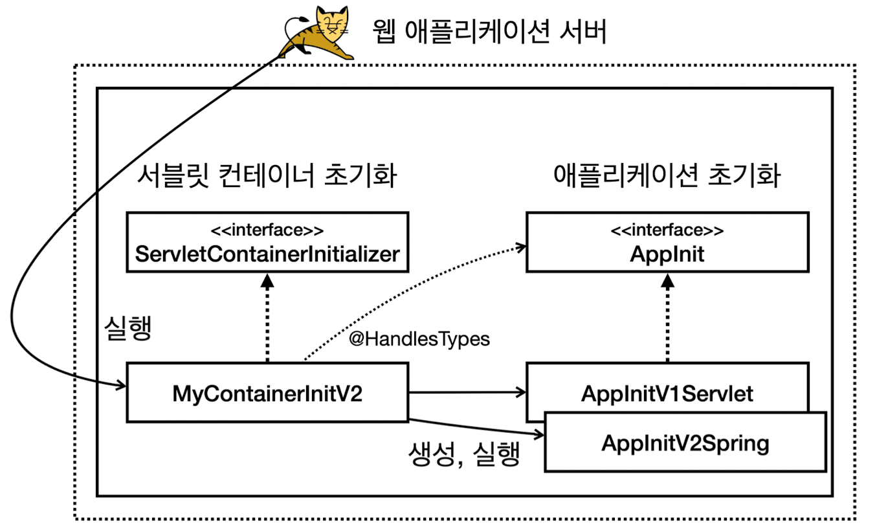
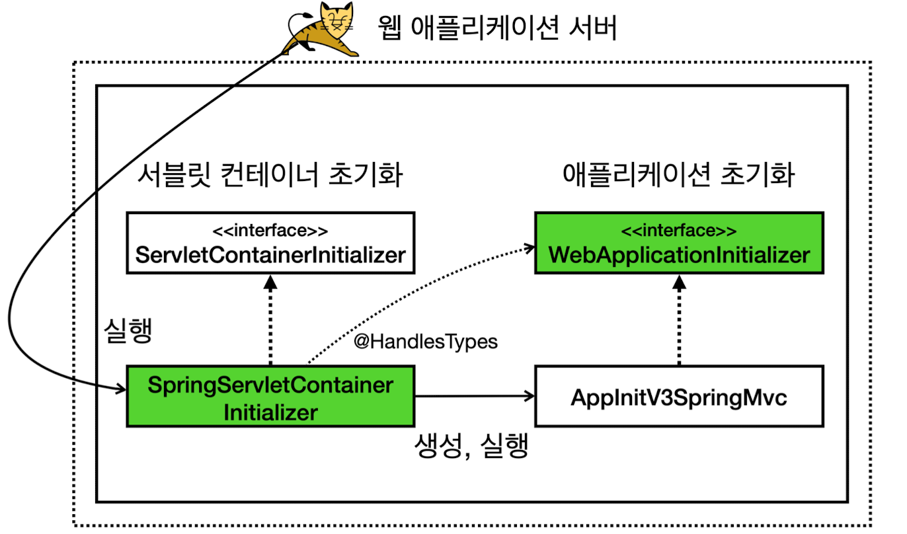

## 스프링 부트의 필요성
- 스프링은 2013년까지 크게 성장해왔지만, 프로젝트 시작 시 필요한 설정이 점점 늘어나 어려워짐
- 스프링 부트 (2014~)
	- **스프링을 편리하게 사용할 수 있도록 지원하는 도구**
	- 스프링 부트가 **프로젝트 시작을 위한 복잡한 설정 과정을 해결** -> 개발 시간 단축
- 핵심 기능
	- **WAS**
		- Tomcat 같은 웹서버를 내장 (별도 웹 서버 설치 필요 X)
	- **라이브러리 관리**
		- 손쉬운 스타터 종속성 제공, 스프링과 외부 라이브러리의 버전 호환을 자동 관리
	- **자동 구성**
		- 프로젝트 시작에 필요한 스프링과 외부 라이브러리의 빈을 자동 등록
	- **외부 설정 공통화**
	- **프로덕션 준비**
		- 모니터링을 위한 메트릭, 상태 확인 기능 제공

## 웹 서버와 서블릿 컨테이너
- JAR & WAR
	- JAR (Java Archive)
		- **여러 클래스와 리소스를 묶어서 만든 압축 파일**
		- **JVM 위에서 직접 실행**되거나 다른 곳에서 사용하는 **라이브러리**로 제공 가능
			- 직접 실행: 직접 자신의 **`main` 메서드**로 실행 가능 (e.g. `java -jar abc.jar`)
				- `MANIFEST.MF` 파일에 실행할 메인 메서드가 있는 클래스를 지정해야 함
			- 라이브러리: 다른 곳에서 **`import`** 될 수 있음
	- WAR (Web Application Archive)
		- WAS에 배포할 때 사용하는 파일
		- **WAS 위에서 실행**됨 (JVM 위에서 WAS가 실행되고 WAS 위에서 WAR가 실행됨)
		- WAS 위에서 실행되기 위해 WAR의 **복잡한 구조**를 지켜야함
			- `WEB-INF`
				- `classes` : 실행 클래스 모음
				- `lib` : 라이브러리 모음
				- `web.xml` : 웹 서버 배치 설정 파일(생략 가능)
			- `index.html` : 정적 리소스
- 자바 웹 애플리케이션 개발 방식
	
	- 외장 서버 방식 (전통적인 방식)
		- WAS 기반 위에 애플리케이션 코드를 빌드한 war 파일을 심어 배포하는 방식
		- 단점
			- WAS를 별도로 설치해야 하고, 버전 변경시에도 재설치해야 함
			- 개발 환경 설정과 배포 과정이 **복잡**
		- 방법
			- 먼저 서버에 WAS(e.g. 톰캣)를 설치
			- 서블릿 스펙에 맞춰 코드를 작성하고 WAR 형식으로 빌드
				- 직접 초기화 방법
					
					- 서블릿 컨테이너 초기화 및 애플리케이션 초기화 코드 작성
						- `ServletContainerInitializer`, `@HandlesTypes`...
					- 스프링 사용 시 애플리케이션 초기화 코드에 관련 코드 작성
						- 스프링 컨테이너 생성 및 빈 등록
						- 디스패처 서블릿 생성 후 스프링 컨테이너와 연결
						- 디스패처 서블릿을 서블릿 컨테이너에 등록
						- ...
					- ...
				- 스프링 MVC 지원 방법 (서블릿 컨테이너 초기화는 자동으로 해줌)
					
					- 애플리케이션 초기화만 작성 (`WebApplicationInitializer` 상속)
						- 스프링 컨테이너 생성 및 디스패처 서블릿 연결 등
			- 빌드한 war 파일을 WAS의 특정 위치에 전달해 배포
	- **내장 서버 방식** (최근 방식)
		- 애플리케이션 코드 안에 **WAS가 라이브러리로서 내장**
		- **스프링 부트가 내장 톰캣을 포함** (`tomcat-embed-core`)
			- 톰캣 생성, 서블릿 컨테이너 초기화 및 애플리케이션 초기화를 모두 자동화
				- e.g. 스프링 컨테이너 생성, 디스패처 서블릿 등록...
					```java
					public class MySpringApplication {
						public static void run(Class<?> configClass, String[] args) {
							System.out.println("MySpringBootApplication.run args=" + List.of(args));
							
							// 톰캣 설정
							Tomcat tomcat = new Tomcat();
							Connector connector = new Connector();
							connector.setPort(8080);
							tomcat.setConnector(connector);
							
							// 스프링 컨테이너 생성
							AnnotationConfigWebApplicationContext appContext = new AnnotationConfigWebApplicationContext();
							appContext.register(configClass);
							
							// 스프링 MVC 디스패처 서블릿 생성 및 스프링 컨테이너 연결
							DispatcherServlet dispatcher = new DispatcherServlet(appContext);
							
							// 디스패처 서블릿 등록
							Context context = tomcat.addContext("", "/");
							tomcat.addServlet("", "dispatcher", dispatcher);
							context.addServletMappingDecoded("/", "dispatcher");
							
							try {
								tomcat.start();
							} catch (Exception e) {
								throw new RuntimeException(e);
							}
						}
					}
					```
		- 방법
			- 개발자는 코드를 작성하고 **JAR로 빌드한 후 원하는 위치에서 실행**
				- 개발자가 `main()` 메서드만 실행하면 WAS는 함께 실행됨
	- 핵심: **내장 서버 방식과 외장 서버 방식과의 차이**
		- 초기화 코드는 거의 똑같음 (서블릿 컨테이너 초기화, 애플리케이션 초기화)
		- 차이는 **시작점**
			- **개발자가 `main()` 메서드를 직접 실행하는가(JAR)**
			- **서블릿 컨테이너가 제공하는 초기화 메서드를 통해 실행하는가(WAR)**
- **Jar** & **FatJar** & **실행 가능 Jar** (feat. 내장 톰캣 라이브러리 포함을 위한 서사)
	- Jar가 요구하는 자바 표준 (Gradle이 자동화)
		- `META-INF/MANIFEST.MF` 파일에 실행할 `main()` 메서드의 클래스 지정
	- Jar 스펙의 한계
		- **Jar 파일은 Jar 파일을 포함할 수 없음** -> 내부 라이브러리 역할의 Jar 파일 포함 불가
	- Fat Jar
		- **라이브러리 Jar의 압축을 풀고 `class`들을 뽑아 새로 만드는 Jar에 포함**하는 방식
		- 용량이 더 큼
		- 장점
			- **하나의 Jar 파일**에 여러 라이브러리를 내장 가능 (내장 톰캣)
		- 단점
			- 어떤 라이브러리가 포함되어 있는지 확인이 어려움 (모두 `class`로 풀려있음)
			- 클래스나 리소스 파일명 중복 시 해결 불가
	- **실행 가능한 Jar** (Executable Jar)
		- **Jar 내부에 Jar를 포함**할 수 있는 특별한 구조의 Jar
		- 스프링 부트가 빌드하면 결과로 나오는 Jar
			- **스프링 부트가 새로 정의** (자바 표준 X)
		- **Fat Jar의 단점을 모두 해결**
		- 내부 구조
			- `META-INF`
				- `MANIFEST.MF` (자바 표준)
			- `org/springframework/boot/loader` (**스프링 부트 로더**: 실행 가능 Jar를 실제 구동 시키는 클래스들이 포함)
				- **`JarLauncher.class`**
					- 스프링 부트 `main()` 실행 클래스
			- `BOOT-INF`
				- `classes` : 우리가 개발한 class 파일과 리소스 파일
				- `lib` : 외부 라이브러리
				- `classpath.idx` : 외부 라이브러리 모음
				- `layers.idx` : 스프링 부트 구조 정보
		- 실행 과정
			- `java -jar xxx.jar` 를 실행
			- `META-INF/MANIFEST.MF` 파일 탐색
				- 스프링 부트는 빌드 시 `JarLauncher`를 넣어주고 `Main-Class`에 지정
			- `Main-Class` 를 읽어서 **`JarLauncher`의 `main()` 메서드를 실행**
			- **`JarLauncher`가 몇몇 기능을 처리**
				- Jar 내부 Jar를 읽는 기능을 처리
					- `BOOT-INF/lib/` 인식
				- 특별한 구조에 맞게 클래스 정보 읽어들임
					- `BOOT-INF/classes/` 인식
			- `JarLauncher`가 `MANIFEST.MF`의 `Start-Class`에 지정된 `main()` 호출
				- **실제 프로젝트의 `main()` 호출**
- **결국 스프링 부트란?**
	- 앞의 프로젝트 시작을 위한 복잡한 설정 과정을 라이브러리로 만든 것
	- 주요 코드
		```java
		@SpringBootApplication
		public class BootApplication {
			public static void main(String[] args) {
		        SpringApplication.run(BootApplication.class, args);
			}
		}
		```
		- **`main()` 메서드**에서 코드 한 줄로 시작
			- `SpringApplication.run(BootApplication.class, args);`
		- **`SpringApplication.run()`
			- **복잡한 설정 과정** 처리
			- 핵심: **WAS(내장 톰켓) 생성** + **스프링 컨테이너 생성**
				- 톰캣 설정, 스프링 컨테이너 생성, 디스패처 서블릿 생성 및 스프링 컨테이너와 연결, 서블릿 컨테이너에 디스패처 서블릿 등록...
		- **`@SpringBootApplication`**
			- **컴포넌트 스캔 시작점 지정** (내부에 `@ComponentScan` 기능 붙어 있음)
			- `main()` 메서드가 있는 **시작점 클래스**에 추가
				- 기본 대상: 애노테이션이 붙은 클래스의 **현재 패키지부터 그 하위 패키지**

## 스프링 부트가 제공하는 라이브러리 관리 기능
- **외부 라이브러리 버전 관리**
	- 개발자는 원하는 라이브러리만 고르고 **버전은 생략**
	- 스프링 부트가 **부트 버전에 맞춘 최적화된 라이브러리 버전을 선택해줌** (**호환성** 테스트 완료)
		```java
		plugins {
			id 'org.springframework.boot' version '3.0.2'
			id 'io.spring.dependency-management' version '1.1.0' //추가
			id 'java'
		}
		```
		- **`dependency-management` 플러그인** 사용
			- `spring-boot-dependencies`의 bom 정보를 참고
			- **bom**(Bill of Materials, 부품 목록)
				- 현재 프로젝트에 지정한 스프링 부트 버전에 맞는 라이브러리 버전 명시
		- `spring-boot-dependencies`는 gradle 플러그인에서 사용하므로 눈에 보이진 않음
- **스프링 부트 스타터** 제공
	- **Best Practice 라이브러리 뭉치를 제공**
		- 덕분에 일반적으로 많이 사용하는 대중적인 라이브러리로 **간단하게 프로젝트 시작 가능**
	- 이름 패턴
		- 공식: `spring-boot-starter-*`
		- 비공식: `thirdpartyproject-spring-boot-starter` (스프링이 공식적 제공 X)
			- e.g. `mybatis-spring-boot-starter`
	- 자주 사용하는 스타터
		- `spring-boot-starter` : 핵심 스타터, 자동 구성, 로깅, YAML (다른 스타터 사용 시 보통 포함됨)
		- `spring-boot-starter-jdbc` : JDBC, HikariCP 커넥션풀
		- `spring-boot-starter-data-jpa` : 스프링 데이터 JPA, 하이버네이트
		- `spring-boot-starter-data-mongodb` : 스프링 데이터 몽고
		- `spring-boot-starter-data-redis` : 스프링 데이터 Redis, Lettuce 클라이언트
		- `spring-boot-starter-thymeleaf` : 타임리프 뷰와 웹 MVC
		- `spring-boot-starter-web` : 웹 구축을 위한 스타터, RESTful, 스프링 MVC, 내장 톰캣
		- `spring-boot-starter-validation` : 자바 빈 검증기(하이버네이트 Validator)
		- `spring-boot-starter-batch` : 스프링 배치를 위한 스타터

>참고: 스프링 부트가 관리하지 않는 **외부 라이브러리 사용하기**
>- 버전 없이 적용해보고 안되면 버전 명시
>- e.g. `implementation 'org.yaml:snakeyaml:1.30'`

>참고: 스프링 부트가 관리하는 **라이브러리의 버전 변경** 방법
>- e.g. `ext['tomcat.version'] = '10.1.4'`
>- 거의 변경할 일이 없지만, 혹시나 버그 때문에 버전을 바꿔야 한다면 사용
>- `tomcat.version` 같은 속성값은 스프링 부트 docs에서 확인하자