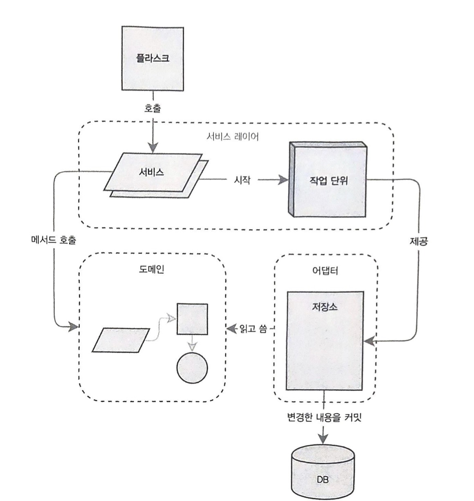
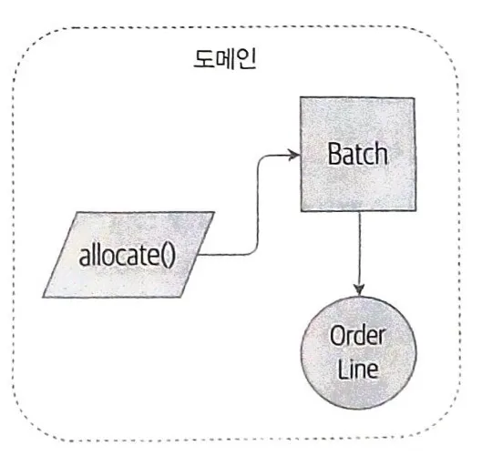
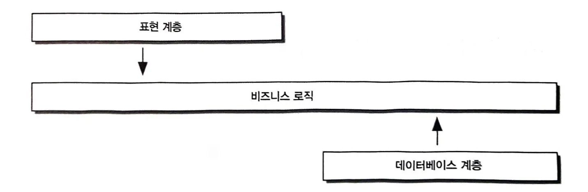
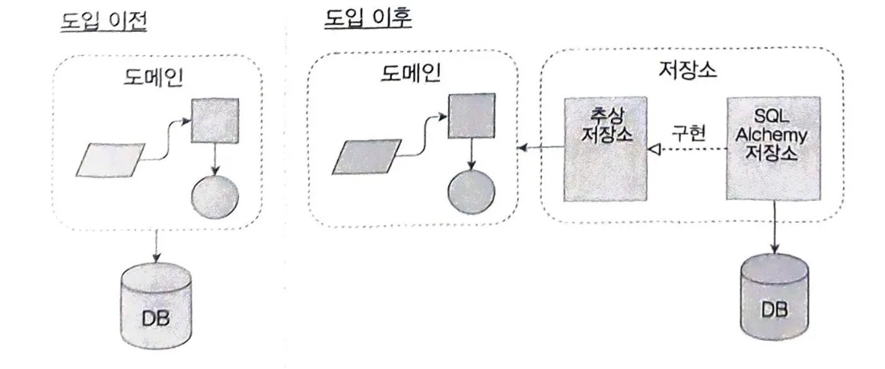
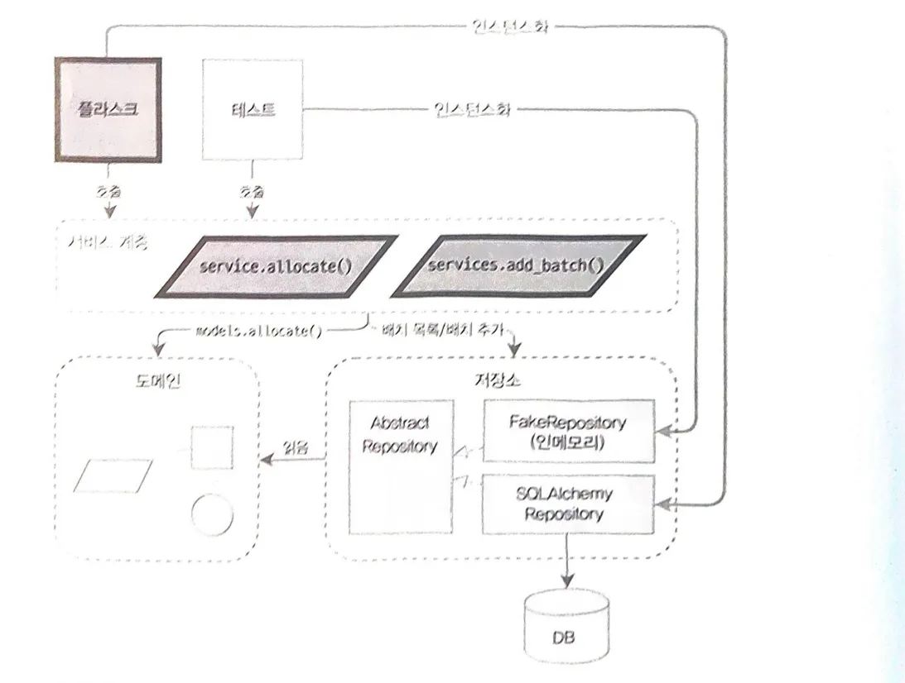
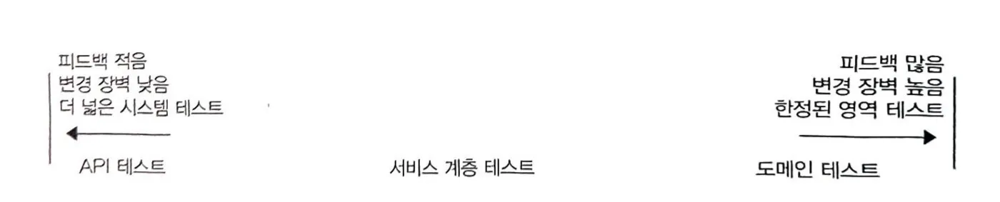
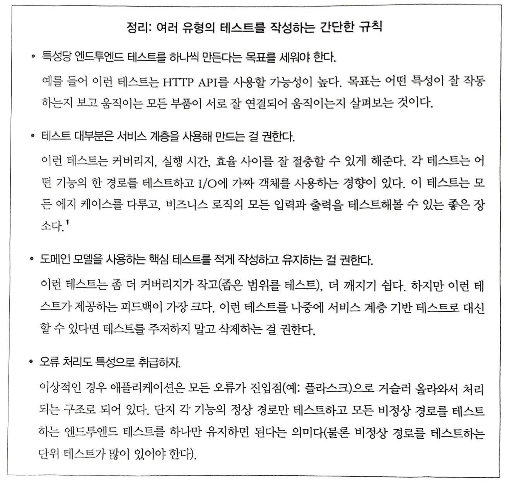

# Part 1 목표 아키텍처



# Chapter 0 Big Ball of Mud에 대한 접근

## Big Ball of Mud 안티패턴

처음에 깔끔한 작성을 목표로 시작한 소프트웨어 시스템도 시간이 지나면서 모든 요소 (도메인 지식, 비즈니스 로직, 로깅, 이메일 보내기 etc…)들이 서로 Coupling(결합)되어 시스템의 일부를 바꾸는 것도 힘들어지는 상황

## Big Ball of Mud를 피하기 위한 일반적인 접근

### 1. Abstraction(추상화) & Encapsulation(캡슐화)
행동을 캡슐화하여 추상화로 사용하는 것은 코드의 표현력을 높이고 테스트와 유지보수를 더 쉽게 만든다.

### 2. Layering(계층화)
Layering Architecture는 복잡한 의존성들을 해결한다. 코드의 역할을 구분하고 범주(category)를 나눠 어떤 코드 범주가 특정 코드 범주를 호출할 수 있는지 규칙을 정한다. 도메인 모델(Domain Model)로 비즈니스 계층을 만들고, 모든 비즈니스 로직을 이곳에 모아야 한다.

>3-Layer Architecture:
>표현 계층 (UI or API or CLI…)
>------------|------------
>비즈니스 로직 (Business Rules & Workflows)
>------------|------------
>데이터베이스 계층 (Data Read & Write)
 
### 3. DIP (Dependency Inversion Principle, 의존성 역전 원칙)
비즈니스 코드는 기술적인 세부 사항에 의존해서는 안된다. 서로 추상화를 사용해 강한 의존성을 해소하여 각자가 독립적으로 변경될 수 있는 환경을 만들어야 한다.

예를 들어, 인프라를 바꿔야 하는 필요성이 있을 때 비즈니스 계층을 변경하지 않고도 인프라 세부 사항을 바꿀 수 있어야 한다.

>DIP의 정의
>1. 고수준 모듈은 저수준 모듈에 의존해서는 안된다. 두 모듈 모두 추상화에 의존해야 한다.
>2. 추상화는 세부 사항에 의존해서는 안된다. 반대로 세부 사항은 추상화에 의존해야 한다.

# Chapter 1. 도메인 모델링

## 도메인 모델



- Domain(도메인): 해결해야 할 문제
- Model(모델): 어떤 프로세스나 현상을 설명하기 위해 그것의 특성을 관찰하고 정리한 일종의 Mind Map

DDD(Domain-Driven Design)는 도메인 모델링의 개념을 널리 알렸고, 소프트웨어에서 가장 중요한 요소는 문제에 대해 유용한 모델을 제공하는 것이라고 주장한다.

도메인 모델링 자체는 DDD보다도 일찍 시작된 개념 (1980~)

비즈니스 전문가는 이미 그들의 도메인의 비즈니스 용어가 있으므로 개발자는 이를 공부하고 소프트웨어에 녹여내야 한다.

도메인 모델의 용어와 규칙은 비즈니스 전문가와 Ubiquitous Language(유비쿼터스 언어=비즈니스 전문용어)로 표현해야 한다.

## Value Object, Entity
- Value Object
    - 데이터는 있지만 유일한 식별자가 없는 비즈니스 개념, 내부 데이터에 의해 개체 식별
    - 값이 같으면 동일하다. (Structural Equality,구조적 동등성)
    - 10파운드를 말할 때 10파운드라는 값(가치)이 중요하지, 어떤 지폐인지는 중요하지 않다.
    - 수명이 없고 항상 Entity에 속한다.
    - 불변(immutable) 속성
    - dataclass의 `@frozen=True` 로 해시 설정
- Entity
    - 고유한 식별자로 구분되는 개념
    - 식별자가 같으면 동일하다. (Identifier Equality)
    - 같은 이름, 같은 성별의 군인도 다른 군번(id)을 가진 동명이인일 수 있다.
    - 수명이 있다.
    - 가변(mutable) 속성
    - `__eq__`를 식별자로 비교하도록 구현
    - `__hash__`를 None으로 설정해서 집합등에 사용할 수 없게 구현

>[엔티티(entity)와 값객체(value-object)에 대해서](https://velog.io/@cjh8746/%EC%97%94%ED%8B%B0%ED%8B%B0entity%EC%99%80-%EA%B0%92%EA%B0%9D%EC%B2%B4value-object%EC%97%90-%EB%8C%80%ED%95%B4%EC%84%9C)

>`__hash__`는 객체를 집합에 추가하거나 딕셔너리의 키로 사용할 때 동작을 제어하는 magic method

- Domain Service Function
    - 동사로 표현되는 부분은 (도메인과 관련된 비즈니스 로직)을 함수로 구현한다.
    - Domain Exception(예외)을 통해서도 도메인 개념을 표현할 수 있다
        Ex) OutOfStock
    - 이러한 동사 하나하나가 단위 테스트가 된다.

# Chapter 2. 저장소 패턴

앱과 도메인이 복잡한 경우 Repository Pattern을 통해 저장소 계층을 하나 추가하는 방향을 생각해 볼 수 있다.

## 영속성과 분리된 모델(Persistence-Igorant Model) - 도메인 모델과 ORM의 분리



도메인 모델은 그 어떤 의존성도 없어야 한다. 즉, 인프라와 관련된 문제가 도메인 모델에 영향을 끼쳐 단위테스트를 느리게 하고 도메인 모델 변경을 어렵게 해서는 안된다.

따라서, 모델(비즈니스 로직)을 내부에 있도록 하여 의존성이 내부로 들어오게 해야 한다. (Onion Architecture)



이를 위해 도메인 모델과 ORM을 분리하여 도메인 모델이 항상 순수한 상태를 유지하고 인프라에 신경쓰지 않도록 한다. SQLAlchemy의 Classical Mapper를 사용하면 이를 구현할 수 있다. 이러한 구조에서는 비즈니스 로직에 영향을 주지 않고 SQLAlchemy를 제거하여 다른 ORM 혹은 전혀 다른 영속화 시스템을 채택해 갈아 끼울 수 있다.

## Repository Pattern (저장소 패턴)

데이터 저장소를 간단히 추상화하는 것으로 데이터 계층을 분리할 수 있다.

추상화한 Repository는 마치 모든 데이터가 메모리 상에 존재하는 것처럼 가정해 데이터 접근과 관련된 세부 사항을 감춘다. 일반적으로 `get()`, `add()`를 통해 데이터를 가져오고 조작한다.

>저장소에 대한 테스트는 모든 모델이 할 필요는 없다. 한 모델 클래스에 대해 생성/변경/저장을 모두 테스트했다면, 새로 추가되는 비슷한 패턴의 클래스는 최소한의 호출 응답만 확인하거나 테스트를 전혀 진행하지 않을 수도 있다.

## Pros & Cons
- 장점
    - Repository와 Domain Model사이의 인터페이스를 간단하게 유지할 수 있다.
    - 모델과 인프라를 완전히 분리했기 때문에 도메인이 복잡해도 비즈니스 로직 변경과 인프라 변경이 쉽다.
    - 영속성을 생각하기 전에 도메인 모델을 작성하면, 처리해야 할 비즈니스 문제에 더 잘 집중할 수 있다.
    - Fake Repository를 만드는 식으로 단위 테스트를 위한 가짜 저장소를 쉽게 만들 수 있다.
- 단점
    - ORM mapping 변경 및 유지 보수 작업에 공수가 더 든다. (모델, ORM 둘 다 손봐야 하기 때문에)
    - 저장소 계층에 대한 러닝커브가 발생한다.

# Chapter 3. 결합과 추상화

## Cohesion(응집)과 Coupling(결합)
- 응집: 한 컴포넌트가 다른 컴포넌트를 지원하며 서로 맞물려 잘 돌아가는 상황 (지역적인 결합)
- 결합: B 컴포넌트가 깨지는게 두려워서 A 컴포넌트를 변경할 수 없는 경우 (전역적인 결합)

## Abstraction(추상화)
추상화를 통해 세부사항을 감추면 시스템 내 결합 정도를 줄일 수 있다.
또한, 추상화는 테스트를 더 쉽게 해준다.

## Fake Object VS Mock
- Fake Object
	- 대치하려는 대상을 동작할 수 있게 구현한 존재, 테스트를 위한 구현만 제공 (고전 스타일 TDD)
	- 의존성 주입을 하는 함수를 만들면 Test 시 Fake Object를 만들어 주입하기 쉬움
	    I/O의 경우 의존성 주입해 Fake를 뜨면 편함
	    `def synchronise_dirs(reader, **filesystem**, source_root, dest_root):`
- Mock
	- 대상이 어떻게 쓰이는지 검증할 때 사용 (런던 학파 TDD)
	- 목을 너무 많이 사용하는 테스트는 설정 코드가 많아서 정작 신경을 써야 하는 이야기가 드러나지 않는 단점이 있다.

# Chapter 4. 서비스 계층 (유스 케이스)



## Use Case(유스 케이스)
사용자의 행동 요청 시나리오에 따라 시스템이 수행하는 작업 과정

## Orchestration(오케스트레이션)
저장소에서 여러 데이터를 가져오고, 데이터베이스 상태에 따라 입력을 검증하며 오류 처리하고, 성공적인 경우 데이터를 데이터베이스에 커밋하는 일련의 작업들을 의미한다.

이러한 로직은 웹 API 엔드포인트와 관련이 없고 엔드포인트를 무겁고 장황하게 만드므로, 따로 서비스 계층에 분리하는 것이 타당하다.

## Service Layer
유스 케이스를 정의하고 워크 플로를 조정하는 Orchestration(오케스트레이션) 로직을 담는다.

(서비스 계층=오케스트레이션 계층=유스 케이스 계층)

전형적인 서비스 계층 함수들은 다음과 비슷한 단계를 거친다.

- 저장소에서 어떤 객체들을 가져온다.
- 현재 세계를 바탕으로 요청을 검사하거나 어서션으로 검증한다.
- 도메인 서비스(비즈니스 로직)를 호출한다.
- 모든 단계가 정상적으로 실행됐다면 변경한 상태를 저장하거나 업데이트한다.

서비스 계층 추가 시 다음과 같은 장점이 있다.

- 엔드포인트가 아주 얇아지고 작성하기 쉬워진다. 엔드포인트는 JSON 파싱이나 웹 기능만 담당한다.
- 테스트의 상당 부분을 빠른 단위 테스트와 최소화된 E2E 및 통합 테스트로 만들어, 테스트 피라미드를 높은 기어비(High Gear)로 적절히 구성할 수 있다.

# Chapter 5. 높은 기어비와 낮은 기어비의 TDD

## 결합과 설계 피드백 사이의 트레이드 오프



API 테스트(High Gear)로 갈수록 세부 설계 피드백은 적어지지만, 더 넓은 커버리지의 테스트를 제공하므로 데이터베이스 스키마 변경 등의 대규모 변경에 대하여 코드가 망가지지 않는다는 자신감을 제공한다.

반대로, 도메인 모델 테스트(Low Gear)는 도메인 언어로 작성되므로 모델의 살아있는 문서 역할을 한다. 다만, 특정 구현과 긴밀하게 결합되어 있어서 전체가 깨질 수 있는 불안함을 포함해 로직 변경시 Cost가 크다

## Service Layer 추가 후 지향할 테스트 방향

도메인 모델에 집중되어 있던 단위 테스트를 모두 서비스 계층 함수에 대해 테스트하도록 리팩토링할 필요가 있다.

즉, E2E 테스트는 호출과 응답에 관련한 Happy Path, Unhappy Path만 테스트하고 비즈니스 로직 관련 테스트는 Service Layer 함수들에 대한 단위테스트로 진행한다.

- 도메인 모델에 대한 테스트가 너무 많으면 코드베이스를 바꿀 때마다 수십 개에서 수백 개의 테스트를 변경해야 하는 문제가 생긴다.
- 서비스 계층 테스트는 더 낮은 결합(Coupling)을 제공하고 커버리지, 실행 시간, 효율 사이를 잘 절충할 수 있게 도와줘서 도메인 모델 테스트 보다 이점이 있다.
- 또한, 서비스 계층 테스트에 집중하면 커버리지가 더 높으므로, 도메인 모델을 리팩토링할 때 변경해야 하는 코드의 양을 크게 줄일 수 있다.

## 서비스 계층 테스트를 도메인으로부터 완전히 분리하기

### 서비스 함수 파라미터는 도메인 객체를 받지 않고 원시 타입으로 받도록 선언하자.

`def allocate(line: OrderLine, repo: AbstractRepository, session) -> str`

보다는

`def allocate(orderid: str, sku: str, qty: int, repo: abstractRepository, session) -> str:`

으로 사용하자.

### 서비스 테스트의 모든 도메인 의존성을 한 곳에 모으자.

픽스처 함수에 팩토리 함수를 넣어 도메인 의존성을 모으는 방법이 있다.

개인적으로 가장 좋은 것은 모델 객체를 추가하는 서비스 함수를 하나 작성해두면, 도메인 의존성 없이 테스트에 지속적으로 사용할 수 있어 편리하다. 덕분에 서비스 계층이 오직 서비스 계층에만 의존한다.

```python
def test_add_batch():
    repo, session = FakeRepository([]), FakeSession()
    services.add_batch("b1", "CRUNCHY-ARMCHAIR", 100, None, repo, session)
    assert repo.get("b1") is not None
    assert session.committed
```

다만, 단순히 테스트 의존성 제거 만을 위해 새 서비스를 작성할 필요는 없다. 미래에 필요성을 고려해 도입한다.

## 엔드 투 엔드 테스트

API 테스트 역시 API 테스트에만 의존하도록 하는 것은 괜찮은 방법이다.

또한, Happy Path를 위한 하나의 E2E & 모든 Unhappy Path를 위한 하나의 E2E를 작성해 관리하자.

## 정리



# Chapter 6. 작업 단위 패턴 (Unit of Work)

작업 단위 패턴은 원자적 연산(Atomic Operation)에 대한 추상화다.
어떤 객체가 메모리에 적재됐고 어떤 객체가 최종 상태인지를 기억한다.

- 장점
	- UoW는 영속적 저장소에 대한 단일 진입점으로 기능하여 엔드포인트와 서비스 계층을 데이터 계층과 완전히 분리할 수 있다. (서비스 함수 자체와 엔드포인트(Flask, FastAPI)가 데이터베이스와 직접 대화하지 않는다.) 데이터베이스에 접근하는 코드가 여기저기 흩어지지 않게 하나로 모으고, 각 컴포넌트가 자신에게 반드시 필요한 것들만 갖게 하는 것이 좋다.
	- 원자적 연산을 표현하는 좋은 추상화가 생기고, 파이썬 콘텍스트 관리자를 사용하면 원자적 한 그룹으로 묶여야 하는 코드 블록을 시각적으로 쉽게 알아볼 수 있다.
	- 트랜잭션 시작과 끝을 명시적으로 제어할 수 있고, 애플리케이션이 실패하면 기본적으로 안전한 방식의 트랜잭션 처리를 할 수 있다.
	- UoW는 세션을 단순화해 핵심 부분만 사용하도록 해준다. 세션 API는 풍부한 기능과 도메인에 불필요한 연산을 제공하므로, 코드를 Session 인터페이스와 결합하는 것은 SQLAlchemy의 모든 복잡성을 결합하기로 결정하는 것이다.
- 단점
    - ORM이 이미 원자적 연산에 대한 좋은 추상화를 제공할 수 있다.
    - (롤백, 다중 스레딩이 담긴) 복잡한 트랜잭션을 처리하는 코드의 경우 매우 신중하게 생각해야 한다.