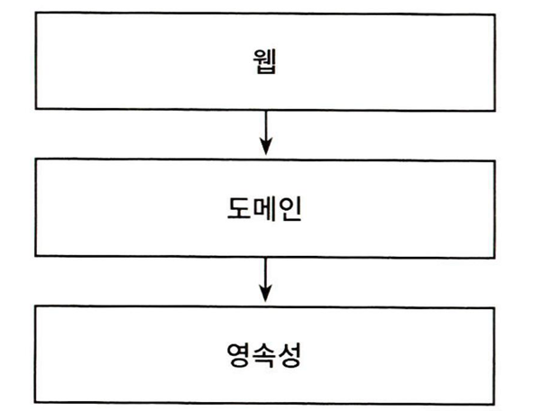
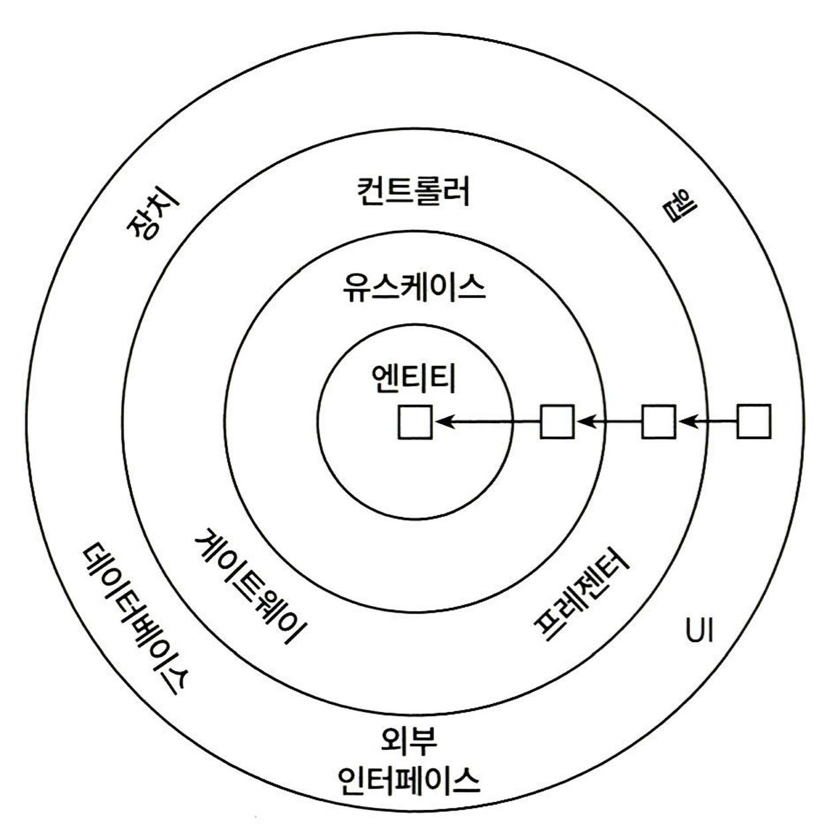

## 주요 아키텍처 용어 기원
- 클린 아키텍처 - 로버트 마틴 (Robert C. Martin)
	- **도메인 중심 아키텍처들에 적용되는 원칙**을 제시 (**추상적**)
- 육각형 아키텍처 (Hexagonal Architecture) - 알리스테어 콕번 (Alistair Cockburn) (**구체적**)
- 도메인 주도 설계 (DDD, Domain Driven Design)- 에릭 에반스 (Eric Evans)

## 전통적인 계층형 아키텍처의 문제

- 일반적인 3계층 아키텍처
- **올바르게 계층을 구축**하고 **추가 아키텍처 강제 규칙 적용**하면 쉽게 기능 추가 및 유지보수 가능
	- 웹계층이나 영속성 계층에 **독립적으로 도메인 로직 작성 가능**
	- 아래 문제점만 극복할 수 있다면, 좋은 코드 유지 가능 (강제가 없어 어려울 뿐)
- 문제점: **장기적으로 나쁜 방향의 코드를 쉽게 허용**
	- 의존성 방향으로 인해 **데이터베이스 주도 설계를 유도**
		- 비즈니스 관점에서 도메인 로직을 먼저 만들어야하지만, 영속성 계층을 먼저 구현하게 됨
		- 도메인 계층이 영속성 계층의 ORM 엔터티를 사용해 강한 결합 발생
	- 강제가 적어 **지름길을 택하기 쉬워짐**
		- 전통 계층형 아키텍처의 유일한 규칙: **같은 계층 혹은 아래 계층에만 의존 가능**
		- 필요한 상위 컴포넌트를 계속 아래로 내리기 쉬움 (e.g. 영속성 계층에 몰리는 헬퍼, 유틸리티)
		- **아키텍처 규칙 강제 필요성** (빌드 실패 수준으로 관리)
	- **테스트가 어려워짐**
		- **계층 건너뛰기**(웹 계층 -> 영속성 계층) 시, 종종 웹 계층으로 도메인 로직 책임이 전파
		- 웹 계층 테스트에서 영속성 계층까지 모킹해야 해서, 테스트 복잡도 상승
	- **유스케이스를 숨김**
		- 도메인 로직이 여러 계층에 흩어짐 -> 새로운 기능을 추가할 **위치 찾기가 어려움** (**수직**적 측면)
		- 여러 개 유스케이스 담당하는 넓은 서비스 허용 -> 작업할 서비스 **찾기 어려움** (**수평**적 측면)
	- **동시 작업 지원 아키텍처는 아님** (병합 충돌)
		- 영속성 -> 도메인 -> 웹 순으로 개발하므로, 특정 기능은 동시에 1명의 개발자만 작업 가능
		- 현재 넓은 서비스라면, 다른 유스케이스 작업도 같은 서비스에서 동시에 하게 됨

## 클린 아키텍처의 핵심 토대
- 단일 책임 원칙 (SRP)
	- 일반적 정의: 하나의 컴포넌트는 한 가지 일만 해야 한다.
	- 실질적 정의: **컴포넌트를 변경하는 이유는 오직 하나뿐이어야 한다.** (책임 = **변경할 이유**)
		- 컴포넌트를 변경할 이유가 한 가지라면, 다른 곳 수정 시 해당 컴포넌트를 신경쓸 필요가 없음
- 의존성 역전 원칙 (DIP)
	- 정의: **코드상의 어떤 의존성이든 그 방향을 바꿀 수 있다.**
	- 상위 계층의 변경할 이유를 줄임 (e.g. 영속성 계층에 대한 도메인 계층의 의존성)

## 클린 아키텍처

- 핵심
	- **의존성 규칙**: **계층 간의 모든 의존성이 도메인 코드로 향해야 한다.**
- 구조
	- **도메인 엔터티** (코어): **비즈니스 규칙에 집중**
	- 유스케이스: 도메인 엔터티에 접근 가능
	- 비즈니스 규칙 지원 컴포넌트 (컨트롤러, 게이트웨이, 프레젠터 등)
	- 바깥쪽 계층: 다른 서드파티 컴포넌트에 어댑터 제공
- 대가
	- **엔터티에 대한 모델**을 **각 계층에서 따로 유지보수해야 함** (통신할 때는 **매핑 작업** 필요)
	- 하지만, **결합이 제거**되어 **바람직한 상태**
		- e.g. ORM 엔터티는 기본생성자를 강제하지만 도메인 모델에는 필요없음

