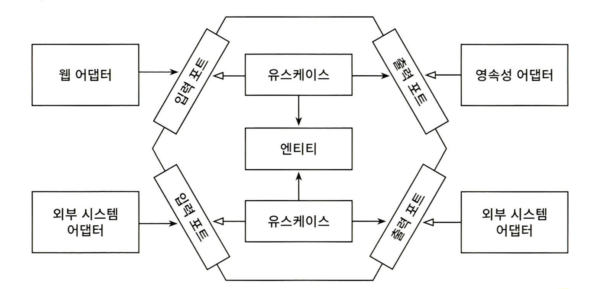
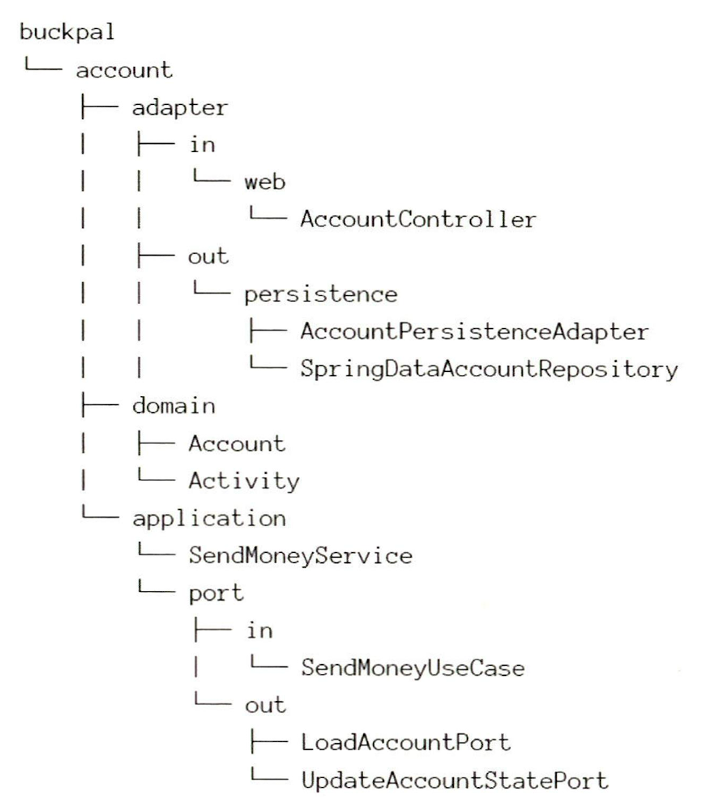
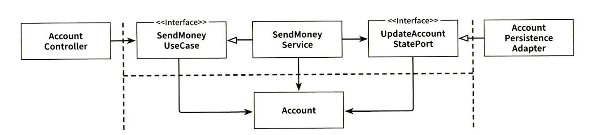
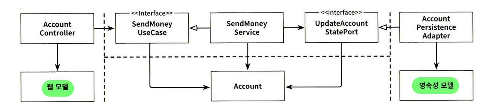
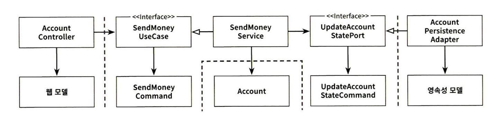
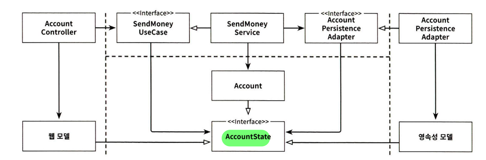
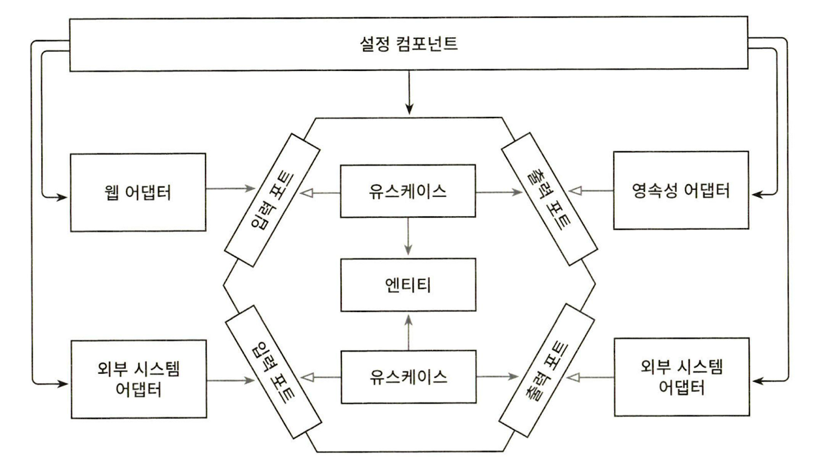

## 주요 아키텍처 용어 기원
- 클린 아키텍처 - 로버트 마틴 (Robert C. Martin)
	- **도메인 중심 아키텍처들에 적용되는 원칙**을 제시 (**추상적**)
- 육각형 아키텍처 (Hexagonal Architecture) - 알리스테어 콕번 (Alistair Cockburn) (**구체적**)
- 도메인 주도 설계 (DDD, Domain Driven Design)- 에릭 에반스 (Eric Evans)

## 전통적인 계층형 아키텍처의 문제

- 일반적인 3계층 아키텍처
- **올바르게 계층을 구축**하고 **추가 아키텍처 강제 규칙 적용**하면 쉽게 기능 추가 및 유지보수 가능
	- 웹계층이나 영속성 계층에 **독립적으로 도메인 로직 작성 가능**
	- 아래 문제점만 극복할 수 있다면, 좋은 코드 유지 가능 (강제가 없어 어려울 뿐)
- 문제점: **장기적으로 나쁜 방향의 코드를 쉽게 허용**
	- 의존성 방향으로 인해 **데이터베이스 주도 설계를 유도**
		- 비즈니스 관점에서 도메인 로직을 먼저 만들어야하지만, 영속성 계층을 먼저 구현하게 됨
		- 도메인 계층이 영속성 계층의 ORM 엔터티를 사용해 강한 결합 발생
	- 강제가 적어 **지름길을 택하기 쉬워짐**
		- 전통 계층형 아키텍처의 유일한 규칙: **같은 계층 혹은 아래 계층에만 의존 가능**
		- 필요한 상위 컴포넌트를 계속 아래로 내리기 쉬움 (e.g. 영속성 계층에 몰리는 헬퍼, 유틸리티)
		- **아키텍처 규칙 강제 필요성** (빌드 실패 수준으로 관리)
	- **테스트가 어려워짐**
		- **계층 건너뛰기**(웹 계층 -> 영속성 계층) 시, 종종 웹 계층으로 도메인 로직 책임이 전파
		- 웹 계층 테스트에서 영속성 계층까지 모킹해야 해서, 테스트 복잡도 상승
	- **유스케이스를 숨김**
		- 도메인 로직이 여러 계층에 흩어짐 -> 새로운 기능을 추가할 **위치 찾기가 어려움** (**수직**적 측면)
		- 여러 개 유스케이스 담당하는 넓은 서비스 허용 -> 작업할 서비스 **찾기 어려움** (**수평**적 측면)
	- **동시 작업 지원 아키텍처는 아님** (병합 충돌)
		- 영속성 -> 도메인 -> 웹 순으로 개발하므로, 특정 기능은 동시에 1명의 개발자만 작업 가능
		- 현재 넓은 서비스라면, 다른 유스케이스 작업도 같은 서비스에서 동시에 하게 됨

## 클린 아키텍처의 핵심 토대
- **단일 책임 원칙**(SRP)
	- 일반적 정의: 하나의 컴포넌트는 한 가지 일만 해야 한다.
	- 실질적 정의: **컴포넌트를 변경하는 이유는 오직 하나뿐이어야 한다.** (책임 = **변경할 이유**)
		- 컴포넌트를 변경할 이유가 한 가지라면, 다른 곳 수정 시 해당 컴포넌트를 신경쓸 필요가 없음
- **의존성 역전 원칙**(DIP)
	- 정의: **코드상의 어떤 의존성이든 그 방향을 바꿀 수 있다.** (서드파티 라이브러리 제외)
	- 상위 계층의 **변경할 이유를 줄임**
		- e.g. 영속성 계층에 대한 도메인 계층의 의존성

## 클린 아키텍처 (Clean Architecture)

- 핵심
	- **의존성 규칙**: **계층 간의 모든 의존성이 도메인 코드로 향해야 한다.**
		- **의존성 역전** -> 영속성과 UI 문제로부터 도메인 로직의 결합 제거 
		- -> **변경 이유의 수 감소** 
		- -> **유지보수성 향상**
- 구조
	- 애플리케이션 코어
		- **도메인 엔터티**: **비즈니스 규칙에 집중**
		- 유스케이스: 도메인 엔터티에 접근 가능
	- 비즈니스 규칙 지원 컴포넌트 (컨트롤러, 게이트웨이, 프레젠터 등)
	- 바깥쪽 계층: 다른 서드파티 컴포넌트에 어댑터 제공
- 대가
	- **엔터티에 대한 모델**을 **각 계층에서 따로 유지보수해야 함** (통신할 때는 **매핑 작업** 필요)
	- 하지만, **결합이 제거**되어 **바람직한 상태**
		- e.g. ORM 엔터티는 기본생성자를 강제하지만 도메인 모델에는 필요없음
- 유의사항
	- **의존성 역전**은 실제로 **유스케이스**와 **영속성 어댑터** 간 적용 (**의존성 방향이 코어로 향하도록**)

## 육각형 아키텍처 (Hexagonal Architecture)

- **클린 아키텍처 원칙들에 부합**하는 **구체적 아키텍처** 중 하나
- **포트와 어댑터**(ports-and-adapters) **아키텍처**로도 불림
- 핵심
	- 클린 아키텍처의 **의존성 규칙** 그대로 적용 (**모든 의존성은 코어로 향한다.**)
		- **의존성 역전** -> 영속성과 UI 문제로부터 도메인 로직의 결합 제거 
		- -> **변경 이유의 수 감소** 
		- -> **유지보수성 향상**
- 구조
	- **애플리케이션 코어**
		- **도메인 엔터티** 
		- **유스케이스**: 도메인 엔터티와 상호작용
	- **어댑터**
		- **애플리케이션**과 **다른 시스템** 간의 **번역**을 담당
			- e.g. 웹 어댑터, 영속성 어댑터, 외부 시스템 어댑터
		- 분류
			- **주도하는 어댑터**(driving adapter) = **인커밍 어댑터** = **왼쪽** 어댑터
				- 애플리케이션 코어**를** 호출 (**`in`**)
			- **주도되는 어댑터**(driven adapter) = **아웃고잉 어댑터** = **오른쪽** 어댑터
				- 애플리케이션 코어**가** 호출 (**`out`**)
	- **포트**
		- **애플리케이션 코어**와 **어댑터들** 간의 **통신**을 위한 **인터페이스**
		- 분류
			- 입력 포트(**`in`**) = 인커밍 포트
				- **주도하는 어댑터가 호출**하는 인터페이스
				- 구현체: 코어 내 **유스케이스 클래스**
			- 출력 포트(**`out`**) = 아웃고잉 포트
				- **애플리케이션 코어가 호출**하는 인터페이스
				- 구현체: **어댑터 클래스**
- 계층 분류
	- 어댑터 계층: **어댑터**
	- 애플리케이션 계층: **포트** + **유스케이스 구체 클래스**(Service)
	- 도메인 계층: **도메인 엔터티**
- 유의사항
	- **의존성 역전**은 실제로 **유스케이스**와 **주도되는 어댑터** 간에 적용됨 -> **의존성 방향이 코어로 향하도록**
	- **주도하는 어댑터**는 원래 의존성 방향이 코어로 향함 -> **인터페이스**는 **단순 진입점 구분** 역할

## 표현력 있는 패키지 구조

- 표현력 있는 패키지 구조는 **각 요소들을 패키지 하나씩에 직접 매핑**
	- **아키텍처-코드 갭을 완화시킴**
	- **아키텍처에 대한 적극적인 사고**를 촉진
	- -> 의사소통, 개발, 유지보수 모두 조금 더 수월해짐
- 분류
	- 엔터티: `domain` - **`Account`**, **`Activity`**
	- 유스케이스: `application` - **`SendMoneyService`**
	- 인커밍 포트: `application` - `port` - **`SendMoneyUseCase`**
	- 아웃고잉 포트: `application` - `port` - **`LoadAccountPort`**, **`UpdateAccountStatePort`**
	- 인커밍 어댑터: `adapter` - `in` - `web` - **`AccountController`**
	- 아웃고잉 어댑터: `adapter` - `out` - `persistence` - **`AcountPersistenceAdapter`**
- 고려사항
	- **접근 제한자**로 계층 사이 **불필요한 의존성 예방** 가능 (e.g. 도메인의 영속성 계층 의존)
		- `port`만 `public` 두기
		- 나머지는 **모두 `package-private`**
	- **DDD 개념**과 직접적 대응 가능
		- **상위 레벨 패키지**를 **바운디드 컨텍스트**로 활용 가능 (e.g. `account`)
	- **책임을 좁히는 유스케이스명을 사용하자** (로버트 마틴, 소리치는 아키텍처)
		- `AccountService` 보다 `SendMoneyService` 인터페이스명이 좋음 (송금하기 유스케이스)
	- 모든 계층에 의존성을 가진 **중립적인 컴포넌트**를 도입해 **의존성 주입**하자
		- 아키텍처를 구성하는 대부분의 클래스를 초기화해 인스턴스 주입
		- e.g. `AccountController`, `SendMoneyService`, `AccountPersistenceAdapter`

## 유스케이스 구현하기
- **입력 유효성 검증** & **비즈니스 규칙 검증**
	- 두 검증 모두 비즈니스 규칙으로 다루는게 옳을 수도 있으나 **구분하면 유지보수성이 향상됨**
	- 구분 방법
		- **도메인 모델의 현재 상태에 접근하는가?**
			- **O** -> **비즈니스 규칙 검증** 
				- e.g. 출금 계좌는 초과 출금되어서는 안된다.
			- **X** -> **입력 유효성 검증** 
				- e.g. 송금되는 금액은 0보다 커야 한다.
	- 전략
		- **유스케이스** -> **비즈니스 규칙 검증** 책임 O, 입력 유효성 검증 책임 X -> **도메인 엔터티** 내에 두기
		- **애플리케이션 계층** -> **입력 유효성 검증** 책임 O -> **입력 모델**에서 다루자!
			- **유효하지 않은 입력값이 코어로 향해 모델의 상태를 해치는 것을 막아야 함**
			- 유스케이스 구현체 주위에 **잘못된 입력에 대한 보호막** 형성 (소위 **오류 방지 계층**)
			- e.g. 
				- `SendMoneyCommand` 생성자에서 처리 (`final` 필드 사용하면 생성 후 변경 막음)
					- 규칙 예: 모든 파라미터는 null이 아니어야함
					- 규칙 예: 송금액은 0보다 커야함
				- **Bean Validation API** 사용도 좋음
					- 없는 것만 직접 구현 (`requireGreaterThan()`)
		- **비즈니스 규칙을 도메인 엔터티 내에서 다루기 애매할 때**는 **유스케이스 코드에서 진행**
			- 검증 실패 시 **유효성 검증 전용 예외** 던지기
- **유스케이스마다 각각 입력 모델, 출력 모델 두기**
	- 유스케이스가 보다 **명확**해짐
	- **다른 유스케이스와의 결합 방지** -> **유지보수성 향상**
- **읽기**는 전용 **쿼리 서비스** 두기
	- 읽기 작업은 유스케이스가 아니고 **간단한 데이터 쿼리**
	- 따라서, 쿼리를 위한 **전용 인커밍 포트**를 만들고 **쿼리 서비스**(query service)에 구현하기 (**CQS**)
	- e.g. 
		- `GetAccountBalanceQuery` 인터페이스 (인커밍 포트)
		- `GetAccountBalanceService` 구현체, `getAccountBalance()` 메서드

>풍부한 도메인 모델 VS 빈약한 도메인 모델
>
>도메인 로직이 도메인 엔터티에 많다면 DDD 철학을 따르는 풍부한 도메인 모델이 된다.
>반면에, 유스케이스에 도메인 로직이 몰리면 빈약한 도메인 모델이 된다.
>물론, 스타일에 따라 선택이 가능한 부분이다.

## 웹 어댑터 구현하기
- **인커밍 포트**의 필요성 (feat. 의존성 방향이 올바름에도 사용하는 이유)
	- **계층 진입점의 명세**가 되어 유지보수 정보가 됨
	- **웹 소켓** 시나리오의 경우 **반드시 포트가 필요**
		- **인커밍 포트**이자 **아웃고잉 포트**가 되므로
- 유스케이스 입력 모델과 다른 구조와 의미를 가지는 **유효성 검증 필요**
	- 웹 어댑터의 입력 모델이 유스케이스의 입력 모델로 **변환할 수 있다는 것을 검증**
- **컨트롤러 나누기**
	- **컨트롤러**는 가능한 **좁고 너무 많은게 낫다!** (기본적으로 클래스 코드는 적을수록 좋음!)
	- **각 연산**에 대해 **별도의 패키지** 안에 **별도의 컨트롤러**를 만드는 방식이 좋음
		- e.g. `AccountController`로 모두 묶는 것 보다 `SendMoneyController`가 나음
	- **메서드와 클래스 명**은 **유스케이스를 최대한 반영**해서 짓기
		- e.g. `CreateAccount` 보다 `RegisterAccount`가 더 나을 수 있음
	- **각 컨트롤러**가 **별도의 입출력 모델**을 가지는게 좋음!
		- e.g. `CreateAccountResource`, `UpdateAccountResource`
	- 컨트롤러 나누기는 동식 작업 시 병합 충돌 예방에도 도움이 됨

## 영속성 어댑터 구현하기
- **입출력 모델**은 **애플리케이션 코어에 위치**한 **도메인 엔터티**나 **DTO** (포트에 지정)
	- **입출력 모델이 애플리케이션 코어에 위치** -> 어댑터 내부 변경이 코어에 영향을 주지 않음
	- 다만, **어댑터**에서 **매핑 작업**이 필요
		- 입력 모델 -> JPA 엔터티
		- JPA 엔터티 -> 출력 모델
- **좁은 포트 인터페이스 지향하기**
	- 일반적인 방법은 엔터티를 기준으로 모든 연산을 하나의 리포지토리에 모아두는 것
		- 기본은 **도메인 클래스** 혹은 **DDD 애그리거트** 당 **하나의 영속성 어댑터** 구현하기
		- 추가적으로, **JPA 어댑터** & **SQL 어댑터** 구성도 가능 (성능 개선 위해)
	- 그렇다면, **인터페이스 분리 원칙**(ISP)에 따라 **좁은 포트 인터페이스 지향하자!**
		- 항상은 아니더라도 가능한 **각 서비스가 자신에게 필요한 메서드만 알면 되도록 하자**
		- 장점: 코드 가독성 향상, 테스트 편리
		- e.g. `AccountRepository` -> `LoadAccountPort`, `UpdateAccountStatePort`, `CreateAccountPort`

>테스트 성공의 기준
>
>테스트는 **얼마나 마음 편하게 소프트웨어를 배포할 수 있는냐**를 성공 기준으로 삼으면 된다.
>초기 몇 번의 프로덕션 배포 시 버그가 나온다면, 해당 케이스를 추가해서 개선하면 된다. 
>시간이 걸릴지라도 결국은 유지보수를 위한 옳은 길이 될 것이다.

## 경계 간 매핑하기
- 매핑에 대한 찬성과 반대
	- 찬성
		- 두 계층 간에 매핑이 없으면 서로 같은 모델을 사용하게 되어, **두 계층이 강하게 결합**된다.
	- 반대
		- 매핑이 있으면 모델이 각 계층에 있어 **보일러플레이트 코드**가 많아진다.
		- e.g. 간단한 CRUD 유스케이스
- 적절한 사용 원칙
	- **유스케이스마다 적절한 전략을 선택**하거나 **섞어** 써야 한다! (한 전략을 철칙으로 여겨선 안됨!)
		- **좁은 포트**를 사용하면 **유스케이스마다 다른 매핑 전략 사용 가능**
		- 어려운 방법이지만, **정확히 해야하는 일만 수행**하면서도 **유지보수하기 쉬운 코드**가 될 것
	- **간단한 전략**으로 **시작**해서 **복잡한 전략**으로 **갈아타는 것**도 좋은 방법
		- 많은 유스케이스들은 **간단한 CRUD**에서 점차 **풍부한 비즈니스 유스케이스**로 **변화**
		- **어떤 매핑 전략을 선택했더라도 나중에 언제든 바꿀 수 있음!**
	- **팀 내 합의할 수 있는 가이드라인**을 정해둬야 함
		- 가이드 라인 예시
			- **변경** 유스케이스
				- **웹 계층 & 애플리케이션 계층** 사이
					- 1순위 전략: **완전 매핑**
						- 유효성 검증 규칙이 명확해짐
				- **애플리케이션 계층 & 영속성 계층** 사이
					- 1순위 전략: **매핑하지 않기**
						- 매핑 오버헤드 줄이고 빠르게 코드 짜기 위해
					- 2순위 전략: **양방향 매핑**
						- **애플리케이션 계층**에서 **영속성 문제**를 다루면 **결합 제거가 우선**
			- **쿼리** 작업
				- **웹 계층 & 애플리케이션 계층** 사이 + **애플리케이션 계층 & 영속성 계층** 사이
					- 1순위 전략: **매핑하지 않기**
						- 매핑 오버헤드 줄이고 빠르게 코드 짜기 위해
					- 2순위 전략: **양방향 매핑**
						- **애플리케이션 계층**에서 **웹 문제**, **영속성 문제**를 다루면 **결합 제거가 우선**
- 4가지 전략
	- 매핑하지 않기 (No Mapping)
		
		- **모든 계층**이 **도메인 모델을 입출력 모델**로 사용
		- 장점
			- **간단한 CRUD 유스케이스**에는 유용 (모든 계층이 정확히 같은 구조와 정보 띄는 상황)
		- 단점: **단일 책임 원칙 위반**
			- 도메인과 애플리케이션 계층이 **웹이나 영속성 관련 특수 요구사항에 오염됨**
			- 웹이나 영속성 관련 이유로 변경될 가능성 생김
		- **애플리케이션 및 도메인 계층**이 **웹과 영속성 문제**를 다루면 **바로 다른 전략을 취해야 함**
	- 양방향 매핑 (Two-Way)
		
		- **각 어댑터**가 **전용 모델을 사용**하고 포트 전달 전에 **계층 내에서 매핑 실행**
			- 웹 계층에서는 웹 모델 -> 도메인 모델, 도메인 모델 -> 웹 모델 매핑 진행
			- 영속성 계층도 마찬가지
		- 장점: **단일 책임 원칙 준수**
			- 한 계층의 전용 모델을 **변경**하더라도 **다른 계층에는 영향이 없음** (깨끗한 도메인 모델)
		- 단점
			- **보일러플레이트 코드**가 많아짐
				- 아주 간단한 CRUD 유스케이스에선 개발을 더디게 함
			- 인커밍 포트와 아웃커밍 포트에서 **도메인 모델**이 계층 경계를 넘어 **통신에 사용됨**
				- 도메인 모델이 **바깥쪽 계층의 요구에 따른 변경에 취약해짐**
	- 완전 매핑 (Full)
		
		- **각 계층**이 **전용 모델**을 가짐
			- 입력 모델은 `command`, `request` 등 네이밍 사용)
			- **웹 계층**은 입력을 **커맨드 객체로 매핑**할 책임을 가짐
			- **애플리케이션 계층**은 커맨드 객체를 **도메인 모델로 매핑**할 책임을 가짐
		- **전역 패턴**으로는 **비추천**
			- **웹 계층**(혹은 인커밍 어댑터)과 **애플리케이션 계층** 사이를 **추천**
			- 애플리케이션 계층과 영속성 계층 사이에서는 **매핑 오버헤드**로 비추천
		- 장점: **유지보수**하기가 훨씬 쉬움
		- 단점: **보일러플레이트 코드**가 많아짐
	- 단방향 매핑 (One-Way)
		
		- **모든 계층의 모델들**이 **같은 인터페이스를 구현** (몇몇 `getter` 메서드를 제공하는 인터페이스)
			- 도메인 모델은 풍부한 행동을 구현
			- 도메인 객체는 **매핑 없이 바깥 계층으로 전달 가능**
			- **바깥 계층**에서는 **상태 인터페이스를 이용할지, 전용 모델로 매핑할지 결정**
		- DDD의 팩터리(factory) 개념과 어울림
		- 장점: **계층 간 모델이 비슷**할 때 **효과적**
			- 읽기 전용 연산은 전용 모델 매핑 없이 상태 인터페이스만으로 충분
		- 단점: 매핑이 계층을 넘나들며 퍼져 있어, **개념적으로 어려움**

## 애플리케이션 조립하기

- **설정 컴포넌트**
	- **코드 의존성이 올바른 방향을 가리키게 하기 위해**서 필요
	- 책임
		- 모든 클래스에 대한 의존성을 가지고 **객체 인스턴스를 생성할 책임**을 가짐
		- 런타임에 **애플리케이션 조립에 대한 책임**을 가짐
			- **의존성 주입 메커니즘**으로 런타임에 필요한 곳에 객체 주입
			- 설정 파일, 커맨드라인 파라미터 등에도 접근
- 장점
	- **단일 책임 원칙을 위반**하지만, 덕분에 **애플리케이션의 나머지 부분을 깔끔하게 유지 가능**
	- **테스트가 쉬워짐**

>`@Component`를 포함한 커스텀 애노테이션
>
>컴포넌트 스캔 사용 시, `@PersistenceAdapter`, `@WebAdapter` 등의 커스텀 애노테이션을 만들어 적용하면 아키텍처 구조를 더욱 쉽게 파악할 수 있다.