## DDD (Domain Driven Design)
- **도메인**이 중심이 되는 개발 방식
	- DDD는 **추상적**인 설계 철학이고 여러 답이 나올 수 있다는 점에서 **예술**이다
- 기존 **Model Driven Design**을 **한 단계 발전**시킴
	- 기존 Model Driven Design은 생산성 향상에 초점을 맞춘 기술 중심적 접근 방식
	- DDD는 MDD에 **비즈니스 중심의 접근 방식**과 **전략적 설계 개념**을 추가
- 핵심 목표: **Loose Coupling, High Cohesion**
	- **지속적으로 진화하는 모델**을 만들면서 **복잡한 어플리케이션을 쉽게 만들어 가는 것**

## 전략적 설계 & 전술적 설계
- **전략적 설계** (Strategic Design)
	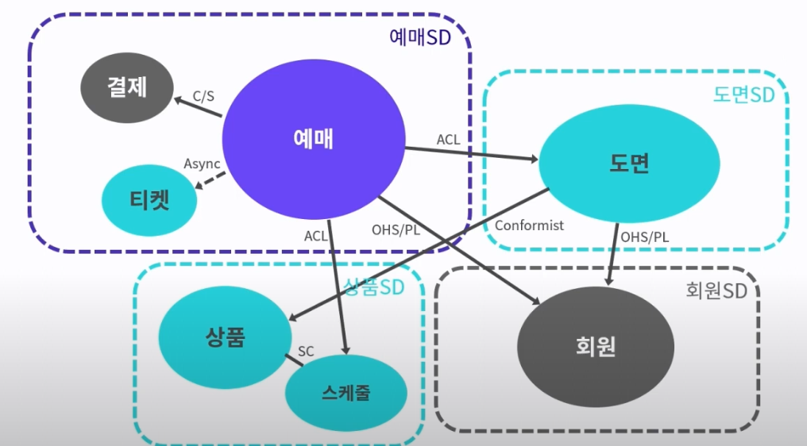
	- **도메인 문제**를 **문제 공간**에서 **해결 공간**으로 가져가는 과정 (도메인 전문가와 기술팀이 함께 회의)
		- **문제 공간**(Problem Space): 도메인 추출 및 하위 도메인 분류 (**도메인 전문가**가 주요 역할)
		- **해결 공간**(Solution Space): 바운디드 컨텍스트 및 컨텍스트 맵 정의 (**개발자**가 주요 역할)
	- 범위: **전반적**
	- 핵심 개념: **Ubiquitous Language** (보편 언어)
		- 핵심은 **유비쿼터스 언어**에 기반한 **팀 간 커뮤니케이션**
	- 유용한 도구
		- 사용 사례(유스케이스) 분석
		- 이벤트 스토밍 (Event Stroming)
		- Business Model 분석
		- ...
- **전술적 설계** (Tactical Design)
	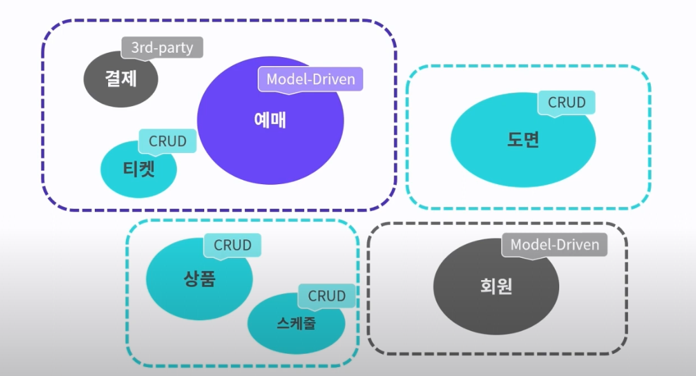
	- 전략적 설계에서 도출된 **도메인 모델**과 **컨텍스트 맵**을 이용해 **실제 구현** 진행
		- e.g. 
			- 핵심 Bounded Context는 Model-Driven
			- 지원 Bounded Context는 CRUD
			- 일반 Bounded Context는 Model-Driven, 3rd-party...
	- 범위: **특정 Bounded Context**
	- 핵심 개념: **Model Driven Design** (모델 주도 설계)
		- **도메인 모델**을 중심으로 패턴 적용
	- 유용한 패턴
		- 계층형 아키텍처
		- Entity, Value Object
		- Aggregate
		- Factory
		- Repository
		- Domain Event

>콘웨이의 법칙
>
>소프트웨어의 구조는 해당 소프트웨어를 개발하는 조직의 구조를 따라간다.

>**역콘웨이의 전략**
>
>개발하는 **조직의 구조**를 **소프트웨어의 구조**에 맞춘다. 바운디드 컨텍스트 별로 팀을 구성하는 것도 좋다.

## DDD 주요 용어
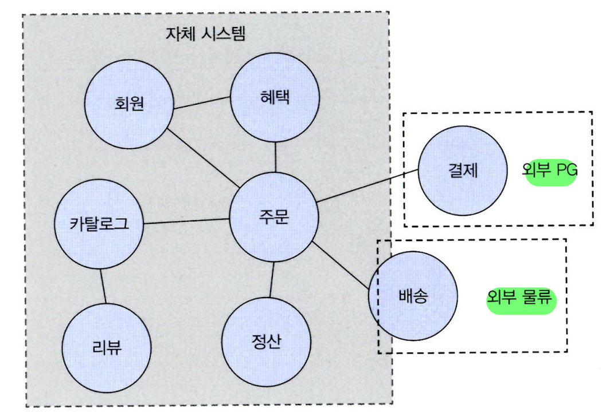
- 도메인
	- 소프트웨어로 해결하고자 하는 현실 세계의 **문제 영역**
		- e.g. 온라인 서점
- 하위 도메인
	- 한 도메인은 **여러 하위 도메인**으로 나눌 수 있음
		- e.g. 카탈로그, 주문, 혜택, 배송 ...
	- 3가지 유형으로 분류 가능
		- 핵심 하위 도메인: 가장 중요한 문제
		- 지원 하위 도메인
		- 일반 하위 도메인: 대부분의 소프트웨어가 가지고 있는 문제 (e.g. 회원)
	- 하위 도메인들은 **서로 연동하여 완전한 기능**을 제공
	- 도메인의 특정 기능은 **외부 시스템이나 수작업을 활용**하기도 함
		- e.g. 배송 업체, 결제 대행 업체, 소규모 업체의 정산 수작업 엑셀 처리
- 도메인 전문가
	- 온라인 홍보, 정산, 배송 등 **각 영역에는 전문가 존재**
	- **요구사항을 제대로 이해**할수록 도메인 전문가가 **원하는 제품**으로 향할 가능성 높음
		- **개발자와 전문가는 직접 대화해야 함**
			- 중간에서 발생하는 **정보의 왜곡과 손실을 방지**
		- 개발자는 **전문가가 진짜 원하는 것을 찾아야 함**
			- 도메인 전문가 스스로도 요구사항을 정확히 표현 못할 수 있음
- 도메인 모델
	- **특정 도메인**을 **개념적으로 표현**한 것 
		- e.g. 객체 기반 모델링 (**기능과 데이터**), 상태 다이어그램 기반 모델링 (**상태 전이**) - UML 예시
	- 도메인을 이해하는데 도움이 된다면 **표현 방식은 어느 것이든 괜찮음** (중요한 내용만 담음)
		- 관계가 중요한 도메인은 **그래프**, 계산 규칙이 중요하면 **수학 공식** 이용
	- 도메인 모델 (개념) VS 구현 모델 (구현 기술)
	- **각 하위 도메인마다 별도로 모델을 만들어야 함**
		- **같은 용어**라도 **하위 도메인마다 의미가 달라**질 수 있음
		- e.g. 카탈로그 도메인의 상품 VS 배송 도메인의 상품
	- **도메인 모델**은 **엔터티**와 **밸류 타입**으로 **구분** 가능
	- 모델링 방법
		- **요구사항**을 바탕으로 도메인 모델을 구성하는 **핵심 구성요소(엔터티, 속성), 규칙, 기능** 찾기
		- 상위 수준에서 정리한 **문서화**가 매우 큰 도움이 됨 (e.g. 화이트 보드, 위키 등)
- 바운디드 컨텍스트 (Bounded Context)
	- 특정 **도메인 모델**이 적용될 수 있는 **경계가 정의된 영역**
	- 원칙적으로 하위 도메인마다 모델을 만드는 것이 올바른 방법
		- 한 개의 모델로 모든 하위 도메인을 표현하려는 시도는 올바르지 못함
	- **도메인마다, 하위 도메인마다 같은 용어도 의미가 다를 수 있음**
		- 카탈로그의 상품, 재고 관리의 상품, 주문의 상품, 배송의 상품은 **이름만 같지 실제 의미가 다름**
		- 카탈로그 상품 (이미지, 상품명, 가격 위주), 재고 관리 상품 (실존 개별 객체 추적 목적)
- 컨텍스트 맵 (Context Map)
	
	- **시스템 간의 관계**를 명확히 표현하는 지도
	- **해결 공간**의 대표적 산출물
	- 매핑 관계
		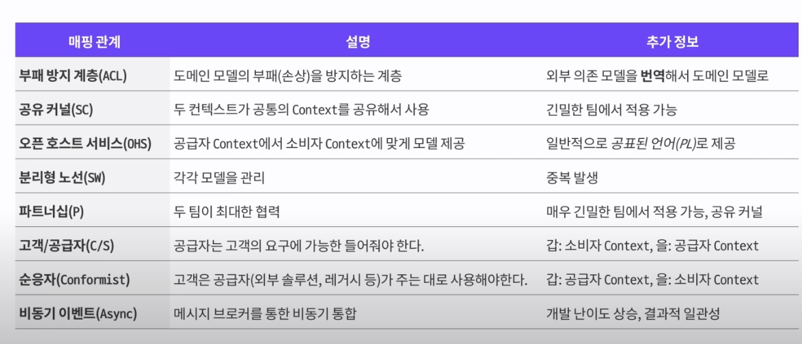
- 인프라스트럭처 (Infrastructure)
	- 표현 영역, 응용 영역, 도메인 영역에서 필요로 하는 프레임워크, 구현 기술, 보조 기능 **지원**
		- e.g. 영속성 처리, 트랜잭션, SMTP, REST
	- **DIP의 장점을 해치지 않는 범위**라면 **응용 영역**과 **도메인 영역**이 **구현 기술을 의존해도 괜찮다**
		- DIP의 장점(변경에 유연함, 테스트가 쉬움) VS 구현의 편리함 적절히 고려
		- `@Transactional`, `@Entity`, `@Table` 정도의 사용은 좋다!
- 유비쿼터스 언어 (Ubiquitous Language, **전략적 설계의 핵심**)
	- 전문가, 관계자, 개발자가 공유하는 **도메인과 관련된 공통 언어** (도메인에서 사용하는 용어)
	- **바운디드 컨텍스트 내**에서 **동일한 유비쿼터스 언어** 공유
	- **대화, 문서, 도메인 모델, 코드, 테스트** 등 **모든 곳에 반영**해야 한다 
		- 소통 과정에서 용어의 모호함이 감소
		- 개발자는 도메인과 코드 사이에서 불필요한 의미 해석 과정 감소
	- **알맞은 영어 단어** 찾는 시간을 아끼지 말고, **코드와 문서**는 변화를 바로 반영해 **최신 상태를 유지**
- 모델 주도 설계 (Model Driven Design, **전술적 설계의 핵심**)
	- **비즈니스 도메인**의 **핵심 개념**과 **규칙**을 **반영한 모델**을 기반으로 설계하는 방법론
	- DDD를 위한 **패턴**들을 사용해 **모델이 생명력을 잃지 않도록 지속적으로 관리**
		- e.g. 계층형 아키텍처, Entity, Value Object, Aggregate, Factory, Repository...

>**객체** 기반 도메인 모델링
>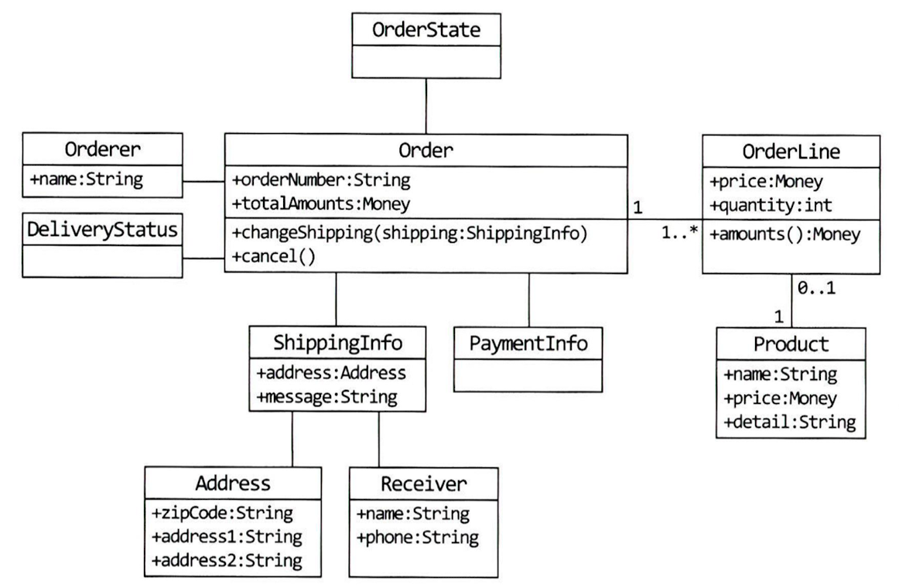

>**상태 다이어그램** 기반 도메인 모델링
>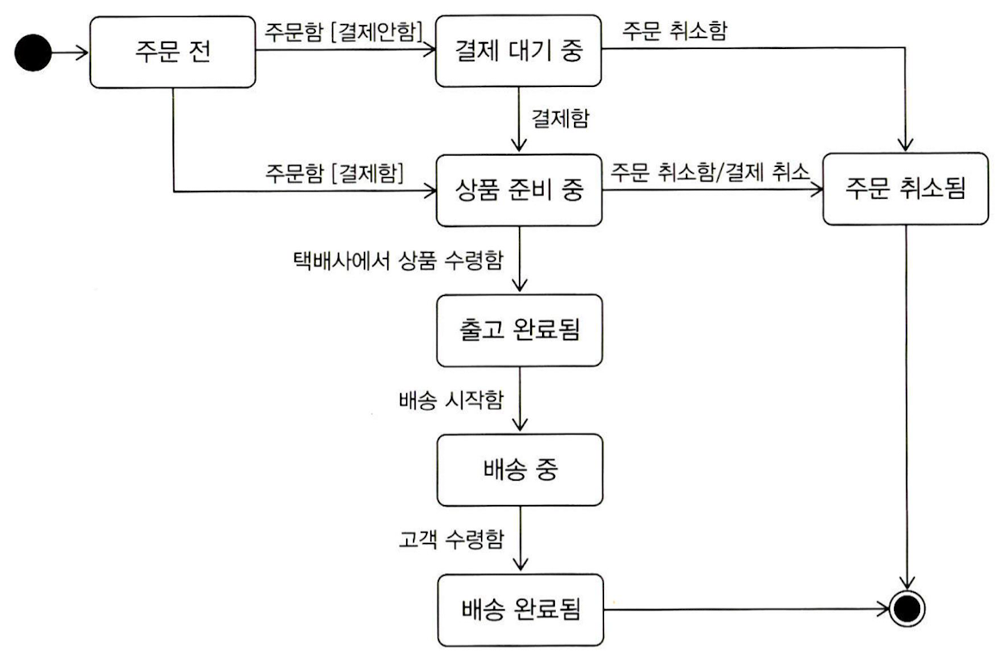

>도메인 모델, DTO와 `get`/`set` 메서드
>
>도메인 모델에 `get`/`set` 메서드를 무조건 추가하는 것은 좋지 않은 버릇이다. 
>특히 `set` 메서드는 필드값만 변경하고 끝나기 때문에 상태 변경과 관련된 도메인의 핵심 개념이나 의도를 코드에서 사라지게 한다. 또한, `set` 메서드를 열어두는 것은 도메인 객체를 불완전하게 생성하도록 허용한다.
>
>따라서, **도메인 객체는 생성자를 통해 필요한 데이터를 모두 받도록 설계해야 한다.** (이 경우, `private`한 `set`을 만들어 생성자에서 사용할 수 있음)
>또한, **불변 밸류 타입을 사용**하면 **자연스럽게 `set` 메서드 사용이 사라진다.**
>
>DTO는 도메인 로직이 없어 `get`/`set` 메서드를 사용해도 데이터 일관성에 영향을 덜 주지만, **프레임워크의 `private` 필드 직접 할당 기능**을 최대한 사용하면 **불변 객체의 장점을 DTO까지 확장**할 수 있어 권장한다.

>그린 필드 & 브라운 필드
>
>그린필드: 소프트웨어의 초기 개발 시점 (코드가 깨끗함)
>브라운 필드: 소프트웨어가 장기간 개발되어 복잡해진 시점 

## 계층 구조 아키텍처 구성 - 도메인 모델 패턴
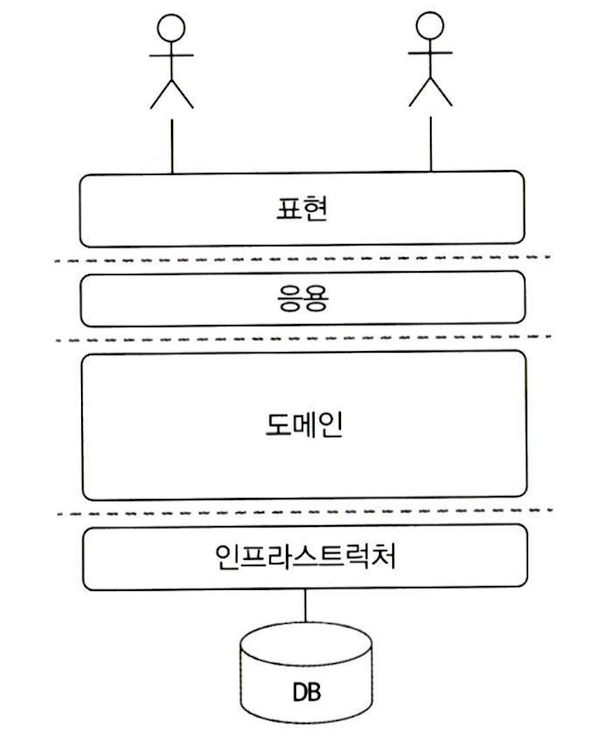
- 아키텍처 상의 도메인 계층을 객체 지향 기법으로 구현하는 패턴
	- 마틴파울러, <엔터프라이즈 애플리케이션 아키텍처 패턴>
- 계층 구조는 **상위 계층에서 하위 계층으로만 의존**하는 특성을 가짐 (지름길은 허용)
	- **DIP 적용** -> **인프라스트럭처 영역이 응용 영역과 도메인 영역에 의존하는 구조**로 변화
		- 인프라스트럭처의 클래스가 도메인이나 응용 영역에 정의된 인터페이스를 상속
	- **DIP를 항상 적용할 필요 X** -> DIP 장점(변경에 유연, 테스트가 쉬움) VS 구현의 편리함 적절히 고려
		- **DIP의 장점을 해치지 않는 범위**라면 **응용 영역**과 **도메인 영역**이 **구현 기술을 의존해도 괜찮다**
			- 응용 영역의 **트랜잭션 처리** 의존 정도는 괜찮음 (`@Transactional`)
			- **리포지터리와 도메인 모델은 구현기술이 거의 바뀌지 않아 타협도 좋음** (테스트 문제도 X)
				- e.g.1 **JPA** 애너테이션이 적용된 **도메인 모델** (`@Entity`, `@Table`)
				- e.g.2 **스프링 데이터 JPA**를 상속하는 **리포지터리 인터페이스**
- 구조
	- 표현 계층 (Presentation, UI)
		- **사용자**의 요청을 처리하고 정보를 보여줌
		- **데이터 변환** 역할
			- 요청 데이터를 응용 서비스가 요구하는 알맞은 형태로 변환해 전달
			- 실행 결과를 사용자에게 알맞은 형식으로 응답
	- 응용 계층 (Application)
		- **도메인 계층을 조합**해서 사용자가 요청한 **기능**을 실행
		- 주로 **오케스트레이션**을 하는 계층이어서 **단순한 형태**를 가짐
			- 도메인 기능 예시
				- 리포지터리에서 애그리거트를 구한다
				- 애그리거트의 도메인 기능을 실행한다
				- 결과를 리턴한다
			- 새 애그리거트 생성 예시
				- 데이터가 유효한지 검사한다 (데이터 중복 등)
				- 애그리거트를 생성한다
				- 리포지터리에 애그리거트를 저장한다
				- 결과를 리턴한다
		- **트랜잭션 처리**, **접근 제어**, **이벤트 처리** 등을 담당
	- 도메인 계층 (Domain)
		- **도메인 모델**에 **도메인 핵심 규칙**을 구현
	- 인프라스트럭처 계층 (Infrastructure)
		- **외부 시스템과의 연동** 처리 (e.g. DB, SMTP, REST, 메시징 시스템)
- 구현 전략
	- **인증** 및 **인가** 전략
		- **URL** 이용 **인증** 및 **인가**는 **서블릿 필터**가 좋은 위치 (스프링 시큐리티도 유사하게 동작)
		- URL만으로 어려운 경우 **응용 서비스의 메서드 단위**로 인증 및 인가 수행 (`@PreAuthorize`)
		- 개별 **도메인 객체 단위**로 필요한 경우, **직접 권한 로직 구현** (심화: 스프링 시큐리티 확장)
			- e.g. 게시글 삭제는 본인 또는 관리자 역할을 가진 사용자만 할 수 있다
				- 게시글 애그리거트를 로딩해야 권한 검사할 수 있음 (도메인 서비스에 구현)
				- `permissionService.checkDeletePermission(userId, article);`
	- **응용 계층** 전략
		- 한 도메인과 관련된 **기능**은 **각각 별도의 서비스 클래스로 구현**하자. 
			- 각 클래스 별로 **필요한 의존 객체만 포함**하므로 **코드 품질 유지**와 **이해**에 도움이 됨
			- 클래스의 개수가 많아지고 단순 코드 중복은 문제
				- 필요 시, 한 응용 서비스 클래스에서 **1개 내지 2~3개 기능** 정도를 가지도록 허용
				- **코드 중복**이 신경쓰인다면 별도의 **헬퍼 클래스**를 둬서 해결
					```java
					// 각 응용 서비스에서 공통되는 로직을 별도 클래스로 구현
					public final class MemberServiceHelper {
					    public static Member findExistingMember(MemberRepository repo, String memberId) {
					        Member member = repo.findById(memberId);
					        if (member == null)
					            throw new NoMemberException(memberId);
					        return member;
					    }
					}
					
					// 공통 로직을 제공하는 메서드를 응용 서비스에서 사용
					import static com.myshop.member.application.MemberServiceHelper.*;
					
					public class ChangePasswordService {
					    private MemberRepository memberRepository;
					
					    public void changePassword(String memberId, String curPw, String newPw) {
					        Member member = findExistingMember(memberRepository, memberId);
					        member.changePassword(curPw, newPw);
					    }
					    // ...
					}
					```
		- 응용 계층 전달 데이터가 **2개 이상**이면 **DTO 객체**를 사용해 **표현 계층에서 자동 변환**하면 편리
			- e.g. 스프링 MVC 웹 요청 파라미터 자바 객체 변환 기능
		- 응용 서비스는 **표현 영역에서 필요한 데이터만 리턴하자**
			- 도메인 객체 리턴하면 도메인 로직을 표현 영역에서 실행할 가능성이 생김
		- **요청 값에 대한 검증**은 표현 계층 보다 **응용 서비스에서 처리**하자 (응용서비스 완성도 상승)
			- 여러 검증 정보가 한 번에 필요하면, 서비스에서 에러 코드를 모아 1개 예외로 발생시키자
				- `List<ValidationError> errors = new ArrayList<>;`
				- `if (!errors.isEmpty()) throw new ValidationErrorException(errors);`
				- 표현 영역에서 예외 잡아 변환 - `bindingResult.rejectValue()`
		- **조회 전용 기능**의 경우 **서비스 없이 표현 영역에서 바로 사용**해도 괜찮음
- 요청 처리 흐름
	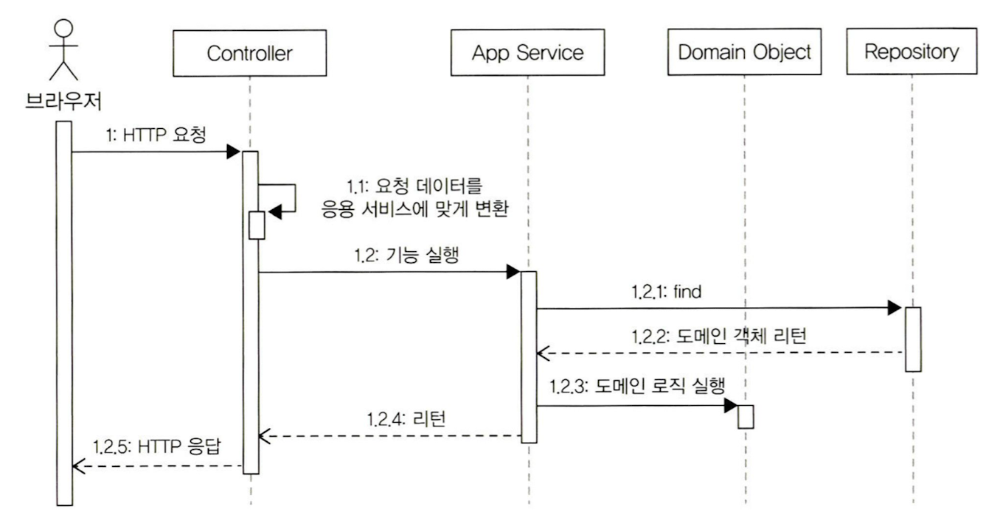
- 패키지 구조
	- 한 패키지는 가능한 10~15개 미만으로 타입 개수 유지 (코드 찾기 불편하지 않을 정도)
	- 기본 패키지 구성
		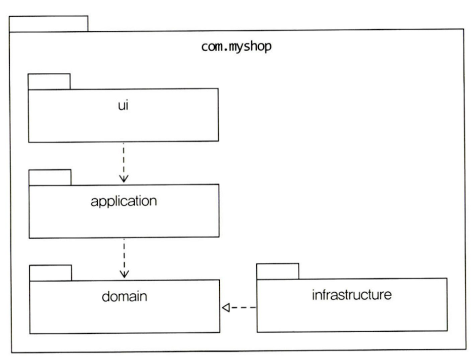
	- 도메인이 클 때는 **하위 도메인마다** 별도로 패키지 구성하자
		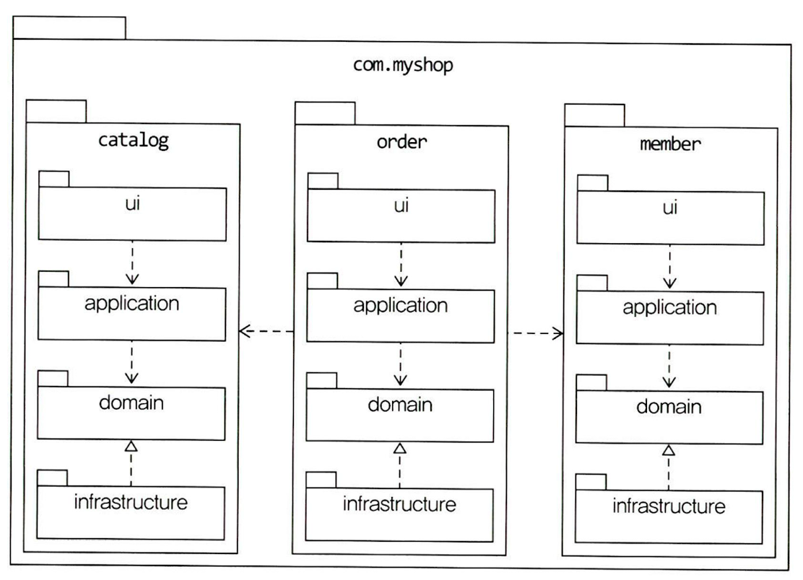
	- 각 하위 도메인의 **응용 영역**과 **도메인 영역**은 **애그리거트 기준**으로 나누어 재구성 가능
		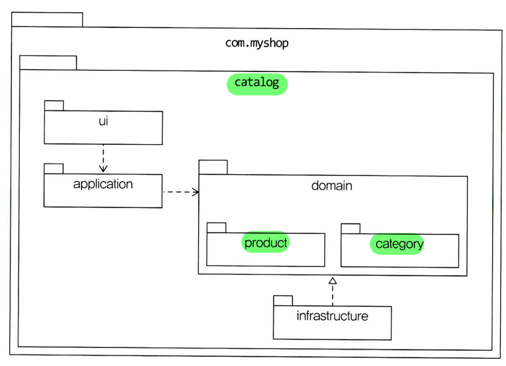
		- **애그리거트, 모델, 리포지터리**는 **같은 도메인 모듈**에 위치
		- 도메인이 크면 **도메인 모델**과 **도메인 서비스**를 별도 패키지로 구분 가능
			- `order.domain.order`, `order.domain.service`

## 도메인 영역의 주요 구성요소
### 엔터티와 밸류 (Entity & Value type)
- **엔터티**와 **밸류**의 **구분법**: 고유 **식별자를 갖는지** 확인
	- DB 테이블 갖는다고 엔터티는 아님
	- 엔터티 식별자와 DB PK 식별자는 다른 것
		- e.g. `Article` - `ArticleContent`
			- `ArticleContent`는 밸류이며, DB에 PK가 있지만 도메인에서의 식별자는 아님
	- 참고: 식별자 구현 위치
		- **식별자 생성규칙**(도메인 규칙)이 있으면, **도메인 영역**에 위치 (e.g. 도메인 서비스, 리포지토리)
- **엔터티**
	- 고유의 **식별자**를 갖는 객체
		- **식별자가 같으면** 두 엔터티는 같다 (**`equals()`** 및 **`hashCode()`** 로 구현)
	- 자신의 **라이프 사이클**을 가짐
	- 도메인 모델 엔터티와 DB 관계형 모델 엔터티는 **서로 다름**
		- 도메인 모델 엔터티는 **데이터**와 함께 도메인 **기능**을 제공
		- 도메인 모델 엔터티는 **두 개 이상의 데이터가 개념적으로 하나**인 경우 **밸류**로 표현 가능
			- RDBMS는 밸류 타입이 표현이 어려움
				- 개별 데이터로 저장 -> 개념이 드러나지 않음
				- 테이블을 분리해 저장 -> 테이블의 엔터티에 가깝고 밸류라는 의미가 드러나지 않음
- **밸류**
	- 고유의 식별자를 **갖지 않는** 객체
		- **모든 속성이 같으면** 두 밸류 객체는 같다 (**`equals()`** 및 **`hashCode()`** 로 구현)
	- 주로 **개념적으로 하나인 값을 표현**하고 싶거나 **의미를 명확하게 표현**하고 싶을 때 사용
		- ex 1. `Receiver` = `receiverName` + `receiverPhoneNumber`
		- ex 2. `Address` = `shippingAddress1` + `shippingAddress2` + `shipppingZipcode`
		- ex 3. `ShippingInfo` = `Receiver` + `Address`
		- ex 4. `Money` - '돈'을 의미하도록 하여 코드 이해에 도움을 줌
		- ex 5. `OrderNo` - 주문 엔터티의 식별자로 밸류를 사용해 코드 이해에 도움을 줌
	- 엔터티의 **속성** 혹은 다른 밸류 타입의 **속성**으로 사용됨
		- **기능 추가가 가능**하다는 장점이 있음
	- **불변(immutable)** 으로 설계해야 함
		- 데이터 변경 기능 제공 X
		- 변경할 때는 새로 밸류 객체를 생성해 반환
- JPA 관련 테크닉
	- JPA가 강제하는 엔터티와 벨류 정의 시 필요한 **기본 생성자**는 **`protected`로 선언**하자
		- 값이 없는 온전치 못한 객체 생성 예방
	- `@Access(AccessType.FIELD)`: 메서드 매핑을 완전히 방지하고 **필드 매핑 강제**
			- 원래 JPA는 메서드에도 컬럼 매핑(`AccessType.PROPERTY`)이 가능하므로 아얘 막자
	- 밸류 매핑
		- `@Embedded`, `@Embeddable`: 값 객체 지정 애노테이션
		- `@EmbeddedId`: **식별자** 자체를 **밸류 타입**으로 지정 (식별자 의미 강조 위해)
			- JPA는 식별자 타입이 **`Serializable`** 이어야 하므로, 밸류 타입은 **상속** 필요
			- **기능 추가 가능**한 장점 (e.g. 주문 번호 세대 구분)
		- `@SecondaryTable`: 밸류를 별도 테이블로 매핑
			- 조회 성능이 안좋음 (두 테이블을 조인해서 가져옴) -> **조회 전용 DAO** 사용 필수!
			- 지연 로딩을 위해 밸류를 엔터티로 매핑할 수도 있지만, 밸류 정체성을 잃어버려서 안좋음
		- `@AttributeOverrides`: 값 객체의 **칼럼 이름**이 다른 값 객체의 그것과 **서로 다를 때** 사용
		- `AttributeConverter`: **2개 이상의 프로퍼티**를 가진 밸류 타입을 **1개 컬럼에 매핑** 가능
			- `AttributeConverter` 인터페이스를 상속해 `convertToDatabaseColumn()`, `convertToEntityAttribute()` 구현한 후, 해당 클래스에 `@Converter(autoApply = true)` 적용
			- `autoApply = false`인 경우 필요한 곳에 `@Convert(converter = ...)` 적용
			- e.g. `Length` 클래스(`int value`, `String unit`) -> DB 컬럼 `width` 
	- 밸류 컬렉션 매핑
		- `@ElementCollection`, `@CollectionTable`: 밸류 컬렉션을 별도 테이블로 매핑
			- e.g. `Order` - `OrderLines`
		- `AttributeConverter`: 밸류 컬렉션을 한 개 컬럼에 매핑할 때도 사용
			- e.g. Email 주소 목록 Set (`EmailSet`) -> 1개 DB 칼럼에 콤마로 구분해 저장
		- 기술적 혹은 팀 표준적 한계로 인해, 밸류를 `@Entity`로 구현해야 할 수도 있음 
			- e.g. 밸류 타입인데 상속 매핑이 필요한 경우
				- 상태 변경 메서드 제거 & `cascade` + `orphanRemoval=true` 적용
				- 다만, images 리스트의 `clear()` 호출하면 쿼리가 비효율적이어서, `@Embeddable`로 단일 클래스 구현하고 기능은 타입에 따라 if-else로 구현하는 것도 방법이다!
	- `@SecondaryTable` 예제
		```java
		@Entity
		@Table(name = "article")
		@SecondaryTable(
		    name = "article_content",
		    pkJoinColumns = @PrimaryKeyJoinColumn(name = "id")
		)
		public class Article {
		
		    @Id
		    @GeneratedValue(strategy = GenerationType.IDENTITY)
		    private Long id;
		
		    private String title;
		
		    @AttributeOverrides({
		        @AttributeOverride(
		            name = "content",
		            column = @Column(table = "article_content", name = "content")
		        ),
		        @AttributeOverride(
		            name = "contentType",
		            column = @Column(table = "article_content", name = "content_type")
		        )
		    })
		    @Embedded
		    private ArticleContent content;
		}
		```

### 애그리거트 (Aggregate)
- 연관된 **엔터티**와 **밸류** 객체를 **개념적으로 하나로 묶은 군집**
	- **개념상 완전한 1개의 도메인 모델** 표현
		- e.g. 주문 애그리거트(상위 개념) = Order 엔터티, OrderLine 밸류, Orderer 밸류(하위)
	- 보통 **대다수의 애그리거트**는 **1개의 엔터티 객체만으로 구성**되며 2개 이상은 드물다
		- 루트 엔터티 이외의 엔터티는 실제 엔터티가 맞는지, 맞다면 다른 애그리거트는 아닌지 의심
- **애그리거트를 나누는 기준**: **도메인 규칙**에 따라 **함께 생성** 혹은 **변경**되는 **구성 요소**인가? (**라이프사이클**)
	- 'A가 B를 갖는다' 라는 요구사항이 있어도 A와 B가 다른 애그리거트일 수 있음
	- e.g. **상품과 리뷰**는 다른 애그리거트 - **변경 주체가 다르고 함께 생성하거나 함께 변경하지 않음**
- 특징
	- 커져서 복잡해진 **도메인 모델을 상위 수준에서** 애그리거트 간 관계로 **파악 및 관리** 가능
	- 애그리거트는 도메인 규칙과 요구사항에 따라 **경계**를 가짐
		- 한 애그리거트에 **속한 객체는 다른 애그리거트에 속하지 않음**
	- 애그리거트에 **속한 객체는 유사하거나 동일한 라이프사이클**을 가짐 (대부분 함께 생성 및 제거)
	- **일관성**을 관리하는 기준이 됨
		- 복잡한 도메인 모델을 **단순한 구조**로 만들어 **도메인 기능 확장 및 변경 비용 감소**
- **루트 엔터티**
	- **애그리거트에 속한 전체 객체를 관리**하는 엔터티
	- 핵심 역할: **애그리거트의 일관성이 깨지지 않도록 하는 것**
		- **도메인 규칙**을 지켜 애그리거트 내 **모든 객체가 항상 정상 상태를 유지**하도록 함
		- e.g. `OrderLine` 밸류 변경 시, `Order` 엔터티의 주문 총 금액을 함께 변경
		- e.g. `changeShippingInfo()`는 배송 시작 전에만 배송지를 변경 가능하도록 구현
	- 애그리거트의 **유일한 진입점** (**애그리거트 단위**로 내부 구현 **캡슐화**)
		- 애그리거트의 **도메인 기능**은 **루트 엔터티를 통해서만 실행 가능**
		- 애그리거트 내 **엔터티 및 밸류 객체**는 **루트 엔터티를 통해서만 간접적으로 접근 가능**
	- 필요한 구현 습관
		- **단순한 필드 변경 `public` `set` 메서드는 지양하자**
			- `set` 메서드는 도메인 의도를 표현하지 못함
			- 공개 `set`만 줄여도 `cancel`, `change` 등 **의미가 드러나는 메서드** 구현 빈도 상승
		- **밸류 타입**은 **불변**으로 구현하기
			- 덕분에 **애그리거트 외부**에서 밸류 객체에 접근해도 **상태 변경은 불가능**
			- e.g. 
				- 루트 엔터티는 내부 다른 객체를 조합(참조, 기능 실행 위임)해 기능 구현 완성
				- `Order` - `calculateTotalAmounts()`
				- `OrderLines` - `ChangeOrderLines()`
				- 혹시 `Order`가 `getOrderLines()`를 제공해도 `OrderLines`가 불변이면 애그리거트 외부에서 변경이 불가능해 안전하다
			- 혹시 **불변 구현이 불가능**한 경우, **변경 기능을 `default(package-private)`, `protected`로 제한**하면 애그리거트 외부 상태 변경을 방지할 수 있음
		- 애그리거트에 **영속성 전파** 적용하자 (`@OneToMany`, `@OneToOne`)
			- 애그리거트의 모든 객체는 함께 저장되고 함께 삭제되어야 함
				- **`cascade = {CascadeType.PERSIST, CascadeType.REMOVE}`**
				- **`orphanRemoval = true`**
			- `@Embeddable`은 기본적으로 함께 저장 및 삭제되므로 `cascade` 속성 필요 X
- **애그리거트 간 참조**
	- = 루트 엔터티가 다른 루트 엔터티를 참조하는 것
	- **다른 애그리거트를 참조**할 때는 **ID 참조**하자
		- 애그리거트 **경계가 명확**해지고 **응집도**가 높아짐
		- **여러 애그리거트를 읽어야할 때**, 조회 속도 문제는 **조회 전용 쿼리**로 해결 (**DAO**)
			- 여러 애그리거트를 읽어야할 때, 조회 속도 문제 발생할 수 있음 (N + 1)
				- e.g. 주문 개수가 10개 - 주문 쿼리 1, 상품 쿼리 10
			- **DAO**에서 **조인**을 이용해 **1번의 쿼리**로 **데이터 로딩하자** (e.g. `OrderViewDao`, JPQL)
			- 만약 **애그리거트마다 다른 저장소를 사용**한다면, **캐시 적용** 혹은 **조회 전용 저장소** 이용
				- 코드는 복잡해져도 시스템 처리량 상승
		- 객체 참조는 구현은 편리하지만 단점이 많음
			- 다른 애그리거트의 상태를 쉽게 변경할 수 있다는 단점
			- 지연로딩/즉시로딩 고민 필요
			- 확장 시에도 하위 도메인마다 기술이 달라질 수 있는데 JPA에 종속되어버림
- 애그리거트를 **팩토리**로 사용하기
	- 한 애그리거트의 상태를 보고 다른 애그리거트를 생성해야 한다면 애그리거트에 **팩토리 메서드** 추가
		- e.g. `Store`의 상태를 보고 `Product`를 생성한다면, `Store`에 `createProduct()` 추가
			- 정보가 많다면 `Store` - `createProduct()` - `ProductFactory.create()`도 가능
	- 도메인의 **응집도**가 높아짐

### 리포지터리 (Repository)
- **애그리거트 단위**로 도메인 객체를 **조회**하고 **저장**하는 **기능 정의** (도메인 모델의 **영속성** 처리)
	- **구현을 위한 도메인 모델** (엔터티와 밸류는 요구사항에서 도출되는 도메인 모델)
	- **애그리거트는 개념적으로 하나**이므로 저장할 때도 **전체를 저장**하고, 불러올 때도 **전체를 불러와야 함**
		- 원자적 변경 구현: RDBMS는 트랜잭션 사용, 몽고 DB는 한 애그리거트를 한 문서에 저장 
- **응용 서비스 계층**이 사용 주체
- 리포지터리 **인터페이스**는 **도메인 영역**, **구현 클래스**는 **인프라스트럭처 영역**에 속함
- 기본 정의 메서드 (애그리거트 저장 및 조회)
	- `save(Some some)`
	- `findById(SomeId id)`
	- 필요에 따라 다양한 조건의 검색이나 `delete(id)`나 `count()` 추가

>리포지터리와 DAO
>
>리포지터리와 DAO는 데이터를 DB로 부터 가져온다. 둘은 목적이 같지만 의미에서 차이가 있다.
>CQRS에서 **명령 모델**에서 사용할 때는 **리포지터리**라고 지칭하고, **조회 모델**에서 사용할 때는 **DAO**라고 지칭한다.

>스프링 데이터 JPA Specification
>
>DAO 구현 시 다양한 조건 검색에는 Specification을 사용이 도움이 된다.

>하이버네이트 `@Subselect`
>
>쿼리 결과를 `@Entity`로 매핑할 수 있는 기능으로, 마치 뷰를 사용하는 것 처럼 쿼리 실행 결과를 매핑할 테이블처럼 사용할 수 있다. `@Immutable`, `@Synchronize`를 함께 사용하자.

### 도메인 서비스 (Domain Service)
- **한 애그리거트만으로는 구현이 불가능**한 특정 엔터티에 속하지 않는 **도메인 로직**을 처리
- 여러 애그리거트가 필요한 기능을 **억지로 한 애그리거트에 넣으면 안된다**
	- 코드가 **복잡**하고 **외부 의존**이 높아져 **수정이 어려움**
	- **애그리거트의 범위를 넘어서는 도메인 개념**이 애그리거트에 숨어들어 **명시적으로 드러나지 않게 됨**
- **계산 로직** & **외부 시스템 연동이 필요한 도메인 로직**에 사용
	- 계산 로직 (e.g. 실제 결제 금액 계산)
		- 총 주문 금액은 주문 애그리거트에서 가능
		- But, 할인 금액 계산은 상품, 쿠폰, 회원 등급, 구매 금액 등이 필요
			- 나아가 2개의 할인 쿠폰 적용은 단일 할인 쿠폰 애그리거트로 처리 불가
		- `public class DiscountCalculationService {...}`
			- `public Money calculateDiscountAmounts(List<OrderLines>, List<Coupon> coupons, MemberGrade grade)`
	- 외부 시스템 연동 도메인 로직 (e.g. 설문 조사 시스템이 외부 역할 관리 시스템과 연동해야 할 때)
		- **설문 조사 생성 권한이 있는지 확인**하는 것은 **도메인 규칙**
		- 외부 연동 보다는 **도메인 로직 관점에서 인터페이스 작성** - 응용 서비스에서 사용
		- `public interface SurveyPermissionChecker`
			- `boolean hasUserCreationPermission(String userId)`
		- 인터페이스는 도메인 영역, 구현 클래스는 인프라스트럭처 영역에 위치
- 구현 및 사용 방법
	- **상태 없이 로직만 구현** (엔터티, 밸류 등과의 차이)
	- **사용 주체**는 **애그리거트** 혹은 **응용 서비스** 둘 다 가능
		- e.g. 결제 금액 계산: `Order` - `calculateAmounts(DiscountCalculationService disCalSvc, MemberGrade grade)`
		- e.g. 계좌 이체: `TransferService` (도메인 서비스) - `transfer(Account fromAcc, Account toAcc, Money amounts)`
	- 도메인 서비스는 **도메인 영역**에 위치
		- e.g. 실제 계산 금액 도메인 서비스는 주문 애그리거트와 같은 패키지에 위치
		- `domain.model`, `domain.service`, `domain.repository`로 분할해도 괜찮음
	- 도메인 로직이 **외부 시스템을 이용해 구현**될 때는 인터페이스와 클래스를 **분리**하자
		- 도메인 서비스 **인터페이스** (**도메인 영역**) - 도메인 서비스 **구현** 클래스 (**인프라스트럭처 영역**)

## 애그리거트와 트랜잭션
- **트랜잭션** 구현 전략
	- **1개의 트랜잭션**에서는 **1개의 애그리거트만 수정**하자
		- 트랜잭션 범위는 작을수록 좋다 (1개 테이블 한 행 잠금이 3개 테이블 잠금보다 처리량 높음)
		- 2개 이상의 애그리거트 수정 -> 트랜잭션 충돌 가능성 상승 -> 처리량 감소
	- 부득이하게 **1개 트랜잭션**으로 **2개 이상의 애그리거트 수정이 필요**할 경우 **응용 서비스에서 수정**
		- 다음 상황에서만 허용
			- 기술적으로 **도메인 이벤트를 사용할 수 없**거나 팀 표준인 경우
			- UI 구현의 편리 - 운영자의 편의를 위해 **여러 주문의 상태를 한 번에 변경**하고 싶을 때
	- **도메인 이벤트** 사용 -> 1 트랜잭션 1 애그리거트 수정한 후 다른 애그리거트 수정 가능 (동기, 비동기)
- 애그리거트를 위한 추가적인 **트랜잭션 처리 기법** (잠금)
	- 애그리거트 간 **동시성 문제** 제어를 위해 필요
		- e.g. 운영자와 고객이 동시에 **논리적으로 같은 애그리거트에 접근**하지만 **물리적으로 다른 애그리거트 객체를 사용**하게 되어 동시성 문제 발생
	- 종류
		- 선점 잠금 (Pessimistic Lock)
			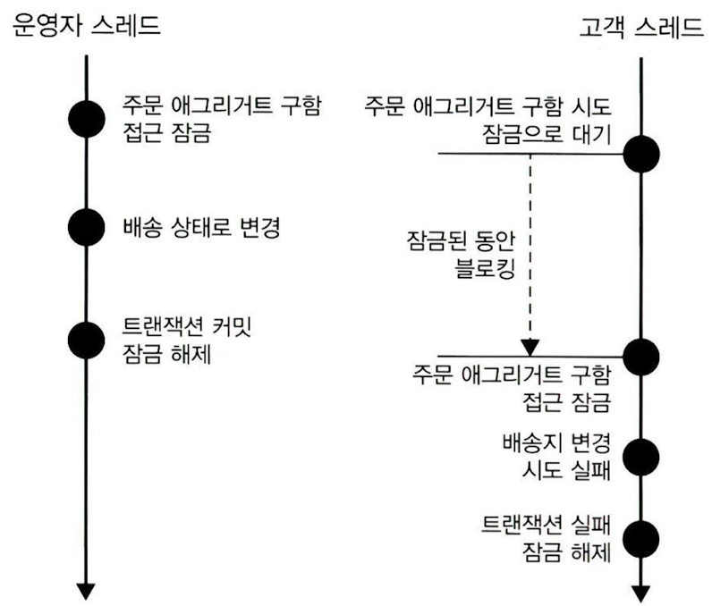
			- **한 스레드의 애그리거트 사용이 끝날 때까지** 다른 스레드의 해당 애그리거트 **수정을 막음**
				- e.g. 운영자가 배송지 정보를 조회하고 상태를 변경하는 동안, 고객의 애그리거트 수정을 막는다
			- 구현: **`for update` 쿼리** (DBMS 지원 행단위 잠금/특정 레코드에 한 커넥션만 접근 가능)
				- JPA (하이버네이트)
					- EntityManger의 `find()` 메서드에 `LockModeType.PESSIMISTIC_WRITE ` 인자 전달
					- e.g. `entityManager.find(Order.class, orderNo, LockModeType.PESSIMISTIC_WRITE)`
				- 스프링 데이터 JPA
					- `@Lock(LockModeType.PESSIMISTIC_WRITE)` 지정
			- 주의점: 교착 상태 예방을 위해 **최대 대기 시간** 지정 필요 (DBMS마다 지원 여부 다름)
				- JPA
					```java
					Map<String, Object> hints = new HashMap<>();
					hints.put("javax.persistence.lock.timeout", 2000);
					Order order = entityManager.find(
					    Order.class, orderNo, LockModeType.PESSIMISTIC_WRITE, hints
					);
					```
				- 스프링 데이터 JPA
					- `@QueryHints({ @QueryHint(name = "javax.persistence.lock.timeout", value = "2000") })`
		- 비선점 잠금 (Optimistic Lock)
			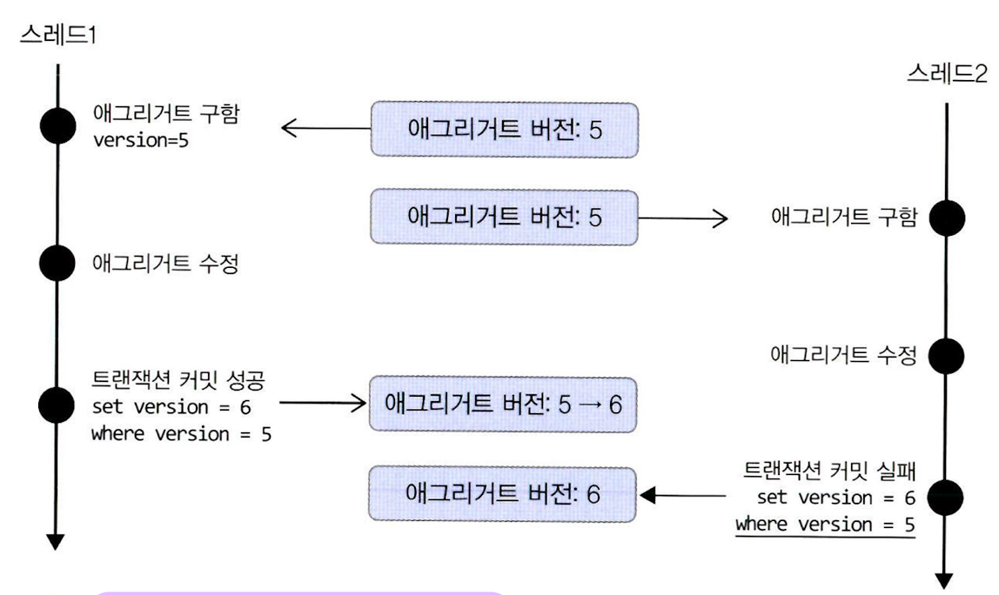
			- **버전 값**을 사용해서 **변경 가능 여부**를 **실제 DBMS 변경 반영 시점에 확인**하는 방법
				- e.g. 운영자가 배송지 정보를 조회한 이후에 고객이 정보를 변경하면, 운영자가 애그리거트를 다시 조회한 후 수정하도록 한다
			- **선점 잠금으로 해결할 수 없는 경우를 해결**
				- 사용자가 버전 값을 응답 받고 다음 요청에 버전 값을 함께 보내는 방식
				- 덕분에 여러 트랜잭션이나 시간에 걸쳐 **락 확장** 가능
			- 구현: 쿼리에서 애그리거트의 **버전이 동일한 경우**에만 **수정**하고 **성공**하면 **버전값도 올리기**
				- 쿼리
					- `UPDATE aggtable SET version = version + 1, colx = ?, coly = ? WHERE aggid = ? and version = 현재버전`
				- JPA
					- `@Version private long version` (필드에 애너테이션 적용)
						- 트랜잭션 충돌 시 `OptimisticLockingFailureException` 발생
			- 주의점: **강제 버전 증가 잠금 모드** 필요 (for **애그리거트 일관성** 유지)
				- 애그리거트에서 일부 구성요소의 값만 바뀌어도 **루트 엔터티 버전 값**을 증가시키자
				- JPA
					- EntityManger의 `find()` 메서드에 `LockModeType.OPTIMISTIC_FORCE_INCREMENT` 인자 전달
					- 엔터티 상태 변경 여부와 상관없이 **트랜잭션 종료 시점**에 **버전 값 증가 처리**
				- 스프링 데이터 JPA
					- `@Lock(LockModeType.OPTIMISTIC_FORCE_INCREMENT)` 지정
		- 오프라인 선점 잠금 (Offline Pessimistic Lock)
			- 선점 잠금과 달리 **여러 트랜잭션에 걸쳐 동시 변경을 막는** 방식
				- e.g. 누군가 수정 화면을 보고 있을 때, 수정 화면 자체를 실행하지 못하게 막음
			- 구현: 락 직접 구현
				- 애플리케이션 단 락 구현 (`LockManger`)
				- DB 단 락 구현 (테이블)
			- 주의점
				- 락을 얻은 사용자가 영원히 반납하지 않는 경우를 고려해 **잠금 유효 시간** 필요
				- 락을 얻은 사용자는 **일정 주기로 유효 시간을 증가**시켜야 UX 불편 없이 수정 가능
					- 수정 폼에서 1분 단위로 Ajax 호출해 1분씩 유효 시간 증가시키기

## Reference
[도메인 주도 개발 시작하기](https://www.aladin.co.kr/shop/wproduct.aspx?ItemId=291420687)
[NHN FORWARD 22 - DDD 뭣이 중헌디? 🧐](https://www.youtube.com/watch?v=6w7SQ_1aJ0A)
[Domain Driven Design – 1부 (Strategic Design)](https://blog.bespinglobal.com/post/domain-driven-design-1%EB%B6%80-strategic-design/)
[DDD 이야기 part1](https://hyper-cube.io/2017/05/11/DDD_%EC%9D%B4%EC%95%BC%EA%B8%B0_part1/)