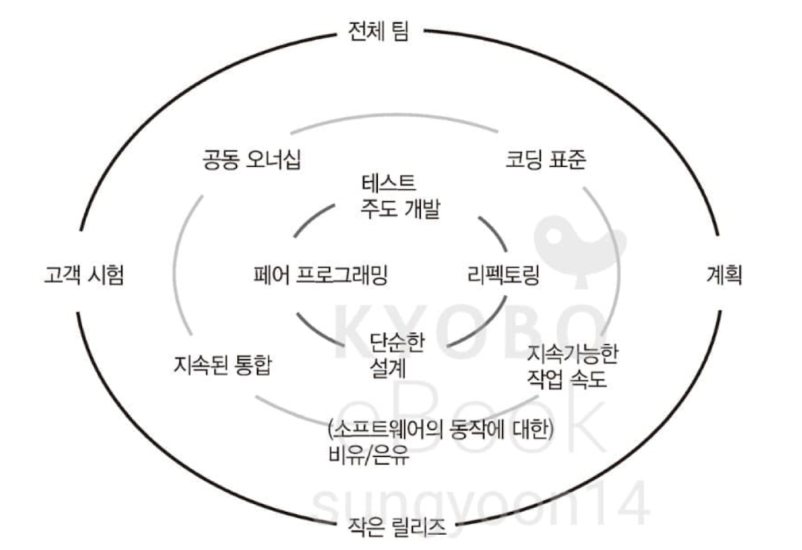

감사하다. 경험이 풍부한 그리고 **소프트웨어 장인 정신을 실천하기 위해 노력**했던 선배 개발자의 이야기를 들을 수 있는 책이었다. 추상적이던 애자일, XP, 소프트웨어 장인정신의 역사를 알 수 있었던 점도 좋았다. 2015년에 나온 책이지만, 대다수의 이야기들이 여전히 공감된다. 
재밌는 부분은 **과거에 문제였던 것들이 오늘 날에도 여전히 반복된다는 점**이다. 선배들의 시행착오에서 어떤 개발자들은 나아갔고 어떤 개발자들은 나아가지 못했다.
개발자는 여러 경험을 쌓을 수 있지만, **소프트웨어의 품질** 나아가 **소프트웨어 산업 전반을 향상시키는 태도와 노력**은 스스로 함양하고 실천해야 한다. 애자일 방법론, XP 실행 관례는 좋은 품질의 소프트웨어를 만들기 위해 과거 시행착오로부터 나온 증명된 노하우다. **우리는 선배들이 앞서 쌓아왔던 좋은 가치를 지향하고 그 위에 새로움과 변화를 쌓을 직업 윤리와 책임이 있다.**
어려운 일이지만, 개발자라는 직업을 더욱 전문적이고 가치 있게 하는 이유이기도 하다. 

## 애자일 (Agile)
- 서로 다른 여러 맥락에 따른 **방법론**과 **테크닉**의 **조합** (단일 개념 X)
	- 소프트웨어 프로젝트의 기본속성인 **변화**에 개발팀과 기업이 **잘 적응할 수 있도록 도움**
- 모든 애자일 방법론은
	- **빠르고 짧은 피드백 루프**에 대한 것 -> 피드백이 빠르고 짧을수록 애자일해짐
	- **기술적 탁월함**이 전제되어 있음 -> 기술적 수준이 개선되어야 한다는 것
- **애자일 매니페스토** 창안 (2001년 2월)
	- **소프트웨어 업계에 영향력이 있는 17명**이 유타 주 스키 리조트에서 모임
		- 켄트 백, 알리스테어 콕번, 워드 커닝햄, 마틴 파울러, 로버트 C. 마틴...
	- 서로의 경험과 기술, 방법론을 공유하며 **더 나은 소프트웨어 프로젝트 수행 방법** 모색
	- 여러 방법론과 테크닉을 발표
		- **익스트림 프로그래밍**(eXtreme Programming: XP)
		- **스크럼**
		- 실용주의 프로그래밍
		- 피처-드리븐 개발(FDD)
		- 동적 시스템 개발 모델(Dynamic System Development Model: DSDM), 적응형 소프트웨어 개발, 크리스탈...
- 애자일 원칙
	- 절차적 관점: **올바른 목표**를 향해 진행 중인지 확인
		- 회의 방식, 구성원들의 역할, 요구사항 파악 방법, 작업 진척 속도 파악 방법, 피드백 방식...
	- 기술적 관점: 목표한 것을 **올바르게 실행**하고 있는지에 대해 안심할 수 있음
		- TDD, 페어 프로그래밍, 지속적인 통합, 단순한 디자인 원칙...
	- [12가지 원칙](https://agilemanifesto.org/iso/ko/manifesto.html)
- 애자일 방식으로 일하기 위해
	- **개발자는 비즈니스와 고객 가치 창출에 직접 관여해야함** (개발팀은 **수평적**이 되어감)
	- 이렇게 일하기 위해서는 **소프트웨어 프로페셔널**이 되어야 한다
		- 코드를 잘 작성하는 것은 최소 요건
		- **테스트, 분석, 비즈니스에 대한 이해, 커뮤니케이션 능력, 보다 외향적인 성격** 등이 요구됨
- 문제: 많은 애자일 전환이 기술적 개선 없이 **절차와 도구에만 집중하다 실패**
	- 애자일은 **절차**와 **기술적 탁월함**이 **모두 필요**
		- 스크럼 마스터, 애자일 코치가 **절차에만 집중**하고 사람들에 대한 **기술적 훈련**에는 관심이 없음
		- 즉, 절차에만 집중하고 **XP 실행 관례**를 활용하는 경우는 드물다 (가르칠 역량도 없음)
	- 프로젝트를 이끄는 **상급자들이 기술 이해가 떨어지는 경우**, 의사 결정이 프로젝트를 **재앙**으로 이끔
- 해결책: **완전한 애자일 전환**을 위해서는 기업과 개발팀의 **소프트웨어 장인정신**이 필요
	- 자기 목소리를 내는 **프로페셔널**한 개발자들이 필요하다
	- 프로페셔널한 개발자: 기술적 실행 관례, 기술적 전문성, 관련 도구들을 마스터한 개발자

## 익스트림 프로그래밍 (XP)
- **XP의 기원**
	- 켄트 백(Kent Beck)은 **여러 실행 관례들의 묶음**을 발표, 1996
	- 이후 크라이슬러 사 급여 지급 시스템 (C3) 프로젝트 리더로 일하며 일부분 수정
	- C3 팀에는 론 제프리스, 마틴 파울러, 돈 웰스 등의 애자일 지지자들이 있었음
	- C3 프로젝트는 성공 -> XP 실행 관례 도입 후,
		- 버그가 1/3로 감소, 테스트 커버리지 상승, 디버깅 시간 제로 근접, 생산성 10배 상승
- 실행 관례는 **매일 같이 습관처럼 해야 하는 것** (내재화)
- 제공 가치 (**증명됨**)
	- **빠른 피드백 루프**, **요구사항과 비용에 대한 더 나은 이해**, **지식 공유**, **버그 감소**, **자동화**, **빠른 릴리즈**
- 실행 관례를 거부하는 사람들에게
	- **의사 결정**에 대해서 **책임감**만 가지면 된다.
	- 거부하는 사람들의 이유와 이야기에서도 듣고 배울 것이 있을 것이다.
	- 다만, 물어보자
		- XP가 제공하는 가치와 **동등한 가치를 만들어내기 위해 무엇을 하고 있나요?** 
		- **더 나은 방법**은 있나요?
- **미래에 더 훌륭한 실행 관례**가 나타난다면 **비교**해보고 **또 따르자** 
	- 절대적인 것은 없음, **개방적인 사고방식** 필요
	- 아래만 비교하면 된다
		- 프로젝트에 **어떤 가치**를 주는지?
		- **피드백 루프**가 얼마나 긴지?
- XP 실행 관례
	
	- 테스트 주도 개발(TDD)
		- **테스트가 코딩 방향을 주도**하면 코드 설계가 **간단**해진다는 방법론 (복잡하기 어려움)
			- **정확히 요구사항만 만족**시키게 됨
			- 코드가 **복잡**해지는 것을 **방지** (복잡하면 테스트 자체가 어렵기 때문)
			- **피드백**이 빠르고 **코드가 살아있는 문서** 역할을 함
		- '테스트 코드를 먼저 작성한다'의 진화 버전
	- 페어 프로그래밍
		- **실시간 코드 리뷰** 효과
		- **전체 시스템 이해도** 및 **개발자 스킬이 팀 차원에서 누적**되고 향상
		- **코딩 표준**도 정의 및 유지 가능
		- 같은 페어끼리 너무 오래 있지 않도록 하루 이틀 단위로 교체 필요
	- 리펙토링
		- **지속적**인 코드 리펙토링 필요
		- 전체 시스템을 한꺼번에 새로 작성하고 싶은 욕구를 조심하고, **한정해서 리팩토링**에 집중
		- **자주 변경 되는 부분**을 대상으로 시작 (몇 년 동안 안바뀐 부분은 바꿀 필요가 없음)
	- 단순한 설계
	- 공동 오너십
	- 지속적인 통합
		- 버그 예방 협업을 위해 **코드를 배포할 때마다 전체 테스트 스위트가 실행**되고 **실패하면 알림**
		- **몇 분** 정도의 빠른 피드백 루프로 완료
		- **TDD + 지속적인 통합**은 QA 팀의 부담이 줄거나 팀 자체가 필요하지 않을 수 있음
	- ...

## 소프트웨어 장인정신 (Software Craftsmanship)
- 소프트웨어 개발의 **프로페셔널리즘**
	- 소프트웨어 개발자로서 **일을 더 잘하기 위해** 품는 **이념**이자 **삶의 철학**
	- 즉, **책임감**, **프로페셔널리즘**, **실용주의**, 소프트웨어 개발자로서의 **자부심**
	- **스스로 커리어에 책임감**을 가지고, 지속적으로 새로운 도구와 기술을 익히며 **발전**하겠다는 **태도**
	- **탁월함에 헌신**하고 **탁월함을 추구**함
- **소프트웨어 장인정신 운동**의 **사명**
	- **프로페셔널리즘**으로 **소프트웨어 개발**이라는 **업의 수준을 기술적, 사회적으로 높이는 것**
- 직업 윤리
	- 역량 미달의 수동적인 노동자가 아니라 **프로로서 수준을 높여 일하는 개발자 지향** (일평생 정진)
		- 전문가들은 당연히 스스로에게 돈과 시간을 투자한다 (교육이 회사의 의무는 아님)
		- 배움과 훈련이 멈추는 순간 우리의 커리어도 멈춰버린다
		- **최선이라고 알려진 몇몇 조합들**에 대해서 **완전하게 마스터**하고 있어야 한다
	- **고객**이 바라는 바를 **가장 효율적으로 만족**시킬 것 (**실용주의**와 밀접)
	- 경험이 적은 소프트웨어 장인과 **지식을 나누는 것**
		- 다음 세대 장인을 키우는데 사회적 윤리적 의무감을 느껴야 함
	- **불가능한 일정**에 대하여 모든 위험을 공유하여 **아니오**라고 말하고 **대안**을 제시할 것
	- **자신이 떠나고 난 자리**가 **부끄럽지 않도록**할 것
- 역사
	- "실용주의 프로그래머: 수련자에서 마스터로", 1999 (의미 있는 시작)
	- "소프트웨어 장인정신: 새로운 요구상" - 피트 맥브린, 2001
	- 소프트웨어 도제 토론 모임 - 켄 아우어, 2002
	- 애자일 콘퍼런스 & "클린 코드: 애자일 소프트웨어 장인정신을 위한 핸드북" - 로버트 마틴, 2008
		- **애자일의 절차 중심적 상업화에 대한 걱정**으로 **소프트웨어 장인정신 정의와 대중화**에 관심
	- **소프트웨어 장인 매니페스토**, 2009
		- **핵심**은 **프로페셔널 소프트웨어 개발의 수준을 높인다**(부제)에 있다.
		- 내용
			- 소프트웨어 장인을 열망하는 우리는, 스스로의 기술을 연마하고, 다른 사람들이 기술을 배울 수 있도록 도움으로써 **프로페셔널 소프트웨어 개발의 수준을 높인다.**
			- 이러한 일을 하는 과정에서 우리는 다음과 같은 가치들을 추구한다.
			    - 동작하는 SW뿐만 아니라, **정교하고 솜씨 있게 만들어진 작품을**,        
				    - -> 개발자가 쉽게 이해할 수 있는 SW (테스트, 비즈니스 용어 코드, 명료, ...)
				- 변화에 대응하는 것뿐만 아니라, **계속해서 가치를 더하는 것을**,
					- -> 테스트, 확장 가능한 구조, 쉬운 유지보수
				- 개별적으로 협력하는 것뿐만 아니라, **프로페셔널 커뮤니티를 조성하는 것을**,
					- -> 멘토링과 공유
			    - 고객과 협업하는 것뿐만 아니라, **생산적인 동반자 관계를**,
				    - 파트너십과 프로페셔널한 행동을 계약관계보다 상위에 둔다
				    - 적극적으로 프로젝트 성공에 기여해야 함
					- 평판 관리 + 고객(협업할 기업)을 선별하는 능력도 요구됨
			- 이 왼쪽의 항목들을 추구하는 과정에서, **오른쪽 항목들이 꼭 필요함**을 의미한다.
	- 소프트웨어 장인 컨퍼런스 & 소프트웨어 장인 커뮤니티(LSCC), 2009~
- 사용되는 비유
	- 장인 (개발자) & 공예품 (소프트웨어)
	- 도제 시스템 (다른 개발자들에게 기술을 공유하고 가르친다는 관점)
- 개발자와 기업들이 **일을 올바르게 수행**하도록 도움 
	- 여러 **기술적 실행 관례**를 활용
		- **애자일**과 **소프트웨어 장인 정신**은 **상호 보완적**
		- **익스트림 프로그래밍**(XP) 실행 관례도 **적극적으로 활용**
	- **정교하고 솜씨 있게 짠 코드**의 중요성을 강조
	- 코드를 넘어 **고객의 더 많은 부분을 도울 것**을 강조
- 소프트웨어 장인은 **애자일 원칙**과 **XP 실행 관례**를 **습관화**하고 있음
	- 익숙하지 않아 업무 속도가 느릴 수는 있지만, 원칙과 관례로 인해 업무 속도가 느려질리는 없음
- 추천하는 노력 과정
	- 끊임 없는 자기계발
		- 독서, 블로그, 기술 웹사이트, 리더 그룹 팔로우(트위터)
		- **블로그**는 **나 자신을 위한 기록이 가장 우선**, 다른 사람 생각은 너무 걱정 말자
	- 끊임 없는 훈련
		- 카타, 펫 프로젝트, 오픈소스, 페어 프로그래밍
	- 다양한 경험
		- 소프트웨어 개발은 **다양성이 상당히 높은 전문 분야**
		- **다양한** 기술과 도구를 접하면 **프로페셔널**해지고 **생각지 못했던 커리어 선택지**도 생김

## 탁월함을 위한 조언
### 커리어
- 형편없는 코드를 남기지 말자
- **커리어 패스**는 내가 **열정**이 있는 것, **진정 즐겁게 할 수 있는 것**을 따라야 한다 (개발자의 즐거움)
- **고참**은 **일시적**이고 **상대적**인 것이다
- **거쳐 가는 모든 직장, 프로젝트들** 하나하나가 미래 목표를 위한 **투자**다. **직장은 단순히 돈 버는 곳이 아니다.**
- 지식노동자를 움직이는 것은 **자율성**, **통달**, **목적의식**이다. 소프트웨어 장인은 이를 따라 일할 곳을 선택한다.
- 소프트웨어 장인은 **일자리를 잃는 것에 걱정이 없다**. **자신의 커리어 방향이 일치하는 경우에만 수용**한다.
- 회사 내 커리어보다 **개인의 커리어를 항상 우선**해야 한다.

### 테스트
- **자동화할 수 있는 버그를 QA가 발견하는 것**은 개발자로서 **대단히 수치스러운 일**이다
	- QA의 역할은 인간의 예측할 수 없는 행동을 반영해 개발자가 예상하지 못한 문제를 찾아내는 것
- 테스트 코드를 쓰지 않았다면, 코드 작성을 완료했다고 할 수 없다.
- 자신이 짠 코드를 알고 있으니 **테스트 코드를 안만들어도 된다**는 개발자는 **대단히 이기적인 사람**이다.

### 리팩토링
- **레거시 코드**를 볼 때 짠 사람을 너무 욕하지말고 **즐거운 도전 과제**로 생각하자.
	- 남이 작성한 코드를 엉망이라고 말하기는 쉽지만, '나라면 더 잘 만들 수 있는가?'를 스스로 물어보자.
- **레거시 코드**는 **경계**부터 **점진적**으로 **테스트 코드**를 작성하면서 이해도를 높이고 **리팩토링**해나간다

### 설계
- 가장 훌륭한 코드는 **작성할 필요가 없는 코드**다. **더 적게 작성할수록 더 좋다**.
- 켄트 백이 제시한 '단순한 설계를 위한 4가지 원칙'
	- 모든 테스트를 통과해야 한다
	- 명료하고, 충분히 표현되고, 일관되어야 한다
	- 동작이나 설정에 중복이 있어서는 안된다
	- 메서드, 클래스, 모듈의 수는 가능한 적어야 한다
	- -> 요약하면 **중복의 최소화**, **명료성의 최대화**
- **디자인 패턴**은 범용적이어서 **오버 엔지니어링과 복잡함을 유도**하므로 **리팩토링이 필요할 때 적용**하자.
	- TDD 기반 애자일과 XP 실행 관례는 당장 필요를 충족시키는 단순한 코드를 유도한다.
	- 예를 들어, 기능 추가로 인해 **실제 필요한 상황**에만 **추상화를 도입**하자. (**실용적**)

### 채용
- **자신보다 훌륭한 사람**과 함께 일하기를 원하고 **최소 자신과 비슷한 역량의 사람**이 채용되길 희망하자.
- 다른 개발자를 추천하는 것 자체가 스스로의 평판을 시험대에 올리는 행위임을 이해하자.
- **항상 새로운 것을 시도**하고, **배우고**, **지식을 공유**하고, **커뮤니티 활동에 적극적**인 **열정** 있는 사람이 중요하다.
- 특정 기술에 대한 지식, 경력년수, 학위는 훌륭한 개발자를 놓치게 하는 요소다.
- **GitHub 계정, 블로그, 오픈 소스 활동, 커뮤니티 활동 내역, 펫 프로젝트, 트위터 계정, 좋아하는 기술 서적 목록, 참석했던 컨퍼런스 등**이 열정 있는 사람을 채용하기 위한 이력서 요소다.
- **열정적인 개발자**는 **성장**하기 위해 **개인 시간을 기꺼이 투자**한다.
- **회사는 시급히 채용할 상황을 절대 만들어서는 안된다.** 잘못된 채용은 프로젝트를 망친다.
- 채용은 **파트너십**이다. 재능있는 개발자의 **의견을 중요시** 하고 **일 방식 개선에서 도움을 받겠다**는 것이다.
	- 면접에서 질문을 많이 하는 사람은 좋은 파트너십을 맺을 가능성이 높다.
- **새로운 프로젝트의 개발자 채용**은 열정과 소프트웨어 개발 기초 역량 외에도 **프로젝트 성공 경험**이 필요하다.
	- 고객의 문제에 대응하고 비즈니스적 압박을 견뎌내는 **노련한 개발자**가 필요
- 면접관은 **지원자를 프로페셔널로 대하고 건강한 기술 토론이 되도록 이끌어야** 한다. 
- **지원자를 무시하거나 바보로 만들면 안된다.**

### 문화
- 소프트웨어 장인은 **주변 사람들에게 영감을 불어 넣기** 위해 모든 노력을 아끼지 않는다.
- **배움의 문화**를 만들면 회사에 열정을 주입할 수 있다.
	- 북클럽, 테크 런치, 그룹 토론회, 업무 교환, 그룹 코드 리뷰, 그룹 코드 카타, 회사 시간 내 펫프로젝트 시간 허용, 외부 기술 커뮤니티와 교류하기...
- 배움의 문화는 강제하지 말고 **관심 있는 사람에게 집중**하자.