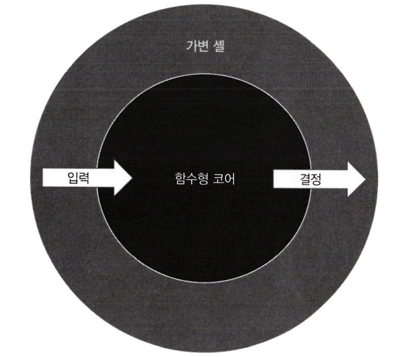
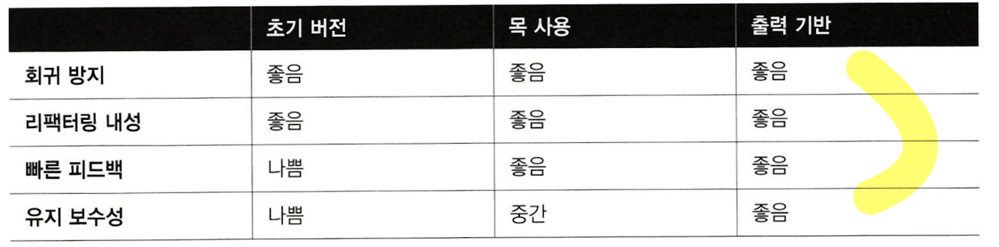
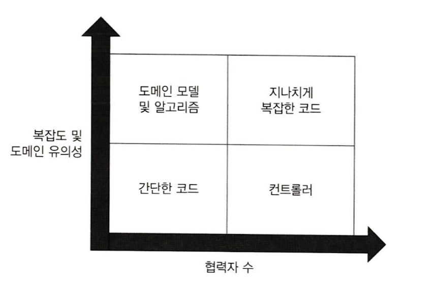
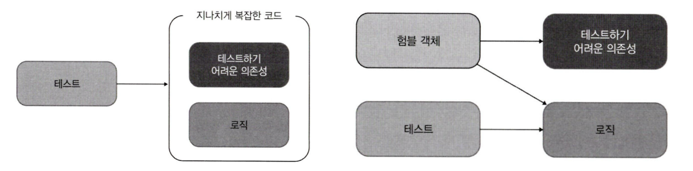
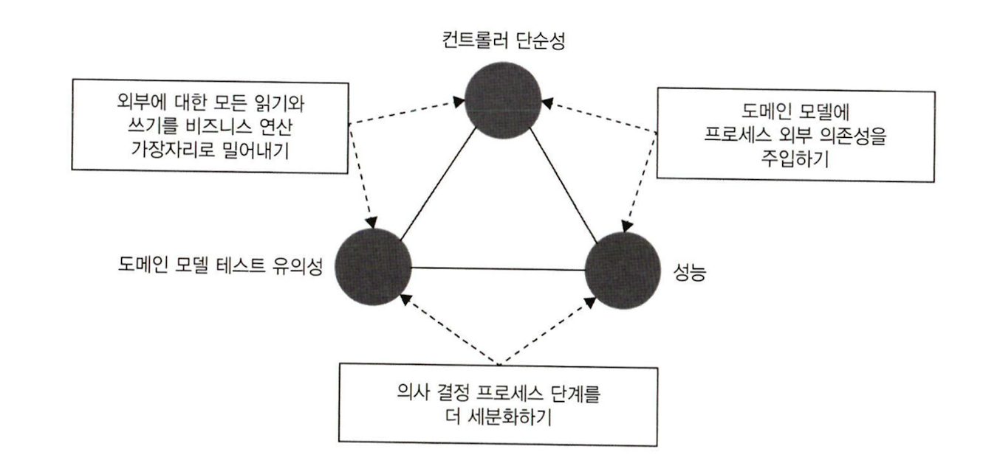
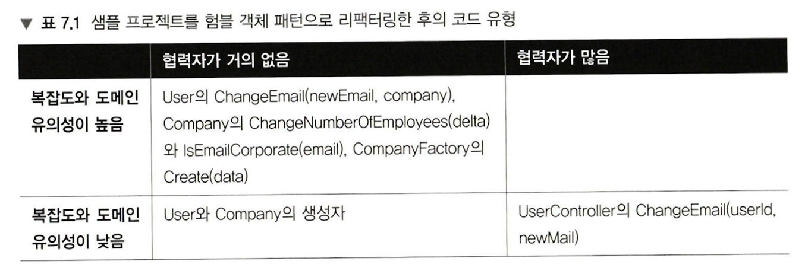
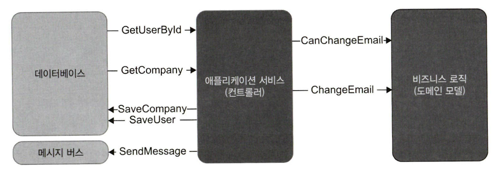
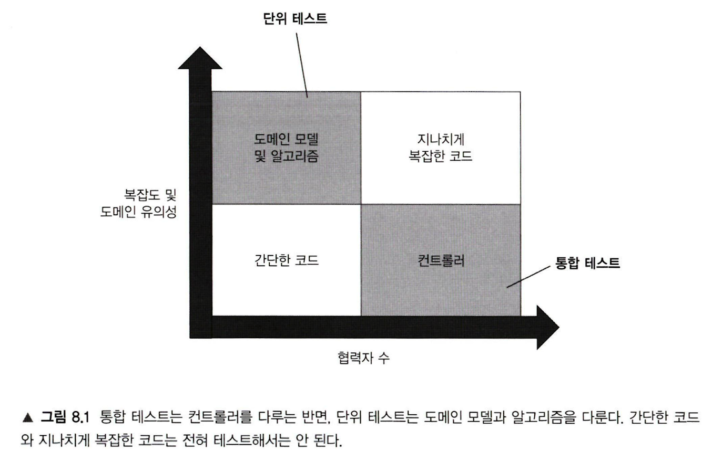
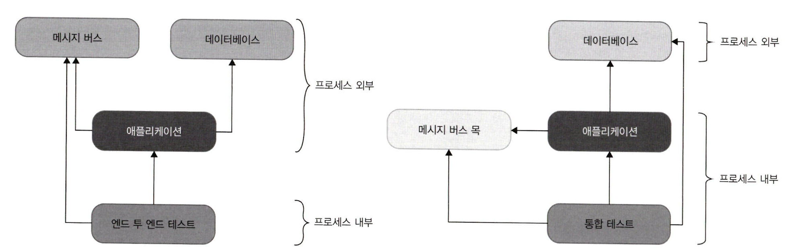
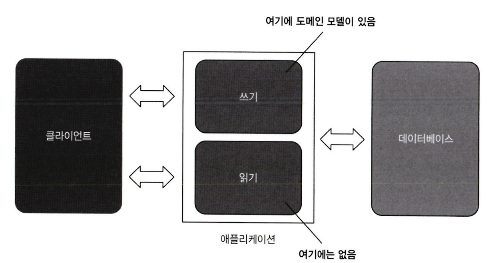

## 단위 테스트 스타일과 함수형 아키텍처
- 단위 테스트 스타일 종류
	- 출력 기반 테스트 (output-based testing, **함수형**)
		- SUT에 입력을 넣고 출력을 점검하는 방식
		- **사이드 이펙트 X**, **반환 값만 검증**
		- e.g.
			- `decimal discount = sut.CalculateDiscount(product1, product2)`
			- `Assert.Equal(0.02m, discount)`
	- 상태 기반 테스트 (state-based testing)
		- 작업이 완료된 후 시스템 **상태**를 확인하는 방식
		- 상태: SUT, 협력자, 프로세스 외부 의존성의 상태 (DB, 파일 시스템)
		- e.g. 
			- `sut.AddProduct(product)`
			- `Assert.Equal(1, sut.Products.Count)`
	- 통신 기반 테스트 (communication based testing)
		- **목**을 사용해 SUT와 협력자 간의 **통신**을 검증
		- e.g
			- `emailGatewayMock.Verify(x => x.SendGreetingsEmail(), Times.Once)`
- 단위 테스트 4대 요소 통한 비교
	- 결론: **항상 출력 기반 테스트를 선호하자**
		- 객체 지향에 적용이 어렵지만, 테스트를 출력기반 스타일로 변경하는 기법 사용하면 됨
	- 리팩토링 내성
		- **출력 기반 테스트**가 가장 우수
			- 테스트가 테스트 대상 메서드에만 결합해 거짓 양성 방지 탁월
		- 상태 기반 테스트, 통신 기반 테스트는 취약
			- 테스트가 구현 세부 사항에 결합될 가능성 높음
	- 유지 보수성
		- **출력 기반 테스트**가 가장 우수
			- **거의 항상 짧고 간결**하므로 유지보수가 쉬움
			- 전역 상태나 내부 상태를 변경할리 없으므로, **프로세스 외부 의존성 X**
		- 상태 기반 테스트, 통신 기반 테스트는 취약
			- 상태 기반 테스트, 통신 기반 테스트는 검증부가 커짐
				- 보완 1: 검증부 헬퍼 메서드 -> 메서드 유지와 재사용에 대한 명분이 드물 것
				- 보완 2: 검증 대상 클래스에 동등 멤버 정의 -> 코드 오염 (Code Pollution)
	- 회귀 방지와 빠른 피드백은 단위 테스트 스타일과 관련이 적음
- **함수형 프로그래밍**
	- 사이드 이펙트가 없는 **순수 함수 코드**를 강조하는 프로그래밍 방식
	- **숨은 입출력이 없어야 함**
		- 사이드 이펙트(인스턴스 상태 변경, 파일 I/O), 예외, 내외부 상태 참조(비공개 속성, DB 조회)
	- 지향점
		- **비즈니스 로직 코드**와 **사이드 이펙트 발생 코드**를 **분리**
			- 어떤 사이드 이펙트도 일으키지 않는 애플리케이션은 불가능
- **함수형 아키텍처**
	
	- **사이트 이펙트 코드를 최소화**하고 **순수 함수 방식 코드를 극대화**하는 방식
	- 구성
		- **함수형 코어** (functional core, immutable core)
			- **결정**을 내리는 코드
			- **수학적 함수**로 작성
		- **가변 셸** (mutable shell)
			- 해당 결정에 따라 **작용**하는 코드 (**실행**)
			- 수학적 함수에 의해 이뤄진 모든 결정을 가시적으로 변환 (DB 변경, 메시지 버스 전송)
	- 협력 과정
		- **가변 셸**이 **모든 입력 수집** 
		- -> **함수형 코어**는 **결정을 생성** 
		- -> **가변 셸**은 **결정을 사이드 이펙트로 변환**
	- **헥사고날 아키텍처**과의 **공통점** 및 **차이점**
		- **헥사고날 아키택처 ⊃ 함수형 아키텍처** (극단적으로 함수형 아키텍처 = 헥사고날 아키텍처)
		- 공통점
			- **관심사 분리** 측면
				- 도메인 : 애플리케이션 서비스 = 함수형 코어 : 가변 셸
			- **단방향 의존성 흐름**
		- 차이점
			- **사이드 이펙트 처리**
				- 헥사고날 아키텍처는 **도메인 계층 내**라면 **사이드 이펙트 허용**
				- 함수형 아키텍처는 **모든 사이드 이펙트**를 **함수형 코어 밖 가장자리**로 밀어냄
	- 단점
		- **적용 불가 상황 존재**
			- 의사 결정 절차 **중간에 프로세스 외부 의존성을 조회** 시, 출력 기반 테스트 적용 불가
			- e.g. 
				- DB에 있는 방문자의 접근 레벨을 중간에 조회해야할 때
				- `public FileUpdate AddRecord(..., IDatabase database) {...}`
				- **도메인은 절대로 DB에 의존해서는 안됨**
			- **해결책**
				- **애플리케이션 서비스 전면부**에서 방문자 접근 레벨도 **수집**
					- **접근 레벨이 필요 없어도 DB 조회**하므로 **성능 저하**
					- 그럼에도 **사이드 이펙트 분리 유지** 가능한 **장점**
				- `AuditManager`에 `IsAccessLevelCheckRequired()` 메서드 두기
					- 애플리케이션 서비스에서 `AddRecord()` 전에 호출
					- `true` 반환 시 `AddRecord()`에 접근 레벨 전달
					- **분리를 다소 완화**하고 **성능 향상** (필요할 때만 DB 조회)
		- 성능 감소
			- **함수형 아키텍처**를 지키다보면 **시스템이 외부 의존성을 더 많이 호출**
				- e.g. 초기 버전과 목 버전과 달리 최종 버전은 디렉토리에서 모든 파일을 읽음
			- 결론: 성능이 영향이 미미하다면 **유지보수성을 택하는게 나음**
		- 코드베이스 크기 증가
			- 함수형 아키텍처는 코드 복잡도가 낮아지고 유지보수성이 향상되지만 **초기 코딩이 증가**
			- 복잡도가 낮은 **간단한 프로젝트**는 **초기 투자가 타당 X**
- **단위 테스트 스타일 선택 전략** <책 예제 추천>
	- 최대한 **출력 기반 테스트 지향**
		- **함수형 코어**는 **출력 기반 테스트**로, **가변 셸**은 훨씬 더 **적은 수의 통합 테스트**로 다루기
			- **함수형 프로그래밍**을 활용해 **기반 코드**가 **함수형 아키텍처 지향**하도록 **재구성**
		- **출력 기반 스타일 변환**
			- **사이드 이펙트를 비즈니스 연산 끝으로 몰아서** 비즈니스 로직을 사이드 이펙트와 **분리**
			- e.g. 파일 I/O가 섞인 코드 (`AuditManger`)
				
				- 초기
					- 도메인 객체 `AuditManger`는 파일 I/O 코드를 품고 있음
					- 테스트도 파일 I/O로 검증 (단위 테스트 X, 통합 테스트 O)
				- 방법 1: 파일 I/O를 목으로 대체해 주입하기 (목 사용 테스트)
				- 방법 2: **I/O 담당 클래스로 따로 만들어 외부로 빼기** (**출력 기반 테스트**)
					- = **사이드 이펙트 외부 추출**
					- `AuditManager` (함수형 코어) - `Persister` (가변 셸)
					- `AuditManager`는 `new FileUpdate()` 식으로 업데이트 명령 반환
					- 추가할만한 사항
						- 삭제 유스케이스가 있다면 `FileAction` & `ActionType` Enum 처리
						- 오류처리 필요시 예외 클래스를 만들어 반환
	- **간헐적으로 상태 기반 테스트, 통신 기반 테스트 사용**
		- **객체 지향**은 **모든 테스트를 출력 기반 전환 불가**
			- e.g. `User` 클래스의 `email`, `type` 속성 변경
				- **상태 기반 테스트**지만 사이드 이펙트가 **메모리**에 남아 있어 **테스트 용이성 향상**
		- 최대한 출력 기반 테스트로 전환하되 **비용에 따라 상태, 통신 기반 테스트를 적절히 섞자**

>스타일과 단위 테스트 분파
>
>- 두 분파는 출력 기반 테스트를 사용
>- 고전파는 상태 기반 테스트 선호, 런던파는 통신 기반 테스트 선호

>코드 오염 (Code Pollution)
>
>**단위 테스트**를 **가능**하게 하거나 **단순화**하기 위한 목적만으로 **제품 코드베이스를 오염시키는 것**을 말한다.

## 가치 있는 테스트를 위한 리팩토링
- 제품 코드의 4가지 유형
	
	- 분류 기준
		- **코드 복잡도**: 코드 내 의사 결정 분기 수
		- **도메인 유의성**: 코드가 프로젝트 문제 도메인에 얼마나 의미가 있는지
		- **협력자 수**: 클래스나 메서드 내에 가변 의존성 또는 프로세스 외부 의존성 수
	- 유형
		- **도메인 모델 및 알고리즘** (중요)
			- **복잡한 코드**와 **도메인 유의성**을 갖는 **코드**가 **단위테스트에서 가장 이로움**
				- 협력자가 없어 **유지비가 낮고 회귀 방지 탁월**
			- 참고: 복잡도와 도메인 유의성은 **서로 독립적** (도메인 코드가 안복잡할 수 있음)
		- 간단한 코드 (테스트 필요 X)
		- 컨트롤러
			- 도메인 클래스나 외부 애플리케이션 같은 다른 구성 요소의 작업 조정
			- 협력자가 많은 코드는 **테스트 비용이 많이 듦** (**유지 보수성 감소**)
			- **통합 테스트로 간단히 테스트**
		- 지나치게 복잡한 코드
			- **알고리즘**과 **컨트롤러**로 나누어 **리팩토링하자**
			- 이상적으로 여기 속하는 코드는 없어야 함
			- e.g. 여러 책임을 가지고 있는 덩치 큰 컨트롤러
	- **분리 불가능한 경우도 존재**하지만 **분리를 지향**하면 **지나치게 복잡한 코드는 아닐 것!!**
		- 컨트롤러에 비즈니스 로직이 있을 수도 있음
		- 도메인 클래스에 협력자가 하나, 둘, 심지어 셋 있을 수도 있음
			- 그래도 프로세스 외부 의존성 및 목 사용은 지양
- 지나치게 복잡한 코드 분할하기 <책 예제 추천>
	- **험블 객체 패턴** (**Humble Object**)
		
		- **험블 객체**(**험블 래퍼**)를 두고 이곳에서 **중요 로직**과 **테스트가 어려운 의존성**을 **붙이는 패턴**
			- 프레임워크 의존성과 결합되어 있는 코드는 테스트가 어려움
				- e.g. 비동기, 멀티스레딩, 사용자 인터페이스, 프로세스 외부 의존성 통신
			- 방법
				- 테스트 가능한 로직을 따로 추출
				- 험블 객체를 통해 테스트 로직과 테스트 어려운 의존성을 각각 호출
		- 험블 객체는 **오케스트레이션**을 할 뿐 자체적인 로직이 없으므로 **테스트할 필요 X**
		- 예시
			- **헥사고날 아키텍처, 함수형 아키텍처와 완전히 일치!**
				- 로직: 도메인 계층, 함수형 코어
				- 테스트하기 어려운 의존성: 애플리케이션 서비스 계층, 가변 셸
			- **단일 책임 원칙**(SRP) 관점과도 일치
				- 비즈니스 로직과 오케스트레이션 분리
			- MVC(Model-View-Controller), MVP(Model-View-Presenter) 패턴
				- 컨트롤러와 프레젠터는 험블 객체로서 모델과 뷰를 붙임
			- DDD의 집계 패턴 (Aggregate Pattern)
				- 클래스를 클러스터로 묶으면 코드 베이스의 총 통신 수가 줄고 테스트 용이성 향상
	- 지나치게 복잡한 코드 리팩토링 단계
		- 1단계: 암시적 의존성을 **명시적 의존성**으로 만들기
			- 도메인 객체 내 프로세스 외부 의존성은 인터페이스를 두어 주입 (목 방식)
				- e.g. 데이터베이스, 메시지 버스
			- **통합 테스트에도 중요**
			- 그러나 **도메인 모델은 프로세스 외부 의존성에 의존하지 않는 것이 깔끔**
		- 2단계: **애플리케이션 서비스 계층 도입**
			- **험블 컨트롤러**로 **오케스트레이션 책임**을 **위임**
				- 도메인 모델이 외부 시스템과 직접 통신하는 문제 극복
			- 도메인 모델은 잘 분리되었지만 **컨트롤러는 아직 복잡한 상태**
		- 3단계: **애플리케이션 서비스 복잡도 낮추기**
			- **객체 매핑 작업 추출하기**
				- **ORM 사용**
				- **원시 데이터베이스 사용 시** 데이터 매핑을 위한 **팩토리 클래스** 작성 (in 도메인 모델)
					- 방법
						- **별도의 클래스** (**권장**)
						- 간단한 경우, 기존 도메인 클래스의 정적 메서드
					- 애플리케이션 서비스에서 조정
						- `object[] userData = _database.GetUserById(userId);`
						- `User user = UserFactory.create(userData);`
					- **테스트해볼 만함**
						- 언어 혹은 프레임워크 내 숨은 분기 존재
						- 데이터 요소 접근이나 타입 캐스팅 예외 등
			- **오케스트레이션 처리 절충하기**
				- 비즈니스 로직과 오케스트레이션 분리는 다음 패턴에서 가장 효율적
					- 외부 읽기 - 비즈니스 로직 실행 - 외부 쓰기
				- **중간 결과를 바탕**으로 **프로세스 외부 의존성을 추가로 조회**해야할 경우 존재
					- 외부 읽기 - 비즈니스 로직 실행 - 외부 읽기 - 비즈니스 로직 실행 - 외부 쓰기
				- 대처 방법
					
					- 모든 대처 방법은 위 3가지 **특성 중 2가지**만 가질 수 있으므로 선택 필요
						- **도메인 모델 테스트 유의성**: 도메인 클래스 내 협력자 수와 유형 영향
						- 컨트롤러 단순성: 분기 수 영향
						- **성능**: 프로세스 외부 의존성 호출 수
					- 종류
						- **의사 결정 프로세스 단계를 더 세분화하기**
							- 지나치게 복잡한 컨트롤러를 만들지만 **완화 방법 사용**으로 절충
							- **CanExecute/Execute 패턴 사용**
								- 도메인 클래스 내 `CanExecute()` 메서드에 두기
									- **모든 유효성 검사** 진행 메서드
									- **`Execute()`** 및**컨트롤러** 둘 모두에서 **호출**!
								- 비즈니스 로직이 컨트롤러로 유출되는 것을 방지 (**캡슐화**)
									- **도메인 계층의 모든 결정 통합**
								- e.g. `User`에 `CanChangeEmail()` 메서드 두기
									- 모든 유효성 검사를 `CanChangeEmail()`에 두기
									- `ChangeEmail()`은 `CanChangeEmail()` 호출
									- 컨트롤러도 `CanChangeEmail()` 호출
										- 외부 통신 여부 결정, 성공하면 외부 통신
							- CanExecute/Execute 패턴 적용 **불가능한 경우도 존재**
								- **파편화 로직을 컨트롤러에 넣고 통합테스트로 처리해야 함**
								- e.g.
									- 이메일 고유성 검증
									- 프로세스 외부 의존성에 따른 도메인 로직 의사 결정
						- 모든 외부 읽기 쓰기를 가장자리로 밀어내기
							- 대부분 프로젝트에서 성능은 매우 중요하므로 고려 X
						- 도메인 모델에 프로세스 외부 의존성 주입(내부에서 외부 읽기쓰기 결정)
							- 비즈니스 로직과 외부 통신이 결합되므로 테스트와 유지보수 어렵
			- **도메인 이벤트**를 사용해 **도메인 모델 변경 사항 추적하기**
				- **도메인 이벤트**는 **도메인 모델의 중요 변경 사항을 추적**하고 **외부에 알리는데 사용**됨
					- e.g. 메시지 버스에 메시지를 보내서 외부에 변경 알리기
				- **비즈니스 로직 파편화 예방**
					- 의사 결정 책임을 도메인 모델에 유지
					- 컨트롤러로 도메인 로직이 유출되는 것을 방지
					- e.g. 이메일 변경이 안되었다면 이벤트만으로 이메일 메시지 전송 안할 수 있음
						- **DB**는 이메일 변경이 안되어도 **매번 저장해도 됨**
							- 식별할 수 있는 동작 X, 상대적으로 성능 차이 미미
							- **ORM 사용 시 상태 변경 없으면 DB I/O가 없어 더욱 용이**
						- **이메일 메시지 전송**은 **식별할 수 있는 동작이어서 조정 필요**
				- 도메인 이벤트 구현
					- 도메인 이벤트 클래스
						```csharp
						public class EmailChangedEvent
						{
						public int UserId { get; }
						public string NewEmail { get; }
						}
						```
						- **외부 시스템에 통보**하는데 필요한 **데이터**가 포함된 클래스
							- e.g. 사용자 ID, Email
						- 과거 시제 명명 (이미 일어난 일들을 나타내므로)
						- 값 객체 (불변)
						- `DomainEvent`를 공통 클래스로 뽑아도 좋음
					- 도메인 클래스
						- **이벤트 컬렉션** 보유 e.g. `List<DomainEvent>`
						- 컨트롤러 끝에서 외부로 이벤트 발행하거나 이벤트 디스패처 사용 가능
						- e.g. 
							- `User` 도메인 클래스 `ChangeEmail()` 메서드
								- `EmailChangedEvents.Add(new EmailChangedEvent(UserId, newEmail));`
							- 컨트롤러 끝단에서 도메인 이벤트 처리
								```csharp
								foreach (var ev in user.EmailChangedEvents) {
									_messageBus.SendEmailChangedMessage(ev.UserId, ev.NewEmail);
								}
								```
		- 4단계: **책임 명확히 위임하기**
			- 잘못 둔 책임은 새로운 클래스에 두어 리팩토링
			- e.g. `Company` 클래스 - `ChangeNumberOfEmployees()`, `IsEmailCorporate()`
		- 5단계: 테스트 적용
			
			
			- 외부 **클라이언트 입장**에서 식별할 수 있는 동작을 파악해 **계층적**으로 **테스트**하자!
				- 고객(클라이언트) 입장에서 컨트롤러의 `ChangeEmail()` 및 메시지 버스 호출
				- 컨트롤러(클라이언트) 입장에서 `User`의 `ChangeEmail()`
				- `User`(클라이언트) 입장에서 `Company`의 `ChangeNumberOfEmployees()`, `IsEmailCorporate()`
				- 즉, **외부 계층의 관점에서 각 계층을 테스트**하고, **기저 계층과의 통신(구현)은 무시**
			- **단위 테스트**
				- `User`의 `ChangeEmail()` 테스트
					- **`Changing_email_from_non_corporate_to_corporate()`**
						- `Assert.Equal(2, company.NumberOfEmployees)`
						- `Assert.Equal("new@mycop.com, sut.Email)`
						- `Assert.Equal(UserType.Employee, sut.Type)`
					- **`Changing_email_from_corporate_to_non_corporate()`**
						- `sut.Email.Should().Be("new@gmail.com");`
						- `sut.Type.Should().Be(UserType.Customer);`
						- **`sut.EmailChangedEvents.Should().Equal(new EmailChangedEvent(1, "new@gmail.com"));`**
							- 도메인 이벤트 검증
					- **`Changing_email_without_changing_user_type()`**
					- **`Changing_email_to_the_same_one()`**
				- `Company` 테스트
					- **도메인 유의성**이 있는 모든 **전제 조건**은 **테스트 O**
						- `ChangeNumberOfEmployees()` -> 전제조건: **직원수는 음수 X**
					- 도메인 유의성이 없는 전제 조건은 테스트 X
						- `UserFactory`의 `Create()` -> 전제조건: `data.Length >= 3`
				- `User`와 `Company` 생성자 테스트 -> **필요 X**
			- **통합 테스트**
				- `UserController`의 `ChangeEmail()` 테스트

>액티브 레코드 패턴 (Active Record pattern)
>
>**도메인 클래스**가 **스스로 데이터베이스를 검색하고 저장하는 방식**을 말한다.
>단순하고 단기적인 프로젝트에는 잘 작동하지만, 코드베이스가 커지면 **확장하기 어렵다**.

>`CanExecute`/`Execute` 패턴 예시
>
>도메인 클래스 내 유효성 검사를 담당하는 `CanExcute()`는 `Execute()`와 컨트롤러에서 모두 호출한다.
>
>`User` 도메인 클래스
>```C
>public string CanChangeEmail()
>{
>	if (IsEmailConfirmed)
>		return "Can't change a confirmed email";
>	return null;
>}
>
>public void ChangeEmail(string newEmail, Company company)
>{
>	Precondition.Requires(CanChangeEmail() == null);
>	
>	...
>}
>```
>
>컨트롤러
>```C
>public string ChangeEmail(int userId, string newEmail)
>{
>	object[] userData = _database.GetUserById(userId);
>	User user = UserFactory.Create(userData);
>	
>	string error = user.CanChangeEmail();
>	if (error != null)
>		return error;
>		
>	object[] companyData = _database.GetCompany();
>	Company company = CompanyFactory.Create(companyData);
>	...
>}
>```

## 통합 테스트

- 통합 테스트: **단위 테스트가 아닌 모든 테스트**
	- 단위 테스트의 3가지 요구 사항을 **하나라도 충족하지 않으면** 통합테스트
		- 단일 동작 단위를 검증
		- 빠르게 수행
		- 다른 테스트와 별도로 처리
	- 통합 테스트는 **시스템이 전체적으로 잘 작동하는지 확신**하기 위해 사용
		- 각 부분이 외부 시스템(DB, 메시지 버스)과 어떻게 통합되는지 확인 필요
- 모든 테스트는 **도메인 모델**과 **컨트롤러**에만 **초점**을 맞춰야 한다!
	- **단위 테스트**로 **가능한 한 많이 비즈니스 시나리오의 예외 상황** 확인
	- **통합 테스트**는 **주요 흐름**(**happy path**)과 단위 테스트가 못 다루는 **기타 예외 상황**(**edge case**) 확인
		- 비즈니스 시나리오 당 1~2개 -> 시스템 전체의 정확도 보장
- 통합 테스트 전략
	- **가장 긴 주요 흐름(happy path)을 선택**해 **프로세스 외부 의존성과의 상호작용을 모두 확인**
		- 1개 테스트로 어렵다면 **외부 통신을 모두 확인**할 수 있도록 **통합 테스트 추가 작성**
	- 컨트롤러에서 **빠른 실패 원칙**에 해당하는 **예외**는 **통합 테스트로 다루지 말기**
		- e.g. `CanChangeEmail()`는 통합 테스트 가치가 적음
			- 애플리케이션 초반부에서 버그를 내어 데이터 손상으로 이어지지 않음
			- 오히려 단위 테스트에서 확인하기 좋음
	- **관리 의존성**은 **실제 인스턴스** 사용하고, **비관리 의존성**은 **목**으로 대체하자
		- 프로세스 외부 의존성 유형
			- **관리 의존성**
				- 애플리케이션을 통해서만 접근할 수 있는 의존성 ex. DB
				- **구현 세부사항** (하위 호환 고려 X)
			- **비관리 의존성**
				- 외부에서도 접근할 수 있는 의존성 ex. SMTP, 메시지버스
				- **식별할 수 있는 동작** (하위 호환 유지 필요)
			- 특이 케이스) 관리 의존성이면서 비관리 의존성인 경우
				- e.g. 다른 애플리케이션에서 접근할 수 있는 DB (특정 테이블 접근 권한 열어둠)
					- **일시적 대응**: **공유된 테이블을 비관리 의존성 취급하자**
						- 사실상 메시지 버스, 목 대체 필요
					- 다만, 시스템 간 결합도와 복잡도가 증가하므로 지양
					- API, 메시지 버스 통신이 더 나음
	- **실제 데이터베이스를 사용할 수 없는 경우**, **통합 테스트 작성하지 말고** **도메인 모델 단위 테스트에 집중**
		- **보안** 혹은 **비용 문제**로 실제 DB를 사용할 수 없는 경우 존재
		- 관리 의존성을 목으로 대체하면 회귀 방지에서 단위 테스트와 차이 X (리팩터링 내성도 저하)
	- **엔드 투 엔드 테스트**는 **대부분의 경우 생략 가능**
		
		- 통합 테스트 보호 수준이 엔드 투 엔드와 비슷함 (관리 의존성 포함 및 비관리 의존성 목 대체)
		- 배포 후 **1~2개 정도**의 **중요한 엔드 투 엔드 테스트 작성 가능**
			- 엔드 투 엔드 테스트는 프로세스 외부 의존성을 모두 실제 인스턴스 사용해야 해 느림
			- 검증: 메시지 버스를 직접 확인, 데이터베이스 상태는 애플리케이션을 통해 간접 확인
- 테스트 예시 (CRM 프로젝트)
	- **가장 긴 주요 흐름** (`Changing_email_from_corporate_to_non_corporate()`)
		- 기업 이메일에서 일반 이메일로 변경하는 것
		- **사이드 이펙트 가장 많음** (DB update, 메시지버스)
	- 단위 테스트로 어려운 예외 상황 (이메일을 변경할 수 없는 시나리오)
		- 테스트 필요 X, 빠른 실패 케이스
- 로깅(Logging) 기능 테스트?
	```csharp
	//User 도메인 클래스
	public void ChangeEmail(string newEmail, Company company)
	{
	    _logger.Info(
	        $"Changing email for user {UserId} to {newEmail}"); //진단 로깅 (지양)
	    Precondition.Requires(CanChangeEmail() == null);
	
	    if (Email == newEmail)
	        return;
	
	    UserType newType = company.IsEmailCorporate(newEmail)
	        ? UserType.Employee
	        : UserType.Customer;
	
	    if (Type != newType)
	    {
	        int delta = newType == UserType.Employee ? 1 : -1;
	        company.ChangeNumberOfEmployees(delta);
	        AddDomainEvent(
	            new UserTypeChangedEvent(
	                UserId, Type, newType)); //DomainLogger 대신 도메인 이벤트 사용
	    }
	
	    Email = newEmail;
	    Type = newType;
	    AddDomainEvent(new EmailChangedEvent(UserId, newEmail));
	
	    _logger.Info($"Email is changed for user {UserId}"); //진단 로깅 (지양)
	}
	```
	- 로깅은 횡단 관심사 (코드베이스 어느 부분에서나 필요함)
	- 로깅은 **프로세스 외부 의존성**에 **사이드 이펙트**를 초래 (텍스트 파일, DB)
		- 사이드 이펙트를 **개발자 이외 사람**(API 클라이언트, 고객)이 **보는 경우** -> **반드시 테스트!**
			- 지원 로깅 (support logging)
			- **식별할 수 있는 동작**
			- e.g. 비즈니스 요구사항이므로 명시적으로 래퍼 클래스 만들기 
			  (`IDomainLogger`, `DomainLogger`)
				```csharp
				public class DomainLogger : IDomainLogger
				{
				    private readonly ILogger _logger;
				
				    public DomainLogger(ILogger logger)
				    {
				        _logger = logger;
				    }
				
				    public void UserTypeHasChanged(
				        int userId, UserType oldType, UserType newType)
				    {
				        _logger.Info(
				            $"User {userId} changed type " +
				            $"from {oldType} to {newType}");
				    }
				}
				```
		- 사이드 이펙트를 **개발자만 보는 경우** -> **테스트 X**
			- 진단 로깅 (diagnostic logging)
			- **구현 세부 사항**
			- e.g. 로그 라이브러리 그대로 사용 (`ILogger`)
			- 과도한 사용 **지양**
				- **도메인 모델에서 절대 사용하지 말자**
				- **컨트롤러**에서 무언가를 **디버깅**해야 할 때만 **일시적으로 사용하고 제거하자**
	- 실제 테스트
		- 지원 로깅은 
			- **도메인 클래스**에서 필요할 때 **도메인 이벤트 사용해 분리**
				- **프로세스 외부 의존성**(로그 저장소)이 있으므로
			- **컨트롤러**에서 필요할 때 **로그 라이브러리 그대로 사용**
				- 프로세스 외부 의존성을 조정하는 곳이므로
		- 단위 테스트는 `User`에서 `UserTypeChangedEvent` 확인
		- 통합 테스트는 목을 사용해 `DomainLogger`와의 상호 작용 확인
- **목 사용 가치 최대화 모범 전략**
	- **비관리 의존성**만 **목으로 대체**하기
	- 비관리 의존성 **검증에 필요한 정확도**에 따라 **어느 지점을 목으로 대체할지 결정**해야 함
		- 메시지 버스는 발행되는 **메시지 구조가 중요**하므로 통신하는 시스템 끝 **마지막 타입 검증이 유리**
		- 지원 로깅은 **로그의 구조가 중요하진 않으므로 `IDomainLogger`만 목으로 처리**해도 충분
		- e.g. 메시지 버스 예시
			- `IMessageBus`(도메인 관련 메시지 정의 래퍼 클래스) & `IBus`(메시지 버스 SDK 래퍼)
				```csharp
				public interface IMessageBus
				{
				    void SendEmailChangedMessage(int userId, string newEmail);
				}
				
				public class MessageBus : IMessageBus
				{
				    private readonly IBus _bus;
				
				    public void SendEmailChangedMessage(
				        int userId, string newEmail)
				    {
				        _bus.Send("Type: USER EMAIL CHANGED; " +
				                  $"Id: {userId}; " +
				                  $"NewEmail: {newEmail}");
				    }
				}
				
				public interface IBus
				{
				    void Send(string message);
				}
				```
				- **`IBus`를 목으로 처리**하면 **회귀방지, 리팩터링 내성 극대화** 가능
					- `IBus`가 **비관리 의존성과 통신하는 마지막 타입**
					- 구현 세부 사항이 아닌 실제 사이드 이펙트 검증 가능
			- 테스트 - 목 버전
				```csharp
				[Fact]
				public void Changing_email_from_corporate_to_non_corporate()
				{
				    var busMock = new Mock<IBus>(); // IBus를 목으로 대체
				    var messageBus = new MessageBus(busMock.Object);//구체클래스
				    var loggerMock = new Mock<IDomainLogger>();
				    var sut = new UserController(db, messageBus, loggerMock.Object);
				
				    /* ... */
				
				    busMock.Verify(
				        x => x.Send(
				            "Type: USER EMAIL CHANGED; " +
				            $"Id: {user.UserId}; " +
				            $"NewEmail: new@gmail.com"),
				        Times.Once);
				}
				```
				- **`IMessageBus` 인터페이스를 삭제**하고 **`MessageBus`로 대체 가능**
					- 목 대체 목적이 사라진 `IMessageBus`는 구현이 하나뿐인 인터페이스
			- 테스트 - 스파이 버전
			```csharp
			[Fact]
			public void Changing_email_from_corporate_to_non_corporate()
			{
			    var busSpy = new BusSpy();
			    var messageBus = new MessageBus(busSpy);
			    var loggerMock = new Mock<IDomainLogger>();
			    var sut = new UserController(db, messageBus, loggerMock.Object);
			
			    /* ... */
			
			    busSpy.ShouldSendNumberOfMessages(1)
			          .WithEmailChangedMessage(user.UserId, "new@gmail.com");
			}
			```
			- 시스템 끝에 있는 클래스는 **스파이**가 목보다 나음 (스파이: 직접 작성한 목)
				```csharp
				public interface IBus
				{
				    void Send(string message);
				}
				
				public class BusSpy : IBus
				{
				    private List<string> _sentMessages = new List<string>();
				
				    public void Send(string message)
				    {
				        _sentMessages.Add(message);
				    }
				
				    public BusSpy ShouldSendNumberOfMessages(int number)
				    {
				        Assert.Equal(number, _sentMessages.Count);
				        return this;
				    }
				
				    public BusSpy WithEmailChangedMessage(int userId, string newEmail)
				    {
				        string message = "Type: USER EMAIL CHANGED; " +
				                         $"Id: {userId}; " +
				                         $"NewEmail: {newEmail}";
				        Assert.Contains(
				            _sentMessages, x => x == message);
				        return this;
				    }
				}
				```
				- 검증 단계에서 **코드를 재사용**해 **테스트 크기 감소**
				- 간결한 영어 문장의 **플루언트 인터페이스**로 **가독성 향상**
	- **통합 테스트**에서만 **목 사용**하기 (단위 테스트 X)
	- **항상 목 호출 수 확인**하기
		- 비관리 의존성 통신에서 확인해야할 것
			- 예상하는 호출이 있는가?
			- 예상치 못한 호출은 없는가?
				- e.g. `Times.Once` (**정확히 한 번만 전송되는지 확인하기**)
				- e.g. `messageBusMock.VerifyNoOtherCalls();` (목 라이브러리 지원)
	- **보유 타입**만 **목으로 처리**하기 
		- **서드파티 라이브러리 위에 항상 어댑터를 작성**하고, **해당 어댑터**를 **목으로 처리**해야 함
			- 손상 방지 계층으로서 서드파티 라이브러리의 복잡성을 추상화하고 필요한 기능만 노출
			- 마찬가지로 **비관리 의존성**에만 적용
		- e.g. `IBus`
- **데이터베이스 테스트** (**관리 의존성**)
	- 테스트 전제 조건
		- **형상 관리 시스템**에 **데이터베이스**를 유지하자
			- **데이터베이스 스키마**를 **일반 코드** 취급해 형상 관리 시스템에 저장 (**Git**)
				- **SQL 스크립트 형태** (테이블, 뷰, 인덱스, 저장 프로시저)
				- 참조 데이터의 경우 SQL INSERT 문 형태로 함께 저장 (e.g. `UserType` 테이블)
			- 모델 데이터베이스 사용은 안티패턴
				- 데이베이스 스키마를 과거 특정 시점으로 되돌릴 수 없음 (추적 불가)
		- 모든 개발자는 **로컬**에서 **별도의 데이터베이스 인스턴스** 사용하자
		- **마이그레이션 기반 데이터베이스 배포** 지향하자
			- 마이그레이션 방식은 초기에는 구현과 유지보수가 어렵지만 **효과적**
			- 상태 기반 방식
				- 배포 중에 **비교 도구가 스크립트를 자동 생성**해 모델 DB에 맞게 운영 DB 업데이트
				- 스크립트는 형상 관리로 저장
			- 마이그레이션 방식
				- 업그레이드 **스크립트를 직접 작성**해 형상 관리로 저장
				- SQL 스크립트 혹은 SQL로 변환할 수 있는 DSL 언어 사용
	- **통합 테스트 트랜잭션 관리**
		- 대부분의 ORM은 Unit of Work 패턴을 구현
			- 작업 단위
				- **비즈니스 작업**에서 **하나의 트랜잭션**으로 묶이는 **데이터 변경 작업의 집합**
				- e.g. JPA 영속성 컨텍스트
		- **통합 테스트**에서는 **적어도 3개의 작업 단위를 사용**하자! (**준비**, **실행**, **검증** 구절 당 하나씩)
			- 통합 테스트는 가능한 운영 환경과 비슷해야함
				- 같은 테스트에서 **작업 단위 재사용**은 **운영 환경과 다른 환경**을 만들어서 **문제**
			- e.g. 동일 테스트 내에서 DB에 바로 업데이트 쿼리를 날림
				- 조회는 ORM의 1차 캐시에서 진행해서 업데이트 반영 X
				- 검증부에서 업데이트가 안되어 테스트가 실패할 수 있음
	- **공유 데이터베이스**에서 **각 통합 테스트 격리하기**
		- **통합 테스트**를 **순차적**으로 **실행**하기
			- 순차적 테스트가 병렬 테스트보다 **실용적** (성능 향상 이점보다 복잡함이 큼)
			- **대부분**의 **단위 테스트 프레임워크**에서 **기능 지원**
				- **두 가지 테스트군** 만들기 (단위 테스트 & 통합 테스트)
				- **통합테스트군**은 테스트 **병렬처리 비활성화**하기
		- 테스트 실행 간에 **남은 데이터 제거하기**
			- **테스트 시작 시점에 데이터 정리하기** (Unit Testing 책의 **권장 전략**)
				- 정리 단계를 실수로 건너 뛰지 않고 빠른 동작과 일관성을 제공
				- 모든 통합 테스트에 **기초 클래스** 두고 **삭제 스크립트 작성**
					```csharp
					public abstract class IntegrationTests
					{
						private const string ConnectionString = "...";
					
						protected IntegrationTests()
						{
							ClearDatabase();
						}
					
						private void ClearDatabase()
						{
							string query =
								"DELETE FROM dbo.[User];" +
								"DELETE FROM dbo.Company;";
					
							using (var connection = new SqlConnection(ConnectionString))
							{
								var command = new SqlCommand(query, connection)
								{
									CommandType = CommandType.Text
								};
					
								connection.Open();
								command.ExecuteNonQuery();
							}
						}
					}
					```
			- 데이터베이스 **트랜잭션**에 각 테스트를 래핑하고 **커밋하지 않기** (애매)
				- 변경 내용이 **자동으로 롤백**되어 정리 단계 생략 문제를 해결하고 **편리**
				- **운영 환경과 다른 환경을 만듦**
					- `ReadUncommited` 격리 레벨이 아닌 이상 트랜잭션 하나에서 준비, 실행, 검증 구절을 진행 -> 1차 캐시로 인한 테스트 변질 발생 가능성
			- 테스트 종료 시점에 데이터 정리하기
				- 빠르지만 정리 단계를 건너뛰기 쉬움
				- 테스트 도중 중단하면 데이터가 DB에 남아 있어 이후 테스트에 영향을 줌
			- 각 테스트 전 데이터베이스 백업 복원하기 (지양)
				- 가장 느림
				- 컨테이너를 사용해도 컨테이터 인스턴스 제거 및 새 컨테이너 생성에 몇 초 걸림
		- **인메모리 데이터베이스 피하기**
			- 테스트용 DB로 SQLite 같은 인메모리 DB를 사용할 수 있음
				- 테스트 데이터를 제거할 필요 X
				- 빠름
				- 테스트 실행할 때마다 인스턴스화 가능
				- 공유 의존성 X (단위 테스트화)
			- **일반 DB와 기능적 일관성이 없음** (운영 환경과 테스트 환경 불일치)
				- 거짓 양성, 나아가 거짓 음성 다량 발생
			- **테스트에서도 운영환경과 같은 DBMS를 사용하자** (버전은 달라도 괜찮, 공급업체는 같음)
	- **테스트 구절에서 코드 재사용하기** (통합 테스트 크기 줄이기)
		- 비즈니스와 관련 없는 **기술적인 부분**을 **비공개 메서드** 혹은 **헬퍼 클래스**로 **추출** (**재사용**)
		- **헬퍼 메서드**로 **작업 단위(트랜잭션 수)가 더욱 늘어**날 수 있지만 **유지보수성** 위해 **절충**
		- 준비 구절
			- 전략
				- 기본적으로 **테스트와 동일한 클래스**에 **팩토리 메서드 배치**
					- 기초 클래스에 두지 말자
						- 모든 테스트에서 실행하는 코드만 둬야 함 
						- e.g. 데이터 정리
				- **코드 반복** 있을 시, **헬퍼 클래스** 생성 및 배치
			- **오브젝트 마더 패턴** 
				```csharp
				private User CreateUser(
				    string email = "user@mycorp.com", 
				    UserType type = UserType.Employee, 
				    bool isEmailConfirmed = false)
				{
				    using (var context = new CrmContext(ConnectionString))
				    {
				        var user = new User(0, email, type, isEmailConfirmed);
				        var repository = new UserRepository(context);
				        repository.SaveUser(user);
				
				        context.SaveChanges();
				
				        return user;
				    }
				}
				```
				- **오브젝트 마더** (Object Mother) - **지향**
					- **테스트 픽스처**(테스트 실행 대상)를 만드는데 **도움이 되는 클래스** 또는 **메서드**
					- **준비 구절**에서 **코드 재사용** 용이
				- 테스트 데이터 빌더 패턴 - 지양
					- `User user = new UserBuilder().WithEmail(..).WithType(..).Build();`
					- 플루언트 인터페이스 제공 (약간의 가독성 향상)
					- 마찬가지로 준비 구절에서 코드 재사용 용이
					- 상용구가 너무 많이 필요하므로 불편
		- 실행 구절
			```csharp
			private string Execute(
			    Func<UserController, string> func, 
			    MessageBus messageBus,
			    IDomainLogger logger)
			{
			    using (var context = new CrmContext(ConnectionString))
			    {
			        var controller = new UserController(
			            context, messageBus, logger);
			        return func(controller);
			    }
			}
			```
			- 컨트롤러 정보를 받아 실행하는 **헬퍼 메서드** 도입 (실행 구절 줄이기)
			- 프로세스 외부 의존성도 한 번에 전달
		- 검증 구절
			```csharp
			public static class UserExtensions
			{
			    public static User ShouldExist(this User user)
			    {
			        Assert.NotNull(user);
			        return user;
			    }
			
			    public static User WithEmail(this User user, string email)
			    {
			        Assert.Equal(email, user.Email);
			        return user;
			    }
			}
			
			// Example usage
			User userFromDb = QueryUser(user.UserId);
			userFromDb
			    .ShouldExist()
			    .WithEmail("new@gmail.com")
			    .WithType(UserType.Customer);
			
			Company companyFromDb = QueryCompany();
			companyFromDb
			    .ShouldExist()
			    .WithNumberOfEmployees(0);
			```
			- **헬퍼 메서드** 두기 (+플루언트 인터페이스)
	- **읽기 테스트**를 해야 하는가?
		
		- **가장 복잡하거나 중요한 읽기 작업만 테스트**하고 나머지는 무시 (할 경우 **통합 테스트**로 진행)
			- 읽기 버그는 해로운 문제가 없음
			- **성능**면에서 **일반 SQL 사용**하는 것이 좋음! 
				- **도메인 모델도 필요 X**
				- ORM의 불필요한 추상화 계층 피할 수 있음
		- **쓰기를 철저히 테스트**하는 것이 매우 중요
			- **위험성**이 높기 때문에 **매우 가치 있음**
	- **리포지토리 테스트**를 해야 하는가?
		- 마찬가지로 직접 테스트하지말고 **통합 테스트의 일부로서만 다루기**
		- 컨트롤러 사분면에 소속 -> 통합테스트가 필요한데 **이점이 적음**
			- 유지비가 높음 (외부 통신 존재)
			- 그에 비해 회귀 방지 이점이 적음 (복잡도가 거의 없음)
				- **복잡도**가 있는 부분은 **별도 알고리즘으로 추출**해 **테스트**
				- e.g. 객체 매핑 작업 (`UserFactory`, `CompanyFactory`)
		- **EventDispatcher도 별도로 테스트하지 말자**
			- 유지비가 높지만 회귀 방지 이점이 적음

>**인터페이스**의 사용이유 2가지
>
>- 느슨한 결합
>	- 구체 클래스가 2개 이상일 때 추상화를 위해 사용
>		- 구체 클래스가 1개일 때 인터페이스 도입은 YAGNI 위배 (You aren't gonna need it)
>- **목 사용**
>	- **구체 클래스가 1개일 경우**에도 **인터페이스를 사용하는 이유**
>	- 인터페이스가 없으면 테스트 대역을 만들 수 없음
>	- **의존성을 목으로 처리할 필요가 있을 때만, 프로세스 외부 의존성에 인터페이스 두자**
>		- = **비관리 의존성**에만 **인터페이스**를 쓰자
>	- e.g.
>		- `private readonly Database _database;`
>		- `private readonly ImessageBus _messageBus;`

>Unit Testing 책 권장 백엔드 시스템 계층
>
>간접 계층은 많은 애플리케이션 문제를 해결하지만, **가능한 간접 계층을 적게 사용하자.**
>
>- 도메인 모델 (도메인 로직)
>- 애플리케이션 서비스 계층 = 컨트롤러 (외부 클라이언트에 대한 진입점 제공 및 오케스트레이션)
>- 인프라 계층 (데이터베이스 저장소, ORM 매핑, SMTP 게이트웨이)

>순환 의존성 제거하기
>
>**순환 의존성**이란 둘 이상의 클래스가 제대로 작동하고자 **직간접적으로 서로 의존**하는 것을 말한다.
>순환 의존성은 코드를 읽을 때 **주변 클래스 그래프를 파악해야 하는 부담**이 존재하며 **테스트를 방해**한다.
>따라서, **순환 의존성은 최대한 제거하자.**

>실행 구절이 여러 개인 다단계 테스트
>
>여러 개 실행 구절을 가지는 테스트는 **프로세스 외부 의존성을 관리하기 어려운 경우**에 발생한다.
>따라서, **다단계 테스트**는 **거의 항상 엔드 투 엔드 테스트** 범주에서만 허용된다. (통합테스트도 드묾)
>단위 테스트는 절대로 실행 구절이 여러 개 있어서는 안된다.

>**식별할 수 있는 동작 기준**
>
>식별할 수 있는 동작은 다음 **2가지 기준 중 하나를 충족**해야 한다.
>- **클라이언트의 목표** 중 하나에 직접적 연관이 있음
>- **외부에서 접근**할 수 있는 **프로세스 외부 의존성**에서 **사이드 이펙트**가 발생함

>권장 의존성 주입
>
>**모든 의존성은 항상 생성자 혹은 메서드를 통해 명시적으로 주입하자.**
>
>의존성을 내부로 숨기는 Ambient Context는 안티패턴이다.
>이는 의존성이 숨어있어 **변경이 어렵**고 **테스트가 더 어려워진다**.

## 단위 테스트 안티 패턴
- 안티 패턴 1: **비공개 메서드 단위 테스트**
	- **식별할 수 있는 동작**으로 **간접적으로 비공개 메서드를 테스트**해야 함
		- 즉, **최대한 하지 말아야 한다!**
	- 식별할 수 있는 동작으로 테스트 해도 **비공개 메서드가 매우 복잡**해 **커버리지가 낮은 경우**
		- 해당 비공개 메서드는 **죽은 코드**이거나 (삭제 필요)
		- **추상화가 누락된 징후** (별도 클래스로 도출 필요)
			- e.g.
				- 복잡한 비공개 메서드
					```csharp
					public class Order
					{
					    private Customer _customer;
					    private List<Product> _products;
					
					    public string GenerateDescription()
					    {
					        return $"Customer name: {_customer.Name}, " +
					               $"total number of products: {_products.Count}, " +
					               $"total price: {GetPrice()}";
					    }
					
					    private decimal GetPrice()
					    {
					        decimal basePrice = /* _products에 기반한 계산 */;
					        decimal discounts = /* _customer에 기반한 계산 */;
					        decimal taxes = /* _products에 기반한 계산 */;
					        return basePrice - discounts + taxes;
					    }
					}
					```
				- 추상화 적용 코드
					```csharp
					public class Order
					{
					    private Customer _customer;
					    private List<Product> _products;
					
					    public string GenerateDescription()
					    {
					        var calc = new PriceCalculator();
					        return $"Customer name: {_customer.Name}, " +
					               $"total number of products: {_products.Count}, " +
					               $"total price: {calc.Calculate(_customer, _products)}";
					    }
					}
					
					public class PriceCalculator
					{
					    public decimal Calculate(Customer customer, List<Product> products)
					    {
					        decimal basePrice = /* _products에 기반한 계산 */;
					        decimal discounts = /* _customer에 기반한 계산 */;
					        decimal taxes = /* _products에 기반한 계산 */;
					        return basePrice - discounts + taxes;
					    }
					}
					```
	- 비공개 메서드 테스트가 타당한 예외도 존재
		- 신용 조회 관리 시스템 (`Inquiry` 클래스의 **비공개 생성자 내 승인 로직**)
		- 승인 로직은 중요하므로 단위테스트를 거쳐야 함 -> `public` 허용
- 안티 패턴 2: **단위 테스트 목적**으로 **비공개 상태 노출하기**
	- **비공개 상태** -> **식별할 수 없는 동작**
	- 비공개 상태를 바꾸는 메서드 테스트 -> 단일 메서드 보다 **식별할 수 있는 동작 관점에서 테스트**하자
	- 추후에 비즈니스 요구 사항으로 공개 상태로 바뀌면, 그 때는 상태를 검증하면 좋다!
- 안티 패턴 3: **테스트로 유출된 도메인 지식**
	```csharp
	public class CalculatorTests
	{
	    [Theory]
	    [InlineData(1, 3)]
	    [InlineData(11, 33)]
	    [InlineData(100, 500)]
	    public void Adding_two_numbers(int value1, int value2)
	    {
	        int expected = value1 + value2; // 유출
	
	        int actual = Calculator.Add(value1, value2);
	
	        Assert.Equal(expected, actual);
	    }
	}
	```
	- 테스트가 제품 코드에서 **알고리즘 구현을 복사**한 상황 (`value1 + value2`)
	- **복잡한 알고리즘 다루는 테스트**에서 주로 발생
	- **구현 세부사항과 결합**되는 테스트 (리팩토링 내성 0점)
	- 테스트 작성 시 **결과를 하드코딩**하자!
		```csharp
		public class CalculatorTests
		{
			[Theory]
			[InlineData(1, 3, 4)]
			[InlineData(11, 33, 44)]
			[InlineData(100, 500, 600)]
			public void Adding_two_numbers(int value1, int value2, int expected)
			{
				int actual = Calculator.Add(value1, value2);
		
				Assert.Equal(expected, actual);
			}
		}
		```
		- 하드코딩 예상 결과값은 **도메인 전문가의 도움을 받아 SUT가 아닌 다른 것으로 미리 계산**
		- 레거시 코드 리팩토링 시 **레거시 코드로 결과를 생성**하고 **예상 결과 값으로 사용** 가능
- 안티 패턴 4: **코드 오염**
	- **테스트에만 필요한 코드**를 **제품 코드에 추가**하는 것
		- 테스트 코드와 제품 코드가 **혼재**되면 **유지비 증가**
		- e.g. `private readonly bool _isTestEnvironment`
	- **테스트 코드**를 **제품 코드 베이스**와 **반드시 분리하자!** (**운영용 진짜 구현체** & **테스트용 가짜 구현체**)
		- e.g. `ILogger` 인터페이스 -> `Logger` (운영용), `FakeLogger` (테스트용)
		- 이 상황의 인터페이스도 일종의 코드 오염이지만, 오염도가 낮고 다루기 쉬움
- 안티 패턴 5: **구체 클래스를 목으로 처리하기**
	- 인터페이스가 아닌 구체 클래스로 목으로 처리할 경우 **단일 책임 원칙 위배**되는 시나리오일 가능성
	- 여러 책임이 합쳐진 클래스일 가능성을 의심하고 **분리**하자!
- 안티 패턴 6: **앰비언트 컨텍스트로서의 시간 처리**
	- 시간을 정적 메서드 혹은 필드로 참조하는 것 -> **테스트가 더 어려움** (공유 의존성 발생)
	- 더 나은 방안: **시간을 명시적 의존성으로 주입하기**
		- **컨트롤러**에는 시간 관련 **인스턴스**를 전달 (클래스는 메서드에서 시간 반환)
		- **도메인 클래스**에는 시간을 **값**으로 전달

***
## Reference
[단위 테스트 (생산성과 품질을 위한 단위 테스트 원칙과 패턴)](https://www.aladin.co.kr/shop/wproduct.aspx?ISBN=K942734842&start=pnaver_02)