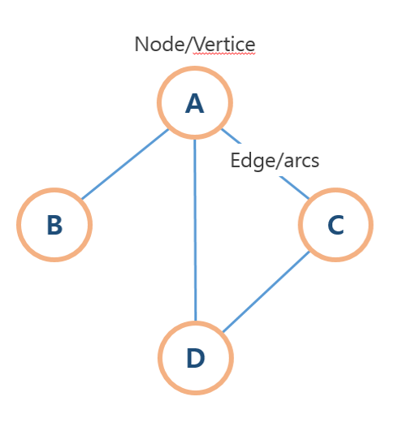
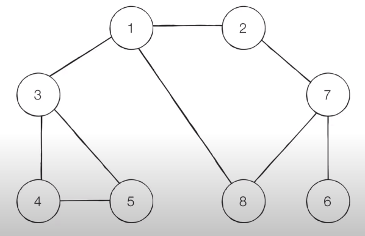

# DFS(Depth-First Search) & BFS(Breadth-First Search)

## 그래프 탐색

하나의 자료구조로서 그래프(Graph)는 데이터와 데이터 사이의 관계를 잘 표현해주는 자료구조이다. 그래프는 기본적으로 데이터가 담기는 노드(Node)와 데이터 사이를 연결하는 간선(Edge)으로 이루어져있다. 노드는 정점(Vertex)이라고도 불린다.

그래프 탐색은 하나의 노드를 시작으로 다수의 노드를 방문하는 것을 말하며, 간선으로 연결되어 있는 두 노드는 서로 '인접'해 있다고 한다.



​    

## DFS (Depth-First Search, 깊이 우선 탐색)

DFS는 그래프의 깊은 부분을 우선적으로 탐색하는 알고리즘이다. 특정한 경로로 먼저 최대한 깊숙이 탐색한 후, 다시 돌아와 다른 경로를 탐색한다. DFS는 스택이나 재귀함수를 활용해 구현하며, 기본 순서는 다음과 같다.

​    

1. 탐색 시작 노드를 스택에 삽입하고 방문 처리한다.

2. 스택의 최상단 노드에 방문하지 않은 인접 노드가 있으면 그 인접 노드를 스택에 넣고 방문 처리한다. 방문하지 않은 인접 노드가 없으면 스택에서 최상단 노드를 꺼낸다.

3. 2번의 과정을 더 이상 수행할 수 없을 때까지 반복한다.

​    



​    

위와 같은 그래프를 DFS로 탐색 시, 방문 순서는 1 - 2 - 7 - 6 - 8 - 3 - 4 - 5 이다. 파이썬으로 이를 구현하면 다음과 같다.

```python
def dfs(graph, v, visited):
    # 현재 노드 방문
    visited[v] = True
    print(v, end=' ')
    # 현재 노드의 인접 노드를 재귀적으로 방문
    for i in graph[v]:
        if not visited[i]:
            dfs(graph, i, visited)

# 각 노드가 연결된 정보 표현
graph = [
    [],
    [2, 3, 8],
    [1, 7],
    [1, 4, 5],
    [3, 5],
    [3, 4],
    [7],
    [6, 8],
    [1, 7]
]

# 각 노드의 방문 정보 표현
visited = [False] * 9

# DFS 함수 호출
dfs(graph, 1, visited)
```

​    

## BFS (Breadth-First Search, 너비 우선 탐색)

BFS는 가까운 노드부터 탐색하는 알고리즘이다. BFS는 큐 자료구조를 활용해 구현하는 것이 일반적이며 다음과 같은 절차로 이루어진다.

​    

1. 탐색 시작 노드를 큐에 삽입하고 방문 처리를 한다.

2. 큐에서 노드를 꺼내 해당 노드의 인접 노드 중에서 방문하지 않은 노드를 모두 큐에 삽입하고 방문 처리를 한다.

3. 2번의 과정을 더 이상 수행할 수 없을 때까지 반복한다.

​    


​    

위 그래프를 BFS로 탐색하면 1 - 2 - 3 - 8 - 7 - 4 - 5 - 6 이다. 이를 파이썬으로 구현하면 다음과 같다.

```python
from collections import deque


# BFS 메서드 정의
def bfs(graph, start, visited):
    queue = deque([start])

    visited[start] = True
    # 큐가 빌 때까지 반복
    while queue:
        # 큐에서 하나의 원소를 뽑아 출력
        v = queue.popleft()
        print(v, end=' ')
        # 아직 방문하지 않은 인접 노드들을 큐에 삽입하고 방문 처리
        for i in graph[v]:
            if not visited[i]:
                queue.append(i)
                visited[i] = True


# 각 노드가 연결된 정보 표현
graph = [
    [],
    [2, 3, 8],
    [1, 7],
    [1, 4, 5],
    [3, 5],
    [3, 4],
    [7],
    [6, 8],
    [1, 7]
]

visited = [False] * 9

bfs(graph, 1, visited)
```

​    

## Reference

[gimtommang11 자료구조 그래프](https://velog.io/@gimtommang11/자료구조그래프)

[\[이코테] 3. DFS & BFS](https://www.youtube.com/watch?v=7C9RgOcvkvo&ab_channel=동빈나)

​    

*본 포스팅은 '안경잡이 개발자' 나동빈 님의 저서*

*'이것이 코딩테스트다'와 그 유튜브 강의를 공부하고 정리한 내용을 담고 있습니다.*