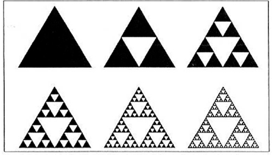

# 재귀 함수(Recursive Function)

자기 자신을 다시 호출하는 함수를 의미한다. 이는 어린 시절 수학 과목을 공부할 때 마주하는 프랙털(Fractal) 구조와 비슷하다. 프랙털 구조에서는 같은 모양의 도형이 무한히 반복되는 형태를 볼 수 있다.

* 같은 모양이 무한히 반복되는 삼각형



재귀 함수가 자기 자신을 호출하는 것도 무한히 반복되는 양상을 보인다. 따라서, 재귀 함수를 사용할 때는 항상 종료 조건을 명시해 함수의 끝을 만들어야 한다.

또한, 재귀 함수는 컴퓨터 내부 메인 메모리의 스택 공간에 적재된다. 이 말은 재귀 함수가 **스택 자료구조와 내부적으로 동일함**을 의미한다. 따라서, **DFS와 같이 스택 자료구조를 사용해야 하는 알고리즘은 재귀 함수를 통해 간편히 구현**할 수 있다.

다음은 파이썬으로 구현한 간단한 재귀 함수이다.

```python
def recursive_function(n):
    if n == 100:
        return
    print(n, "번째 재귀함수에서", n+1, "번째 재귀함수를 호출합니다.")
    recursive_function(n+1)
    print(n, "번째 재귀함수가 종료됩니다.")


recursive_function(1)
```

위 재귀 함수는 100번째에 호출될 때 가장 나중에 호출되었던 함수들부터 모든 함수들이 하나씩 종료되는 스택과 같은 구조를 보인다.