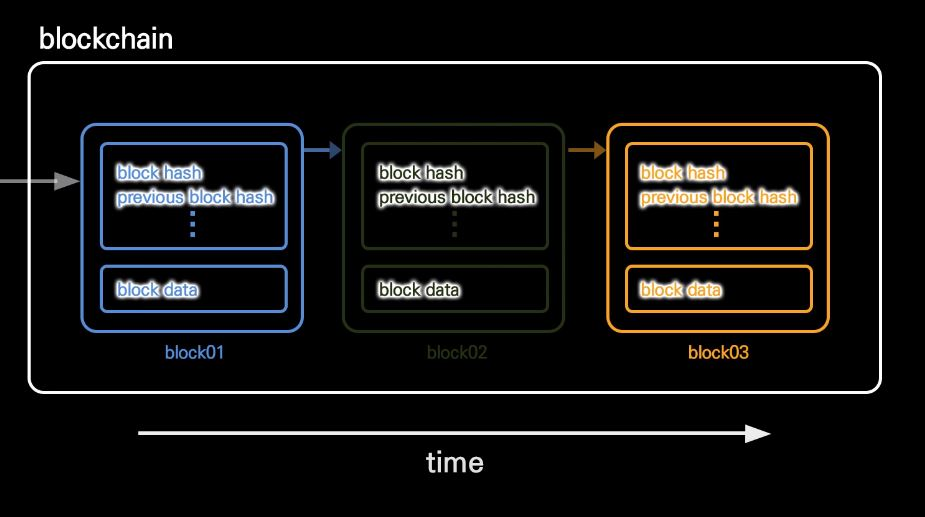
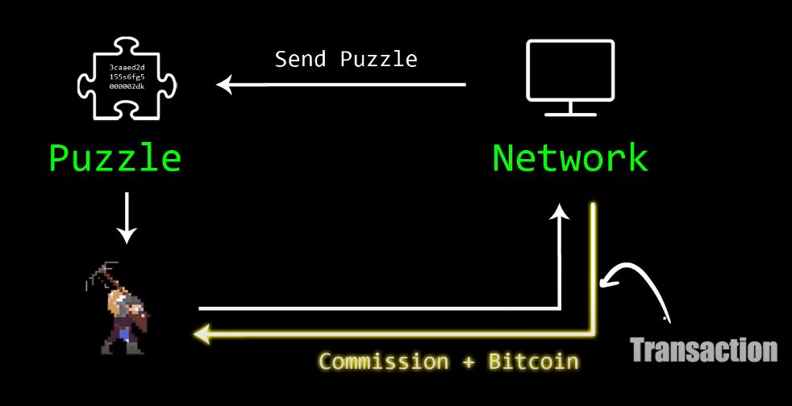
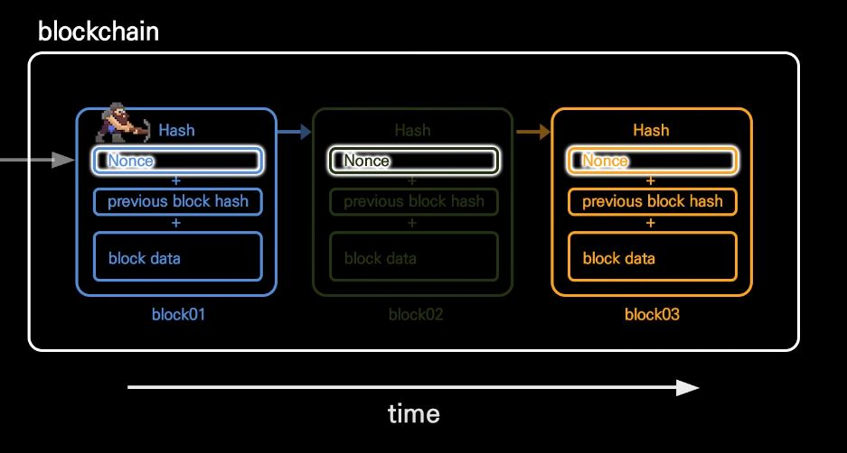

# 블록체인 Overview

## 블록체인(Blockchain)의 개념

### 공식적 정의

Blockchain Security Technology라고 하며, **데이터를 담은 블록을 체인 형태로 연결한 다음 동시에 수많은 컴퓨터에 복제와 저장을 하는 분산형 데이터 저장 기술**을 말합니다. 중앙 서버에 거래 내역을 저장하지 않고 거래를 할 때마다 수많은 거래 참여자들에게 거래 내역을 공유하기 때문에 위조, 변조가 거의 불가능합니다.

### 특징

* Append(추가): 블록체인에서 블록은 오직 추가만 할 수 있습니다.
* Decentralization(탈중앙화): 특정 개인이 블록체인 DB를 관리할 수 없습니다.

### 쉬운 개념 설명

블록체인은 일종의 데이터베이스로, 각각의 블록은 데이터로 생각할 수 있습니다.

특별한 점은 **데이터를 추가(Append)만 할 수 있다는 것**입니다. 블록체인 DB에 연결된 블록 데이터는 편집 및 삭제가 불가능합니다. 대학교 학위, 정부 단위에서 운전면허증, 지원금 사용 내역, 혹은 개인의 전세 계약서 등 안전한 보관이 필요한 영역에서 데이터를 기록하는데 활용될 수 있습니다.

또한, **블록체인 참여자 모두가 DB의 복제본을 가지고 있어서(Decentralization) 특정 개인이 DB를 관리할 수 없습니다.** 특정 개인이 갑자기 100억원어치 비트코인을 가지고 있다고 DB를 조작해도 다른 사람들의 블록체인 사본과 비교하면 쉽게 거짓이 감별됩니다. 이로 인해, 나아가 정부의 독단적인 감시나 통제에도 공동으로 대응할 수 있습니다. 이 검증이 확실한 동작하는 이유는 너무나 많은 사람들이 비트코인 노드를 돌리고 있어 모든 컴퓨터가 일제히 종료되어 있지 않는한 공동의 감시를 벗어나기 어렵기 때문입니다. 현실적으로 모두의 컴퓨터가 동시에 종료되는 일은 불가능합니다.

​    

## 블록체인 생성 과정

### 블록의 형태

블록은 정보를 DB에 추가하는 방법입니다. 그리고 하나의 블록은 **block hash**, **이전 블록의 block hash**, **block data**로 구성됩니다.

먼저 block data에는 해당 영역의 data가 담깁니다. 비트코인의 경우 거래 내역(transaction) 데이터가 해당됩니다. 그리고 현재 블록의 block hash에는 이전 block의 hash 값과 지금의 데이터를 함께 해시한 값이 담깁니다. 이렇게 해시를 통해 블록을 쌓아가면, 블록체인에 어떤 작은 조작만 가해도 결과로 나올 해시값이 크게 달라지기 때문에 보안이 안전하게 유지됩니다.

​    

> 해시(Hash)란?
>
> 어떤 데이터를 특정 알고리즘을 사용해 고정된 길이를 가진 기묘한 모습의 데이터로 변환시킨 값을 말합니다. 해시를 사용하면 Input 데이터로 Output 데이터를 만들 수 있지만, 만들어진 Output data를 Input data로 되돌릴 수는 없습니다.

​    

### 채굴자(Miner)의 역할

비트코인의 경우에는 10분마다 블록이 생성되어 블록체인에 추가됩니다. 그렇다면 블록에는 어떠한 데이터가 담겨야 하고, 이 블록을 생성하는 사람은 누구일까요?

우선 블록체인에 추가될 데이터는 상황에 따라 누구든지 올릴 수 있게 하기도, 아무나 올릴 수 없게 하기도 합니다. 아무나 올릴 수 없게 하는 경우는 안전과 정확함이 중요한 금융 관련 데이터, 정부 관련 데이터 등이 해당될 것입니다. 이러한 경우, 데이터에게 요구되는 속성은 진실성(Truth)입니다. 블록체인에 추가될 데이터는 거짓 없는 진실이어야 합니다. 그리고 데이터의 진실성 검증은 작업 증명(Proof of Work)을 통해 이뤄집니다. 작업 증명은 전 세계 채굴자(Miner)들에 의해 진행됩니다.

채굴(Mining)이란 주어진 데이터를 작업 증명하여 블록을 생성 및 추가한 후, 이에 대한 보상으로 해당 거래에 대한 수수료와 암호화폐(Cryptocurrency)를 받아가는 작업을 말합니다. 조금 더 자세히 얘기하면, 작업 증명이란 네트워크가 내는 어떠한 문제를 해결하는 것이고 이를 완료하면 이에 대한 보상이 지급됩니다. 채굴 작업은 전 세계 누구든지 참여할 수 있으나 해결해야 할 문제의 난이도는 시간이 지날수록 더욱 높아집니다.

채굴자의 작업은 단순합니다. 채굴자는 오직 Nonce라는 파라미터만 조작할 수 있고, 문제에서 원하는 해시값을 생성해내는 Nonce를 찾아 네트워크에게 알려주면 됩니다. 예를 들어, 해시값이 3개의 0으로 시작하기 위해서 어떠한 Nonce를 사용해야 하는지가 문제로 제시되면, 채굴자는 Nonce 값을 일일이 넣어보면서 해시값을 생성하고 비교해 완전 탐색으로 Nonce 값을 찾아냅니다.

문제를 푼 채굴자들은 블록을 생성해 해당 블록체인에 추가하고, 작업 증명에 대한 보상으로 해당 거래에 대한 수수료와 코인을 받아갑니다.

### 암호화폐(Cryptocurrency)

암호화폐는 채굴자들의 작업 증명 보상으로서 주어집니다. 이 때, 암호화폐는 채굴자의 작업 증명과 함께 새로 생성됩니다. 예를 들어 비트코인은 채굴자가 작업 증명을 함과 동시에 생성되어 채굴자의 지갑으로 지급됩니다.

암호화폐들은 생산량이 제한 되어 있는 경우에 가치가 상승합니다. 비트코인의 경우, 2100만개로 생산량이 한정되어 있어 희소성을 가집니다. 다만, 한정된 생산량에 너무 빨리 도달하지 않게끔 하기 위해 생산이 너무 빨리 진행되면 문제의 난이도를 올리는 등의 조정을 취합니다. (현재 난이도는 19이며, 생성하는 해시값이 19개의 0으로 시작해야 합니다.) 특히, 4년마다 한 번씩 **반감기**라는 것을 가지면서, 처음엔 작업 증명으로 50개씩 발급되었던 비트코인이 25, 12.5를 거쳐 현재는 6.25개씩 지급되고 있습니다. 

### 그래픽카드(Graphic Card)

최근 그래픽 카드의 값이 급등하는 이유는 채굴 작업과 관련이 깊습니다. 그래픽 카드는 Nonce 탐색을 매우 빠르게 진행하기 때문입니다. 대략 6천만 Nonce를 1초만에 계산한다고 하니, 채굴자들은 그래픽 카드를 가능한한 총동원해 코인 채굴에 사용하길 원합니다.

​    

## Smart Contract

블록체인의 공유 네트워크를 활용해서 개인의 코드를 모두가 공유, 검증, 실행하지만 수정은 할 수 없는 백엔드에 올리는 작업을 말합니다. 예를 들어, Airbnb같이 집을 중개해주는 서비스 도움 없이 개인이 직접 도어록 같은 센서에 기반한 코드(봇)를 만들고, 이 코드를 통해 서로 금액을 교환할 수 있습니다. 덕분에 개인과 개인 사이에 중개인이 필요없어지고 정부와 단체에 조종당할 염려가 사라집니다. 다만, 네트워크 외부의 IoT 센서 혹은 무언가에게 의존해야하는 신뢰기반 거래가 형성되어 버려서, 센서가 해킹당했을 때의 위험성이 단점으로 존재합니다. 스마트 컨트랙트를 지원하는 블록체인은 Ethereum, Polcadot, Cardano, Kusama 등 다양합니다.

​    

## 대체 불가능한 토큰 (NFT, Non Fungible Token)

Non Fungible이란 땅, 포켓몬 카드, 한정판 신발 등 대체 불가능한 것들을 말합니다. 즉, NFT는 어떠한 블록체인 기술을 기반으로 이미지, 영상 등의 콘텐츠에 고유한 표식을 부여하는 디지털 자산입니다. 이러한 표식은 해당 자산이 원본임을 증명해줍니다. 이로 인해, 디지털 재산권 개념과 함께 디지털 자산에 대한 소유권 주장이 가능해집니다.

​    

## DeFi

탈중앙화된 금융 서비스를 의미하며, 중간 거래자나 서드파티없이 스마트 컨트랙트로 모든 거래가 오고 가는 형태를 띕니다. 사람의 손을 전혀 거치지 않고 100% 코드로 돌아가기 때문에, 중간에서 중개 수수료가 지불되거나 관리자에 의해 계좌가 동결될 일이 없습니다.

​    

## Reference

[블록체인. 개발자가 쉽게 설명해드림. - 노마드 코더](https://www.youtube.com/watch?v=Ca7Meu4z-F4&list=PL7jH19IHhOLOJfXeVqjtiawzNQLxOgTdq&index=2&ab_channel=%EB%85%B8%EB%A7%88%EB%93%9C%EC%BD%94%EB%8D%94NomadCoders%EB%85%B8%EB%A7%88%EB%93%9C%EC%BD%94%EB%8D%94NomadCoders)

[BlockChain 기초 개념 - 블록, 채굴, 작업증명, 난이도, 보상](https://steemit.com/kr/@hanmomhanda/blockchain)

[미국 기자들 ‘교과서’ “암호화폐 ‘크립토’로 줄이지 말라”](https://www.coindeskkorea.com/news/articleView.html?idxno=48037)
